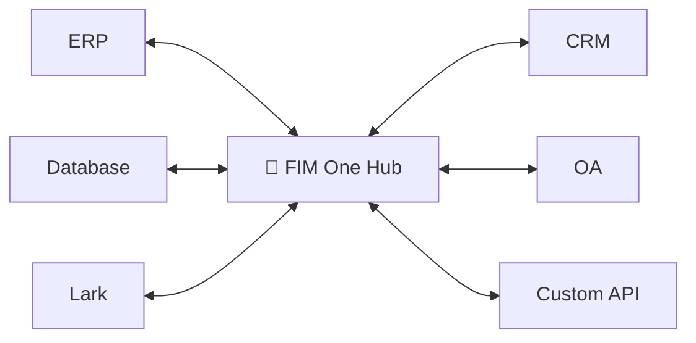
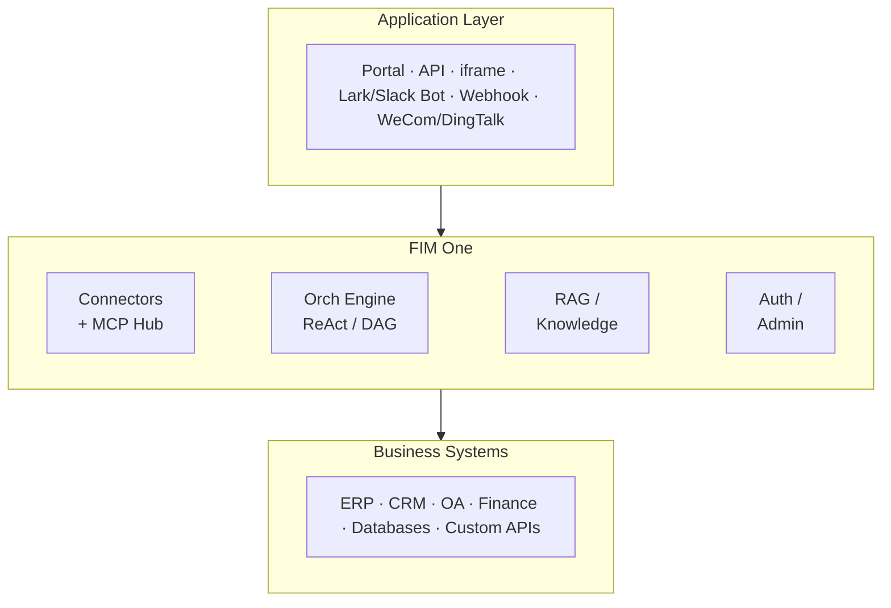

<div align="center">


[](https://github.com/fim-ai/fim-one/actions/workflows/test.yml)

[](https://discord.gg/z64czxdC7z)
[](https://x.com/FIM_One)

[🌐 English](README.md) | [🇨🇳 中文](README.zh.md) | [🇯🇵 日本語](README.ja.md) | [🇰🇷 한국어](README.ko.md) | [🇩🇪 Deutsch](README.de.md) | [🇫🇷 Français](README.fr.md)

**Ihre Systeme kommunizieren nicht miteinander. FIM One ist die KI-gestützte Brücke — als Copilot einbetten oder alle als Hub verbinden.**

🌐 [Website](https://one.fim.ai/) · 📖 [Dokumentation](https://docs.fim.ai) · 📋 [Changelog](https://docs.fim.ai/changelog) · 🐛 [Bug melden](https://github.com/fim-ai/fim-one/issues) · 💬 [Discord](https://discord.gg/z64czxdC7z) · 🐦 [Twitter](https://x.com/FIM_One) · 🏆 [Product Hunt](https://www.producthunt.com/products/fim-one)

</div>

> [!TIP]
> **☁️ Setup überspringen — probieren Sie FIM One in der Cloud.**
> Eine verwaltete Version ist live unter **[cloud.fim.ai](https://cloud.fim.ai/)**: kein Docker, keine API-Schlüssel, keine Konfiguration. Melden Sie sich an und verbinden Sie Ihre Systeme in Sekunden. _Early Access, Feedback willkommen._

---

## Übersicht

Jedes Unternehmen hat Systeme, die nicht miteinander kommunizieren — ERP, CRM, OA, Finanzen, HR, benutzerdefinierte Datenbanken. FIM One ist der **KI-gestützte Hub**, der sie alle verbindet, ohne Ihre vorhandene Infrastruktur zu ändern.

| Modus          | Was es ist                                              | Zugriff                 |
| -------------- | ------------------------------------------------------- | ----------------------- |
| **Standalone** | Universeller KI-Assistent — Suche, Code, KB            | Portal                  |
| **Copilot**    | KI eingebettet in die Benutzeroberfläche eines Systems  | iframe / widget / embed |
| **Hub**        | Zentrale KI-Orchestrierung über alle verbundenen Systeme | Portal / API            |



### Screenshots

**Dashboard** — Statistiken, Aktivitätstrends, Token-Nutzung und schneller Zugriff auf Agenten und Gespräche.


**Agent Chat** — ReAct-Reasoning mit mehrstufigen Tool-Aufrufen gegen eine verbundene Datenbank.


**DAG Planner** — LLM-generierter Ausführungsplan mit parallelen Schritten und Live-Statusverfolgung.


### Demo

**Agenten verwenden**


**Planer-Modus verwenden**


## Schnelleinstieg

### Docker (empfohlen)

```bash
git clone https://github.com/fim-ai/fim-one.git
cd fim-one

cp example.env .env
# Edit .env: set LLM_API_KEY (and optionally LLM_BASE_URL, LLM_MODEL)

docker compose up --build -d
```

Öffnen Sie http://localhost:3000 — beim ersten Start erstellen Sie ein Admin-Konto. Das war's.

```bash
docker compose up -d          # start
docker compose down           # stop
docker compose logs -f        # view logs
```

### Lokale Entwicklung

Voraussetzungen: Python 3.11+, [uv](https://docs.astral.sh/uv/), Node.js 18+, pnpm.

```bash
git clone https://github.com/fim-ai/fim-one.git && cd fim-one

cp example.env .env           # Edit: set LLM_API_KEY

uv sync --all-extras
cd frontend && pnpm install && cd ..

./start.sh dev                # hot reload: Python --reload + Next.js HMR
```

| Befehl           | Was wird gestartet                | URL                            |
| ---------------- | --------------------------------- | ------------------------------ |
| `./start.sh`     | Next.js + FastAPI                 | localhost:3000 (UI) + :8000    |
| `./start.sh dev` | Dasselbe, mit Hot Reload          | Dasselbe                       |
| `./start.sh api` | Nur FastAPI (headless)            | localhost:8000/api             |

> Für die Produktionsbereitstellung (Docker, Reverse Proxy, unterbrechungsfreie Updates) siehe das [Deployment-Handbuch](https://docs.fim.ai/quickstart#production-deployment).

## Hauptfunktionen

#### Connector-Hub
- **Drei Bereitstellungsmodi** — Eigenständiger Assistent, eingebetteter Copilot oder zentraler Hub; gleicher Agent-Kern.
- **Jedes System, ein Muster** — Verbinden Sie APIs, Datenbanken, MCP-Server. Aktionen werden automatisch als Agent-Tools mit Authentifizierungsinjektion registriert.
- **Datenbank-Konnektoren** — PostgreSQL, MySQL, Oracle, SQL Server, plus chinesische Legacy-Datenbanken (DM, KingbaseES, GBase, Highgo). Schema-Introspection und KI-gestützte Annotation.
- **Drei Wege zum Erstellen** — OpenAPI-Spezifikation importieren, KI-Chat-Builder oder MCP-Server direkt verbinden.

#### Planung & Ausführung
- **Dynamische DAG-Planung** — LLM zerlegt Ziele zur Laufzeit in Abhängigkeitsgraphen. Keine hartcodierten Workflows.
- **Parallele Ausführung** — Unabhängige Schritte laufen parallel über asyncio; automatische Neuplanung bis zu 3 Runden.
- **ReAct-Agent** — Strukturierte Reasoning-and-Acting-Schleife mit automatischer Fehlerwiederherstellung.
- **Automatisches Routing** — Klassifiziert Anfragen und leitet sie zum optimalen Modus weiter (ReAct oder DAG). Konfigurierbar über `AUTO_ROUTING`.
- **Extended Thinking** — Chain-of-Thought für OpenAI o-Serie, Gemini 2.5+, Claude.

#### Workflow & Tools
- **Visual workflow editor** — 12 Knotentypen, Drag-and-Drop-Canvas (React Flow v12), Import/Export als JSON.
- **Smart file handling** — Hochgeladene Dateien werden automatisch in den Kontext eingefügt (klein) oder können bei Bedarf über das Tool `read_uploaded_file` mit paginierten und Regex-Suchmodi gelesen werden.
- **Pluggable tools** — Python, Node.js, Shell-Ausführung mit optionalem Docker-Sandbox (`CODE_EXEC_BACKEND=docker`).
- **Full RAG pipeline** — Jina Embedding + LanceDB + Hybrid-Retrieval + Reranker + Inline-Zitate `[N]`.
- **Tool artifacts** — Rich Outputs (HTML-Vorschau, Dateien) werden im Chat gerendert.

#### Plattform
- **Multi-Mandant** — JWT-Authentifizierung, Organisationsisolation, Admin-Panel mit Nutzungsanalysen und Connector-Metriken.
- **Marketplace** — Veröffentlichen und Abonnieren von Agenten, Connectoren, Wissensdatenbanken, Skills und Workflows.
- **Globale Skills (SOPs)** — Wiederverwendbare Betriebsverfahren, die für jeden Benutzer geladen werden; progressiver Modus reduziert Token um ~80%.
- **6 Sprachen** — EN, ZH, JA, KO, DE, FR. Übersetzungen sind [vollständig automatisiert](https://docs.fim.ai/quickstart#internationalization).
- **Einrichtungsassistent beim ersten Start**, dunkles/helles Design, Befehlspalette, Streaming SSE, DAG-Visualisierung.

> Tiefergehende Informationen: [Architektur](https://docs.fim.ai/architecture/system-overview) · [Ausführungsmodi](https://docs.fim.ai/concepts/execution-modes) · [Warum FIM One](https://docs.fim.ai/why) · [Wettbewerbslandschaft](https://docs.fim.ai/strategy/competitive-landscape)

## Architektur



Jeder Konnektor ist eine standardisierte Schnittstelle — der Agent muss nicht wissen oder sich darum kümmern, ob er mit SAP oder einer benutzerdefinierten Datenbank kommuniziert. Weitere Details finden Sie unter [Konnektor-Architektur](https://docs.fim.ai/architecture/connector-architecture).

## Konfiguration

FIM One funktioniert mit **jedem OpenAI-kompatiblen Anbieter**:

| Anbieter           | `LLM_API_KEY` | `LLM_BASE_URL`                 | `LLM_MODEL`         |
| ------------------ | ------------- | ------------------------------ | -------------------- |
| **OpenAI**         | `sk-...`      | *(Standard)*                   | `gpt-4o`             |
| **DeepSeek**       | `sk-...`      | `https://api.deepseek.com/v1`  | `deepseek-chat`      |
| **Anthropic**      | `sk-ant-...`  | `https://api.anthropic.com/v1` | `claude-sonnet-4-6`  |
| **Ollama** (lokal) | `ollama`      | `http://localhost:11434/v1`    | `qwen2.5:14b`        |

Minimale `.env`:

```bash
LLM_API_KEY=sk-your-key
# LLM_BASE_URL=https://api.openai.com/v1   # default
# LLM_MODEL=gpt-4o                         # default
JINA_API_KEY=jina_...                       # unlocks web tools + RAG
```

> Vollständige Referenz: [Umgebungsvariablen](https://docs.fim.ai/configuration/environment-variables)

## Tech-Stack

| Layer       | Technologie                                                         |
| ----------- | ------------------------------------------------------------------- |
| Backend     | Python 3.11+, FastAPI, SQLAlchemy, Alembic, asyncio                 |
| Frontend    | Next.js 14, React 18, Tailwind CSS, shadcn/ui, React Flow v12      |
| AI / RAG    | OpenAI-kompatible LLMs, Jina AI (embed + search), LanceDB           |
| Datenbank   | SQLite (dev) / PostgreSQL (prod)                                    |
| Infra       | Docker, uv, pnpm, SSE streaming                                    |

## Entwicklung

```bash
uv sync --all-extras          # install dependencies
pytest                         # run tests
pytest --cov=fim_one           # with coverage
ruff check src/ tests/         # lint
mypy src/                      # type check
bash scripts/setup-hooks.sh    # install git hooks (enables auto i18n)
```

## Roadmap

Siehe die vollständige [Roadmap](https://docs.fim.ai/roadmap) für Versionshistorie und geplante Funktionen.

## Häufig gestellte Fragen

Häufig gestellte Fragen zu Bereitstellung, LLM-Anbietern, Systemanforderungen und mehr – siehe [Häufig gestellte Fragen](https://docs.fim.ai/faq).

## Beitragen

Wir freuen uns über Beiträge aller Art — Code, Dokumentation, Übersetzungen, Fehlermeldungen und Ideen.

> **Pioneer Program**: Die ersten 100 Mitwirkenden, deren PR zusammengeführt wird, werden als **Gründungsbeiträger** mit permanenten Credits, einem Badge und prioritärer Issue-Unterstützung anerkannt. [Mehr erfahren &rarr;](CONTRIBUTING.md#-pioneer-program)

**Schnelllinks:**

- [**Beitragsleitfaden**](CONTRIBUTING.md) — Setup, Konventionen, PR-Prozess
- [**Gute erste Issues**](https://github.com/fim-ai/fim-one/labels/good%20first%20issue) — kuratiert für Anfänger
- [**Offene Issues**](https://github.com/fim-ai/fim-one/issues) — Fehler & Feature-Anfragen

**Sicherheit:** Um eine Sicherheitslücke zu melden, öffnen Sie bitte ein [GitHub Issue](https://github.com/fim-ai/fim-one/issues) mit dem Tag `[SECURITY]`. Für vertrauliche Offenlegungen kontaktieren Sie uns über Discord DM.

## Stern-Verlauf

<a href="https://star-history.com/#fim-ai/fim-one&Date">
  <picture>
    <source media="(prefers-color-scheme: dark)" srcset="https://api.star-history.com/svg?repos=fim-ai/fim-one&type=Date&theme=dark" />
    <source media="(prefers-color-scheme: light)" srcset="https://api.star-history.com/svg?repos=fim-ai/fim-one&type=Date" />
    
  </picture>
</a>

## Aktivität


## Mitwirkende

Danke an diese wunderbaren Menschen ([Emoji-Schlüssel](https://allcontributors.org/docs/en/emoji-key)):

<!-- ALL-CONTRIBUTORS-LIST:START - Do not remove or modify this section -->
<!-- prettier-ignore-start -->
<!-- markdownlint-disable -->
<!-- markdownlint-restore -->
<!-- prettier-ignore-end -->
<!-- ALL-CONTRIBUTORS-LIST:END -->

[](https://github.com/fim-ai/fim-one/graphs/contributors)

Dieses Projekt folgt der [all-contributors](https://allcontributors.org/)-Spezifikation. Beiträge jeglicher Art sind willkommen!

## Lizenz

FIM One Source Available License. Dies ist **keine** von der OSI genehmigte Open-Source-Lizenz.

**Erlaubt**: interne Nutzung, Änderung, Verteilung mit intakter Lizenz, Einbettung in nicht konkurrierende Anwendungen.

**Eingeschränkt**: Multi-Tenant-SaaS, konkurrierende Agent-Plattformen, White-Labeling, Entfernung von Branding.

Für Anfragen zur kommerziellen Lizenzierung öffnen Sie bitte ein Issue auf [GitHub](https://github.com/fim-ai/fim-one).

Siehe [LICENSE](LICENSE) für vollständige Bedingungen.

---

<div align="center">

🌐 [Website](https://one.fim.ai/) · 📖 [Docs](https://docs.fim.ai) · 📋 [Changelog](https://docs.fim.ai/changelog) · 🐛 [Bug melden](https://github.com/fim-ai/fim-one/issues) · 💬 [Discord](https://discord.gg/z64czxdC7z) · 🐦 [Twitter](https://x.com/FIM_One) · 🏆 [Product Hunt](https://www.producthunt.com/products/fim-one)

</div>
