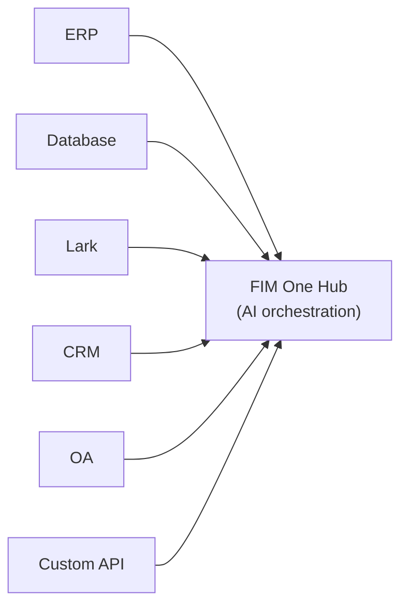

<div align="center">


[](https://github.com/fim-ai/fim-one/stargazers)
[](https://github.com/fim-ai/fim-one/network)
[](https://github.com/fim-ai/fim-one/issues)
[](https://x.com/FIM_One)
[](https://discord.gg/z64czxdC7z)
[](https://www.producthunt.com/products/fim-one)

[🌐 English](README.md) | [🇨🇳 中文](README.zh.md) | [🇯🇵 日本語](README.ja.md) | [🇰🇷 한국어](README.ko.md) | [🇩🇪 Deutsch](README.de.md) | [🇫🇷 Français](README.fr.md)

**KI-gesteuerte Connector-Hub — als Copilot in ein System einbetten oder alle als Hub verbinden.**

🌐 [Website](https://one.fim.ai/) · 📖 [Dokumentation](https://docs.fim.ai) · 📋 [Changelog](https://docs.fim.ai/changelog) · 🐛 [Bug melden](https://github.com/fim-ai/fim-one/issues) · 💬 [Discord](https://discord.gg/z64czxdC7z) · 🐦 [Twitter](https://x.com/FIM_One) · 🏆 [Product Hunt](https://www.producthunt.com/products/fim-one)

</div>

> [!TIP]
> **☁️ Setup überspringen — FIM One in der Cloud testen.**
> Eine verwaltete Version ist live unter **[cloud.fim.ai](https://cloud.fim.ai/)**: kein Docker, keine API-Schlüssel, keine Konfiguration. Melden Sie sich an und verbinden Sie Ihre Systeme in Sekunden. _Early Access, Feedback willkommen._

---

## Inhaltsverzeichnis

- [Übersicht](#overview)
- [Anwendungsfälle](#use-cases)
- [Warum FIM One](#why-fim-one)
- [Wo FIM One eingeordnet wird](#where-fim-one-sits)
- [Hauptfunktionen](#key-features)
- [Architektur](#architecture)
- [Schnellstart](#quick-start) (Docker / Lokal / Produktion)
- [Konfiguration](#configuration)
- [Entwicklung](#development)
- [Roadmap](#roadmap)
- [Beitragen](#contributing)
- [Star-Verlauf](#star-history)
- [Aktivität](#activity)
- [Mitwirkende](#contributors)
- [Lizenz](#license)## Übersicht

FIM One ist ein anbieterunabhängiges Python-Framework zum Erstellen von AI-Agenten, die komplexe Aufgaben dynamisch planen und ausführen. Das Besondere ist die **Connector Hub**-Architektur — drei Liefermodi, ein Agent-Kern:

| Modus           | Was es ist                                                                       | Wie Sie darauf zugreifen                       |
| -------------- | -------------------------------------------------------------------------------- | --------------------------------------- |
| **Standalone** | Universeller AI-Assistent — Suche, Code, Wissensdatenbank                      | Portal                                  |
| **Copilot**    | AI eingebettet in ein Host-System — funktioniert neben Benutzern in ihrer bestehenden UI        | iframe / Widget / Einbettung in Host-Seiten |
| **Hub**        | Zentrale AI-Orchestrierung — alle Ihre Systeme verbunden, systemübergreifende Intelligenz | Portal / API                            |



Der Kern ist immer gleich: ReAct-Reasoning-Schleifen, dynamische DAG-Planung mit gleichzeitiger Ausführung, austauschbare Tools und eine protokollorientierte Architektur ohne Vendor Lock-in.### Agents verwenden

### Planner Mode verwenden

## Anwendungsfälle

Unternehmensdaten und Workflows sind in OA-, ERP-, Finanz- und Genehmigungssystemen gesperrt. FIM One ermöglicht es KI-Agenten, diese Systeme zu lesen und zu schreiben – und automatisiert systemübergreifende Prozesse, ohne Ihre bestehende Infrastruktur zu ändern.

| Szenario                  | Empfohlener Start | Was automatisiert wird                                                                                                |
| ------------------------- | ----------------- | ---------------------------------------------------------------------------------------------------------------- |
| **Recht & Compliance**    | Copilot → Hub     | Vertragsklausel-Extraktion, Versionsdiff, Risikoflagging mit Quellenangaben, automatische OA-Genehmigung auslösen          |
| **IT-Betrieb**         | Hub               | Warnung wird ausgelöst → Logs abgerufen → Grundursache analysiert → Fix an Lark/Slack versendet — eine geschlossene Schleife                 |
| **Geschäftsbetrieb**   | Copilot           | Geplante Datenzusammenfassungen an Team-Kanäle gepusht; Ad-hoc-Abfragen in natürlicher Sprache gegen Live-Datenbanken         |
| **Finanzautomation**    | Hub               | Rechnungsverifizierung, Spesenfreigabe-Routing, Ledger-Abstimmung über ERP- und Buchhaltungssysteme          |
| **Beschaffung**           | Copilot → Hub     | Anforderungen → Lieferantenvergleich → Vertragsentwurf → Genehmigung — Agent verwaltet die systemübergreifenden Handoffs           |
| **Entwickler-Integration** | API               | OpenAPI-Spezifikation importieren oder API im Chat beschreiben – Connector wird in Minuten erstellt, automatisch als Agent-Tools registriert |## Warum FIM One### Land and Expand

Beginnen Sie damit, einen **Copilot** in ein System einzubetten — beispielsweise in Ihr ERP. Benutzer interagieren mit KI direkt in ihrer vertrauten Oberfläche: Abfragen von Finanzdaten, Generierung von Berichten, Beantwortung von Fragen ohne die Seite zu verlassen.

Wenn der Nutzen nachgewiesen ist, richten Sie einen **Hub** ein — ein zentrales Portal, das alle Ihre Systeme verbindet. Der ERP-Copilot läuft weiterhin eingebettet; der Hub fügt systemübergreifende Orchestrierung hinzu: Verträge in CRM abfragen, Genehmigungen in OA prüfen, Stakeholder auf Lark benachrichtigen — alles von einem Ort aus.

Copilot beweist seinen Wert in einem System. Hub erschließt Wert über alle Systeme hinweg.### Was FIM One NICHT tut

FIM One repliziert keine Workflow-Logik, die bereits in Ihren Zielsystemen vorhanden ist:

- **Keine BPM/FSM-Engine** — Genehmigungsketten, Routing, Eskalation und State Machines sind Aufgabe des Zielsystems. Diese Systeme haben Jahre damit verbracht, diese Logik zu entwickeln.
- **Keine BPM/FSM-Workflow-Engine** — Die Workflow Blueprints von FIM One sind Automatisierungsvorlagen (LLM-Aufrufe, Bedingungsverzweigungen, Connector-Aktionen), keine Business-Process-Management-Systeme. Genehmigungsketten, Routing-Regeln und State Machines gehören in das Zielsystem.
- **Connector = API-Aufruf** — Aus der Perspektive des Connectors ist „Genehmigung übertragen" = ein API-Aufruf, „mit Grund ablehnen" = ein API-Aufruf. Alle komplexen Workflow-Operationen reduzieren sich auf HTTP-Anfragen. FIM One ruft die API auf; das Zielsystem verwaltet den Status.

Dies ist eine bewusste architektonische Grenze, keine Funktionslücke.

### Wettbewerbspositionierung

|                        | Dify                       | Manus            | Coze                  | FIM One                      |
| ---------------------- | -------------------------- | ---------------- | --------------------- | ---------------------------- |
| **Approach**           | Visual workflow builder    | Autonomous agent | Builder + agent space | AI Connector Hub             |
| **Planning**           | Human-designed static DAGs | Multi-agent CoT  | Static + dynamic      | LLM DAG planning + ReAct     |
| **Cross-system**       | API nodes (manual)         | No               | Plugin marketplace    | Hub Mode (N:N orchestration) |
| **Human Confirmation** | No                         | No               | No                    | Yes (pre-execution gate)     |
| **Self-hosted**        | Yes (Docker stack)         | No               | Yes (Coze Studio)     | Yes (single process)         |

> Tiefere Einblicke: [Philosophy](https://docs.fim.ai/architecture/philosophy) | [Execution Modes](https://docs.fim.ai/concepts/execution-modes) | [Competitive Landscape](https://docs.fim.ai/strategy/competitive-landscape)### Wo FIM One sich einordnet

```
                Static Execution          Dynamic Execution
            ┌──────────────────────┬──────────────────────┐
 Static     │ BPM / Workflow       │ ACM                  │
 Planning   │ Camunda, Activiti    │ (Salesforce Case)    │
            │ Dify, n8n, Coze     │                      │
            ├──────────────────────┼──────────────────────┤
 Dynamic    │ (transitional —      │ Autonomous Agent     │
 Planning   │  unstable quadrant)  │ AutoGPT, Manus       │
            │                      │ ★ FIM One (bounded)│
            └──────────────────────┴──────────────────────┘
```

Dify/n8n sind **Static Planning + Static Execution** — Menschen entwerfen die DAG auf einer visuellen Leinwand, Knoten führen feste Operationen aus. FIM One ist **Dynamic Planning + Dynamic Execution** — das LLM generiert die DAG zur Laufzeit, jeder Knoten führt eine ReAct-Schleife aus, mit Neuplanung wenn Ziele nicht erreicht werden. Aber begrenzt (max. 3 Neuplanungsrunden, Token-Budgets, Bestätigungsgates), daher kontrollierter als AutoGPT.

FIM One führt kein BPM/FSM durch — Workflow-Logik gehört zum Zielsystem, Connectors rufen nur APIs auf.

> Vollständige Erklärung: [Philosophy](https://docs.fim.ai/architecture/philosophy)## Hauptfunktionen#### Connector-Plattform (der Kern)
- **Connector Hub-Architektur** — Standalone-Assistent, eingebetteter Copilot oder zentraler Hub — gleicher Agent-Kern, unterschiedliche Bereitstellung.
- **Beliebiges System, ein Muster** — Verbinden Sie APIs, Datenbanken und Message Buses. Aktionen registrieren sich automatisch als Agent-Tools mit Auth-Injection (Bearer, API Key, Basic).
- **Datenbank-Connectoren** — Direkter SQL-Zugriff auf PostgreSQL, MySQL, Oracle, SQL Server und chinesische Legacy-Datenbanken (DM, KingbaseES, GBase, Highgo). Schema-Introspection, KI-gestützte Annotation, schreibgeschützte Abfrageausführung und verschlüsselte Anmeldedaten im Ruhezustand. Jeder DB-Connector generiert automatisch 3 Tools (`list_tables`, `describe_table`, `query`).
- **Drei Möglichkeiten zum Erstellen von Connectoren:**
  - *OpenAPI-Spezifikation importieren* — YAML/JSON/URL hochladen; Connectoren und alle Aktionen werden automatisch generiert.
  - *KI-Chat-Builder* — beschreiben Sie die API in natürlicher Sprache; KI generiert und iteriert die Aktionskonfiguration im Gespräch. 10 spezialisierte Builder-Tools handhaben Connector-Einstellungen, Aktionen, Tests und Agent-Verdrahtung.
  - *MCP-Ökosystem* — verbinden Sie jeden MCP-Server direkt; die MCP-Community von Drittanbietern funktioniert sofort.#### Intelligente Planung & Ausführung
- **Dynamic DAG Planning** — LLM zerlegt Ziele zur Laufzeit in Abhängigkeitsgraphen. Keine hartcodierten Workflows.
- **Concurrent Execution** — Unabhängige Schritte laufen parallel über asyncio.
- **DAG Re-Planning** — Überarbeitet den Plan automatisch bis zu 3 Runden, wenn Ziele nicht erreicht werden.
- **ReAct Agent** — Strukturierte Reasoning-and-Acting-Schleife mit automatischer Fehlerwiederherstellung.
- **Auto-Routing** — Automatische Abfrageklassifizierung leitet jede Anfrage zum optimalen Ausführungsmodus (ReAct oder DAG). Frontend unterstützt 3-Wege-Umschalter (Auto/Standard/Planner). Konfigurierbar über `AUTO_ROUTING`.
- **Extended Thinking** — Aktiviert Chain-of-Thought-Reasoning für unterstützte Modelle (OpenAI o-series, Gemini 2.5+, Claude) über `LLM_REASONING_EFFORT`. Das Reasoning des Modells wird im UI-Schritt "thinking" angezeigt.#### Workflow-Blaupausen
- **Visual Workflow Editor** — Entwerfen Sie mehrstufige Automatisierungs-Blaupausen mit einer Drag-and-Drop-Canvas basierend auf React Flow v12. 12 Knotentypen: Start, End, LLM, Condition Branch, Question Classifier, Agent, Knowledge Retrieval, Connector, HTTP Request, Variable Assign, Template Transform, Code Execution.
- **Topological Execution Engine** — Workflows führen Knoten in Abhängigkeitsreihenfolge aus mit Bedingungsverzweigung, knotenübergreifender Variablenweitergabe und Echtzeit-SSE-Status-Streaming.
- **Import/Export** — Teilen Sie Workflow-Blaupausen als JSON. Verschlüsselte Umgebungsvariablen für sichere Anmeldedatenverwaltung.

#### Tools & Integrations
- **Pluggable Tool System** — Automatische Erkennung; wird mit Python-Executor, Node.js-Executor, Rechner, Websuche/Abruf, HTTP-Anfrage, Shell-Ausführung und mehr ausgeliefert.
- **Pluggable Sandbox** — `python_exec` / `node_exec` / `shell_exec` werden im lokalen oder Docker-Modus (`CODE_EXEC_BACKEND=docker`) mit Isolation auf Betriebssystemebene (`--network=none`, `--memory=256m`) ausgeführt. Sicher für SaaS- und Multi-Tenant-Bereitstellungen.
- **MCP Protocol** — Verbinden Sie jeden MCP-Server als Tools. Das Ökosystem von Drittanbieter-MCP funktioniert sofort.
- **Tool Artifact System** — Tools erzeugen umfangreiche Ausgaben (HTML-Vorschauen, generierte Dateien) mit In-Chat-Rendering und Download. HTML-Artefakte werden in Sandbox-iframes gerendert; Datei-Artefakte zeigen Download-Chips an.
- **OpenAI-Compatible** — Funktioniert mit jedem `/v1/chat/completions`-Anbieter (OpenAI, DeepSeek, Qwen, Ollama, vLLM…).#### RAG & Knowledge
- **Full RAG Pipeline** — Jina embedding + LanceDB + FTS + RRF hybrid retrieval + reranker. Unterstützt PDF, DOCX, Markdown, HTML, CSV.
- **Grounded Generation** — Evidence-anchored RAG mit Inline-`[N]`-Zitaten, Konflikt-Erkennung und erklärbaren Konfidenzwerten.
- **KB Document Management** — Chunk-Level CRUD, Textsuche über Chunks, Wiederholung fehlgeschlagener Dokumente und automatisch migrierendes Vector-Store-Schema.#### Portal & UX
- **Real-time Streaming (SSE v2)** — Split event protocol (`done` / `suggestions` / `title` / `end`) mit Streaming-Punkt-Puls-Cursor, KaTeX-Mathematik-Rendering und Tool-Schritt-Faltung.
- **DAG Visualization** — Interaktiver Flussgraph mit Live-Status, Abhängigkeitskanten, Klick-zum-Scrollen und Re-Plan-Runden-Snapshots als zusammenklappbare Karten.
- **Conversational Interrupt** — Senden Sie Folgefragen, während der Agent läuft; eingefügt an der nächsten Iterationsgrenze.
- **Dark / Light / System Theme** — Vollständige Theme-Unterstützung mit Systemeinstellungs-Erkennung.
- **Command Palette** — Konversationssuche, Favoriten, Batch-Operationen und Titel-Umbenennung.#### Plattform & Multi-Mandantenfähigkeit
- **JWT Auth** — Token-basierte SSE-Authentifizierung, Gesprächseigentümerschaft, Ressourcenisolation pro Benutzer.
- **Agent-Verwaltung** — Erstellen, konfigurieren und veröffentlichen Sie Agenten mit gebundenen Modellen, Tools und Anweisungen. Ausführungsmodus pro Agent (Standard/Planner) und Temperaturkontrolle. Das optionale Flag `discoverable` ermöglicht die automatische LLM-Erkennung über CallAgentTool.
- **Agent-Fähigkeitensystem** — Progressive Anweisungsladung für Agenten. Fähigkeiten (SOPs, Skripte, Domänenwissen) werden im System-Prompt als leichte Stubs (~15 Token pro Stück) referenziert; Agenten rufen `read_skill(name)` auf, um vollständige Inhalte bei Bedarf zu laden, wodurch die Anweisungs-Token-Kosten pro Gespräch um ~80% reduziert werden. Feld `compact_instructions` pro Agent für benutzerdefinierte ContextGuard-Kompaktierungsstrategie.
- **Plattform-Organisation** — Integrierte `platform`-Organisation tritt automatisch allen Benutzern bei und ersetzt das veraltete Konzept der „globalen" Sichtbarkeit. Zentraler Hub zum Teilen von Ressourcen (Agenten, Konnektoren, Wissensdatenbanken, MCP-Server) in der gesamten Organisation.
- **Ressourcen-Abos & Marktplatz** — Benutzer durchsuchen und abonnieren gemeinsam genutzte Ressourcen aus dem Organisations-Marktplatz. Abonnieren/Abmelden über UI oder API. Alle Ressourcentypen unterstützen Veröffentlichung und Abonnementverwaltung auf Organisationsebene.
- **Admin-Panel** — System-Statistik-Dashboard (Benutzer, Gespräche, Token, Modellnutzungsdiagramme, Token-nach-Agent-Aufschlüsselung), Konnektor-Aufrufsmetriken (Erfolgsquote, Latenz, Aufrufsanzahl), Benutzerverwaltung mit Suche/Paginierung, Rollenwechsel, Passwort-Zurücksetzen, Konto aktivieren/deaktivieren und Steuerelemente zum Aktivieren/Deaktivieren pro Tool.
- **First-Run-Setup-Assistent** — Beim ersten Start führt Sie das Portal durch die Erstellung eines Admin-Kontos (Benutzername, Passwort, E-Mail). Dieses einmalige Setup wird zu Ihren Anmeldedaten – keine Konfigurationsdateien erforderlich.
- **Persönliches Zentrum** — Globale Systemanweisungen pro Benutzer, angewendet auf alle Gespräche.
- **Spracheinstellung** — Spracheinstellung pro Benutzer (auto/en/zh), die alle LLM-Antworten in die gewählte Sprache lenkt.

#### Kontext & Speicher
- **LLM Compact** — Automatische LLM-gestützte Zusammenfassung, um innerhalb von Token-Budgets zu bleiben.
- **ContextGuard + Pinned Messages** — Token-Budget-Manager; angeheftete Nachrichten sind vor Komprimierung geschützt.
- **Dual Database Support** — SQLite (Standard ohne Konfiguration) für schnelle Inbetriebnahme in Sekunden; PostgreSQL für Production und Multi-Worker-Deployments. Docker Compose stellt PostgreSQL automatisch mit Health Checks bereit. `docker compose up` und du bist live.## Architektur### Systemübersicht

```mermaid
graph TB
    subgraph app["Application & Interaction Layer"]
        a["Portal · API · iframe · Lark/Slack Bot · Webhook · WeCom/DingTalk"]
    end
    subgraph mid["FIM One Middleware"]
        direction LR
        m1["Connectors<br/>+ MCP Hub"] ~~~ m2["Orch Engine<br/>ReAct / DAG"] ~~~ m3["RAG /<br/>Knowledge"] ~~~ m4["Auth /<br/>Admin"]
    end
    subgraph biz["Business Systems & Data Layer"]
        b["ERP · CRM · OA · Finance · Databases · Custom APIs<br/>Lark · DingTalk · WeCom · Slack · Email · Webhook"]
    end
    app --> mid --> biz
```### Connector Hub

```mermaid
graph LR
    ERP["ERP<br/>(SAP/Kingdee)"] --> A
    CRM["CRM<br/>(Salesforce)"] --> B
    OA["OA<br/>(Seeyon/Weaver)"] --> C
    DB["Custom DB<br/>(PG/MySQL)"] --> D
    subgraph Hub["FIM One Hub"]
        A["Agent A: Finance Audit"]
        B["Agent B: Contract Review"]
        C["Agent C: Approval Assist"]
        D["Agent D: Data Reporting"]
    end
    A --> O1["Lark / Slack"]
    B --> O2["Email / WeCom"]
    C --> O3["Teams / Webhook"]
    D --> O4["Any API"]
```

*Portal / API / iframe*

Jeder Connector ist eine standardisierte Brücke — der Agent weiß nicht und kümmert sich nicht darum, ob er mit SAP oder einer benutzerdefinierten PostgreSQL-Datenbank spricht. Weitere Informationen finden Sie unter [Connector Architecture](https://docs.fim.ai/architecture/connector-architecture).### Interne Ausführung

FIM One bietet zwei Ausführungsmodi mit automatischem Routing zwischen ihnen:

| Modus        | Am besten für             | Funktionsweise                                                     |
| ------------ | ------------------------- | ------------------------------------------------------------------ |
| Auto         | Alle Abfragen (Standard)  | Schnelles LLM klassifiziert die Abfrage und leitet zu ReAct oder DAG weiter |
| ReAct        | Einzelne komplexe Abfragen| Reason → Act → Observe Loop mit Tools                             |
| DAG Planning | Multi-Step parallele Aufgaben | LLM generiert Abhängigkeitsgraph, unabhängige Schritte laufen gleichzeitig |

```mermaid
graph TB
    Q[User Query] --> P["DAG Planner<br/>LLM decomposes the goal into steps + dependency edges"]
    P --> E["DAG Executor<br/>Launches independent steps concurrently via asyncio<br/>Each step is handled by a ReAct Agent"]
    E --> R1["ReAct Agent 1 → Tools<br/>(python_exec, custom, ...)"]
    E --> R2["ReAct Agent 2 → RAG<br/>(retriever interface)"]
    E --> RN["ReAct Agent N → ..."]
    R1 & R2 & RN --> An["Plan Analyzer<br/>LLM evaluates results · re-plans if goal not met"]
    An --> F[Final Answer]
```## Schnelleinstieg### Option A: Docker (empfohlen)

Keine lokale Python- oder Node.js-Installation erforderlich – alles wird im Container erstellt.

```bash
git clone https://github.com/fim-ai/fim-one.git
cd fim-one
```# Konfigurieren — nur LLM_API_KEY ist erforderlich
cp example.env .env# Bearbeiten Sie .env: Setzen Sie LLM_API_KEY (und optional LLM_BASE_URL, LLM_MODEL)# Build and run (first time, or after pulling new code)
docker compose up --build -d
```

Öffnen Sie http://localhost:3000 — beim ersten Start werden Sie durch die Erstellung eines Admin-Kontos geführt. Das war's.

Nach dem initialen Build benötigen nachfolgende Starts nur:

```bash
docker compose up -d          # start (skip rebuild if image unchanged)
docker compose down           # stop
docker compose logs -f        # view logs
```

Daten werden in Docker Named Volumes (`fim-data`, `fim-uploads`) persistiert und bleiben bei Container-Neustarts erhalten.

> **Hinweis:** Der Docker-Modus unterstützt kein Hot Reload. Code-Änderungen erfordern ein Neuaufbau des Images (`docker compose up --build -d`). Für aktive Entwicklung mit Live Reload verwenden Sie **Option B** unten.### Option B: Lokale Entwicklung

Voraussetzungen: Python 3.11+, [uv](https://docs.astral.sh/uv/), Node.js 18+, pnpm.

```bash
git clone https://github.com/fim-ai/fim-one.git
cd fim-one

cp example.env .env
```# .env bearbeiten: LLM_API_KEY setzen# Installation
uv sync --all-extras
cd frontend && pnpm install && cd ..# Starten (mit Hot Reload)
./start.sh dev
```

| Befehl           | Was wird gestartet                                      | URL                                      |
| ---------------- | ------------------------------------------------------- | ---------------------------------------- |
| `./start.sh`     | Next.js + FastAPI                                       | http://localhost:3000 (UI) + :8000 (API) |
| `./start.sh dev` | Dasselbe, mit Hot Reload (Python `--reload` + Next.js HMR) | Dasselbe                                 |
| `./start.sh api` | Nur FastAPI (headless, für Integration oder Tests)      | http://localhost:8000/api                |### Produktionsbereitstellung

Beide Optionen funktionieren in der Produktion:

| Methode    | Befehl                 | Am besten für                               |
| ---------- | ---------------------- | ------------------------------------------- |
| **Docker** | `docker compose up -d` | Wartungsfreie Bereitstellung, einfache Updates |
| **Script** | `./start.sh`           | Bare-Metal-Server, benutzerdefinierte Prozessmanager |

Für beide Methoden einen Nginx-Reverse-Proxy davor für HTTPS und benutzerdefinierte Domain:

```
User → Nginx (443/HTTPS) → localhost:3000
```

Die API läuft intern auf Port 8000 — Next.js leitet `/api/*`-Anfragen automatisch weiter. Nur Port 3000 muss freigelegt werden.

**Aktualisierung einer laufenden Bereitstellung** (ohne Ausfallzeit):

```bash
cd /path/to/fim-one \
  && git pull origin master \
  && sudo docker compose build \
  && sudo docker compose up -d \
  && sudo docker image prune -f
```

`build` wird zuerst ausgeführt, während alte Container weiterhin Traffic bedienen. `up -d` ersetzt dann nur die Container, deren Image sich geändert hat — die Ausfallzeit beträgt ~10 Sekunden statt Minuten.

Wenn Sie die Code-Ausführungs-Sandbox verwenden (`CODE_EXEC_BACKEND=docker`), mounten Sie den Docker-Socket:

```yaml
# docker-compose.yml
volumes:
  - /var/run/docker.sock:/var/run/docker.sock
```## Konfiguration### Empfohlenes Setup

FIM One funktioniert mit **jedem OpenAI-kompatiblen LLM-Anbieter** — OpenAI, DeepSeek, Anthropic, Qwen, Ollama, vLLM und mehr. Wählen Sie den aus, der Ihnen am besten gefällt:

| Anbieter           | `LLM_API_KEY` | `LLM_BASE_URL`                 | `LLM_MODEL`         |
| ------------------ | ------------- | ------------------------------ | ------------------- |
| **OpenAI**         | `sk-...`      | *(Standard)*                   | `gpt-4o`            |
| **DeepSeek**       | `sk-...`      | `https://api.deepseek.com/v1`  | `deepseek-chat`     |
| **Anthropic**      | `sk-ant-...`  | `https://api.anthropic.com/v1` | `claude-sonnet-4-6` |
| **Ollama** (lokal) | `ollama`      | `http://localhost:11434/v1`    | `qwen2.5:14b`       |

**[Jina AI](https://jina.ai/)** ermöglicht Websuche/Abruf, Einbettung und die vollständige RAG-Pipeline (kostenlos erhältlich).

Minimale `.env`:

```bash
LLM_API_KEY=sk-your-key
```# LLM_BASE_URL=https://api.openai.com/v1   # Standard — für andere Anbieter ändern# LLM_MODEL=gpt-4o                         # Standard — für andere Modelle ändern

JINA_API_KEY=jina_...                       # entsperrt Web-Tools + RAG
```### Alle Variablen

Siehe die vollständige [Environment Variables](https://docs.fim.ai/configuration/environment-variables) Referenz für alle Konfigurationsoptionen (LLM, Agent-Ausführung, Web-Tools, RAG, Code-Ausführung, Bildgenerierung, Connectors, Plattform, OAuth).## Entwicklung

```bash


```# Installieren Sie alle Abhängigkeiten (einschließlich Dev-Extras)
uv sync --all-extras# Tests ausführen
pytest# Tests mit Coverage ausführen
pytest --cov=fim_one --cov-report=term-missing# Lint
ruff check src/ tests/# Typprüfung
mypy src/# Git Hooks installieren (einmalig nach dem Klonen ausführen — aktiviert automatische i18n-Übersetzung beim Commit)
```bash
bash scripts/setup-hooks.sh
```## Internationalisierung (i18n)

FIM One unterstützt **6 Sprachen**: English, Chinese, Japanese, Korean, German und French. Übersetzungen sind vollständig automatisiert — Sie müssen nur die englischen Quelldateien bearbeiten.

**Unterstützte Sprachen**: `en` `zh` `ja` `ko` `de` `fr`

| Was | Quelle (bearbeiten Sie dies) | Automatisch generiert (nicht bearbeiten) |
|------|--------------------|-----------------------------|
| UI-Strings | `frontend/messages/en/*.json` | `frontend/messages/{locale}/*.json` |
| Dokumentation | `docs/*.mdx` | `docs/{locale}/*.mdx` |
| README | `README.md` | `README.{locale}.md` |

**Funktionsweise**: Ein Pre-Commit-Hook erkennt Änderungen an englischen Dateien und übersetzt sie über das Fast LLM des Projekts. Übersetzungen sind inkrementell — nur neue, geänderte oder gelöschte Inhalte werden verarbeitet.

```bash# Setup (einmalig nach dem Klonen ausführen)
bash scripts/setup-hooks.sh# Vollständige Übersetzung (erstmals oder nach Hinzufügen eines neuen Gebietsschemas)
uv run scripts/translate.py --all# Spezifische Dateien übersetzen
uv run scripts/translate.py --files frontend/messages/en/common.json# Zielgebietsschemas überschreiben
uv run scripts/translate.py --all --locale ja ko# Erhöhen Sie parallele API-Aufrufe (Standard: 3, erhöhen Sie, wenn Ihre API dies zulässt)
uv run scripts/translate.py --all --concurrency 10# Täglicher Workflow: Einfach committen — der Hook erledigt alles automatisch
git add frontend/messages/en/common.json
git commit -m "feat(i18n): add new strings"  # hook auto-translates
```

| Flag | Standard | Beschreibung |
|------|---------|-------------|
| `--all` | — | Alles neu übersetzen (Cache ignorieren) |
| `--files` | — | Nur bestimmte Dateien übersetzen |
| `--locale` | auto-discover | Zielsprachen überschreiben |
| `--concurrency` | 3 | Max. parallele LLM API-Aufrufe |
| `--force` | — | Erzwinge Neuübersetzung aller JSON-Schlüssel |

**Eine neue Sprache hinzufügen**: `mkdir frontend/messages/{locale}` → `--all` ausführen → Locale zu `frontend/src/i18n/request.ts` `SUPPORTED_LOCALES` hinzufügen.## Roadmap

Siehe die vollständige [Roadmap](https://docs.fim.ai/roadmap) für die Versionsverlauf und zukünftige Pläne.## Beitragen

Wir freuen uns über Beiträge aller Art — Code, Dokumentation, Übersetzungen, Fehlerberichte und Ideen.

> **Pioneer Program**: Die ersten 100 Mitwirkenden, deren PR zusammengeführt wird, werden als **Gründungsbeiträger** mit permanenten Credits im Projekt, einem Badge auf ihrem Profil und priorisiertem Issue-Support anerkannt. [Mehr erfahren &rarr;](CONTRIBUTING.md#-pioneer-program)

**Schnelllinks:**

- [**Beitragsleitfaden**](CONTRIBUTING.md) — Setup, Konventionen, PR-Prozess
- [**Good First Issues**](https://github.com/fim-ai/fim-one/labels/good%20first%20issue) — kuratiert für Anfänger
- [**Offene Issues**](https://github.com/fim-ai/fim-one/issues) — Fehler & Feature-Anfragen## Sternverlauf

<a href="https://star-history.com/#fim-ai/fim-one&Date">
  <picture>
    <source media="(prefers-color-scheme: dark)" srcset="https://api.star-history.com/svg?repos=fim-ai/fim-one&type=Date&theme=dark" />
    <source media="(prefers-color-scheme: light)" srcset="https://api.star-history.com/svg?repos=fim-ai/fim-one&type=Date" />
    
  </picture>
</a>## Aktivität

## Mitwirkende

Danke an diese wunderbaren Menschen ([Emoji-Schlüssel](https://allcontributors.org/docs/en/emoji-key)):

<!-- ALL-CONTRIBUTORS-LIST:START - Do not remove or modify this section -->
<!-- prettier-ignore-start -->
<!-- markdownlint-disable -->
<!-- markdownlint-restore -->
<!-- prettier-ignore-end -->
<!-- ALL-CONTRIBUTORS-LIST:END -->

[](https://github.com/fim-ai/fim-one/graphs/contributors)

Dieses Projekt folgt der [all-contributors](https://allcontributors.org/)-Spezifikation. Beiträge jeglicher Art sind willkommen!## Lizenz

FIM One Source Available License. Dies ist **keine** von der OSI genehmigte Open-Source-Lizenz.

**Erlaubt**: interne Nutzung, Modifikation, Verteilung mit intakter Lizenz, Einbettung in Ihre eigenen (nicht konkurrierenden) Anwendungen.

**Eingeschränkt**: Multi-Tenant-SaaS, konkurrierende Agent-Plattformen, White-Labeling, Entfernung von Branding.

Für Anfragen zur kommerziellen Lizenzierung öffnen Sie bitte ein Issue auf [GitHub](https://github.com/fim-ai/fim-one).

Siehe [LICENSE](LICENSE) für die vollständigen Bedingungen.

---

<div align="center">

🌐 [Website](https://one.fim.ai/) · 📖 [Docs](https://docs.fim.ai) · 📋 [Changelog](https://docs.fim.ai/changelog) · 🐛 [Bug melden](https://github.com/fim-ai/fim-one/issues) · 💬 [Discord](https://discord.gg/z64czxdC7z) · 🐦 [Twitter](https://x.com/FIM_One) · 🏆 [Product Hunt](https://www.producthunt.com/products/fim-one)

</div>