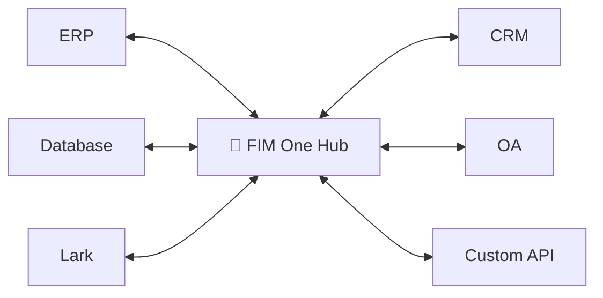
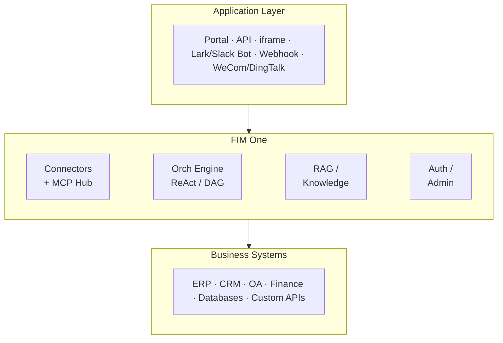

<div align="center">


[](https://github.com/fim-ai/fim-one/actions/workflows/test.yml)

[](https://discord.gg/z64czxdC7z)
[](https://x.com/FIM_One)

[🌐 English](README.md) | [🇨🇳 中文](README.zh.md) | [🇯🇵 日本語](README.ja.md) | [🇰🇷 한국어](README.ko.md) | [🇩🇪 Deutsch](README.de.md) | [🇫🇷 Français](README.fr.md)

**Vos systèmes ne communiquent pas entre eux. FIM One est le pont alimenté par l'IA — intégrez-le en tant que Copilote, ou connectez-les tous en tant que Hub.**

🌐 [Site web](https://one.fim.ai/) · 📖 [Documentation](https://docs.fim.ai) · 📋 [Journal des modifications](https://docs.fim.ai/changelog) · 🐛 [Signaler un bug](https://github.com/fim-ai/fim-one/issues) · 💬 [Discord](https://discord.gg/z64czxdC7z) · 🐦 [Twitter](https://x.com/FIM_One) · 🏆 [Product Hunt](https://www.producthunt.com/products/fim-one)

</div>

> [!TIP]
> **☁️ Ignorez la configuration — essayez FIM One sur le Cloud.**
> Une version gérée est disponible à **[cloud.fim.ai](https://cloud.fim.ai/)** : pas de Docker, pas de clés API, pas de configuration. Connectez-vous et commencez à connecter vos systèmes en quelques secondes. _Accès anticipé, les retours sont les bienvenus._

---

## Aperçu

Chaque entreprise dispose de systèmes qui ne communiquent pas entre eux — ERP, CRM, OA, finance, HR, bases de données personnalisées. FIM One est le **hub alimenté par l'IA** qui les connecte tous sans modifier votre infrastructure existante.

| Mode           | Description                                             | Accès                   |
| -------------- | ------------------------------------------------------- | ----------------------- |
| **Standalone** | Assistant IA polyvalent — recherche, code, KB           | Portail                 |
| **Copilot**    | IA intégrée dans l'interface utilisateur d'un système   | iframe / widget / embed |
| **Hub**        | Orchestration IA centrale sur tous les systèmes connectés | Portail / API           |



### Captures d'écran

**Tableau de bord** — statistiques, tendances d'activité, utilisation des jetons et accès rapide aux agents et conversations.


**Chat d'agent** — raisonnement ReAct avec appels d'outils multi-étapes contre une base de données connectée.


**Planificateur DAG** — plan d'exécution généré par LLM avec étapes parallèles et suivi du statut en direct.


### Démo

**Utilisation d'agents**


**Utilisation du mode Planificateur**


## Démarrage rapide

### Docker (recommandé)

```bash
git clone https://github.com/fim-ai/fim-one.git
cd fim-one

cp example.env .env
# Edit .env: set LLM_API_KEY (and optionally LLM_BASE_URL, LLM_MODEL)

docker compose up --build -d
```

Ouvrez http://localhost:3000 — au premier lancement, vous créerez un compte administrateur. C'est tout.

```bash
docker compose up -d          # start
docker compose down           # stop
docker compose logs -f        # view logs
```

### Développement Local

Prérequis : Python 3.11+, [uv](https://docs.astral.sh/uv/), Node.js 18+, pnpm.

```bash
git clone https://github.com/fim-ai/fim-one.git && cd fim-one

cp example.env .env           # Edit: set LLM_API_KEY

uv sync --all-extras
cd frontend && pnpm install && cd ..

./start.sh dev                # hot reload: Python --reload + Next.js HMR
```

| Commande         | Ce qui démarre                    | URL                            |
| ---------------- | --------------------------------- | ------------------------------ |
| `./start.sh`     | Next.js + FastAPI                 | localhost:3000 (UI) + :8000    |
| `./start.sh dev` | Identique, avec rechargement à chaud | Identique                      |
| `./start.sh api` | FastAPI uniquement (sans interface) | localhost:8000/api             |

> Pour le déploiement en production (Docker, reverse proxy, mises à jour sans interruption), consultez le [Guide de Déploiement](https://docs.fim.ai/quickstart#production-deployment).

## Fonctionnalités principales

#### Hub de Connecteurs
- **Trois modes de livraison** — Assistant autonome, Copilot intégré ou Hub central ; même cœur d'agent.
- **N'importe quel système, un seul modèle** — Connectez des API, des bases de données, des serveurs MCP. Les actions s'enregistrent automatiquement en tant qu'outils d'agent avec injection d'authentification.
- **Connecteurs de bases de données** — PostgreSQL, MySQL, Oracle, SQL Server, plus les bases de données héritées chinoises (DM, KingbaseES, GBase, Highgo). Introspection de schéma et annotation alimentée par l'IA.
- **Trois façons de construire** — Importez une spécification OpenAPI, utilisez le générateur de chat IA ou connectez directement les serveurs MCP.

#### Planification & Exécution
- **Planification DAG dynamique** — L'LLM décompose les objectifs en graphes de dépendances à l'exécution. Aucun workflow codé en dur.
- **Exécution concurrente** — Les étapes indépendantes s'exécutent en parallèle via asyncio ; replanification automatique jusqu'à 3 tours.
- **Agent ReAct** — Boucle structurée de raisonnement et d'action avec récupération automatique des erreurs.
- **Routage automatique** — Classe les requêtes et les achemine vers le mode optimal (ReAct ou DAG). Configurable via `AUTO_ROUTING`.
- **Réflexion étendue** — Chaîne de pensée pour OpenAI o-series, Gemini 2.5+, Claude.

#### Flux de travail et outils
- **Éditeur de flux de travail visuel** — 12 types de nœuds, canevas glisser-déposer (React Flow v12), import/export en JSON.
- **Gestion intelligente des fichiers** — Les fichiers téléchargés sont automatiquement intégrés au contexte (petits) ou lisibles à la demande via l'outil `read_uploaded_file` avec modes de recherche paginée et regex.
- **Outils enfichables** — Python, Node.js, exécution shell avec bac à sable Docker optionnel (`CODE_EXEC_BACKEND=docker`).
- **Pipeline RAG complet** — Intégration Jina + LanceDB + récupération hybride + reclasseur + citations intégrées `[N]`.
- **Artefacts d'outils** — Sorties enrichies (aperçus HTML, fichiers) rendus dans le chat.

#### Plateforme
- **Multi-locataire** — Authentification JWT, isolation des organisations, panneau d'administration avec analyses d'utilisation et métriques des connecteurs.
- **Marketplace** — Publier et s'abonner à des agents, connecteurs, bases de connaissances, compétences, workflows.
- **Compétences globales (SOP)** — Procédures d'exploitation réutilisables chargées pour chaque utilisateur ; le mode progressif réduit les jetons d'environ 80 %.
- **6 langues** — EN, ZH, JA, KO, DE, FR. Les traductions sont [entièrement automatisées](https://docs.fim.ai/quickstart#internationalization).
- **Assistant de configuration à la première exécution**, thème sombre/clair, palette de commandes, SSE en continu, visualisation DAG.

> Approfondissement : [Architecture](https://docs.fim.ai/architecture/system-overview) · [Modes d'exécution](https://docs.fim.ai/concepts/execution-modes) · [Pourquoi FIM One](https://docs.fim.ai/why) · [Paysage concurrentiel](https://docs.fim.ai/strategy/competitive-landscape)

## Architecture



Chaque connecteur est un pont standardisé — l'agent n'a pas besoin de savoir ou de se soucier s'il communique avec SAP ou une base de données personnalisée. Consultez [Architecture des connecteurs](https://docs.fim.ai/architecture/connector-architecture) pour plus de détails.

## Configuration

FIM One fonctionne avec **n'importe quel fournisseur compatible OpenAI** :

| Fournisseur        | `LLM_API_KEY` | `LLM_BASE_URL`                 | `LLM_MODEL`         |
| ------------------ | ------------- | ------------------------------ | -------------------- |
| **OpenAI**         | `sk-...`      | *(par défaut)*                 | `gpt-4o`             |
| **DeepSeek**       | `sk-...`      | `https://api.deepseek.com/v1`  | `deepseek-chat`      |
| **Anthropic**      | `sk-ant-...`  | `https://api.anthropic.com/v1` | `claude-sonnet-4-6`  |
| **Ollama** (local) | `ollama`      | `http://localhost:11434/v1`    | `qwen2.5:14b`        |

Fichier `.env` minimal :

```bash
LLM_API_KEY=sk-your-key
# LLM_BASE_URL=https://api.openai.com/v1   # default
# LLM_MODEL=gpt-4o                         # default
JINA_API_KEY=jina_...                       # unlocks web tools + RAG
```

> Référence complète : [Variables d'environnement](https://docs.fim.ai/configuration/environment-variables)

## Stack Technologique

| Couche      | Technologie                                                         |
| ----------- | ------------------------------------------------------------------- |
| Backend     | Python 3.11+, FastAPI, SQLAlchemy, Alembic, asyncio                 |
| Frontend    | Next.js 14, React 18, Tailwind CSS, shadcn/ui, React Flow v12      |
| IA / RAG    | LLMs compatibles OpenAI, Jina AI (embed + search), LanceDB          |
| Base de données | SQLite (dev) / PostgreSQL (prod)                                |
| Infrastructure | Docker, uv, pnpm, SSE streaming                                 |

## Développement

```bash
uv sync --all-extras          # install dependencies
pytest                         # run tests
pytest --cov=fim_one           # with coverage
ruff check src/ tests/         # lint
mypy src/                      # type check
bash scripts/setup-hooks.sh    # install git hooks (enables auto i18n)
```

## Feuille de route

Consultez la [Feuille de route](https://docs.fim.ai/roadmap) complète pour l'historique des versions et les fonctionnalités prévues.

## FAQ

Questions fréquemment posées sur le déploiement, les fournisseurs de LLM, la configuration système, et bien d'autres — consultez la [FAQ](https://docs.fim.ai/faq).

## Contribuer

Nous accueillons les contributions de tous types — code, documentation, traductions, rapports de bugs et idées.

> **Programme Pioneer** : Les 100 premiers contributeurs dont une PR est fusionnée sont reconnus comme **Contributeurs Fondateurs** avec des crédits permanents, un badge et un support prioritaire des problèmes. [En savoir plus &rarr;](CONTRIBUTING.md#-pioneer-program)

**Liens rapides :**

- [**Guide de contribution**](CONTRIBUTING.md) — configuration, conventions, processus de PR
- [**Bons premiers problèmes**](https://github.com/fim-ai/fim-one/labels/good%20first%20issue) — sélectionnés pour les nouveaux venus
- [**Problèmes ouverts**](https://github.com/fim-ai/fim-one/issues) — bugs et demandes de fonctionnalités

**Sécurité :** Pour signaler une vulnérabilité, veuillez ouvrir un [problème GitHub](https://github.com/fim-ai/fim-one/issues) avec l'étiquette `[SECURITY]`. Pour les divulgations sensibles, contactez-nous via Discord DM.

## Historique des étoiles

<a href="https://star-history.com/#fim-ai/fim-one&Date">
  <picture>
    <source media="(prefers-color-scheme: dark)" srcset="https://api.star-history.com/svg?repos=fim-ai/fim-one&type=Date&theme=dark" />
    <source media="(prefers-color-scheme: light)" srcset="https://api.star-history.com/svg?repos=fim-ai/fim-one&type=Date" />
    
  </picture>
</a>

## Activité


## Contributeurs

Merci à ces personnes merveilleuses ([clé emoji](https://allcontributors.org/docs/en/emoji-key)) :

<!-- ALL-CONTRIBUTORS-LIST:START - Do not remove or modify this section -->
<!-- prettier-ignore-start -->
<!-- markdownlint-disable -->
<!-- markdownlint-restore -->
<!-- prettier-ignore-end -->
<!-- ALL-CONTRIBUTORS-LIST:END -->

[](https://github.com/fim-ai/fim-one/graphs/contributors)

Ce projet suit la spécification [all-contributors](https://allcontributors.org/). Les contributions de toute nature sont les bienvenues !

## Licence

Licence FIM One Source Available. Il ne s'agit **pas** d'une licence open source approuvée par l'OSI.

**Autorisé** : utilisation interne, modification, distribution avec licence intacte, intégration dans des applications non concurrentes.

**Restreint** : SaaS multi-locataire, plateformes d'agents concurrentes, revente de marque blanche, suppression de la marque.

Pour les demandes de licence commerciale, veuillez ouvrir un problème sur [GitHub](https://github.com/fim-ai/fim-one).

Voir [LICENSE](LICENSE) pour les conditions complètes.

---

<div align="center">

🌐 [Site web](https://one.fim.ai/) · 📖 [Documentation](https://docs.fim.ai) · 📋 [Journal des modifications](https://docs.fim.ai/changelog) · 🐛 [Signaler un bug](https://github.com/fim-ai/fim-one/issues) · 💬 [Discord](https://discord.gg/z64czxdC7z) · 🐦 [Twitter](https://x.com/FIM_One) · 🏆 [Product Hunt](https://www.producthunt.com/products/fim-one)

</div>
