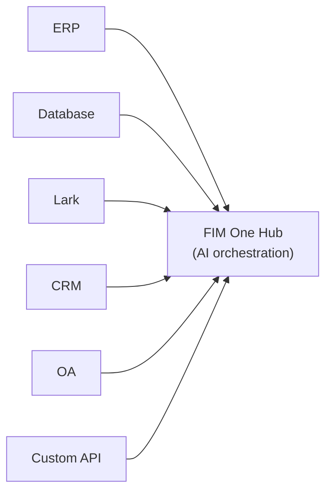

<div align="center">


[](https://github.com/fim-ai/fim-one/actions/workflows/test.yml)

[](https://discord.gg/z64czxdC7z)
[](https://x.com/FIM_One)

[🌐 English](README.md) | [🇨🇳 中文](README.zh.md) | [🇯🇵 日本語](README.ja.md) | [🇰🇷 한국어](README.ko.md) | [🇩🇪 Deutsch](README.de.md) | [🇫🇷 Français](README.fr.md)

**Vos systèmes ne communiquent pas entre eux. FIM One les connecte tous à l'IA — sans modification de code, sans migration de données.**

*Hub de connecteurs alimenté par l'IA — intégrez-le dans un système en tant que Copilote, ou connectez-les tous en tant que Hub.*

🌐 [Site web](https://one.fim.ai/) · 📖 [Documentation](https://docs.fim.ai) · 📋 [Journal des modifications](https://docs.fim.ai/changelog) · 🐛 [Signaler un bug](https://github.com/fim-ai/fim-one/issues) · 💬 [Discord](https://discord.gg/z64czxdC7z) · 🐦 [Twitter](https://x.com/FIM_One) · 🏆 [Product Hunt](https://www.producthunt.com/products/fim-one)

</div>

> [!TIP]
> **☁️ Ignorez la configuration — essayez FIM One sur le Cloud.**
> Une version gérée est disponible à **[cloud.fim.ai](https://cloud.fim.ai/)** : pas de Docker, pas de clés API, pas de configuration. Connectez-vous et commencez à connecter vos systèmes en quelques secondes. _Accès anticipé, les commentaires sont les bienvenus._

---

## Table des matières

- [Aperçu](#aperçu)
- [Cas d'usage](#cas-dusage)
- [Pourquoi FIM One](#pourquoi-fim-one)
- [Où FIM One s'intègre](#où-fim-one-sintègre)
- [Fonctionnalités clés](#fonctionnalités-clés)
- [Architecture](#architecture)
- [Démarrage rapide](#démarrage-rapide) (Docker / Local / Production)
- [Configuration](#configuration)
- [Développement](#développement)
- [Feuille de route](#feuille-de-route)
- [Contribution](#contribution)
- [Historique des étoiles](#historique-des-étoiles)
- [Activité](#activité)
- [Contributeurs](#contributeurs)
- [Licence](#licence)## Aperçu

Chaque entreprise dispose de systèmes qui ne communiquent pas entre eux — ERP, CRM, OA, finance, RH, bases de données personnalisées. L'IA de chaque fournisseur est intelligente dans son propre environnement, mais aveugle à tout le reste. FIM One est le **hub externe et tiers** qui les connecte tous via l'IA — sans modifier votre infrastructure existante. Trois modes de livraison, un cœur d'agent unique :

| Mode           | Qu'est-ce que c'est                                                                       | Comment y accéder                       |
| -------------- | ----------------------------------------------------------------------------------------- | --------------------------------------- |
| **Standalone** | Assistant IA polyvalent — recherche, code, base de connaissances                          | Portail                                 |
| **Copilot**    | IA intégrée dans un système hôte — fonctionne aux côtés des utilisateurs dans leur UI existante | iframe / widget / intégration dans les pages hôtes |
| **Hub**        | Orchestration IA centrale — tous vos systèmes connectés, intelligence inter-systèmes | Portail / API                            |



Le cœur reste toujours le même : boucles de raisonnement ReAct, planification DAG dynamique avec exécution concurrente, outils enfichables, et une architecture orientée protocole sans dépendance à un fournisseur.

### Utilisation des Agents

### Utilisation du mode Planificateur

## Cas d'usage

Les données et flux de travail d'entreprise sont verrouillés dans les systèmes OA, ERP, finance et d'approbation. FIM One permet aux agents IA de lire et d'écrire dans ces systèmes — automatisant les processus inter-systèmes sans modifier votre infrastructure existante.

| Scénario                  | Démarrage recommandé | Ce qu'il automatise                                                                                                |
| ------------------------- | -------------------- | ---------------------------------------------------------------------------------------------------------------- |
| **Juridique & Conformité**    | Copilot → Hub     | Extraction de clauses contractuelles, diff de version, signalisation des risques avec citations de source, déclenchement automatique d'approbation OA          |
| **Opérations IT**         | Hub               | Alertes déclenchées → journaux extraits → cause première analysée → correctif envoyé à Lark/Slack — une boucle fermée                 |
| **Opérations commerciales**   | Copilot           | Résumés de données programmés poussés vers les canaux d'équipe ; requêtes en langage naturel ad hoc contre les bases de données en direct         |
| **Automatisation financière**    | Hub               | Vérification des factures, routage d'approbation des dépenses, rapprochement des registres entre les systèmes ERP et comptables          |
| **Approvisionnement**           | Copilot → Hub     | Exigences → comparaison des fournisseurs → brouillon de contrat → approbation — L'agent gère les transferts inter-systèmes           |
| **Intégration développeur** | API               | Importez une spécification OpenAPI ou décrivez une API en chat — connecteur créé en minutes, enregistré automatiquement comme outils d'agent |## Pourquoi FIM One### Expansion progressive

Commencez par intégrer un **Copilot** dans un système — par exemple, votre ERP. Les utilisateurs interagissent avec l'IA directement dans leur interface familière : interroger les données financières, générer des rapports, obtenir des réponses sans quitter la page.

Quand la valeur est prouvée, configurez un **Hub** — un portail central qui connecte tous vos systèmes ensemble. Le Copilot ERP continue de fonctionner en mode intégré ; le Hub ajoute l'orchestration multi-systèmes : interroger les contrats dans le CRM, vérifier les approbations dans l'OA, notifier les parties prenantes sur Lark — tout depuis un seul endroit.

Le Copilot prouve la valeur au sein d'un système. Le Hub déverrouille la valeur sur tous les systèmes.### Ce que FIM One ne fait PAS

FIM One ne réplique pas la logique de flux de travail qui existe déjà dans vos systèmes cibles :

- **Pas de moteur BPM/FSM** — Les chaînes d'approbation, le routage, l'escalade et les machines d'état sont la responsabilité du système cible. Ces systèmes ont passé des années à construire cette logique.
- **Pas de moteur de flux de travail BPM/FSM** — Les Blueprints de flux de travail de FIM One sont des modèles d'automatisation (appels LLM, branches conditionnelles, actions de connecteur), pas de gestion des processus métier. Les chaînes d'approbation, les règles de routage et les machines d'état appartiennent au système cible.
- **Connecteur = appel API** — Du point de vue du connecteur, « transférer l'approbation » = un appel API, « rejeter avec raison » = un appel API. Toutes les opérations de flux de travail complexes se réduisent à des requêtes HTTP. FIM One appelle l'API ; le système cible gère l'état.

C'est une limite architecturale délibérée, pas une lacune en matière de capacités.

### Positionnement Concurrentiel

|                        | Dify                       | Manus            | Coze                  | FIM One                      |
| ---------------------- | -------------------------- | ---------------- | --------------------- | ---------------------------- |
| **Approach**           | Générateur de flux visuel   | Agent autonome   | Générateur + espace agent | Hub de Connecteurs IA        |
| **Planning**           | DAGs statiques conçus par l'humain | Multi-agent CoT  | Statique + dynamique  | Planification DAG LLM + ReAct |
| **Cross-system**       | Nœuds API (manuel)         | Non              | Marketplace de plugins | Mode Hub (orchestration N:N) |
| **Human Confirmation** | Non                        | Non              | Non                   | Oui (porte de pré-exécution) |
| **Self-hosted**        | Oui (pile Docker)          | Non              | Oui (Coze Studio)     | Oui (processus unique)       |

> Approfondissement : [Philosophie](https://docs.fim.ai/architecture/philosophy) | [Modes d'exécution](https://docs.fim.ai/concepts/execution-modes) | [Paysage concurrentiel](https://docs.fim.ai/strategy/competitive-landscape)### Où FIM One se situe

```
                Static Execution          Dynamic Execution
            ┌──────────────────────┬──────────────────────┐
 Static     │ BPM / Workflow       │ ACM                  │
 Planning   │ Camunda, Activiti    │ (Salesforce Case)    │
            │ Dify, n8n, Coze     │                      │
            ├──────────────────────┼──────────────────────┤
 Dynamic    │ (transitional —      │ Autonomous Agent     │
 Planning   │  unstable quadrant)  │ AutoGPT, Manus       │
            │                      │ ★ FIM One (bounded)│
            └──────────────────────┴──────────────────────┘
```

Dify/n8n sont **Static Planning + Static Execution** — les humains conçoivent le DAG sur un canevas visuel, les nœuds exécutent des opérations fixes. FIM One est **Dynamic Planning + Dynamic Execution** — le LLM génère le DAG à l'exécution, chaque nœud exécute une boucle ReAct, avec re-planification en cas d'objectifs non atteints. Mais limité (max 3 rounds de re-planification, budgets de tokens, portes de confirmation), donc plus contrôlé qu'AutoGPT.

FIM One ne fait pas de BPM/FSM — la logique de workflow appartient au système cible, les Connectors appellent simplement les API.

> Explication complète : [Philosophy](https://docs.fim.ai/architecture/philosophy)## Fonctionnalités Clés#### Plateforme de connecteurs (le cœur)
- **Architecture Connector Hub** — Assistant autonome, Copilot intégré ou Hub central — même cœur d'agent, livraison différente.
- **N'importe quel système, un seul modèle** — Connectez les API, les bases de données et les bus de messages. Les actions s'enregistrent automatiquement en tant qu'outils d'agent avec injection d'authentification (Bearer, API Key, Basic).
- **Connecteurs de base de données** — Accès SQL direct à PostgreSQL, MySQL, Oracle, SQL Server et bases de données héritées chinoises (DM, KingbaseES, GBase, Highgo). Introspection de schéma, annotation alimentée par l'IA, exécution de requêtes en lecture seule et identifiants chiffrés au repos. Chaque connecteur de base de données génère automatiquement 3 outils (`list_tables`, `describe_table`, `query`).
- **Trois façons de construire des connecteurs :**
  - *Importer une spécification OpenAPI* — téléchargez YAML/JSON/URL ; les connecteurs et toutes les actions sont générés automatiquement.
  - *Générateur de chat IA* — décrivez l'API en langage naturel ; l'IA génère et itère la configuration d'action dans la conversation. 10 outils de générateur spécialisés gèrent les paramètres de connecteur, les actions, les tests et le câblage d'agent.
  - *Écosystème MCP* — connectez n'importe quel serveur MCP directement ; la communauté MCP tierce fonctionne prête à l'emploi.#### Planification et Exécution Intelligentes
- **Planification DAG Dynamique** — L'LLM décompose les objectifs en graphes de dépendances à l'exécution. Aucun workflow codé en dur.
- **Exécution Concurrente** — Les étapes indépendantes s'exécutent en parallèle via asyncio.
- **Replanification DAG** — Révise automatiquement le plan jusqu'à 3 fois lorsque les objectifs ne sont pas atteints.
- **Agent ReAct** — Boucle structurée de raisonnement et d'action avec récupération automatique des erreurs.
- **Routage Automatique** — La classification automatique des requêtes achemine chaque demande vers le mode d'exécution optimal (ReAct ou DAG). L'interface supporte un commutateur 3 positions (Auto/Standard/Planner). Configurable via `AUTO_ROUTING`.
- **Réflexion Étendue** — Activez le raisonnement chaîne de pensée pour les modèles supportés (OpenAI o-series, Gemini 2.5+, Claude) via `LLM_REASONING_EFFORT`. Le raisonnement du modèle est affiché dans l'étape « thinking » de l'interface.#### Plans de travail
- **Éditeur de flux de travail visuel** — Concevez des plans d'automatisation multi-étapes avec un canevas glisser-déposer construit sur React Flow v12. 12 types de nœuds : Start, End, LLM, Condition Branch, Question Classifier, Agent, Knowledge Retrieval, Connecteur, HTTP Request, Variable Assign, Template Transform, Code Execution.
- **Moteur d'exécution topologique** — Les flux de travail exécutent les nœuds dans l'ordre des dépendances avec branchement conditionnel, passage de variables entre nœuds et diffusion en continu du statut SSE en temps réel.
- **Import/Export** — Partagez les plans de travail sous forme JSON. Variables d'environnement chiffrées pour une gestion sécurisée des identifiants.

#### Outils et intégrations
- **Système d'outils enfichable** — Découverte automatique ; livré avec exécuteur Python, exécuteur Node.js, calculatrice, recherche/récupération web, requête HTTP, exécution shell, et plus.
- **Sandbox enfichable** — `python_exec` / `node_exec` / `shell_exec` s'exécutent en mode local ou Docker (`CODE_EXEC_BACKEND=docker`) pour l'isolation au niveau du système d'exploitation (`--network=none`, `--memory=256m`). Sûr pour les déploiements SaaS et multi-locataires.
- **Protocole MCP** — Connectez n'importe quel serveur MCP en tant qu'outils. L'écosystème MCP tiers fonctionne immédiatement.
- **Système d'artefacts d'outils** — Les outils produisent des résultats enrichis (aperçus HTML, fichiers générés) avec rendu en chat et téléchargement. Les artefacts HTML s'affichent dans des iframes en sandbox ; les artefacts de fichiers affichent des puces de téléchargement.
- **Compatible OpenAI** — Fonctionne avec n'importe quel fournisseur `/v1/chat/completions` (OpenAI, DeepSeek, Qwen, Ollama, vLLM…).#### RAG & Knowledge
- **Full RAG Pipeline** — Jina embedding + LanceDB + FTS + RRF hybrid retrieval + reranker. Supports PDF, DOCX, Markdown, HTML, CSV.
- **Grounded Generation** — Evidence-anchored RAG with inline `[N]` citations, conflict detection, and explainable confidence scores.
- **KB Document Management** — Chunk-level CRUD, text search across chunks, failed document retry, and auto-migrating vector store schema.#### Portail & UX
- **Streaming en temps réel (SSE v2)** — Protocole d'événements divisé (`done` / `suggestions` / `title` / `end`) avec curseur pulsant en pointillés, rendu mathématique KaTeX et pliage des étapes d'outils.
- **Visualisation DAG** — Graphique de flux interactif avec statut en direct, arêtes de dépendance, clic pour faire défiler et snapshots de re-plan sous forme de cartes réductibles.
- **Interruption conversationnelle** — Envoyez des messages de suivi pendant que l'agent s'exécute ; injectés à la limite d'itération suivante.
- **Thème sombre / clair / système** — Support complet des thèmes avec détection des préférences système.
- **Palette de commandes** — Recherche de conversation, mise en favori, opérations par lot et renommage de titre.#### Plateforme et Multi-locataire
- **JWT Auth** — Authentification SSE basée sur les jetons, propriété des conversations, isolation des ressources par utilisateur.
- **Gestion des agents** — Créer, configurer et publier des agents avec modèles, outils et instructions liés. Mode d'exécution par agent (Standard/Planner) et contrôle de température. Le flag `discoverable` optionnel active la découverte automatique par LLM via CallAgentTool.
- **Compétences globales (SOP)** — Les compétences sont des procédures opérationnelles standard réutilisables qui s'appliquent globalement — chargées pour chaque utilisateur indépendamment de la sélection d'agent, en fonction de la visibilité (personnel/org/Marketplace). En mode progressif (par défaut), l'invite système contient des stubs compacts ; le LLM appelle `read_skill(name)` pour charger le contenu complet à la demande, réduisant le coût des jetons d'environ 80 %. Si le SOP d'une compétence référence un agent, le LLM peut déléguer via `call_agent`.
- **Marketplace (Org Market fantôme)** — L'org Market intégré fonctionne comme une entité backend invisible pour le partage de ressources. Les ressources sont découvertes via la navigation marketplace et explicitement souscrites (modèle pull) — pas d'adhésion automatique. La publication sur le marketplace nécessite toujours un examen.
- **Abonnements aux ressources** — Les utilisateurs parcourent et s'abonnent aux ressources partagées du Marketplace. S'abonner/se désabonner via l'interface utilisateur ou l'API. Tous les types de ressources (agents, connecteurs, bases de connaissances, serveurs MCP, compétences, workflows) supportent la publication marketplace et la gestion des abonnements.
- **Panneau d'administration** — Tableau de bord des statistiques système (utilisateurs, conversations, jetons, graphiques d'utilisation des modèles, répartition des jetons par agent), métriques d'appels de connecteurs (taux de succès, latence, nombre d'appels), gestion des utilisateurs avec recherche/pagination, basculement de rôle, réinitialisation de mot de passe, activation/désactivation de compte et contrôles d'activation/désactivation par outil.
- **Assistant de configuration au premier lancement** — Au premier lancement, le portail vous guide dans la création d'un compte administrateur (nom d'utilisateur, mot de passe, e-mail). Cette configuration unique devient votre identifiant de connexion — aucun fichier de configuration nécessaire.
- **Centre personnel** — Instructions système globales par utilisateur, appliquées à toutes les conversations.
- **Préférence de langue** — Paramètre de langue par utilisateur (auto/en/zh) qui dirige toutes les réponses du LLM vers la langue choisie.

#### Contexte et Mémoire
- **LLM Compact** — Résumé automatisé alimenté par LLM pour rester dans les limites de budget de tokens.
- **ContextGuard + Messages épinglés** — Gestionnaire de budget de tokens ; les messages épinglés sont protégés de la compaction.
- **Support de base de données double** — SQLite (configuration par défaut sans configuration) pour démarrer en quelques secondes ; PostgreSQL pour les déploiements en production et multi-workers. Docker Compose provisionne automatiquement PostgreSQL avec des vérifications de santé. `docker compose up` et vous êtes en direct.## Architecture### Aperçu du système

```mermaid
graph TB
    subgraph app["Application & Interaction Layer"]
        a["Portal · API · iframe · Lark/Slack Bot · Webhook · WeCom/DingTalk"]
    end
    subgraph mid["FIM One Middleware"]
        direction LR
        m1["Connectors<br/>+ MCP Hub"] ~~~ m2["Orch Engine<br/>ReAct / DAG"] ~~~ m3["RAG /<br/>Knowledge"] ~~~ m4["Auth /<br/>Admin"]
    end
    subgraph biz["Business Systems & Data Layer"]
        b["ERP · CRM · OA · Finance · Databases · Custom APIs<br/>Lark · DingTalk · WeCom · Slack · Email · Webhook"]
    end
    app --> mid --> biz
```### Connector Hub

```mermaid
graph LR
    ERP["ERP<br/>(SAP/Kingdee)"] --> A
    CRM["CRM<br/>(Salesforce)"] --> B
    OA["OA<br/>(Seeyon/Weaver)"] --> C
    DB["Custom DB<br/>(PG/MySQL)"] --> D
    subgraph Hub["FIM One Hub"]
        A["Agent A: Finance Audit"]
        B["Agent B: Contract Review"]
        C["Agent C: Approval Assist"]
        D["Agent D: Data Reporting"]
    end
    A --> O1["Lark / Slack"]
    B --> O2["Email / WeCom"]
    C --> O3["Teams / Webhook"]
    D --> O4["Any API"]
```

*Portal / API / iframe*

Chaque connector est un pont standardisé — l'agent ne sait pas et ne se soucie pas de savoir s'il communique avec SAP ou une base de données PostgreSQL personnalisée. Consultez [Connector Architecture](https://docs.fim.ai/architecture/connector-architecture) pour plus de détails.### Exécution interne

FIM One fournit deux modes d'exécution, avec routage automatique entre eux :

| Mode         | Idéal pour                | Fonctionnement                                                     |
| ------------ | ------------------------- | ------------------------------------------------------------------ |
| Auto         | Toutes les requêtes (par défaut) | Un LLM rapide classifie la requête et la route vers ReAct ou DAG   |
| ReAct        | Requêtes complexes uniques | Boucle Reason → Act → Observe avec outils                          |
| DAG Planning | Tâches multi-étapes parallèles | Le LLM génère un graphe de dépendances, les étapes indépendantes s'exécutent concurremment |

```mermaid
graph TB
    Q[User Query] --> P["DAG Planner<br/>LLM decomposes the goal into steps + dependency edges"]
    P --> E["DAG Executor<br/>Launches independent steps concurrently via asyncio<br/>Each step is handled by a ReAct Agent"]
    E --> R1["ReAct Agent 1 → Tools<br/>(python_exec, custom, ...)"]
    E --> R2["ReAct Agent 2 → RAG<br/>(retriever interface)"]
    E --> RN["ReAct Agent N → ..."]
    R1 & R2 & RN --> An["Plan Analyzer<br/>LLM evaluates results · re-plans if goal not met"]
    An --> F[Final Answer]
```## Démarrage rapide### Option A : Docker (recommandé)

Aucun Python ou Node.js local requis — tout est construit à l'intérieur du conteneur.

```bash
git clone https://github.com/fim-ai/fim-one.git
cd fim-one
```# Configurer — seul LLM_API_KEY est requis
cp example.env .env# Modifier .env : définir LLM_API_KEY (et optionnellement LLM_BASE_URL, LLM_MODEL)# Construire et exécuter (première fois, ou après avoir tiré le nouveau code)
```bash
docker compose up --build -d
```

Ouvrez http://localhost:3000 — au premier lancement, vous serez guidé pour créer un compte administrateur. C'est tout.

Après la construction initiale, les démarrages suivants ne nécessitent que :

```bash
docker compose up -d          # démarrer (ignorer la reconstruction si l'image n'a pas changé)
docker compose down           # arrêter
docker compose logs -f        # afficher les journaux
```

Les données sont conservées dans les volumes nommés Docker (`fim-data`, `fim-uploads`) et survivent aux redémarrages des conteneurs.

> **Remarque :** Le mode Docker ne supporte pas le rechargement à chaud. Les modifications du code nécessitent de reconstruire l'image (`docker compose up --build -d`). Pour le développement actif avec rechargement en direct, utilisez **l'option B** ci-dessous.### Option B: Développement Local

Prérequis : Python 3.11+, [uv](https://docs.astral.sh/uv/), Node.js 18+, pnpm.

```bash
git clone https://github.com/fim-ai/fim-one.git
cd fim-one

cp example.env .env
```# Modifier .env : définir LLM_API_KEY# Installation
uv sync --all-extras
cd frontend && pnpm install && cd ..# Lancer (avec rechargement à chaud)
./start.sh dev
```

| Commande         | Ce qui démarre                                          | URL                                      |
| ---------------- | ------------------------------------------------------- | ---------------------------------------- |
| `./start.sh`     | Next.js + FastAPI                                       | http://localhost:3000 (UI) + :8000 (API) |
| `./start.sh dev` | Identique, avec rechargement à chaud (Python `--reload` + Next.js HMR) | Identique                                     |
| `./start.sh api` | FastAPI uniquement (sans interface, pour intégration ou test)     | http://localhost:8000/api                |### Déploiement en production

Les deux options fonctionnent en production :

| Méthode    | Commande               | Idéal pour                                  |
| ---------- | ---------------------- | ------------------------------------------- |
| **Docker** | `docker compose up -d` | Déploiement sans intervention, mises à jour faciles |
| **Script** | `./start.sh`           | Serveurs bare-metal, gestionnaires de processus personnalisés |

Pour l'une ou l'autre méthode, placez un proxy inverse Nginx devant pour HTTPS et un domaine personnalisé :

```
User → Nginx (443/HTTPS) → localhost:3000
```

L'API s'exécute en interne sur le port 8000 — Next.js proxifie automatiquement les requêtes `/api/*`. Seul le port 3000 doit être exposé.

**Mise à jour d'un déploiement en cours d'exécution** (sans interruption de service) :

```bash
cd /path/to/fim-one \
  && git pull origin master \
  && sudo docker compose build \
  && sudo docker compose up -d \
  && sudo docker image prune -f
```

`build` s'exécute d'abord tandis que les anciens conteneurs continuent à servir le trafic. `up -d` remplace ensuite uniquement les conteneurs dont l'image a changé — le temps d'arrêt est d'environ 10 secondes au lieu de minutes.

Si vous utilisez le bac à sable d'exécution de code (`CODE_EXEC_BACKEND=docker`), montez le socket Docker :

```yaml
```
# docker-compose.yml
volumes:
  - /var/run/docker.sock:/var/run/docker.sock
```## Configuration### Configuration recommandée

FIM One fonctionne avec **n'importe quel fournisseur LLM compatible OpenAI** — OpenAI, DeepSeek, Anthropic, Qwen, Ollama, vLLM, et bien d'autres. Choisissez celui que vous préférez :

| Fournisseur        | `LLM_API_KEY` | `LLM_BASE_URL`                 | `LLM_MODEL`         |
| ------------------ | ------------- | ------------------------------ | ------------------- |
| **OpenAI**         | `sk-...`      | *(par défaut)*                 | `gpt-4o`            |
| **DeepSeek**       | `sk-...`      | `https://api.deepseek.com/v1`  | `deepseek-chat`     |
| **Anthropic**      | `sk-ant-...`  | `https://api.anthropic.com/v1` | `claude-sonnet-4-6` |
| **Ollama** (local) | `ollama`      | `http://localhost:11434/v1`    | `qwen2.5:14b`       |

**[Jina AI](https://jina.ai/)** déverrouille la recherche/récupération web, l'embedding et l'ensemble du pipeline RAG (niveau gratuit disponible).

Fichier `.env` minimal :

```bash
LLM_API_KEY=sk-your-key
```# LLM_BASE_URL=https://api.openai.com/v1   # par défaut — modifiez pour d'autres fournisseurs# LLM_MODEL=gpt-4o                         # par défaut — changez pour d'autres modèles

JINA_API_KEY=jina_...                       # déverrouille les outils web + RAG
```### Toutes les variables

Consultez la référence complète des [Variables d'environnement](https://docs.fim.ai/configuration/environment-variables) pour toutes les options de configuration (LLM, exécution d'agent, outils web, RAG, exécution de code, génération d'images, connecteurs, plateforme, OAuth).## Développement

```bash


```# Installer toutes les dépendances (y compris les extras de développement)
uv sync --all-extras# Exécuter les tests
pytest# Exécuter les tests avec couverture
pytest --cov=fim_one --cov-report=term-missing# Lint
ruff check src/ tests/# Vérification de type
mypy src/# Installer les git hooks (à exécuter une fois après le clone — active la traduction i18n automatique au commit)
bash scripts/setup-hooks.sh
```## Internationalisation (i18n)

FIM One prend en charge **6 langues** : anglais, chinois, japonais, coréen, allemand et français. Les traductions sont entièrement automatisées — vous devez uniquement modifier les fichiers sources en anglais.

**Langues prises en charge** : `en` `zh` `ja` `ko` `de` `fr`

| Élément | Source (à modifier) | Auto-généré (ne pas modifier) |
|------|--------------------|-----------------------------|
| Chaînes UI | `frontend/messages/en/*.json` | `frontend/messages/{locale}/*.json` |
| Documentation | `docs/*.mdx` | `docs/{locale}/*.mdx` |
| README | `README.md` | `README.{locale}.md` |

**Fonctionnement** : Un hook de pré-commit détecte les modifications des fichiers en anglais et les traduit via le Fast LLM du projet. Les traductions sont incrémentielles — seul le contenu nouveau, modifié ou supprimé est traité.

```bash# Configuration (à exécuter une fois après le clone)
bash scripts/setup-hooks.sh# Traduction complète (première fois ou après l'ajout d'une nouvelle locale)
uv run scripts/translate.py --all# Traduire des fichiers spécifiques
uv run scripts/translate.py --files frontend/messages/en/common.json# Remplacer les paramètres régionaux cibles
uv run scripts/translate.py --all --locale ja ko# Augmenter les appels API parallèles (par défaut : 3, augmentez si votre API le permet)
uv run scripts/translate.py --all --concurrency 10# Flux de travail quotidien : il suffit de commiter — le hook gère tout automatiquement
git add frontend/messages/en/common.json
git commit -m "feat(i18n): add new strings"  # hook auto-translates
```

| Flag | Par défaut | Description |
|------|---------|-------------|
| `--all` | — | Retraduit tout (ignore le cache) |
| `--files` | — | Traduit uniquement les fichiers spécifiés |
| `--locale` | auto-discover | Remplace les locales cibles |
| `--concurrency` | 3 | Nombre maximum d'appels API LLM parallèles |
| `--force` | — | Force la retraduction de toutes les clés JSON |

**Ajouter une nouvelle langue** : `mkdir frontend/messages/{locale}` → exécuter `--all` → ajouter la locale à `frontend/src/i18n/request.ts` `SUPPORTED_LOCALES`.## Feuille de route

Consultez la [Feuille de route](https://docs.fim.ai/roadmap) complète pour l'historique des versions et ce qui vient ensuite.## Contribuer

Nous accueillons les contributions de toutes sortes — code, documentation, traductions, rapports de bugs et idées.

> **Programme Pioneer** : Les 100 premiers contributeurs dont une PR est fusionnée sont reconnus comme **Contributeurs Fondateurs** avec des crédits permanents dans le projet, un badge sur leur profil et un support prioritaire des problèmes. [En savoir plus &rarr;](CONTRIBUTING.md#-pioneer-program)

**Liens rapides :**

- [**Guide de contribution**](CONTRIBUTING.md) — configuration, conventions, processus de PR
- [**Bons premiers problèmes**](https://github.com/fim-ai/fim-one/labels/good%20first%20issue) — sélectionnés pour les nouveaux venus
- [**Problèmes ouverts**](https://github.com/fim-ai/fim-one/issues) — bugs et demandes de fonctionnalités## Historique des étoiles

<a href="https://star-history.com/#fim-ai/fim-one&Date">
  <picture>
    <source media="(prefers-color-scheme: dark)" srcset="https://api.star-history.com/svg?repos=fim-ai/fim-one&type=Date&theme=dark" />
    <source media="(prefers-color-scheme: light)" srcset="https://api.star-history.com/svg?repos=fim-ai/fim-one&type=Date" />
    
  </picture>
</a>## Activité

## Contributeurs

Merci à ces merveilleuses personnes ([clé emoji](https://allcontributors.org/docs/en/emoji-key)) :

<!-- ALL-CONTRIBUTORS-LIST:START - Do not remove or modify this section -->
<!-- prettier-ignore-start -->
<!-- markdownlint-disable -->
<!-- markdownlint-restore -->
<!-- prettier-ignore-end -->
<!-- ALL-CONTRIBUTORS-LIST:END -->

[](https://github.com/fim-ai/fim-one/graphs/contributors)

Ce projet suit la spécification [all-contributors](https://allcontributors.org/). Les contributions de toute nature sont les bienvenues !## Licence

FIM One Source Available License. Ceci n'est **pas** une licence open source approuvée par l'OSI.

**Autorisé** : utilisation interne, modification, distribution avec licence intacte, intégration dans vos propres applications (non concurrentes).

**Restreint** : SaaS multi-locataire, plateformes d'agents concurrentes, white-labeling, suppression de la marque.

Pour les demandes de licences commerciales, veuillez ouvrir un problème sur [GitHub](https://github.com/fim-ai/fim-one).

Voir [LICENSE](LICENSE) pour les conditions complètes.

---

<div align="center">

🌐 [Website](https://one.fim.ai/) · 📖 [Docs](https://docs.fim.ai) · 📋 [Changelog](https://docs.fim.ai/changelog) · 🐛 [Report Bug](https://github.com/fim-ai/fim-one/issues) · 💬 [Discord](https://discord.gg/z64czxdC7z) · 🐦 [Twitter](https://x.com/FIM_One) · 🏆 [Product Hunt](https://www.producthunt.com/products/fim-one)

</div>