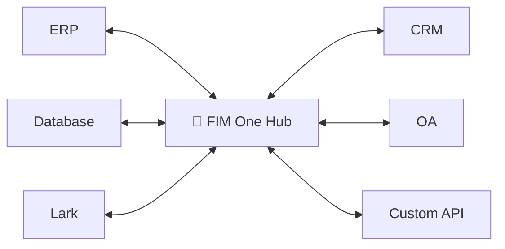
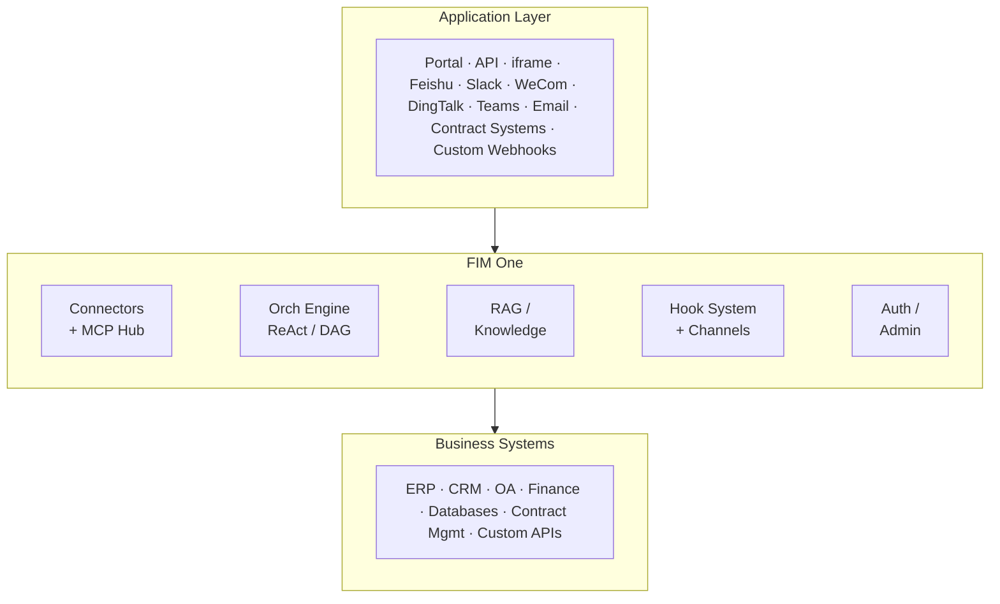

<div align="center">


[](https://github.com/fim-ai/fim-one/actions/workflows/test.yml)

[](https://discord.gg/z64czxdC7z)
[](https://x.com/FIM_One)

[🌐 English](README.md) | [🇨🇳 中文](README.zh.md) | [🇯🇵 日本語](README.ja.md) | [🇰🇷 한국어](README.ko.md) | [🇩🇪 Deutsch](README.de.md) | [🇫🇷 Français](README.fr.md)

**あなたのシステムは相互に通信していません。FIM Oneはエンタープライズグレードの AI パワード ブリッジです — コパイロットとして組み込むか、ハブとしてすべてを接続します。**

🌐 [ウェブサイト](https://one.fim.ai/) · 📖 [ドキュメント](https://docs.fim.ai) · 📋 [変更履歴](https://docs.fim.ai/changelog) · 🐛 [バグ報告](https://github.com/fim-ai/fim-one/issues) · 💬 [Discord](https://discord.gg/z64czxdC7z) · 🐦 [Twitter](https://x.com/FIM_One) · 🏆 [Product Hunt](https://www.producthunt.com/products/fim-one)

</div>

> [!TIP]
> **☁️ セットアップをスキップ — FIM One をクラウドで試してください。**
> マネージド版は **[cloud.fim.ai](https://cloud.fim.ai/)** で利用可能です: Docker なし、API キーなし、設定なし。サインインして数秒でシステムの接続を開始できます。_アーリーアクセス、フィードバック歓迎。_

---

## 概要

すべての企業には相互に通信しないシステムがあります — ERP、CRM、OA、財務、HR、カスタムデータベース。FIM One は、既存のインフラストラクチャを変更することなく、これらすべてを接続する **AI駆動ハブ** です。

| モード           | 説明                                              | アクセス                  |
| -------------- | ------------------------------------------------------- | ----------------------- |
| **スタンドアロン** | 汎用AI アシスタント — 検索、コード、ナレッジベース         | ポータル                  |
| **コパイロット**    | ホストシステムのUIに組み込まれたAI                       | iframe / ウィジェット / 埋め込み |
| **ハブ**    | すべての接続されたシステム全体の中央AI オーケストレーション   | ポータル / API            |



### スクリーンショット

**ダッシュボード** — 統計情報、アクティビティトレンド、トークン使用量、およびエージェントと会話への高速アクセス。


**エージェント チャット** — 接続されたデータベースに対する複数ステップのツール呼び出しを伴う ReAct 推論。


**DAG プランナー** — LLM生成の実行計画、並列ステップ、およびライブステータス追跡。


### デモ

**エージェントの使用**


**プランナーモードの使用**


## クイックスタート

### Docker（推奨）

```bash
git clone https://github.com/fim-ai/fim-one.git
cd fim-one

cp example.env .env
# Edit .env: set LLM_API_KEY (and optionally LLM_BASE_URL, LLM_MODEL)

docker compose up --build -d
```

http://localhost:3000 を開いてください — 初回起動時に管理者アカウントを作成します。以上です。

```bash
docker compose up -d          # start
docker compose down           # stop
docker compose logs -f        # view logs
```

### ローカル開発

前提条件: Python 3.11+、[uv](https://docs.astral.sh/uv/)、Node.js 18+、pnpm。

```bash
git clone https://github.com/fim-ai/fim-one.git && cd fim-one

cp example.env .env           # Edit: set LLM_API_KEY

uv sync --all-extras
cd frontend && pnpm install && cd ..

./start.sh dev                # hot reload: Python --reload + Next.js HMR
```

| コマンド          | 起動内容                       | URL                            |
| ---------------- | --------------------------------- | ------------------------------ |
| `./start.sh`         | Next.js + FastAPI                 | localhost:3000 (UI) + :8000    |
| `./start.sh dev`     | 同上、ホットリロード付き             | 同上                           |
| `./start.sh dev:api` | API のみ、開発モード (ホットリロード)   | localhost:8000                 |
| `./start.sh dev:ui`  | フロントエンドのみ、開発モード (HMR)    | localhost:3000                 |
| `./start.sh api`     | FastAPI のみ (ヘッドレス)           | localhost:8000/api             |

> 本番環境へのデプロイ (Docker、リバースプロキシ、ゼロダウンタイム更新) については、[デプロイメントガイド](https://docs.fim.ai/quickstart#production-deployment)を参照してください。

## 主な機能

#### コネクタハブ
- **3つのデリバリーモード** — スタンドアロンアシスタント、組み込みコパイロット、または中央ハブ。同じエージェントコア。
- **あらゆるシステム、1つのパターン** — API、データベース、MCP サーバーを接続。アクションは認証注入を伴うエージェントツールとして自動登録。段階的開示メタツールにより、すべてのツールタイプ全体でトークン使用量を 80% 以上削減。
- **データベースコネクタ** — PostgreSQL、MySQL、Oracle、SQL Server、および中国のレガシーDB（DM、KingbaseES、GBase、Highgo）。スキーマ内観とAI駆動の注釈。
- **3つの構築方法** — OpenAPI仕様をインポート、AIチャットビルダー、またはMCPサーバーを直接接続。

#### 計画と実行
- **動的DAG計画** — LLMが目標を実行時に依存グラフに分解します。ハードコードされたワークフローはありません。
- **並行実行** — 独立したステップはasyncioを介して並列実行されます。最大3ラウンドまで自動的に再計画します。
- **ReAct智能体** — 構造化された推理と行動のループ、自動エラー回復機能付き。
- **Agent harness** — 本番環境対応の実行環境：ContextGuardによる5層のtoken予算管理、ツール表面を扱いやすく保つための段階的開示メタツール、目標のずれに対抗するための自己反省ループ。
- **Hook System** — LLMループの外で実行される決定論的な強制。最初のリリース：`FeishuGateHook`は機密ツール呼び出しをFeishuグループに投稿された人間の承認カードの背後に置きます。監査ログ、読み取り専用モードガード、レート制限に拡張可能（v0.9）。
- **自動ルーティング** — クエリを分類し、最適なモード（ReActまたはDAG）にルーティングします。`AUTO_ROUTING`で設定可能。
- **拡張思考** — OpenAI o-series、Gemini 2.5+、Claudeのための思考の連鎖。

#### ワークフロー & ツール
- **ビジュアルワークフローエディタ** — 12ノードタイプ、ドラッグ&ドロップキャンバス (React Flow v12)、JSON形式でのインポート/エクスポート。
- **スマートファイルハンドリング** — アップロードされたファイルは自動的にコンテキストにインライン化（小規模）されるか、`read_uploaded_file`ツール経由でオンデマンド読み込み可能。インテリジェントドキュメント処理：PDF、DOCX、PPTXファイルはビジョン対応処理を取得し、モデルがビジョンをサポートする場合は埋め込み画像抽出を実行。スマートPDFモードはテキスト豊富なページからテキストを抽出し、スキャンされたページを画像としてレンダリング。
- **プラグイン可能なツール** — Python、Node.js、シェル実行（オプションのDockerサンドボックス `CODE_EXEC_BACKEND=docker`）。
- **完全なRAGパイプライン** — Jinaエンベディング + LanceDB + ハイブリッド検索 + リランカー + インライン `[N]` 引用。
- **ツールアーティファクト** — リッチ出力（HTMLプレビュー、ファイル）がチャット内でレンダリング。

#### メッセージングチャネル (v0.8)
- **組織スコープの IM ブリッジ** — Feishu (Lark) へのアウトバウンドメッセージング用の `BaseChannel` 抽象化; Slack / WeCom / Teams / Email は v0.9 ロードマップに予定されています。
- **Fernet 暗号化認証情報** — アプリシークレットと暗号化キーは保存時に暗号化されます; すべてのインバウンドコールバックは署名検証されます。
- **インタラクティブな承認カード** — `FeishuGateHook` は機密ツール呼び出しが発火したときに、Feishu グループに承認 / 却下カードを投稿します; ツールはグループメンバーが判定をタップするまでブロックされます。カスタムワークフローエンジンなしでのヒューマンインザループ承認。
- **ブラウズ・アンド・ピック UI** — Feishu コンソールから生の `chat_id` 値をコピーする必要はありません; ポータルは Feishu API を呼び出し、グループピッカーを表示します。

#### プラットフォーム
- **マルチテナント** — JWT認証、組織の分離、使用分析とコネクタメトリクスを備えた管理パネル。
- **マーケットプレイス** — 智能体、コネクタ、ナレッジベース、スキル、ワークフローの公開と購読。
- **グローバルスキル（SOP）** — すべてのユーザーに対して読み込まれる再利用可能な運用手順。プログレッシブモードでトークンを約80%削減。
- **6言語対応** — EN、ZH、JA、KO、DE、FR。翻訳は[完全に自動化](https://docs.fim.ai/quickstart#internationalization)されています。
- **初回セットアップウィザード**、ダーク/ライトテーマ、コマンドパレット、ストリーミングSSE、DAG可視化。

> 詳細：[アーキテクチャ](https://docs.fim.ai/architecture/system-overview) · [フックシステム](https://docs.fim.ai/architecture/hook-system) · [チャネル](https://docs.fim.ai/configuration/channels/overview) · [実行モード](https://docs.fim.ai/concepts/execution-modes) · [FIM Oneについて](https://docs.fim.ai/why) · [競争環境](https://docs.fim.ai/strategy/competitive-landscape)

## アーキテクチャ



各コネクタとチャネルは標準化されたブリッジです。智能体は SAP、カスタム契約システム、または Feishu グループと通信しているかどうかを知る必要がありません。Hook System は LLM ループの外でプラットフォームコードを実行して、承認、監査、およびレート制限を処理します。チャネルは外部 IM プラットフォームへのアウトバウンド通知と承認カードを配信します。詳細は [Connector Architecture](https://docs.fim.ai/architecture/connector-architecture)、[Hook System](https://docs.fim.ai/architecture/hook-system)、および [Channels](https://docs.fim.ai/configuration/channels/overview) を参照してください。

## 設定

FIM One は**任意の OpenAI 互換プロバイダー**で動作します:

| プロバイダー       | `LLM_API_KEY` | `LLM_BASE_URL`                 | `LLM_MODEL`         |
| ------------------ | ------------- | ------------------------------ | -------------------- |
| **OpenAI**         | `sk-...`      | *(デフォルト)*                 | `gpt-4o`             |
| **DeepSeek**       | `sk-...`      | `https://api.deepseek.com/v1`  | `deepseek-chat`      |
| **Anthropic**      | `sk-ant-...`  | `https://api.anthropic.com/v1` | `claude-sonnet-4-6`  |
| **Ollama** (ローカル) | `ollama`      | `http://localhost:11434/v1`    | `qwen2.5:14b`        |

最小限の `.env`:

```bash
LLM_API_KEY=sk-your-key
# LLM_BASE_URL=https://api.openai.com/v1   # default
# LLM_MODEL=gpt-4o                         # default
JINA_API_KEY=jina_...                       # unlocks web tools + RAG
```

> 完全なリファレンス: [環境変数](https://docs.fim.ai/configuration/environment-variables)

## テックスタック

| レイヤー       | テクノロジー                                                          |
| ----------- | ------------------------------------------------------------------- |
| バックエンド     | Python 3.11+, FastAPI, SQLAlchemy, Alembic, asyncio                 |
| フロントエンド    | Next.js 14, React 18, Tailwind CSS, shadcn/ui, React Flow v12      |
| AI / RAG    | OpenAI互換LLM、Jina AI（嵌入 + 検索）、LanceDB          |
| データベース    | SQLite（開発環境）/ PostgreSQL（本番環境）                                    |
| メッセージング   | Feishu Open Platform（Lark）、Fernet暗号化認証情報、HMAC署名検証 |
| インフラ       | Docker、uv、pnpm、SSE ストリーミング                                    |

## 開発

```bash
uv sync --all-extras          # install dependencies
pytest                         # run tests
pytest --cov=fim_one           # with coverage
ruff check src/ tests/         # lint
mypy src/                      # type check
bash scripts/setup-hooks.sh    # install git hooks (enables auto i18n)
```

## ロードマップ

バージョン履歴と計画中の機能については、完全な[ロードマップ](https://docs.fim.ai/roadmap)を参照してください。

## FAQ

デプロイメント、LLMプロバイダー、システム要件など、よくある質問については、[FAQ](https://docs.fim.ai/faq)を参照してください。

## 貢献

あらゆる種類の貢献を歓迎します — コード、ドキュメント、翻訳、バグ報告、アイデア。

> **パイオニアプログラム**: PRがマージされた最初の100人の貢献者は、**創設貢献者**として認識され、永続的なクレジット、バッジ、優先的な問題サポートが付与されます。[詳細を見る &rarr;](CONTRIBUTING.md#-pioneer-program)

**クイックリンク:**

- [**貢献ガイド**](CONTRIBUTING.md) — セットアップ、規約、PRプロセス
- [**開発規約**](https://docs.fim.ai/contributing) — 型安全性、テスト、コード品質基準
- [**初心者向けの良い問題**](https://github.com/fim-ai/fim-one/labels/good%20first%20issue) — 初心者向けに厳選
- [**オープンな問題**](https://github.com/fim-ai/fim-one/issues) — バグ & 機能リクエスト

**セキュリティ:** 脆弱性を報告する場合は、`[SECURITY]`タグを付けて[GitHubの問題](https://github.com/fim-ai/fim-one/issues)を開いてください。機密の報告については、Discord DMで私たちに連絡してください。

## Star History

<a href="https://star-history.com/#fim-ai/fim-one&Date">
  <picture>
    <source media="(prefers-color-scheme: dark)" srcset="https://api.star-history.com/svg?repos=fim-ai/fim-one&type=Date&theme=dark" />
    <source media="(prefers-color-scheme: light)" srcset="https://api.star-history.com/svg?repos=fim-ai/fim-one&type=Date" />
    
  </picture>
</a>

## アクティビティ


## 貢献者

これらの素晴らしい人々に感謝します（[絵文字キー](https://allcontributors.org/docs/en/emoji-key)）:

<!-- ALL-CONTRIBUTORS-LIST:START - Do not remove or modify this section -->
<!-- prettier-ignore-start -->
<!-- markdownlint-disable -->
<table>
  <tbody>
    <tr>
      <td align="center" valign="top" width="14.28%"><a href="https://github.com/tao-hpu"><br /><sub><b>Tao An</b></sub></a><br /><a href="https://github.com/fim-ai/fim-one/commits?author=tao-hpu" title="Code">💻</a> <a href="#maintenance-tao-hpu" title="Maintenance">🚧</a> <a href="#design-tao-hpu" title="Design">🎨</a> <a href="https://github.com/fim-ai/fim-one/commits?author=tao-hpu" title="Documentation">📖</a> <a href="#projectManagement-tao-hpu" title="Project Management">📆</a> <a href="#ideas-tao-hpu" title="Ideas, Planning, & Feedback">🤔</a> <a href="#infra-tao-hpu" title="Infrastructure">🚇</a></td>
      <td align="center" valign="top" width="14.28%"><a href="https://github.com/tgonzalezc5"><br /><sub><b>Teo Gonzalez Collazo</b></sub></a><br /><a href="https://github.com/fim-ai/fim-one/commits?author=tgonzalezc5" title="Code">💻</a> <a href="https://github.com/fim-ai/fim-one/commits?author=tgonzalezc5" title="Tests">⚠️</a></td>
    </tr>
  </tbody>
</table>

<!-- markdownlint-restore -->
<!-- prettier-ignore-end -->
<!-- ALL-CONTRIBUTORS-LIST:END -->

このプロジェクトは [all-contributors](https://allcontributors.org/) 仕様に従っています。あらゆる種類の貢献を歓迎します！

## ライセンス

FIM One Source Available License。これは**OSI認定のオープンソースライセンスではありません**。

**許可される用途**: 内部使用、修正、ライセンスを保持した配布、競合しないアプリケーションへの組み込み。

**制限される用途**: マルチテナント SaaS、競合するエージェントプラットフォーム、ホワイトラベル、ブランディングの削除。

商用ライセンスのお問い合わせは、[GitHub](https://github.com/fim-ai/fim-one) でイシューを開いてください。

詳細は [LICENSE](LICENSE) をご覧ください。

---

<div align="center">

🌐 [ウェブサイト](https://one.fim.ai/) · 📖 [ドキュメント](https://docs.fim.ai) · 📋 [変更履歴](https://docs.fim.ai/changelog) · 🐛 [バグ報告](https://github.com/fim-ai/fim-one/issues) · 💬 [Discord](https://discord.gg/z64czxdC7z) · 🐦 [Twitter](https://x.com/FIM_One) · 🏆 [Product Hunt](https://www.producthunt.com/products/fim-one)

</div>
