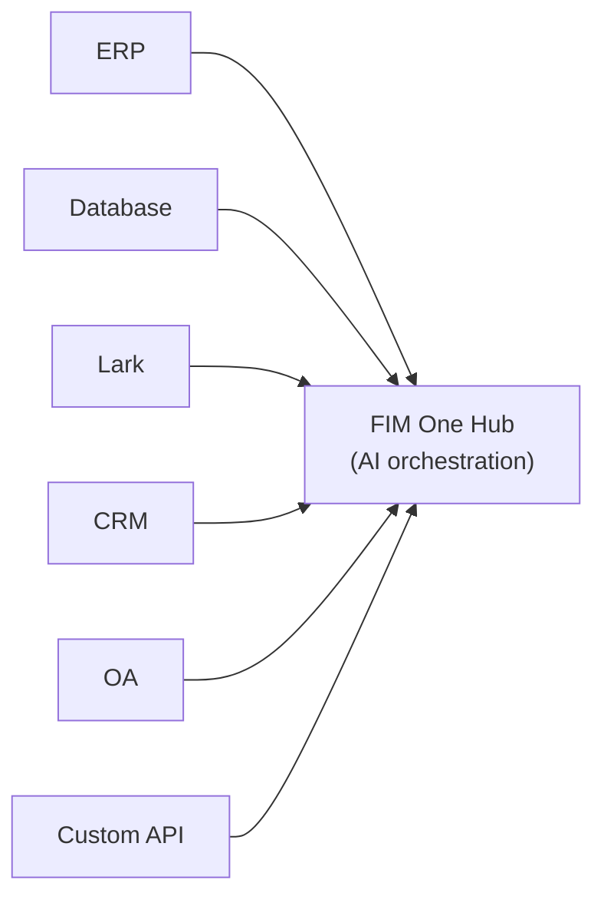
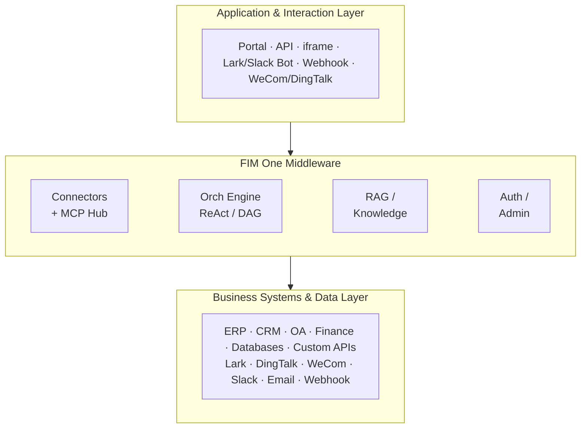
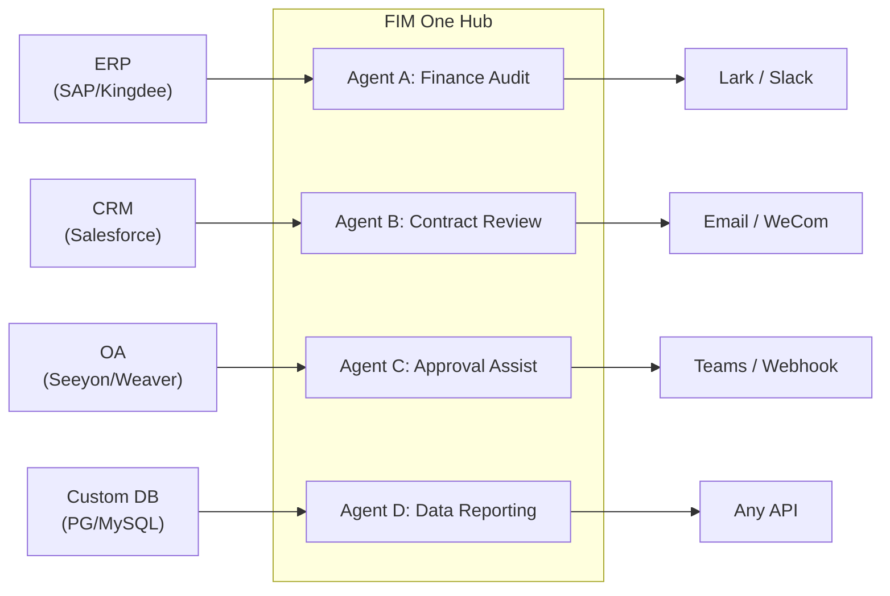
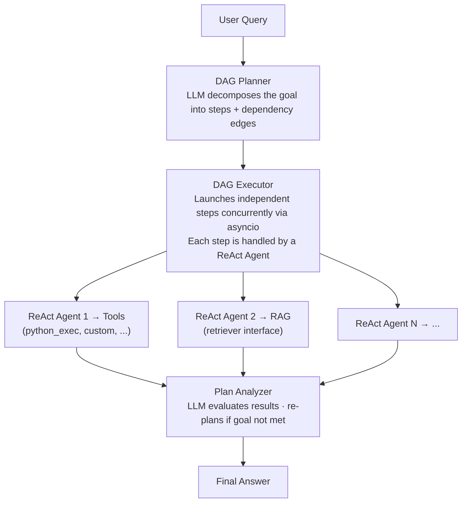

<div align="center">


[](https://github.com/fim-ai/fim-one/actions/workflows/test.yml)

[](https://discord.gg/z64czxdC7z)
[](https://x.com/FIM_One)

[🌐 English](README.md) | [🇨🇳 中文](README.zh.md) | [🇯🇵 日本語](README.ja.md) | [🇰🇷 한국어](README.ko.md) | [🇩🇪 Deutsch](README.de.md) | [🇫🇷 Français](README.fr.md)

**あなたのシステムは相互に通信していません。FIM Oneはエンタープライズグレードの AI パワード ブリッジです — コパイロットとして組み込むか、ハブとしてすべてを接続します。**

🌐 [ウェブサイト](https://one.fim.ai/) · 📖 [ドキュメント](https://docs.fim.ai) · 📋 [変更履歴](https://docs.fim.ai/changelog) · 🐛 [バグ報告](https://github.com/fim-ai/fim-one/issues) · 💬 [Discord](https://discord.gg/z64czxdC7z) · 🐦 [Twitter](https://x.com/FIM_One) · 🏆 [Product Hunt](https://www.producthunt.com/products/fim-one)

</div>

> [!TIP]
> **☁️ セットアップをスキップ — FIM One をクラウドで試してください。**
> マネージド版は **[cloud.fim.ai](https://cloud.fim.ai/)** で利用可能です: Docker なし、API キーなし、設定なし。サインインして数秒でシステムの接続を開始できます。_アーリーアクセス、フィードバック歓迎。_

---

## 目次

- [概要](#概要)
- [ユースケース](#ユースケース)
- [FIM One を選ぶ理由](#fim-one-を選ぶ理由)
- [FIM One の位置付け](#fim-one-の位置付け)
- [主な機能](#主な機能)
- [アーキテクチャ](#アーキテクチャ)
- [クイックスタート](#クイックスタート) (Docker / ローカル / 本番環境)
- [設定](#設定)
- [開発](#開発)
- [ロードマップ](#ロードマップ)
- [貢献](#貢献)
- [スター履歴](#スター履歴)
- [アクティビティ](#アクティビティ)
- [貢献者](#貢献者)
- [ライセンス](#ライセンス)

## 概要

すべての企業には相互に通信しないシステムがあります — ERP、CRM、OA、財務、HR、カスタムデータベース。各ベンダーのAIは独自の領域内では優れていますが、他のすべてに対しては盲目です。FIM Oneは、既存のインフラストラクチャを変更することなく、AIを通じてそれらすべてを接続する**外部、サードパーティのハブ**です。3つの配信モード、1つのエージェントコア：

| モード           | 説明                                                                       | アクセス方法                       |
| -------------- | -------------------------------------------------------------------------------- | --------------------------------------- |
| **スタンドアロン** | 汎用AIアシスタント — 検索、コード、ナレッジベース                      | ポータル                                  |
| **コパイロット**    | ホストシステムに組み込まれたAI — 既存のUIでユーザーと並行して動作        | iframe / ウィジェット / ホストページへの埋め込み |
| **ハブ**        | 中央AI オーケストレーション — すべてのシステムが接続され、クロスシステムインテリジェンス | ポータル / API                            |



コアは常に同じです：ReAct推論ループ、動的DAG計画と並行実行、プラグイン可能なツール、ゼロベンダーロックインを備えたプロトコルファーストアーキテクチャ。

### エージェントの使用


### プランナーモードの使用


## ユースケース

エンタープライズデータとワークフローはOA、ERP、財務、承認システムの内部に閉じ込められています。FIM Oneはエージェントがこれらのシステムを読み書きできるようにします — 既存のインフラストラクチャを変更することなく、システム間のプロセスを自動化します。

| シナリオ                  | 推奨される開始方法 | 自動化される内容                                                                                                |
| ------------------------- | ----------------- | ---------------------------------------------------------------------------------------------------------------- |
| **法務・コンプライアンス**    | Copilot → Hub     | 契約条項の抽出、バージョン比較、ソース引用付きのリスク検出、OA承認の自動トリガー          |
| **IT運用**         | Hub               | アラート発火 → ログ取得 → 根本原因分析 → Lark/Slackへの修正送信 — 1つの完全なループ                 |
| **ビジネス運用**   | Copilot           | スケジュール済みデータサマリーをチームチャネルにプッシュ、ライブデータベースに対するアドホック自然言語クエリ         |
| **財務自動化**    | Hub               | 請求書検証、経費承認ルーティング、ERPと会計システム間の台帳照合          |
| **調達**           | Copilot → Hub     | 要件 → ベンダー比較 → 契約ドラフト → 承認 — エージェントがシステム間のハンドオフを処理           |
| **開発者統合** | API               | OpenAPI仕様をインポートするか、チャットでAPIを説明 — コネクタが数分で作成され、エージェントツールとして自動登録 |

# FIM One を選ぶ理由

### 段階的な展開

まず、1つのシステム（例えば、ERP）に**Copilot**を組み込むことから始めます。ユーザーは、使い慣れたインターフェース内で直接 AI と対話できます。財務データをクエリしたり、レポートを生成したり、ページを離れることなく回答を得たりできます。

価値が実証されたら、**Hub** を設定します。これはすべてのシステムを接続する中央ポータルです。ERP Copilot は組み込まれたまま実行され続け、Hub はシステム間のオーケストレーションを追加します。CRM で契約をクエリしたり、OA で承認を確認したり、Lark でステークホルダーに通知したり — すべて 1 つの場所から実行できます。

Copilot は 1 つのシステム内で価値を実証します。Hub はすべてのシステム全体で価値を引き出します。

### FIM Oneが行わないこと

FIM Oneは、ターゲットシステムに既に存在するワークフロー ロジックを複製しません:

- **BPM/FSMエンジンなし** — 承認チェーン、ルーティング、エスカレーション、ステートマシンはターゲットシステムの責任です。これらのシステムはこのロジックの構築に何年も費やしています。
- **BPM/FSMワークフロー エンジンなし** — FIM OneのWorkflow Blueprintsは自動化テンプレート(LLM呼び出し、条件分岐、コネクタアクション)であり、ビジネスプロセス管理ではありません。承認チェーン、ルーティングルール、ステートマシンはターゲットシステムに属します。
- **コネクタ = API呼び出し** — コネクタの観点からは、「承認を転送」= 1つのAPI呼び出し、「理由付きで却下」= 1つのAPI呼び出しです。すべての複雑なワークフロー操作はHTTPリクエストに集約されます。FIM OneがAPIを呼び出し、ターゲットシステムが状態を管理します。

これは能力不足ではなく、意図的なアーキテクチャ上の境界です。

### 競争的ポジショニング

|                        | Dify                       | Manus            | Coze                  | FIM One                      |
| ---------------------- | -------------------------- | ---------------- | --------------------- | ---------------------------- |
| **Approach**           | ビジュアルワークフロービルダー    | 自律型エージェント | ビルダー + エージェントスペース | AIコネクタハブ             |
| **Planning**           | 人間が設計した静的DAG | マルチエージェントCoT  | 静的 + 動的      | LLM DAGプランニング + ReAct     |
| **Cross-system**       | APIノード（手動）         | なし               | プラグインマーケットプレイス    | ハブモード（N:N オーケストレーション） |
| **Human Confirmation** | なし                         | なし               | なし                    | あり（実行前ゲート）     |
| **Self-hosted**        | あり（Dockerスタック）         | なし               | あり（Coze Studio）     | あり（シングルプロセス）         |

> 詳細: [Philosophy](https://docs.fim.ai/architecture/philosophy) | [Execution Modes](https://docs.fim.ai/concepts/execution-modes) | [Competitive Landscape](https://docs.fim.ai/strategy/competitive-landscape)

### FIM One の位置付け

```
                Static Execution          Dynamic Execution
            ┌──────────────────────┬──────────────────────┐
 Static     │ BPM / Workflow       │ ACM                  │
 Planning   │ Camunda, Activiti    │ (Salesforce Case)    │
            │ Dify, n8n, Coze     │                      │
            ├──────────────────────┼──────────────────────┤
 Dynamic    │ (transitional —      │ Autonomous Agent     │
 Planning   │  unstable quadrant)  │ AutoGPT, Manus       │
            │                      │ ★ FIM One (bounded)│
            └──────────────────────┴──────────────────────┘
```

Dify/n8n は **Static Planning + Static Execution** です — ユーザーがビジュアルキャンバス上で DAG を設計し、ノードが固定操作を実行します。FIM One は **Dynamic Planning + Dynamic Execution** です — LLM が実行時に DAG を生成し、各ノードが ReAct ループを実行し、目標が達成されない場合は再計画します。ただし制限があります（最大 3 回の再計画ラウンド、トークン予算、確認ゲート）ため、AutoGPT よりも制御されています。

FIM One は BPM/FSM を行いません — ワークフロー ロジックはターゲット システムに属し、コネクタは単に API を呼び出します。

> 詳細説明: [Philosophy](https://docs.fim.ai/architecture/philosophy)

## 主な機能

#### コネクタプラットフォーム（コア）
- **コネクタハブアーキテクチャ** — スタンドアロンアシスタント、組み込みコパイロット、または中央ハブ — 同じエージェントコア、異なるデリバリー。
- **任意のシステム、1つのパターン** — API、データベース、メッセージバスを接続。アクションは認証注入（Bearer、API Key、Basic）を備えたエージェントツールとして自動登録されます。
- **データベースコネクタ** — PostgreSQL、MySQL、Oracle、SQL Server、および中国のレガシーデータベース（DM、KingbaseES、GBase、Highgo）への直接SQLアクセス。スキーマ内省、AI搭載の注釈、読み取り専用クエリ実行、および保存時の暗号化された認証情報。各DBコネクタは3つのツール（`list_tables`、`describe_table`、`query`）を自動生成します。
- **コネクタを構築する3つの方法：**
  - *OpenAPI仕様をインポート* — YAML/JSON/URLをアップロード。コネクタとすべてのアクションが自動生成されます。
  - *AIチャットビルダー* — APIを自然言語で説明。AIが会話内でアクション設定を生成および反復処理します。10個の専門ビルダーツールがコネクタ設定、アクション、テスト、およびエージェント配線を処理します。
  - *MCPエコシステム* — 任意のMCPサーバーを直接接続。サードパーティMCPコミュニティがそのまま機能します。

#### インテリジェント計画と実行
- **動的DAG計画** — LLMが目標を実行時に依存グラフに分解します。ハードコードされたワークフローはありません。
- **並行実行** — 独立したステップはasyncioを介して並列実行されます。
- **DAG再計画** — 目標が達成されない場合、最大3ラウンドまで自動的に計画を修正します。
- **ReActエージェント** — 構造化された推論と行動のループ、自動エラー回復機能付き。
- **自動ルーティング** — 自動クエリ分類により、各リクエストを最適な実行モード（ReActまたはDAG）にルーティングします。フロントエンドは3方向トグル（Auto/Standard/Planner）をサポートしています。`AUTO_ROUTING`で設定可能です。
- **拡張思考** — サポートされているモデル（OpenAI o-series、Gemini 2.5+、Claude）に対して、`LLM_REASONING_EFFORT`を介してチェーン・オブ・ソート推論を有効にします。モデルの推論はUI「thinking」ステップで表示されます。

#### ワークフロー ブループリント
- **ビジュアル ワークフロー エディター** — React Flow v12 上に構築されたドラッグ&ドロップ キャンバスを使用して、マルチステップ自動化ブループリントを設計します。12 ノード タイプ: Start、End、LLM、Condition Branch、Question Classifier、エージェント、Knowledge Retrieval、コネクタ、HTTP Request、Variable Assign、Template Transform、Code Execution。
- **トポロジカル実行エンジン** — ワークフローは依存関係の順序でノードを実行し、条件分岐、クロスノード変数の受け渡し、およびリアルタイム SSE ステータス ストリーミングをサポートします。
- **インポート/エクスポート** — ワークフロー ブループリントを JSON として共有します。安全な認証情報処理のための暗号化された環境変数。

#### ツール & 統合
- **プラグイン可能なツールシステム** — 自動検出; Python executor、Node.js executor、計算機、ウェブ検索/フェッチ、HTTP リクエスト、シェル実行などが付属しています。
- **プラグイン可能なサンドボックス** — `python_exec` / `node_exec` / `shell_exec` はローカルモードまたは Docker モード (`CODE_EXEC_BACKEND=docker`) で実行され、OS レベルの分離 (`--network=none`, `--memory=256m`) を実現します。SaaS およびマルチテナント環境に対応しています。
- **MCP プロトコル** — 任意の MCP サーバーをツールとして接続できます。サードパーティの MCP エコシステムがそのまま動作します。
- **ツール成果物システム** — ツールはリッチな出力 (HTML プレビュー、生成されたファイル) を生成し、チャット内でレンダリングおよびダウンロード可能です。HTML 成果物はサンドボックス化された iframe でレンダリングされ、ファイル成果物はダウンロードチップを表示します。
- **OpenAI 互換** — 任意の `/v1/chat/completions` プロバイダー (OpenAI、DeepSeek、Qwen、Ollama、vLLM…) で動作します。

#### RAG & ナレッジ
- **フル RAG パイプライン** — Jina embedding + LanceDB + FTS + RRF ハイブリッド検索 + リランカー。PDF、DOCX、Markdown、HTML、CSV をサポート。
- **根拠のある生成** — エビデンスアンカー RAG とインライン `[N]` 引用、競合検出、および説明可能な信頼度スコア。
- **KB ドキュメント管理** — チャンクレベルの CRUD、チャンク全体のテキスト検索、失敗したドキュメントの再試行、および自動マイグレーションベクトルストアスキーマ。

#### ポータル & UX
- **リアルタイムストリーミング (SSE v2)** — イベントプロトコルの分割 (`done` / `suggestions` / `title` / `end`)、ストリーミングドット パルスカーソル、KaTeX数式レンダリング、ツールステップの折りたたみ機能。
- **DAG ビジュアライゼーション** — ライブステータス、依存関係エッジ、クリックスクロール、再計画ラウンドスナップショットを折りたたみ可能なカードとして表示するインタラクティブフローグラフ。
- **会話割り込み** — エージェント実行中にフォローアップメッセージを送信可能。次の反復境界で挿入されます。
- **ダーク / ライト / システムテーマ** — システム設定検出を含む完全なテーマサポート。
- **コマンドパレット** — 会話検索、スター付け、一括操作、タイトル名変更。

#### プラットフォーム & マルチテナント
- **JWT Auth** — トークンベースの SSE 認証、会話の所有権、ユーザーごとのリソース分離。
- **Agent Management** — バインドされたモデル、ツール、指示を備えたエージェントの作成、設定、公開。エージェントごとの実行モード（Standard/Planner）と温度制御。オプションの `discoverable` フラグにより、CallAgentTool 経由での LLM 自動検出が可能。
- **Global Skills (SOPs)** — スキルは再利用可能な標準操作手順で、すべてのユーザーに対してグローバルに適用されます。エージェント選択に関係なく、可視性（個人/組織/Market）に基づいて読み込まれます。プログレッシブモード（デフォルト）では、システムプロンプトにコンパクトなスタブが含まれ、LLM は必要に応じて `read_skill(name)` を呼び出して完全なコンテンツを読み込み、トークンコストを約 80% 削減します。スキルの SOP がエージェントを参照する場合、LLM は `call_agent` 経由で委譲できます。
- **Marketplace (Shadow Market Org)** — 組み込みの Market org は、リソース共有用の見えないバックエンドエンティティとして機能します。リソースはマーケットプレイスの閲覧を通じて検出され、明示的にサブスクライブされます（プルモデル）。自動参加メンバーシップはありません。マーケットプレイスへの公開には常にレビューが必要です。
- **Resource Subscriptions** — ユーザーはマーケットプレイスから共有リソースを閲覧してサブスクライブできます。UI または API 経由でサブスクライブ/アンサブスクライブ。すべてのリソースタイプ（エージェント、コネクタ、ナレッジベース、MCP サーバー、スキル、ワークフロー）がマーケットプレイス公開とサブスクリプション管理をサポートしています。
- **Admin Panel** — システム統計ダッシュボード（ユーザー、会話、トークン、モデル使用状況チャート、エージェント別トークン内訳）、コネクタコールメトリクス（成功率、レイテンシ、コール数）、検索/ページネーション付きユーザー管理、ロール切り替え、パスワードリセット、アカウント有効化/無効化、ツール単位の有効化/無効化制御。
- **First-Run Setup Wizard** — 初回起動時、ポータルは管理者アカウント（ユーザー名、パスワード、メール）の作成をガイドします。このワンタイム設定がログイン認証情報になります。設定ファイルは不要です。
- **Personal Center** — ユーザーごとのグローバルシステム指示。すべての会話に適用されます。
- **Language Preference** — ユーザーごとの言語設定（auto/en/zh）。すべての LLM レスポンスを選択した言語に指示します。

#### コンテキスト & メモリ
- **LLM Compact** — トークン予算内に収まるよう、LLM を活用した自動要約機能。
- **ContextGuard + ピン留めメッセージ** — トークン予算マネージャー。ピン留めメッセージは圧縮から保護されます。
- **デュアルデータベースサポート** — SQLite（ゼロ設定デフォルト）で数秒で開始可能。PostgreSQL は本番環境とマルチワーカーデプロイメント向け。Docker Compose は PostgreSQL を自動プロビジョニングしてヘルスチェックを実行します。`docker compose up` で稼働開始。

## アーキテクチャ

### システム概要



### コネクタハブ



*ポータル / API / iframe*

各コネクタは標準化されたブリッジです — エージェントは SAP と通信しているのか、カスタム PostgreSQL データベースと通信しているのかを知る必要も気にする必要もありません。詳細は[コネクタアーキテクチャ](https://docs.fim.ai/architecture/connector-architecture)を参照してください。

### 内部実行

FIM Oneは2つの実行モードを提供し、それらの間で自動的にルーティングされます:

| モード         | 最適な用途                | 動作方法                                                       |
| ------------ | ------------------------- | ------------------------------------------------------------------ |
| Auto         | すべてのクエリ（デフォルト）     | 高速LLMがクエリを分類し、ReActまたはDAGにルーティング           |
| ReAct        | 単一の複雑なクエリ    | Reason → Act → Observeループとツール                             |
| DAG Planning | マルチステップの並列タスク | LLMが依存関係グラフを生成し、独立したステップが並行実行 |



## クイックスタート

### オプション A: Docker（推奨）

ローカルの Python や Node.js は不要です — すべてコンテナ内でビルドされます。

```bash
git clone https://github.com/fim-ai/fim-one.git
cd fim-one

# 設定 — LLM_API_KEY のみ必須
cp example.env .env
# .env を編集: LLM_API_KEY を設定（オプションで LLM_BASE_URL、LLM_MODEL も設定可能）

# ビルドと実行（初回、または新しいコードをプル後）
docker compose up --build -d
```

http://localhost:3000 を開きます — 初回起動時は、管理者アカウント作成のガイドが表示されます。以上です。

初期ビルド後、その後の起動には以下のみが必要です：

```bash
docker compose up -d          # 起動（イメージが変わっていなければリビルドをスキップ）
docker compose down           # 停止
docker compose logs -f        # ログを表示
```

データは Docker の名前付きボリューム（`fim-data`、`fim-uploads`）に永続化され、コンテナの再起動後も保持されます。

> **注記:** Docker モードはホットリロードをサポートしていません。コード変更にはイメージの再ビルド（`docker compose up --build -d`）が必要です。ライブリロード付きのアクティブな開発には、以下の**オプション B** を使用してください。

### オプション B: ローカル開発

前提条件: Python 3.11+、[uv](https://docs.astral.sh/uv/)、Node.js 18+、pnpm。

```bash
git clone https://github.com/fim-ai/fim-one.git
cd fim-one

cp example.env .env
# Edit .env: set LLM_API_KEY

# Install
uv sync --all-extras
cd frontend && pnpm install && cd ..

# Launch (with hot reload)
./start.sh dev
```

| コマンド         | 起動内容                                                | URL                                      |
| ---------------- | ------------------------------------------------------- | ---------------------------------------- |
| `./start.sh`     | Next.js + FastAPI                                       | http://localhost:3000 (UI) + :8000 (API) |
| `./start.sh dev` | 同じ、ホットリロード付き (Python `--reload` + Next.js HMR) | 同じ                                     |
| `./start.sh api` | FastAPI のみ (ヘッドレス、統合またはテスト用)             | http://localhost:8000/api                |

### 本番環境へのデプロイ

どちらの方法も本番環境で動作します:

| 方法     | コマンド                | 最適な用途                                    |
| ---------- | ---------------------- | ------------------------------------------- |
| **Docker** | `docker compose up -d` | ハンズオフデプロイ、簡単なアップデート          |
| **Script** | `./start.sh`           | ベアメタルサーバー、カスタムプロセスマネージャー |

どちらの方法でも、HTTPS とカスタムドメイン用に Nginx リバースプロキシをフロントに配置してください:

```
User → Nginx (443/HTTPS) → localhost:3000
```

API は内部的にポート 8000 で実行されます — Next.js は `/api/*` リクエストを自動的にプロキシします。ポート 3000 のみを公開する必要があります。

**実行中のデプロイメントを更新する** (ダウンタイムなし):

```bash
cd /path/to/fim-one \
  && git pull origin master \
  && sudo docker compose build \
  && sudo docker compose up -d \
  && sudo docker image prune -f
```

`build` は古いコンテナがトラフィックを処理し続けている間に最初に実行されます。その後 `up -d` はイメージが変更されたコンテナのみを置き換えます — ダウンタイムは数分ではなく約 10 秒です。

コード実行サンドボックス (`CODE_EXEC_BACKEND=docker`) を使用する場合は、Docker ソケットをマウントしてください:

```yaml
# docker-compose.yml
volumes:
  - /var/run/docker.sock:/var/run/docker.sock
```

## 設定

### 推奨設定

FIM One は**任意の OpenAI 互換 LLM プロバイダー** — OpenAI、DeepSeek、Anthropic、Qwen、Ollama、vLLM など — で動作します。お好みのものを選択してください:

| プロバイダー       | `LLM_API_KEY` | `LLM_BASE_URL`                 | `LLM_MODEL`         |
| ------------------ | ------------- | ------------------------------ | ------------------- |
| **OpenAI**         | `sk-...`      | *(デフォルト)*                 | `gpt-4o`            |
| **DeepSeek**       | `sk-...`      | `https://api.deepseek.com/v1`  | `deepseek-chat`     |
| **Anthropic**      | `sk-ant-...`  | `https://api.anthropic.com/v1` | `claude-sonnet-4-6` |
| **Ollama** (ローカル) | `ollama`      | `http://localhost:11434/v1`    | `qwen2.5:14b`       |

**[Jina AI](https://jina.ai/)** はウェブ検索/取得、埋め込み、および完全な RAG パイプラインを実現します (無料ティア利用可能)。

最小限の `.env`:

```bash
LLM_API_KEY=sk-your-key
# LLM_BASE_URL=https://api.openai.com/v1   # default — change for other providers
# LLM_MODEL=gpt-4o                         # default — change for other models

JINA_API_KEY=jina_...                       # unlocks web tools + RAG
```

### すべての変数

すべての設定オプション（LLM、エージェント実行、ウェブツール、RAG、コード実行、画像生成、コネクタ、プラットフォーム、OAuth）については、完全な[環境変数](https://docs.fim.ai/configuration/environment-variables)リファレンスを参照してください。

## 開発

```bash
# Install all dependencies (including dev extras)
uv sync --all-extras

# Run tests
pytest

# Run tests with coverage
pytest --cov=fim_one --cov-report=term-missing

# Lint
ruff check src/ tests/

# Type check
mypy src/

# Install git hooks (run once after clone — enables auto i18n translation on commit)
bash scripts/setup-hooks.sh
```

## 国際化 (i18n)

FIM One は **6 言語** をサポートしています: 英語、中国語、日本語、韓国語、ドイツ語、フランス語。翻訳は完全に自動化されています — 英語のソースファイルを編集するだけです。

**サポート言語**: `en` `zh` `ja` `ko` `de` `fr`

| 項目 | ソース (編集対象) | 自動生成 (編集不可) |
|------|--------------------|-----------------------------|
| UI 文字列 | `frontend/messages/en/*.json` | `frontend/messages/{locale}/*.json` |
| ドキュメント | `docs/*.mdx` | `docs/{locale}/*.mdx` |
| README | `README.md` | `README.{locale}.md` |

**仕組み**: プリコミットフックが英語ファイルの変更を検出し、プロジェクトの Fast LLM 経由で翻訳します。翻訳は段階的です — 新規、変更、または削除されたコンテンツのみが処理されます。

```bash
# セットアップ (クローン後に 1 回実行)
bash scripts/setup-hooks.sh

# 完全翻訳 (初回またはロケール追加後)
uv run scripts/translate.py --all

# 特定ファイルの翻訳
uv run scripts/translate.py --files frontend/messages/en/common.json

# ターゲットロケールをオーバーライド
uv run scripts/translate.py --all --locale ja ko

# 並列 API 呼び出しを増加 (デフォルト: 3、API が許可する場合は増加)
uv run scripts/translate.py --all --concurrency 10

# 日常的なワークフロー: コミットするだけ — フックが自動的に処理
git add frontend/messages/en/common.json
git commit -m "feat(i18n): add new strings"  # フックが自動翻訳
```

| フラグ | デフォルト | 説明 |
|------|---------|-------------|
| `--all` | — | すべてを再翻訳 (キャッシュを無視) |
| `--files` | — | 特定ファイルのみ翻訳 |
| `--locale` | 自動検出 | ターゲットロケールをオーバーライド |
| `--concurrency` | 3 | 最大並列 LLM API 呼び出し数 |
| `--force` | — | すべての JSON キーの再翻訳を強制 |

**新しい言語を追加**: `mkdir frontend/messages/{locale}` → `--all` を実行 → `frontend/src/i18n/request.ts` の `SUPPORTED_LOCALES` にロケールを追加。

## ロードマップ

完全な[ロードマップ](https://docs.fim.ai/roadmap)でバージョン履歴と今後の予定を確認してください。

## 貢献

あらゆる種類の貢献を歓迎します — コード、ドキュメント、翻訳、バグレポート、アイデア。

> **パイオニアプログラム**: PRがマージされた最初の100人の貢献者は、**創設貢献者**として認識され、プロジェクトに永続的なクレジット、プロフィールのバッジ、優先的な問題サポートが付与されます。[詳細を見る &rarr;](CONTRIBUTING.md#-pioneer-program)

**クイックリンク:**

- [**貢献ガイド**](CONTRIBUTING.md) — セットアップ、規約、PRプロセス
- [**初心者向けの良い問題**](https://github.com/fim-ai/fim-one/labels/good%20first%20issue) — 初心者向けに厳選
- [**オープン問題**](https://github.com/fim-ai/fim-one/issues) — バグと機能リクエスト

## Star History

<a href="https://star-history.com/#fim-ai/fim-one&Date">
  <picture>
    <source media="(prefers-color-scheme: dark)" srcset="https://api.star-history.com/svg?repos=fim-ai/fim-one&type=Date&theme=dark" />
    <source media="(prefers-color-scheme: light)" srcset="https://api.star-history.com/svg?repos=fim-ai/fim-one&type=Date" />
    
  </picture>
</a>

## アクティビティ


## 貢献者

これらの素晴らしい人々に感謝します（[絵文字キー](https://allcontributors.org/docs/en/emoji-key)）:

<!-- ALL-CONTRIBUTORS-LIST:START - Do not remove or modify this section -->
<!-- prettier-ignore-start -->
<!-- markdownlint-disable -->
<!-- markdownlint-restore -->
<!-- prettier-ignore-end -->
<!-- ALL-CONTRIBUTORS-LIST:END -->

[](https://github.com/fim-ai/fim-one/graphs/contributors)

このプロジェクトは [all-contributors](https://allcontributors.org/) 仕様に従っています。あらゆる種類の貢献を歓迎します！

## ライセンス

FIM One Source Available License。これは**OSI認定のオープンソースライセンスではありません**。

**許可される内容**: 内部使用、修正、ライセンスを保持した配布、独自の（競合しない）アプリケーションへの組み込み。

**制限される内容**: マルチテナント SaaS、競合するエージェントプラットフォーム、ホワイトラベリング、ブランディングの削除。

商用ライセンスのお問い合わせについては、[GitHub](https://github.com/fim-ai/fim-one) でイシューを開いてください。

詳細は [LICENSE](LICENSE) をご覧ください。

---

<div align="center">

🌐 [Website](https://one.fim.ai/) · 📖 [Docs](https://docs.fim.ai) · 📋 [Changelog](https://docs.fim.ai/changelog) · 🐛 [Report Bug](https://github.com/fim-ai/fim-one/issues) · 💬 [Discord](https://discord.gg/z64czxdC7z) · 🐦 [Twitter](https://x.com/FIM_One) · 🏆 [Product Hunt](https://www.producthunt.com/products/fim-one)

</div>
