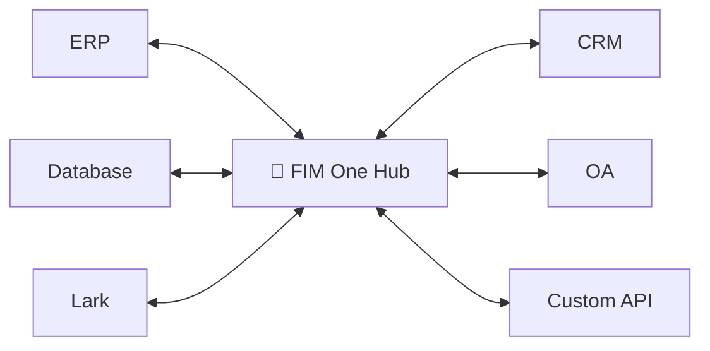
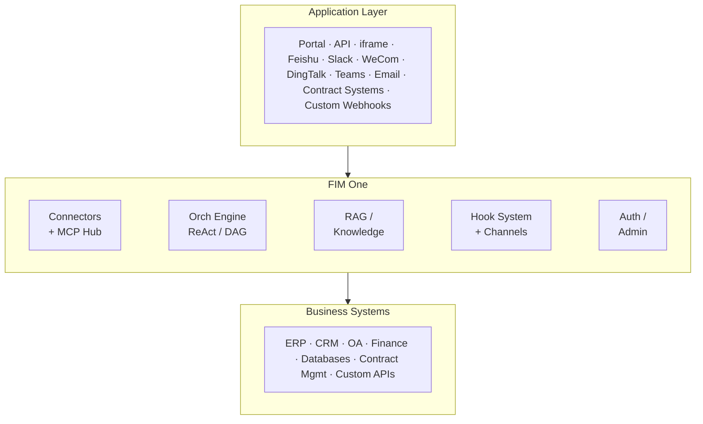

<div align="center">


[](https://github.com/fim-ai/fim-one/actions/workflows/test.yml)

[](https://discord.gg/z64czxdC7z)
[](https://x.com/FIM_One)

[🌐 English](README.md) | [🇨🇳 中文](README.zh.md) | [🇯🇵 日本語](README.ja.md) | [🇰🇷 한국어](README.ko.md) | [🇩🇪 Deutsch](README.de.md) | [🇫🇷 Français](README.fr.md)

**당신의 시스템들이 서로 통신하지 않습니다. FIM One은 AI 기반 브릿지입니다 — 코파일럿으로 임베드하거나, 모두를 허브로 연결하세요.**

🌐 [웹사이트](https://one.fim.ai/) · 📖 [문서](https://docs.fim.ai) · 📋 [변경 로그](https://docs.fim.ai/changelog) · 🐛 [버그 신고](https://github.com/fim-ai/fim-one/issues) · 💬 [Discord](https://discord.gg/z64czxdC7z) · 🐦 [Twitter](https://x.com/FIM_One) · 🏆 [Product Hunt](https://www.producthunt.com/products/fim-one)

</div>

> [!TIP]
> **☁️ 설정을 건너뛰세요 — FIM One을 클라우드에서 시도하세요.**
> 관리형 버전이 **[cloud.fim.ai](https://cloud.fim.ai/)**에서 라이브 중입니다: Docker 없음, API 키 없음, 설정 없음. 로그인하고 몇 초 안에 시스템 연결을 시작하세요. _얼리 액세스, 피드백 환영합니다._

---

## 개요

모든 회사는 서로 통신하지 않는 시스템들을 가지고 있습니다 — ERP, CRM, OA, 재무, HR, 커스텀 데이터베이스. FIM One은 기존 인프라를 수정하지 않고 이들을 모두 연결하는 **AI 기반 허브**입니다.

| 모드           | 설명                                              | 접근 방식                  |
| -------------- | ------------------------------------------------------- | ----------------------- |
| **Standalone** | 범용 AI 어시스턴트 — 검색, 코드, 지식베이스         | Portal                  |
| **Copilot**    | 호스트 시스템의 UI에 내장된 AI                       | iframe / widget / embed |
| **Hub**        | 연결된 모든 시스템 전반의 중앙 AI 오케스트레이션   | Portal / API            |



### 스크린샷

**대시보드** — 통계, 활동 트렌드, 토큰 사용량, 에이전트 및 대화에 대한 빠른 액세스.


**에이전트 채팅** — 연결된 데이터베이스에 대한 다단계 도구 호출을 포함한 ReAct 추론.


**DAG 플래너** — LLM이 생성한 실행 계획(병렬 단계 및 실시간 상태 추적 포함).


### 데모

**에이전트 사용**


**플래너 모드 사용**


## 빠른 시작

### Docker (권장)

```bash
git clone https://github.com/fim-ai/fim-one.git
cd fim-one

cp example.env .env
# Edit .env: set LLM_API_KEY (and optionally LLM_BASE_URL, LLM_MODEL)

docker compose up --build -d
```

http://localhost:3000 을 열어주세요 — 처음 실행할 때 관리자 계정을 만들게 됩니다. 끝입니다.

```bash
docker compose up -d          # start
docker compose down           # stop
docker compose logs -f        # view logs
```

### 로컬 개발

필수 요구사항: Python 3.11+, [uv](https://docs.astral.sh/uv/), Node.js 18+, pnpm.

```bash
git clone https://github.com/fim-ai/fim-one.git && cd fim-one

cp example.env .env           # Edit: set LLM_API_KEY

uv sync --all-extras
cd frontend && pnpm install && cd ..

./start.sh dev                # hot reload: Python --reload + Next.js HMR
```

| 명령어          | 시작되는 항목                       | URL                            |
| ---------------- | --------------------------------- | ------------------------------ |
| `./start.sh`         | Next.js + FastAPI                 | localhost:3000 (UI) + :8000    |
| `./start.sh dev`     | 동일, 핫 리로드 포함             | 동일                           |
| `./start.sh dev:api` | API만, 개발 모드 (핫 리로드)   | localhost:8000                 |
| `./start.sh dev:ui`  | 프론트엔드만, 개발 모드 (HMR)    | localhost:3000                 |
| `./start.sh api`     | FastAPI만 (헤드리스)           | localhost:8000/api             |

> 프로덕션 배포(Docker, 리버스 프록시, 무중단 업데이트)의 경우 [배포 가이드](https://docs.fim.ai/quickstart#production-deployment)를 참조하세요.

## 주요 기능

#### 커넥터 허브
- **세 가지 배포 모드** — 독립형 어시스턴트, 임베디드 코파일럿, 또는 중앙 허브; 동일한 에이전트 코어.
- **모든 시스템, 하나의 패턴** — API, 데이터베이스, MCP 서버 연결. 작업은 인증 주입과 함께 에이전트 도구로 자동 등록됩니다. 점진적 공개 메타 도구는 모든 도구 유형에서 토큰 사용량을 80% 이상 감소시킵니다.
- **데이터베이스 커넥터** — PostgreSQL, MySQL, Oracle, SQL Server, 그리고 중국 레거시 DB(DM, KingbaseES, GBase, Highgo). 스키마 내부 검사 및 AI 기반 주석.
- **세 가지 구축 방법** — OpenAPI 스펙 가져오기, AI 채팅 빌더, 또는 MCP 서버 직접 연결.

#### 계획 및 실행
- **동적 DAG 계획** — LLM이 런타임에 목표를 의존성 그래프로 분해합니다. 하드코딩된 워크플로우가 없습니다.
- **동시 실행** — 독립적인 단계는 asyncio를 통해 병렬로 실행되며, 최대 3라운드까지 자동 재계획합니다.
- **ReAct 에이전트** — 자동 오류 복구 기능이 있는 구조화된 추론-행동 루프입니다.
- **에이전트 하네스** — 프로덕션급 실행 환경: 5계층 token 예산 관리를 위한 ContextGuard, 도구 표면을 관리 가능하게 유지하기 위한 점진적 공개 메타 도구, 목표 편향을 방지하기 위한 자기 반성 루프입니다.
- **Hook 시스템** — LLM 루프 외부에서 실행되는 결정론적 강제 실행입니다. 첫 번째 출시: `FeishuGateHook`은 민감한 도구 호출을 Feishu 그룹에 게시된 인간 승인 카드 뒤에 배치합니다. 감사 로깅, 읽기 전용 모드 가드 및 속도 제한으로 확장 가능합니다(v0.9).
- **자동 라우팅** — 쿼리를 분류하고 최적의 모드(ReAct 또는 DAG)로 라우팅합니다. `AUTO_ROUTING`을 통해 구성 가능합니다.
- **확장된 사고** — OpenAI o-series, Gemini 2.5+, Claude에 대한 사고의 연쇄입니다.

#### 워크플로우 & 도구
- **시각적 워크플로우 편집기** — 12개 노드 타입, 드래그 앤 드롭 캔버스 (React Flow v12), JSON으로 가져오기/내보내기.
- **스마트 파일 처리** — 업로드된 파일이 자동으로 컨텍스트에 인라인되거나 (작은 파일) `read_uploaded_file` 도구를 통해 필요에 따라 읽을 수 있습니다. 지능형 문서 처리: PDF, DOCX, PPTX 파일은 모델이 비전을 지원할 때 비전 인식 처리 및 포함된 이미지 추출을 받습니다. 스마트 PDF 모드는 텍스트가 풍부한 페이지에서 텍스트를 추출하고 스캔된 페이지를 이미지로 렌더링합니다.
- **플러그인 가능한 도구** — Python, Node.js, 셸 실행 (선택적 Docker 샌드박스 `CODE_EXEC_BACKEND=docker`).
- **완전한 RAG 파이프라인** — Jina 임베딩 + LanceDB + 하이브리드 검색 + 리랭커 + 인라인 `[N]` 인용.
- **도구 아티팩트** — 풍부한 출력 (HTML 미리보기, 파일)이 채팅에서 렌더링됩니다.

#### 메시징 채널 (v0.8)
- **조직 범위 IM 브릿지** — Feishu (Lark)로의 아웃바운드 메시징을 위한 `BaseChannel` 추상화; Slack / WeCom / Teams / Email은 v0.9 로드맵에 포함됨.
- **Fernet 암호화 자격증명** — 앱 시크릿 및 암호화 키는 저장 시 암호화됨; 모든 인바운드 콜백은 서명 검증됨.
- **대화형 승인 카드** — 민감한 도구 호출이 발생하면 `FeishuGateHook`이 Feishu 그룹에 승인/거부 카드를 게시함; 도구는 그룹 멤버가 결정을 탭할 때까지 차단됨. 커스텀 워크플로우 엔진 없이 루프 내 인간 승인.
- **찾아보기 및 선택 UI** — Feishu 콘솔에서 원본 `chat_id` 값을 복사할 필요 없음; 포털이 Feishu API를 호출하고 그룹 선택기를 표시함.

#### 플랫폼
- **멀티테넌트** — JWT 인증, 조직 격리, 사용량 분석 및 커넥터 메트릭을 포함한 관리자 패널.
- **마켓플레이스** — 에이전트, 커넥터, 지식베이스, 스킬, 워크플로우 게시 및 구독.
- **글로벌 스킬(SOP)** — 모든 사용자를 위해 로드되는 재사용 가능한 운영 절차; 프로그레시브 모드는 토큰을 약 80% 절감.
- **6개 언어** — EN, ZH, JA, KO, DE, FR. 번역은 [완전히 자동화됨](https://docs.fim.ai/quickstart#internationalization).
- **초기 설정 마법사**, 다크/라이트 테마, 명령 팔레트, 스트리밍 SSE, DAG 시각화.

> 심화 학습: [아키텍처](https://docs.fim.ai/architecture/system-overview) · [훅 시스템](https://docs.fim.ai/architecture/hook-system) · [채널](https://docs.fim.ai/configuration/channels/overview) · [실행 모드](https://docs.fim.ai/concepts/execution-modes) · [FIM One을 선택하는 이유](https://docs.fim.ai/why) · [경쟁 환경](https://docs.fim.ai/strategy/competitive-landscape)

## 아키텍처



각 커넥터와 채널은 표준화된 브리지입니다 — 에이전트는 SAP, 커스텀 계약 시스템, 또는 Feishu 그룹과 통신하는지 여부를 알거나 신경 쓰지 않습니다. Hook 시스템은 LLM 루프 외부에서 플랫폼 코드를 실행하여 승인, 감사 및 속도 제한을 처리합니다. 채널은 외부 IM 플랫폼으로 아웃바운드 알림 및 승인 카드를 전달합니다. 자세한 내용은 [커넥터 아키텍처](https://docs.fim.ai/architecture/connector-architecture), [Hook 시스템](https://docs.fim.ai/architecture/hook-system), [채널](https://docs.fim.ai/configuration/channels/overview)을 참조하세요.

## 설정

FIM One은 **모든 OpenAI 호환 제공자**와 함께 작동합니다:

| 제공자           | `LLM_API_KEY` | `LLM_BASE_URL`                 | `LLM_MODEL`         |
| ------------------ | ------------- | ------------------------------ | -------------------- |
| **OpenAI**         | `sk-...`      | *(기본값)*                    | `gpt-4o`             |
| **DeepSeek**       | `sk-...`      | `https://api.deepseek.com/v1`  | `deepseek-chat`      |
| **Anthropic**      | `sk-ant-...`  | `https://api.anthropic.com/v1` | `claude-sonnet-4-6`  |
| **Ollama** (로컬) | `ollama`      | `http://localhost:11434/v1`    | `qwen2.5:14b`        |

최소 `.env`:

```bash
LLM_API_KEY=sk-your-key
# LLM_BASE_URL=https://api.openai.com/v1   # default
# LLM_MODEL=gpt-4o                         # default
JINA_API_KEY=jina_...                       # unlocks web tools + RAG
```

> 전체 참고: [환경 변수](https://docs.fim.ai/configuration/environment-variables)

## 기술 스택

| 계층       | 기술                                                          |
| ----------- | ------------------------------------------------------------------- |
| Backend     | Python 3.11+, FastAPI, SQLAlchemy, Alembic, asyncio                 |
| Frontend    | Next.js 14, React 18, Tailwind CSS, shadcn/ui, React Flow v12      |
| AI / RAG    | OpenAI 호환 LLM, Jina AI (임베딩 + 검색), LanceDB          |
| Database    | SQLite (개발) / PostgreSQL (프로덕션)                                    |
| Messaging   | Feishu Open Platform (Lark), Fernet 암호화 자격증명, HMAC 서명 검증 |
| Infra       | Docker, uv, pnpm, SSE 스트리밍                                    |

## 개발

```bash
uv sync --all-extras          # install dependencies
pytest                         # run tests
pytest --cov=fim_one           # with coverage
ruff check src/ tests/         # lint
mypy src/                      # type check
bash scripts/setup-hooks.sh    # install git hooks (enables auto i18n)
```

## 로드맵

전체 [로드맵](https://docs.fim.ai/roadmap)에서 버전 히스토리 및 계획된 기능을 확인하세요.

## FAQ

배포, LLM 제공자, 시스템 요구사항 등에 대한 일반적인 질문 — [FAQ](https://docs.fim.ai/faq)를 참조하세요.

## 기여하기

모든 종류의 기여를 환영합니다 — 코드, 문서, 번역, 버그 리포트, 아이디어 등.

> **Pioneer Program**: PR이 병합된 첫 100명의 기여자는 **Founding Contributors**로 인정되며, 영구적인 크레딧, 배지, 우선 이슈 지원을 받습니다. [자세히 알아보기 &rarr;](CONTRIBUTING.md#-pioneer-program)

**빠른 링크:**

- [**기여 가이드**](CONTRIBUTING.md) — 설정, 규칙, PR 프로세스
- [**개발 규칙**](https://docs.fim.ai/contributing) — 타입 안전성, 테스트, 코드 품질 표준
- [**Good First Issues**](https://github.com/fim-ai/fim-one/labels/good%20first%20issue) — 신규 기여자를 위해 선별됨
- [**Open Issues**](https://github.com/fim-ai/fim-one/issues) — 버그 & 기능 요청

**보안:** 취약점을 보고하려면 `[SECURITY]` 태그와 함께 [GitHub issue](https://github.com/fim-ai/fim-one/issues)를 열어주세요. 민감한 공개의 경우, Discord DM을 통해 저희에게 연락해주세요.

## Star History

<a href="https://star-history.com/#fim-ai/fim-one&Date">
  <picture>
    <source media="(prefers-color-scheme: dark)" srcset="https://api.star-history.com/svg?repos=fim-ai/fim-one&type=Date&theme=dark" />
    <source media="(prefers-color-scheme: light)" srcset="https://api.star-history.com/svg?repos=fim-ai/fim-one&type=Date" />
    
  </picture>
</a>

## 활동


## 기여자

이 멋진 분들께 감사드립니다 ([이모지 키](https://allcontributors.org/docs/en/emoji-key)):

<!-- ALL-CONTRIBUTORS-LIST:START - Do not remove or modify this section -->
<!-- prettier-ignore-start -->
<!-- markdownlint-disable -->
<table>
  <tbody>
    <tr>
      <td align="center" valign="top" width="14.28%"><a href="https://github.com/tao-hpu"><br /><sub><b>Tao An</b></sub></a><br /><a href="https://github.com/fim-ai/fim-one/commits?author=tao-hpu" title="Code">💻</a> <a href="#maintenance-tao-hpu" title="Maintenance">🚧</a> <a href="#design-tao-hpu" title="Design">🎨</a> <a href="https://github.com/fim-ai/fim-one/commits?author=tao-hpu" title="Documentation">📖</a> <a href="#projectManagement-tao-hpu" title="Project Management">📆</a> <a href="#ideas-tao-hpu" title="Ideas, Planning, & Feedback">🤔</a> <a href="#infra-tao-hpu" title="Infrastructure">🚇</a></td>
      <td align="center" valign="top" width="14.28%"><a href="https://github.com/tgonzalezc5"><br /><sub><b>Teo Gonzalez Collazo</b></sub></a><br /><a href="https://github.com/fim-ai/fim-one/commits?author=tgonzalezc5" title="Code">💻</a> <a href="https://github.com/fim-ai/fim-one/commits?author=tgonzalezc5" title="Tests">⚠️</a></td>
    </tr>
  </tbody>
</table>

<!-- markdownlint-restore -->
<!-- prettier-ignore-end -->
<!-- ALL-CONTRIBUTORS-LIST:END -->

이 프로젝트는 [all-contributors](https://allcontributors.org/) 명세를 따릅니다. 모든 종류의 기여를 환영합니다!

## 라이선스

FIM One Source Available License. 이는 **OSI 승인 오픈 소스 라이선스가 아닙니다**.

**허용**: 내부 사용, 수정, 라이선스 유지 배포, 경쟁하지 않는 애플리케이션에 임베딩.

**제한**: 멀티테넌트 SaaS, 경쟁하는 에이전트 플랫폼, 화이트 라벨링, 브랜딩 제거.

상용 라이선싱 문의는 [GitHub](https://github.com/fim-ai/fim-one)에서 이슈를 열어주세요.

전체 약관은 [LICENSE](LICENSE)를 참조하세요.

---

<div align="center">

🌐 [웹사이트](https://one.fim.ai/) · 📖 [문서](https://docs.fim.ai) · 📋 [변경 로그](https://docs.fim.ai/changelog) · 🐛 [버그 보고](https://github.com/fim-ai/fim-one/issues) · 💬 [Discord](https://discord.gg/z64czxdC7z) · 🐦 [Twitter](https://x.com/FIM_One) · 🏆 [Product Hunt](https://www.producthunt.com/products/fim-one)

</div>
