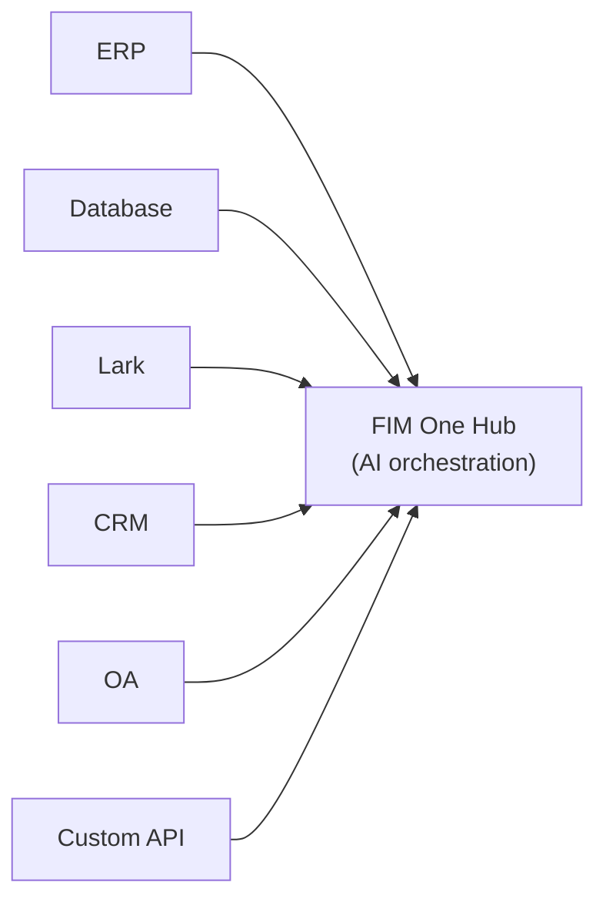
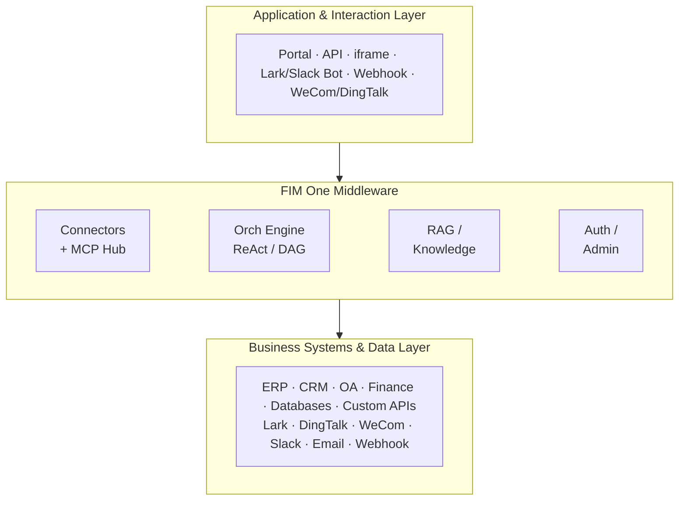
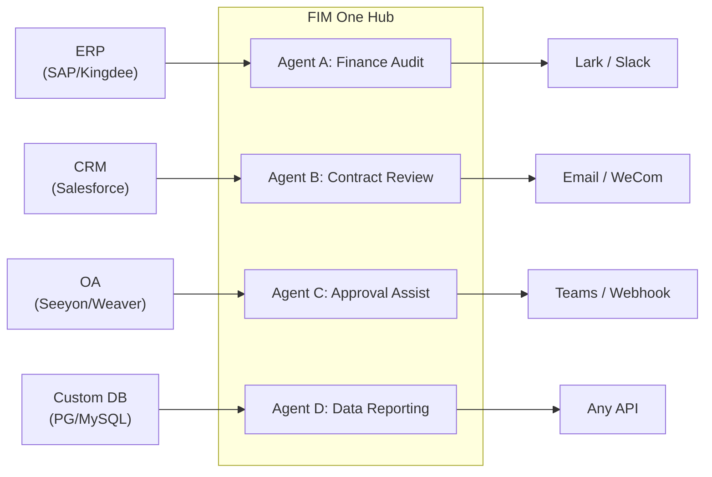
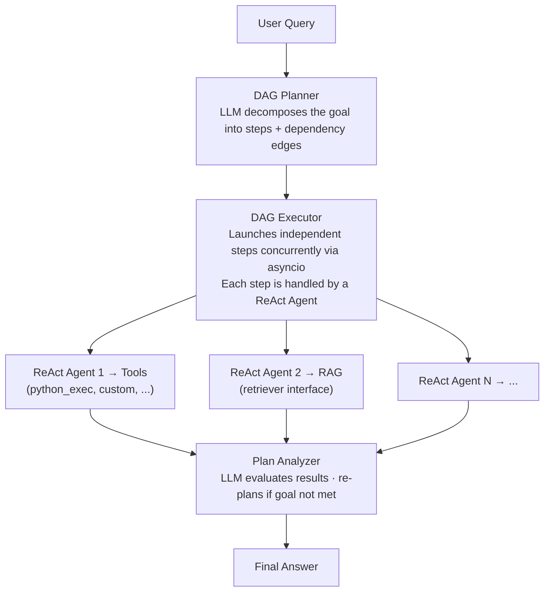

<div align="center">


[](https://github.com/fim-ai/fim-one/actions/workflows/test.yml)

[](https://discord.gg/z64czxdC7z)
[](https://x.com/FIM_One)

[🌐 English](README.md) | [🇨🇳 中文](README.zh.md) | [🇯🇵 日本語](README.ja.md) | [🇰🇷 한국어](README.ko.md) | [🇩🇪 Deutsch](README.de.md) | [🇫🇷 Français](README.fr.md)

**당신의 시스템들이 서로 통신하지 않습니다. FIM One은 AI 기반 브릿지입니다 — 코파일럿으로 임베드하거나, 모두를 허브로 연결하세요.**

🌐 [웹사이트](https://one.fim.ai/) · 📖 [문서](https://docs.fim.ai) · 📋 [변경 로그](https://docs.fim.ai/changelog) · 🐛 [버그 신고](https://github.com/fim-ai/fim-one/issues) · 💬 [Discord](https://discord.gg/z64czxdC7z) · 🐦 [Twitter](https://x.com/FIM_One) · 🏆 [Product Hunt](https://www.producthunt.com/products/fim-one)

</div>

> [!TIP]
> **☁️ 설정을 건너뛰세요 — FIM One을 클라우드에서 시도하세요.**
> 관리형 버전이 **[cloud.fim.ai](https://cloud.fim.ai/)**에서 라이브 중입니다: Docker 없음, API 키 없음, 설정 없음. 로그인하고 몇 초 안에 시스템 연결을 시작하세요. _얼리 액세스, 피드백 환영합니다._

---

## 목차

- [개요](#overview)
- [사용 사례](#use-cases)
- [FIM One을 선택하는 이유](#why-fim-one)
- [FIM One의 위치](#where-fim-one-sits)
- [주요 기능](#key-features)
- [아키텍처](#architecture)
- [빠른 시작](#quick-start) (Docker / Local / Production)
- [구성](#configuration)
- [개발](#development)
- [로드맵](#roadmap)
- [기여](#contributing)
- [스타 히스토리](#star-history)
- [활동](#activity)
- [기여자](#contributors)
- [라이선스](#license)

## 개요

모든 회사는 서로 통신하지 않는 시스템들을 가지고 있습니다 — ERP, CRM, OA, 재무, HR, 커스텀 데이터베이스. 각 벤더의 AI는 자신의 영역 내에서는 똑똑하지만, 다른 모든 것에는 맹목적입니다. FIM One은 기존 인프라를 수정하지 않으면서 AI를 통해 모든 시스템을 연결하는 **외부 제3자 허브**입니다. 세 가지 배포 모드, 하나의 에이전트 코어:

| 모드           | 설명                                                                       | 접근 방식                       |
| -------------- | -------------------------------------------------------------------------------- | --------------------------------------- |
| **Standalone** | 범용 AI 어시스턴트 — 검색, 코드, 지식 베이스                      | 포털                                  |
| **Copilot**    | 호스트 시스템에 내장된 AI — 사용자의 기존 UI에서 함께 작동        | iframe / 위젯 / 호스트 페이지에 임베드 |
| **Hub**        | 중앙 AI 오케스트레이션 — 모든 시스템 연결, 시스템 간 인텔리전스 | 포털 / API                            |



코어는 항상 동일합니다: ReAct 추론 루프, 동시 실행을 지원하는 동적 DAG 계획, 플러그인 가능한 도구, 그리고 제로 벤더 종속성을 갖춘 프로토콜 우선 아키텍처.

### 에이전트 사용


### Planner 모드 사용


## 사용 사례

엔터프라이즈 데이터와 워크플로우는 OA, ERP, 재무 및 승인 시스템 내에 갇혀 있습니다. FIM One을 사용하면 AI 에이전트가 이러한 시스템을 읽고 쓸 수 있으므로 기존 인프라를 수정하지 않고도 시스템 간 프로세스를 자동화할 수 있습니다.

| 시나리오                  | 권장 시작점 | 자동화 대상                                                                                                |
| ------------------------- | ----------- | --------------------------------------------------------------------------------------------------------- |
| **법무 & 컴플라이언스**    | Copilot → Hub     | 계약 조항 추출, 버전 비교, 출처 인용이 포함된 위험 플래그 지정, OA 승인 자동 트리거          |
| **IT 운영**         | Hub               | 알림 발생 → 로그 수집 → 근본 원인 분석 → Lark/Slack으로 수정 사항 전달 — 하나의 완전한 루프                 |
| **비즈니스 운영**   | Copilot           | 예약된 데이터 요약을 팀 채널로 푸시; 라이브 데이터베이스에 대한 임시 자연어 쿼리         |
| **재무 자동화**    | Hub               | 송장 검증, 비용 승인 라우팅, ERP 및 회계 시스템 간 원장 조정          |
| **조달**           | Copilot → Hub     | 요구사항 → 공급업체 비교 → 계약 초안 → 승인 — 에이전트가 시스템 간 핸드오프 처리           |
| **개발자 통합** | API               | OpenAPI 사양을 가져오거나 채팅에서 API 설명 — 몇 분 내에 커넥터 생성, 에이전트 도구로 자동 등록 |

# FIM One을 선택해야 하는 이유

(Note: I'm ready to translate the content that follows this heading. Please provide the full section text under "## Why FIM One" that you'd like me to translate.)

### 점진적 확대

먼저 **Copilot**을 하나의 시스템(예: ERP)에 내장하세요. 사용자는 익숙한 인터페이스 내에서 AI와 상호작용합니다: 재무 데이터를 조회하고, 보고서를 생성하고, 페이지를 떠나지 않고 답변을 얻습니다.

가치가 입증되면 **Hub**를 설정하세요 — 모든 시스템을 연결하는 중앙 포털입니다. ERP Copilot은 계속 내장된 상태로 실행되고, Hub는 시스템 간 오케스트레이션을 추가합니다: CRM에서 계약을 조회하고, OA에서 승인을 확인하고, Lark에서 이해관계자에게 알림을 보냅니다 — 모두 한 곳에서.

Copilot은 하나의 시스템 내에서 가치를 입증합니다. Hub는 모든 시스템에 걸쳐 가치를 발휘합니다.

### FIM One이 하지 않는 것

FIM One은 대상 시스템에 이미 존재하는 워크플로우 로직을 복제하지 않습니다:

- **BPM/FSM 엔진 없음** — 승인 체인, 라우팅, 에스컬레이션 및 상태 머신은 대상 시스템의 책임입니다. 이러한 시스템들은 이 로직을 구축하는 데 수년을 투자했습니다.
- **BPM/FSM 워크플로우 엔진 없음** — FIM One의 Workflow Blueprints는 비즈니스 프로세스 관리가 아닌 자동화 템플릿(LLM 호출, 조건 분기, 커넥터 작업)입니다. 승인 체인, 라우팅 규칙 및 상태 머신은 대상 시스템에 속합니다.
- **커넥터 = API 호출** — 커넥터의 관점에서 "승인 이전" = 하나의 API 호출, "사유와 함께 거부" = 하나의 API 호출입니다. 모든 복잡한 워크플로우 작업은 HTTP 요청으로 축소됩니다. FIM One은 API를 호출하고, 대상 시스템이 상태를 관리합니다.

이는 기능 부족이 아닌 의도적인 아키텍처 경계입니다.

### 경쟁 포지셔닝

|                        | Dify                       | Manus            | Coze                  | FIM One                      |
| ---------------------- | -------------------------- | ---------------- | --------------------- | ---------------------------- |
| **접근 방식**           | 시각적 워크플로우 빌더    | 자율 에이전트 | 빌더 + 에이전트 공간 | AI 커넥터 허브             |
| **계획**           | 사람이 설계한 정적 DAG | 멀티 에이전트 CoT  | 정적 + 동적      | LLM DAG 계획 + ReAct     |
| **크로스 시스템**       | API 노드 (수동)         | 없음               | 플러그인 마켓플레이스    | Hub Mode (N:N 오케스트레이션) |
| **사람 확인** | 없음                         | 없음               | 없음                    | 예 (실행 전 게이트)     |
| **자체 호스팅**        | 예 (Docker 스택)         | 없음               | 예 (Coze Studio)     | 예 (단일 프로세스)         |

> 심화 학습: [Philosophy](https://docs.fim.ai/architecture/philosophy) | [Execution Modes](https://docs.fim.ai/concepts/execution-modes) | [Competitive Landscape](https://docs.fim.ai/strategy/competitive-landscape)

### FIM One의 위치

```
                Static Execution          Dynamic Execution
            ┌──────────────────────┬──────────────────────┐
 Static     │ BPM / Workflow       │ ACM                  │
 Planning   │ Camunda, Activiti    │ (Salesforce Case)    │
            │ Dify, n8n, Coze     │                      │
            ├──────────────────────┼──────────────────────┤
 Dynamic    │ (transitional —      │ Autonomous Agent     │
 Planning   │  unstable quadrant)  │ AutoGPT, Manus       │
            │                      │ ★ FIM One (bounded)│
            └──────────────────────┴──────────────────────┘
```

Dify/n8n은 **정적 계획 + 정적 실행** — 인간이 시각적 캔버스에서 DAG를 설계하고, 노드는 고정된 작업을 실행합니다. FIM One은 **동적 계획 + 동적 실행** — LLM이 런타임에 DAG를 생성하고, 각 노드는 ReAct 루프를 실행하며, 목표가 달성되지 않으면 재계획합니다. 하지만 제한적입니다(최대 3회 재계획, 토큰 예산, 확인 게이트). 따라서 AutoGPT보다 더 제어됩니다.

FIM One은 BPM/FSM을 수행하지 않습니다 — 워크플로우 로직은 대상 시스템에 속하며, 커넥터는 단지 API를 호출합니다.

> 전체 설명: [Philosophy](https://docs.fim.ai/architecture/philosophy)

## 주요 기능

#### 커넥터 플랫폼 (핵심)
- **커넥터 허브 아키텍처** — 독립형 어시스턴트, 임베디드 코파일럿, 또는 중앙 허브 — 동일한 에이전트 코어, 다양한 전달 방식.
- **모든 시스템, 하나의 패턴** — API, 데이터베이스, 메시지 버스 연결. 액션은 인증 주입(Bearer, API Key, Basic)과 함께 에이전트 도구로 자동 등록.
- **데이터베이스 커넥터** — PostgreSQL, MySQL, Oracle, SQL Server 및 중국 레거시 데이터베이스(DM, KingbaseES, GBase, Highgo)에 직접 SQL 액세스. 스키마 내부 검사, AI 기반 주석, 읽기 전용 쿼리 실행, 저장된 암호화된 자격증명. 각 DB 커넥터는 3개의 도구(`list_tables`, `describe_table`, `query`)를 자동 생성.
- **커넥터 구축 3가지 방법:**
  - *OpenAPI 스펙 가져오기* — YAML/JSON/URL 업로드; 커넥터 및 모든 액션 자동 생성.
  - *AI 채팅 빌더* — 자연어로 API 설명; AI가 대화 중 액션 구성을 생성하고 반복. 10개의 전문화된 빌더 도구가 커넥터 설정, 액션, 테스트, 에이전트 연결을 처리.
  - *MCP 에코시스템* — 모든 MCP 서버 직접 연결; 써드파티 MCP 커뮤니티가 기본으로 작동.

#### 지능형 계획 및 실행
- **동적 DAG 계획** — LLM이 런타임에 목표를 종속성 그래프로 분해합니다. 하드코딩된 워크플로우가 없습니다.
- **동시 실행** — asyncio를 통해 독립적인 단계가 병렬로 실행됩니다.
- **DAG 재계획** — 목표가 달성되지 않으면 최대 3라운드까지 자동으로 계획을 수정합니다.
- **ReAct 에이전트** — 자동 오류 복구 기능이 있는 구조화된 추론-행동 루프입니다.
- **자동 라우팅** — 자동 쿼리 분류가 각 요청을 최적의 실행 모드(ReAct 또는 DAG)로 라우팅합니다. 프론트엔드는 3방향 토글(자동/표준/계획)을 지원합니다. `AUTO_ROUTING`을 통해 구성 가능합니다.
- **확장된 사고** — 지원되는 모델(OpenAI o-series, Gemini 2.5+, Claude)에 대해 `LLM_REASONING_EFFORT`를 통해 사고의 연쇄 추론을 활성화합니다. 모델의 추론은 UI의 "thinking" 단계에 표시됩니다.

#### 워크플로우 블루프린트
- **비주얼 워크플로우 에디터** — React Flow v12 기반의 드래그 앤 드롭 캔버스로 다단계 자동화 블루프린트를 설계합니다. 12가지 노드 타입: Start, End, LLM, Condition Branch, Question Classifier, 에이전트, Knowledge Retrieval, 커넥터, HTTP Request, Variable Assign, Template Transform, Code Execution.
- **위상 정렬 실행 엔진** — 워크플로우는 노드를 종속성 순서대로 실행하며, 조건부 분기, 노드 간 변수 전달, 실시간 SSE 상태 스트리밍을 지원합니다.
- **가져오기/내보내기** — 워크플로우 블루프린트를 JSON으로 공유합니다. 보안 자격증명 처리를 위한 암호화된 환경 변수를 지원합니다.

#### 도구 및 통합
- **플러그인 가능한 도구 시스템** — 자동 발견; Python 실행기, Node.js 실행기, 계산기, 웹 검색/가져오기, HTTP 요청, 셸 실행 등이 포함됩니다.
- **플러그인 가능한 샌드박스** — `python_exec` / `node_exec` / `shell_exec`는 로컬 또는 Docker 모드(`CODE_EXEC_BACKEND=docker`)에서 실행되어 OS 수준 격리(`--network=none`, `--memory=256m`)를 제공합니다. SaaS 및 멀티테넌트 배포에 안전합니다.
- **MCP 프로토콜** — 모든 MCP 서버를 도구로 연결합니다. 타사 MCP 생태계가 기본으로 작동합니다.
- **도구 아티팩트 시스템** — 도구는 풍부한 출력(HTML 미리보기, 생성된 파일)을 생성하며 채팅 내 렌더링 및 다운로드를 지원합니다. HTML 아티팩트는 샌드박스 iframe에서 렌더링되고, 파일 아티팩트는 다운로드 칩을 표시합니다.
- **OpenAI 호환** — 모든 `/v1/chat/completions` 제공자(OpenAI, DeepSeek, Qwen, Ollama, vLLM…)와 작동합니다.

#### RAG & 지식
- **전체 RAG 파이프라인** — Jina 임베딩 + LanceDB + FTS + RRF 하이브리드 검색 + 리랭커. PDF, DOCX, Markdown, HTML, CSV를 지원합니다.
- **근거 기반 생성** — 증거 기반 RAG with 인라인 `[N]` 인용, 충돌 감지, 및 설명 가능한 신뢰도 점수.
- **KB 문서 관리** — 청크 수준 CRUD, 청크 전체 텍스트 검색, 실패한 문서 재시도, 및 자동 마이그레이션 벡터 저장소 스키마.

#### Portal & UX
- **Real-time Streaming (SSE v2)** — Split event protocol (`done` / `suggestions` / `title` / `end`) with streaming dot-pulse cursor, KaTeX math rendering, and tool step folding.
- **DAG Visualization** — Interactive flow graph with live status, dependency edges, click-to-scroll, and re-plan round snapshots as collapsible cards.
- **Conversational Interrupt** — Send follow-up messages while the 에이전트 is running; injected at the next iteration boundary.
- **Dark / Light / System Theme** — Full theme support with system-preference detection.
- **Command Palette** — Conversation search, starring, batch operations, and title rename.

#### 플랫폼 & 멀티테넌트
- **JWT Auth** — 토큰 기반 SSE 인증, 대화 소유권, 사용자별 리소스 격리.
- **에이전트 관리** — 바인딩된 모델, 도구 및 지시사항으로 에이전트를 생성, 구성 및 게시. 에이전트별 실행 모드(Standard/Planner) 및 온도 제어. 선택적 `discoverable` 플래그는 CallAgentTool을 통한 LLM 자동 발견을 활성화합니다.
- **글로벌 스킬(SOP)** — 스킬은 모든 사용자에게 전역적으로 적용되는 재사용 가능한 표준 운영 절차입니다. 에이전트 선택과 관계없이 가시성(개인/조직/마켓플레이스)에 따라 로드됩니다. 프로그레시브 모드(기본값)에서는 시스템 프롬프트에 컴팩트 스텁이 포함되며, LLM이 `read_skill(name)`을 호출하여 필요에 따라 전체 콘텐츠를 로드하므로 토큰 비용을 약 80% 절감합니다. 스킬의 SOP가 에이전트를 참조하는 경우 LLM이 `call_agent`를 통해 위임할 수 있습니다.
- **마켓플레이스(Shadow Market Org)** — 기본 제공 Market 조직은 리소스 공유를 위한 보이지 않는 백엔드 엔티티로 작동합니다. 리소스는 마켓플레이스 브라우징을 통해 발견되고 명시적으로 구독됩니다(풀 모델). 자동 가입 멤버십은 없습니다. 마켓플레이스에 게시하려면 항상 검토가 필요합니다.
- **리소스 구독** — 사용자는 마켓플레이스에서 공유 리소스를 브라우징하고 구독합니다. UI 또는 API를 통해 구독/구독 취소합니다. 모든 리소스 유형(에이전트, 커넥터, 지식 베이스, MCP 서버, 스킬, 워크플로우)은 마켓플레이스 게시 및 구독 관리를 지원합니다.
- **관리자 패널** — 시스템 통계 대시보드(사용자, 대화, 토큰, 모델 사용량 차트, 에이전트별 토큰 분석), 커넥터 호출 메트릭(성공률, 지연 시간, 호출 수), 검색/페이지네이션이 있는 사용자 관리, 역할 전환, 비밀번호 재설정, 계정 활성화/비활성화 및 도구별 활성화/비활성화 제어.
- **초기 설정 마법사** — 첫 실행 시 포털은 관리자 계정(사용자명, 비밀번호, 이메일) 생성을 안내합니다. 이 일회성 설정이 로그인 자격증명이 되며, 구성 파일이 필요하지 않습니다.
- **개인 센터** — 사용자별 글로벌 시스템 지시사항으로 모든 대화에 적용됩니다.
- **언어 설정** — 사용자별 언어 설정(자동/en/zh)으로 모든 LLM 응답을 선택한 언어로 지정합니다.

#### 컨텍스트 및 메모리
- **LLM Compact** — 토큰 예산 내에서 유지하기 위한 자동 LLM 기반 요약.
- **ContextGuard + Pinned Messages** — 토큰 예산 관리자; 고정된 메시지는 압축으로부터 보호됨.
- **이중 데이터베이스 지원** — SQLite (빠른 시작을 위한 기본 설정, 설정 불필요); PostgreSQL (프로덕션 및 다중 워커 배포용). Docker Compose는 상태 확인과 함께 PostgreSQL을 자동으로 프로비저닝합니다. `docker compose up`을 실행하면 바로 시작됩니다.

## 아키텍처

### 시스템 개요



### 커넥터 허브



*Portal / API / iframe*

각 커넥터는 표준화된 브릿지입니다 — 에이전트는 SAP와 통신하는지 커스텀 PostgreSQL 데이터베이스와 통신하는지 알거나 신경 쓰지 않습니다. 자세한 내용은 [커넥터 아키텍처](https://docs.fim.ai/architecture/connector-architecture)를 참조하세요.

### 내부 실행

FIM One은 두 가지 실행 모드를 제공하며, 자동으로 라우팅됩니다:

| 모드         | 최적 사용 사례             | 작동 방식                                                          |
| ------------ | ------------------------- | ------------------------------------------------------------------ |
| Auto         | 모든 쿼리 (기본값)         | 빠른 LLM이 쿼리를 분류하고 ReAct 또는 DAG로 라우팅                 |
| ReAct        | 단일 복잡한 쿼리           | Reason → Act → Observe 루프와 도구 사용                            |
| DAG Planning | 다단계 병렬 작업           | LLM이 종속성 그래프를 생성하고, 독립적인 단계가 동시에 실행됨      |



## 빠른 시작

### Option A: Docker (권장)

로컬 Python 또는 Node.js가 필요 없습니다 — 모든 것이 컨테이너 내에서 빌드됩니다.

```bash
git clone https://github.com/fim-ai/fim-one.git
cd fim-one

# Configure — only LLM_API_KEY is required
cp example.env .env
# Edit .env: set LLM_API_KEY (and optionally LLM_BASE_URL, LLM_MODEL)

# Build and run (first time, or after pulling new code)
docker compose up --build -d
```

http://localhost:3000 을 열면 — 첫 실행 시 관리자 계정 생성 과정을 거치게 됩니다. 끝입니다.

초기 빌드 후 이후 시작은 다음만 필요합니다:

```bash
docker compose up -d          # start (skip rebuild if image unchanged)
docker compose down           # stop
docker compose logs -f        # view logs
```

데이터는 Docker 명명된 볼륨(`fim-data`, `fim-uploads`)에 유지되며 컨테이너 재시작 후에도 유지됩니다.

> **참고:** Docker 모드는 핫 리로드를 지원하지 않습니다. 코드 변경 시 이미지를 다시 빌드해야 합니다(`docker compose up --build -d`). 라이브 리로드를 사용한 활성 개발의 경우 아래의 **Option B**를 사용하세요.

### Option B: 로컬 개발

필수 요구사항: Python 3.11+, [uv](https://docs.astral.sh/uv/), Node.js 18+, pnpm.

```bash
git clone https://github.com/fim-ai/fim-one.git
cd fim-one

cp example.env .env
# Edit .env: set LLM_API_KEY

# Install
uv sync --all-extras
cd frontend && pnpm install && cd ..

# Launch (with hot reload)
./start.sh dev
```

| 명령어           | 시작되는 항목                                           | URL                                      |
| ---------------- | ------------------------------------------------------- | ---------------------------------------- |
| `./start.sh`     | Next.js + FastAPI                                       | http://localhost:3000 (UI) + :8000 (API) |
| `./start.sh dev` | 동일, 핫 리로드 포함 (Python `--reload` + Next.js HMR) | 동일                                     |
| `./start.sh api` | FastAPI만 (헤드리스, 통합 또는 테스트용)                | http://localhost:8000/api                |

### 프로덕션 배포

두 가지 옵션 모두 프로덕션에서 작동합니다:

| 방법       | 명령어                 | 최적 사용 사례                              |
| ---------- | ---------------------- | ------------------------------------------- |
| **Docker** | `docker compose up -d` | 무관리 배포, 쉬운 업데이트                  |
| **스크립트** | `./start.sh`           | 베어메탈 서버, 커스텀 프로세스 관리자       |

두 방법 모두에서 HTTPS 및 커스텀 도메인을 위해 Nginx 리버스 프록시를 앞에 배치하세요:

```
User → Nginx (443/HTTPS) → localhost:3000
```

API는 내부적으로 포트 8000에서 실행되며, Next.js가 `/api/*` 요청을 자동으로 프록시합니다. 포트 3000만 노출하면 됩니다.

**실행 중인 배포 업데이트** (무중단):

```bash
cd /path/to/fim-one \
  && git pull origin master \
  && sudo docker compose build \
  && sudo docker compose up -d \
  && sudo docker image prune -f
```

`build`는 기존 컨테이너가 트래픽을 계속 처리하는 동안 먼저 실행됩니다. `up -d`는 이미지가 변경된 컨테이너만 교체하므로, 다운타임이 몇 분이 아닌 약 10초입니다.

코드 실행 샌드박스(`CODE_EXEC_BACKEND=docker`)를 사용하는 경우 Docker 소켓을 마운트하세요:

```yaml
# docker-compose.yml
volumes:
  - /var/run/docker.sock:/var/run/docker.sock
```

## 설정

### 권장 설정

FIM One은 **모든 OpenAI 호환 LLM 제공자**와 함께 작동합니다 — OpenAI, DeepSeek, Anthropic, Qwen, Ollama, vLLM 등. 원하는 것을 선택하세요:

| 제공자             | `LLM_API_KEY` | `LLM_BASE_URL`                 | `LLM_MODEL`         |
| ------------------ | ------------- | ------------------------------ | ------------------- |
| **OpenAI**         | `sk-...`      | *(기본값)*                     | `gpt-4o`            |
| **DeepSeek**       | `sk-...`      | `https://api.deepseek.com/v1`  | `deepseek-chat`     |
| **Anthropic**      | `sk-ant-...`  | `https://api.anthropic.com/v1` | `claude-sonnet-4-6` |
| **Ollama** (로컬)  | `ollama`      | `http://localhost:11434/v1`    | `qwen2.5:14b`       |

**[Jina AI](https://jina.ai/)**는 웹 검색/페칭, 임베딩 및 전체 RAG 파이프라인을 지원합니다 (무료 티어 제공).

최소 `.env`:

```bash
LLM_API_KEY=sk-your-key
# LLM_BASE_URL=https://api.openai.com/v1   # default — change for other providers
# LLM_MODEL=gpt-4o                         # default — change for other models

JINA_API_KEY=jina_...                       # unlocks web tools + RAG
```

### 모든 변수

모든 구성 옵션(LLM, 에이전트 실행, 웹 도구, RAG, 코드 실행, 이미지 생성, 커넥터, 플랫폼, OAuth)에 대한 전체 [환경 변수](https://docs.fim.ai/configuration/environment-variables) 참조를 확인하세요.

## 개발

```bash
# Install all dependencies (including dev extras)
uv sync --all-extras

# Run tests
pytest

# Run tests with coverage
pytest --cov=fim_one --cov-report=term-missing

# Lint
ruff check src/ tests/

# Type check
mypy src/

# Install git hooks (run once after clone — enables auto i18n translation on commit)
bash scripts/setup-hooks.sh
```

## 국제화 (i18n)

FIM One은 **6개 언어**를 지원합니다: 영어, 중국어, 일본어, 한국어, 독일어, 프랑스어. 번역은 완전히 자동화되어 있으므로 영어 소스 파일만 편집하면 됩니다.

**지원 언어**: `en` `zh` `ja` `ko` `de` `fr`

| 항목 | 소스 (이것을 편집하세요) | 자동 생성됨 (편집하지 마세요) |
|------|--------------------|-----------------------------|
| UI 문자열 | `frontend/messages/en/*.json` | `frontend/messages/{locale}/*.json` |
| 문서 | `docs/*.mdx` | `docs/{locale}/*.mdx` |
| README | `README.md` | `README.{locale}.md` |

**작동 방식**: 사전 커밋 훅이 영어 파일의 변경 사항을 감지하고 프로젝트의 Fast LLM을 통해 번역합니다. 번역은 증분식으로 진행되므로 새로 추가되거나 수정되거나 삭제된 콘텐츠만 처리됩니다.

```bash
# 설정 (클론 후 한 번만 실행)
bash scripts/setup-hooks.sh

# 전체 번역 (처음 또는 새 로케일 추가 후)
uv run scripts/translate.py --all

# 특정 파일 번역
uv run scripts/translate.py --files frontend/messages/en/common.json

# 대상 로케일 재정의
uv run scripts/translate.py --all --locale ja ko

# 병렬 API 호출 증가 (기본값: 3, API가 허용하면 증가)
uv run scripts/translate.py --all --concurrency 10

# 일일 워크플로우: 커밋하기만 하면 훅이 자동으로 모든 것을 처리합니다
git add frontend/messages/en/common.json
git commit -m "feat(i18n): add new strings"  # 훅이 자동으로 번역합니다
```

| 플래그 | 기본값 | 설명 |
|------|---------|-------------|
| `--all` | — | 모든 것을 다시 번역합니다 (캐시 무시) |
| `--files` | — | 특정 파일만 번역합니다 |
| `--locale` | 자동 감지 | 대상 로케일 재정의 |
| `--concurrency` | 3 | 최대 병렬 LLM API 호출 |
| `--force` | — | 모든 JSON 키를 강제로 다시 번역합니다 |

**새 언어 추가**: `mkdir frontend/messages/{locale}` → `--all` 실행 → `frontend/src/i18n/request.ts`의 `SUPPORTED_LOCALES`에 로케일 추가

## 로드맵

전체 [로드맵](https://docs.fim.ai/roadmap)에서 버전 히스토리 및 향후 계획을 확인하세요.

## 기여하기

모든 종류의 기여를 환영합니다 — 코드, 문서, 번역, 버그 보고, 아이디어.

> **Pioneer Program**: PR이 병합된 첫 100명의 기여자는 **Founding Contributors**로 인정되며, 프로젝트에 영구적인 크레딧, 프로필 배지, 우선 이슈 지원을 받습니다. [자세히 알아보기 &rarr;](CONTRIBUTING.md#-pioneer-program)

**빠른 링크:**

- [**기여 가이드**](CONTRIBUTING.md) — 설정, 규칙, PR 프로세스
- [**Good First Issues**](https://github.com/fim-ai/fim-one/labels/good%20first%20issue) — 신규 기여자를 위해 선별됨
- [**Open Issues**](https://github.com/fim-ai/fim-one/issues) — 버그 & 기능 요청

## Star History

<a href="https://star-history.com/#fim-ai/fim-one&Date">
  <picture>
    <source media="(prefers-color-scheme: dark)" srcset="https://api.star-history.com/svg?repos=fim-ai/fim-one&type=Date&theme=dark" />
    <source media="(prefers-color-scheme: light)" srcset="https://api.star-history.com/svg?repos=fim-ai/fim-one&type=Date" />
    
  </picture>
</a>

## 활동


## 기여자

이 멋진 분들께 감사드립니다 ([이모지 키](https://allcontributors.org/docs/en/emoji-key)):

<!-- ALL-CONTRIBUTORS-LIST:START - Do not remove or modify this section -->
<!-- prettier-ignore-start -->
<!-- markdownlint-disable -->
<!-- markdownlint-restore -->
<!-- prettier-ignore-end -->
<!-- ALL-CONTRIBUTORS-LIST:END -->

[](https://github.com/fim-ai/fim-one/graphs/contributors)

이 프로젝트는 [all-contributors](https://allcontributors.org/) 사양을 따릅니다. 모든 종류의 기여를 환영합니다!

## 라이선스

FIM One Source Available License. 이는 **OSI 승인 오픈 소스 라이선스가 아닙니다**.

**허용됨**: 내부 사용, 수정, 라이선스 유지 상태의 배포, 자신의 (경쟁하지 않는) 애플리케이션에 임베딩.

**제한됨**: 멀티테넌트 SaaS, 경쟁하는 에이전트 플랫폼, 화이트 라벨링, 브랜딩 제거.

상용 라이선싱 문의는 [GitHub](https://github.com/fim-ai/fim-one)에서 이슈를 열어주세요.

전체 약관은 [LICENSE](LICENSE)를 참조하세요.

---

<div align="center">

🌐 [웹사이트](https://one.fim.ai/) · 📖 [문서](https://docs.fim.ai) · 📋 [변경 로그](https://docs.fim.ai/changelog) · 🐛 [버그 신고](https://github.com/fim-ai/fim-one/issues) · 💬 [Discord](https://discord.gg/z64czxdC7z) · 🐦 [Twitter](https://x.com/FIM_One) · 🏆 [Product Hunt](https://www.producthunt.com/products/fim-one)

</div>
