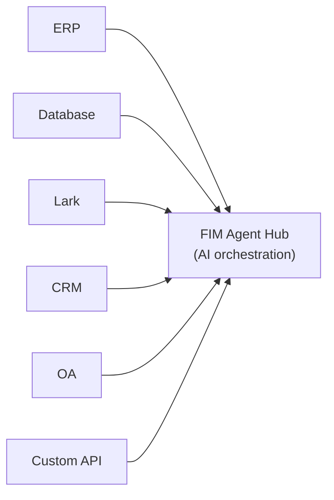
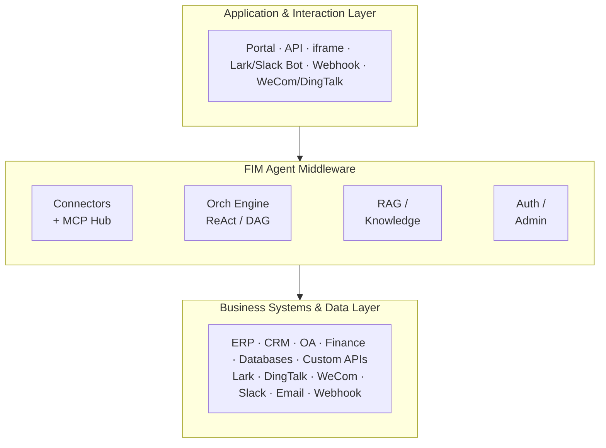
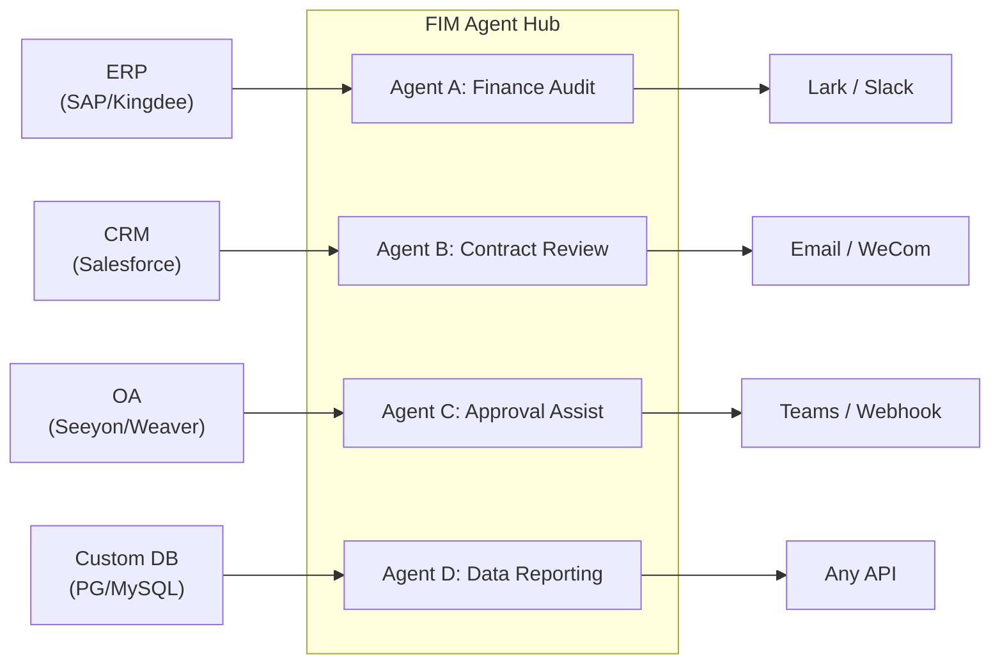
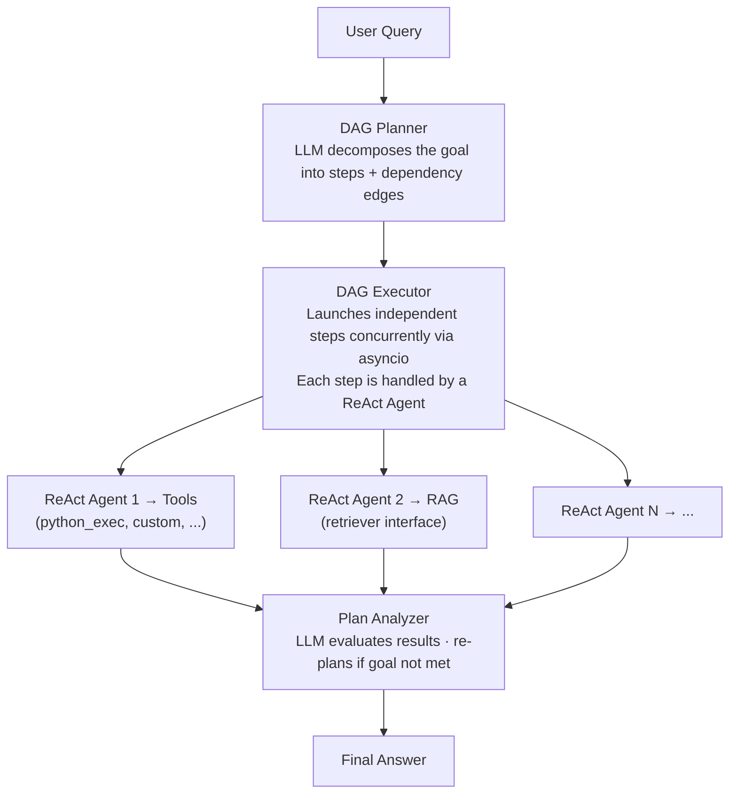

<div align="center">


[](https://github.com/fim-ai/fim-agent/stargazers)
[](https://github.com/fim-ai/fim-agent/network)
[](https://github.com/fim-ai/fim-agent/issues)
[](https://x.com/FIM_Agent)
[](https://discord.gg/z64czxdC7z)

🌐 **English** | [🇨🇳 中文](README.zh.md)

**AI-Powered Connector Hub — embed into one system as a Copilot, or connect them all as a Hub.**

🌐 [Website](https://agent.fim.ai/) · 📖 [Docs](https://docs.fim.ai) · 📋 [Changelog](https://docs.fim.ai/changelog) · 🐛 [Report Bug](https://github.com/fim-ai/fim-agent/issues) · 💬 [Discord](https://discord.gg/z64czxdC7z) · 🐦 [Twitter](https://x.com/FIM_Agent)

</div>

---

## Table of Contents

- [Overview](#overview)
- [Use Cases](#use-cases)
- [Why FIM Agent](#why-fim-agent)
- [Where FIM Agent Sits](#where-fim-agent-sits)
- [Key Features](#key-features)
- [Architecture](#architecture)
- [Quick Start](#quick-start) (Docker / Local / Production)
- [Configuration](#configuration)
- [Development](#development)
- [Roadmap](#roadmap)
- [Contributing](#contributing)
- [Star History](#star-history)
- [Activity](#activity)
- [Contributors](#contributors)
- [License](#license)

## Overview

FIM Agent is a provider-agnostic Python framework for building AI agents that dynamically plan and execute complex tasks. What makes it different is the **Connector Hub** architecture — three delivery modes, one agent core:

| Mode | What it is | How you access it |
|------|-----------|------------------|
| **Standalone** | General-purpose AI assistant — search, code, knowledge base | Portal |
| **Copilot** | AI embedded in a host system — works alongside users in their existing UI | iframe / widget / embed into host pages |
| **Hub** | Central AI orchestration — all your systems connected, cross-system intelligence | Portal / API |



The core is always the same: ReAct reasoning loops, dynamic DAG planning with concurrent execution, pluggable tools, and a protocol-first architecture with zero vendor lock-in.

## Use Cases

Enterprise data and workflows are locked inside OA, ERP, finance, and approval systems. FIM Agent lets AI agents read and write those systems — automating cross-system processes without modifying your existing infrastructure.

| Scenario | Recommended Start | What it automates |
|----------|------------------|-------------------|
| **Legal & Compliance** | Copilot → Hub | Contract clause extraction, version diff, risk flagging with source citations, auto-trigger OA approval |
| **IT Operations** | Hub | Alert fires → logs pulled → root cause analyzed → fix dispatched to Lark/Slack — one closed loop |
| **Business Operations** | Copilot | Scheduled data summaries pushed to team channels; ad-hoc natural language queries against live databases |
| **Finance Automation** | Hub | Invoice verification, expense approval routing, ledger reconciliation across ERP and accounting systems |
| **Procurement** | Copilot → Hub | Requirements → vendor comparison → contract draft → approval — Agent handles the cross-system handoffs |
| **Developer Integration** | API | Import an OpenAPI spec or describe an API in chat — connector created in minutes, auto-registered as agent tools |

## Why FIM Agent

### Land and Expand

Start by embedding a **Copilot** into one system — say, your ERP. Users interact with AI right inside their familiar interface: query financial data, generate reports, get answers without leaving the page.

When the value is proven, set up a **Hub** — a central portal that connects all your systems together. The ERP Copilot keeps running embedded; the Hub adds cross-system orchestration: query contracts in CRM, check approvals in OA, notify stakeholders on Lark — all from one place.

Copilot proves value inside one system. Hub unlocks value across all systems.

### What FIM Agent Does NOT Do

FIM Agent does not replicate workflow logic that already exists in your target systems:

- **No BPM/FSM engine** — Approval chains, routing, escalation, and state machines are the target system's responsibility. These systems spent years building this logic.
- **No drag-and-drop workflow editor** — Use Dify if you need visual flowcharts. FIM Agent's DAG planner generates execution graphs dynamically.
- **Connector = API call** — From the connector's perspective, "transfer approval" = one API call, "reject with reason" = one API call. All complex workflow operations collapse to HTTP requests. FIM Agent calls the API; the target system manages the state.

This is a deliberate architectural boundary, not a capability gap.

### Competitive Positioning

|  | Dify | Manus | Coze | FIM Agent |
|--|------|-------|------|-----------|
| **Approach** | Visual workflow builder | Autonomous agent | Builder + agent space | AI Connector Hub |
| **Planning** | Human-designed static DAGs | Multi-agent CoT | Static + dynamic | LLM DAG planning + ReAct |
| **Cross-system** | API nodes (manual) | No | Plugin marketplace | Hub Mode (N:N orchestration) |
| **Human Confirmation** | No | No | No | Yes (pre-execution gate) |
| **Self-hosted** | Yes (Docker stack) | No | Yes (Coze Studio) | Yes (single process) |

> Deep dive: [Philosophy](https://docs.fim.ai/architecture/philosophy) | [Execution Modes](https://docs.fim.ai/concepts/execution-modes) | [Competitive Landscape](https://docs.fim.ai/strategy/competitive-landscape)

### Where FIM Agent Sits

```
                Static Execution          Dynamic Execution
            ┌──────────────────────┬──────────────────────┐
 Static     │ BPM / Workflow       │ ACM                  │
 Planning   │ Camunda, Activiti    │ (Salesforce Case)    │
            │ Dify, n8n, Coze     │                      │
            ├──────────────────────┼──────────────────────┤
 Dynamic    │ (transitional —      │ Autonomous Agent     │
 Planning   │  unstable quadrant)  │ AutoGPT, Manus       │
            │                      │ ★ FIM Agent (bounded)│
            └──────────────────────┴──────────────────────┘
```

Dify/n8n are **Static Planning + Static Execution** — humans design the DAG on a visual canvas, nodes execute fixed operations. FIM Agent is **Dynamic Planning + Dynamic Execution** — LLM generates the DAG at runtime, each node runs a ReAct loop, with re-planning when goals aren't met. But bounded (max 3 re-plan rounds, token budgets, confirmation gates), so more controlled than AutoGPT.

FIM Agent doesn't do BPM/FSM — workflow logic belongs to the target system, Connectors just call APIs.

> Full explanation: [Philosophy](https://docs.fim.ai/architecture/philosophy)

## Key Features

#### Connector Platform (the core)
- **Connector Hub Architecture** — Standalone assistant, embedded Copilot, or central Hub — same agent core, different delivery.
- **Any System, One Pattern** — Connect APIs, databases, and message buses. Actions auto-register as agent tools with auth injection (Bearer, API Key, Basic).
- **Three Ways to Build Connectors:**
  - *Import OpenAPI spec* — upload YAML/JSON/URL; connectors and all actions generated automatically.
  - *AI chat builder* — describe the API in natural language; AI generates and iterates the action config in-conversation. 10 specialized builder tools handle connector settings, actions, testing, and agent wiring.
  - *MCP ecosystem* — connect any MCP server directly; the third-party MCP community works out of the box.

#### Intelligent Planning & Execution
- **Dynamic DAG Planning** — LLM decomposes goals into dependency graphs at runtime. No hard-coded workflows.
- **Concurrent Execution** — Independent steps run in parallel via asyncio.
- **DAG Re-Planning** — Auto-revises the plan up to 3 rounds when goals aren't met.
- **ReAct Agent** — Structured reasoning-and-acting loop with automatic error recovery.
- **Extended Thinking** — Enable chain-of-thought reasoning for supported models (OpenAI o-series, Gemini 2.5+, Claude) via `LLM_REASONING_EFFORT`. The model's reasoning is surfaced in the UI "thinking" step.

#### Tools & Integrations
- **Pluggable Tool System** — Auto-discovery; ships with Python executor, Node.js executor, calculator, web search/fetch, HTTP request, shell exec, and more.
- **Pluggable Sandbox** — `python_exec` / `node_exec` / `shell_exec` run in local or Docker mode (`CODE_EXEC_BACKEND=docker`) for OS-level isolation (`--network=none`, `--memory=256m`). Safe for SaaS and multi-tenant deployments.
- **MCP Protocol** — Connect any MCP server as tools. Third-party MCP ecosystem works out of the box.
- **Tool Artifact System** — Tools produce rich outputs (HTML previews, generated files) with in-chat rendering and download. HTML artifacts render in sandboxed iframes; file artifacts show download chips.
- **OpenAI-Compatible** — Works with any `/v1/chat/completions` provider (OpenAI, DeepSeek, Qwen, Ollama, vLLM…).

#### RAG & Knowledge
- **Full RAG Pipeline** — Jina embedding + LanceDB + FTS + RRF hybrid retrieval + reranker. Supports PDF, DOCX, Markdown, HTML, CSV.
- **Grounded Generation** — Evidence-anchored RAG with inline `[N]` citations, conflict detection, and explainable confidence scores.
- **KB Document Management** — Chunk-level CRUD, text search across chunks, failed document retry, and auto-migrating vector store schema.

#### Portal & UX
- **Real-time Streaming (SSE v2)** — Split event protocol (`done` / `suggestions` / `title` / `end`) with streaming dot-pulse cursor, KaTeX math rendering, and tool step folding.
- **DAG Visualization** — Interactive flow graph with live status, dependency edges, click-to-scroll, and re-plan round snapshots as collapsible cards.
- **Conversational Interrupt** — Send follow-up messages while the agent is running; injected at the next iteration boundary.
- **Dark / Light / System Theme** — Full theme support with system-preference detection.
- **Command Palette** — Conversation search, starring, batch operations, and title rename.

#### Platform & Multi-Tenant
- **JWT Auth** — Token-based SSE auth, conversation ownership, per-user resource isolation.
- **Agent Management** — Create, configure, and publish agents with bound models, tools, and instructions. Per-agent execution mode (Standard/Planner) and temperature control.
- **Admin Panel** — System stats dashboard (users, conversations, tokens, model usage charts, tokens-by-agent breakdown), connector call metrics (success rate, latency, call counts), user management with search/pagination, role toggle, password reset, account enable/disable, and per-tool enable/disable controls.
- **First-Run Setup Wizard** — On first launch, the portal guides you through creating an admin account (username, password, email). This one-time setup becomes your login credential — no config files needed.
- **Personal Center** — Per-user global system instructions, applied across all conversations.
- **Language Preference** — Per-user language setting (auto/en/zh) that directs all LLM responses to the chosen language.

#### Context & Memory
- **LLM Compact** — Automatic LLM-powered summarization to stay within token budgets.
- **ContextGuard + Pinned Messages** — Token budget manager; pinned messages are protected from compaction.
- **Dual Database Support** — SQLite (zero-config default) for getting started in seconds; PostgreSQL for production and multi-worker deployments. Docker Compose auto-provisions PostgreSQL with health checks. `docker compose up` and you're live.

## Architecture

### System Overview



### Connector Hub



*Portal / API / iframe*

Each connector is a standardized bridge — the agent doesn't know or care whether it's talking to SAP or a custom PostgreSQL database. See [Connector Architecture](https://docs.fim.ai/architecture/connector-architecture) for details.

### Internal Execution

FIM Agent provides two execution modes:

| Mode | Best for | How it works |
|------|----------|-------------|
| ReAct | Single complex queries | Reason → Act → Observe loop with tools |
| DAG Planning | Multi-step parallel tasks | LLM generates dependency graph, independent steps run concurrently |



## Quick Start

### Option A: Docker (recommended)

No local Python or Node.js required — everything is built inside the container.

```bash
git clone https://github.com/fim-ai/fim-agent.git
cd fim-agent

# Configure — only LLM_API_KEY is required
cp example.env .env
# Edit .env: set LLM_API_KEY (and optionally LLM_BASE_URL, LLM_MODEL)

# Build and run (first time, or after pulling new code)
docker compose up --build -d
```

Open http://localhost:3000 — on first launch you'll be guided through creating an admin account. That's it.

After the initial build, subsequent starts only need:

```bash
docker compose up -d          # start (skip rebuild if image unchanged)
docker compose down           # stop
docker compose logs -f        # view logs
```

Data is persisted in Docker named volumes (`fim-data`, `fim-uploads`) and survives container restarts.

> **Note:** Docker mode does not support hot reload. Code changes require rebuilding the image (`docker compose up --build -d`). For active development with live reload, use **Option B** below.

### Option B: Local Development

Prerequisites: Python 3.11+, [uv](https://docs.astral.sh/uv/), Node.js 18+, pnpm.

```bash
git clone https://github.com/fim-ai/fim-agent.git
cd fim-agent

cp example.env .env
# Edit .env: set LLM_API_KEY

# Install
uv sync --extra web
cd frontend && pnpm install && cd ..

# Launch (with hot reload)
./start.sh dev
```

| Command          | What starts                                             | URL                                      |
| ---------------- | ------------------------------------------------------- | ---------------------------------------- |
| `./start.sh`     | Next.js + FastAPI                                       | http://localhost:3000 (UI) + :8000 (API) |
| `./start.sh dev` | Same, with hot reload (Python `--reload` + Next.js HMR) | Same                                     |
| `./start.sh api` | FastAPI only (headless, for integration or testing)     | http://localhost:8000/api                |

### Production Deployment

Both options work in production:

| Method | Command | Best for |
|--------|---------|----------|
| **Docker** | `docker compose up -d` | Hands-off deployment, easy updates |
| **Script** | `./start.sh` | Bare-metal servers, custom process managers |

For either method, put an Nginx reverse proxy in front for HTTPS and custom domain:

```
User → Nginx (443/HTTPS) → localhost:3000
```

The API runs internally on port 8000 — Next.js proxies `/api/*` requests automatically. Only port 3000 needs to be exposed.

If you use the code execution sandbox (`CODE_EXEC_BACKEND=docker`), mount the Docker socket:

```yaml
# docker-compose.yml
volumes:
  - /var/run/docker.sock:/var/run/docker.sock
```

## Configuration

### Recommended Setup

FIM Agent works with **any OpenAI-compatible LLM provider** — OpenAI, DeepSeek, Anthropic, Qwen, Ollama, vLLM, and more. Pick whichever you prefer:

| Provider | `LLM_API_KEY` | `LLM_BASE_URL` | `LLM_MODEL` |
| -------- | ------------- | -------------- | ----------- |
| **OpenAI** | `sk-...` | *(default)* | `gpt-4o` |
| **DeepSeek** | `sk-...` | `https://api.deepseek.com/v1` | `deepseek-chat` |
| **Anthropic** | `sk-ant-...` | `https://api.anthropic.com/v1` | `claude-sonnet-4-6` |
| **Ollama** (local) | `ollama` | `http://localhost:11434/v1` | `qwen2.5:14b` |

**[Jina AI](https://jina.ai/)** unlocks web search/fetch, embedding, and the full RAG pipeline (free tier available).

Minimal `.env`:

```bash
LLM_API_KEY=sk-your-key
# LLM_BASE_URL=https://api.openai.com/v1   # default — change for other providers
# LLM_MODEL=gpt-4o                         # default — change for other models

JINA_API_KEY=jina_...                       # unlocks web tools + RAG
```

### All Variables

See the full [Environment Variables](https://docs.fim.ai/configuration/environment-variables) reference for all configuration options (LLM, agent execution, web tools, RAG, code execution, image generation, connectors, platform, OAuth).

## Development

```bash
# Install all dependencies (including dev extras)
uv sync --all-extras

# Run tests
pytest

# Run tests with coverage
pytest --cov=fim_agent --cov-report=term-missing

# Lint
ruff check src/ tests/

# Type check
mypy src/
```

## Roadmap

See the full [Roadmap](https://docs.fim.ai/roadmap) for version history and what's next.

## Contributing

We welcome contributions of all kinds — code, docs, translations, bug reports, and ideas.

> **Pioneer Program**: The first 100 contributors who get a PR merged are recognized as **Founding Contributors** with permanent credits in the project, a badge on their profile, and priority issue support. [Learn more &rarr;](CONTRIBUTING.md#-pioneer-program)

**Quick links:**

- [**Contributing Guide**](CONTRIBUTING.md) — setup, conventions, PR process
- [**Good First Issues**](https://github.com/fim-ai/fim-agent/labels/good%20first%20issue) — curated for newcomers
- [**Open Issues**](https://github.com/fim-ai/fim-agent/issues) — bugs & feature requests

## Star History

<a href="https://star-history.com/#fim-ai/fim-agent&Date">
  <picture>
    <source media="(prefers-color-scheme: dark)" srcset="https://api.star-history.com/svg?repos=fim-ai/fim-agent&type=Date&theme=dark" />
    <source media="(prefers-color-scheme: light)" srcset="https://api.star-history.com/svg?repos=fim-ai/fim-agent&type=Date" />
    
  </picture>
</a>

## Activity


## Contributors

Thanks to these wonderful people ([emoji key](https://allcontributors.org/docs/en/emoji-key)):

<!-- ALL-CONTRIBUTORS-LIST:START - Do not remove or modify this section -->
<!-- prettier-ignore-start -->
<!-- markdownlint-disable -->
<!-- markdownlint-restore -->
<!-- prettier-ignore-end -->
<!-- ALL-CONTRIBUTORS-LIST:END -->

[](https://github.com/fim-ai/fim-agent/graphs/contributors)

This project follows the [all-contributors](https://allcontributors.org/) specification. Contributions of any kind welcome!

## License

FIM Agent Source Available License. This is **not** an OSI-approved open source license.

**Permitted**: internal use, modification, distribution with license intact, embedding in your own (non-competing) applications.

**Restricted**: multi-tenant SaaS, competing agent platforms, white-labeling, removing branding.

For commercial licensing inquiries, please open an issue on [GitHub](https://github.com/fim-ai/fim-agent).

See [LICENSE](LICENSE) for full terms.

---

<div align="center">

🌐 [Website](https://agent.fim.ai/) · 📖 [Docs](https://docs.fim.ai) · 📋 [Changelog](https://docs.fim.ai/changelog) · 🐛 [Report Bug](https://github.com/fim-ai/fim-agent/issues) · 💬 [Discord](https://discord.gg/z64czxdC7z) · 🐦 [Twitter](https://x.com/FIM_Agent)

</div>
