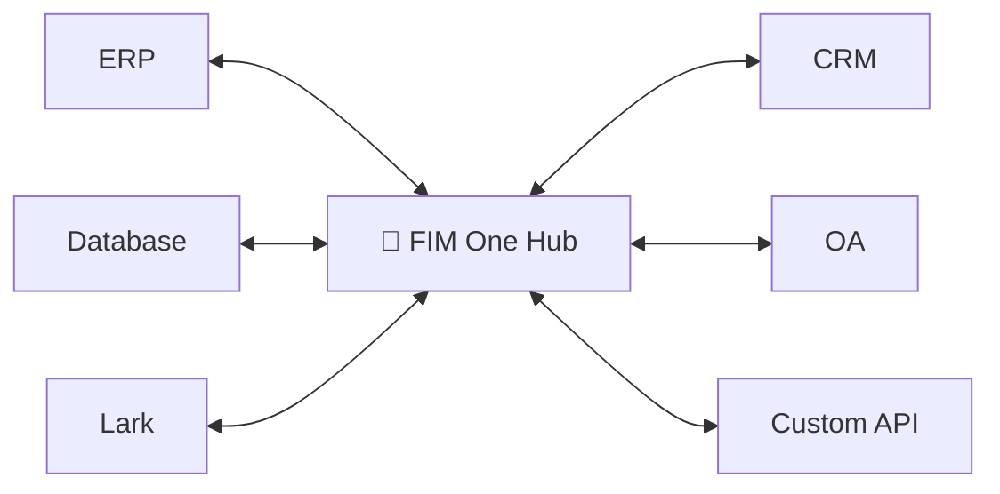
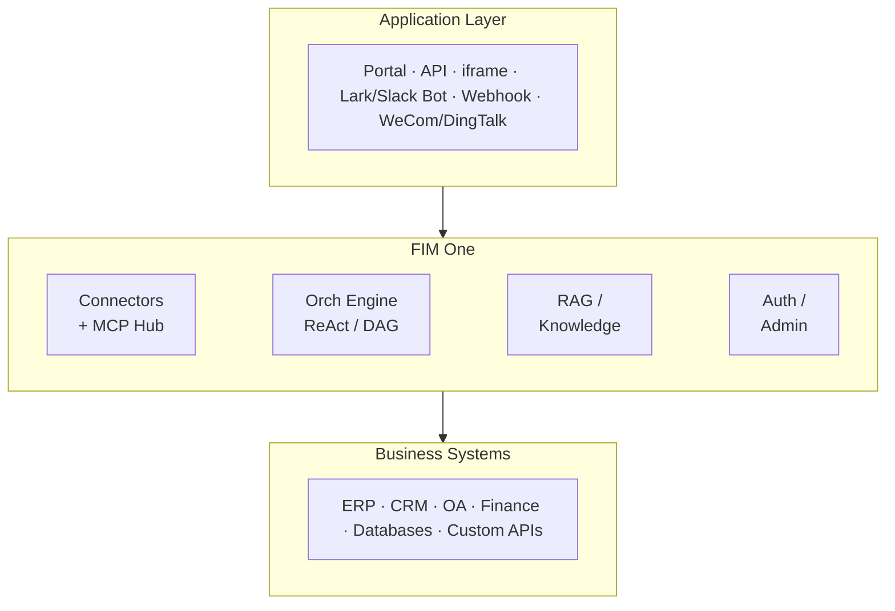

<div align="center">


[](https://github.com/fim-ai/fim-one/actions/workflows/test.yml)

[](https://discord.gg/z64czxdC7z)
[](https://x.com/FIM_One)

[🌐 English](README.md) | [🇨🇳 中文](README.zh.md) | [🇯🇵 日本語](README.ja.md) | [🇰🇷 한국어](README.ko.md) | [🇩🇪 Deutsch](README.de.md) | [🇫🇷 Français](README.fr.md)

**Your systems don't talk to each other. FIM One is the AI-powered bridge — embed as a Copilot, or connect them all as a Hub.**

🌐 [Website](https://one.fim.ai/) · 📖 [Docs](https://docs.fim.ai) · 📋 [Changelog](https://docs.fim.ai/changelog) · 🐛 [Report Bug](https://github.com/fim-ai/fim-one/issues) · 💬 [Discord](https://discord.gg/z64czxdC7z) · 🐦 [Twitter](https://x.com/FIM_One) · 🏆 [Product Hunt](https://www.producthunt.com/products/fim-one)

</div>

> [!TIP]
> **☁️ Skip the setup — try FIM One on Cloud.**
> A managed version is live at **[cloud.fim.ai](https://cloud.fim.ai/)**: no Docker, no API keys, no config. Sign in and start connecting your systems in seconds. _Early access, feedback welcome._

---

## Overview

Every company has systems that don't talk to each other — ERP, CRM, OA, finance, HR, custom databases. FIM One is the **AI-powered hub** that connects them all without modifying your existing infrastructure.

| Mode           | What it is                                              | Access                  |
| -------------- | ------------------------------------------------------- | ----------------------- |
| **Standalone** | General-purpose AI assistant — search, code, KB         | Portal                  |
| **Copilot**    | AI embedded in a host system's UI                       | iframe / widget / embed |
| **Hub**        | Central AI orchestration across all connected systems   | Portal / API            |



### Screenshots

**Dashboard** — stats, activity trends, token usage, and quick access to agents and conversations.


**Agent Chat** — ReAct reasoning with multi-step tool calling against a connected database.


**DAG Planner** — LLM-generated execution plan with parallel steps and live status tracking.


### Demo

**Using Agents**


**Using Planner Mode**


## Quick Start

### Docker (recommended)

```bash
git clone https://github.com/fim-ai/fim-one.git
cd fim-one

cp example.env .env
# Edit .env: set LLM_API_KEY (and optionally LLM_BASE_URL, LLM_MODEL)

docker compose up --build -d
```

Open http://localhost:3000 — on first launch you'll create an admin account. That's it.

```bash
docker compose up -d          # start
docker compose down           # stop
docker compose logs -f        # view logs
```

### Local Development

Prerequisites: Python 3.11+, [uv](https://docs.astral.sh/uv/), Node.js 18+, pnpm.

```bash
git clone https://github.com/fim-ai/fim-one.git && cd fim-one

cp example.env .env           # Edit: set LLM_API_KEY

uv sync --all-extras
cd frontend && pnpm install && cd ..

./start.sh dev                # hot reload: Python --reload + Next.js HMR
```

| Command          | What starts                       | URL                            |
| ---------------- | --------------------------------- | ------------------------------ |
| `./start.sh`     | Next.js + FastAPI                 | localhost:3000 (UI) + :8000    |
| `./start.sh dev` | Same, with hot reload             | Same                           |
| `./start.sh api` | FastAPI only (headless)           | localhost:8000/api             |

> For production deployment (Docker, reverse proxy, zero-downtime updates), see the [Deployment Guide](https://docs.fim.ai/quickstart#production-deployment).

## Key Features

#### Connector Hub
- **Three delivery modes** — Standalone assistant, embedded Copilot, or central Hub; same agent core.
- **Any system, one pattern** — Connect APIs, databases, MCP servers. Actions auto-register as agent tools with auth injection. Progressive disclosure meta-tools reduce token usage by 80%+ across all tool types.
- **Database connectors** — PostgreSQL, MySQL, Oracle, SQL Server, plus Chinese legacy DBs (DM, KingbaseES, GBase, Highgo). Schema introspection and AI-powered annotation.
- **Three ways to build** — Import OpenAPI spec, AI chat builder, or connect MCP servers directly.

#### Planning & Execution
- **Dynamic DAG planning** — LLM decomposes goals into dependency graphs at runtime. No hard-coded workflows.
- **Concurrent execution** — Independent steps run in parallel via asyncio; auto re-plan up to 3 rounds.
- **ReAct agent** — Structured reasoning-and-acting loop with automatic error recovery.
- **Agent harness** — Production-grade execution environment with Hook middleware for deterministic guardrails, ContextGuard for context management, progressive-disclosure meta-tools, and self-reflection loops.
- **Auto-routing** — Classifies queries and routes to optimal mode (ReAct or DAG). Configurable via `AUTO_ROUTING`.
- **Extended thinking** — Chain-of-thought for OpenAI o-series, Gemini 2.5+, Claude.

#### Workflow & Tools
- **Visual workflow editor** — 12 node types, drag-and-drop canvas (React Flow v12), import/export as JSON.
- **Smart file handling** — Uploaded files auto-inlined into context (small) or readable on-demand via `read_uploaded_file` tool with paginated and regex search modes.
- **Pluggable tools** — Python, Node.js, shell exec with optional Docker sandbox (`CODE_EXEC_BACKEND=docker`).
- **Full RAG pipeline** — Jina embedding + LanceDB + hybrid retrieval + reranker + inline `[N]` citations.
- **Tool artifacts** — Rich outputs (HTML previews, files) rendered in-chat.

#### Platform
- **Multi-tenant** — JWT auth, org isolation, admin panel with usage analytics and connector metrics.
- **Marketplace** — Publish and subscribe to agents, connectors, KBs, skills, workflows.
- **Global skills (SOPs)** — Reusable operating procedures loaded for every user; progressive mode cuts tokens ~80%.
- **6 languages** — EN, ZH, JA, KO, DE, FR. Translations are [fully automated](https://docs.fim.ai/quickstart#internationalization).
- **First-run setup wizard**, dark/light theme, command palette, streaming SSE, DAG visualization.

> Deep dive: [Architecture](https://docs.fim.ai/architecture/system-overview) · [Execution Modes](https://docs.fim.ai/concepts/execution-modes) · [Why FIM One](https://docs.fim.ai/why) · [Competitive Landscape](https://docs.fim.ai/strategy/competitive-landscape)

## Architecture



Each connector is a standardized bridge — the agent doesn't know or care whether it's talking to SAP or a custom database. See [Connector Architecture](https://docs.fim.ai/architecture/connector-architecture) for details.

## Configuration

FIM One works with **any OpenAI-compatible provider**:

| Provider           | `LLM_API_KEY` | `LLM_BASE_URL`                 | `LLM_MODEL`         |
| ------------------ | ------------- | ------------------------------ | -------------------- |
| **OpenAI**         | `sk-...`      | *(default)*                    | `gpt-4o`             |
| **DeepSeek**       | `sk-...`      | `https://api.deepseek.com/v1`  | `deepseek-chat`      |
| **Anthropic**      | `sk-ant-...`  | `https://api.anthropic.com/v1` | `claude-sonnet-4-6`  |
| **Ollama** (local) | `ollama`      | `http://localhost:11434/v1`    | `qwen2.5:14b`        |

Minimal `.env`:

```bash
LLM_API_KEY=sk-your-key
# LLM_BASE_URL=https://api.openai.com/v1   # default
# LLM_MODEL=gpt-4o                         # default
JINA_API_KEY=jina_...                       # unlocks web tools + RAG
```

> Full reference: [Environment Variables](https://docs.fim.ai/configuration/environment-variables)

## Tech Stack

| Layer       | Technology                                                          |
| ----------- | ------------------------------------------------------------------- |
| Backend     | Python 3.11+, FastAPI, SQLAlchemy, Alembic, asyncio                 |
| Frontend    | Next.js 14, React 18, Tailwind CSS, shadcn/ui, React Flow v12      |
| AI / RAG    | OpenAI-compatible LLMs, Jina AI (embed + search), LanceDB          |
| Database    | SQLite (dev) / PostgreSQL (prod)                                    |
| Infra       | Docker, uv, pnpm, SSE streaming                                    |

## Development

```bash
uv sync --all-extras          # install dependencies
pytest                         # run tests
pytest --cov=fim_one           # with coverage
ruff check src/ tests/         # lint
mypy src/                      # type check
bash scripts/setup-hooks.sh    # install git hooks (enables auto i18n)
```

## Roadmap

See the full [Roadmap](https://docs.fim.ai/roadmap) for version history and planned features.

## FAQ

Common questions about deployment, LLM providers, system requirements, and more — see the [FAQ](https://docs.fim.ai/faq).

## Contributing

We welcome contributions of all kinds — code, docs, translations, bug reports, and ideas.

> **Pioneer Program**: The first 100 contributors who get a PR merged are recognized as **Founding Contributors** with permanent credits, a badge, and priority issue support. [Learn more &rarr;](CONTRIBUTING.md#-pioneer-program)

**Quick links:**

- [**Contributing Guide**](CONTRIBUTING.md) — setup, conventions, PR process
- [**Development Conventions**](https://docs.fim.ai/contributing) — type safety, testing, and code quality standards
- [**Good First Issues**](https://github.com/fim-ai/fim-one/labels/good%20first%20issue) — curated for newcomers
- [**Open Issues**](https://github.com/fim-ai/fim-one/issues) — bugs & feature requests

**Security:** To report a vulnerability, please open a [GitHub issue](https://github.com/fim-ai/fim-one/issues) with the `[SECURITY]` tag. For sensitive disclosures, contact us via Discord DM.

## Star History

<a href="https://star-history.com/#fim-ai/fim-one&Date">
  <picture>
    <source media="(prefers-color-scheme: dark)" srcset="https://api.star-history.com/svg?repos=fim-ai/fim-one&type=Date&theme=dark" />
    <source media="(prefers-color-scheme: light)" srcset="https://api.star-history.com/svg?repos=fim-ai/fim-one&type=Date" />
    
  </picture>
</a>

## Activity


## Contributors

Thanks to these wonderful people ([emoji key](https://allcontributors.org/docs/en/emoji-key)):

<!-- ALL-CONTRIBUTORS-LIST:START - Do not remove or modify this section -->
<!-- prettier-ignore-start -->
<!-- markdownlint-disable -->
<!-- markdownlint-restore -->
<!-- prettier-ignore-end -->
<!-- ALL-CONTRIBUTORS-LIST:END -->

[](https://github.com/fim-ai/fim-one/graphs/contributors)

This project follows the [all-contributors](https://allcontributors.org/) specification. Contributions of any kind welcome!

## License

FIM One Source Available License. This is **not** an OSI-approved open source license.

**Permitted**: internal use, modification, distribution with license intact, embedding in non-competing applications.

**Restricted**: multi-tenant SaaS, competing agent platforms, white-labeling, removing branding.

For commercial licensing inquiries, please open an issue on [GitHub](https://github.com/fim-ai/fim-one).

See [LICENSE](LICENSE) for full terms.

---

<div align="center">

🌐 [Website](https://one.fim.ai/) · 📖 [Docs](https://docs.fim.ai) · 📋 [Changelog](https://docs.fim.ai/changelog) · 🐛 [Report Bug](https://github.com/fim-ai/fim-one/issues) · 💬 [Discord](https://discord.gg/z64czxdC7z) · 🐦 [Twitter](https://x.com/FIM_One) · 🏆 [Product Hunt](https://www.producthunt.com/products/fim-one)

</div>
