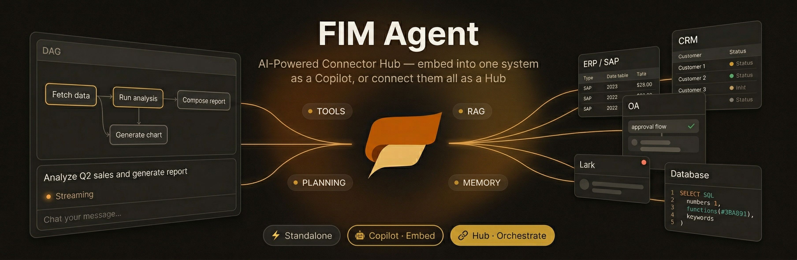

<div align="center">




**Provider-agnostic Agent Platform -- from standalone AI assistant to embeddable runtime that modernizes legacy systems.**

</div>

---

## Overview

FIM Agent is a provider-agnostic Python framework for building AI agents that dynamically plan and execute complex tasks. It operates in two modes:

- **Standalone** -- A full-featured AI assistant with dynamic DAG planning, concurrent execution, and real-time streaming. The LLM decomposes goals into dependency-aware DAGs at runtime, runs independent steps in parallel, and re-plans if needed.
- **Embedded (Sidecar)** -- An embeddable runtime that connects to legacy systems via a standardized Adapter protocol, enabling AI-powered automation without rewriting existing software.

Both modes share the same agent core: ReAct reasoning loops, pluggable tools, and a protocol-first architecture with zero vendor lock-in.

## Philosophy

FIM Agent offers two execution modes -- **ReAct Agent** (single-query tool loops) and **DAG Planning** (concurrent multi-step execution) -- letting users choose the right trade-off between simplicity and power. Unlike static workflow engines (Dify, n8n) that require hand-coded DAGs, FIM Agent's planner generates execution graphs at runtime. Unlike fully autonomous agents (Manus, AutoGPT), it keeps humans in the loop with confirmation gates and audit trails.

> Deep dive: [Philosophy](https://github.com/fim-ai/fim-agent/wiki/Philosophy) | [Execution Modes](https://github.com/fim-ai/fim-agent/wiki/Execution-Modes) | [Planning Landscape](https://github.com/fim-ai/fim-agent/wiki/Planning-Landscape)

## Key Features

- **Dynamic DAG Planning** -- An LLM decomposes goals into dependency graphs at runtime. No hard-coded workflows.
- **DAG Visualization** -- Interactive flow graph (@xyflow/react) in an expand/collapse right sidebar with real-time step status, dependency edges, click-to-scroll navigation, and auto fitView. ReAct mode shows a compact step timeline.
- **Concurrent Execution** -- Independent DAG steps run in parallel via `asyncio`, bounded by a configurable concurrency limit.
- **Real-time Streaming** -- Portal streams reasoning steps and tool calls as they happen via SSE, with KaTeX math rendering support.
- **ReAct Agent** -- Structured reasoning-and-acting loop with JSON-based tool calls, automatic error recovery, and iteration limits.
- **OpenAI-Compatible** -- Works with any provider exposing the `/v1/chat/completions` interface (OpenAI, DeepSeek, Qwen, Ollama, vLLM, and others).
- **Pluggable Tool System** -- Protocol-based tool interface with auto-discovery. Ships with Python executor, calculator, file ops, web search/fetch (Jina), HTTP request (any REST API), and sandboxed shell exec (curl, jq, etc.).
- **RAG Ready** -- Abstract `BaseRetriever` / `Document` interface for plugging in vector stores and search backends.
- **Minimal Dependencies** -- Only three runtime dependencies: `openai`, `httpx`, `pydantic`.

## Architecture

```
User Query
    |
    v
+--------------+
|  DAG Planner |  LLM decomposes the goal into steps + dependency edges
+--------------+
    |
    v
+--------------+
| DAG Executor |  Launches independent steps concurrently (asyncio)
|              |  Each step is handled by a ReAct Agent
+--------------+
    |                         +-------+
    +--- ReAct Agent [1] ---> | Tools |  (python_exec, custom, ...)
    |                         +-------+
    +--- ReAct Agent [2] ---> | RAG   |  (retriever interface)
    |                         +-------+
    +--- ReAct Agent [N] ---> | ...   |
    |
    v
+---------------+
| Plan Analyzer |  LLM evaluates results; re-plans if goal not met
+---------------+
    |
    v
 Final Answer
```

## Quick Start

### Installation

```bash
# Using uv (recommended)
uv add fim-agent

# Or install from source
git clone https://github.com/fim-ai/fim-agent.git
cd fim-agent
uv sync
```

### Basic Usage

```python
import asyncio
import os

from fim_agent.core.agent import ReActAgent
from fim_agent.core.model import OpenAICompatibleLLM
from fim_agent.core.tool import ToolRegistry
from fim_agent.core.tool.builtin.python_exec import PythonExecTool


async def main() -> None:
    llm = OpenAICompatibleLLM(
        api_key=os.environ["LLM_API_KEY"],
        base_url=os.environ.get("LLM_BASE_URL", "https://api.openai.com/v1"),
        model=os.environ.get("LLM_MODEL", "gpt-4o"),
    )

    tools = ToolRegistry()
    tools.register(PythonExecTool())

    agent = ReActAgent(llm=llm, tools=tools)
    result = await agent.run("Calculate the factorial of 10 using Python.")
    print(result.answer)


asyncio.run(main())
```

### DAG Planning

```python
from fim_agent.core.planner import DAGPlanner, DAGExecutor, PlanAnalyzer

planner = DAGPlanner(llm=llm)
plan = await planner.plan("Compare bubble sort vs built-in sorted() on 5000 random ints.")

executor = DAGExecutor(agent=agent, max_concurrency=3)
plan = await executor.execute(plan)

analyzer = PlanAnalyzer(llm=llm)
analysis = await analyzer.analyze(plan.goal, plan)
print(analysis.final_answer)
```

See [`examples/quickstart.py`](examples/quickstart.py) for a complete runnable example.

### Running

```bash
# Create .env with your LLM credentials
cp example.env .env
# Edit .env with your API key

# Install dependencies
uv sync --extra web
cd frontend && pnpm install && cd ..

# Start
./start.sh            # Next.js portal + API backend (default)
./start.sh api        # API only (for custom frontends or testing)
```

| Command | What starts | URL |
|---------|-------------|-----|
| `./start.sh` | Next.js + FastAPI | http://localhost:3000 (UI) + :8000 (API) |
| `./start.sh api` | FastAPI only | http://localhost:8000/api |

The portal offers two modes: **ReAct Agent** (single-query tool loop) and **DAG Planner** (multi-step planning with concurrent execution), with real-time SSE streaming, DAG visualization, and KaTeX math rendering.

## Configuration

All configuration is done through environment variables:

| Variable | Required | Default | Description |
|---|---|---|---|
| `LLM_API_KEY` | Yes | -- | API key for the LLM provider |
| `LLM_BASE_URL` | No | `https://api.openai.com/v1` | Base URL of the OpenAI-compatible API |
| `LLM_MODEL` | No | `gpt-4o` | Model identifier to use |
| `LLM_TEMPERATURE` | No | `0.7` | Default sampling temperature |
| `MAX_CONCURRENCY` | No | `5` | Max parallel steps in DAG executor |

Copy `example.env` to `.env` and fill in your values:

```bash
cp example.env .env
```

## Development

```bash
# Install all dependencies (including dev extras)
uv sync --all-extras

# Run tests
pytest

# Run tests with coverage
pytest --cov=fim_agent --cov-report=term-missing

# Lint
ruff check src/ tests/

# Type check
mypy src/
```

## Project Structure

```
fim-agent/
  src/fim_agent/
    core/
      model/          # LLM abstraction (OpenAI-compatible)
      tool/           # Tool protocol, registry, built-in tools
      agent/          # ReAct agent implementation
      planner/        # DAG planner, executor, analyzer
    web/              # FastAPI backend (app factory, SSE endpoints, deps)
    rag/              # RAG retriever interface
  frontend/           # Next.js 15 portal (shadcn/ui, TypeScript, Tailwind)
  tests/
  examples/
    quickstart.py     # Runnable quick start example
  start.sh            # Start script (portal / api)
  pyproject.toml
```

## Roadmap

> Goal: Build a **provider-agnostic Agent Platform** -- from standalone AI assistant to embeddable runtime that modernizes legacy systems.

**Shipped**: v0.1 (ReAct Agent, DAG Planning, streaming, KaTeX) → v0.2 (memory, multi-model, token tracking, native function calling) → v0.3 (web/calculator/file tools, MCP client, tool auto-discovery & categories, DAG visualization, sidebar UX, sandbox hardening). **v0.3 polish**: DAG node tool list & timing, frontend token usage display.

**Next**: Platform foundation, multi-tenant, file upload, HTTP request & shell exec tools (v0.4) → RAG & knowledge (v0.5) → System Adapter protocol (v0.6) → Human confirmation + embeddable UI (v0.7) → Declarative adapters (v0.8) → Observability (v0.9) → Enterprise & scale (v1.0).

See the full [Roadmap](https://github.com/fim-ai/fim-agent/wiki/Roadmap) for details.

Contributions and ideas are welcome -- open an issue or submit a PR on [GitHub](https://github.com/fim-ai/fim-agent).

## License

FIM Agent Source Available License. This is **not** an OSI-approved open source license.

**Permitted**: internal use, modification, distribution with license intact, embedding in your own (non-competing) applications.

**Restricted**: multi-tenant SaaS, competing agent platforms, white-labeling, removing branding.

For commercial licensing inquiries, please open an issue on [GitHub](https://github.com/fim-ai/fim-agent).

See [LICENSE](LICENSE) for full terms.
