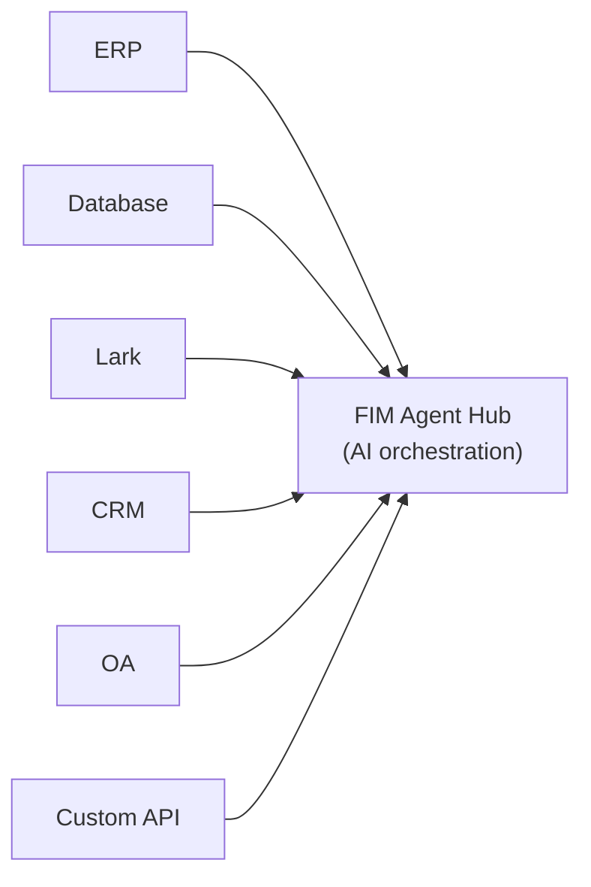
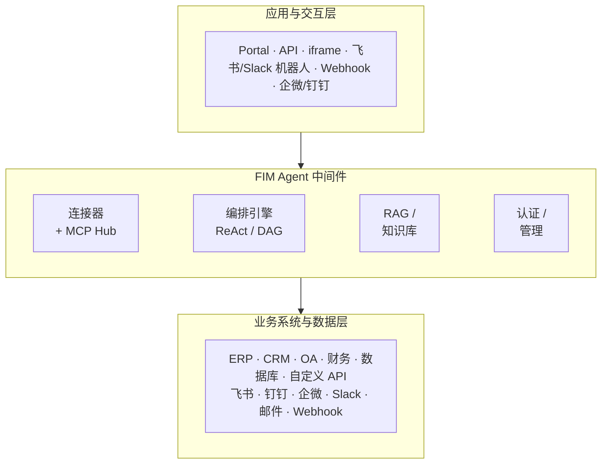
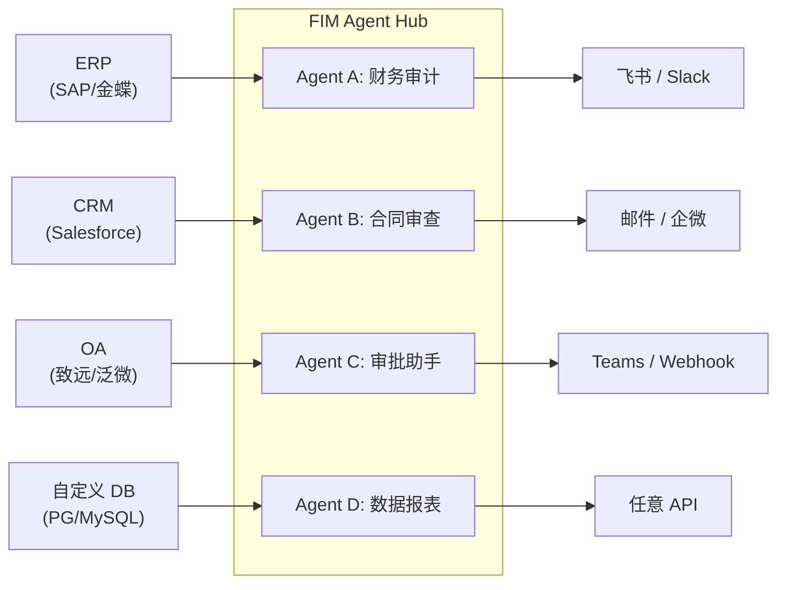
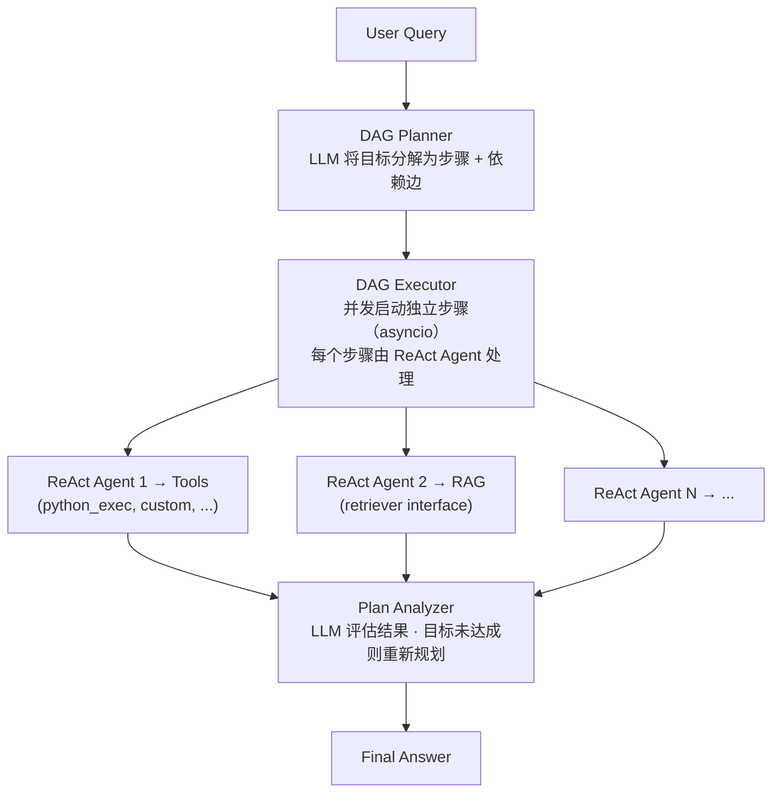

<div align="center">


[](https://github.com/fim-ai/fim-agent/stargazers)
[](https://github.com/fim-ai/fim-agent/network)
[](https://github.com/fim-ai/fim-agent/issues)
[](https://x.com/FIM_Agent)

[🌐 English](README.md) | 🇨🇳 **中文**

**AI 驱动的连接器中枢 — 嵌入单个系统作为 Copilot，或连接所有系统成为 Hub。**

🌐 [官网](https://agent.fim.ai/) · 📖 [文档](https://docs.fim.ai) · 📋 [更新日志](https://docs.fim.ai/changelog) · 🐛 [报告问题](https://github.com/fim-ai/fim-agent/issues) · 🐦 [Twitter](https://x.com/FIM_Agent)

</div>

---

## 目录

- [概述](#概述)
- [应用场景](#应用场景)
- [为什么选择 FIM Agent](#为什么选择-fim-agent)
- [FIM Agent 的定位](#fim-agent-的定位)
- [核心特性](#核心特性)
- [架构设计](#架构设计)
- [快速开始](#快速开始)（Docker / 本地 / 生产环境）
- [配置说明](#配置说明)
- [开发指南](#开发指南)
- [路线图](#路线图)
- [Star 趋势](#star-趋势)
- [项目活跃度](#项目活跃度)
- [贡献者](#贡献者)
- [许可证](#许可证)

## 概述

FIM Agent 是一个与供应商无关的 Python 框架，用于构建能够动态规划和执行复杂任务的 AI Agent。它的独特之处在于 **连接器中枢（Connector Hub）** 架构 — 三种交付模式，一套 Agent 内核：

| 模式 | 定义 | 访问方式 |
|------|------|----------|
| **Standalone（独立模式）** | 通用 AI 助手 — 搜索、编码、知识库 | Portal |
| **Copilot（嵌入模式）** | AI 嵌入宿主系统 — 在用户现有界面中协同工作 | iframe / 小组件 / 嵌入宿主页面 |
| **Hub（中枢模式）** | 中央 AI 编排 — 连接所有系统，跨系统智能协作 | Portal / API |



核心始终不变：ReAct 推理循环、动态 DAG 规划与并发执行、可插拔工具，以及零供应商锁定的协议优先架构。

## 应用场景

企业数据和业务流程被锁在 OA、ERP、财务和审批系统中。FIM Agent 让 AI Agent 能够读写这些系统 — 在不修改现有基础设施的前提下，实现跨系统流程自动化。

| 场景 | 推荐起步方式 | 自动化内容 |
|------|-------------|-----------|
| **法务与合规** | Copilot → Hub | 合同条款提取、版本比对、风险标注并附来源引用、自动触发 OA 审批 |
| **IT 运维** | Hub | 告警触发 → 拉取日志 → 根因分析 → 将修复方案推送至飞书/Slack — 一个闭环 |
| **业务运营** | Copilot | 定时数据摘要推送至团队频道；对实时数据库进行自然语言即席查询 |
| **财务自动化** | Hub | 发票核验、报销审批路由、ERP 与会计系统间的账目核对 |
| **采购管理** | Copilot → Hub | 需求 → 供应商比选 → 合同起草 → 审批 — Agent 负责跨系统的流程衔接 |
| **开发者集成** | API | 导入 OpenAPI 规范或在对话中描述 API — 几分钟内创建连接器，自动注册为 Agent 工具 |

## 为什么选择 FIM Agent

### 渐进式落地

先将 **Copilot** 嵌入一个系统 — 比如你的 ERP。用户在熟悉的界面中直接与 AI 交互：查询财务数据、生成报表、获取答案，无需离开当前页面。

价值验证后，搭建 **Hub** — 一个连接所有系统的中央门户。ERP Copilot 继续以嵌入方式运行；Hub 增加跨系统编排能力：在 CRM 中查询合同、在 OA 中检查审批状态、通过飞书通知相关人员 — 一切在一处完成。

Copilot 在单个系统内验证价值。Hub 释放跨系统的全局价值。

### FIM Agent 不做什么

FIM Agent 不会复制目标系统中已有的工作流逻辑：

- **没有 BPM/FSM 引擎** — 审批链、路由、升级和状态机是目标系统的职责。这些系统花了多年时间构建这些逻辑。
- **没有拖拽式工作流编辑器** — 如果你需要可视化流程图，请使用 Dify。FIM Agent 的 DAG 规划器在运行时动态生成执行图。
- **连接器 = API 调用** — 从连接器的角度看，"转移审批" = 一次 API 调用，"附理由驳回" = 一次 API 调用。所有复杂的工作流操作都归结为 HTTP 请求。FIM Agent 负责调用 API；目标系统负责管理状态。

这是一个刻意的架构边界，而非能力缺失。

### 竞品对比

|  | Dify | Manus | Coze | FIM Agent |
|--|------|-------|------|-----------|
| **方式** | 可视化工作流构建器 | 自主 Agent | 构建器 + Agent 空间 | AI 连接器中枢 |
| **规划** | 人工设计的静态 DAG | 多 Agent 思维链 | 静态 + 动态 | LLM DAG 规划 + ReAct |
| **跨系统** | API 节点（手动配置） | 否 | 插件市场 | Hub 模式（N:N 编排） |
| **人工确认** | 否 | 否 | 否 | 是（执行前确认门控） |
| **私有化部署** | 是（Docker 全家桶） | 否 | 是（Coze Studio） | 是（单进程） |

> 深入了解：[设计理念](https://docs.fim.ai/architecture/philosophy) | [执行模式](https://docs.fim.ai/concepts/execution-modes) | [竞争格局](https://docs.fim.ai/strategy/competitive-landscape)

### FIM Agent 的定位

```
                Static Execution          Dynamic Execution
            ┌──────────────────────┬──────────────────────┐
 Static     │ BPM / Workflow       │ ACM                  │
 Planning   │ Camunda, Activiti    │ (Salesforce Case)    │
            │ Dify, n8n, Coze     │                      │
            ├──────────────────────┼──────────────────────┤
 Dynamic    │ (transitional —      │ Autonomous Agent     │
 Planning   │  unstable quadrant)  │ AutoGPT, Manus       │
            │                      │ ★ FIM Agent (bounded)│
            └──────────────────────┴──────────────────────┘
```

Dify/n8n 属于 **静态规划 + 静态执行** — 人工在可视化画布上设计 DAG，节点执行固定操作。FIM Agent 属于 **动态规划 + 动态执行** — LLM 在运行时生成 DAG，每个节点运行 ReAct 循环，目标未达成时自动重新规划。但有边界约束（最多 3 轮重新规划、Token 预算、确认门控），因此比 AutoGPT 更可控。

FIM Agent 不做 BPM/FSM — 工作流逻辑归属目标系统，连接器只负责调用 API。

> 完整说明：[设计理念](https://docs.fim.ai/architecture/philosophy)

## 核心特性

#### 连接器平台（核心）
- **连接器中枢架构** — 独立助手、嵌入式 Copilot 或中央 Hub — 同一个 Agent 内核，不同的交付方式。
- **任何系统，同一模式** — 连接 API、数据库和消息总线。Action 自动注册为 Agent 工具，支持认证注入（Bearer、API Key、Basic）。
- **三种创建连接器的方式：**
  - *导入 OpenAPI 规范* — 上传 YAML/JSON/URL；连接器及所有 Action 自动生成。
  - *AI 对话构建器* — 用自然语言描述 API；AI 在对话中生成并迭代 Action 配置。
  - *MCP 生态* — 直接连接任意 MCP 服务器；第三方 MCP 社区即插即用。

#### 智能规划与执行
- **动态 DAG 规划** — LLM 在运行时将目标分解为依赖图。无硬编码工作流。
- **并发执行** — 独立步骤通过 asyncio 并行运行。
- **DAG 重新规划** — 目标未达成时自动修正计划，最多 3 轮。
- **ReAct Agent** — 结构化推理-行动循环，具备自动错误恢复能力。
- **扩展思考** — 通过 `LLM_REASONING_EFFORT` 为支持的模型（OpenAI o 系列、Gemini 2.5+、Claude）启用思维链推理。模型的推理过程会在 UI 的"思考中"步骤中展示。

#### 工具与集成
- **可插拔工具系统** — 自动发现机制；内置 Python 执行器、Node.js 执行器、计算器、网页搜索/抓取、HTTP 请求、Shell 执行等。
- **可插拔沙箱** — `python_exec` / `node_exec` / `shell_exec` 支持本地或 Docker 模式（`CODE_EXEC_BACKEND=docker`），提供操作系统级隔离（`--network=none`、`--memory=256m`）。适用于 SaaS 和多租户部署。
- **MCP 协议** — 将任意 MCP 服务器连接为工具。第三方 MCP 生态即插即用。
- **工具产物系统** — 工具可生成富文本输出（HTML 预览、生成文件），支持对话内渲染和下载。HTML 产物在沙箱化 iframe 中渲染；文件产物显示下载入口。
- **OpenAI 兼容** — 适用于任何 `/v1/chat/completions` 供应商（OpenAI、DeepSeek、Qwen、Ollama、vLLM...）。

#### RAG 与知识库
- **完整 RAG 管线** — Jina 向量化 + LanceDB + 全文搜索 + RRF 混合检索 + 重排序。支持 PDF、DOCX、Markdown、HTML、CSV。
- **有据生成** — 基于证据锚定的 RAG，支持行内 `[N]` 引用、冲突检测和可解释的置信度分数。
- **知识库文档管理** — Chunk 级别的 CRUD、跨 Chunk 文本搜索、失败文档重试、向量存储 Schema 自动迁移。

#### Portal 与用户体验
- **实时流式输出** — SSE 推送，支持 KaTeX 数学公式渲染和工具步骤折叠。
- **DAG 可视化** — 交互式流程图，包含实时状态、依赖关系边和点击定位。
- **对话中断** — Agent 运行中可发送后续消息；在下一个迭代边界注入。
- **深色 / 浅色 / 跟随系统主题** — 完整主题支持，自动检测系统偏好。
- **命令面板** — 对话搜索、收藏、批量操作和标题重命名。

#### 平台与多租户
- **JWT 认证** — 基于 Token 的 SSE 认证、对话所有权、按用户资源隔离。
- **Agent 管理** — 创建、配置和发布 Agent，可绑定模型、工具和指令。支持逐 Agent 设置执行模式（标准/规划器）和温度控制。
- **管理面板** — 系统统计仪表盘（用户数、对话数、Token 用量、模型使用图表、按 Agent 的 Token 分布），连接器调用指标（成功率、延迟、调用次数），用户管理（搜索/分页、角色切换、密码重置、账号启用/禁用），以及逐工具启用/禁用控制。
- **首次启动引导** — 首次启动时，Portal 会引导你创建管理员账号（用户名、密码、邮箱）。一次性设置即成为登录凭证 — 无需手动配置文件。
- **个人中心** — 按用户设置全局系统指令，应用于所有对话。
- **语言偏好** — 按用户设置语言（自动/英文/中文），引导所有 LLM 响应使用所选语言。

#### 上下文与记忆
- **LLM Compact** — 自动 LLM 驱动的摘要压缩，确保 Token 预算不超限。
- **ContextGuard + 置顶消息** — Token 预算管理器；置顶消息受到压缩保护。
- **单进程部署** — 无需 Redis、无需 PostgreSQL、无需消息队列。一个进程 + SQLite。`docker compose up` 即可上线。

## 架构设计

### 系统总览



### 连接器中枢



*Portal / API / iframe*

每个连接器都是一个标准化桥梁 — Agent 不需要知道也不关心对方是 SAP 还是自定义的 PostgreSQL 数据库。详见 [连接器架构](https://docs.fim.ai/architecture/connector-architecture)。

### 内部执行流程

FIM Agent 提供两种执行模式：

| 模式 | 适用场景 | 工作原理 |
|------|---------|---------|
| ReAct | 单个复杂查询 | 推理 → 行动 → 观察循环，配合工具使用 |
| DAG 规划 | 多步骤并行任务 | LLM 生成依赖图，独立步骤并发执行 |



## 快速开始

### 方式 A：Docker（推荐）

无需本地安装 Python 或 Node.js — 一切在容器内构建完成。

```bash
git clone https://github.com/fim-ai/fim-agent.git
cd fim-agent

# 配置 — 仅 LLM_API_KEY 为必填项
cp example.env .env
# 编辑 .env：设置 LLM_API_KEY（可选设置 LLM_BASE_URL、LLM_MODEL）

# 构建并运行（首次或拉取新代码后）
docker compose up --build -d
```

打开 http://localhost:3000 — 首次启动会引导你创建管理员账号。完成。

首次构建后，后续启动只需：

```bash
docker compose up -d          # 启动（镜像未变则跳过重建）
docker compose down           # 停止
docker compose logs -f        # 查看日志
```

数据持久化存储在 Docker 命名卷（`fim-data`、`fim-uploads`）中，容器重启后数据不丢失。

> **注意：** Docker 模式不支持热重载。代码变更需要重新构建镜像（`docker compose up --build -d`）。如需带热重载的开发模式，请使用下方 **方式 B**。

### 方式 B：本地开发

前置条件：Python 3.11+、[uv](https://docs.astral.sh/uv/)、Node.js 18+、pnpm。

```bash
git clone https://github.com/fim-ai/fim-agent.git
cd fim-agent

cp example.env .env
# 编辑 .env：设置 LLM_API_KEY

# 安装依赖
uv sync --extra web
cd frontend && pnpm install && cd ..

# 启动（带热重载）
./start.sh dev
```

| 命令 | 启动内容 | URL |
|------|---------|-----|
| `./start.sh` | Next.js + FastAPI | http://localhost:3000 (UI) + :8000 (API) |
| `./start.sh dev` | 同上，带热重载（Python `--reload` + Next.js HMR） | 同上 |
| `./start.sh api` | 仅 FastAPI（无头模式，用于集成或测试） | http://localhost:8000/api |

### 生产环境部署

两种方式均可用于生产环境：

| 方式 | 命令 | 适用场景 |
|------|------|---------|
| **Docker** | `docker compose up -d` | 免运维部署，便于更新 |
| **脚本** | `./start.sh` | 裸金属服务器，自定义进程管理器 |

无论哪种方式，建议在前端配置 Nginx 反向代理以支持 HTTPS 和自定义域名：

```
用户 → Nginx (443/HTTPS) → localhost:3000
```

API 在内部运行于 8000 端口 — Next.js 会自动代理 `/api/*` 请求。只需暴露 3000 端口。

如需使用代码执行沙箱（`CODE_EXEC_BACKEND=docker`），请挂载 Docker socket：

```yaml
# docker-compose.yml
volumes:
  - /var/run/docker.sock:/var/run/docker.sock
```

## 配置说明

### 推荐配置

FIM Agent 兼容 **任何 OpenAI 兼容的 LLM 供应商** — OpenAI、DeepSeek、Anthropic、Qwen、Ollama、vLLM 等。选择你喜欢的即可：

| 供应商 | `LLM_API_KEY` | `LLM_BASE_URL` | `LLM_MODEL` |
|--------|---------------|----------------|-------------|
| **OpenAI** | `sk-...` | *（默认）* | `gpt-4o` |
| **DeepSeek** | `sk-...` | `https://api.deepseek.com/v1` | `deepseek-chat` |
| **Anthropic** | `sk-ant-...` | `https://api.anthropic.com/v1` | `claude-sonnet-4-6` |
| **Ollama**（本地） | `ollama` | `http://localhost:11434/v1` | `qwen2.5:14b` |

**[Jina AI](https://jina.ai/)** 可解锁网页搜索/抓取、向量化及完整 RAG 管线（提供免费额度）。

最小 `.env` 配置：

```bash
LLM_API_KEY=sk-your-key
# LLM_BASE_URL=https://api.openai.com/v1   # 默认值 — 使用其他供应商时修改
# LLM_MODEL=gpt-4o                         # 默认值 — 使用其他模型时修改

JINA_API_KEY=jina_...                       # 解锁网页工具 + RAG
```

### 全部变量

完整的 [环境变量](https://docs.fim.ai/configuration/environment-variables) 参考文档涵盖所有配置项（LLM、Agent 执行、网页工具、RAG、代码执行、图像生成、连接器、平台、OAuth）。

## 开发指南

```bash
# 安装所有依赖（包括开发相关的 extras）
uv sync --all-extras

# 运行测试
pytest

# 运行测试并生成覆盖率报告
pytest --cov=fim_agent --cov-report=term-missing

# 代码检查
ruff check src/ tests/

# 类型检查
mypy src/
```

## 路线图

完整 [路线图](https://docs.fim.ai/roadmap) 包含版本历史和未来规划。

欢迎贡献建议和想法。请在 [GitHub](https://github.com/fim-ai/fim-agent) 上提 Issue 或提交 PR。

## Star 趋势

<a href="https://star-history.com/#fim-ai/fim-agent&Date">
  <picture>
    <source media="(prefers-color-scheme: dark)" srcset="https://api.star-history.com/svg?repos=fim-ai/fim-agent&type=Date&theme=dark" />
    <source media="(prefers-color-scheme: light)" srcset="https://api.star-history.com/svg?repos=fim-ai/fim-agent&type=Date" />
    
  </picture>
</a>

## 项目活跃度


## 贡献者

[](https://github.com/fim-ai/fim-agent/graphs/contributors)

## 许可证

FIM Agent Source Available License。这 **不是** OSI 批准的开源许可证。

**允许**：内部使用、修改、保留许可证的分发、嵌入你自己的（非竞品）应用程序中。

**限制**：多租户 SaaS、竞争性 Agent 平台、白标、移除品牌标识。

如有商业授权需求，请在 [GitHub](https://github.com/fim-ai/fim-agent) 上提交 Issue。

完整条款见 [LICENSE](LICENSE)。

---

<div align="center">

🌐 [官网](https://agent.fim.ai/) · 📖 [文档](https://docs.fim.ai) · 📋 [更新日志](https://docs.fim.ai/changelog) · 🐛 [报告问题](https://github.com/fim-ai/fim-agent/issues) · 💡 [功能建议](https://github.com/fim-ai/fim-agent/issues) · 🐦 [Twitter](https://x.com/FIM_Agent)

</div>
