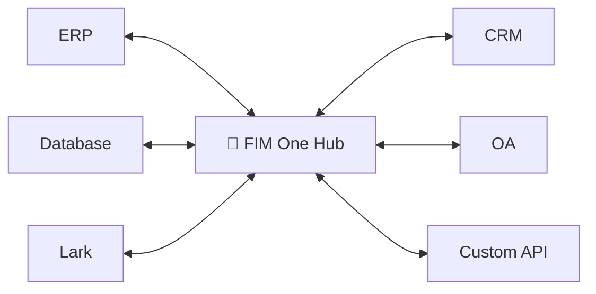
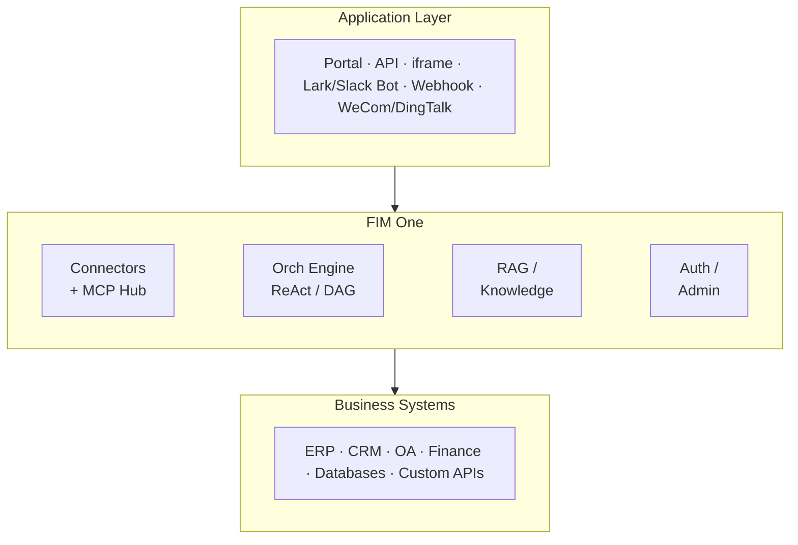

<div align="center">


[](https://github.com/fim-ai/fim-one/actions/workflows/test.yml)

[](https://discord.gg/z64czxdC7z)
[](https://x.com/FIM_One)

[🌐 English](README.md) | [🇨🇳 中文](README.zh.md) | [🇯🇵 日本語](README.ja.md) | [🇰🇷 한국어](README.ko.md) | [🇩🇪 Deutsch](README.de.md) | [🇫🇷 Français](README.fr.md)

**您的系统无法相互通信。FIM One 是由 AI 驱动的桥梁 — 可作为 Copilot 嵌入，或将它们全部作为中枢连接。**

🌐 [网站](https://one.fim.ai/) · 📖 [文档](https://docs.fim.ai) · 📋 [更新日志](https://docs.fim.ai/changelog) · 🐛 [报告错误](https://github.com/fim-ai/fim-one/issues) · 💬 [Discord](https://discord.gg/z64czxdC7z) · 🐦 [Twitter](https://x.com/FIM_One) · 🏆 [Product Hunt](https://www.producthunt.com/products/fim-one)

</div>

> [!TIP]
> **☁️ 跳过设置 — 在云端尝试 FIM One。**
> 托管版本已在 **[cloud.fim.ai](https://cloud.fim.ai/)** 上线：无需 Docker、无需 API 密钥、无需配置。登录并在几秒内开始连接您的系统。_早期访问，欢迎反馈。_

---

## 概述

每个公司都有相互不通的系统——ERP、CRM、OA、财务、HR、自定义数据库。FIM One 是**AI 驱动的枢纽**，可以连接它们所有系统，而无需修改现有基础设施。

| 模式           | 说明                                              | 访问方式                  |
| -------------- | ------------------------------------------------------- | ----------------------- |
| **独立模式** | 通用 AI 助手——搜索、代码、知识库         | 门户网站                  |
| **副驾驶模式**    | 嵌入在主系统 UI 中的 AI                       | iframe / widget / embed |
| **枢纽模式**        | 跨所有连接系统的中央 AI 编排   | 门户网站 / API            |



### 截图

**仪表板** — 统计数据、活动趋势、令牌使用情况以及对智能体和对话的快速访问。


**智能体聊天** — 针对连接的数据库进行 ReAct 推理和多步工具调用。


**DAG 规划器** — LLM 生成的执行计划，支持并行步骤和实时状态跟踪。


### 演示

**使用智能体**


**使用规划器模式**


## 快速开始

### Docker（推荐）

```bash
git clone https://github.com/fim-ai/fim-one.git
cd fim-one

cp example.env .env
# Edit .env: set LLM_API_KEY (and optionally LLM_BASE_URL, LLM_MODEL)

docker compose up --build -d
```

打开 http://localhost:3000 — 首次启动时，你需要创建一个管理员账户。就这么简单。

```bash
docker compose up -d          # start
docker compose down           # stop
docker compose logs -f        # view logs
```

### 本地开发

前置条件：Python 3.11+、[uv](https://docs.astral.sh/uv/)、Node.js 18+、pnpm。

```bash
git clone https://github.com/fim-ai/fim-one.git && cd fim-one

cp example.env .env           # Edit: set LLM_API_KEY

uv sync --all-extras
cd frontend && pnpm install && cd ..

./start.sh dev                # hot reload: Python --reload + Next.js HMR
```

| 命令             | 启动内容                          | URL                            |
| ---------------- | --------------------------------- | ------------------------------ |
| `./start.sh`     | Next.js + FastAPI                 | localhost:3000 (UI) + :8000    |
| `./start.sh dev` | 相同，带热重载                    | 相同                           |
| `./start.sh api` | 仅 FastAPI（无头模式）            | localhost:8000/api             |

> 关于生产部署（Docker、反向代理、零停机更新），请参阅[部署指南](https://docs.fim.ai/quickstart#production-deployment)。

## 主要功能

#### 连接器中心
- **三种交付模式** — 独立助手、嵌入式 Copilot 或中央 Hub；同一个智能体核心。
- **任何系统，统一模式** — 连接 API、数据库、MCP 服务器。操作自动注册为智能体工具并注入身份验证。渐进式披露元工具可将所有工具类型的令牌使用量减少 80% 以上。
- **数据库连接器** — PostgreSQL、MySQL、Oracle、SQL Server，以及国产遗留数据库（DM、KingbaseES、GBase、Highgo）。Schema 内省和 AI 驱动的注解。
- **三种构建方式** — 导入 OpenAPI 规范、AI 聊天构建器或直接连接 MCP 服务器。

#### 规划与执行
- **动态 DAG 规划** — LLM 在运行时将目标分解为依赖图。无硬编码工作流。
- **并发执行** — 独立步骤通过 asyncio 并行运行；自动重新规划最多 3 轮。
- **ReAct 智能体** — 结构化的推理和行动循环，具有自动错误恢复。
- **智能体框架** — 生产级执行环境，配备 Hook 中间件用于确定性防护栏、ContextGuard 用于上下文管理、渐进式披露元工具和自反思循环。
- **自动路由** — 分类查询并路由到最优模式（ReAct 或 DAG）。可通过 `AUTO_ROUTING` 配置。
- **扩展思维** — OpenAI o 系列、Gemini 2.5+、Claude 的思维链。

#### 工作流与工具
- **可视化工作流编辑器** — 12种节点类型、拖放画布（React Flow v12）、JSON格式导入/导出。
- **智能文件处理** — 上传的文件自动内联到上下文（小文件）或通过 `read_uploaded_file` 工具按需读取，支持分页和正则表达式搜索模式。
- **可插拔工具** — Python、Node.js、shell执行，支持可选的Docker沙箱（`CODE_EXEC_BACKEND=docker`）。
- **完整RAG管道** — Jina嵌入 + LanceDB + 混合检索 + 重排序器 + 内联 `[N]` 引用。
- **工具制品** — 丰富的输出（HTML预览、文件）在聊天中渲染。

#### 平台
- **多租户** — JWT 认证、组织隔离、管理面板（包含使用分析和连接器指标）。
- **应用市场** — 发布和订阅智能体、连接器、知识库、技能、工作流。
- **全局技能（SOP）** — 为每个用户加载的可复用操作流程；渐进模式可减少约 80% 的 token 消耗。
- **6 种语言** — EN、ZH、JA、KO、DE、FR。翻译[完全自动化](https://docs.fim.ai/quickstart#internationalization)。
- **首次运行设置向导**、深色/浅色主题、命令面板、流式 SSE、DAG 可视化。

> 深入了解：[架构](https://docs.fim.ai/architecture/system-overview) · [执行模式](https://docs.fim.ai/concepts/execution-modes) · [为什么选择 FIM One](https://docs.fim.ai/why) · [竞争格局](https://docs.fim.ai/strategy/competitive-landscape)

## 架构



每个连接器都是一个标准化的桥接——智能体不需要知道或关心它是在与 SAP 还是自定义数据库通信。详见 [连接器架构](https://docs.fim.ai/architecture/connector-architecture)。

## 配置

FIM One 支持**任何 OpenAI 兼容的提供商**：

| 提供商           | `LLM_API_KEY` | `LLM_BASE_URL`                 | `LLM_MODEL`         |
| ------------------ | ------------- | ------------------------------ | -------------------- |
| **OpenAI**         | `sk-...`      | *(默认)*                    | `gpt-4o`             |
| **DeepSeek**       | `sk-...`      | `https://api.deepseek.com/v1`  | `deepseek-chat`      |
| **Anthropic**      | `sk-ant-...`  | `https://api.anthropic.com/v1` | `claude-sonnet-4-6`  |
| **Ollama** (本地) | `ollama`      | `http://localhost:11434/v1`    | `qwen2.5:14b`        |

最小化 `.env`：

```bash
LLM_API_KEY=sk-your-key
# LLM_BASE_URL=https://api.openai.com/v1   # default
# LLM_MODEL=gpt-4o                         # default
JINA_API_KEY=jina_...                       # unlocks web tools + RAG
```

> 完整参考：[环境变量](https://docs.fim.ai/configuration/environment-variables)

## 技术栈

| 层级       | 技术                                                          |
| ----------- | ------------------------------------------------------------------- |
| 后端     | Python 3.11+, FastAPI, SQLAlchemy, Alembic, asyncio                 |
| 前端    | Next.js 14, React 18, Tailwind CSS, shadcn/ui, React Flow v12      |
| AI / RAG    | OpenAI-compatible LLMs, Jina AI (embed + search), LanceDB          |
| 数据库    | SQLite (dev) / PostgreSQL (prod)                                    |
| 基础设施       | Docker, uv, pnpm, SSE streaming                                    |

## 开发

```bash
uv sync --all-extras          # install dependencies
pytest                         # run tests
pytest --cov=fim_one           # with coverage
ruff check src/ tests/         # lint
mypy src/                      # type check
bash scripts/setup-hooks.sh    # install git hooks (enables auto i18n)
```

## 路线图

查看完整的[路线图](https://docs.fim.ai/roadmap)了解版本历史和计划功能。

## 常见问题

关于部署、LLM 提供商、系统要求等常见问题 — 请查看 [常见问题](https://docs.fim.ai/faq)。

## 贡献

我们欢迎各种形式的贡献 — 代码、文档、翻译、错误报告和想法。

> **先锋计划**：前 100 位获得 PR 合并的贡献者将被认可为**创始贡献者**，获得永久署名、徽章和优先问题支持。[了解更多 &rarr;](CONTRIBUTING.md#-pioneer-program)

**快速链接：**

- [**贡献指南**](CONTRIBUTING.md) — 设置、约定、PR 流程
- [**开发约定**](https://docs.fim.ai/contributing) — 类型安全、测试和代码质量标准
- [**好的首个问题**](https://github.com/fim-ai/fim-one/labels/good%20first%20issue) — 为新手精选
- [**开放问题**](https://github.com/fim-ai/fim-one/issues) — 错误和功能请求

**安全性：** 要报告漏洞，请打开一个带有 `[SECURITY]` 标签的 [GitHub issue](https://github.com/fim-ai/fim-one/issues)。对于敏感披露，请通过 Discord DM 与我们联系。

## Star History

<a href="https://star-history.com/#fim-ai/fim-one&Date">
  <picture>
    <source media="(prefers-color-scheme: dark)" srcset="https://api.star-history.com/svg?repos=fim-ai/fim-one&type=Date&theme=dark" />
    <source media="(prefers-color-scheme: light)" srcset="https://api.star-history.com/svg?repos=fim-ai/fim-one&type=Date" />
    
  </picture>
</a>

## 活动


## 贡献者

感谢这些杰出的人们（[emoji 说明](https://allcontributors.org/docs/en/emoji-key)）：

<!-- ALL-CONTRIBUTORS-LIST:START - Do not remove or modify this section -->
<!-- prettier-ignore-start -->
<!-- markdownlint-disable -->
<!-- markdownlint-restore -->
<!-- prettier-ignore-end -->
<!-- ALL-CONTRIBUTORS-LIST:END -->

[](https://github.com/fim-ai/fim-one/graphs/contributors)

本项目遵循 [all-contributors](https://allcontributors.org/) 规范。欢迎任何形式的贡献！

## 许可证

FIM One 源代码可用许可证。这**不是** OSI 批准的开源许可证。

**允许**：内部使用、修改、保持许可证完整的分发、嵌入到非竞争应用中。

**限制**：多租户 SaaS、竞争性智能体平台、白标、移除品牌标识。

如有商业许可咨询，请在 [GitHub](https://github.com/fim-ai/fim-one) 上提交 issue。

完整条款见 [LICENSE](LICENSE)。

---

<div align="center">

🌐 [网站](https://one.fim.ai/) · 📖 [文档](https://docs.fim.ai) · 📋 [更新日志](https://docs.fim.ai/changelog) · 🐛 [报告问题](https://github.com/fim-ai/fim-one/issues) · 💬 [Discord](https://discord.gg/z64czxdC7z) · 🐦 [Twitter](https://x.com/FIM_One) · 🏆 [Product Hunt](https://www.producthunt.com/products/fim-one)

</div>
