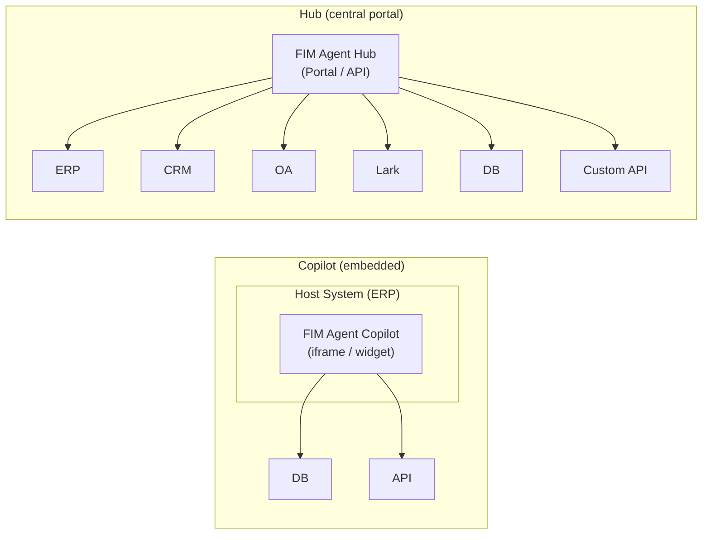
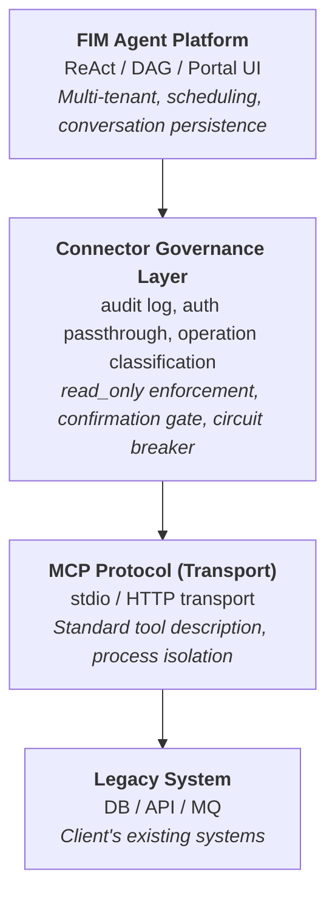
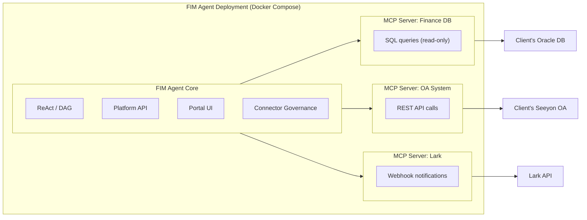
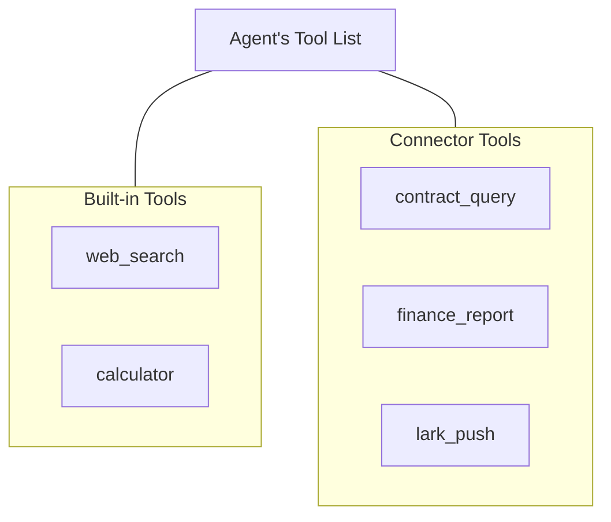
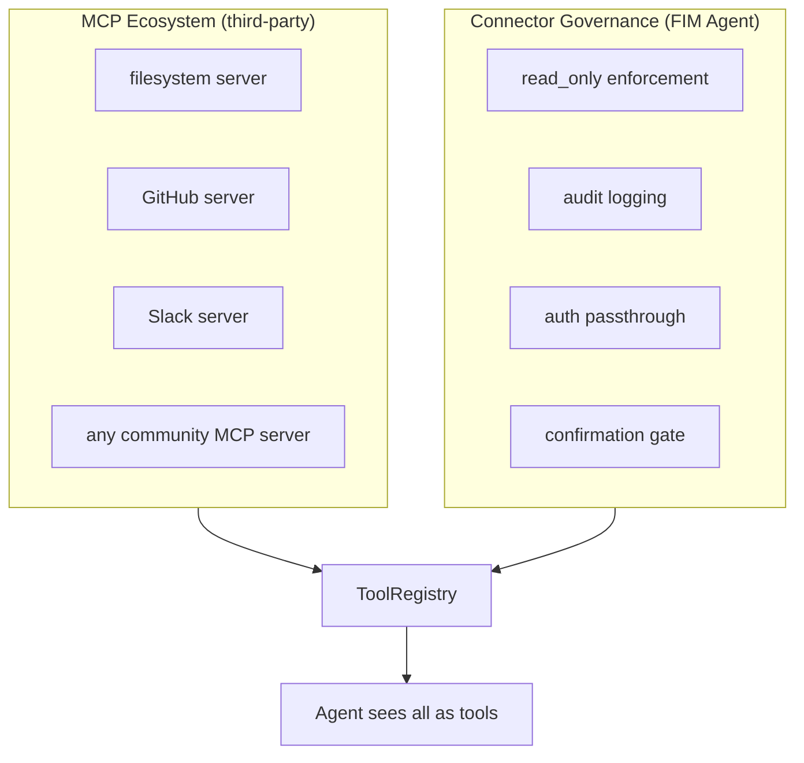

## Copilot vs Hub

The architecture supports two integration scales:



**Copilot** embeds into a host system's UI. Users interact with AI without leaving their familiar interface. It can use multiple connectors (host DB + notification service, etc.).

**Hub** is a standalone portal that connects all systems. It's not embedded in any single system -- it's the central intelligence layer where systems meet AI.

Same connector architecture, different delivery. A Copilot uses the same `ConnectorToolAdapter` as a Hub.

## Core Principle

**The client changes zero code.** FIM Agent bridges into their systems proactively -- reading their databases, calling their APIs, pushing to their message bus. The client provides only credentials and network access.

## Three-Layer Architecture



Each layer has a distinct responsibility:

| Layer | Owns | Changes when... |
|---|---|---|
| **Platform** | Orchestration, multi-tenant, UI | New platform features ship |
| **Connector Governance Layer** | Enterprise governance policies | Security/compliance requirements change |
| **MCP Protocol** | Transport, tool interface standard | Never (open standard) |
| **Legacy System** | Business data and logic | Never (that's the whole point) |

## Why MCP as the Transport Layer

Adapters are implemented as **MCP Servers**. This is a deliberate architectural choice:

- **Reuse**: FIM Agent already ships an MCP Client (v0.3). Adding a legacy system adapter reuses the same infrastructure as adding any MCP tool.
- **Standard protocol**: MCP is an open standard. No proprietary protocol to invent or maintain.
- **Ecosystem**: Third-party MCP Servers (databases, APIs, SaaS tools) work out of the box.
- **Process isolation**: Each MCP Server runs as a separate process. A misbehaving adapter cannot crash the platform.

### What MCP alone does not provide

The **Connector Governance Layer** adds enterprise governance that raw MCP lacks:

| Concern | MCP | Connector Governance Layer |
|---|---|---|
| Read-only enforcement | No | `read_only` flag on operations; write blocked by default |
| Audit logging | No | Every tool call recorded (timestamp, user, tool, params, result) |
| Auth passthrough | No | Proxy host-system auth; agent acts on behalf of logged-in user |
| Confirmation gate | No | Write operations require human approval (SSE `confirmation_required`) |
| Circuit breaker | No | Connection failure triggers graceful degradation |
| Operation classification | No | Operations tagged as read/write/admin with per-level policies |

### Why not invent a custom protocol

Protocol is commodity. The technical value is in the adapters themselves (domain knowledge, schema mapping, edge-case handling) and the governance layer (audit, auth, safety). Inventing a transport protocol would add maintenance cost without adding capability. Stripe uses HTTPS; Docker uses cgroups; FIM Agent uses MCP.

## Deployment Model

Everything runs in a single Docker Compose deployment. The client installs nothing.



<Note>
All provided by FIM Agent. Client provides only:
- Database credentials (read-only account recommended)
- API endpoints and keys (if available)
- Network whitelist access
</Note>

**Access hierarchy**: FIM Agent adapts to whatever access the client can provide:

| What client has | How FIM Agent connects |
|---|---|
| API with documentation | HTTP API adapter (best case) |
| API without documentation | HTTP API adapter + manual schema mapping |
| Database access only | Database adapter (direct SQL, read-only by default) |
| Database + message bus | Database adapter + message push adapter |

## Agent-Connector Decoupling

The agent sees connectors as ordinary tools. It does not know or care whether a tool is built-in, a third-party MCP Server, or a legacy system connector.



This means:

- **Adding** a new system = adding a connector config. Agent code does not change.
- **Removing** a connector = removing the config. No code changes.
- The same agent can use built-in tools and connectors in a single task.

## Hot-Plug Evolution

| Version | How to add a new connector | Restart required? |
|---|---|---|
| **v0.6** | Write a Python MCP Server with Connector Governance Layer, add to docker-compose | Redeploy |
| **v0.8** | Write a YAML/JSON config, platform generates MCP Server | Restart |
| **v1.0** | Upload OpenAPI spec, AI generates config automatically | **No restart (hot-plug)** |

Enterprise deployments are "implement once, run for months" -- hot-plug is a v1.0 convenience, not a v0.6 requirement.

## Data Flow Example

User: "Check all overdue contracts from the finance system and push a summary to Lark."

```
1. User sends message via Portal / API

2. FIM Agent (ReAct mode):
   Think: I need to query the finance DB for overdue contracts, then push to Lark.

3. Act: contract_query(status="overdue", days_past_due=">30")
   → Connector Governance: audit log, read_only check (pass)
   → MCP Server: translates to SQL
   → Client DB: SELECT * FROM contracts WHERE status='overdue' AND ...
   ← Returns 7 overdue contracts

4. Think: Found 7 overdue contracts. I'll summarize and push.

5. Act: lark_push(message="7 overdue contracts found: ...")
   → Connector Governance: audit log, write operation → confirmation gate
   → User approves via Portal
   → MCP Server: POST to Lark webhook
   ← Push successful

6. Answer: "Found 7 overdue contracts. Summary pushed to Lark group."
```

## Connector Standardization Levels

| Level | Version | Approach | Who builds it |
|---|---|---|---|
| **Level 1** | v0.6 | Python MCP Server with Connector Governance | FIM Agent developer |
| **Level 2** | v0.8 | YAML/JSON config, platform auto-generates MCP Server | Implementation engineer (no Python needed) |
| **Level 3** | v1.0 | Upload OpenAPI/Swagger spec, AI generates config | AI (with human review) |

## Relationship to Existing MCP Ecosystem

FIM Agent's MCP Client (shipped in v0.3) already supports third-party MCP Servers. Legacy system adapters are simply **domain-specific MCP Servers** built with the Connector Governance Layer for enterprise governance.



The Connector Governance Layer does not replace MCP -- it extends MCP with the governance layer that enterprise legacy system integration requires.
