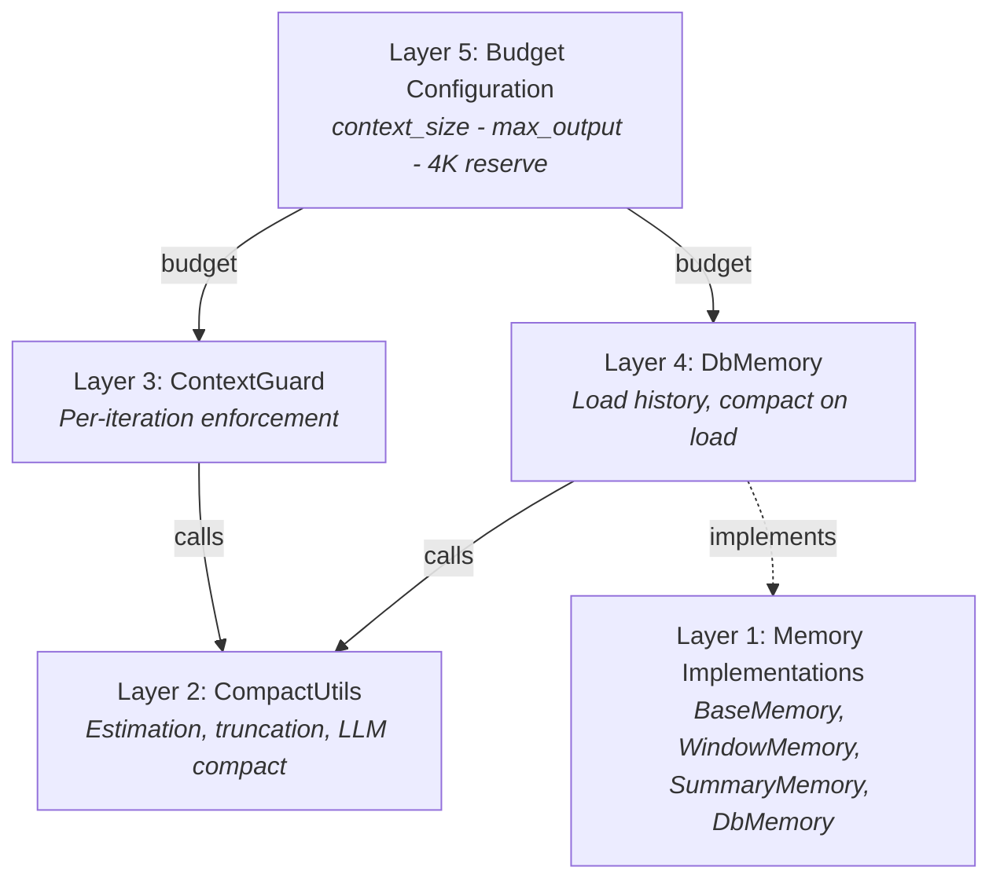
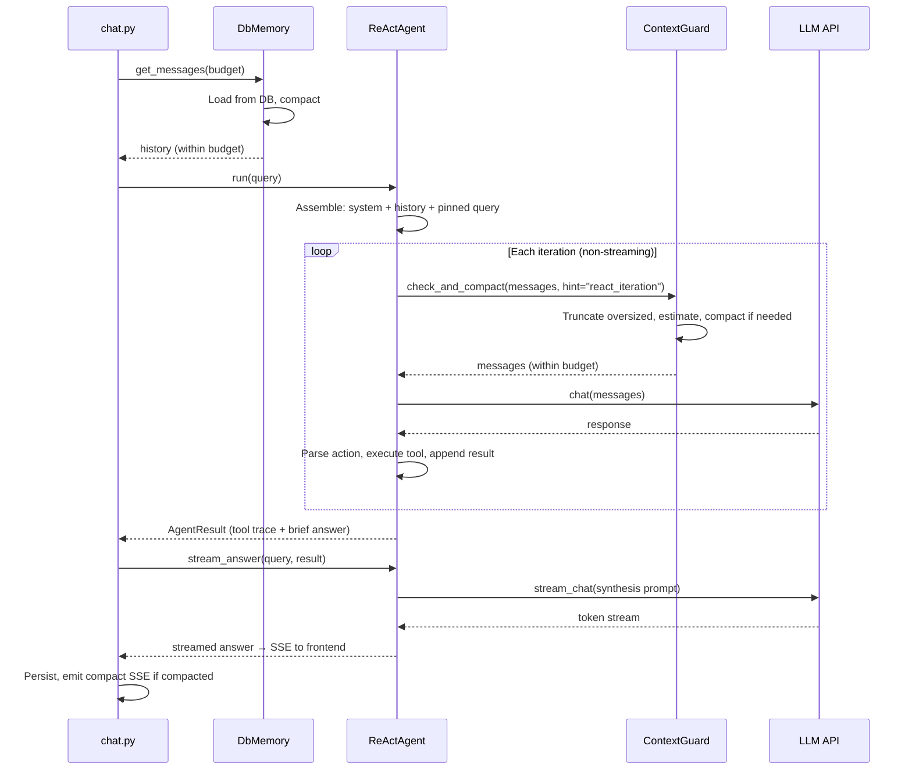
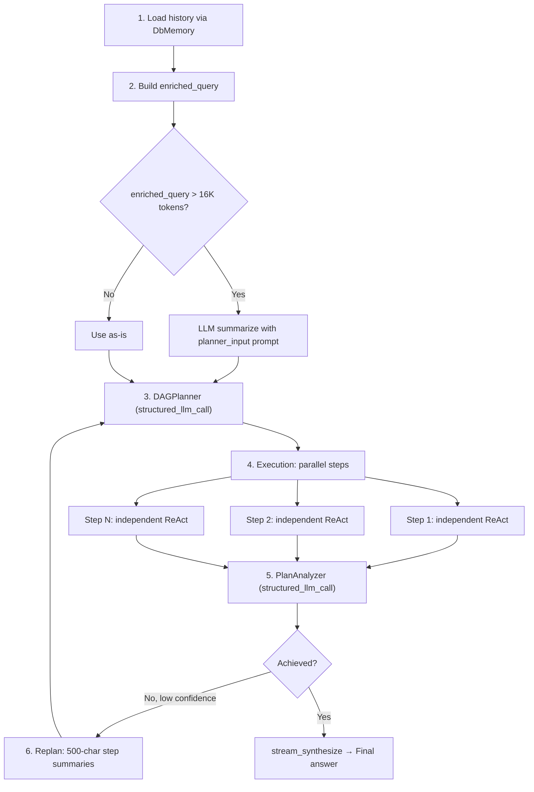

## The problem

LLMs have finite context windows. A 128K-token model sounds generous until you subtract the output budget, the system prompt, tool descriptions, and the accumulated history of a multi-turn conversation. Long conversations, large tool results, and multi-step agent loops all push against this limit — often within a single session.

The naive solution is truncation: drop old messages when the window fills up. This is fast and predictable, but it destroys context indiscriminately. The user's original intent, key decisions from earlier turns, and critical data points all vanish when a blunt character cutoff hits them. The opposite extreme — LLM-powered summarization on every turn — preserves semantic content but is expensive, slow, and introduces its own failure modes (hallucinated summaries, lost numerical precision).

The real challenge is not "fit into the window." It is: **degrade gracefully without losing critical information, without burning tokens on unnecessary compaction, and without adding latency the user can feel.**

FIM One solves this with a five-layer defense-in-depth architecture. Each layer addresses a different scale of the problem, and they compose cleanly — no single layer needs to be perfect because the next one catches what it misses.

## Five layers of defense

Context management is not a single mechanism. It is a stack, where each layer handles a specific concern at a specific granularity:

| Layer | Component | What it does | When it acts |
|-------|-----------|-------------|-------------|
| **5** | Budget Configuration | Computes usable input token budget from model specs | At startup / per-request |
| **4** | DbMemory | Loads persisted history, compacts on load | Once per request |
| **3** | ContextGuard | Per-iteration budget enforcement | Every ReAct iteration |
| **2** | CompactUtils | Token estimation, smart truncation, LLM compaction | Called by layers 3 and 4 |
| **1** | Memory Implementations | Abstract interface + concrete strategies | Framework-level |

The layers are numbered bottom-up because higher layers depend on lower ones. Layer 5 sets the budget. Layer 4 does the initial load-time compaction. Layer 3 enforces the budget on every iteration. Layers 2 and 1 provide the primitives that layers 3 and 4 use.



### Layer 5 — Budget Configuration

The budget is computed from three values:

```
usable_input_tokens = context_size - max_output_tokens - system_prompt_reserve
```

With defaults: `128,000 - 64,000 - 4,000 = 60,000 tokens`.

The 4,000-token system prompt reserve covers the agent's system prompt, tool descriptions, and formatting overhead. This is a fixed constant — generous enough to avoid clipping system prompts in practice, small enough not to waste budget.

Budget values can come from three sources, resolved in priority order:

1. **Database ModelConfig** — per-model `context_size` and `max_output_tokens` set by the admin.
2. **Environment variables** — `LLM_CONTEXT_SIZE` and `LLM_MAX_OUTPUT_TOKENS`.
3. **Hardcoded defaults** — 128K context, 64K output.

The main LLM and fast LLM have independent budgets. DAG step execution uses the fast LLM's budget; ReAct mode uses the main LLM's budget. This matters because operators often pair a large-context model for ReAct (where history accumulates) with a smaller, faster model for DAG steps (where each step starts fresh).

A floor of 4,000 tokens is enforced — if misconfigured values would produce a smaller budget, the system clamps to 4K rather than failing silently.

### Layer 4 — DbMemory

`DbMemory` is the production memory implementation. It loads persisted conversation history from the database and compacts it to fit the token budget before the agent sees it.

The design is **read-only by intention**. Persistence is handled by `chat.py` — the API layer that owns the full message lifecycle (including metadata, usage tracking, and image attachments). `DbMemory` only reads. Its `add_message()` and `clear()` methods are no-ops. This separation prevents double-writes and keeps the persistence logic in one place.

On load, `DbMemory`:

1. Queries all `user` and `assistant` messages for the conversation, ordered by creation time.
2. Drops the trailing user message (the current query, which the agent will re-append).
3. Reconstructs image attachments — user messages that included images store metadata (`file_id`, `mime_type`) in the database, and `DbMemory` rebuilds the base64 data-URLs from disk so the LLM can "see" images from earlier turns.
4. Compacts: if a `compact_llm` was provided, uses `CompactUtils.llm_compact()`. Otherwise, falls back to `CompactUtils.smart_truncate()`.

After compaction, `DbMemory` sets tracking flags (`was_compacted`, `_original_count`, `_compacted_count`) that the SSE layer uses to emit a `compact` event to the frontend.

### Layer 3 — ContextGuard

`ContextGuard` is the per-iteration budget enforcer. It is called at the top of every ReAct iteration — both in standalone ReAct mode and inside each DAG step's sub-agent. This is the last line of defense before the messages hit the LLM API.

The enforcement follows a three-step process:

1. **Truncate oversized individual messages.** Any single message exceeding 50K characters is hard-truncated with a `[Truncated]` suffix. This catches runaway tool outputs — a web scrape that returns an entire webpage, a file read that dumps a large dataset.

2. **Estimate total tokens.** If the total fits within budget, return immediately. Most iterations pass here — compaction is the exception, not the norm.

3. **Compact if over budget.** If a `compact_llm` is available, use LLM-powered compaction with a hint-specific prompt. Otherwise, fall back to `smart_truncate`.

The **hint system** is what makes ContextGuard context-aware rather than one-size-fits-all. Different situations need different compaction strategies:

| Hint | Used by | Preserves | Drops |
|------|---------|-----------|-------|
| `react_iteration` | ReAct agent loop | Recent reasoning chain, current goal, critical data | Old redundant steps, failed retries, verbose tool outputs |
| `planner_input` | DAG enriched query | User intent evolution, key decisions, constraints | Dialogue details, greetings, tool call mechanics |
| `step_dependency` | DAG step context | Key data, numbers, conclusions | Reasoning process, failed attempts, verbose formatting |
| `general` | Default fallback | Key facts, decisions, tool results | Greetings, filler, redundant back-and-forth |

Each hint maps to a carefully worded system prompt that tells the compaction LLM what to keep and what to discard. The prompts end with "Write in the same language as the conversation" — a detail that matters for CJK users whose summaries would otherwise default to English.

If LLM compaction fails (network error, empty response, any exception), ContextGuard falls back to `smart_truncate` silently. The agent never sees the failure. This is a deliberate reliability choice: better to lose some context via heuristic truncation than to crash the iteration.

### Layer 2 — CompactUtils

`CompactUtils` is a stateless utility class — no instances, no state, just pure functions. It provides three capabilities that layers 3 and 4 build on.

**Token estimation** converts text to an approximate token count without importing a tokenizer library. The heuristic:

- ASCII characters: ~4 characters per token
- CJK / non-ASCII characters: ~1.5 characters per token
- Images: 765 tokens per image (flat cost)
- Per-message overhead: 4 tokens (role marker, delimiters)

**`smart_truncate`** is the heuristic fallback. It keeps pinned messages unconditionally, then walks backward through non-pinned messages, accumulating until the budget is exhausted. The result is a suffix of the conversation that fits. It also ensures the result never starts with an assistant message — an orphaned assistant turn with no preceding user message confuses LLMs.

**`llm_compact`** is the LLM-powered path. It splits messages into three groups — system messages (always kept), pinned messages (always kept), and compactable messages. The oldest compactable messages are summarized into a single `[Conversation summary]` system message; the most recent 4 messages are kept verbatim. If the compacted result is still too long, it falls back to `smart_truncate` on the compacted output — belt and suspenders.

### Layer 1 — Memory Implementations

The memory layer defines the `BaseMemory` interface: `add_message()`, `get_messages()`, `clear()`. Three implementations exist:

- **WindowMemory** — a count-based sliding window. Keeps the last N non-system messages. Simple, predictable, no LLM calls. Not used in production; useful for testing and stateless scenarios.

- **SummaryMemory** — triggers LLM summarization when the message count exceeds a threshold. Compresses old messages into a `[Conversation summary]` system message. Not used in production; predates the more sophisticated ContextGuard approach.

- **DbMemory** — the production implementation (described in Layer 4). Database-backed, read-only, with LLM or heuristic compaction on load.

WindowMemory and SummaryMemory remain in the codebase because they serve as useful primitives for testing and for users who embed FIM One's core library without the web layer. They are not dead code — they are the simple cases that the architecture grew out of.

## How context flows through ReAct

The ReAct agent uses context management at two distinct phases: load time and iteration time.



Tool iterations use non-streaming `chat()` for speed; answer synthesis uses streaming `stream_chat()` via `stream_answer()`. This two-phase split — fast tool loop followed by streaming synthesis — optimizes both latency and user experience. For full ReAct engine architecture including dual-mode execution and tool selection, see [ReAct Engine](/architecture/react-engine).

The key insight: **DbMemory handles the historical context problem (turns from previous requests), while ContextGuard handles the within-request growth problem (tool results accumulating during an agent loop).** They operate at different timescales and catch different failure modes.

The user's current query is always marked as `pinned=True`. This ensures it survives all compaction — both `smart_truncate` and `llm_compact` preserve pinned messages unconditionally. No matter how aggressively the history is compressed, the user's actual question is never lost.

## How context flows through DAG

DAG mode has a fundamentally different context shape than ReAct. Instead of one long conversation thread, it has a tree: a planning phase, multiple parallel execution steps, and an analysis phase. Each phase has its own context management strategy.



**Phase 1 — History loading.** DbMemory loads and compacts conversation history, same as ReAct. The compacted history is formatted into a text block prefixed with `"Previous conversation:"`.

**Phase 2 — Enriched query construction.** The history text and current query are combined into an `enriched_query`. If this exceeds 16K tokens, it is LLM-summarized using the `planner_input` hint prompt. The 16K threshold is chosen because the planner needs to read the entire query in a single pass — unlike ReAct, there is no iterative compaction during planning.

**Phase 3 — Planning.** The planner receives a 2-message prompt: system prompt plus enriched query. No ContextGuard here — the enriched query is already size-controlled by the 16K check.

**Phase 4 — Step execution.** Each DAG step runs as an independent ReAct agent with its own ContextGuard. Critically, these sub-agents have **no memory** — they start fresh with only their task description and dependency context. This is by design: DAG steps should be self-contained units of work. Dependency results are injected via `_build_step_context`, which character-truncates at 50K (the ContextGuard's `max_message_chars` limit).

**Phase 5 — Analysis.** Step results are formatted for the analyzer LLM with per-step truncation at 10K characters. This prevents a single step's verbose output from dominating the analysis context.

**Phase 6 — Replanning.** When the analyzer determines the goal was not achieved and confidence is below the threshold, step results are truncated to just 500 characters each for the replanning context. Replanning needs to know *what happened* and *what went wrong*, not the full detail of every step's output. This aggressive truncation keeps the replan prompt compact enough for the planner to process efficiently.

For the full DAG pipeline architecture including the LLM Call Map and re-planning logic, see [DAG Engine](/architecture/dag-engine).

## Pinned messages

The pinning mechanism prevents compaction from destroying messages that must survive. Two categories of messages are pinned:

1. **The current user query** — always pinned. If the user asks a question and the history is too long, the system compresses the history, not the question.

2. **Injected mid-stream messages** — when a user sends a follow-up while the agent is still running, the injected message is marked as pinned so the agent sees it in the next iteration.

The risk with pinning is accumulation. In a long session with many injected messages, pinned content can grow to consume most of the budget, leaving no room for the actual conversation history. ContextGuard addresses this with a hard cap: **when pinned tokens exceed 50% of the budget, the oldest injected messages are unpinned and moved to the compactable pool.** Only the most recent pinned message (the current query) is preserved.

This is a trade-off. Unpinning old injected messages means they might be summarized or truncated. But the alternative — letting pinned messages crowd out all other context — is worse. The system biases toward preserving the most recent context, which is almost always more relevant than older injections.

## Token estimation

FIM One uses heuristic token estimation rather than a real tokenizer. This is a deliberate choice with clear trade-offs.

**Why not a real tokenizer?** Three reasons:

1. **Dependency cost.** `tiktoken` (OpenAI's tokenizer) is 15MB of compiled Rust bindings. `sentencepiece` (used by some open-source models) has its own build requirements. For a framework that targets multiple LLM providers, there is no single correct tokenizer — each model family uses a different one.

2. **Speed.** Heuristic estimation is a single pass over the string. Real tokenization involves vocabulary lookup, BPE merge operations, and special token handling. ContextGuard calls estimation on every iteration, sometimes multiple times — the speed difference matters.

3. **Good enough.** The heuristic is tuned for mixed-language text (the ASCII/CJK split covers the two major cases). It can be 1.5-2x off for edge cases (heavily punctuated code, unusual Unicode), but context management is inherently approximate. Being 30% off on a 60K budget still leaves a comfortable margin.

The concrete heuristics:

| Content type | Ratio | Rationale |
|-------------|-------|-----------|
| ASCII text | ~4 chars/token | English prose and code average 3.5-4.5 chars/token across GPT/Claude tokenizers |
| CJK / non-ASCII | ~1.5 chars/token | Each CJK character is typically 1-2 tokens; 1.5 is the geometric mean |
| Images | 765 tokens/image | Approximate cost of a base64-encoded image in the vision API |
| Per-message overhead | 4 tokens | Role marker, delimiters, formatting |

The estimation always returns at least 1 token for non-empty content. This prevents division-by-zero edge cases in budget arithmetic.

## What the user sees

Context management is designed to be invisible in the common case and minimally intrusive when it activates. The user-facing signals are:

**CompactDivider.** When `DbMemory` compacts history on load, the frontend renders a dashed divider with the text "Earlier context (N messages) was summarized by AI." This appears between the summary and the preserved recent messages, giving the user a visual cue that older context has been compressed without interrupting the conversation flow.

**Token usage display.** The `done` card at the end of each response shows "X.Xk in / X.Xk out" — the total input and output tokens consumed. This includes tokens spent on compaction (the fast LLM calls for summarization). Users who monitor token consumption can see when compaction is adding overhead.

**Graceful error handling.** If context management fails entirely — a scenario that should not happen given the fallback chain, but could in theory — the error surfaces as agent error text in the response, not as a system crash. The conversation continues; the user can retry or rephrase.

The goal is that most users never think about context management. They have long conversations, the system handles the budget transparently, and the only visible artifact is an occasional compact divider. For power users and operators who care about token efficiency, the usage display and the configurable budget parameters provide the control they need.
