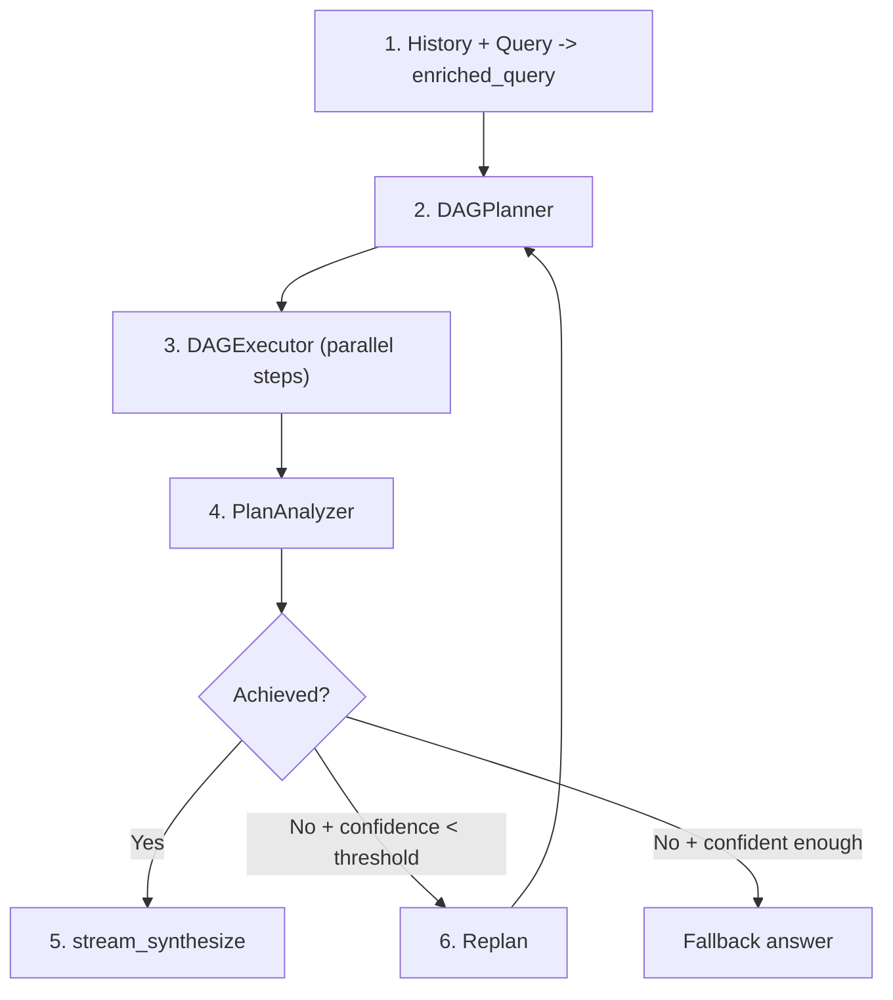
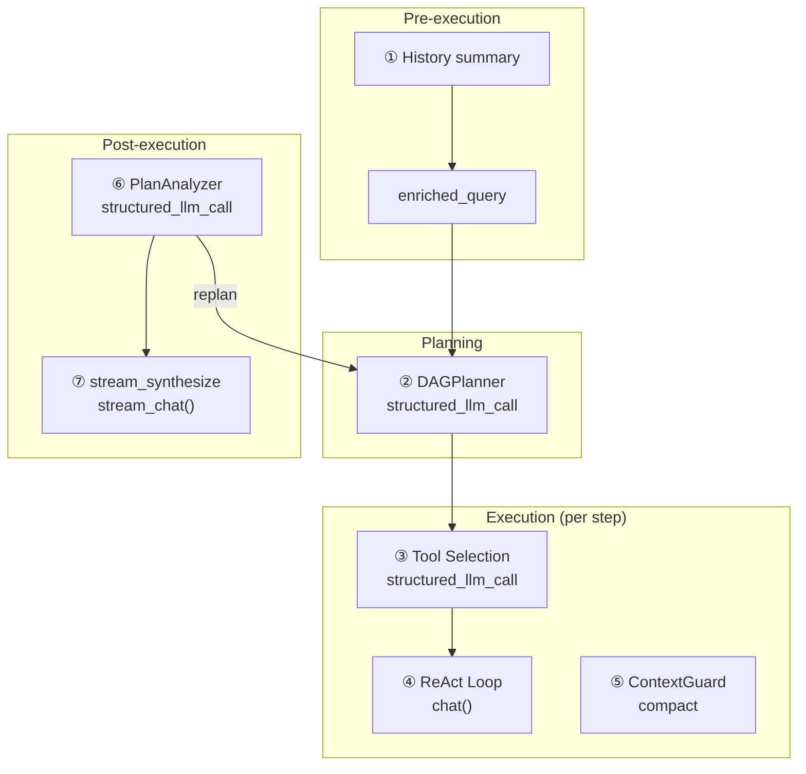

## The pipeline

DAG mode decomposes a complex goal into a directed acyclic graph of steps, executes them with maximum parallelism, then reflects on whether the goal was actually achieved. If not, it re-plans and tries again — autonomously, up to a configurable budget.

The pipeline has four phases that form a loop:

**Plan.** The smart LLM decomposes the enriched query into 2-6 steps with explicit dependency edges. Each step gets a task description, optional tool hint, and a model hint that controls whether it runs on the fast or smart LLM.

**Execute.** The DAGExecutor launches independent steps in parallel (up to 5 concurrent), respecting the dependency graph. Each step runs as a self-contained ReAct agent with no memory — it receives only its task description and the results of its completed dependencies.

**Analyze.** The PlanAnalyzer evaluates whether the executed plan achieved the original goal, producing a structured verdict: `achieved` (boolean), `confidence` (0.0-1.0), `reasoning`, and an optional `final_answer`.

**Re-plan.** If the goal was not achieved and confidence is below the stop threshold, the pipeline loops back to planning with a replan context that summarizes what happened and what went wrong. This loop runs up to `DAG_MAX_REPLAN_ROUNDS` times autonomously.

Two LLMs collaborate throughout: a **smart LLM** handles planning, analysis, and answer synthesis (tasks requiring high reasoning capability), while a **fast LLM** handles step execution and context compaction (tasks where cost and latency matter more than peak reasoning). Every structured output call uses `structured_llm_call`, which provides a 3-level degradation chain (Native FC, JSON Mode, plain text with regex fallback) to handle model-specific output quirks.

## LLM call map

The full DAG pipeline makes seven distinct categories of LLM calls. Understanding where each call happens, which model handles it, and what happens on failure is essential for debugging and cost optimization.

| # | Call Site | Module | LLM Role | Format | Fallback |
|---|-----------|--------|----------|--------|----------|
| 1 | History summary | chat.py | fast LLM | plain text | truncate last 20K chars |
| 2 | DAGPlanner | planner.py | smart LLM | structured\_llm\_call | 3-level degradation |
| 3 | Tool selection | react.py | step LLM | structured\_llm\_call | return all tools |
| 4 | ReAct loop (per step) | react.py | fast/smart LLM | chat() | retry/fallback |
| 5 | ContextGuard compact | context\_guard.py | fast LLM | plain text | smart\_truncate |
| 6 | PlanAnalyzer | analyzer.py | smart LLM | structured\_llm\_call | regex + default |
| 7 | stream\_synthesize | analyzer.py | smart LLM | stream\_chat() | analysis.final\_answer |

Calls 1 and 5 are **invisible to the user** — they are infrastructure calls that manage context size. Calls 2, 6, and 7 use the **smart LLM** because they require high reasoning capability (decomposing goals, judging achievement, synthesizing coherent answers). Calls 3 and 4 use the **fast LLM** by default because each DAG step should be a focused, bounded task — though a step with `model_hint: null` can be promoted to the smart LLM via the model registry.

## DAGPlanner

The planner's job is to turn a high-level goal into a valid DAG of concrete, actionable steps. It does this with a single `structured_llm_call` to the smart LLM.

**Prompt design.** The planning prompt injects the current datetime and year (so the LLM can plan time-aware searches), enforces language matching (task descriptions must use the same language as the goal), and constrains step count to 2-6. Each step has five fields: `id`, `task`, `dependencies`, `tool_hint`, and `model_hint`. The prompt explicitly discourages splitting trivially related sub-tasks — "if several checks can be done in a single script, combine them into ONE step."

**Structured extraction.** The planner uses `structured_llm_call` with a `_PLAN_SCHEMA` that defines the `steps` array schema and a `parse_fn` that converts raw dicts to `PlanStep` objects. If the LLM returns a single step object instead of a `{"steps": [...]}` wrapper, the parser auto-recovers. The 3-level degradation chain documented in [ReAct Engine — structured\_llm\_call](/architecture/react-engine#structured_llm_call--unified-output-extraction) handles model output quirks across providers.

**DAG validation.** After extraction, the planner validates the graph structure using Kahn's algorithm for topological sorting. Two invariants are checked:

1. **No dangling references.** If a step references a dependency ID that does not exist in the plan, the reference is silently pruned with a warning log. This is a recovery mechanism — LLMs sometimes omit steps they referenced, and hard-failing would waste the entire planning call.

2. **No cycles.** If Kahn's algorithm cannot visit all nodes (meaning at least one cycle exists), the planner raises a `ValueError`. Cycles are unrecoverable — a cyclic plan cannot be executed.

**model\_hint.** The planner assigns `"fast"` to steps it considers simple and deterministic (data lookup, format conversion, straightforward retrieval) and `null` to steps requiring deeper reasoning. The executor uses this hint to select the appropriate LLM per step. When in doubt, the prompt instructs the LLM to use `null` — it is always safer to use the more capable model.

**Input construction.** The enriched query combines conversation history with the current request. If the conversation is long, history is loaded via `DbMemory` and formatted as `"Previous conversation: ..."`. When the resulting enriched query exceeds 16K tokens (estimated via `CompactUtils.estimate_tokens`), it is LLM-summarized using the `planner_input` hint prompt from ContextGuard before being passed to the planner. The fallback when no fast LLM is available: hard-truncate to the last 20K characters.

## DAGExecutor

The executor takes a validated `ExecutionPlan` and runs its steps concurrently, respecting dependency edges and enforcing resource limits.

**Concurrency model.** An `asyncio.Semaphore` limits parallel step execution to `max_concurrency` (default 5, configurable via `MAX_CONCURRENCY` env var). The dispatch loop identifies all steps whose dependencies have completed, launches them as `asyncio.Task` instances, and waits for at least one to finish before checking again. Steps are launched in sorted ID order for deterministic behavior.

**Per-step ReAct agent.** Each step runs as an independent ReAct agent created by `_resolve_agent()`. If the step has a `model_hint` that matches a role in the `ModelRegistry`, a temporary agent is created with the corresponding LLM. Otherwise, the default fast LLM agent is used. These per-step agents have **no memory** — they start fresh with only their task description, the original goal, any tool hints, and the results of completed dependencies. This isolation is deliberate: DAG steps should be self-contained units of work that do not leak state across the graph.

**Dependency context injection.** `_build_step_context()` formats the results of all completed dependency steps into a text block: each dependency's ID, status, task description, and result. If a `ContextGuard` is configured and the combined context exceeds `max_message_chars`, it is hard-truncated with a `[Dependency context truncated]` suffix. This prevents a step that depends on multiple verbose predecessors from blowing out its own context window.

**Step timeout.** Each step is wrapped in `asyncio.wait_for` with a default timeout of 600 seconds (10 minutes). If a step exceeds this, it is cancelled and marked as `"failed"` with a timeout message. The timeout is per-step, not per-plan — a 5-step plan can theoretically run for 50 minutes if steps execute sequentially.

**Stop event.** When a user sends a follow-up message during execution, the orchestrator sets `exec_stop_event`. The executor checks this event at the top of each dispatch cycle: if set, all remaining pending steps are marked `"skipped"` and the execution loop exits. Steps already running are allowed to complete — only unstarted steps are skipped.

**Deadlock detection.** If the dispatch loop finds no tasks running and no steps ready to launch (because their dependencies failed), all remaining pending steps are marked `"failed"` with a message explaining that their dependencies never completed. This prevents the executor from hanging indefinitely.

**Progress callbacks.** The executor fires `(step_id, event, data)` callbacks for three event types: `"started"` (step launched), `"iteration"` (tool call within a step), and `"completed"` (step finished). The SSE layer in `chat.py` bridges these callbacks to `step_progress` events that the frontend uses to render real-time DAG visualization.

## PlanAnalyzer

The analyzer evaluates whether the executed plan achieved the original goal. It produces a structured `AnalysisResult` with four fields:

- **`achieved`** (boolean) — `true` only if the goal was fully accomplished.
- **`confidence`** (float, 0.0-1.0) — how certain the analyzer is in its assessment. Sources that contradict each other lower this score.
- **`final_answer`** (string or null) — a synthesized answer when achieved, `null` otherwise.
- **`reasoning`** (string) — the LLM's chain-of-thought justification.

**Structured extraction.** The analyzer uses `structured_llm_call` with `_ANALYSIS_SCHEMA`, a `parse_fn` that handles type coercion and confidence clamping, and a `regex_fallback` for malformed JSON. The regex fallback (`_regex_extract_analysis`) extracts `achieved`, `confidence`, `final_answer`, and `reasoning` fields from partially valid JSON using pattern matching. This matters because analysis responses tend to be longer and more complex than planning responses, making JSON formatting errors more likely.

**Safe default.** If all extraction levels fail (native FC, JSON mode, plain text, regex), the analyzer returns `AnalysisResult(achieved=False, confidence=0.0, reasoning="Could not parse analysis response")`. This ensures the pipeline always gets a usable result — a parse failure becomes a "not achieved" verdict, which triggers re-planning rather than crashing.

**Step result formatting.** Each step's result is truncated to 10K characters in the analysis prompt. This prevents a single step's verbose output (e.g., a large web scrape or file dump) from dominating the analyzer's context window and crowding out other steps' results.

**Multi-source comparison.** The analysis prompt includes a directive to explicitly compare results from different sources. When web search results, knowledge base retrieval, and file operations all contribute data, the analyzer must flag contradictions (different numbers, dates, claims) and indicate which source is likely more authoritative. Contradictions lower the confidence score, which in turn influences the re-planning decision.

## Re-planning

The re-planning loop is the DAG engine's most distinctive feature: it can autonomously recover from partial failures by reflecting on what went wrong and trying a different approach.

**Decision logic.** After each round of plan-execute-analyze, the orchestrator in `chat.py` evaluates the analysis result:

1. **`achieved == True`** — exit the loop, proceed to streaming synthesis.
2. **User inject occurred during this round** — always re-plan, regardless of confidence or budget. User follow-up messages are treated as requirement changes that demand a fresh attempt. This does not consume the autonomous replan budget.
3. **Autonomous replan budget exhausted** — exit the loop. The budget is `max_replan_rounds - 1` autonomous replans (default: 2 autonomous replans from a budget of 3 total rounds).
4. **`confidence >= replan_stop_confidence`** — exit the loop. Even if the goal was not fully achieved, a high confidence score (default threshold: 0.8, configurable via `DAG_REPLAN_STOP_CONFIDENCE`) indicates the analyzer is fairly certain about what happened — re-planning is unlikely to help.
5. **Otherwise** — re-plan. The goal was not achieved, confidence is low, and budget remains.

**Replan context.** When re-planning, the orchestrator calls `_format_replan_context()` to build a summary of the previous round. This includes the analyzer's reasoning and a truncated preview of each step's result (500 characters max per step). The aggressive truncation is deliberate: the planner needs to know *what happened* and *what went wrong*, not the full detail of every step's output. This context is passed to `DAGPlanner.plan()` as the `context` parameter, alongside the original enriched query.

**Max rounds.** The `DAG_MAX_REPLAN_ROUNDS` environment variable (default 3) controls the total number of planning rounds. With default settings, the first round is the initial plan, leaving up to 2 autonomous re-plans. User-triggered re-plans (via message injection) do not count against this budget — a user can steer the pipeline indefinitely.

**SSE event.** When the pipeline decides to re-plan, it emits a `replanning` phase event containing the analyzer's reasoning. The frontend uses this to show the user why the pipeline is retrying.

**enriched\_query accumulation.** User follow-up messages are appended to the enriched query across rounds: `enriched_query += "\n\n[User follow-up]: {content}"`. This means the planner sees the full evolution of the user's intent — the original request plus all subsequent clarifications — when building a revised plan.

## Streaming synthesis

When the analyzer confirms the goal was achieved (`analysis.achieved == True`), the pipeline streams a synthesized final answer to the user via `PlanAnalyzer.stream_synthesize()`.

**Input.** The synthesis call receives three inputs: the original goal, the formatted step results (10K characters max per step), and the analyzer's reasoning from the non-streaming analysis call. The reasoning provides a "roadmap" for what the synthesis should cover.

**System prompt.** The synthesis prompt instructs the LLM to answer directly without meta-commentary ("do NOT include phrases like 'based on the results'"), match the language of the original goal, and compare results from different sources when applicable. A language directive from user preferences is appended if available.

**Streaming.** The method uses `stream_chat()` to yield tokens incrementally. The SSE layer wraps each chunk in an `answer` event with `status: "delta"`, giving the frontend real-time rendering of the final answer.

**Fallback chain.** Two fallback paths handle failure:

1. **stream\_synthesize raises an exception** — fall back to `analysis.final_answer` from the non-streaming `analyze()` call. This answer was already generated during analysis, so it is available even if the streaming call fails.

2. **Goal not achieved (no synthesis attempted)** — concatenate all completed step results, separated by horizontal rules. Each result is prefixed with its step ID. If no steps completed at all, return `"(goal not achieved)"`.

The fallback design ensures the user always gets an answer — degraded but never empty.

## Two-LLM architecture

The DAG engine's cost and latency profile is shaped by its dual-model design. The division of labor is:

| Role | Used for | Optimized for |
|------|----------|---------------|
| **Smart LLM** | Planning, analysis, answer synthesis | Reasoning capability |
| **Fast LLM** | Step execution, context compaction, history summary | Cost and latency |

The smart LLM handles the three calls that require the deepest reasoning: decomposing a goal into a coherent plan, judging whether the plan achieved the goal, and synthesizing a final answer that coherently integrates multiple step results. These calls happen once per round (or once total for synthesis), so their higher per-token cost is amortized.

The fast LLM handles the high-volume calls: each DAG step's ReAct loop (which may involve multiple tool calls and iterations), context compaction when step contexts grow too large, and history summarization for multi-turn conversations. A 5-step plan with 3 iterations per step means 15+ fast LLM calls — using the smart LLM here would be prohibitively expensive.

**Per-step override.** The `model_hint` field on each `PlanStep` allows the planner to promote individual steps to the smart LLM. When `model_hint` is `null`, the executor uses the default agent (fast LLM). When it is `"fast"`, the executor explicitly uses the fast LLM via the model registry. The planner is instructed to set `"fast"` for deterministic tasks and `null` for complex reasoning, but it can also be set to any custom role registered in the `ModelRegistry`. Model resolution happens **once per step** via `_resolve_agent()` immediately before that step's ReAct loop begins — all iterations within the step (tool selection, the ReAct loop, ContextGuard compaction) use the same resolved LLM. The model never changes mid-step.

**Budget independence.** The smart and fast LLMs have independent context budgets, computed from their respective model configurations. DAG step execution uses the fast LLM's budget; the planning and analysis calls use the smart LLM's budget. This is important because operators often pair a large-context model (128K+) for planning with a smaller, faster model (32K) for step execution. For details on how budgets are computed, see [Context Management — Budget Configuration](/architecture/context-management#layer-5--budget-configuration).
