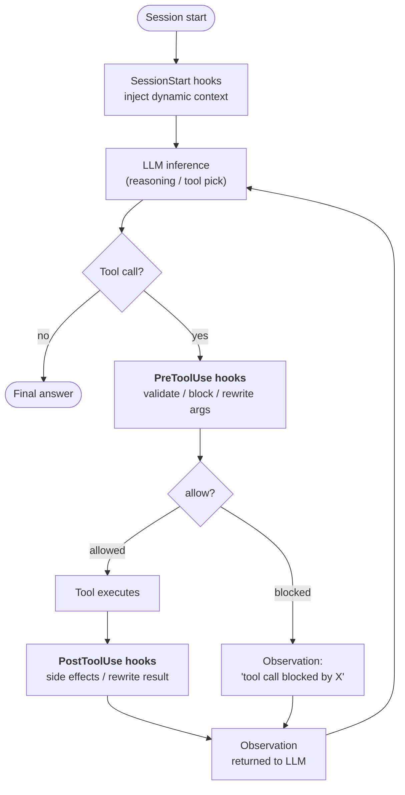
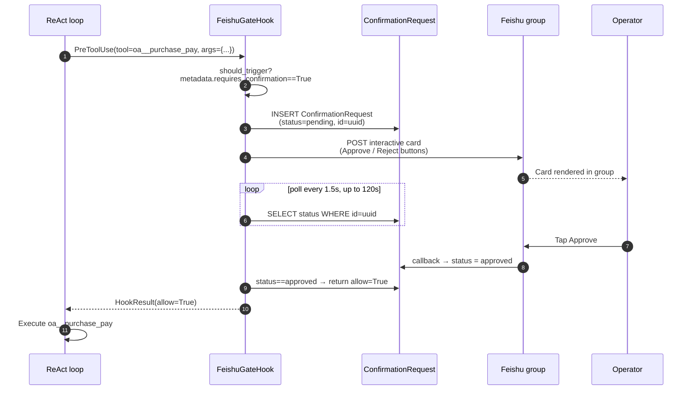

## Why hooks exist

Instructions in a system prompt are **suggestions**. A sufficiently stubborn or confused LLM can ignore them. For most agent behavior that is exactly what you want — instructions give the model room to adapt.

But some requirements are not suggestions. "Every sensitive tool call must be logged." "Write operations are blocked when the org is in read-only mode." "Payments above ¥50k require a human tap before firing." These are **invariants** — facts about the system that must hold regardless of what the model decides in any given turn.

A hook is code that runs **outside the LLM loop** at a well-defined point in the agent's execution lifecycle. The LLM cannot see the hook. The LLM cannot argue with the hook. The LLM cannot talk the hook into skipping a step. If a `PreToolUse` hook returns `allow=False`, the tool call does not happen — no matter how insistent the reasoning trace was.

This is the critical architectural distinction:

| Mechanism | Where it runs | Who controls it | Guarantee |
|---|---|---|---|
| **System prompt instruction** | Inside LLM inference | Model | "Probably follows it" |
| **Tool description / schema** | Inside LLM inference | Model | "Probably follows it" |
| **Hook** | Around LLM inference | Platform code | **Always runs** |

Hooks are how FIM One turns "the agent is supposed to..." into "the agent cannot bypass...".

## Where hooks plug in

Three hook points are defined today. Each marks a boundary the agent crosses during one loop iteration:



| Hook point | Fires when | Can it block? | Can it mutate data? |
|---|---|---|---|
| `SessionStart` | Before the first LLM call of a session | No | Yes — injects context into the initial prompt |
| `PreToolUse` | After the LLM picks a tool, before the tool runs | **Yes** (via `allow=False`) | Yes — can rewrite `tool_args` before execution |
| `PostToolUse` | After the tool returns, before the observation goes to the LLM | No | Yes — can rewrite the observation |

Multiple hooks at the same point run in priority order. An earlier `PreToolUse` hook's rewritten args are carried forward to later hooks, so middleware composes.

## When a hook vs. an instruction

Deciding whether to solve a requirement with a prompt instruction or a hook is the same calculation as "runtime assert vs. code comment":

| Symptom | Solution |
|---|---|
| "The agent should prefer X when Y" | Instruction — soft guidance, model has latitude |
| "The agent must log every call to connector Z" | **PostToolUse hook** — cannot rely on the model to remember |
| "Payments over ¥50k need human approval" | **PreToolUse hook** — cannot rely on the model to ask |
| "The agent should introduce itself in Chinese" | Instruction — stylistic, low cost if missed |
| "The agent cannot write to the production database in read-only mode" | **PreToolUse hook** — safety invariant, zero tolerance |
| "The agent should summarize long DB query results" | Could be either, but a hook is robust — see PostToolUse truncate |

Rule of thumb: **if the wrong behavior is an incident, use a hook. If the wrong behavior is a minor annoyance, an instruction is fine.**

## The hook contract

A hook is a subclass of `PreToolUseHook`, `PostToolUseHook`, or `SessionStartHook` with one required method:

```python
class ReadOnlyGuard(PreToolUseHook):
    name = "readonly_guard"
    priority = 5                          # lower runs earlier

    def should_trigger(self, ctx: HookContext) -> bool:
        return ctx.tool_name.startswith("sql_")

    async def execute(self, ctx: HookContext) -> HookResult:
        if org_is_readonly(ctx.metadata["org_id"]):
            return HookResult(
                allow=False,
                error="Org is in read-only mode — write blocked.",
                side_effects=["readonly_guard: blocked sql write"],
            )
        return HookResult()               # default: allow=True, no mutation
```

The `HookContext` passed in carries `tool_name`, `tool_args`, `agent_id`, `user_id`, and a flexible `metadata` dict the engine populates with per-request facts (org id, conversation id, the connector action's `requires_confirmation` flag, …).

The `HookResult` returned controls the outcome:

- `allow: bool = True` — whether the tool call proceeds (ignored for `PostToolUse` / `SessionStart`)
- `error: str | None` — human-readable reason, surfaced to the LLM as the observation when blocked
- `modified_args: dict | None` — if set, replaces the tool args before execution
- `modified_result: Any | None` — if set (PostToolUse), replaces the observation before it returns to the LLM
- `side_effects: list[str]` — audit trail of what the hook did, merged into the agent's trace

## Case study: `FeishuGateHook`

The first hook shipped on top of this system is `FeishuGateHook` — a `PreToolUse` hook that turns any tool flagged `requires_confirmation=True` into a human-in-the-loop approval card posted to the org's Feishu group.

This hook exercises the full lifecycle:



What this design is buying:

- **The tool call is genuinely suspended.** The agent's SSE stream pauses between "I will call `oa__purchase_pay`" and the observation. The user sees the agent waiting, which matches what is happening under the hood.
- **Approval survives a process restart.** The pending row is in the database, not in memory. If the backend restarts while a card is outstanding, the next poll picks up where it left off.
- **The decision is audited.** `ConfirmationRequest` keeps `payload`, `responded_at`, `responded_by_open_id`, and the final status — an auditable record of who approved what and when.
- **No LLM in the decision loop.** The model produces the tool call. Humans produce the verdict. The hook is the deterministic bridge.

`FeishuGateHook` depends on a configured [Feishu Channel](/configuration/channels/feishu) — the hook sends the card through the channel's `send_interactive_card()` method and listens for callback events the channel parsed. The separation is deliberate: the hook owns "approval state machine", the channel owns "IM platform mechanics". The same hook could target Slack or WeCom tomorrow without changing its logic — only the channel implementation.

## Planned hooks (v0.9)

Four hook patterns are on the v0.9 roadmap, all reusing the same lifecycle:

| Hook | Point | Purpose |
|---|---|---|
| `AuditLogHook` | PostToolUse | Auto-write `ConnectorCallLog` on every connector call. Today this is manual; making it a hook ensures coverage. |
| `ReadOnlyGuard` | PreToolUse | Block writes when the org is in read-only mode. |
| `ResultTruncateHook` | PostToolUse | Truncate oversized tool observations (>8k chars) before they reach the LLM context. |
| `ConnectorRateLimitHook` | PreToolUse | Per-connector per-user call-frequency cap, independent of LLM rate limits. |

A user-defined hook layer is also planned: per-agent YAML configuration (`hooks: [...]`) declaring shell commands or Python callables to run on matching tool events. This follows the same pattern modern agent frameworks (Claude Code, OpenDevin) have converged on — hook-based enforcement keeps the "must always happen" logic out of prompts.

## Hooks vs. Channels

The two abstractions solve orthogonal problems:

| Concept | What it models | Lifetime | Example |
|---|---|---|---|
| **Hook** | A point in the agent's execution where platform code runs | Per tool call | `FeishuGateHook`, `AuditLogHook` |
| **Channel** | A pluggable adapter to an external messaging platform | Long-lived per org | `FeishuChannel`, planned `SlackChannel` |

Hooks consume Channels — a hook that needs to talk to the outside world (send a card, post an alert, escalate to a group) calls into the org's Channel. A channel without any hook using it is still useful (e.g. agents can proactively send notifications via a tool), but the approval-gate pattern specifically requires both halves to be in place.

Put differently: **Channels are the "where do I talk to humans" plumbing, Hooks are the "when do I have to talk to humans" policy**. Production human-in-the-loop workflows need both.

## Current state (v0.8.4)

Snapshot of what shipped and what is still ahead:

- ✅ `HookRegistry`, `HookContext`, `HookResult` primitives wired into both ReAct and DAG
- ✅ `PreToolUseHook` / `PostToolUseHook` / `SessionStartHook` abstract bases
- ✅ `FeishuGateHook` — complete, including `ConfirmationRequest` table, polling loop, timeout/expire, and callback-driven state flips
- ✅ Feishu channel callback endpoint that decodes `card.action.trigger` and updates the pending row
- ✅ Agent-level hook declarations: `agent.model_config_json.hooks.class_hooks` resolves to an instantiated `HookRegistry` on every ReAct/DAG session
- 🟡 **Hook inheritance across execution surfaces** (v0.8.5): the main chat path (Portal, API, DAG) fires hooks. Eval Center runs intentionally **bypass** hooks (automated evaluation must not block on human approval). Delegated sub-agents (`CallAgentTool`) and Workflow `AGENT` nodes currently do not inherit parent hooks — inheritance policy is a v0.8.5 decision point.
- ❌ `AuditLogHook`, `ReadOnlyGuard`, `ResultTruncateHook`, `ConnectorRateLimitHook` (v0.9)
- ❌ User-defined YAML hook declarations (v0.9)

The Hook System is a **load-bearing foundation** for v0.9 production hardening. Its first user (`FeishuGateHook`) is also a production feature in its own right, which is why the skeleton shipped early for the 2026-04-24 roadshow rather than waiting for the full hook catalog.
