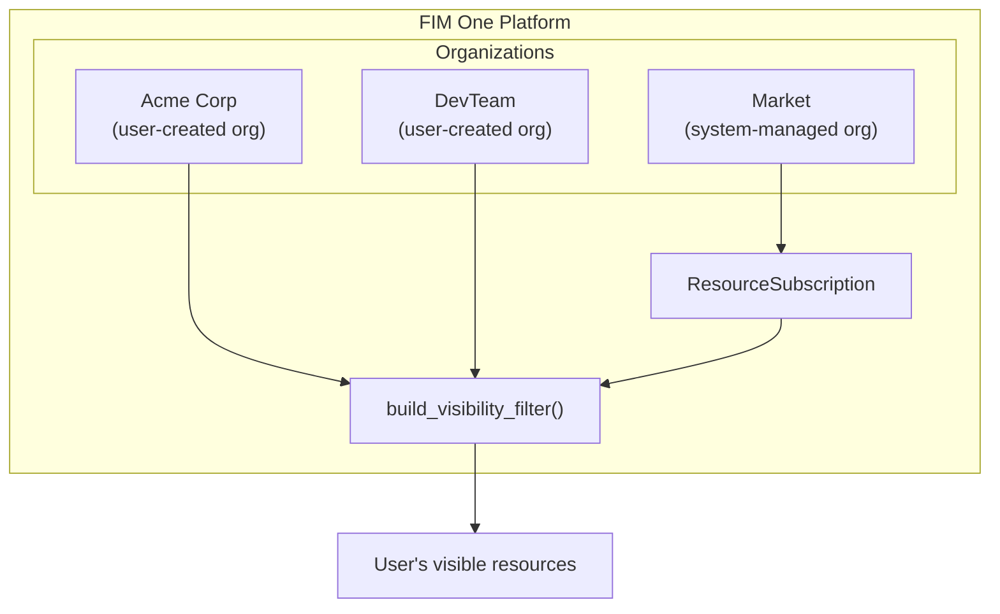
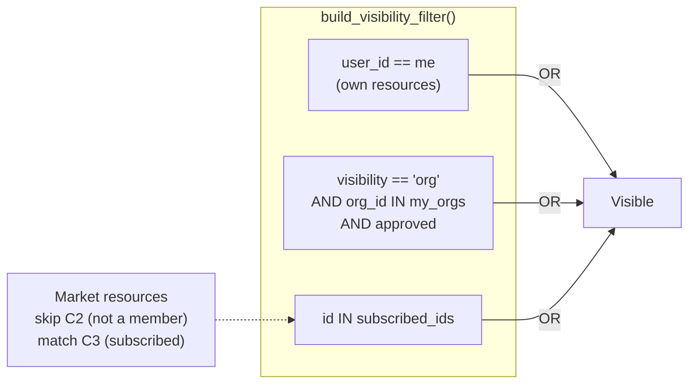
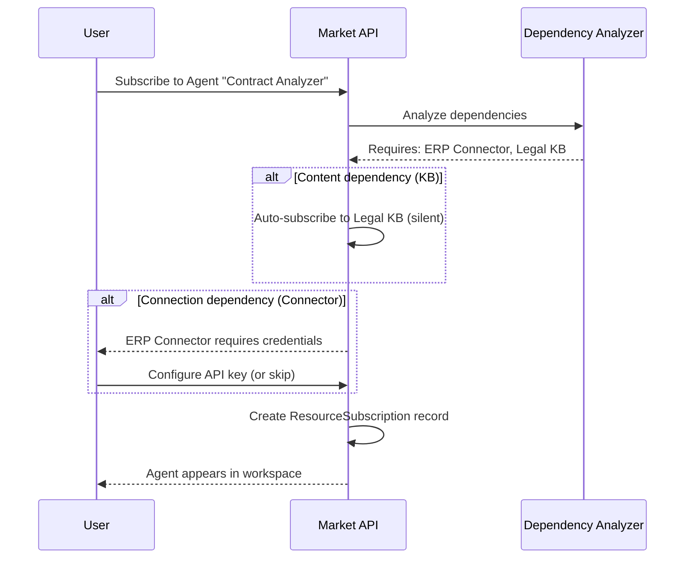
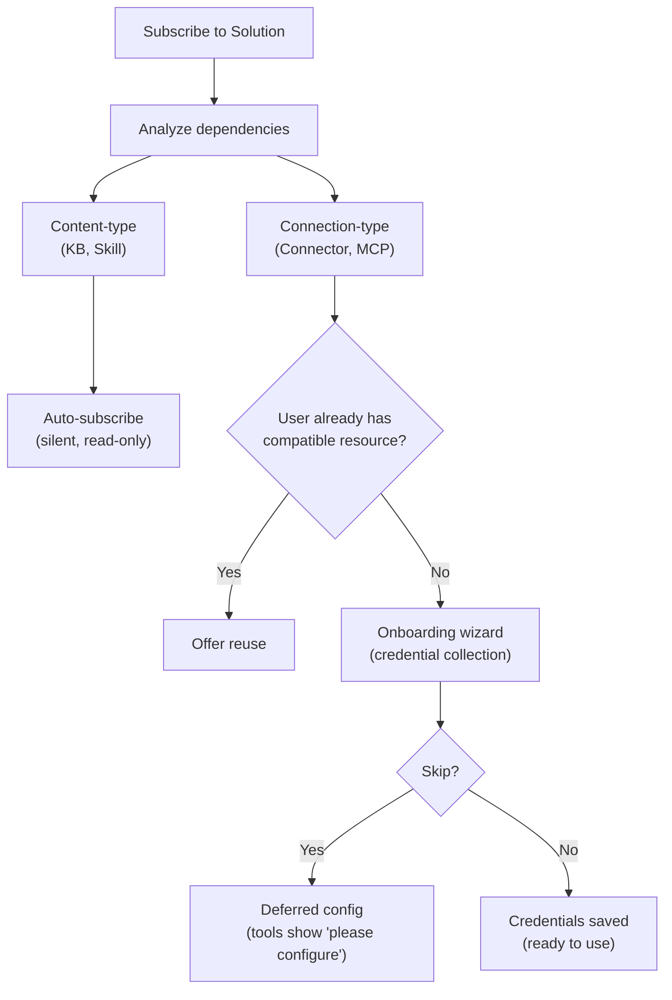

## Overview

The Market is FIM One's resource marketplace. Users publish resources they have built, others discover and subscribe to them, and subscribed resources appear in the subscriber's workspace as if they were their own. The entire system is built on a single architectural insight: **the Market is an organization** — a system-managed shadow org with special trust rules.

This page explains the Market's internal architecture. For a user-facing overview of publishing and subscribing, see [Market (Features)](/concepts/market). For how subscribed resources are loaded into tool sets, see [Agent & Resource Discovery](/architecture/agent-discovery).

## Two-tier classification

The Market organizes resources into two categories based on what the resource does, not how it is implemented.

### Solutions

Solutions are things that **do work for you**. A user subscribes to a Solution and gets a ready-to-use capability.

| Resource Type | What It Does |
|---|---|
| **Agent** | A conversational AI assistant with bound tools, knowledge, and instructions |
| **Skill** | A global SOP (Standard Operating Procedure) that can orchestrate multiple agents via `call_agent` |
| **Workflow** | A DAG-based automation flow with visual editing and deterministic execution |

Solutions may depend on other resources. An Agent might require a specific Connector for its API calls and a Knowledge Base for its retrieval pipeline. The Market handles these dependencies automatically during subscription (see [Dependency resolution](#dependency-resolution) below).

### Components

Components are **reusable building blocks** for developers. They provide capabilities that Solutions consume.

| Resource Type | What It Does |
|---|---|
| **Connector** | An API or database integration adapter definition |
| **MCP Server** | A tool service configuration using the Model Context Protocol |

Components are simpler to subscribe to — they have no internal dependencies, only credential requirements.

### Why Knowledge Bases are not listed independently

Knowledge Bases are not published as standalone Market resources. They are internal dependencies of Solutions — an Agent's retrieval pipeline or a Skill's reference material. When a user subscribes to a Solution that depends on a Knowledge Base, the KB is auto-included as a read-only reference. The subscriber never needs to find, evaluate, or manage KBs separately.

<Info>
The two-tier classification (Solutions vs. Components) is a **display-layer concept**. It is derived from `resource_type` at query time, not stored as a separate field. The underlying subscription mechanism, visibility filter, and review process are identical for all resource types.
</Info>

## Unified architecture

### Market as a shadow organization

The Market's most important architectural decision is that it is not a separate subsystem. It is an **organization** — a system-managed org with a fixed ID (`MARKET_ORG_ID`), created automatically during platform initialization.

This means:

- **The same visibility filter** (`build_visibility_filter()`) handles personal, org, and Market resources in a single query. No special-case code for Market lookups.
- **The same subscription mechanism** (`ResourceSubscription`) applies to both org and Market resources. Subscribing to an org resource and subscribing to a Market resource create the same record.
- **The same credential handling** (fallback, per-user override) works in both contexts. The `allow_fallback` flag on Connectors and MCP Servers behaves identically regardless of source.
- **The same review process** (`apply_publish_status()`) handles both org-level and Market-level review. The only difference is that the Market org has all review flags locked to `true`.

The key distinction between a regular organization and the Market organization:

| Aspect | Organization | Market |
|---|---|---|
| **Trust model** | High trust (team membership) | No trust assumed (global community) |
| **Review** | Optional per resource type | Always mandatory for all types |
| **Access** | Automatic for all members | Requires explicit subscription |
| **Scope** | Team or company | Global |

<Tip>
Because the Market is just an organization with special rules, any feature built for organizations — review workflows, credential management, resource lifecycle — automatically works for the Market with zero additional implementation.
</Tip>

### How the visibility filter handles it

Nobody holds membership in the Market org. Users do not "join" the Market — they subscribe to individual resources. This means `MARKET_ORG_ID` is never present in a user's `user_org_ids` list, and the org-membership visibility condition is naturally skipped for Market resources.

Instead, subscribed Market resources flow through the `subscribed_ids` path in `build_visibility_filter()`:

This three-condition OR clause is the entire visibility model. Personal resources, org-shared resources, and Market-subscribed resources are resolved in one query, with no branching logic for different resource origins.

### Scope-based browsing

The Market page provides a **scope selector** that switches between two browsing contexts:

| Scope | What It Shows | Who Reviews |
|---|---|---|
| **Global Market** | Resources published by anyone to the Market org | Platform administrators |
| **Organization: [name]** | Resources published by members of a specific org | Org administrators |

The same UI, the same tabs (Solutions / Components), and the same subscription flow apply in both scopes. Switching scope only changes the `org_id` filter in the browse query. From the user's perspective, the experience is identical — they are browsing a catalog and choosing what to install.

## Subscription flow

### Browsing and discovery

Users browse the Market through a paginated catalog. Each resource displays its name, description, icon, publisher username, and a subscribe button. Resources the user has already subscribed to are marked accordingly. The browse API (`GET /api/market`) excludes the user's own resources — you cannot subscribe to something you published.

### Subscribing to a Solution

Subscribing to a Solution (Agent, Skill, or Workflow) involves dependency analysis:

1. The system analyzes the Solution's dependencies — which Connectors, Knowledge Bases, MCP Servers, and Skills it requires.
2. **Content-type dependencies** (KB, Skill) are auto-subscribed silently. The user does not see or manage these.
3. **Connection-type dependencies** (Connector, MCP Server) are listed as requirements. An onboarding wizard collects credentials.
4. The `ResourceSubscription` record is created, and the resource appears in the user's visibility filter.

### Subscribing to a Component

Components (Connectors and MCP Servers) have a simpler flow — no dependency analysis is needed. The user subscribes, optionally configures credentials, and the component is ready to use.

### Credential configuration

Credentials follow a **hybrid model** that balances convenience with flexibility:

- **Offered during subscription.** When a connection-type dependency requires credentials, the onboarding wizard presents the credential form immediately.
- **Skippable.** The user can choose "Skip, configure later." The resource is subscribed but tools requiring those credentials return a "please configure your credentials" message when invoked.
- **Deferred configuration.** Users can configure or update credentials at any time from their settings page.

This is the same `allow_fallback` mechanism used in organizations. If the publisher has enabled fallback and set a default credential, subscribers can use the resource immediately without providing their own key. If fallback is disabled, each subscriber must bring their own.

<Warning>
When using a Market resource with credential fallback enabled, your API requests flow through the publisher's credentials. For sensitive operations, consider providing your own credentials or verifying the publisher's trustworthiness.
</Warning>

### Unsubscribing

Unsubscribing removes the `ResourceSubscription` record. The resource disappears from the user's visibility filter and is no longer loaded into tool sets. For Solutions with auto-subscribed dependencies, the dependent resources (KBs, Skills) are cleaned up as well. User-configured credentials for the resource are removed.

## Dependency resolution

When a Solution is published or subscribed to, the system analyzes its dependency tree. Dependencies fall into two categories with different handling strategies.

### Content-type dependencies

**Knowledge Bases** and **Skills** referenced by a Solution are content-type dependencies. They provide read-only data — retrieval documents, SOP procedures — that the Solution consumes.

- **On subscription:** auto-subscribed silently. The user does not see a separate subscription step for each KB or Skill.
- **Access model:** read-only reference to the original author's resource. The subscriber cannot modify the content.
- **On unsubscription:** cleaned up automatically when the parent Solution is unsubscribed.

### Connection-type dependencies

**Connectors** and **MCP Servers** referenced by a Solution are connection-type dependencies. They require credentials to function.

- **On subscription:** listed as requirements in the onboarding wizard. The user is prompted to configure credentials (or skip).
- **Smart matching:** if the user already has a compatible Connector (same type, same base URL), the system offers to reuse it instead of creating a new subscription.
- **On unsubscription:** the subscription is removed, but user-created credentials are preserved (the user may use the same Connector elsewhere).

## Publishing

### Publishing a Solution

When an author publishes an Agent, Skill, or Workflow to the Market:

1. The system sets `visibility: "org"` and `org_id: MARKET_ORG_ID` on the resource.
2. The system analyzes the Solution's dependencies and builds a manifest — listing required Connectors, KBs, and MCP Servers.
3. The manifest is shown to the author for confirmation.
4. `apply_publish_status()` sets the resource to `pending_review` (the Market org has all review flags locked to `true`).
5. A system administrator reviews and approves or rejects the resource.

### Publishing a Component

Publishing a Connector or MCP Server is simpler:

1. The system sets visibility and org_id as above.
2. Credential schema is extracted (what fields subscribers need to fill in).
3. The resource enters `pending_review` and awaits admin approval.

### Review process

The review process is the same mechanism used by organizations, with one critical difference:

| Context | Review Required? | Who Reviews |
|---|---|---|
| **Organization** | Configurable per resource type (`review_agents`, `review_connectors`, etc.) | Org admins |
| **Market** | Always required for all resource types | Platform admins (Market org owner) |

The Market org is initialized with all six review flags set to `true`, and this configuration cannot be changed. Every resource published to the Market must pass admin review before it becomes visible in the browse catalog.

<Note>
Org owners bypass review automatically — their published resources are immediately available. For the Market, only the Market org owner (the system administrator) has this bypass privilege.
</Note>

When an approved resource is edited by its author, `check_edit_revert()` automatically reverts the `publish_status` to `pending_review`. This ensures that changes to live Market resources are re-reviewed before becoming visible to subscribers.

## Implementation notes

### The shadow org

The Market organization has a well-known fixed ID (`00000000-0000-0000-0000-000000000001`) and slug (`market`). It is created by `ensure_market_org()` during platform initialization — typically on the first admin user's login. The function is idempotent; calling it multiple times is safe.

### ResourceSubscription

The `ResourceSubscription` table is the core data structure for Market access:

| Column | Purpose |
|---|---|
| `user_id` | The subscriber |
| `resource_type` | `agent`, `connector`, `knowledge_base`, `mcp_server`, `skill`, or `workflow` |
| `resource_id` | The subscribed resource's ID |
| `org_id` | The source org (Market org ID or a regular org ID) |

A unique constraint on `(user_id, resource_type, resource_id)` prevents duplicate subscriptions. The `org_id` column tracks where the subscription came from, enabling scope-aware unsubscription.

### Visibility filter integration

The `resolve_visibility()` function performs two lookups in a single call:

1. Fetches the user's org memberships (`user_org_ids`)
2. Fetches the user's subscriptions (`subscribed_ids`)

These are passed to `build_visibility_filter()`, which produces a single SQL WHERE clause combining all three visibility tiers (own, org-shared, subscribed). This function is used everywhere resources are queried — agent lists, connector dropdowns, skill injection, auto-discovery mode — ensuring consistent visibility across the entire platform.

### Credential encryption

Credentials configured during subscription (or later in settings) are encrypted at rest using the platform's encryption key. The Market API never exposes credential values in browse responses — only metadata (name, description, icon, type) is returned in the `_*_market_info()` helper functions.

## See also

- [Organization & Market](/architecture/organization) -- organization-level sharing and trust model
- [Agent & Resource Discovery](/architecture/agent-discovery) -- how subscribed resources are loaded into tool sets
- [Connector Architecture](/architecture/connector-architecture) -- connector design, auth injection, and audit
- [System Overview](/architecture/system-overview) -- the unified tool abstraction that all resources converge into
