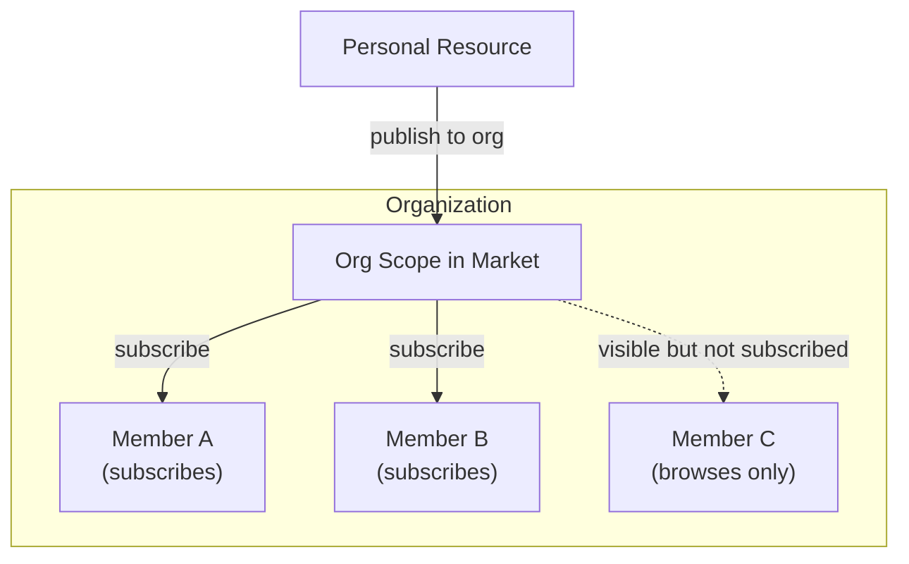
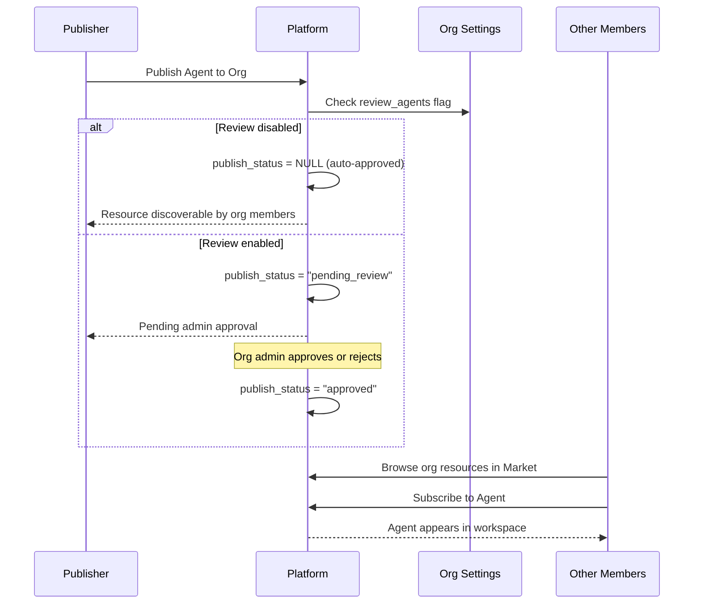
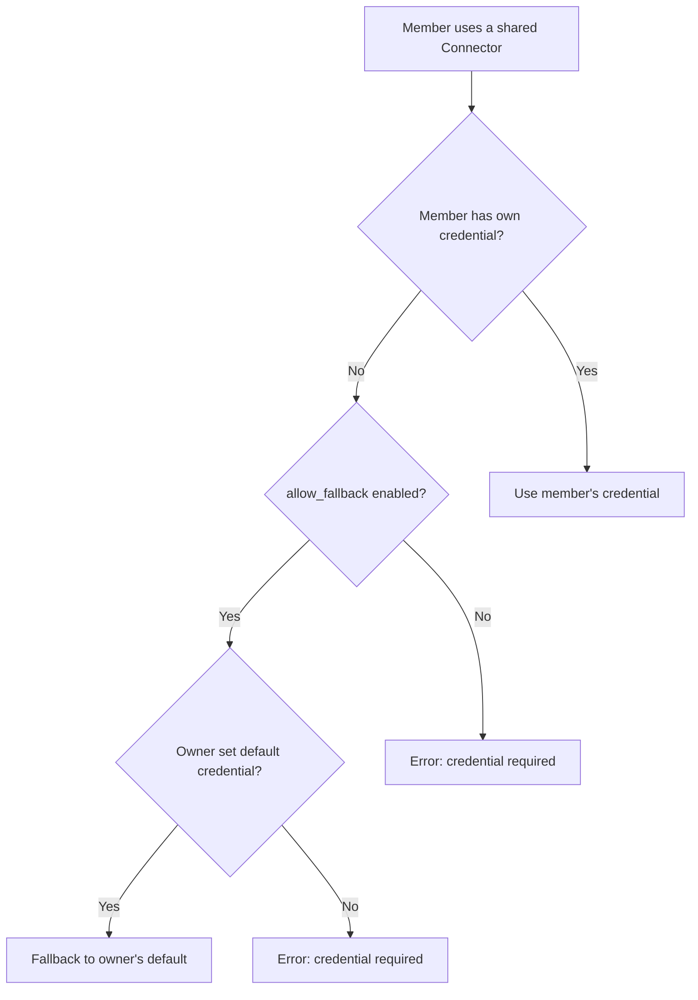
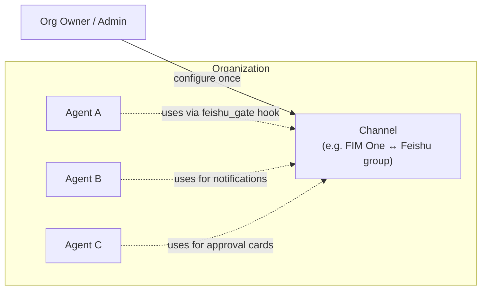

## Overview

Organizations are FIM One's unit for team collaboration. They let groups of users share resources — Agents, Connectors, Knowledge Bases, MCP Servers, Workflows, and Skills — within a trusted scope.

Every resource in FIM One starts as **personal** (visible only to its creator). When you publish a resource to an organization, it becomes **discoverable** by other org members through the Market's organization scope. Members browse the org's shared resources and subscribe to the ones they need.



Organizations and the global Market share the same subscription-based access model. The key difference is trust: organizations represent a team or company where members know and trust each other, so review is optional and credential sharing is straightforward.

## Creating and Managing Organizations

Every user can create **unlimited** organizations and join any number of them. An organization has three roles:

| Role | Permissions |
|---|---|
| **Owner** | Full control — manage members, configure settings, bypass review |
| **Admin** | Manage members and review published resources |
| **Member** | Browse and subscribe to shared resources |

The owner is always the user who created the organization. Ownership can be transferred but not shared.

## Publishing Resources

When you publish a resource to your organization, it does **not** automatically appear in every member's workspace. Instead, the resource becomes discoverable in the Market's organization scope, where members can browse and subscribe to it.

This subscription-based model gives each member control over their workspace. A large organization might share dozens of Connectors, but an individual member only subscribes to the ones relevant to their work.



### Review System

Review is **optional** and configured per resource type. Each organization has independent toggle flags:

- `review_agents`
- `review_connectors`
- `review_kbs`
- `review_mcp_servers`
- `review_workflows`
- `review_skills`

When review is disabled for a resource type, published resources are immediately discoverable by members — no admin action needed. When review is enabled, resources enter a `pending_review` state and require admin approval before they become visible.

<Tip>
Organization owners bypass review automatically. Their published resources are always immediately discoverable.
</Tip>

This flexibility lets organizations match their governance needs. A small startup might disable all review toggles for frictionless sharing, while a compliance-focused enterprise enables review on Agents and Connectors to maintain oversight.

## Credential Fallback

Connectors and MCP Servers often require credentials (API keys, database passwords, OAuth tokens). FIM One provides a **fallback mechanism** so that members don't have to configure every credential themselves.



There are two modes:

- **Fallback enabled** (`allow_fallback=true`, the default): Members who don't provide their own credentials automatically use the owner's default credentials. This works well for team-shared API keys or internal services where a single key covers the whole team.
- **Fallback disabled** (`allow_fallback=false`): Every member must configure their own credentials. This is appropriate when each user needs a personal API key (for example, per-seat SaaS licenses).

Resources that don't require credentials — such as a read-only public API connector or an Agent with no authentication — work immediately after subscription. No configuration needed.

<Info>
Credential fallback only applies after a member subscribes to the resource. The fallback mechanism determines how credentials are resolved at runtime, not whether the resource is accessible.
</Info>

## Resource Visibility

Every resource in FIM One has a `visibility` that determines its access scope:

| Visibility | Scope | Who Can Discover It |
|---|---|---|
| `personal` | Owner only | The user who created it |
| `org` | Organization | Org members can browse and subscribe (if approved) |

The visibility filter follows a unified query pattern:

```
A resource is available in your workspace if:
  1. You own it (any visibility), OR
  2. It's published to an org you belong to, approved, AND you've subscribed to it
```

<Warning>
Publishing a resource to an organization does not grant automatic access. Members must subscribe through the Market's org scope to add the resource to their workspace.
</Warning>

## Infrastructure Resources (org-wide, no subscription)

A second class of org-scoped resource does **not** follow the personal → publish → subscribe lifecycle above. These are **configured once by an Org Owner or Admin** and then transparently available to every agent in the org:

| Resource | Purpose | Configured by | Consumed by |
|---|---|---|---|
| **Channels** | Outbound bridge to an IM platform (Feishu today; Slack / WeCom / Teams planned) | Org Owner / Admin | Every agent's [Hook System](/architecture/hook-system) and proactive-notification tools |
| **OAuth Providers** | Social-login credentials (GitHub, Google, Feishu, Discord) | System admin (env vars) | Sign-in page |
| **API Keys** | Programmatic access tokens for headless clients | Each user, org-scoped | External integrations |



The key distinction: **publishable resources** (Agents, Connectors, KBs, …) are per-user artifacts that need explicit member subscription; **infrastructure resources** (Channels, OAuth, API keys) are platform-level wiring that all agents share implicitly. Channels specifically are the IM hotline for the whole org — one well-maintained Feishu channel backs every agent's approval gate, every scheduled report, every escalation event.

See [Channels overview](/configuration/channels/overview) for the channel lifecycle and supported platforms.

## Practical Scenarios

### Team Sharing a Database Connector

1. Alice creates a Connector to the team's PostgreSQL database
2. Alice publishes it to her team's org (review is disabled for connectors)
3. The Connector becomes discoverable in the org scope of the Market
4. Bob browses the org's shared resources, finds the Connector, and subscribes
5. The Connector appears in Bob's workspace, using Alice's database credentials as fallback
6. Carol subscribes too. Dave (an external contractor) subscribes and configures his own read-only credentials instead

### Organization with Strict Review

1. A compliance-focused company enables `review_agents=true` and `review_connectors=true` on their org
2. When an employee publishes a new Agent, it enters `pending_review` state
3. An org admin reviews the Agent configuration and approves it
4. The Agent becomes discoverable — other members can now find and subscribe to it
5. If the publisher later edits the approved Agent, it automatically reverts to `pending_review` for re-approval

### Selective Subscription in a Large Organization

1. An organization publishes 50+ Connectors covering internal APIs, databases, and third-party services
2. The data team subscribes only to database Connectors and analytics APIs
3. The marketing team subscribes only to the CRM and email platform Connectors
4. Each team member's workspace stays focused and uncluttered

## See Also

- [Market Architecture](/concepts/market) — For the global Market and how it relates to organizations. Both use the same subscription model, but the Market serves as the cross-organization discovery channel with mandatory review.
- [Agent & Resource Discovery](/architecture/agent-discovery) — How subscribed resources are assembled into tool sets during chat.
