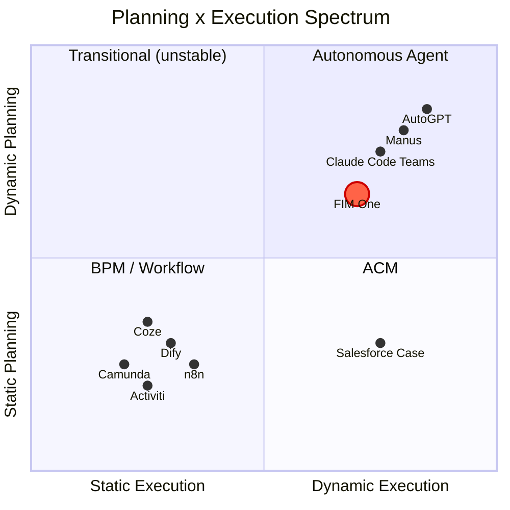
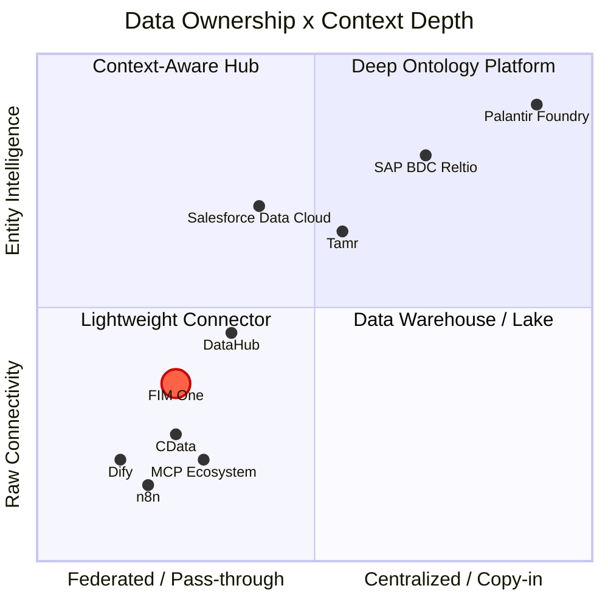

## Why dynamic planning is the hard middle ground

The AI agent landscape split into two camps, and both picked the easy path. Traditional workflow engines -- Dify, n8n, Coze -- chose static orchestration: visual drag-and-drop flowcharts with fixed execution paths. This was not ignorance; enterprise customers demand determinism (same input, stable output), and static graphs deliver that. On the other extreme, fully autonomous agents (AutoGPT and its descendants) promised end-to-end autonomy but proved impractical: unreliable task decomposition, runaway token costs, and behavior nobody could predict or debug.

The sweet spot is narrow but real. Simple tasks do not need a planner. Tasks complex enough to require dozens of interdependent steps overwhelm current LLMs. But in between lies a rich class of problems -- tasks with clear parallel subtasks that are tedious to hard-code yet tractable for an LLM to decompose. Dynamic DAG planning targets exactly this zone: the model proposes the execution graph at runtime, the framework validates the structure and runs it with maximum concurrency. No drag-and-drop, no YOLO autonomy.

## The bet on improving models

Every few months the foundation shifts -- GPT-4, function calling, Claude 3, the MCP protocol. Building a rigid abstraction on shifting ground is risky; LangChain's over-abstraction is the cautionary tale everyone in this space has internalized. FIM One takes the opposite approach: **minimal abstraction, maximum extensibility**. The framework owns orchestration, concurrency, and observability. The intelligence comes from the model, and the model keeps getting better.

Today, LLM task decomposition accuracy sits around 70-80% for non-trivial goals. When that reaches 90%+, the "sweet spot" for dynamic planning expands dramatically -- problems that were too complex yesterday become tractable tomorrow. FIM One's DAG framework is designed to capture that expanding value without rewriting the plumbing.

## Will ReAct and DAG planning become obsolete?

ReAct will not disappear -- it will sink into the model. Consider the analogy: you do not hand-write TCP handshakes, but TCP did not go away; it got absorbed into the operating system. When models are strong enough, the think-act-observe loop becomes implicit behavior inside the model, not explicit framework code. This is already happening: Claude Code is essentially a ReAct agent where the loop is driven by the model itself, not by an external harness.

DAG planning's lasting value is not "helping dumb models decompose tasks" -- it is **concurrent scheduling**. Even with infinitely capable models, physics imposes latency: a serial chain of 10 LLM calls takes 10x longer than 3 parallel waves. DAG is an engineering problem (how to run things fast and reliably), not an intelligence problem (how to decide what to run). Retry logic, cost control, timeout management, observability -- these do not go away when models get smarter.

The endgame: **models own the "what" (planning intelligence internalizes into the model), frameworks own the "how" (concurrency, retry, monitoring, cost governance)**. A framework's lasting value is not intelligence -- it is governance.

## Why not mirror Dify's workflow editor

A natural question: if DAG covers the flexible case, shouldn't we also build a static workflow editor for the deterministic case?

No. The reasoning:

1. **The workflows already exist elsewhere.** Government and enterprise clients' fixed processes live in their OA, ERP, and legacy systems. They don't want to rebuild those flows in yet another platform -- they want AI that can connect to the systems where those flows already run. The Connector Platform (v0.6) solves this directly.

2. **Existing capabilities compose into fixed pipelines.** Scheduled Jobs (v1.0) trigger a DAG agent with a fixed prompt; the DAG dynamically plans the steps; Connectors (v0.6) connect to the target systems. The combination is equivalent to a static pipeline -- but more flexible, because the LLM can adjust its plan based on the data it encounters. No separate pipeline DSL needed.

3. **Investment mismatch.** A production-quality visual workflow editor (canvas, node types, variable passing, debug/replay) is months of dedicated effort. The result would be a low-fidelity copy of what Dify's 120K-star community already maintains. That effort is better spent on the Connector architecture -- a capability no competitor offers.

The strategic bet: **don't compete on workflow visualization; compete on being the hub where systems meet AI**. Let Dify own "build AI workflows visually." FIM One owns "the hub where your systems meet AI."

## Where FIM One stands

FIM One is not an "AGI task scheduler" and not a static workflow engine. It occupies the middle ground: planning capability with constraints, concurrency with observability.

- Compared to **Dify**: more flexible -- runtime DAG generation vs. design-time flowcharts. You do not need to anticipate every execution path in advance. Does not compete on visual workflow editing; competes on legacy system integration.
- Compared to **AutoGPT**: more controlled -- bounded iterations, re-planning limits, with human-in-the-loop on the roadmap. Autonomy within guardrails.

The strategy is straightforward: build the orchestration framework now, and let improving models fill it with capability over time.

## Where FIM One Sits: Planning x Execution Spectrum

The AI execution landscape can be mapped on two axes -- how plans are created (static vs dynamic) and how they are executed (rigid vs adaptive):

**Why Dify/n8n are Static Planning + Static Execution**: The DAG is drawn by a human on a visual canvas at design time. Each node executes a fixed operation (an LLM call with a fixed prompt, an HTTP request, a code block). There is no runtime replanning -- if a step fails, the workflow fails or follows a pre-wired error branch. This is structurally the same as BPM, just with AI nodes in the graph.

**FIM One's position: Dynamic Planning + Dynamic Execution**

- **DAG topology is generated by LLM at runtime** (dynamic planning) -- no human designs the graph
- **Each DAG node runs a full ReAct loop** (dynamic execution) -- nodes reason, use tools, and adapt
- **Re-planning mechanism** (execute → analyze → re-plan if unsatisfied)
- But bounded: max 3 re-plan rounds, token budgets, human confirmation gates

This places FIM One in the same quadrant as AutoGPT, but with engineering constraints that prevent runaway behavior. More flexible than BPM/Dify, more controlled than AutoGPT.

## Concept Glossary

For readers unfamiliar with the terminology used in this document:

| Term | One-line explanation | Relation to FIM One |
|------|---------------------|----------------------|
| **BPM** (Business Process Management) | Processes fully fixed at design time, executed rigidly. Camunda, Activiti. | FIM One is **not** BPM. No fixed process engine. |
| **FSM** (Finite State Machine) | System is in exactly one state at any time; events trigger transitions. Supports loops (reject → resubmit). | Target systems (ERP, contract systems) use FSM internally. FIM One **doesn't need** its own FSM -- it calls the target system's API. |
| **ACM** (Adaptive Case Management) | Skeleton static, branches dynamic. Main flow pre-defined, each node adapts at runtime. | FIM One's DAG + ReAct naturally falls in this quadrant. |
| **HTN** (Hierarchical Task Network) | Recursive task decomposition: high-level → subtasks → atomic operations. | DAG re-planning covers most scenarios; full HTN not needed yet. |
| **iPaaS** (Integration Platform as a Service) | Cloud integration platform connecting multiple SaaS/on-prem systems. MuleSoft, Zapier. | FIM One's Hub Mode is like **AI-native iPaaS** -- natural language drives cross-system integration. |
| **MDM** (Master Data Management) | Deduplicates and unifies entity records across systems into a "golden record." Reltio, Informatica, Tamr. | FIM One **connects to** MDM systems; it does not replicate entity resolution. |
| **Context Layer / System of Context** | Unified entity + relationship graph that gives AI agents trusted business context. Term popularized by Reltio (2026). | FIM One delegates this to upstream MDM/data platforms. Skills provide lightweight aggregation for common cases. |

## Architecture Boundary: FIM One Does Not Replicate Workflow Logic

Complex business processes (approval chains, transfers, rejections, escalation, co-signing, countersigning) are the **target system's responsibility**. These systems spent years building this logic -- ERP, OA, contract management systems all have mature state machines.

From the Connector's perspective:

| Operation | What the Connector does |
|-----------|------------------------|
| Transfer | Call one API, pass target person |
| Reject | Call one API, pass rejection reason |
| Escalate | Call one API, pass escalation person list |
| Co-sign | Call one API, pass co-signer list |

Every complex workflow operation collapses to an HTTP request with parameters. FIM One calls the API; the target system manages the state machine.

This is a **deliberate architectural boundary**, not a capability gap. Duplicating workflow logic that already exists in target systems would:
1. Create maintenance burden (two state machines to keep in sync)
2. Add failure modes (what if they disagree?)
3. Provide zero additional value (the target system already does this correctly)

The connector pattern is simple by design: **one operation = one API call**.

## Architecture Boundary: Connector Layer, Not Context Layer

Enterprise AI is converging on a layered architecture for agent context:

| Layer | What it does | Representative players |
|-------|-------------|----------------------|
| **Decision Traces** | Records *why* something happened -- audit trails, lineage | Palantir Decision Lineage, Arize |
| **Entity Context** | Unified golden records + relationship graphs -- the "System of Context" | Reltio/SAP, Informatica/Salesforce, Tamr |
| **Data Connectivity** | Connects agents to source systems via APIs and protocols | **FIM One**, CData, MCP ecosystem |
| **Source Systems** | CRM, ERP, contract management, databases, SaaS apps | SAP, Salesforce, custom systems |

FIM One operates at the **data connectivity layer**. It does not attempt to build the entity context layer above it. This is a deliberate choice, not a gap.

### Industry context: the 2025-2026 consolidation

Two landmark acquisitions reshaped the enterprise AI data landscape and made the context layer a strategic battleground:

- **Salesforce acquired Informatica** (November 2025) -- adding enterprise MDM and data governance to its Data Cloud + Agentforce stack. The goal: make Agentforce agents trustworthy by grounding them in Informatica's golden records.
- **SAP announced acquisition of Reltio** (March 2026) -- adding AI-native entity resolution and relationship graphs to its Business Data Cloud (BDC). The goal: create a "System of Context" that spans SAP and non-SAP environments, serving as the trusted foundation for Joule Agents.

These moves signal that the world's largest enterprise platforms now consider unified entity context a prerequisite for reliable AI agents -- not a nice-to-have.

### Data ownership × Context depth spectrum

**Reading the chart:**

- **Bottom-left (Lightweight Connector)**: minimal data ownership, raw API connectivity. Dify, n8n, and basic MCP servers live here -- they connect to systems but don't understand entities. FIM One is in this quadrant but higher on the y-axis due to progressive-disclosure meta-tools, Skill-based context aggregation, and domain-aware escalation.
- **Top-left (Context-Aware Hub)**: federated access with entity-level understanding. Salesforce Data Cloud exemplifies this -- zero-copy federation with on-demand entity resolution. DataHub provides metadata-level context (schema, lineage, ownership) without owning business data.
- **Top-right (Deep Ontology Platform)**: full data ingestion with deep entity intelligence. SAP BDC + Reltio builds persistent multi-domain golden records with relationship graphs. Palantir goes furthest -- three-layer ontology with decision lineage.
- **Bottom-right (Data Warehouse / Lake)**: centralized data storage without entity semantics. Traditional data platforms that ingest everything but lack entity resolution or relationship modeling.

FIM One's position reflects a deliberate choice: stay federated and lightweight, but invest in making upstream entity context (from any MDM) easily accessible to agents.

### Three models for entity context

**SAP: multi-domain golden record (copy-in + govern)**

SAP is building a three-layer enterprise architecture:

| Layer | System | Role |
|-------|--------|------|
| **Transaction** | S/4HANA | Business execution -- orders, invoices, deliveries |
| **Intelligence** | Business Data Cloud (BDC) + Reltio | Semantic integration, entity resolution, relationship graphs |
| **Agent** | Joule + Joule Agents | Intent understanding, tool orchestration, autonomous execution |

Reltio sits at the heart of the intelligence layer. Its job: ingest entity data from SAP and non-SAP systems, resolve duplicates via AI-based matching, and produce **multi-domain golden records** (customer, supplier, product, patient, asset) with relationship graphs. Reltio's early adoption of the **MCP protocol** is strategically significant -- it positions golden records as directly callable by any MCP-compatible agent, not just SAP's own Joule.

SAP's bet: agents need a persistent, governed, cross-domain "single source of truth" to operate reliably in high-stakes enterprise processes.

**Salesforce: zero-copy federation (federate + resolve on demand)**

Salesforce takes a lighter approach. Data Cloud does not require physical data movement; instead it uses **zero-copy partnerships** (Databricks, Snowflake, BigQuery) to federate data in place. Entity resolution happens on demand within Data Cloud, creating unified customer profiles without a persistent golden record store.

Key numbers (Q3 FY2026): Data Cloud ingested 32 trillion records, with 15 trillion via zero-copy (341% YoY growth). This scale validates the federation model for CRM-centric use cases.

Agentforce agents are grounded in this federated context: they reason across the distributed data estate without requiring all data to land in one system. For front-office scenarios (sales, service, marketing), this is flexible and fast to deploy.

Salesforce's bet: agents don't need a heavyweight golden record store -- they need real-time access to federated, resolved context where it already lives.

**Palantir: deep ontology (the heavyweight reference)**

At the extreme end, Palantir Foundry ingests all data and builds a three-layer ontology (semantic objects + kinetic actions + dynamic rules) with full decision lineage. This is the most complete context system in production, but at $10M+ contracts and 6-18 month deployments. It serves as a reference architecture, not a realistic model for most organizations.

### Where FIM One fits

| Dimension | SAP + Reltio | Salesforce + Informatica | FIM One |
|-----------|-------------|-------------------------|---------|
| **Data philosophy** | Copy-in: ingest into BDC, build golden records | Federate: zero-copy access, resolve on demand | Pass-through: connect to source, don't store |
| **Entity resolution** | Deep -- AI-native MDM with relationship graphs | Medium -- Data Cloud entity resolution | None -- delegates to upstream MDM |
| **Agent integration** | Joule Agents + MCP | Agentforce + Data Cloud grounding | Any agent + any connector |
| **Deployment cost** | Enterprise platform pricing | Enterprise SaaS pricing | Lightweight, hours to days |
| **Lock-in** | High (BDC + S/4HANA ecosystem) | Medium (Salesforce ecosystem) | Low -- connectors are interchangeable |
| **Best fit** | Manufacturing, supply chain, life sciences (complex multi-domain) | CRM-driven enterprises (front-office focus) | Mid-market, multi-system, provider-agnostic |

FIM One aligns most closely with the **Salesforce philosophy** (don't own the data, connect to it) but without the Salesforce ecosystem dependency. The strategic position: be provider-agnostic at the connectivity layer, and let any MDM -- whether SAP/Reltio, Salesforce/Informatica, Tamr, or a custom solution -- serve as the entity context source.

### Why FIM One stays at the connector layer

Building an entity context layer requires persistent data storage, ML-based entity resolution, survivorship rules, relationship graph engines, and governance frameworks. This is a distinct product category (MDM) with decade-deep competition (Reltio, Informatica, Tamr). Attempting it would:

1. **Transform FIM One from a connector into a data platform** -- fundamentally different product, team, and go-to-market
2. **Duplicate capabilities that upstream systems already provide** -- the same anti-pattern we avoid with workflow logic
3. **Increase lock-in** -- once users store golden records in FIM One, switching costs rise dramatically

The correct strategy: **be the best ingress point for any MDM system**, not a replacement for one. FIM One should make it trivial for Reltio, Informatica, Tamr, or a custom MDM to serve entity context to agents -- via MCP Resources, connector APIs, or knowledge base injection.

### Current approach: Skills as lightweight context aggregation

For scenarios that need cross-connector context (e.g., contract review requiring supplier data + payment history + risk flags), **Skills** already provide a pragmatic solution. A Skill's SOP can orchestrate multiple connector actions in sequence, aggregate results, and present structured context to the agent -- without building a persistent entity layer.

This covers the 80% case. If demand emerges for real-time entity resolution at the connector level, the architecture leaves room for a future `ContextSource` connector type that integrates with external MDM systems -- but that is a future consideration, not a current commitment.

### The analogy

FIM One's relationship to the context layer is like SQLAlchemy's relationship to the database: it does not store or manage data, but it makes any data source accessible to the application layer. Let MDM platforms own entity resolution; let FIM One own the connection.

## Where FIM One Sits in the AI Stack

### The Layered Model

A useful mental model (credit [Phil Schmid](https://www.philschmid.de/)) maps AI systems to a four-layer stack analogous to computing hardware:

| Layer | Analogy | FIM One Component |
|-------|---------|-------------------|
| **Model** | CPU | ModelRegistry -- any OpenAI-compatible LLM |
| **Context** | RAM | ContextGuard + Memory (Window / Summary / DB) |
| **Harness** | Operating System | ReAct Agent + DAG Planner + Hooks + ToolRegistry |
| **Application** | App | Portal, Copilot, Hub API |

FIM One operates at the **harness layer** -- it does not compete with models; it makes them productive by providing the right tools, constraints, and feedback loops. The model supplies intelligence; the harness supplies governance, concurrency, and reliability.

### Three Eras of AI Engineering

The discipline has evolved through distinct phases: **Prompt Engineering** focused on crafting better instructions to elicit correct behavior from a fixed model. **Context Engineering** shifted attention to assembling the right information -- retrieving documents, injecting tool results, managing memory -- so the model has what it needs to reason well. **Harness Engineering** goes further: designing the full execution environment around the model, including deterministic guardrails, tool orchestration, feedback loops, and cost controls.

FIM One's architecture embodies harness engineering principles. Hook middleware injects deterministic constraints (rate limits, content filters, audit logging) without touching model prompts. ContextGuard manages what enters the context window and when. Dynamic tool selection (progressive-disclosure meta-tools) keeps the tool surface tractable as connector count grows. The ReAct loop's self-reflection mechanism and the DAG planner's re-plan cycle provide structured feedback that improves execution quality without requiring a more capable model.
