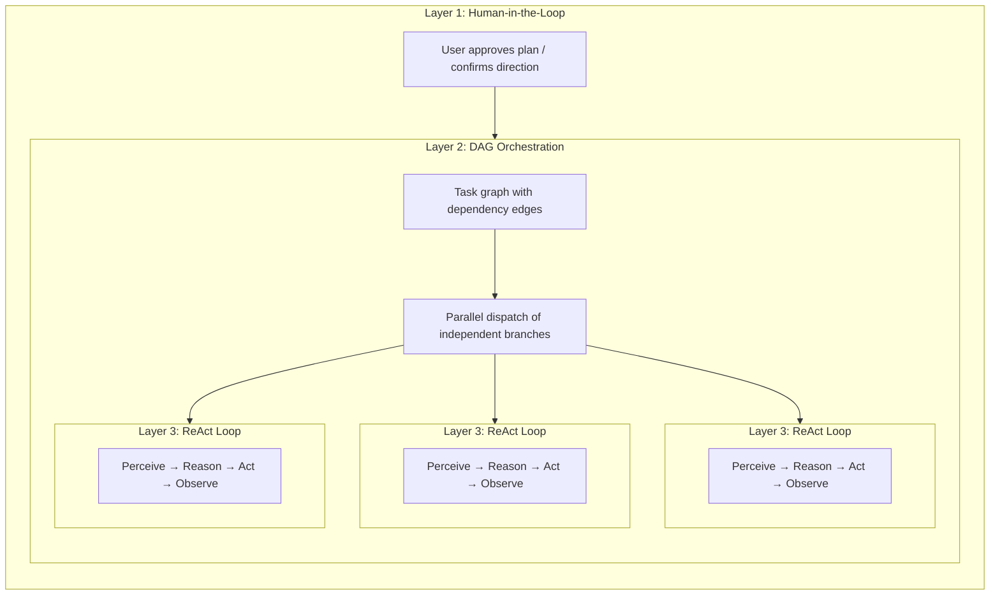

## Five kinds of "planning" in the AI tooling landscape

The word "planning" is overloaded. At least five distinct approaches exist today, and they solve different problems:

| Approach | Plan format | Execution | Approval | Core value |
|---|---|---|---|---|
| **Implicit model planning** | Internal chain-of-thought | Single inference pass | None | The model thinks through steps on its own |
| **Claude Code plan mode** | Markdown document | Serial | Human reviews before execution | Align on approach before touching code |
| **Claude Code Teams** | Task list with dependency edges | **Concurrent** (multi-agent) | Human approves plan, then autonomous | Dynamic agent pool + parallel execution |
| **Kiro spec-driven dev** | Structured spec (requirements + design + tasks) | Serial | Human reviews spec | Traceable requirements, acceptance criteria |
| **FIM Agent DAG** | JSON dependency graph | **Concurrent** (single orchestrator) | Automatic (PlanAnalyzer) | Parallel execution + runtime scheduling |

The first two are **design-time** planning — they produce a plan *before* work begins, and a human (or the model itself) follows it step by step. The last three introduce **runtime** planning — execution graphs are generated and scheduled programmatically, with independent branches running in parallel. The difference is *who* executes: Claude Code Teams spawns autonomous agents; FIM Agent DAG dispatches steps within a single orchestrator.

These approaches are not competitors; they are complementary layers. A Kiro-style spec can define *what* to build, while a FIM Agent DAG can schedule *how* to execute the subtasks concurrently. Claude Code's plan mode ensures a human agrees with the approach; FIM Agent's PlanAnalyzer verifies the outcome automatically.

## Three-Layer Nesting: The Full-Power Architecture

Both Claude Code Teams and FIM Agent DAG, at full capacity, exhibit a **three-layer nested architecture**:

- **Layer 1 — Human gate**: User reviews the plan and approves before execution begins.
- **Layer 2 — DAG orchestration**: The approved plan is decomposed into tasks with dependency edges. Independent tasks run in parallel; downstream tasks wait for their blockers to resolve.
- **Layer 3 — ReAct inner loop**: Each task is executed by an agent running a full ReAct cycle (Perceive → Reason → Act → Observe), capable of multi-step reasoning, tool use, and autonomous retry.

The key insight: **Claude Code Teams and FIM Agent DAG implement the same three layers, just with different Layer 2 mechanics** — message-passing vs dependency-edge resolution.

## Full-Power Runtime: FIM Agent vs Claude Code Teams

Both are genuine Agents — the core loop is identical: **Perceive → Reason → Act → Feedback**. The difference lies in how they orchestrate parallel work at full capacity.

| Dimension | Claude Code Teams | FIM Agent DAG |
|---|---|---|
| **Parallel model** | Leader spawns SubAgents, assigns tasks via messages | Topological sort auto-parallelizes independent steps |
| **Task graph** | TaskList with `blockedBy` / `blocks` edges (dynamic DAG) | Static JSON DAG with `depends_on` edges |
| **Coordination** | Explicit message passing (SendMessage / Broadcast) | Implicit dependency edges — no messages, just data flow |
| **Agent lifecycle** | Dynamic pool — agents spawned on demand, shut down when done | Fixed step executors — one LLM call per step |
| **Feedback & correction** | Each SubAgent retries autonomously; Leader re-assigns on failure | PlanAnalyzer evaluates outcomes → Re-Planning loop (up to 3 rounds) |
| **Human involvement** | Plan mode approval, then autonomous execution | Fully automatic — PlanAnalyzer decides pass/replan |
| **Context management** | Each SubAgent gets isolated context window (no cross-contamination) | Shared DbMemory + LLM Compact across all steps |
| **Token economics** | `N agents × per-agent tokens` — time↓ tokens↑ (multiplicative cost) | Sequential or shallow-parallel — lower total tokens |
| **Scaling pattern** | Add more SubAgents (horizontal, message-coupled) | Add more DAG branches (horizontal, dependency-coupled) |
| **Best suited for** | Diverse, loosely-related tasks (research + code + test) | Structured workflows with clear data dependencies |

### Real-World Benchmark: v0.5 RAG System

Claude Code Teams built FIM Agent's entire v0.5 RAG subsystem in a single session:

- **8 phases**: Embedding → Reranker → Loaders → Chunking → VectorStore → Retrieval → KB Backend → Frontend + Docs
- **46 tests** passing, frontend build clean
- **Wall time**: ~5 minutes
- **Token cost**: ~100k tokens per agent task × 8+ tasks ≈ 800k+ total tokens
- **Dependency edges**: Phase 5 depends on Phase 4 + 1b; Phase 6 depends on Phase 5 + 2 + 3 — a genuine DAG

This demonstrates the core trade-off: **time parallelism at the cost of token multiplication**. Claude Code Teams trades compute dollars for developer hours.

### Converging, Not Competing

The boundary between "team collaboration" and "pipeline scheduling" is blurring:

- **Claude Code Teams' `blockedBy`/`blocks` IS a DAG** — tasks have explicit dependency edges, and the leader dispatches newly-unblocked tasks as predecessors complete. This is topological scheduling with extra steps (messages).
- **FIM Agent's DAG could benefit from agent autonomy** — instead of single LLM calls per step, letting each step run a full ReAct loop would handle complex sub-tasks better.

**Takeaway:** Same Agent essence, converging parallel philosophies. Claude Code follows a **team collaboration** model — a Leader delegates to Workers who communicate via messages. FIM Agent follows a **pipeline scheduling** model — a DAG Executor dispatches steps based on dependency resolution. In practice, both implement dependency-driven parallel execution; the difference is coordination overhead (messages vs edges) and token economics (isolated contexts vs shared memory). The optimal architecture likely combines both: DAG scheduling for structured pipelines, agent pools for tasks that need autonomous multi-step reasoning.
