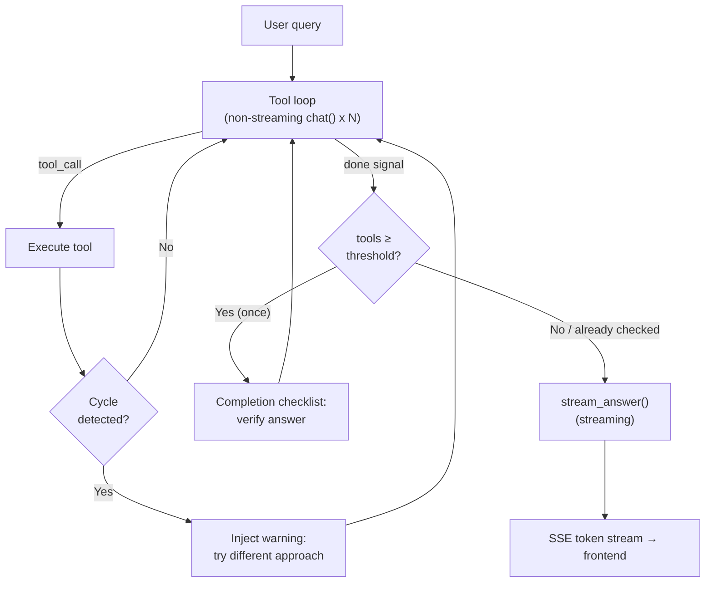
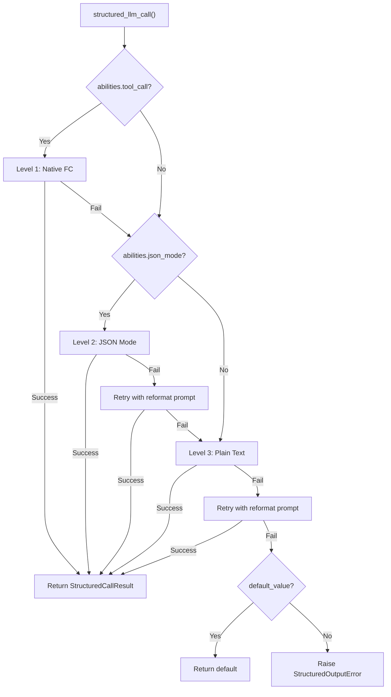
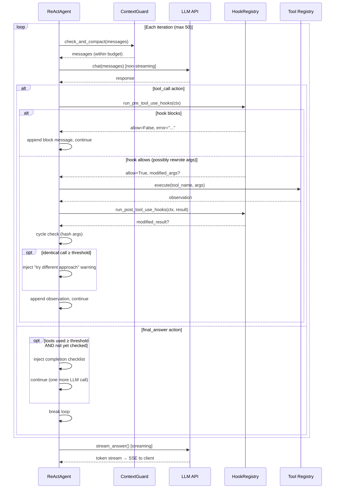
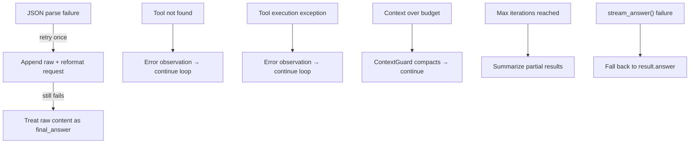
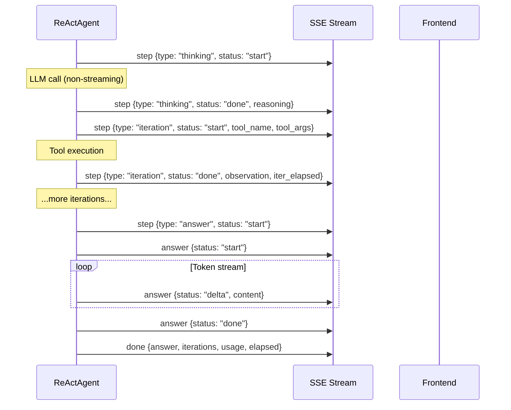

## The architecture

The ReAct engine implements a two-phase execution model. The first phase is an iterative tool-use loop: the agent repeatedly asks the LLM for an action, executes any requested tool, appends the observation, and continues until the LLM signals "done." The second phase is answer synthesis: a separate streaming LLM call that reads the full execution trace and produces the user-facing response.

This split is deliberate. Tool iterations are optimized for speed — every LLM call in the loop uses non-streaming `chat()`, because the user does not need to see partial JSON actions or intermediate reasoning tokens. Answer generation is optimized for UX — it uses streaming `stream_chat()` so the user sees tokens appearing in real time. The result is the best of both worlds: fast tool execution with responsive answer delivery.

The tool loop produces an `AgentResult` containing the full conversation history — system prompt, user query, every assistant message, every tool result. The `stream_answer()` method distills this trace into a concise, coherent answer. Tool results are truncated to 2,000 characters each in the synthesis context, keeping the prompt lean even after complex multi-tool workflows.

**Model binding.** The LLM is injected into `ReActAgent.__init__()` and stored as `self._llm`. Every call within a single `run()` invocation — all tool loop iterations and the final answer synthesis — uses this same instance. The model does not change between iterations. To use a different model, a new `ReActAgent` must be constructed. In DAG mode, `DAGExecutor._resolve_agent()` exploits this pattern: it creates a fresh agent per step (selecting the model from `ModelRegistry` based on `step.model_hint`) immediately before that step's ReAct loop begins. See [DAG Engine — Per-step override](/architecture/dag-engine#two-llm-architecture) for details.

## Dual-mode execution

The ReAct engine supports two distinct modes of interacting with the LLM during the tool loop.

**JSON Mode** (`_run_json`) embeds tool descriptions directly in the system prompt and instructs the LLM to respond with a JSON object — either a `tool_call` action with a tool name and arguments, or a `final_answer` signal. The agent parses the JSON from the response content, executes the tool, and appends the observation as a user message.

**Native Function Calling** (`_run_native`) uses the LLM provider's built-in tool-calling API. Tool descriptions are passed via the `tools` parameter, and the LLM returns structured `tool_calls` in the API response rather than emitting JSON in its content. This is the preferred mode for models that support it.

Mode selection is automatic. The property `_native_mode_active` returns `True` only when both conditions hold: the agent was created with `use_native_tools=True` (the default) and the LLM advertises `abilities["tool_call"] = True`. If either condition fails, the engine falls back to JSON mode.

| Aspect | JSON Mode | Native Function Calling |
|--------|-----------|------------------------|
| LLM output | JSON object in message content | `tool_calls` in API response |
| System prompt | Embeds full tool descriptions in text | Tools passed via `tools` parameter |
| Parallel tool calls | One tool per iteration | Multiple via `asyncio.gather` |
| Parse failure handling | Retry with reformat prompt | N/A (structured by API) |
| Loop LLM calls | Non-streaming `chat()` | Non-streaming `chat()` |
| Best for | Models without tool-call support | GPT-4, Claude, and similar |

Both modes share the same answer synthesis phase — `stream_answer()` works identically regardless of how the tool loop ran.

## structured_llm_call — unified output extraction

Any call site that needs the LLM to return data conforming to a JSON schema uses `structured_llm_call()`. This is the single entry point for structured output across the entire framework — the DAG planner, plan analyzer, tool selection, and any future component that needs parsed JSON from an LLM.

The function implements a 3-level degradation chain, attempting each level in order based on the LLM's advertised capabilities:

**Level 1: Native Function Calling.** Uses the LLM's `tool_call` / `tool_choice` API to force a structured response. Available when `abilities["tool_call"] = True`. If the LLM returns `tool_calls`, the arguments are extracted directly. If parsing fails, falls through to the next level.

**Level 2: JSON Mode.** Sets `response_format={"type": "json_object"}` to constrain the LLM's output format. Available when `abilities["json_mode"] = True`. If the response cannot be parsed, retries once with a reformat prompt ("Your previous response could not be parsed as valid JSON..."), then falls through.

**Level 3: Plain Text.** Calls the LLM with no format constraints and extracts JSON from free-form text using `extract_json()`. If extraction fails, an optional `regex_fallback` function is tried. Retries once with the reformat prompt before giving up.

The degradation chain means every model — from GPT-4 with full tool-call support to a local LLM that can only produce plain text — can participate in structured output scenarios. The worst case is 5 LLM calls (1 native + 1 JSON + 1 JSON retry + 1 plain + 1 plain retry), but in practice most calls resolve at Level 1 in a single attempt.

| Model capability | Path taken | Max LLM calls |
|-----------------|------------|---------------|
| tool_call + json_mode | L1 → L2 → L3 | 5 |
| json_mode only | L2 → L3 | 4 |
| Plain text only | L3 | 2 |

The result is a `StructuredCallResult` containing the parsed value, the raw dict, which level succeeded, and cumulative token usage. Call sites use `parse_fn` to transform the raw dict into a domain object (e.g., a DAG plan) and `default_value` to provide a fallback when total failure is acceptable.

`structured_llm_call` is used by: the DAG planner (plan schema), the plan analyzer (analysis schema), tool selection (tool list schema), and any component that needs reliable structured output. It is also discussed in [Planning Landscape](/architecture/planning-landscape).

## Tool selection

When an agent has access to many tools — common in Hub mode where multiple connectors each expose several actions — injecting every tool's full schema into the conversation context is wasteful. A connector hub with 20 tools consumes roughly 5K tokens in tool descriptions alone, crowding out space for conversation history and tool results.

The engine addresses this with a lightweight selection phase. When the total number of registered tools exceeds `TOOL_SELECTION_THRESHOLD` (12), the agent runs a preliminary LLM call before entering the main loop. This call receives a compact catalog — approximately 80 characters per tool, containing only the name and a one-line description, no parameter schemas — and picks the most relevant tools for the current query, up to `_TOOL_SELECTION_MAX` (6).

The selection uses `structured_llm_call` with a simple schema (`{"tools": ["tool_name_1", "tool_name_2"]}`), so it benefits from the same 3-level degradation. The selected tool names are used to build a filtered `ToolRegistry` that the main loop uses for both system prompt construction and tool execution.

Selection failure is deliberately non-fatal. If the LLM returns unparseable output, if all selected names are invalid, or if any exception occurs, the agent falls back to the full tool set. This ensures that a flawed selection never prevents the agent from functioning — it just uses more context than optimal.

## The iteration loop

The core loop drives both JSON mode and native mode, with minor differences in message handling. Each iteration follows the same high-level pattern: check the context budget, call the LLM, process the response, and either execute a tool or break.

**JSON mode loop.** The LLM's response is parsed via `_parse_action()`, which uses `extract_json()` to find a JSON object in the content. If parsing fails, the agent appends the raw response and a reformat request, then continues — this counts against `max_iterations`, preventing infinite retry loops. On success, the action is either a `tool_call` (execute the tool, append the observation as a user message) or a `final_answer` (break and proceed to synthesis).

**Native mode loop.** The LLM's response may contain one or more `tool_calls`. All tool calls in a single response are executed in parallel via `asyncio.gather`, and all tool result messages are appended before any other message. This ordering constraint is critical — the OpenAI API (and compatible providers) requires that `tool` messages immediately follow the `assistant` message that produced the `tool_calls`. Inserting any other message (such as a user interrupt) between them would break the protocol. When no `tool_calls` are present, the response is treated as the final answer.

**Max iterations.** The default limit is 50 iterations. If the loop exhausts this limit without producing a `final_answer`, the agent synthesizes a fallback response from the accumulated step results — a summary of which tools were called and whether they succeeded or failed. This is a safety net, not a normal exit path.

[Context Management](/architecture/context-management) explains how ContextGuard enforces the token budget on every iteration, including the hint system that tells the compaction LLM to preserve recent reasoning chains.

## Tool execution hooks

Every tool call in the iteration loop is wrapped by two hook points:

- **`PreToolUse`** — fires after the LLM picks a tool, before the tool runs. A hook can:
  - **Block** the call by returning `allow=False` (the LLM sees an observation explaining why, e.g. "waiting for human approval" or "org is in read-only mode")
  - **Rewrite** the tool arguments before execution
  - **Trigger side effects** (post a Feishu card, create an audit row, emit a metric)
- **`PostToolUse`** — fires after the tool returns, before the observation reaches the LLM. A hook can:
  - **Rewrite** the observation (e.g. truncate a 200 KB SQL result to a 4 KB summary)
  - **Trigger side effects** (write to `ConnectorCallLog`, update usage counters)

Hooks run **outside the LLM loop** — nothing the LLM says or does can skip them. This is the deterministic enforcement layer for policies that cannot be trusted to a prompt instruction: human-in-the-loop approval (`FeishuGateHook`), audit logging, rate limiting, and read-only-mode guards. See [Hook System](/architecture/hook-system) for the full design.

The same hook points exist in the [DAG engine](/architecture/dag-engine) — each DAG step runs its own ReAct loop, so hooks apply uniformly regardless of which execution engine is driving the tool call.

## Mid-loop self-reflection

Long reasoning chains (10+ tool calls) risk **goal drift** — the agent gradually shifts focus from the original objective to a local sub-problem, repeats similar actions, or enters circular retry loops. Mid-loop self-reflection is a lightweight countermeasure.

Every `_SELF_REFLECTION_INTERVAL` tool-call iterations (default: **6**), the agent injects a user message into the conversation asking the LLM to pause and reflect:

- Is it still on track toward the original goal?
- Has it been repeating similar actions or going in circles?
- What is the most direct next step to finish?
- Should it produce a final answer now?

The counter tracks **actual tool calls only** — JSON parse retries, thinking events, and interrupt injections do not count. In native mode, the reflection message is appended strictly after all `tool_result` messages to preserve the tool_use/tool_result pairing constraint.

This costs ~100 tokens per injection (no extra LLM call) and has no effect on short runs (`< 6` tool calls). It complements ContextGuard (which manages token budgets) and per-step verification (which validates individual results) by addressing a different failure mode: the agent losing sight of its goal over many iterations.

## Cycle detection

Self-reflection asks the LLM whether it is going in circles — but the LLM often answers "no" and keeps looping. Cycle detection is a deterministic alternative that cannot be bypassed.

After every tool execution, the agent hashes the `(tool_name, arguments)` pair. When the same hash appears `_CYCLE_DETECTION_THRESHOLD` times (default: **3**, configurable via `REACT_CYCLE_DETECTION_THRESHOLD`), a warning message is injected into the conversation:

> You have called `{tool}` with identical arguments N times and received the same result. Please try a different approach or tool.

The warning is a regular user message in the agent's internal history — it is not surfaced to the end user as a separate UI event. The agent sees the warning on its next LLM call and is forced to change strategy. The tracker resets at the start of each `run()` call.

Because DAG steps execute via ReActAgent, cycle detection also protects individual DAG steps from tool-call loops.

## Completion checklist

When the agent has used at least `_COMPLETION_CHECK_MIN_TOOLS` tools (default: **3**, configurable via `REACT_COMPLETION_CHECK_MIN_TOOLS`) and decides to produce a final answer, a one-time verification prompt is injected before the answer is accepted:

1. Does the answer fully address the original question?
2. Were key facts verified from tool results?
3. Are there contradictions in the gathered information?

If the agent confirms, it proceeds to final answer. If it decides something is missing, it resumes the tool-call loop. The checklist fires at most once per run and does not trigger for simple conversational responses (no tools used).

The threshold prevents unnecessary latency on simple tasks — a single tool call (e.g., running a quick calculation) does not warrant verification, while a multi-tool investigation benefits from a final sanity check. Set `REACT_COMPLETION_CHECK_MIN_TOOLS=1` for always-on verification.

The feature is enabled by default (`completion_check=True` on `ReActAgent`) and can be disabled per agent instance. DAG steps inherit the default — each step gets its own one-shot checklist.

## Answer synthesis (stream_answer)

The separation between the tool loop and answer synthesis is a core architectural decision. Tool iterations produce raw data — JSON actions, tool observations, error messages. The user needs a coherent, well-formatted answer, not a dump of the agent's internal trace.

`stream_answer()` builds a synthesis prompt from two components. The system prompt instructs the LLM to act as a synthesizer: present results directly, use markdown formatting, avoid meta-commentary ("based on the tool output..."), and match the language of the original query. The user message contains the original question and a formatted execution trace — each tool call and its result, with tool results truncated to 2,000 characters.

The synthesis call uses `stream_chat()`, yielding tokens incrementally. The web layer wraps these tokens in SSE `answer` events with `delta` status so the frontend can render them as they arrive.

If `stream_answer()` fails — network error, LLM timeout, any exception — the web layer falls back to `result.answer`, the brief text from the tool loop's final iteration. This is a degraded experience (no streaming, potentially less polished prose), but it ensures the user always gets a response.

## Interruption handling

Users can send follow-up messages while the agent is still processing. These are delivered via an `interrupt_queue` — an `InterruptQueue` registered per conversation that accumulates messages between iterations.

The drain timing differs between modes because of the tool-call ordering constraint:

- **JSON mode**: the queue is drained immediately after each assistant message, before checking whether the action is a `final_answer`. This is safe because JSON mode uses plain user/assistant messages with no structural pairing requirements.

- **Native FC mode**: the queue is drained only after tool result messages have been appended. The `tool` messages must immediately follow the `assistant` message containing `tool_calls` — inserting a user message between them would violate the API protocol and cause errors.

Injected messages are marked as `pinned=True`, ensuring they survive any subsequent compaction by ContextGuard. See [Pinned Messages](/architecture/context-management#pinned-messages) for how the pinning mechanism prevents compaction from discarding critical messages.

When a `final_answer` is pending but injected messages have arrived, the agent suppresses the final answer and continues looping so it can address the user's follow-up. Multiple injections from the same drain are combined into a single `[USER INTERRUPT]` message — this prevents the LLM from seeing a fragmented sequence of short messages and encourages it to address all follow-ups holistically.

## Error handling and fallbacks

The engine is designed to never crash on LLM or tool failures. Every error path either recovers silently or surfaces a useful message to the user.

**JSON parse failure.** When the LLM returns non-JSON content in JSON mode, `_parse_action()` wraps it as a `final_answer` with the reasoning `"(could not parse LLM output as JSON)"`. The loop detects this sentinel, appends the raw content and a reformat instruction, and continues. If the retry also fails, the raw content becomes the answer — imperfect, but not a crash.

**Tool errors.** Both "tool not found" and "tool execution exception" produce error observations that are appended to the conversation. The LLM sees the error on the next iteration and can decide whether to retry with different arguments or move on. This makes the agent self-healing for transient tool failures.

**Extended thinking.** Models like DeepSeek R1 return reasoning content in a separate `reasoning_content` field rather than in the JSON body. The engine checks for this and uses it as a fallback when the JSON `reasoning` field is empty.

**Rich content.** When a tool produces HTML or markdown artifacts, the observation sent to the LLM is replaced with a short summary (`"[Artifact generated: filename] The content is rendered as a preview in the UI..."`). This prevents the LLM from echoing large HTML blobs in its final answer — a common failure mode where the model helpfully pastes back the entire tool output.

## SSE event protocol

The web layer translates the agent's iteration callbacks into Server-Sent Events for the frontend. Events are emitted on two SSE channels: `step` for the tool loop, and `answer` for the synthesis phase.

| Event | Channel | Payload | When |
|-------|---------|---------|------|
| Thinking start | `step` | `{type: "thinking", status: "start", iteration}` | Before each LLM call |
| Thinking done | `step` | `{type: "thinking", status: "done", iteration, reasoning}` | After LLM responds, before tool execution |
| Iteration start | `step` | `{type: "iteration", status: "start", iteration, tool_name, tool_args}` | Tool execution begins |
| Iteration done | `step` | `{type: "iteration", status: "done", iteration, tool_name, observation, error, iter_elapsed}` | Tool execution completes |
| Answer signal | `step` | `{type: "answer", status: "start"}` | Agent signals final_answer |
| Answer start | `answer` | `{status: "start"}` | Synthesis streaming begins |
| Answer delta | `answer` | `{status: "delta", content}` | Each streamed token |
| Answer done | `answer` | `{status: "done"}` | Synthesis streaming completes |
| Compact | `compact` | `{original_messages, kept_messages}` | Context was compacted on load |
| Phase | `phase` | `{phase: "selecting_tools", total_tools}` | Tool selection phase active |
| Inject | `inject` | `{type: "inject", content}` | User interrupt received |
| Done | `done` | `{answer, iterations, usage, elapsed}` | Final result payload |

The frontend uses `step` events to render the collapsible tool-call cards (showing which tool is running, its arguments, and the observation), the `answer` deltas to stream the response text, and `compact` to display the context-summarization divider. The `done` event carries the complete metadata — total iterations, token usage, and elapsed time — for the response footer.
