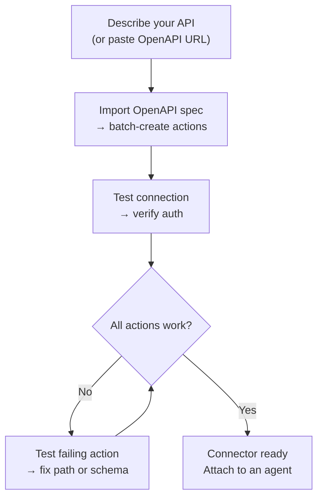
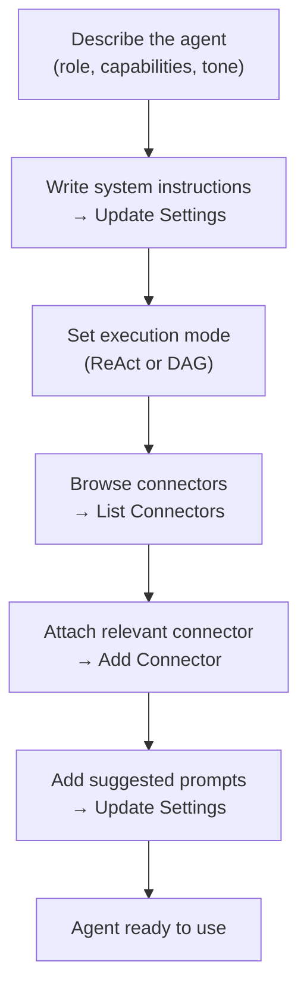

## Overview

AI Builder lets you describe what you need in plain language and have an AI agent configure it for you. It works in two modes:

| Mode | How it works | Best for |
|------|-------------|---------|
| **Quick suggestions** | A single LLM call generates the configuration | Rapid first draft, simple APIs |
| **Advanced builder** | A ReAct agent uses tools in a loop to build, test, and refine | Complex APIs, OpenAPI import, iterative refinement |

You can switch between modes at any point. The quick mode creates a starting point; the advanced builder lets you iterate.

---

## Connector Builder

A **Connector** defines how FIM Agent talks to an external system — its base URL, authentication, and the specific API actions it exposes. The Connector Builder gives an AI agent 9 tools to build and manage this configuration on your behalf.

### Tools

| Tool | What it does |
|------|-------------|
| **Get Settings** | Read the current connector config (URL, auth type, auth config) |
| **Update Settings** | Change the connector name, base URL, or auth credentials |
| **List Actions** | See all existing API actions with their methods and paths |
| **Create Action** | Add a new API endpoint — HTTP method, path, parameters, body template |
| **Update Action** | Modify an existing action (description, schema, response extraction) |
| **Delete Action** | Remove an action that is no longer needed |
| **Test Action** | Send a live HTTP request for any action and inspect the response |
| **Test Connection** | Verify the base URL is reachable and the credentials are accepted |
| **Import OpenAPI** | Batch-import up to 50 endpoints from a Swagger 2.x or OpenAPI 3.x spec |

### Typical workflow

The most common pattern: paste an OpenAPI URL and let the builder do the rest.

**Example prompt:**
> "Import the OpenAPI spec from `https://api.acme.com/openapi.json`, then test the `GET /orders` endpoint with `order_id=12345`."

The builder fetches the spec, creates all actions automatically, fires a test request, and reports the result — all without you touching a form.

---

## Agent Builder

An **Agent** is a named AI persona with a set of instructions, tools, and (optionally) connectors. The Agent Builder gives an AI agent 6 tools to configure another agent from scratch.

### Tools

| Tool | What it does |
|------|-------------|
| **Get Settings** | Read the current agent config (instructions, execution mode, tools, model) |
| **Update Settings** | Change name, description, system prompt, execution mode, or suggested prompts |
| **List Connectors** | Browse all available connectors (attached and unattached) |
| **Add Connector** | Attach a connector so the agent can call its actions as tools |
| **Remove Connector** | Detach a connector (the connector itself is not deleted) |
| **Set Model** | Switch the underlying LLM, or tune temperature and max tokens |

### Typical workflow

Start with a description and let the builder configure the whole agent:

**Example prompt:**
> "Create a Finance Copilot. It should answer questions about orders and invoices using the Acme connector. Use ReAct mode and add 3 suggested prompts for common questions."

The builder reads the current settings, writes a system prompt, attaches the connector, sets the execution mode, and adds suggested prompts — in a single conversation turn.

---

## How it works

Under the hood, both builders share the same infrastructure as regular agents:

| Builder mode | Mechanism |
|-------------|-----------|
| **Quick suggestions** | A single LLM inference call generates the full configuration as structured JSON |
| **Advanced builder** | A ReAct agent loop: Reason → call a builder tool → observe the result → decide next step |

The advanced builder is a full ReAct agent that happens to have a restricted toolset — only the 9 Connector or 6 Agent builder tools, no web or computation tools. It reads the current state of the target resource, plans what needs to change, calls the appropriate tools, and verifies the result before declaring it done.

This means the advanced builder can handle ambiguity: if the OpenAPI import creates 30 actions but only 5 are relevant, you can tell it "keep only the order-related endpoints" and it will delete the rest.
