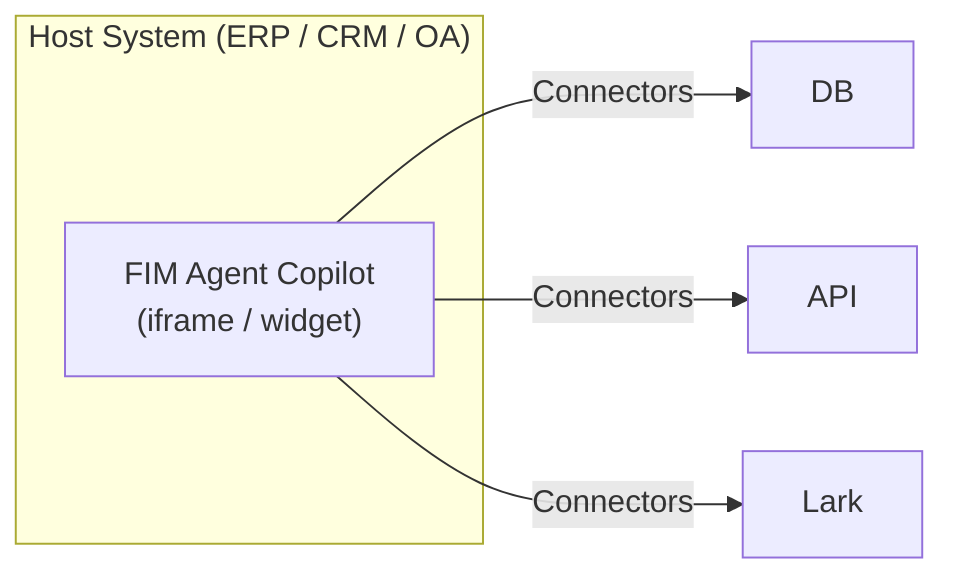
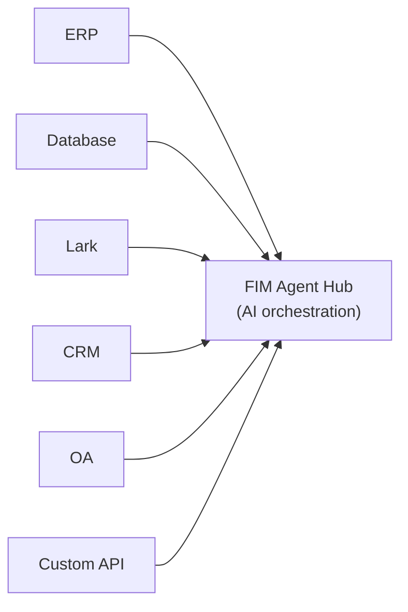
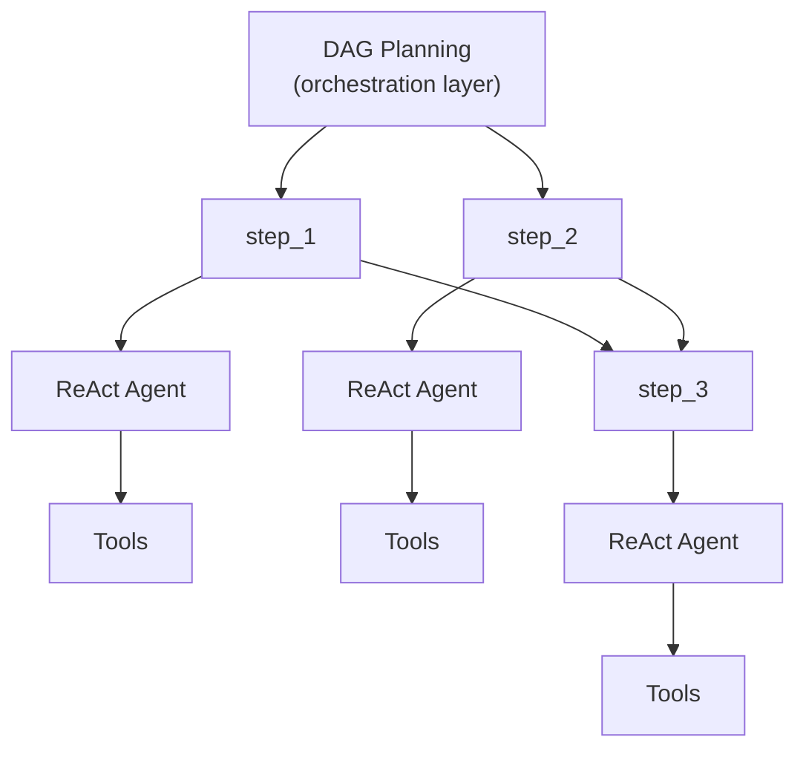

## Three modes

FIM Agent operates in three modes, determined by how the agent is deployed and used:

| Mode | What it is | Delivery | Example |
|------|-----------|----------|---------|
| **Standalone** | General-purpose AI assistant | Portal | Chat, search, code execution, knowledge base Q&A |
| **Copilot** | AI embedded in a host system | iframe / widget / embed | "Finance Copilot" embedded in ERP web UI |
| **Hub** | Central cross-system orchestration | Portal / API | Agent queries ERP, checks OA approvals, notifies via Lark |

The progression is natural: start standalone, embed into a host system as a Copilot, then set up a Hub for cross-system orchestration. The Copilot keeps running embedded; the Hub adds a central orchestration layer.

## Mode details

### Standalone (0 connectors)

The default mode. FIM Agent works as a full-featured AI assistant:

- Built-in tools: web search, Python execution, calculator, file operations, shell commands
- Knowledge base with RAG (PDF, DOCX, Markdown, HTML, CSV)
- Dynamic DAG planning for complex multi-step tasks
- Real-time streaming with DAG visualization

No external system access needed. Useful for general analysis, research, and code tasks.

### Copilot (embedded)

Embed FIM Agent into a host system's web UI. The agent works alongside users in their familiar interface — no context switching required. Copilot mode can use multiple connectors (e.g., the host system's DB + a notification service).

Examples:
- **Finance Copilot**: Connected to Kingdee (金蝶) via DB connector → query financial statements, generate analysis reports
- **Contract Copilot**: Connected to contract management system via API connector → search contracts, extract clauses, assess risk
- **HR Copilot**: Connected to HR system via API connector → query employee info, generate statistics

The agent uses the same ReAct/DAG engine as Standalone mode, but now has access to real business data through the connector.

### Hub (central orchestration)

The Hub is a standalone portal (or API) that serves as the central intelligence layer. It's not embedded in any single system — instead, it connects to all of them. Users access it through the Portal UI or API.

Examples:
- "Check overdue contracts in CRM, cross-reference with ERP payments, notify finance team on Lark"
- "When OA approval completes, update contract status in CRM and log to audit database"
- "Query sales data from Salesforce, generate forecast using business DB, email summary to management"

Each connector is an independent bridge. Adding or removing one doesn't affect the others.

## Delivery methods

| Delivery | Description | Typical mode |
|----------|-------------|-------------|
| **Portal (Web UI)** | Built-in Next.js interface | Standalone, Hub |
| **API (headless)** | HTTP/SSE endpoints (`/api/execute`, `/api/stream`) | Hub (programmatic access) |
| **iframe / Embed** | Injected into host system pages | Copilot |

Delivery and mode are related but not locked: you can access a Hub via API, or use a standalone agent through the Portal. But the typical pattern is Portal for Hub, embed for Copilot.

## Execution engines (internal implementation)

Under the hood, FIM Agent provides two execution engines:

| Engine | Best for | How it works |
|--------|----------|-------------|
| **ReAct** | Single complex queries | Reason → Act → Observe loop with tools |
| **DAG Planning** | Multi-step parallel tasks | LLM generates dependency graph, independent steps run concurrently |

ReAct is the atomic unit; DAG is the orchestration layer. Both engines work in all three modes (Standalone, Copilot, Hub). In Hub mode, a single DAG step might call connectors to different systems.

## Why no traditional workflow engine

FIM Agent deliberately does **not** build a drag-and-drop workflow editor. This is a strategic choice:

1. **Workflows already exist elsewhere.** Enterprise clients' fixed processes (approval chains, audit flows) live in their OA, ERP, and legacy systems. They need AI that connects to those systems, not another workflow editor.

2. **Dynamic DAG covers the flexible case.** For tasks not pre-defined, LLM-generated DAGs adapt at runtime — no human pre-design required.

3. **Existing capabilities compose into fixed pipelines.** Scheduled Jobs (planned) trigger a DAG agent with a fixed prompt; the DAG plans the steps; Connectors bridge to target systems. The combination equals a static pipeline — but more flexible, because the LLM adjusts its plan based on data it encounters.

4. **Connector = API call.** Complex workflow operations (transfer, reject, escalate) are the target system's responsibility. From the connector's perspective, each operation is just an HTTP request with parameters. FIM Agent calls the API; the target system manages the state machine.
