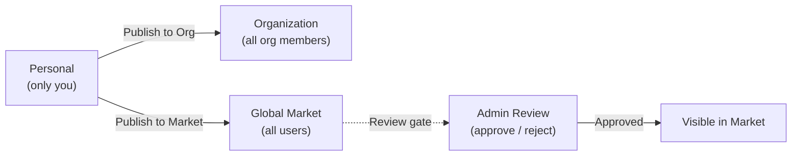

The Market is FIM One's built-in resource marketplace. It organizes shared resources into two tiers:

- **Solutions** -- high-level resources that deliver end-to-end capabilities: Agents, Skills, and Workflows.
- **Components** -- building blocks that Solutions depend on: Connectors and MCP Servers.

You browse by scope (your Organization or the Global Market), find what you need, subscribe, and start using it -- all without leaving FIM One.

<Info>
The Market uses a **pull model**: resources are discovered by browsing and explicitly subscribed to. There is no auto-join or push mechanism -- you choose what to install, and you can filter by scope at any time.
</Info>

## What Can I Find?

### Solutions

Solutions are complete, ready-to-use capabilities that you can subscribe to and immediately put to work.

| Resource | Category | What you get |
|---|---|---|
| **Agent** | Solution | A specialist AI assistant with bound tools and knowledge |
| **Skill** | Solution | A global SOP injected into system prompts, can orchestrate agents |
| **Workflow** | Solution | A DAG automation flow for scheduled or triggered execution |

### Components

Components are the integrations and tool services that Solutions are built from.

| Resource | Category | What you get |
|---|---|---|
| **Connector** | Component | API/database integration available as agent tools |
| **MCP Server** | Component | Third-party tool service loaded into sessions |

<Tip>
Knowledge Bases are not listed independently in the Market. They are included as internal dependencies when you subscribe to a Solution that uses them.
</Tip>

## Scope

The Market has a scope selector at the top of the page. The UI and subscription flow are identical in both scopes -- only the visibility of resources changes.

- **Organization** -- resources shared within your team or company. Publishing here does not require review.
- **Global Market** -- resources from the entire FIM One community. Publishing here requires admin approval.

Switch between scopes at any time to explore what is available.

## How Do I Subscribe?

When you find a resource you want, click **Subscribe**. An onboarding wizard walks you through any required setup -- for example, entering API credentials for a Connector. You can skip the wizard and configure credentials later if you prefer.

Once subscribed:

- **Agents** appear in your Agent selector and in the `call_agent` catalog.
- **Skills** are injected into your system prompts automatically.
- **Workflows** appear in your Workflow list, ready to run.
- **Connectors** appear in your tool set and Agent binding dropdowns.
- **MCP Servers** load their tools into your sessions.

If a Solution depends on Components (e.g., an Agent that uses specific Connectors), those dependencies are resolved automatically during subscription. You will be prompted for any required credentials.

Subscriptions are instant -- no approval needed from the publisher. Unsubscribe at any time to remove the resource from your workspace.

## How Do I Publish?

Any resource owner can publish to make their resource discoverable. Publishing can target either your Organization or the Global Market.

| Target | Who can see it | Review required? |
|---|---|---|
| **Organization** | All members of your org | No (org-level trust) |
| **Global Market** | All authenticated users | Yes -- admin approval required |

Publishing to the Global Market always goes through a review gate. Admins can approve, reject (with a note), or leave the resource pending. Rejected resources can be revised and resubmitted.

## What About Credentials?

When you subscribe to a resource that requires credentials (API keys, OAuth tokens, database passwords), the onboarding wizard collects them during subscription. Credentials are stored securely and scoped to your account -- no one else can see them.

You can update or rotate credentials at any time from the resource's settings page.

## How It Integrates

Under the hood, the Market is implemented as a **shadow organization** -- an invisible system org that holds no members. Resources published to the Global Market are set to `visibility: "org"` within this shadow org, which allows the existing visibility system to include them naturally.

This means the Market requires **zero special-case code** in the tool assembly pipeline. The same three-tier visibility filter (own -> org-shared -> subscribed) that loads personal and org resources also loads Market resources. When you subscribe, a subscription record is created, and the resource appears in your visibility filter automatically.

For Solutions that bundle dependencies (e.g., an Agent with bound Connectors and Knowledge Bases), the subscription process resolves and provisions those dependencies so everything works out of the box.

For technical details on how the visibility filter works across all resource types, see [Agent & Resource Discovery -- Visibility Model](/architecture/agent-discovery#visibility-model).
