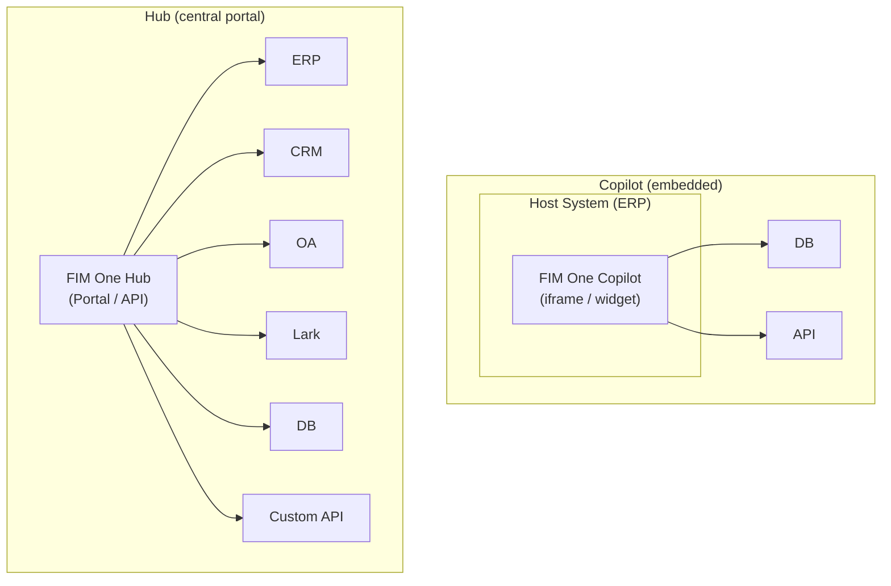
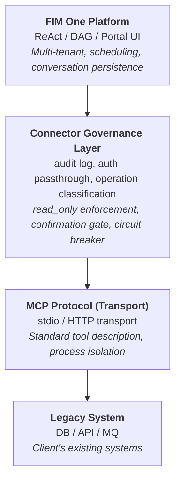
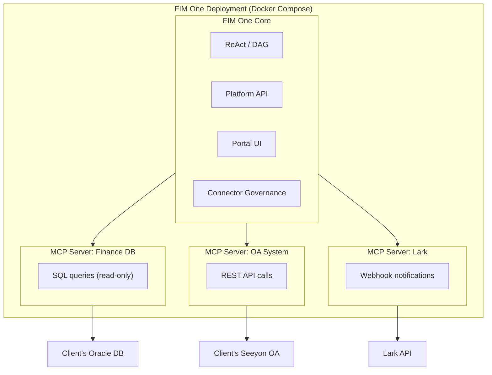
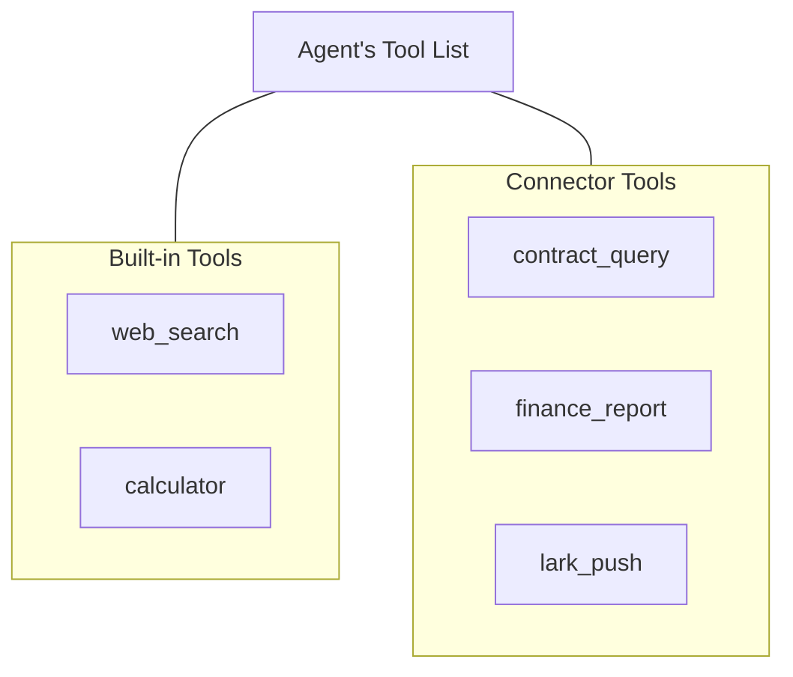
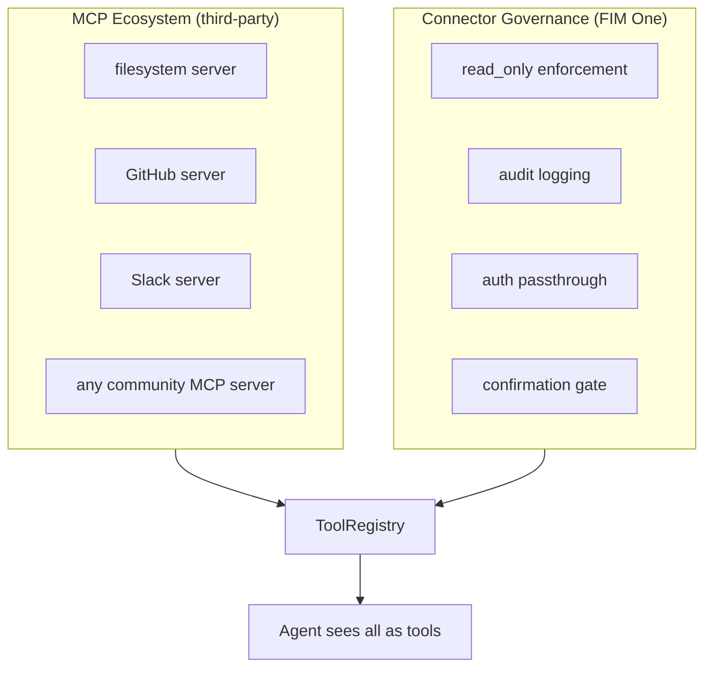

## Copilot vs Hub

Die Architektur unterstützt zwei Integrationsskalen:



**Copilot** wird in die Benutzeroberfläche eines Host-Systems eingebettet. Benutzer interagieren mit KI, ohne ihre vertraute Schnittstelle zu verlassen. Es kann mehrere Konnektoren verwenden (Host-DB + Benachrichtigungsdienst usw.).

**Hub** ist ein eigenständiges Portal, das alle Systeme verbindet. Es ist nicht in ein einzelnes System eingebettet – es ist die zentrale Intelligenzschicht, in der Systeme auf KI treffen.

Gleiche Konnektor-Architektur, unterschiedliche Bereitstellung. Ein Copilot verwendet denselben `ConnectorToolAdapter` wie ein Hub.

## Kernprinzip

**Der Client ändert keinen Code.** FIM One integriert sich proaktiv in ihre Systeme – liest ihre Datenbanken, ruft ihre APIs auf, sendet an ihren Message Bus. Der Client stellt nur Anmeldedaten und Netzwerkzugriff bereit.

## Three-Layer Architecture



Jede Schicht hat eine eigene Verantwortung:

| Schicht | Verantwortlich für | Änderungen wenn... |
|---|---|---|
| **Plattform** | Orchestrierung, Multi-Mandanten, UI | Neue Plattformfunktionen werden veröffentlicht |
| **Connector Governance Layer** | Enterprise-Governance-Richtlinien | Sicherheits-/Compliance-Anforderungen ändern sich |
| **MCP Protocol** | Transport, Tool-Interface-Standard | Nie (offener Standard) |
| **Legacy System** | Geschäftsdaten und Logik | Nie (das ist genau der Sinn) |

## Warum MCP als Transportschicht

Adapter werden als **MCP Server** implementiert. Dies ist eine bewusste architektonische Entscheidung:

- **Wiederverwendung**: FIM One wird bereits mit einem MCP Client (v0.3) ausgeliefert. Das Hinzufügen eines Legacy-System-Adapters nutzt dieselbe Infrastruktur wie das Hinzufügen eines beliebigen MCP Tools.
- **Standardprotokoll**: MCP ist ein offener Standard. Kein proprietäres Protokoll, das erfunden oder gepflegt werden muss.
- **Ökosystem**: MCP Server von Drittanbietern (Datenbanken, APIs, SaaS-Tools) funktionieren sofort.
- **Prozessisolation**: Jeder MCP Server läuft als separater Prozess. Ein fehlerhafter Adapter kann die Plattform nicht zum Absturz bringen.

### Was MCP allein nicht bietet

Die **Connector Governance Layer** fügt Enterprise-Governance hinzu, die rohes MCP nicht hat:

| Concern | MCP | Connector Governance Layer |
|---|---|---|
| Read-only enforcement | Nein | `read_only` Flag bei Operationen; Schreibvorgänge standardmäßig blockiert |
| Audit logging | Nein | Jeder Tool-Aufruf wird protokolliert (Zeitstempel, Benutzer, Tool, Parameter, Ergebnis) |
| Auth passthrough | Nein | Proxy Host-System-Authentifizierung; Agent handelt im Namen des angemeldeten Benutzers |
| Confirmation gate | Nein | Schreibvorgänge erfordern menschliche Genehmigung (SSE `confirmation_required`) |
| Circuit breaker | Nein | Verbindungsfehler löst ordnungsgemäße Verschlechterung aus |
| Operation classification | Nein | Operationen gekennzeichnet als read/write/admin mit Richtlinien pro Ebene |

### Warum nicht ein benutzerdefiniertes Protokoll erfinden

Protokolle sind Standardware. Der technische Wert liegt in den Adaptern selbst (Domänenwissen, Schema-Mapping, Behandlung von Spezialfällen) und der Governance-Schicht (Audit, Authentifizierung, Sicherheit). Die Erfindung eines Transport-Protokolls würde Wartungskosten verursachen, ohne zusätzliche Funktionalität zu bieten. Stripe nutzt HTTPS; Docker nutzt cgroups; FIM One nutzt MCP.

## Bereitstellungsmodell

Alles läuft in einer einzelnen Docker Compose-Bereitstellung. Der Client installiert nichts.



<Note>
Alles wird von FIM One bereitgestellt. Der Client stellt nur folgende Informationen bereit:
- Datenbankzugangsdaten (Lesekonto empfohlen)
- API-Endpunkte und Schlüssel (falls verfügbar)
- Netzwerk-Whitelist-Zugriff
</Note>

**Zugriffshierarchie**: FIM One passt sich an jeden Zugriff an, den der Client bereitstellen kann:

| Was der Client hat | Wie FIM One sich verbindet |
|---|---|
| API mit Dokumentation | HTTP-API-Adapter (bester Fall) |
| API ohne Dokumentation | HTTP-API-Adapter + manuelle Schema-Zuordnung |
| Nur Datenbankzugriff | Datenbankadapter (direkte SQL, standardmäßig schreibgeschützt) |
| Datenbank + Message Bus | Datenbankadapter + Message-Push-Adapter |

## Agent-Connector-Entkopplung

Der Agent sieht Konnektoren als gewöhnliche Tools. Er weiß nicht und kümmert sich nicht darum, ob ein Tool integriert, ein MCP Server von Drittanbietern oder ein Legacy-System-Konnektor ist.



Dies bedeutet:

- **Hinzufügen** eines neuen Systems = Hinzufügen einer Konnektor-Konfiguration. Der Agent-Code ändert sich nicht.
- **Entfernen** eines Konnektors = Entfernen der Konfiguration. Keine Code-Änderungen.
- Der gleiche Agent kann integrierte Tools und Konnektoren in einer einzelnen Aufgabe verwenden.

## Hot-Plug Evolution

| Version | So fügen Sie einen neuen Connector hinzu | Neustart erforderlich? |
|---|---|---|
| **v0.6** | Schreiben Sie einen Python MCP Server mit Connector Governance Layer, fügen Sie zu docker-compose hinzu | Erneute Bereitstellung |
| **v0.8** | Schreiben Sie eine YAML/JSON-Konfiguration, Plattform generiert MCP Server | Neustart |
| **v1.0** | Laden Sie OpenAPI-Spezifikation hoch, KI generiert Konfiguration automatisch | **Kein Neustart (Hot-Plug)** |

Enterprise-Bereitstellungen sind „einmal implementieren, monatelang ausführen" – Hot-Plug ist eine v1.0-Annehmlichkeit, keine v0.6-Anforderung.

## Datenfluss-Beispiel

Benutzer: "Überprüfe alle überfälligen Verträge aus dem Finanzsystem und sende eine Zusammenfassung an Lark."

```
1. Benutzer sendet Nachricht über Portal / API

2. FIM One (ReAct-Modus):
   Think: Ich muss die Finanz-DB nach überfälligen Verträgen abfragen und dann an Lark senden.

3. Act: contract_query(status="overdue", days_past_due=">30")
   → Connector Governance: Audit-Protokoll, read_only-Überprüfung (bestanden)
   → MCP Server: übersetzt zu SQL
   → Client DB: SELECT * FROM contracts WHERE status='overdue' AND ...
   ← Gibt 7 überfällige Verträge zurück

4. Think: 7 überfällige Verträge gefunden. Ich werde eine Zusammenfassung erstellen und senden.

5. Act: lark_push(message="7 überfällige Verträge gefunden: ...")
   → Connector Governance: Audit-Protokoll, Schreiboperation → Bestätigungstor
   → Benutzer genehmigt über Portal
   → MCP Server: POST an Lark-Webhook
   ← Push erfolgreich

6. Antwort: "7 überfällige Verträge gefunden. Zusammenfassung an Lark-Gruppe gesendet."
```

## Connector-Standardisierungsstufen

| Stufe | Version | Ansatz | Wer erstellt es |
|---|---|---|---|
| **Stufe 1** | v0.6 | Python MCP Server mit Connector Governance | FIM One Entwickler |
| **Stufe 2** | v0.8 | YAML/JSON-Konfiguration, Plattform generiert MCP Server automatisch | Implementierungsingenieur (kein Python erforderlich) |
| **Stufe 3** | v1.0 | OpenAPI/Swagger-Spezifikation hochladen, KI generiert Konfiguration | KI (mit menschlicher Überprüfung) |

## Beziehung zum bestehenden MCP-Ökosystem

Der MCP-Client von FIM One (ab v0.3) unterstützt bereits MCP-Server von Drittanbietern. Legacy-System-Adapter sind einfach **domänenspezifische MCP-Server**, die mit der Connector Governance Layer für Enterprise-Governance erstellt werden.



Die Connector Governance Layer ersetzt MCP nicht – sie erweitert MCP um die Governance-Schicht, die die Enterprise-Integration von Legacy-Systemen erfordert.
