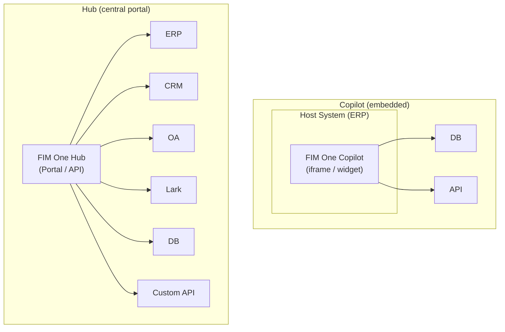
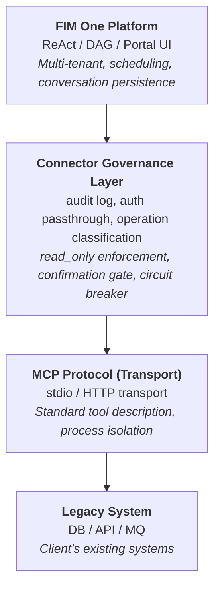
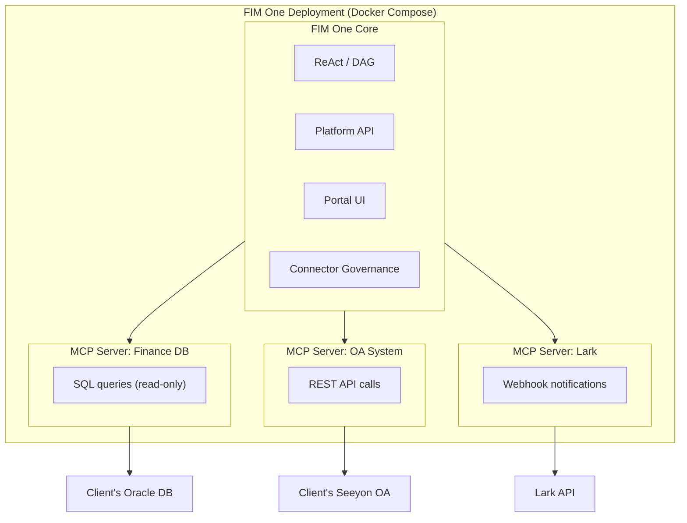
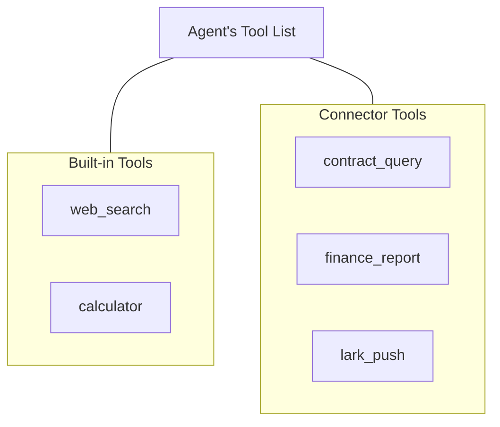
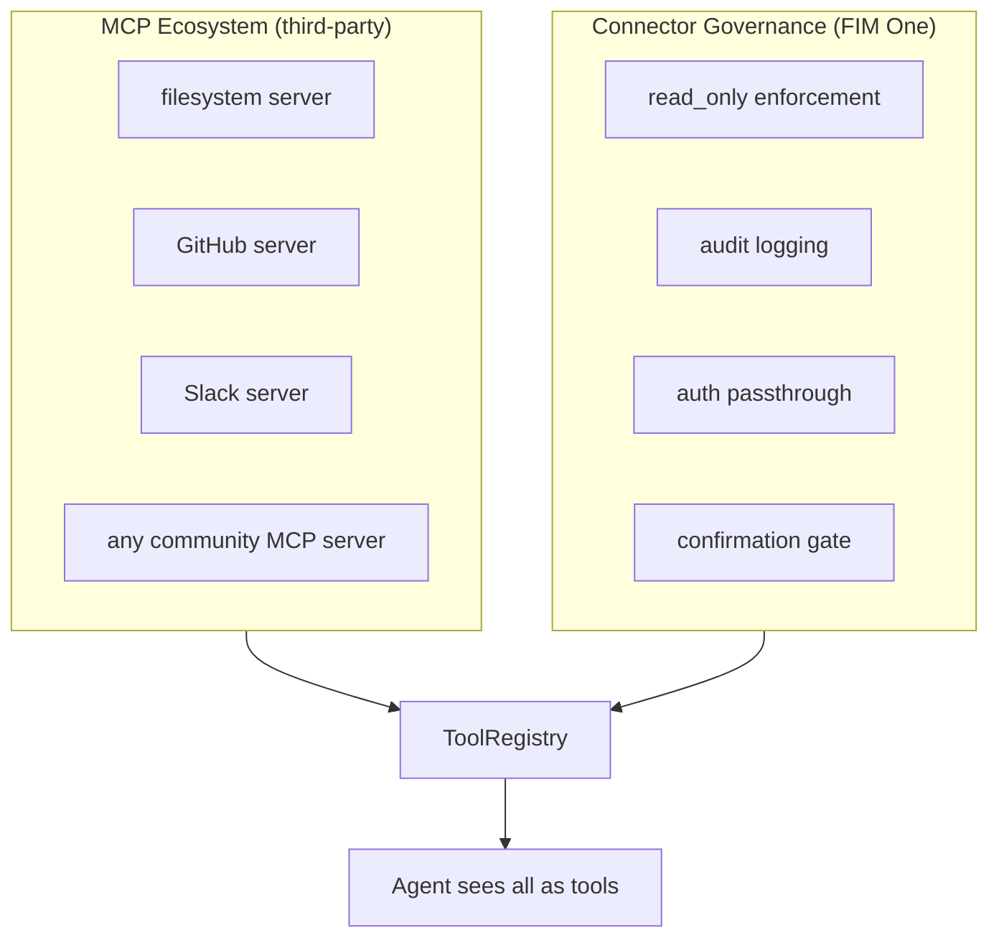

---
title: "Connector-Architektur"
description: "Wie FIM One Legacy-Systeme durch KI verbindet — vom Copilot zum Hub."
---## Copilot vs Hub

Die Architektur unterstützt zwei Integrationsskalen:



**Copilot** wird in die Benutzeroberfläche eines Host-Systems eingebettet. Benutzer interagieren mit KI, ohne ihre vertraute Schnittstelle zu verlassen. Es kann mehrere Connectors verwenden (Host-DB + Benachrichtigungsdienst usw.).

**Hub** ist ein eigenständiges Portal, das alle Systeme verbindet. Es ist nicht in ein einzelnes System eingebettet – es ist die zentrale Intelligenzschicht, in der Systeme auf KI treffen.

Gleiche Connector-Architektur, unterschiedliche Bereitstellung. Ein Copilot verwendet denselben `ConnectorToolAdapter` wie ein Hub.## Kernprinzip

**Der Client ändert keinen Code.** FIM One integriert sich proaktiv in ihre Systeme -- liest ihre Datenbanken, ruft ihre APIs auf, schreibt in ihren Message Bus. Der Client stellt nur Anmeldedaten und Netzwerkzugriff bereit.## Architektur mit drei Schichten



Jede Schicht hat eine eigene Verantwortung:

| Schicht | Verantwortlich für | Änderungen wenn... |
|---|---|---|
| **Platform** | Orchestrierung, Multi-Tenant, UI | Neue Platform-Features ausgeliefert werden |
| **Connector Governance Layer** | Enterprise-Governance-Richtlinien | Sicherheits-/Compliance-Anforderungen ändern |
| **MCP Protocol** | Transport, Tool-Interface-Standard | Nie (offener Standard) |
| **Legacy System** | Geschäftsdaten und Logik | Nie (das ist der ganze Sinn) |## Warum MCP als Transport-Schicht

Adapter werden als **MCP Server** implementiert. Dies ist eine bewusste architektonische Entscheidung:

- **Wiederverwendung**: FIM One wird bereits mit einem MCP Client (v0.3) ausgeliefert. Das Hinzufügen eines Adapters für ein Legacy-System nutzt die gleiche Infrastruktur wie das Hinzufügen eines beliebigen MCP-Tools.
- **Standard-Protokoll**: MCP ist ein offener Standard. Kein proprietäres Protokoll, das erfunden oder gepflegt werden muss.
- **Ökosystem**: MCP Server von Drittanbietern (Datenbanken, APIs, SaaS-Tools) funktionieren sofort.
- **Prozessisolation**: Jeder MCP Server läuft als separater Prozess. Ein fehlerhafter Adapter kann die Plattform nicht zum Absturz bringen.### Was MCP allein nicht bietet

Die **Connector Governance Layer** fügt Enterprise-Governance hinzu, die rohes MCP nicht hat:

| Concern | MCP | Connector Governance Layer |
|---|---|---|
| Read-only enforcement | Nein | `read_only` Flag auf Operationen; Schreiben standardmäßig blockiert |
| Audit logging | Nein | Jeder Tool-Aufruf aufgezeichnet (Zeitstempel, Benutzer, Tool, Parameter, Ergebnis) |
| Auth passthrough | Nein | Proxy Host-System-Auth; Agent handelt im Namen des angemeldeten Benutzers |
| Confirmation gate | Nein | Schreiboperationen erfordern menschliche Genehmigung (SSE `confirmation_required`) |
| Circuit breaker | Nein | Verbindungsfehler löst graceful degradation aus |
| Operation classification | Nein | Operationen gekennzeichnet als read/write/admin mit Richtlinien pro Level |### Warum nicht ein benutzerdefiniertes Protokoll erfinden

Protokolle sind Standardware. Der technische Wert liegt in den Adaptern selbst (Domänenwissen, Schema-Mapping, Behandlung von Spezialfällen) und der Governance-Schicht (Audit, Auth, Sicherheit). Die Erfindung eines Transport-Protokolls würde Wartungskosten verursachen, ohne Funktionalität hinzuzufügen. Stripe verwendet HTTPS; Docker verwendet cgroups; FIM One verwendet MCP.## Bereitstellungsmodell

Alles läuft in einer einzigen Docker Compose-Bereitstellung. Der Client installiert nichts.



<Note>
Alles wird von FIM One bereitgestellt. Der Client stellt nur folgendes bereit:
- Datenbankzugangsdaten (schreibgeschütztes Konto empfohlen)
- API-Endpunkte und Schlüssel (falls verfügbar)
- Netzwerk-Whitelist-Zugriff
</Note>

**Zugriffshierarchie**: FIM One passt sich an, welchen Zugriff der Client bereitstellen kann:

| Was der Client hat | Wie FIM One sich verbindet |
|---|---|
| API mit Dokumentation | HTTP API-Adapter (bester Fall) |
| API ohne Dokumentation | HTTP API-Adapter + manuelle Schema-Zuordnung |
| Nur Datenbankzugriff | Datenbankadapter (direktes SQL, standardmäßig schreibgeschützt) |
| Datenbank + Message Bus | Datenbankadapter + Message-Push-Adapter |## Agent-Connector-Entkopplung

Der Agent sieht Connectors als gewöhnliche Tools. Er weiß nicht und kümmert sich nicht darum, ob ein Tool integriert, ein MCP Server von Drittanbietern oder ein Legacy-System-Connector ist.



Das bedeutet:

- **Hinzufügen** eines neuen Systems = Hinzufügen einer Connector-Konfiguration. Der Agent-Code ändert sich nicht.
- **Entfernen** eines Connectors = Entfernen der Konfiguration. Keine Code-Änderungen.
- Der gleiche Agent kann integrierte Tools und Connectors in einer einzelnen Aufgabe verwenden.## Hot-Plug Evolution

| Version | How to add a new connector | Restart required? |
|---|---|---|
| **v0.6** | Write a Python MCP Server with Connector Governance Layer, add to docker-compose | Redeploy |
| **v0.8** | Write a YAML/JSON config, platform generates MCP Server | Restart |
| **v1.0** | Upload OpenAPI spec, AI generates config automatically | **No restart (hot-plug)** |

Enterprise deployments are "implement once, run for months" -- hot-plug is a v1.0 convenience, not a v0.6 requirement.## Datenfluss-Beispiel

User: "Überprüfe alle überfälligen Verträge aus dem Finanzsystem und sende eine Zusammenfassung an Lark."

```
1. User sends message via Portal / API

2. FIM One (ReAct mode):
   Think: I need to query the finance DB for overdue contracts, then push to Lark.

3. Act: contract_query(status="overdue", days_past_due=">30")
   → Connector Governance: audit log, read_only check (pass)
   → MCP Server: translates to SQL
   → Client DB: SELECT * FROM contracts WHERE status='overdue' AND ...
   ← Returns 7 overdue contracts

4. Think: Found 7 overdue contracts. I'll summarize and push.

5. Act: lark_push(message="7 overdue contracts found: ...")
   → Connector Governance: audit log, write operation → confirmation gate
   → User approves via Portal
   → MCP Server: POST to Lark webhook
   ← Push successful

6. Answer: "Found 7 overdue contracts. Summary pushed to Lark group."
```## Connector-Standardisierungsstufen

| Level | Version | Ansatz | Wer baut es |
|---|---|---|---|
| **Level 1** | v0.6 | Python MCP Server mit Connector Governance | FIM One developer |
| **Level 2** | v0.8 | YAML/JSON config, platform auto-generates MCP Server | Implementation engineer (no Python needed) |
| **Level 3** | v1.0 | Upload OpenAPI/Swagger spec, AI generates config | AI (with human review) |## Beziehung zum bestehenden MCP-Ökosystem

Der MCP Client von FIM One (ab v0.3) unterstützt bereits MCP Server von Drittanbietern. Legacy-System-Adapter sind einfach **domänenspezifische MCP Server**, die mit der Connector Governance Layer für Enterprise Governance erstellt werden.



Die Connector Governance Layer ersetzt MCP nicht – sie erweitert MCP um die Governance Layer, die die Enterprise-Integration von Legacy-Systemen erfordert.