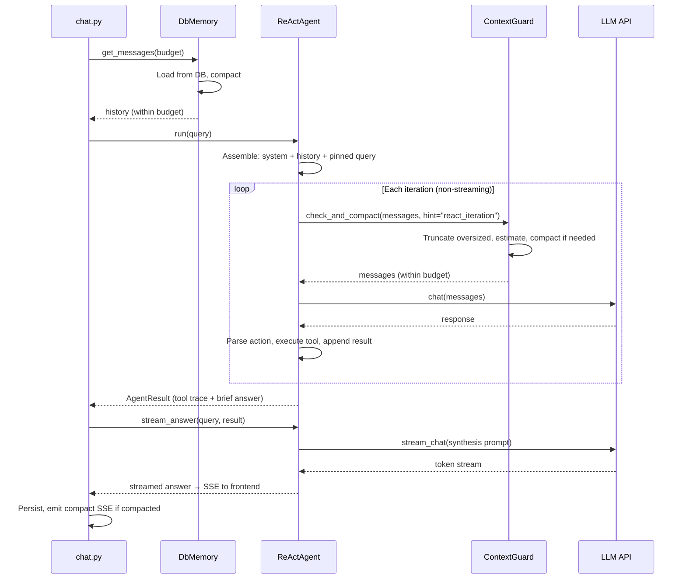
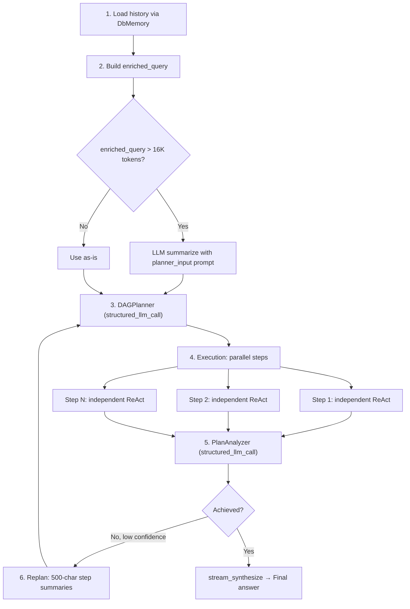

---
title: "Kontextverwaltung"
description: "Wie FIM One den Gesprächskontext verwaltet — ein fünfschichtiges Defense-in-Depth-System, das Token-Überläufe verhindert und gleichzeitig die Gesprächsqualität bewahrt."
---## Das Problem

LLMs haben endliche Kontextfenster. Ein 128K-Token-Modell klingt großzügig, bis man das Ausgabebudget, den System-Prompt, Tool-Beschreibungen und die angesammelte Historie einer mehrteiligen Konversation abzieht. Lange Konversationen, große Tool-Ergebnisse und mehrstufige Agent-Schleifen drücken alle gegen diese Grenze — oft innerhalb einer einzigen Sitzung.

Die naive Lösung ist Truncation: alte Nachrichten löschen, wenn das Fenster voll wird. Das ist schnell und vorhersehbar, aber es zerstört den Kontext wahllos. Die ursprüngliche Absicht des Benutzers, wichtige Entscheidungen aus früheren Turns und kritische Datenpunkte verschwinden alle, wenn ein stumpfer Zeichenabschnitt sie trifft. Das andere Extrem — LLM-gestützte Zusammenfassung bei jedem Turn — bewahrt semantischen Inhalt, ist aber teuer, langsam und führt seine eigenen Fehlermodi ein (halluzinierte Zusammenfassungen, verlorene numerische Präzision).

Die echte Herausforderung ist nicht „ins Fenster passen". Sie ist: **elegant degradieren, ohne kritische Informationen zu verlieren, ohne Token für unnötige Komprimierung zu verschwenden und ohne Latenz, die der Benutzer spürt.**

FIM One löst dies mit einer fünfschichtigen Defense-in-Depth-Architektur. Jede Schicht adressiert eine andere Skala des Problems, und sie komponieren sauber — keine einzelne Schicht muss perfekt sein, weil die nächste das fängt, was sie verpasst.## Fünf Schutzschichten

Context-Management ist kein einzelner Mechanismus. Es ist ein Stapel, bei dem jede Schicht ein spezifisches Anliegen auf einer spezifischen Granularität behandelt:

| Schicht | Komponente | Funktion | Zeitpunkt |
|---------|-----------|----------|-----------|
| **5** | Budget Configuration | Berechnet nutzbares Input-Token-Budget aus Modellspezifikationen | Beim Start / pro Anfrage |
| **4** | DbMemory | Lädt persistierte Historie, komprimiert beim Laden | Einmal pro Anfrage |
| **3** | ContextGuard | Budget-Durchsetzung pro Iteration | Bei jeder ReAct-Iteration |
| **2** | CompactUtils | Token-Schätzung, intelligente Kürzung, LLM-Komprimierung | Aufgerufen von Schichten 3 und 4 |
| **1** | Memory Implementations | Abstrakte Schnittstelle + konkrete Strategien | Framework-Ebene |

Die Schichten sind von unten nach oben nummeriert, da höhere Schichten von niedrigeren abhängen. Schicht 5 legt das Budget fest. Schicht 4 führt die anfängliche Komprimierung beim Laden durch. Schicht 3 erzwingt das Budget bei jeder Iteration. Die Schichten 2 und 1 stellen die Primitiven bereit, die die Schichten 3 und 4 verwenden.

```mermaid
flowchart TD
    L5["Layer 5: Budget Configuration<br/><i>context_size - max_output - 4K reserve</i>"]
    L4["Layer 4: DbMemory<br/><i>Load history, compact on load</i>"]
    L3["Layer 3: ContextGuard<br/><i>Per-iteration enforcement</i>"]
    L2["Layer 2: CompactUtils<br/><i>Estimation, truncation, LLM compact</i>"]
    L1["Layer 1: Memory Implementations<br/><i>BaseMemory, WindowMemory, SummaryMemory, DbMemory</i>"]

    L5 -->|"budget"| L4
    L5 -->|"budget"| L3
    L4 -->|"calls"| L2
    L3 -->|"calls"| L2
    L4 -.->|"implements"| L1
```### Layer 5 — Budget-Konfiguration

Das Budget wird aus drei Werten berechnet:

```
usable_input_tokens = context_size - max_output_tokens - system_prompt_reserve
```

Mit Standardwerten: `128,000 - 64,000 - 4,000 = 60,000 tokens`.

Die 4.000-Token-Systemanfrage-Reserve deckt die Systemaufforderung des Agenten, Werkzeugbeschreibungen und Formatierungsoverhead ab. Dies ist eine feste Konstante – großzügig genug, um Systemanfragen in der Praxis nicht zu kürzen, klein genug, um Budget nicht zu verschwenden.

Budget-Werte können aus drei Quellen stammen, aufgelöst in Prioritätsreihenfolge:

1. **Database ModelConfig** — pro-Modell `context_size` und `max_output_tokens` vom Administrator festgelegt.
2. **Umgebungsvariablen** — `LLM_CONTEXT_SIZE` und `LLM_MAX_OUTPUT_TOKENS`.
3. **Hartcodierte Standardwerte** — 128K-Kontext, 64K-Ausgabe.

Das Haupt-LLM und das schnelle LLM haben unabhängige Budgets. Die DAG-Schrittausführung verwendet das Budget des schnellen LLM; der ReAct-Modus verwendet das Budget des Haupt-LLM. Dies ist wichtig, da Operatoren häufig ein großes Kontextmodell für ReAct (wo sich der Verlauf ansammelt) mit einem kleineren, schnelleren Modell für DAG-Schritte (wo jeder Schritt neu beginnt) kombinieren.

Ein Minimum von 4.000 Token wird erzwungen – wenn falsch konfigurierte Werte ein kleineres Budget ergeben würden, begrenzt das System auf 4K, anstatt stillschweigend zu fehlschlagen.### Layer 4 — DbMemory

`DbMemory` ist die produktive Memory-Implementierung. Sie lädt persistierte Gesprächshistorie aus der Datenbank und komprimiert sie, um in das Token-Budget zu passen, bevor der Agent sie sieht.

Das Design ist **absichtlich schreibgeschützt**. Die Persistierung wird von `chat.py` behandelt — der API-Schicht, die den vollständigen Message-Lebenszyklus besitzt (einschließlich Metadaten, Nutzungsverfolgung und Bildanhänge). `DbMemory` liest nur. Seine Methoden `add_message()` und `clear()` sind No-Ops. Diese Trennung verhindert Doppelschreibvorgänge und hält die Persistierungslogik an einem Ort.

Beim Laden führt `DbMemory` folgende Schritte durch:

1. Fragt alle `user`- und `assistant`-Messages für das Gespräch ab, sortiert nach Erstellungszeit.
2. Verwirft die letzte User-Message (die aktuelle Abfrage, die der Agent erneut hinzufügt).
3. Rekonstruiert Bildanhänge — User-Messages, die Bilder enthielten, speichern Metadaten (`file_id`, `mime_type`) in der Datenbank, und `DbMemory` erstellt die base64-Daten-URLs von der Festplatte neu, damit das LLM Bilder aus früheren Turns „sehen" kann.
4. Komprimiert: Wenn ein `compact_llm` bereitgestellt wurde, verwendet `CompactUtils.llm_compact()`. Andernfalls fällt auf `CompactUtils.smart_truncate()` zurück.

Nach der Komprimierung setzt `DbMemory` Tracking-Flags (`was_compacted`, `_original_count`, `_compacted_count`), die die SSE-Schicht verwendet, um ein `compact`-Event an das Frontend zu senden.### Layer 3 — ContextGuard

`ContextGuard` ist der Pro-Iteration-Budget-Erzwinger. Er wird am Anfang jeder ReAct-Iteration aufgerufen — sowohl im eigenständigen ReAct-Modus als auch innerhalb des Sub-Agenten jedes DAG-Schritts. Dies ist die letzte Verteidigungslinie, bevor die Nachrichten die LLM-API erreichen.

Die Durchsetzung folgt einem dreistufigen Prozess:

1. **Überdimensionierte einzelne Nachrichten kürzen.** Jede einzelne Nachricht, die 50K Zeichen überschreitet, wird hart gekürzt mit einem `[Truncated]`-Suffix. Dies erfasst unkontrollierte Tool-Ausgaben — ein Web-Scrape, das eine ganze Webseite zurückgibt, ein Datei-Lesen, das einen großen Datensatz ausgibt.

2. **Gesamttoken schätzen.** Wenn das Gesamtvolumen in das Budget passt, sofort zurückgeben. Die meisten Iterationen bestehen hier — Komprimierung ist die Ausnahme, nicht die Regel.

3. **Komprimieren, wenn über Budget.** Wenn ein `compact_llm` verfügbar ist, verwenden Sie LLM-gestützte Komprimierung mit einem hinweispezifischen Prompt. Andernfalls greifen Sie auf `smart_truncate` zurück.

Das **Hinweissystem** ist das, was ContextGuard kontextbewusst macht, anstatt eine Einheitslösung zu sein. Verschiedene Situationen erfordern unterschiedliche Komprimierungsstrategien:

| Hinweis | Verwendet von | Behält bei | Löscht |
|---------|---------------|-----------|--------|
| `react_iteration` | ReAct-Agent-Schleife | Aktuelle Reasoning-Kette, aktuelles Ziel, kritische Daten | Alte redundante Schritte, fehlgeschlagene Wiederholungen, ausführliche Tool-Ausgaben |
| `planner_input` | DAG angereicherte Abfrage | Benutzerintention-Entwicklung, Schlüsselentscheidungen, Einschränkungen | Dialogdetails, Grüße, Tool-Call-Mechanik |
| `step_dependency` | DAG-Schritt-Kontext | Schlüsseldaten, Zahlen, Schlussfolgerungen | Reasoning-Prozess, fehlgeschlagene Versuche, ausführliche Formatierung |
| `general` | Standard-Fallback | Schlüsselfakten, Entscheidungen, Tool-Ergebnisse | Grüße, Füllstoff, redundante Hin-und-Her-Kommunikation |

Jeder Hinweis ist einem sorgfältig formulierten System-Prompt zugeordnet, der dem Komprimierungs-LLM mitteilt, was zu behalten und was zu verwerfen ist. Die Prompts enden mit „Schreiben Sie in der gleichen Sprache wie das Gespräch" — ein Detail, das für CJK-Benutzer wichtig ist, deren Zusammenfassungen sonst standardmäßig auf Englisch erfolgen würden.

Wenn die LLM-Komprimierung fehlschlägt (Netzwerkfehler, leere Antwort, eine beliebige Ausnahme), greift ContextGuard stillschweigend auf `smart_truncate` zurück. Der Agent sieht den Fehler nie. Dies ist eine bewusste Zuverlässigkeitsentscheidung: Es ist besser, etwas Kontext durch heuristische Kürzung zu verlieren, als die Iteration zum Absturz zu bringen.### Layer 2 — CompactUtils

`CompactUtils` ist eine zustandslose Utility-Klasse — keine Instanzen, kein Zustand, nur reine Funktionen. Sie bietet drei Funktionen, auf denen die Layer 3 und 4 aufbauen.

**Token-Schätzung** konvertiert Text in eine ungefähre Token-Anzahl, ohne eine Tokenizer-Bibliothek zu importieren. Die Heuristik:

- ASCII-Zeichen: ~4 Zeichen pro Token
- CJK / Nicht-ASCII-Zeichen: ~1,5 Zeichen pro Token
- Bilder: 765 Token pro Bild (Pauschalgebühr)
- Pro-Nachricht-Overhead: 4 Token (Rollenmarkierung, Trennzeichen)

**`smart_truncate`** ist der heuristische Fallback. Es behält angeheftete Nachrichten bedingungslos bei, durchläuft dann rückwärts durch nicht angeheftete Nachrichten und sammelt diese an, bis das Budget aufgebraucht ist. Das Ergebnis ist ein Suffix des Gesprächs, das passt. Es stellt auch sicher, dass das Ergebnis niemals mit einer Assistenten-Nachricht beginnt — ein verwaister Assistenten-Turn ohne vorhergehende Benutzernachricht verwirrt LLMs.

**`llm_compact`** ist der LLM-gestützte Pfad. Es teilt Nachrichten in drei Gruppen auf — Systemnachrichten (immer beibehalten), angeheftete Nachrichten (immer beibehalten) und komprimierbare Nachrichten. Die ältesten komprimierbaren Nachrichten werden in einer einzigen `[Conversation summary]` Systemnachricht zusammengefasst; die 4 neuesten Nachrichten werden wörtlich beibehalten. Wenn das komprimierte Ergebnis immer noch zu lang ist, fällt es auf `smart_truncate` für die komprimierte Ausgabe zurück — doppelte Absicherung.### Layer 1 — Memory Implementations

Die Memory-Schicht definiert die `BaseMemory`-Schnittstelle: `add_message()`, `get_messages()`, `clear()`. Es gibt drei Implementierungen:

- **WindowMemory** — ein zählbasiertes Schiebefenster. Behält die letzten N Nicht-System-Nachrichten. Einfach, vorhersehbar, keine LLM-Aufrufe. Wird nicht in der Produktion verwendet; nützlich für Tests und zustandslose Szenarien.

- **SummaryMemory** — löst LLM-Zusammenfassung aus, wenn die Nachrichtenanzahl einen Schwellenwert überschreitet. Komprimiert alte Nachrichten in eine `[Conversation summary]` Systemnachricht. Wird nicht in der Produktion verwendet; geht dem ausgefeilteren ContextGuard-Ansatz voraus.

- **DbMemory** — die Produktionsimplementierung (beschrieben in Layer 4). Datenbankgestützt, schreibgeschützt, mit LLM- oder heuristischer Komprimierung beim Laden.

WindowMemory und SummaryMemory bleiben in der Codebasis, da sie als nützliche Primitive für Tests und für Benutzer dienen, die die Kernbibliothek von FIM One ohne die Web-Schicht einbetten. Sie sind kein toter Code — sie sind die einfachen Fälle, aus denen die Architektur hervorgegangen ist.## Wie der Kontext durch ReAct fließt

Der ReAct-Agent verwendet Kontextverwaltung in zwei unterschiedlichen Phasen: Ladezeit und Iterationszeit.



Tool-Iterationen verwenden nicht-streamendes `chat()` für Geschwindigkeit; die Antweltsynthese verwendet Streaming `stream_chat()` über `stream_answer()`. Diese zweiphasige Aufteilung — schnelle Tool-Schleife gefolgt von Streaming-Synthese — optimiert sowohl Latenz als auch Benutzererlebnis. Für die vollständige ReAct-Engine-Architektur einschließlich Dual-Mode-Ausführung und Tool-Auswahl siehe [ReAct Engine](/architecture/react-engine).

Die Schlüsseleinsicht: **DbMemory behandelt das historische Kontextproblem (Turns aus vorherigen Anfragen), während ContextGuard das Wachstumsproblem innerhalb der Anfrage behandelt (Tool-Ergebnisse, die sich während einer Agent-Schleife ansammeln).** Sie arbeiten auf unterschiedlichen Zeitskalen und erfassen unterschiedliche Fehlermodi.

Die aktuelle Abfrage des Benutzers ist immer mit `pinned=True` gekennzeichnet. Dies stellt sicher, dass sie alle Komprimierungen übersteht — sowohl `smart_truncate` als auch `llm_compact` bewahren angeheftete Nachrichten bedingungslos. Egal wie aggressiv die Historie komprimiert wird, die eigentliche Frage des Benutzers geht niemals verloren.## Wie der Kontext durch DAG fließt

DAG-Modus hat eine grundlegend andere Kontextform als ReAct. Statt eines langen Gesprächsfadens hat er einen Baum: eine Planungsphase, mehrere parallele Ausführungsschritte und eine Analysephase. Jede Phase hat ihre eigene Kontextverwaltungsstrategie.



**Phase 1 — Verlauf laden.** DbMemory lädt und komprimiert den Gesprächsverlauf, genau wie ReAct. Der komprimierte Verlauf wird in einen Textblock formatiert, dem `"Previous conversation:"` vorangestellt ist.

**Phase 2 — Konstruktion der erweiterten Abfrage.** Der Verlauftext und die aktuelle Abfrage werden in eine `enriched_query` kombiniert. Wenn diese 16K Token überschreitet, wird sie mit dem `planner_input`-Hinweis-Prompt vom LLM zusammengefasst. Der 16K-Schwellenwert wird gewählt, weil der Planer die gesamte Abfrage in einem Durchgang lesen muss — anders als ReAct gibt es während der Planung keine iterative Komprimierung.

**Phase 3 — Planung.** Der Planer erhält einen 2-Nachrichten-Prompt: Systemprompt plus erweiterte Abfrage. Kein ContextGuard hier — die erweiterte Abfrage ist bereits durch die 16K-Prüfung größenkontrolliert.

**Phase 4 — Schrittausführung.** Jeder DAG-Schritt läuft als unabhängiger ReAct-Agent mit eigenem ContextGuard. Kritisch ist: Diese Sub-Agenten haben **keinen Speicher** — sie starten neu mit nur ihrer Aufgabenbeschreibung und Abhängigkeitskontext. Dies ist beabsichtigt: DAG-Schritte sollten eigenständige Arbeitseinheiten sein. Abhängigkeitsergebnisse werden über `_build_step_context` eingefügt, das bei 50K Zeichen abschneidet (das `max_message_chars`-Limit des ContextGuard).

**Phase 5 — Analyse.** Schrittergebnisse werden für das Analyzer-LLM mit Pro-Schritt-Abschneidung bei 10K Zeichen formatiert. Dies verhindert, dass die ausführliche Ausgabe eines einzelnen Schritts den Analysiskontext dominiert.

**Phase 6 — Neuplanung.** Wenn der Analyzer feststellt, dass das Ziel nicht erreicht wurde und das Vertrauen unter dem Schwellenwert liegt, werden Schrittergebnisse für den Neuplanungskontext auf nur 500 Zeichen pro Schritt gekürzt. Die Neuplanung muss wissen, *was passiert ist* und *was schiefgelaufen ist*, nicht die vollständige Detailansicht jeder Schrittausgabe. Diese aggressive Kürzung hält den Neuplan-Prompt kompakt genug, damit der Planer ihn effizient verarbeiten kann.

Für die vollständige DAG-Pipeline-Architektur einschließlich der LLM Call Map und Neuplanungslogik siehe [DAG Engine](/architecture/dag-engine).## Angeheftete Nachrichten

Der Anheftungsmechanismus verhindert, dass die Komprimierung Nachrichten zerstört, die erhalten bleiben müssen. Zwei Kategorien von Nachrichten werden angeheftet:

1. **Die aktuelle Benutzerabfrage** — immer angeheftet. Wenn der Benutzer eine Frage stellt und der Verlauf zu lang ist, komprimiert das System den Verlauf, nicht die Frage.

2. **Injizierte Mid-Stream-Nachrichten** — wenn ein Benutzer eine Folgefrage sendet, während der Agent noch läuft, wird die injizierte Nachricht als angeheftet markiert, damit der Agent sie in der nächsten Iteration sieht.

Das Risiko beim Anheften ist die Ansammlung. In einer langen Sitzung mit vielen injizierten Nachrichten kann angehefteter Inhalt wachsen und den größten Teil des Budgets verbrauchen, ohne Platz für den eigentlichen Gesprächsverlauf zu lassen. ContextGuard adressiert dies mit einer harten Obergrenze: **Wenn angeheftete Token 50% des Budgets überschreiten, werden die ältesten injizierten Nachrichten abgeheftet und in den komprimierbaren Pool verschoben.** Nur die neueste angeheftete Nachricht (die aktuelle Abfrage) wird beibehalten.

Dies ist ein Kompromiss. Das Abheften alter injizierter Nachrichten bedeutet, dass diese möglicherweise zusammengefasst oder gekürzt werden. Aber die Alternative — angeheftete Nachrichten den gesamten anderen Kontext verdrängen zu lassen — ist schlimmer. Das System bevorzugt die Beibehaltung des neuesten Kontexts, der fast immer relevanter ist als ältere Injektionen.## Token-Schätzung

FIM One verwendet heuristische Token-Schätzung anstelle eines echten Tokenizers. Dies ist eine bewusste Entscheidung mit klaren Kompromissen.

**Warum kein echter Tokenizer?** Drei Gründe:

1. **Abhängigkeitskosten.** `tiktoken` (OpenAIs Tokenizer) ist 15MB kompilierte Rust-Bindings. `sentencepiece` (verwendet von einigen Open-Source-Modellen) hat eigene Build-Anforderungen. Für ein Framework, das mehrere LLM-Anbieter unterstützt, gibt es keinen einzigen korrekten Tokenizer — jede Modellfamilie verwendet einen anderen.

2. **Geschwindigkeit.** Heuristische Schätzung ist ein einzelner Durchgang durch den String. Echte Tokenisierung beinhaltet Vokabular-Lookup, BPE-Merge-Operationen und spezielle Token-Behandlung. ContextGuard ruft die Schätzung bei jeder Iteration auf, manchmal mehrfach — der Geschwindigkeitsunterschied ist relevant.

3. **Ausreichend gut.** Die Heuristik ist für mehrsprachigen Text optimiert (die ASCII/CJK-Aufteilung deckt die zwei Hauptfälle ab). Sie kann für Edge Cases (stark gepunkteter Code, ungewöhnliches Unicode) um das 1,5-2-fache daneben liegen, aber Kontext-Management ist von Natur aus ungefähr. Um 30% daneben zu liegen bei einem 60K-Budget hinterlässt immer noch eine komfortable Marge.

Die konkreten Heuristiken:

| Inhaltstyp | Verhältnis | Begründung |
|-------------|-----------|-----------|
| ASCII-Text | ~4 Zeichen/Token | Englische Prosa und Code durchschnittlich 3,5-4,5 Zeichen/Token über GPT/Claude-Tokenizer |
| CJK / Nicht-ASCII | ~1,5 Zeichen/Token | Jedes CJK-Zeichen ist typischerweise 1-2 Token; 1,5 ist das geometrische Mittel |
| Bilder | 765 Token/Bild | Ungefähre Kosten eines Base64-codierten Bildes in der Vision API |
| Pro-Nachricht-Overhead | 4 Token | Rollenmarkierung, Trennzeichen, Formatierung |

Die Schätzung gibt immer mindestens 1 Token für nicht-leere Inhalte zurück. Dies verhindert Division-durch-Null-Edge Cases in der Budget-Arithmetik.## Was der Benutzer sieht

Context Management ist so konzipiert, dass es im Normalfall unsichtbar ist und nur minimal störend wirkt, wenn es aktiviert wird. Die benutzerorientierten Signale sind:

**CompactDivider.** Wenn `DbMemory` beim Laden die Historie komprimiert, rendert das Frontend einen gestrichelten Teiler mit dem Text „Earlier context (N messages) was summarized by AI." (Frühere Kontexte (N Nachrichten) wurden von AI zusammengefasst). Dieser erscheint zwischen der Zusammenfassung und den beibehaltenen aktuellen Nachrichten und gibt dem Benutzer einen visuellen Hinweis, dass älterer Kontext komprimiert wurde, ohne den Gesprächsfluss zu unterbrechen.

**Token-Nutzungsanzeige.** Die `done`-Karte am Ende jeder Antwort zeigt „X.Xk in / X.Xk out" — die Gesamtzahl der verbrauchten Input- und Output-Token. Dies umfasst Token, die für die Komprimierung aufgewendet wurden (die schnellen LLM-Aufrufe zur Zusammenfassung). Benutzer, die den Token-Verbrauch überwachen, können sehen, wenn die Komprimierung zusätzlichen Overhead verursacht.

**Fehlerbehandlung mit Bedacht.** Falls Context Management vollständig fehlschlägt — ein Szenario, das angesichts der Fallback-Kette nicht vorkommen sollte, aber theoretisch möglich ist — wird der Fehler als Agent-Fehlertext in der Antwort angezeigt, nicht als Systemabsturz. Das Gespräch wird fortgesetzt; der Benutzer kann es erneut versuchen oder umformulieren.

Das Ziel ist, dass die meisten Benutzer nie über Context Management nachdenken. Sie führen lange Gespräche, das System verwaltet das Budget transparent, und das einzige sichtbare Artefakt ist ein gelegentlicher Compact Divider. Für Power-User und Operatoren, denen Token-Effizienz wichtig ist, bieten die Nutzungsanzeige und die konfigurierbaren Budget-Parameter die notwendige Kontrolle.