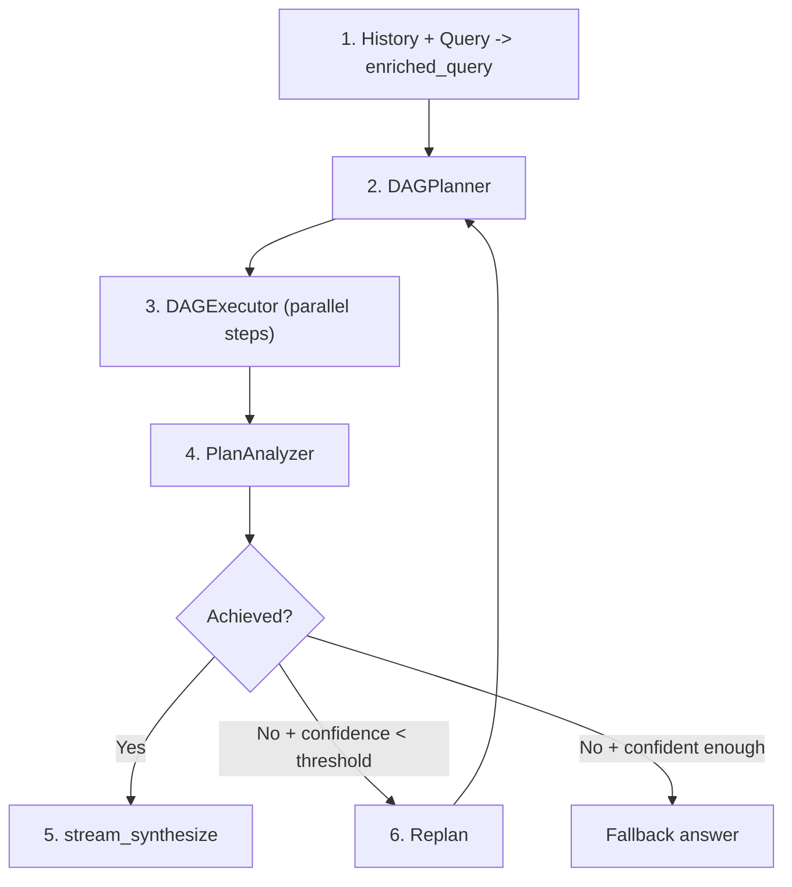
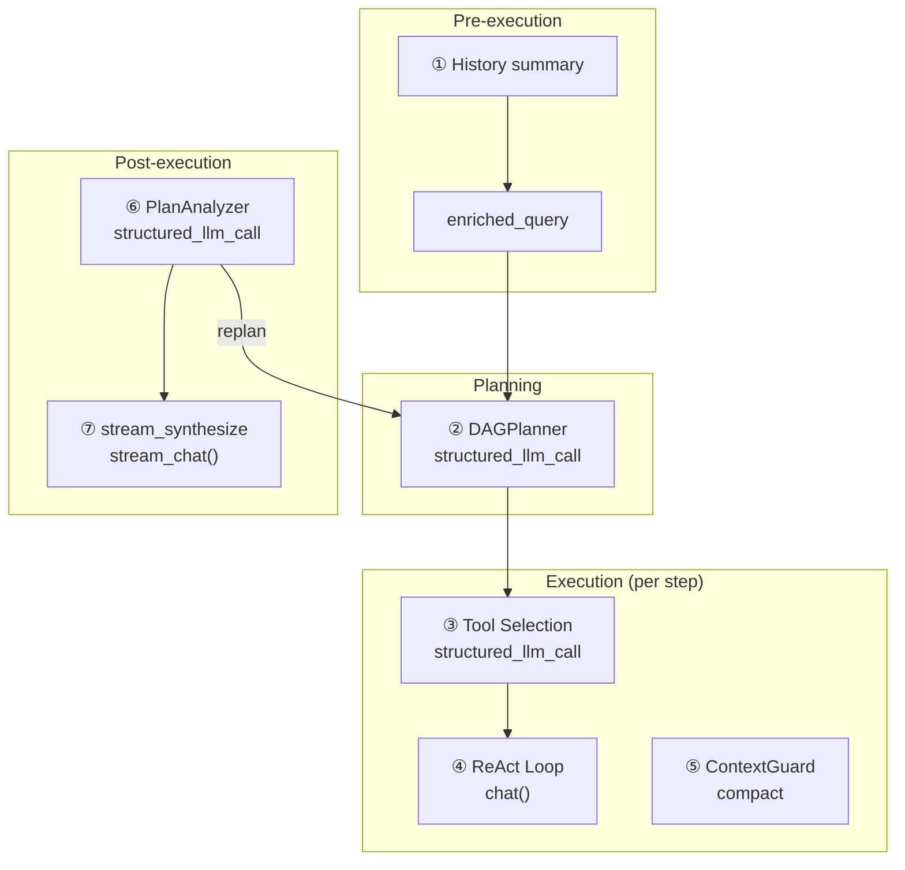
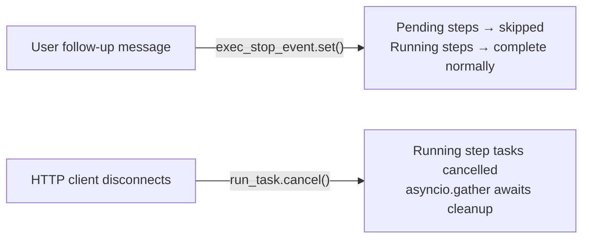

## Die Pipeline

DAG-Modus zerlegt ein komplexes Ziel in einen gerichteten azyklischen Graphen von Schritten, führt sie mit maximaler Parallelität aus und reflektiert dann, ob das Ziel tatsächlich erreicht wurde. Falls nicht, plant er neu und versucht es erneut — autonom, bis zu einem konfigurierbaren Budget.

Die Pipeline hat vier Phasen, die eine Schleife bilden:

**Plan.** Das intelligente LLM zerlegt die angereicherte Abfrage in 2–6 Schritte mit expliziten Abhängigkeitskanten. Jeder Schritt erhält eine Aufgabenbeschreibung, einen optionalen Tool-Hinweis und einen Modell-Hinweis, der steuert, ob er auf dem schnellen oder intelligenten LLM ausgeführt wird.

**Ausführung.** Der DAGExecutor startet unabhängige Schritte parallel (bis zu 5 gleichzeitig) und respektiert dabei den Abhängigkeitsgraph. Jeder Schritt läuft als eigenständiger ReAct-Agent ohne Speicher — er erhält nur seine Aufgabenbeschreibung und die Ergebnisse seiner abgeschlossenen Abhängigkeiten.

**Analyse.** Der PlanAnalyzer bewertet, ob der ausgeführte Plan das ursprüngliche Ziel erreicht hat, und erzeugt ein strukturiertes Urteil: `achieved` (boolean), `confidence` (0.0–1.0), `reasoning` und eine optionale `final_answer`.

**Neuplanung.** Wenn das Ziel nicht erreicht wurde und die Konfidenz unter der Stopschwelle liegt, kehrt die Pipeline zur Planung mit einem Replan-Kontext zurück, der zusammenfasst, was passiert ist und was schief gelaufen ist. Diese Schleife läuft bis zu `DAG_MAX_REPLAN_ROUNDS` Mal autonom.

Zwei LLMs arbeiten durchgehend zusammen: Ein **intelligentes LLM** kümmert sich um Planung, Analyse und Antwortsynthesize (Aufgaben, die hohe Reasoning-Fähigkeit erfordern), während das **allgemeine LLM** standardmäßig die Schrittausführung übernimmt (mit `model_hint="fast"` Schritten, die zum schnellen LLM delegiert werden, um Kosten zu sparen). Kontext-Komprimierung und Verlaufszusammenfassung verwenden das schnelle LLM. Jeder strukturierte Ausgabeaufruf verwendet `structured_llm_call`, das eine 3-stufige Degradationskette (Native FC, JSON Mode, Klartext mit Regex-Fallback) bietet, um modellspezifische Ausgabeeigenheiten zu handhaben.

## LLM-Aufrufe-Karte

Die vollständige DAG-Pipeline führt sieben unterschiedliche Kategorien von LLM-Aufrufen durch. Das Verständnis dafür, wo jeder Aufruf stattfindet, welches Modell ihn verarbeitet und was bei Fehlern passiert, ist für Debugging und Kostenoptimierung unerlässlich.

| # | Aufrufort | Modul | LLM-Rolle | Format | Fallback |
|---|-----------|--------|----------|--------|----------|
| 1 | Verlaufszusammenfassung | chat.py | schnelles LLM | Klartext | letzte 20K Zeichen kürzen |
| 2 | DAGPlanner | planner.py | intelligentes LLM | structured\_llm\_call | 3-stufiger Abbau |
| 3 | Werkzeugauswahl | react.py | Schritt-LLM | structured\_llm\_call | alle Werkzeuge zurückgeben |
| 4 | ReAct-Schleife (pro Schritt) | react.py | allgemeines LLM (Standard) / schnelles LLM (`model_hint="fast"`) / Reasoning-LLM (`model_hint="reasoning"`) | chat() | Wiederholung/Fallback |
| 5 | ContextGuard-Komprimierung | context\_guard.py | schnelles LLM | Klartext | smart\_truncate |
| 6 | PlanAnalyzer | analyzer.py | intelligentes LLM | structured\_llm\_call | regex + Standard |
| 7 | stream\_synthesize | analyzer.py | intelligentes LLM | stream\_chat() | analysis.final\_answer |

Die Aufrufe 1 und 5 sind **für den Benutzer unsichtbar** — es sind Infrastrukturaufrufe, die die Kontextgröße verwalten. Die Aufrufe 2, 6 und 7 verwenden das **intelligente LLM**, da sie hohe Reasoning-Fähigkeiten erfordern (Ziele zerlegen, Erreichung beurteilen, kohärente Antworten synthetisieren). Aufruf 4 verwendet standardmäßig das **allgemeine LLM** — nur Schritte, die explizit mit `model_hint="fast"` gekennzeichnet sind, werden auf das schnelle LLM herabgestuft, und Schritte mit `model_hint="reasoning"` werden auf das Reasoning-LLM hochgestuft. Aufruf 3 verwendet das gleiche LLM, das für diesen Schritt aufgelöst wird.

## DAGPlanner

Die Aufgabe des Planers besteht darin, ein übergeordnetes Ziel in einen gültigen DAG aus konkreten, umsetzbaren Schritten umzuwandeln. Dies geschieht mit einem einzigen `structured_llm_call` zum intelligenten LLM.

**Prompt-Design.** Der Planungs-Prompt injiziert das aktuelle Datum und Jahr (damit der LLM zeitabhängige Suchen planen kann), erzwingt Sprachübereinstimmung (Aufgabenbeschreibungen müssen die gleiche Sprache wie das Ziel verwenden) und beschränkt die Schrittanzahl auf 2–6. Jeder Schritt hat fünf Felder: `id`, `task`, `dependencies`, `tool_hint` und `model_hint`. Der Prompt entmutigt explizit das Aufteilen von trivial verwandten Teilaufgaben – „wenn mehrere Überprüfungen in einem einzigen Skript durchgeführt werden können, kombinieren Sie sie in EINEN Schritt."

**Strukturierte Extraktion.** Der Planer verwendet `structured_llm_call` mit einem `_PLAN_SCHEMA`, das das `steps`-Array-Schema definiert, und eine `parse_fn`, die rohe Dicts in `PlanStep`-Objekte konvertiert. Wenn der LLM ein einzelnes Step-Objekt statt eines `{"steps": [...]}` Wrappers zurückgibt, stellt der Parser automatisch wieder her. Die in [ReAct Engine — structured\_llm\_call](/architecture/react-engine#structured_llm_call--unified-output-extraction) dokumentierte 3-stufige Degradationskette behandelt LLM-Ausgabeeigenheiten über verschiedene Anbieter hinweg.

**DAG-Validierung.** Nach der Extraktion validiert der Planer die Graphstruktur mit Kahns Algorithmus für topologische Sortierung. Zwei Invarianten werden überprüft:

1. **Keine hängenden Verweise.** Wenn ein Schritt auf eine Abhängigkeits-ID verweist, die nicht im Plan vorhanden ist, wird der Verweis stillschweigend mit einer Warnmeldung gelöscht. Dies ist ein Wiederherstellungsmechanismus – LLMs lassen manchmal Schritte weg, auf die sie verwiesen haben, und ein hartes Fehlschlag würde den gesamten Planungsaufruf verschwenden.

2. **Keine Zyklen.** Wenn Kahns Algorithmus nicht alle Knoten besuchen kann (was bedeutet, dass mindestens ein Zyklus vorhanden ist), wirft der Planer einen `ValueError`. Zyklen sind nicht wiederherstellbar – ein zyklischer Plan kann nicht ausgeführt werden.

**model\_hint.** Der Planer weist `"fast"` Schritten zu, die er als einfach und deterministisch einstuft (Datenlookup, Formatkonvertierung, einfache Abfrage), `null` Schritten, die standardmäßiges Reasoning erfordern (aufgelöst zum allgemeinen Modell), und `"reasoning"` Schritten, die tiefe Analyse erfordern. Der Executor verwendet diesen Hinweis, um das entsprechende LLM pro Schritt über die `ModelRegistry` auszuwählen. Im Zweifelsfall weist der Prompt den LLM an, `null` zu verwenden – es ist immer sicherer, das leistungsfähigere Modell zu verwenden. Für domänenspezifische Aufgaben (Recht, Medizin, Finanzen) erhält der Planer Domänenkontext vom Router und wird angewiesen, `model_hint="reasoning"` Schritten zuzuweisen, die spezialisierte Genauigkeit erfordern.

**Eingabekonstruktion.** Die angereicherte Abfrage kombiniert Gesprächsverlauf mit der aktuellen Anfrage. Wenn das Gespräch lang ist, wird der Verlauf über `DbMemory` geladen und als `"Previous conversation: ..."` formatiert. Wenn die resultierende angereicherte Abfrage 16K Token überschreitet (geschätzt über `CompactUtils.estimate_tokens`), wird sie mit dem `planner_input` Hinweis-Prompt von ContextGuard LLM-zusammengefasst, bevor sie an den Planer übergeben wird. Das Fallback, wenn kein schneller LLM verfügbar ist: hart auf die letzten 20K Zeichen abschneiden.

## DAGExecutor

Der Executor nimmt einen validierten `ExecutionPlan` und führt seine Schritte gleichzeitig aus, respektiert dabei Abhängigkeitskanten und erzwingt Ressourcenlimits.

**Concurrency-Modell.** Ein `asyncio.Semaphore` begrenzt die parallele Schrittausführung auf `max_concurrency` (Standard 5, konfigurierbar über die Umgebungsvariable `MAX_CONCURRENCY`). Die Dispatch-Schleife identifiziert alle Schritte, deren Abhängigkeiten abgeschlossen sind, startet sie als `asyncio.Task`-Instanzen und wartet, bis mindestens einer fertig ist, bevor sie erneut prüft. Schritte werden in sortierter ID-Reihenfolge gestartet, um deterministisches Verhalten zu gewährleisten.

**ReAct-Agent pro Schritt.** Jeder Schritt läuft als unabhängiger ReAct-Agent, der von `_resolve_agent()` erstellt wird. Wenn der Schritt einen `model_hint` hat, der einer Rolle in der `ModelRegistry` entspricht, wird ein temporärer Agent mit dem entsprechenden LLM erstellt. Andernfalls wird das Standardmodell (allgemein) der Registry verwendet. Diese Agenten pro Schritt haben **kein Gedächtnis** — sie starten neu mit nur ihrer Aufgabenbeschreibung, dem ursprünglichen Ziel, eventuellen Tool-Hinweisen und den Ergebnissen abgeschlossener Abhängigkeiten. Diese Isolation ist beabsichtigt: DAG-Schritte sollten eigenständige Arbeitseinheiten sein, die keinen Zustand über den Graph hinweg durchsickern lassen.

**Abhängigkeitskontexteinspeisung.** `_build_step_context()` formatiert die Ergebnisse aller abgeschlossenen Abhängigkeitsschritte in einen Textblock: jede Abhängigkeits-ID, Status, Aufgabenbeschreibung und Ergebnis. Wenn ein `ContextGuard` konfiguriert ist und der kombinierte Kontext `max_message_chars` überschreitet, wird er hart abgeschnitten mit einem Suffix `[Dependency context truncated]`. Dies verhindert, dass ein Schritt, der von mehreren ausführlichen Vorgängern abhängt, sein eigenes Kontextfenster überlädt.

**Strukturierter Content-Multiplikator.** Wenn Abhängigkeitsergebnisse strukturierten Content enthalten — rechtliche Zitate, Markdown-Tabellen oder Code-Blöcke — wendet `_build_step_context()` einen Multiplikator auf das Abschneidungsbudget an (Standard `3.0`, konfigurierbar über `DAG_STRUCTURED_CONTEXT_MULTIPLIER`). Dies stellt sicher, dass Zitate, Tabellendaten und andere strukturierte Artefakte über Schrittgrenzen hinweg erhalten bleiben, anstatt mitten in einer Referenz abgeschnitten zu werden.

**Schritt-Timeout.** Jeder Schritt wird in `asyncio.wait_for` mit einem Standard-Timeout von 600 Sekunden (10 Minuten) eingewickelt. Wenn ein Schritt dies überschreitet, wird er abgebrochen und als `"failed"` mit einer Timeout-Nachricht markiert. Das Timeout ist pro Schritt, nicht pro Plan — ein 5-Schritt-Plan kann theoretisch 50 Minuten laufen, wenn Schritte sequenziell ausgeführt werden.

**Unterbrechung und Abbruch.** Der Executor hat zwei unterschiedliche Abbruchpfade, die jeweils durch ein anderes Ereignis ausgelöst werden:

*Sanftes Überspringen — Stop-Ereignis.* Wenn ein Benutzer während der Ausführung eine Folgenachricht sendet, setzt der Orchestrator in `chat.py` `exec_stop_event`. Der Executor prüft dieses Flag am Anfang jedes Dispatch-Zyklus: wenn gesetzt, werden alle verbleibenden `pending`-Schritte sofort als `"skipped"` mit dem Grund `"Skipped — user changed requirements"` markiert, und die Schleife beendet sich. Schritte, die bereits laufen, dürfen sich vollenden — nur nicht gestartete Schritte werden aufgegeben. Dieser schnelle Ausstieg ermöglicht es der Pipeline, um die aktualisierte Absicht des Benutzers neu zu planen, ohne auf die Fertigstellung des vollständigen ursprünglichen Plans zu warten.

*Sofortiger Abbruch — asyncio-Abbruch.* Wenn der HTTP-Client die Verbindung trennt, bricht `chat.py` die Top-Level-`run_task` über `asyncio.Task.cancel()` ab. Der Executor fängt `asyncio.CancelledError` ab, bricht alle aktuell laufenden Schritt-Tasks ab, wartet, bis sie über `asyncio.gather(..., return_exceptions=True)` bestätigen, und wirft dann erneut. Die Client-Trennung wird erkannt, indem alle 0,5 Sekunden `await request.is_disconnected()` innerhalb der SSE-Ereignisschleife abgefragt wird.

Der semantische Unterschied ist wichtig: **Stop-Ereignis** bedeutet „überspringe, was noch nicht gestartet ist, aber bewahre, was bereits läuft" — abgeschlossene Schrittergebnisse bleiben verfügbar, um die Neuplanung zu informieren. **CancelledError** bedeutet „breche sofort alles ab" — alle laufenden Arbeiten werden ohne Ergebniswiederherstellung verworfen.

**Deadlock-Erkennung.** Wenn die Dispatch-Schleife keine laufenden Tasks und keine startbereiten Schritte findet (weil ihre Abhängigkeiten fehlgeschlagen sind), werden alle verbleibenden ausstehenden Schritte als `"failed"` mit einer Nachricht markiert, die erklärt, dass ihre Abhängigkeiten nie abgeschlossen wurden. Dies verhindert, dass der Executor auf unbestimmte Zeit hängen bleibt.

**Fortschritts-Callbacks.** Der Executor feuert `(step_id, event, data)`-Callbacks für drei Ereignistypen: `"started"` (Schritt gestartet), `"iteration"` (Tool-Aufruf innerhalb eines Schritts) und `"completed"` (Schritt fertig). Die SSE-Schicht in `chat.py` überbrückt diese Callbacks zu `step_progress`-Ereignissen, die das Frontend für die Echtzeitvisualisierung des DAG nutzt.

## Zitierverifikation

Nach Abschluss jedes Schritts führt der Executor optional einen **Zitierverifizierer** aus, der sachliche Aussagen in der Ausgabe des Schritts überprüft. Dies wird durch die Umgebungsvariable `DAG_CITATION_VERIFICATION` gesteuert (Standard: `true`) und zielt auf Bereiche ab, in denen fehlerhafte Zitate ein hohes Risiko bergen — Rechtsstatuten, medizinische Referenzen und Finanzvorschriften.

Der Verifizierer arbeitet in drei Phasen:

1. **Extraktion.** Regex-Muster identifizieren zitierähnliche Zeichenketten im Schrittergebnis (z. B. Fallnummern, Statutenreferenzen, Regulierungscodes).
2. **Verifikation.** Jedes extrahierte Zitat wird durch einen LLM-Urteilsaufruf bewertet, der Plausibilität und interne Konsistenz überprüft.
3. **Wiederholung bei Fehler.** Falls die Verifikation fehlschlägt, wird der Schritt mit Korrektur-Feedback wiederholt, das der Agentur eine Chance gibt, ungenaue Referenzen zu korrigieren.

Die Zitierverifikation erhöht die Latenz für Schritte, die Zitate enthalten, beeinflusst aber nicht Schritte ohne diese. Deaktivieren Sie sie, indem Sie `DAG_CITATION_VERIFICATION=false` setzen, wenn Ihr Anwendungsfall keine zitierempfindlichen Bereiche umfasst.

## Domänengesteuertes Routing

Der Auto-Router klassifiziert Abfragen jetzt mit einem **`domain_hint`** neben der bestehenden Modusauswahl. Erkannte Domänen sind `legal`, `medical` und `financial`; Abfragen außerhalb dieser Domänen erhalten `null`.

Die Domänenklassifizierung beeinflusst die Pipeline auf zwei Arten:

**DAG-Modus.** Wenn der Router DAG auswählt und einen nicht-null `domain_hint` bereitstellt, wird der Domänenkontext in den Planner-Prompt eingefügt. Dies leitet den Planner an, `model_hint="reasoning"` für Schritte zuzuweisen, die spezialisierte Genauigkeit erfordern, und `tool_hint="read_skill"` für Schritte vorzuschlagen, die verfügbaren Domänenfähigkeiten entsprechen.

**ReAct-Modus.** Wenn der Router ReAct für eine domänenspezifische Abfrage auswählt, eskaliert das System vom allgemeinen Modell zum **Reasoning-Modell** über `registry.get_by_role("reasoning")`. Zusätzlich werden obligatorische Anweisungen eingefügt, die den Agenten verpflichten, `web_search` zu verwenden, bevor domänenspezifische Inhalte geschrieben werden, und Zitate über die Suche zu verifizieren. Das `read_skill`-Tool wird in der Toolauswahl fixiert (nicht herausgefiltert), um sicherzustellen, dass Domänenwissen immer zugänglich ist.

Die Routing-Verzerrung verschiebt sich auch: eng gekoppelte Domänenanalyse (bei der mehrere Teilaufgaben Kontext und Zitate teilen) bevorzugt den ReAct-Modus, um Kontextverluste über DAG-Schrittgrenzen hinweg zu vermeiden.

## PlanAnalyzer

Der Analyzer bewertet, ob der ausgeführte Plan das ursprüngliche Ziel erreicht hat. Er erzeugt ein strukturiertes `AnalysisResult` mit vier Feldern:

- **`achieved`** (boolean) — `true` nur wenn das Ziel vollständig erreicht wurde.
- **`confidence`** (float, 0.0-1.0) — wie sicher sich der Analyzer in seiner Bewertung ist. Widersprüchliche Quellen senken diesen Wert.
- **`final_answer`** (string oder null) — eine synthetisierte Antwort bei Erfolg, `null` andernfalls.
- **`reasoning`** (string) — die Chain-of-Thought-Begründung des LLM.

**Strukturierte Extraktion.** Der Analyzer verwendet `structured_llm_call` mit `_ANALYSIS_SCHEMA`, einer `parse_fn`, die Typkonvertierung und Confidence-Begrenzung handhabt, und einem `regex_fallback` für fehlerhaft formatiertes JSON. Der Regex-Fallback (`_regex_extract_analysis`) extrahiert `achieved`, `confidence`, `final_answer` und `reasoning` Felder aus teilweise gültigem JSON mittels Pattern Matching. Dies ist wichtig, da Analyseantworten tendenziell länger und komplexer sind als Planungsantworten, was JSON-Formatierungsfehler wahrscheinlicher macht.

**Sichere Standardeinstellung.** Falls alle Extraktionsebenen fehlschlagen (native FC, JSON-Modus, Klartext, Regex), gibt der Analyzer `AnalysisResult(achieved=False, confidence=0.0, reasoning="Could not parse analysis response")` zurück. Dies stellt sicher, dass die Pipeline immer ein verwertbares Ergebnis erhält — ein Parse-Fehler wird zu einem „nicht erreicht"-Urteil, das eine Neuplanung auslöst, anstatt abzustürzen.

**Schritt-Ergebnis-Formatierung.** Das Ergebnis jedes Schritts wird in der Analyseeingabe auf 10K Zeichen gekürzt. Dies verhindert, dass eine einzelne Schritt-Ausgabe (z. B. ein großer Web-Scrape oder Datendump) das Kontextfenster des Analyzers dominiert und andere Schritt-Ergebnisse verdrängt.

**Vergleich mehrerer Quellen.** Die Analyseeingabe enthält eine Direktive, um Ergebnisse aus verschiedenen Quellen explizit zu vergleichen. Wenn Web-Suchergebnisse, Wissensbank-Abruf und Dateivorgänge alle Daten beitragen, muss der Analyzer Widersprüche kennzeichnen (unterschiedliche Zahlen, Daten, Aussagen) und angeben, welche Quelle wahrscheinlich zuverlässiger ist. Widersprüche senken den Confidence-Wert, was wiederum die Neuplanungsentscheidung beeinflusst.

## Neuplanung

Die Neuplanungsschleife ist das charakteristischste Merkmal der DAG-Engine: Sie kann sich autonom von Teilfehlern erholen, indem sie reflektiert, was schief gelaufen ist, und einen anderen Ansatz versucht.

**Entscheidungslogik.** Nach jeder Runde von Plan-Ausführung-Analyse bewertet der Orchestrator in `chat.py` das Analyseergebnis:

1. **`achieved == True`** — Schleife beenden, zur Streaming-Synthese übergehen.
2. **Benutzereinspruch während dieser Runde** — immer neu planen, unabhängig von Konfidenz oder Budget. Nachfolgende Benutzernachrichten werden als Anforderungsänderungen behandelt, die einen neuen Versuch erfordern. Dies verbraucht nicht das autonome Neuplanungsbudget.
3. **Autonomes Neuplanungsbudget erschöpft** — Schleife beenden. Das Budget beträgt `max_replan_rounds - 1` autonome Neuplanungen (Standard: 2 autonome Neuplanungen aus einem Budget von 3 Gesamtrunden).
4. **`confidence >= replan_stop_confidence`** — Schleife beenden. Auch wenn das Ziel nicht vollständig erreicht wurde, deutet ein hoher Konfidenzwert (Standard-Schwellenwert: 0,8, konfigurierbar über `DAG_REPLAN_STOP_CONFIDENCE`) darauf hin, dass der Analyzer sich ziemlich sicher ist, was passiert ist — Neuplanung wird wahrscheinlich nicht helfen.
5. **Andernfalls** — neu planen. Das Ziel wurde nicht erreicht, die Konfidenz ist niedrig und das Budget bleibt erhalten.

**Neuplanungskontext.** Bei der Neuplanung ruft der Orchestrator `_format_replan_context()` auf, um eine Zusammenfassung der vorherigen Runde zu erstellen. Dies umfasst die Begründung des Analyzers und eine gekürzte Vorschau des Ergebnisses jedes Schritts (maximal 500 Zeichen pro Schritt). Die aggressive Kürzung ist beabsichtigt: Der Planer muss wissen, *was passiert ist* und *was schief gelaufen ist*, nicht die vollständigen Details der Ausgabe jedes Schritts. Dieser Kontext wird an `DAGPlanner.plan()` als `context`-Parameter zusammen mit der ursprünglichen angereicherten Abfrage übergeben.

**Maximale Runden.** Die Umgebungsvariable `DAG_MAX_REPLAN_ROUNDS` (Standard 3) steuert die Gesamtzahl der Planungsrunden. Mit Standardeinstellungen ist die erste Runde der ursprüngliche Plan, was bis zu 2 autonome Neuplanungen ermöglicht. Benutzergesteuerte Neuplanungen (über Nachrichteneinspruch) werden nicht gegen dieses Budget angerechnet — ein Benutzer kann die Pipeline unbegrenzt steuern.

**SSE-Ereignis.** Wenn die Pipeline sich entscheidet, neu zu planen, sendet sie ein `replanning`-Phasenereignis mit der Begründung des Analyzers. Das Frontend nutzt dies, um dem Benutzer anzuzeigen, warum die Pipeline erneut versucht wird.

**enriched\_query-Akkumulation.** Nachfolgende Benutzernachrichten werden über Runden hinweg an die angereicherte Abfrage angehängt: `enriched_query += "\n\n[User follow-up]: {content}"`. Dies bedeutet, dass der Planer die vollständige Entwicklung der Benutzerabsicht sieht — die ursprüngliche Anfrage plus alle nachfolgenden Klarstellungen — wenn er einen überarbeiteten Plan erstellt.

## Streaming-Synthese

Wenn der Analyzer bestätigt, dass das Ziel erreicht wurde (`analysis.achieved == True`), streamt die Pipeline eine synthetisierte endgültige Antwort an den Benutzer über `PlanAnalyzer.stream_synthesize()`.

**Eingabe.** Der Syntheseaufruf erhält drei Eingaben: das ursprüngliche Ziel, die formatierten Schrittergebnisse (max. 10.000 Zeichen pro Schritt) und die Begründung des Analyzers aus dem nicht-streaming Analyseaufruf. Die Begründung bietet eine "Roadmap" für das, was die Synthese abdecken sollte.

**Systemaufforderung.** Die Syntheseaufforderung weist das LLM an, direkt zu antworten, ohne Meta-Kommentare ("do NOT include phrases like 'based on the results'"), die Sprache des ursprünglichen Ziels zu verwenden und Ergebnisse aus verschiedenen Quellen gegebenenfalls zu vergleichen. Eine Sprachanweisung aus Benutzereinstellungen wird angehängt, falls verfügbar.

**Streaming.** Die Methode verwendet `stream_chat()`, um Token inkrementell auszugeben. Die SSE-Schicht umhüllt jeden Chunk in einem `answer`-Ereignis mit `status: "delta"`, was dem Frontend die Echtzeitdarstellung der endgültigen Antwort ermöglicht.

**Fallback-Kette.** Zwei Fallback-Pfade behandeln Fehler:

1. **stream\_synthesize wirft eine Ausnahme** — Fallback zu `analysis.final_answer` aus dem nicht-streaming `analyze()`-Aufruf. Diese Antwort wurde bereits während der Analyse generiert, daher ist sie verfügbar, auch wenn der Streaming-Aufruf fehlschlägt.

2. **Ziel nicht erreicht (keine Synthese versucht)** — alle abgeschlossenen Schrittergebnisse verketten, getrennt durch horizontale Linien. Jedem Ergebnis wird seine Schritt-ID vorangestellt. Wenn überhaupt keine Schritte abgeschlossen wurden, geben Sie `"(goal not achieved)"` zurück.

Das Fallback-Design stellt sicher, dass der Benutzer immer eine Antwort erhält — beeinträchtigt, aber niemals leer.

## Multi-LLM-Architektur

Das Kosten- und Latenzprofil der DAG-Engine wird durch ihr Multi-Modell-Design geprägt. Die Aufgabenteilung ist:

| Rolle | Verwendet für | Optimiert für |
|------|----------|---------------|
| **Smart LLM** | Planung, Analyse, Antwortsyntheseese | Reasoning-Fähigkeit |
| **General LLM** | Schrittausführung (Standard), ReAct-Agent | Balance zwischen Fähigkeit und Kosten |
| **Fast LLM** | `model_hint="fast"` Schritte, Kontextkomprimierung, Verlaufszusammenfassung | Kosten und Latenz |
| **Reasoning LLM** | `model_hint="reasoning"` Schritte, Domain-eskalierter ReAct | Tiefe Analysefähigkeit |

Das Smart LLM verarbeitet die drei Aufrufe, die das tiefste Reasoning erfordern: Zerlegung eines Ziels in einen kohärenten Plan, Beurteilung, ob der Plan das Ziel erreicht hat, und Synthese einer endgültigen Antwort, die mehrere Schrittergebnisse kohärent integriert. Diese Aufrufe finden einmal pro Runde statt (oder einmal insgesamt für die Synthese), daher werden ihre höheren Pro-Token-Kosten amortisiert.

Das General LLM verarbeitet standardmäßig die Schrittausführung — die ReAct-Schleife jedes DAG-Schritts läuft auf dem General-Modell, es sei denn, der Planer weist explizit einen anderen `model_hint` zu. Das Fast LLM ist für Schritte reserviert, die mit `model_hint="fast"` gekennzeichnet sind (einfache Lookups, Formatkonvertierungen) und für Infrastrukturaufrufe (Kontextkomprimierung, Verlaufszusammenfassung). Das Reasoning LLM wird für Schritte mit `model_hint="reasoning"` und für Domain-eskalierte ReAct-Aufgaben verwendet (siehe [Domain-aware routing](#domain-aware-routing)).

**Pro-Schritt-Überschreibung.** Das Feld `model_hint` auf jedem `PlanStep` steuert, welches LLM diesen Schritt ausführt. Wenn `model_hint` `null` ist, verwendet der Executor das General-Modell. Wenn es `"fast"` ist, verwendet der Executor das Fast LLM über die Model Registry. Wenn es `"reasoning"` ist, verwendet der Executor das Reasoning LLM. Der Planer wird angewiesen, `"fast"` für deterministische Aufgaben, `null` für standardmäßiges Reasoning und `"reasoning"` für tiefe Analyse zu setzen — kann aber auch auf jede benutzerdefinierte Rolle gesetzt werden, die in der `ModelRegistry` registriert ist. Die Modellauflösung erfolgt **einmal pro Schritt** über `_resolve_agent()` unmittelbar bevor die ReAct-Schleife des Schritts beginnt — alle Iterationen innerhalb des Schritts (Tool-Auswahl, die ReAct-Schleife, ContextGuard-Komprimierung) verwenden das gleiche aufgelöste LLM. Das Modell ändert sich niemals während eines Schritts.

**Budget-Unabhängigkeit.** Jede LLM-Rolle hat ein unabhängiges Kontextbudget, das aus ihrer Modellkonfiguration berechnet wird. Die DAG-Schrittausführung verwendet das Budget des aufgelösten Schrittmodells (standardmäßig General); Planungs- und Analyseaufrufe verwenden das Budget des Smart LLM. Dies ist wichtig, da Operatoren häufig ein großes Kontextmodell (128K+) für die Planung mit verschiedenen Modellen für die Schrittausführung kombinieren. Details zur Berechnung von Budgets finden Sie unter [Context Management — Budget Configuration](/architecture/context-management#layer-5--budget-configuration).
