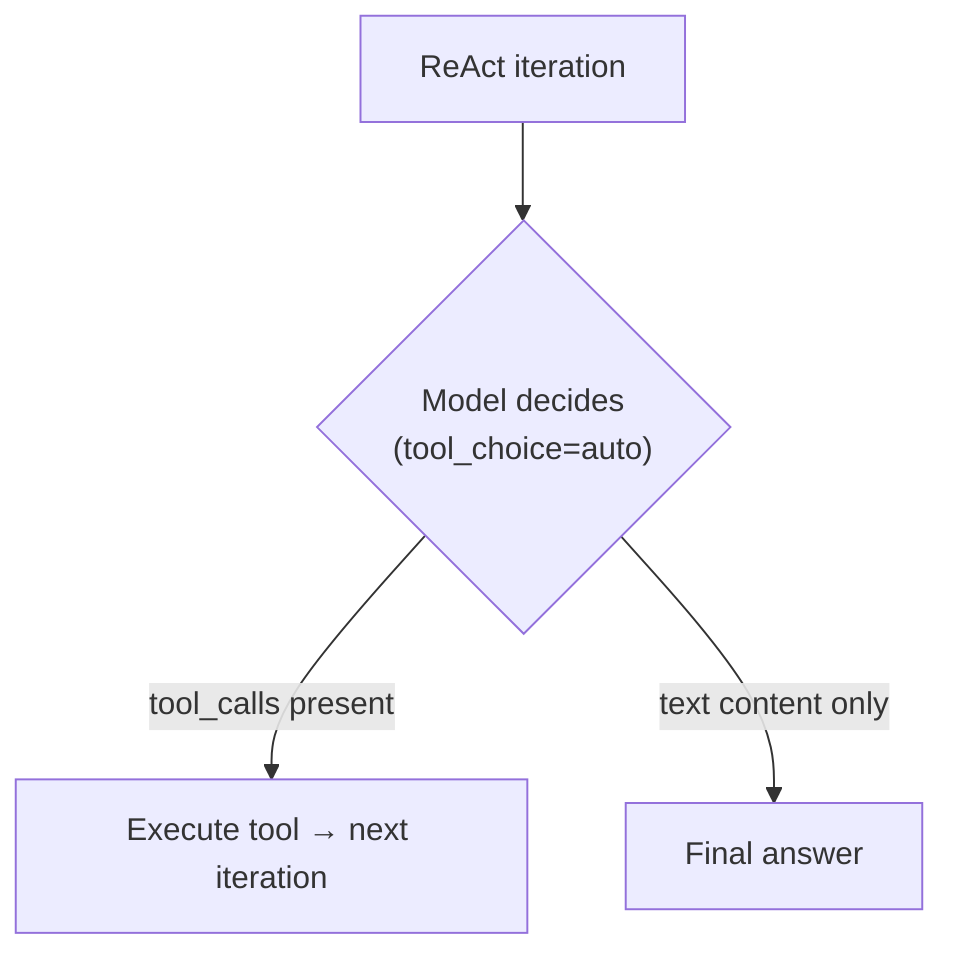
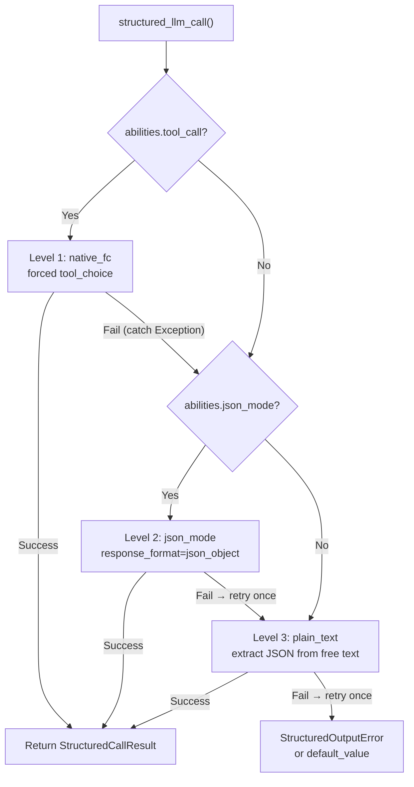
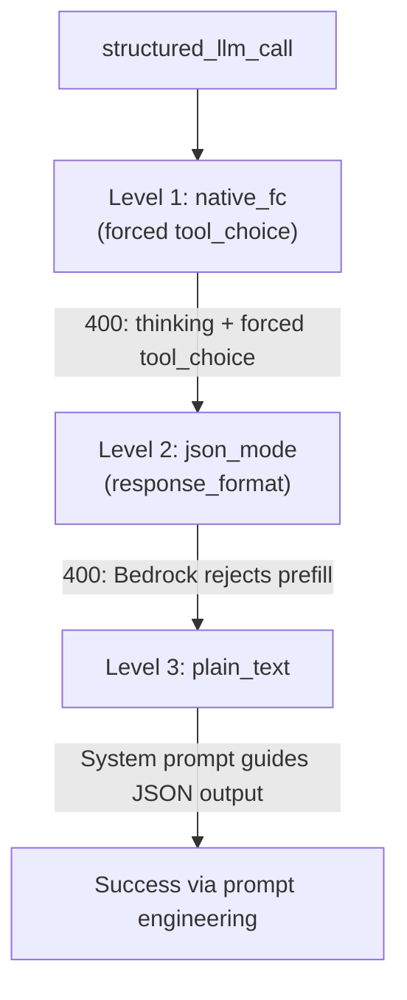

---
title: "LLM-Anbieter-Kompatibilität"
description: "Wie FIM One LLM-Aufrufe weiterleitet, die tool_choice-Architektur und anbieter-spezifische Fallstricke — besonders Anthropic Thinking + AWS Bedrock."
---## Provider-Erkennung

FIM One verwendet LiteLLM als universellen Adapter. Die Funktion `_resolve_litellm_model()` in `core/model/openai_compatible.py` ordnet die `LLM_BASE_URL` + `LLM_MODEL` des Benutzers einem LiteLLM-Modellidentifier mit Provider-Präfix zu. Das Präfix bestimmt, wie LiteLLM die Anfrage weiterleitet — natives API-Protokoll (Anthropic Messages API, Gemini, etc.) oder generisches OpenAI-kompatibles `/v1/chat/completions`.

Auflösungsreihenfolge:

1. **Expliziter Provider** (aus DB `ModelConfig.provider` Feld) — höchste Priorität. Wenn der Provider einem bekannten Domain in der URL entspricht, wird kein `api_base` zurückgegeben (LiteLLM leitet nativ weiter). Andernfalls wird `api_base` auf die Relay-URL gesetzt.
2. **Domain-Abgleich** gegen `KNOWN_DOMAINS` — offizielle API-Endpunkte werden anhand des Hostnamens erkannt.
3. **URL-Pfad-Hinweis** gegen `PATH_PROVIDER_HINTS` — häufig auf Relay-Plattformen wie UniAPI, wo `/claude` oder `/anthropic` im Pfad das Upstream-Protokoll anzeigt.
4. **Fallback** — `openai/` Präfix (generisches OpenAI-kompatibles).

| Domain / Pfad | Provider-Präfix | Protokoll |
|---|---|---|
| `api.openai.com` | `openai/` | OpenAI Chat Completions |
| `anthropic.com` | `anthropic/` | Anthropic Messages API |
| `generativelanguage.googleapis.com` | `gemini/` | Google Gemini |
| `api.deepseek.com` | `deepseek/` | DeepSeek (OpenAI-kompatibel) |
| `api.mistral.ai` | `mistral/` | Mistral |
| Pfad enthält `/claude` oder `/anthropic` | `anthropic/` | Anthropic Messages API (über Relay) |
| Pfad enthält `/gemini` | `gemini/` | Google Gemini (über Relay) |
| Alles andere | `openai/` | Generisches OpenAI-kompatibles |

Wenn das Provider-Präfix ein natives Protokoll ist (anthropic, gemini, etc.) und die URL nicht der offizielle Endpunkt ist, verwendet LiteLLM das native Protokoll, sendet Anfragen aber an den `api_base` des Relays. Das bedeutet, dass Provider-spezifische Verhaltensweisen — einschließlich des unten beschriebenen Bedrock-Prefill-Problems — gelten, unabhängig davon, ob die Anfrage zur offiziellen API oder über ein Relay geht.

<Warning>
Wenn Ihre Relay-URL `/claude` im Pfad enthält, leitet FIM One automatisch über Anthropics natives Protokoll weiter. Dies ist normalerweise korrekt (besseres Streaming, Thinking-Unterstützung), bedeutet aber, dass Provider-spezifische Verhaltensweisen gelten — einschließlich des unten beschriebenen Bedrock-Prefill-Problems.
</Warning>## tool_choice — die vier Modi

Der Parameter `tool_choice` ist über das OpenAI-Format standardisiert. LiteLLM übersetzt ihn vor dem Senden der Anfrage in das native Protokoll jedes Anbieters.

| Modus | Bedeutung | Anbieterunterstützung |
|---|---|---|
| `"auto"` | Modell entscheidet, ob ein Tool aufgerufen oder mit Text geantwortet wird | Alle Anbieter |
| `"required"` | Muss ein Tool aufrufen, aber Modell wählt welches | Die meisten Anbieter |
| `{"type":"function","function":{"name":"X"}}` | Muss Funktion X spezifisch aufrufen | Die meisten Anbieter — **inkompatibel mit Anthropic thinking** |
| `"none"` | Kann keine Tools verwenden, nur Text | Alle Anbieter |

Der Unterschied zwischen `"auto"` und erzwungen (`{"type":"function",...}`) ist der Kern jedes Kompatibilitätsproblems in FIM One. Diese beiden Modi werden von völlig unterschiedlichen Subsystemen mit unterschiedlichen Anforderungen verwendet.## Wo tool_choice verwendet wird

Zwei Subsysteme verwenden `tool_choice`, und sie verwenden es auf grundlegend unterschiedliche Weise.### ReAct engine — tool_choice="auto"

Die ReAct-Schleife erfordert, dass das Modell in jeder Iteration entscheidet: ein Tool aufrufen oder eine endgültige Antwort geben. Nur `"auto"` macht hier Sinn — das Modell wählt frei zwischen der Erzeugung von `tool_calls` oder Textinhalten. Dies ist kompatibel mit allen Anbietern, allen Modellen und allen Modi, einschließlich erweitertem Denken.



Die ReAct-Engine verwendet natives Function Calling (`_run_native`), wenn `abilities["tool_call"] = True`, und fällt andernfalls auf den JSON-in-Content-Modus (`_run_json`) zurück. Beide Modi verwenden `"auto"` — der Unterschied besteht darin, ob Tools über den Parameter `tools` übergeben oder in der System-Eingabeaufforderung beschrieben werden. Siehe [ReAct Engine — Dual-mode execution](/architecture/react-engine#dual-mode-execution) für Details.### structured_llm_call — tool_choice=forced

One-shot strukturierte Extraktion (Schema-Annotation, DAG-Planung, Plan-Analyse). Erzwingt den Aufruf einer bestimmten virtuellen Funktion durch das Modell und garantiert strukturierte JSON-Ausgabe. Dies ist die Aufrufstelle, die anbieterspezifische Fehler auslöst.

`structured_llm_call` implementiert eine 3-stufige Degradationskette:



Der kritische Designunterschied: Der Fallback von `structured_llm_call` ist **Laufzeit** — er versucht dynamisch jede Stufe und fängt Ausnahmen ab, um durchzufallen. Die Modusauswahl der ReAct-Engine ist **Build-Zeit** — sie prüft `_native_mode_active` einmalig am Anfang und verpflichtet sich auf einen Modus für die gesamte Schleife. Das bedeutet, dass `structured_llm_call` sich transparent von anbieterspezifischen 400-Fehlern erholen kann, während ReAct darauf angewiesen ist, dass der Modus von Anfang an korrekt gewählt wird.## Die Bedrock-Prefill-Falle

Wenn `response_format={"type":"json_object"}` für ein Modell übergeben wird, das mit dem Präfix `anthropic/` aufgelöst wird, injiziert LiteLLM intern eine Assistant-Prefill-Nachricht, um den JSON-Modus zu simulieren. Die Anthropic Messages API hat keinen nativen `response_format`-Parameter, daher approximiert LiteLLM dies, indem eine öffnende Klammer als Assistant-Inhalt vorangestellt wird:

```json
{"role": "assistant", "content": "{"}
```

Dies funktioniert auf Anthropics direkter API. Jedoch lehnen neuere AWS Bedrock-Modellversionen jedes Gespräch ab, dessen letzte Nachricht `role: "assistant"` hat — sie nennen dies „Assistant Message Prefill" und werfen:

```
ValidationException: This model does not support assistant message prefill.
The conversation must end with a user message.
```

Dieser Fehler tritt nur auf, wenn **alle drei Bedingungen** gleichzeitig erfüllt sind:

1. Das Modell wird mit dem Präfix `anthropic/` aufgelöst (über Domain-Match oder URL-Pfad-Hinweis).
2. `response_format={"type":"json_object"}` wird übergeben (der json_mode-Codepfad in `structured_llm_call`).
3. Das tatsächliche Backend ist AWS Bedrock (das Prefill ablehnt).

<Warning>
Dies betrifft NICHT natives Tool Calling (`tool_choice="auto"` mit `tools=`-Parameter). Die Prefill-Injektion erfolgt nur für `response_format`. Die ReAct-Agent-Ausführung ist völlig unbeeinträchtigt.
</Warning>

Der Fehlerpfad in der Praxis sieht so aus:



Wenn sowohl Level 1 (Thinking-Konflikt) als auch Level 2 (Bedrock-Prefill) fehlschlagen, wird das System immer noch auf Level 3 wiederhergestellt — aber auf Kosten von zwei verschwendeten LLM-Aufrufen pro strukturierter Extraktion. Die folgende Korrektur eliminiert den verschwendeten json_mode-Aufruf.### Die Lösung: json_mode_enabled

Ein Pro-Modell-Flag `json_mode_enabled` kontrolliert, ob Level 2 (json_mode) jemals versucht wird:

- **DB-konfigurierte Modelle**: Umschalter in Admin → Models → Advanced settings. Das Flag wird auf `ModelConfig.json_mode_enabled` gespeichert (Standard `TRUE`).
- **ENV-konfigurierte Modelle**: setzen Sie `LLM_JSON_MODE_ENABLED=false` in Ihrer Umgebung.
- **Effekt**: wenn deaktiviert, gibt `abilities["json_mode"]` `False` zurück → `response_format` wird nie übergeben → kein Prefill → Bedrock funktioniert. Die Degradationskette wird zu `native_fc → plain_text`, wobei der zum Scheitern verurteilte json_mode-Aufruf vollständig übersprungen wird.
- **Kein Qualitätsverlust**: das Modell gibt weiterhin gültiges JSON zurück, weil das System Prompt es anweist. Die plain_text-Ebene verwendet `extract_json()` um JSON aus Freitextinhalten zu analysieren, was zuverlässig mit modernen Modellen funktioniert.## Anthropic thinking + forced tool_choice

Anthropic's API lehnt `tool_choice={"type":"function","function":{"name":"X"}}` ab, wenn extended thinking aktiviert ist. Der Fehler:

```
Thinking may not be enabled when tool_choice forces tool use
```

Dies ist ein semantischer Konflikt auf Protokollebene: Das Erzwingen eines bestimmten Tool-Aufrufs widerspricht der Freiheit des Modells, darüber nachzudenken, welches Tool aufgerufen werden soll (oder ob überhaupt eines aufgerufen werden soll). Anthropic erzwingt diese Einschränkung; andere Anbieter tun dies nicht.

Der Konflikt **betrifft nur** Level 1 (native_fc) von `structured_llm_call`, das erzwungenes `tool_choice` verwendet, um strukturierte Ausgabe zu garantieren. Das vorhandene `try/except` in `_call_llm` fängt die 400-Antwort ab und fällt durch zu json_mode oder plain_text. Im `abilities`-Dict ist keine spezielle Behandlung erforderlich.

Entscheidend ist, dass `tool_choice="auto"` perfekt mit Anthropic thinking funktioniert. Die ReAct-Engine verwendet ausschließlich `"auto"`, daher ist sie nie betroffen.

<Warning>
Setzen Sie NICHT `abilities["tool_call"] = False`, um den Konflikt zwischen thinking und erzwungenem tool_choice zu umgehen. Das würde den `_run_native`-Modus von ReAct deaktivieren (der `tool_choice="auto"` verwendet und perfekt mit thinking funktioniert) und ihn in den `_run_json`-Modus zwingen. In `_run_json` muss das Modell gültiges JSON in seinem Inhalt produzieren – was weniger zuverlässig ist und auf Bedrock das Prefill-Problem auslösen könnte, wenn json_mode aktiviert ist. Die richtige Lösung besteht darin, die Fallback-Kette von `structured_llm_call` handhaben zu lassen.
</Warning>## Schnellreferenz: Was funktioniert wo

| Szenario | ReAct mode | structured_llm_call path | Notizen |
|---|---|---|---|
| OpenAI (beliebiges Modell) | `_run_native` | native_fc | Vollständige Unterstützung, keine Vorbehalte |
| Anthropic (kein Thinking) | `_run_native` | native_fc | Vollständige Unterstützung |
| Anthropic + Thinking | `_run_native` | native_fc → 400 → json_mode | Automatisches Fallback, ein verschwendeter Aufruf |
| Bedrock Relay (kein Thinking) | `_run_native` | native_fc | Vollständige Unterstützung |
| Bedrock Relay + Thinking | `_run_native` | native_fc → 400 → json_mode → 400 → plain_text | Zwei verschwendete Aufrufe; setzen Sie `json_mode_enabled=false` |
| Bedrock Relay + `json_mode_enabled=false` | `_run_native` | native_fc → 400 → plain_text | Empfohlene Konfiguration für Bedrock mit Thinking |
| Bedrock Relay (kein Thinking) + `json_mode_enabled=false` | `_run_native` | native_fc | Keine Auswirkung — native_fc erfolgreich beim ersten Versuch |
| Gemini | `_run_native` | native_fc | Vollständige Unterstützung |
| DeepSeek | `_run_native` | native_fc | Vollständige Unterstützung |
| Generisches OpenAI-kompatibles | `_run_native` | native_fc | Vollständige Unterstützung |
| Beliebiges Modell mit `tool_call=false` | `_run_json` | json_mode oder plain_text | Fallback für Modelle ohne Tool-Call-Unterstützung |

**Empfohlene Konfiguration für AWS Bedrock Relays:**

```bash# In .env oder Umgebung
LLM_JSON_MODE_ENABLED=false
```

Oder pro Modell in der Admin-Benutzeroberfläche: Admin → Models → Bedrock-Modell auswählen → Advanced → "JSON Mode" deaktivieren.

Dies eliminiert alle verschwendeten Aufrufe. Der Degradationspfad wird zu `native_fc → plain_text` (kein Denken) oder `native_fc → 400 → plain_text` (mit Denken). Beide Pfade sind schnell und zuverlässig.## Reasoning-Aufwand und Thinking-Konfiguration

FIM One stellt zwei Umgebungsvariablen zur Steuerung des erweiterten Thinking / Reasoning zur Verfügung:

| Variable | Werte | Effekt |
|---|---|---|
| `LLM_REASONING_EFFORT` | `low`, `medium`, `high` | Wird als `reasoning_effort` an LiteLLM übergeben. Anthropic: auf `thinking`-Parameter abgebildet. OpenAI o-series: durchgeleitet. Andere: stillschweigend verworfen (`drop_params=True`). |
| `LLM_REASONING_BUDGET_TOKENS` | integer (z. B. `10000`) | Nur Anthropic: setzt eine explizite `thinking.budget_tokens`-Obergrenze und umgeht LiteLLMs automatische Abbildung. Nützlich zur Kostenkontrolle bei Claude-Modellen. |

Wenn `reasoning_effort` gesetzt ist und das Modell als `anthropic/` aufgelöst wird, gelten zwei zusätzliche Verhaltensweisen:

1. **Temperatur wird auf 1.0 erzwungen.** Bedrock lehnt `temperature != 1.0` ab, wenn Thinking aktiviert ist. FIM One handhabt dies automatisch — keine Benutzeraktion erforderlich.
2. **GPT-5.x mit Tools**: `reasoning_effort` wird stillschweigend verworfen, wenn `tools` vorhanden sind, da der GPT-5-Endpunkt `/v1/chat/completions` die Kombination ablehnt. Dies betrifft nur die ReAct-Tool-Schleife; `structured_llm_call`-Aufrufe ohne `tools`-Parameter sind nicht betroffen.## Fehlerbehebung

**"This model does not support assistant message prefill"**
Bedrock + json_mode. Setzen Sie `LLM_JSON_MODE_ENABLED=false` oder deaktivieren Sie JSON Mode in den Admin-Modelleinstellungen.

**"Thinking may not be enabled when tool_choice forces tool use"**
Anthropic thinking + erzwungener Funktionsaufruf in `structured_llm_call`. Dies ist **erwartetes Verhalten, kein Fehler**. Die Fallback-Kette fängt den 400-Fehler ab, überspringt native_fc und ist erfolgreich bei json_mode oder plain_text. Das Protokoll befindet sich auf DEBUG-Ebene — Sie sehen es nur, wenn `LOG_LEVEL=DEBUG`. Kosten: ~300ms Netzwerk-Roundtrip, null Token (das Modell läuft nie bei einem 400). Keine Maßnahmen erforderlich.

**ReAct fällt unerwartet auf JSON Mode zurück**
Überprüfen Sie, dass `abilities["tool_call"]` des Modells `True` ist. Dies ist immer `True` für `OpenAICompatibleLLM`, aber eine benutzerdefinierte `BaseLLM`-Unterklasse könnte dies überschreiben. Überprüfen Sie mit dem Modelldetail-Endpunkt in der Admin API.

**structured_llm_call erschöpft alle Ebenen und wirft StructuredOutputError**
Das Modell konnte auf keiner Ebene gültiges JSON erzeugen. Dies ist selten bei modernen Modellen. Überprüfen Sie: (1) das Schema ist gültiges JSON Schema, (2) das Modell hat genug `max_tokens`, um die vollständige Antwort zu erzeugen, (3) die Systemaufforderung widerspricht nicht den Schemaanweisungen. Der DAG-Planer und der Analyzer bieten beide `default_value`-Fallbacks, daher wird dieser Fehler nur von Aufrufstellen weitergegeben, die Standardwerte explizit weglassen.