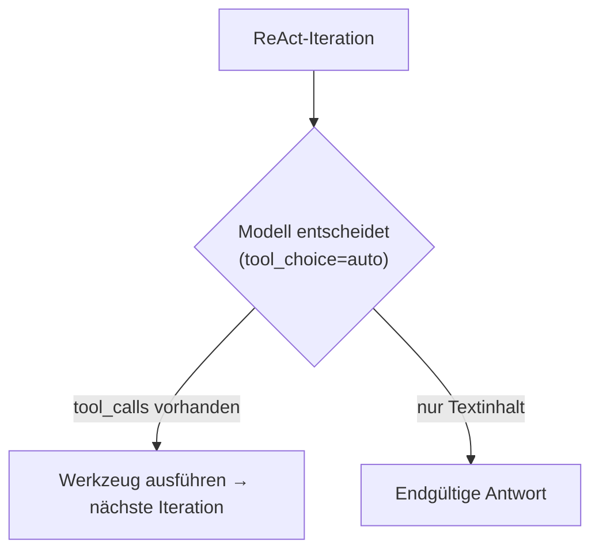
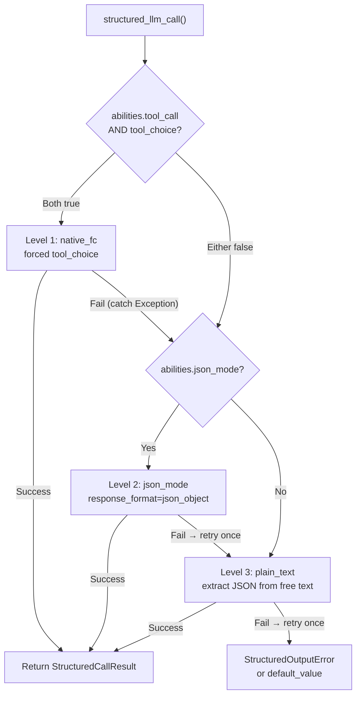

## Anbieter-Erkennung

FIM One verwendet LiteLLM als universellen Adapter. Die Funktion `_resolve_litellm_model()` in `core/model/openai_compatible.py` ordnet die `LLM_BASE_URL` + `LLM_MODEL` des Benutzers einem LiteLLM-Modellbezeichner mit einem Anbieter-Präfix zu. Das Präfix bestimmt, wie LiteLLM die Anfrage weiterleitet — natives API-Protokoll (Anthropic Messages API, Gemini, etc.) oder generisches OpenAI-kompatibles `/v1/chat/completions`.

Auflösungsreihenfolge:

1. **Expliziter Anbieter** (aus DB-Feld `ModelConfig.provider`) — höchste Priorität. Wenn der Anbieter einer bekannten Domäne in der URL entspricht, wird keine `api_base` zurückgegeben (LiteLLM leitet nativ weiter). Andernfalls wird `api_base` auf die Relay-URL gesetzt.
2. **Domänen-Abgleich** gegen `KNOWN_DOMAINS` — offizielle API-Endpunkte werden anhand des Hostnamens erkannt.
3. **URL-Pfad-Hinweis** gegen `PATH_PROVIDER_HINTS` — häufig auf Relay-Plattformen wie UniAPI, wo `/claude` oder `/anthropic` im Pfad das Upstream-Protokoll anzeigt.
4. **Fallback** — `openai/`-Präfix (generisches OpenAI-kompatibles).

| Domäne / Pfad | Anbieter-Präfix | Protokoll |
|---|---|---|
| `api.openai.com` | `openai/` | OpenAI Chat Completions |
| `anthropic.com` | `anthropic/` | Anthropic Messages API |
| `generativelanguage.googleapis.com` | `gemini/` | Google Gemini |
| `api.deepseek.com` | `deepseek/` | DeepSeek (OpenAI-kompatibel) |
| `api.mistral.ai` | `mistral/` | Mistral |
| Pfad enthält `/claude` oder `/anthropic` | `anthropic/` | Anthropic Messages API (über Relay) |
| Pfad enthält `/gemini` | `gemini/` | Google Gemini (über Relay) |
| Alles andere | `openai/` | Generisches OpenAI-kompatibles |

Wenn das Anbieter-Präfix ein natives Protokoll ist (anthropic, gemini, etc.) und die URL nicht der offizielle Endpunkt ist, verwendet LiteLLM das native Protokoll, sendet Anfragen aber an die `api_base` des Relays. Dies bedeutet, dass anbieter-spezifische Verhaltensweisen — einschließlich des unten beschriebenen Bedrock-Prefill-Problems — gelten, unabhängig davon, ob die Anfrage zur offiziellen API oder über ein Relay geht.

<Warning>
Wenn Ihre Relay-URL `/claude` im Pfad enthält, leitet FIM One automatisch über das native Anthropic-Protokoll weiter. Dies ist normalerweise korrekt (besseres Streaming, Thinking-Unterstützung), bedeutet aber, dass anbieter-spezifische Verhaltensweisen gelten — einschließlich des unten beschriebenen Bedrock-Prefill-Problems.
</Warning>

## tool_choice — die vier Modi

Der Parameter `tool_choice` ist über das OpenAI-Format standardisiert. LiteLLM übersetzt ihn vor dem Senden der Anfrage in das native Protokoll jedes Anbieters.

| Modus | Bedeutung | Anbieterunterstützung |
|---|---|---|
| `"auto"` | Modell entscheidet, ob ein Werkzeug aufgerufen oder mit Text geantwortet wird | Alle Anbieter |
| `"required"` | Muss ein Werkzeug aufrufen, aber Modell wählt welches | Die meisten Anbieter |
| `{"type":"function","function":{"name":"X"}}` | Muss Funktion X spezifisch aufrufen | Die meisten Anbieter — **nicht kompatibel mit Anthropic Thinking** |
| `"none"` | Kann keine Werkzeuge verwenden, nur Text | Alle Anbieter |

Die Unterscheidung zwischen `"auto"` und erzwungen (`{"type":"function",...}`) ist der Kern jedes Kompatibilitätsproblems in FIM One. Diese beiden Modi werden von völlig unterschiedlichen Subsystemen mit unterschiedlichen Anforderungen verwendet.

## Wo tool_choice verwendet wird

Zwei Subsysteme verwenden `tool_choice`, und sie verwenden es auf grundlegend unterschiedliche Weise.

### ReAct-Engine — tool_choice="auto"

Die ReAct-Schleife erfordert, dass das Modell in jeder Iteration entscheidet: ein Werkzeug aufrufen oder eine endgültige Antwort geben. Nur `"auto"` macht hier Sinn — das Modell wählt frei zwischen der Erzeugung von `tool_calls` oder Textinhalten. Dies ist mit allen Anbietern, allen Modellen und allen Modi kompatibel, einschließlich erweitertem Denken.



Die ReAct-Engine verwendet natives Function Calling (`_run_native`), wenn `abilities["tool_call"] = True`, und fällt andernfalls auf den JSON-im-Inhalt-Modus (`_run_json`) zurück. Beide Modi verwenden `"auto"` — der Unterschied besteht darin, ob Werkzeuge über den `tools`-Parameter übergeben oder in der Systemaufforderung beschrieben werden. Weitere Informationen finden Sie unter [ReAct-Engine — Dual-Mode-Ausführung](/architecture/react-engine#dual-mode-execution).

### structured_llm_call — tool_choice=forced

Einmalige strukturierte Extraktion (Schema-Annotation, DAG-Planung, Plan-Analyse). Erzwingt, dass das Modell eine bestimmte virtuelle Funktion aufruft und garantiert strukturierte JSON-Ausgabe. Dies ist die Aufrufstelle, die anbieterspezifische Fehler auslöst.

`structured_llm_call` implementiert eine 3-stufige Degradationskette:



Der kritische Designunterschied: Das Fallback von `structured_llm_call` ist **Laufzeit** — es versucht dynamisch jede Stufe und fängt Ausnahmen ab, um durchzufallen. Die Modusauswahl der ReAct-Engine ist **Build-Zeit** — sie prüft `_native_mode_active` einmal am Anfang und verpflichtet sich auf einen Modus für die gesamte Schleife. Das bedeutet, dass `structured_llm_call` sich transparent von anbieterspezifischen 400-Fehlern erholen kann, während ReAct darauf angewiesen ist, dass der Modus von Anfang an korrekt gewählt wird.

## Die Bedrock-Prefill-Falle

Wenn `response_format={"type":"json_object"}` für ein Modell übergeben wird, das mit dem Präfix `anthropic/` aufgelöst wird, injiziert LiteLLM intern eine Assistent-Prefill-Nachricht, um den JSON-Modus zu simulieren. Die Anthropic Messages API hat keinen nativen `response_format`-Parameter, daher approximiert LiteLLM dies durch Voranstellen einer öffnenden Klammer als Assistent-Inhalt:

```json
{"role": "assistant", "content": "{"}
```

Dies funktioniert auf Anthropics direkter API. Jedoch lehnen neuere AWS Bedrock-Modellversionen jede Konversation ab, deren letzte Nachricht `role: "assistant"` hat — sie nennen dies „Assistant Message Prefill" und werfen:

```
ValidationException: This model does not support assistant message prefill.
The conversation must end with a user message.
```

Dieser Fehler tritt nur auf, wenn **alle drei Bedingungen** gleichzeitig erfüllt sind:

1. Das Modell wird mit dem Präfix `anthropic/` aufgelöst (über Domain-Abgleich oder URL-Pfad-Hinweis).
2. `response_format={"type":"json_object"}` wird übergeben (der json_mode-Codepfad in `structured_llm_call`).
3. Das eigentliche Backend ist AWS Bedrock (das Prefill ablehnt).

<Warning>
Dies betrifft NICHT natives Tool Calling (`tool_choice="auto"` mit `tools=`-Parameter). Die Prefill-Injektion erfolgt nur für `response_format`. Die ReAct-Agent-Ausführung ist völlig unbeeinträchtigt.
</Warning>

Wenn sowohl Level 1 (native_fc) als auch Level 2 (json_mode) auf Bedrock fehlschlagen, erholt sich das System auf Level 3 (plain_text). Das unten beschriebene Flag `json_mode_enabled` eliminiert den verschwendeten Level-2-Aufruf.

### Die Lösung: json_mode_enabled

Ein pro-Modell-Flag `json_mode_enabled` steuert, ob Level 2 (json_mode) jemals versucht wird:

- **DB-konfigurierte Modelle**: Umschalter in Admin → Models → Advanced settings. Das Flag wird auf `ModelProviderModel.json_mode_enabled` gespeichert (Standard `TRUE`).
- **ENV-konfigurierte Modelle**: setzen Sie `LLM_JSON_MODE_ENABLED=false` in Ihrer Umgebung.
- **Auswirkung**: wenn deaktiviert, gibt `abilities["json_mode"]` `False` zurück → `response_format` wird nie übergeben → keine Prefill → Bedrock funktioniert. Die Degradationskette wird zu `native_fc → plain_text`, wobei der fehlgeschlagene json_mode-Aufruf vollständig übersprungen wird.
- **Kein Qualitätsverlust**: das Modell gibt weiterhin gültiges JSON zurück, da das System-Prompt es anweist. Die plain_text-Ebene verwendet `extract_json()` zum Parsen von JSON aus Freitext-Inhalten, was bei modernen Modellen zuverlässig funktioniert.

## Thinking-Modelle + erzwungene tool_choice

Einige Modelle haben erweitertes Denken (Chain-of-Thought) dauerhaft aktiviert. Ihre APIs lehnen erzwungene `tool_choice` ab, da das Erzwingen eines bestimmten Funktionsaufrufs der Freiheit des Modells zum ersten Nachdenken widerspricht:

```
tool_choice 'specified' is incompatible with thinking enabled
```

Anthropic erzwingt diese Einschränkung auf Protokollebene, und einige andere Anbieter (z. B. Moonshot AI / Kimi K2.5) folgen demselben Muster.

Für Anthropic-Modelle verwaltet `structured_llm_call` dies automatisch, indem `reasoning_effort=None` beim Aufrufen von native_fc übergeben wird, wodurch erweitertes Denken für diesen spezifischen Aufruf deaktiviert wird. Strukturierte Ausgabeaufrufe benötigen **Schemakonformität**, nicht tiefes Denken – das Deaktivieren des Denkens hier ist sowohl korrekt als auch vorteilhaft (niedrigere Latenz, niedrigere Kosten).

Jedoch haben einige Modelle (z. B. Kimi K2.5) Denken dauerhaft aktiviert, ohne dass es extern deaktiviert werden kann. Für diese Modelle schlägt native_fc immer mit einem 400-Fehler fehl, was vor der Degradationskette etwa 10 Sekunden verschwendete Latenz pro strukturiertem Aufruf hinzufügt, bevor sie zu json_mode fällt.

### Die Lösung: tool_choice_enabled

Ein Pro-Modell-Flag `tool_choice_enabled` steuert, ob Level 1 (native_fc) jemals versucht wird:

- **DB-konfigurierte Modelle**: Umschalter in Admin → Models → Advanced → "Native Function Calling". Das Flag wird auf `ModelProviderModel.tool_choice_enabled` gespeichert (Standard `TRUE`).
- **ENV-konfigurierte Modelle**: setzen Sie `LLM_TOOL_CHOICE_ENABLED=false` in Ihrer Umgebung.
- **Auswirkung**: wenn deaktiviert, gibt `abilities["tool_choice"]` `False` zurück → die Degradationskette beginnt bei Level 2 (json_mode) oder Level 3 (plain_text) und überspringt native_fc vollständig. Dies eliminiert die ~10s Strafe pro strukturiertem Aufruf für inkompatible Modelle.
- **ReAct-Agent nicht betroffen**: `tool_choice_enabled` steuert nur die erzwungene Werkzeugauswahl in `structured_llm_call`. Die ReAct-Engine verwendet `tool_choice="auto"` (Modell entscheidet frei), was mit allen Modellen unabhängig von dieser Einstellung funktioniert.

<Note>
`tool_choice_enabled` und `tool_call` sind separate Ability-Flags. `tool_call` (immer `True` für `OpenAICompatibleLLM`) steuert, ob Werkzeuge dem Modell überhaupt übergeben werden — das Deaktivieren würde den ReAct-Agent beschädigen. `tool_choice` steuert nur, ob **erzwungene** Werkzeugauswahl für die Strukturierte-Ausgabe-Extraktion versucht wird.
</Note>

`tool_choice="auto"` wird durch den Thinking-Modus nicht beeinflusst. Die ReAct-Engine verwendet ausschließlich `"auto"`, daher funktioniert die Agent-Ausführung mit aktiviertem Thinking.

<Warning>
Setzen Sie NICHT `abilities["tool_call"] = False`, um diese Einschränkung zu vermeiden. Das würde ReActs `_run_native`-Modus deaktivieren (der `tool_choice="auto"` verwendet und mit Thinking gut funktioniert) und würde es in den weniger zuverlässigen `_run_json`-Modus zwingen.
</Warning>

<Note>
**Hinweis zur Provider-Migration:** Einige Drittanbieter-Relays löschen stillschweigend nicht unterstützte Parameter wie `reasoning_effort` (`drop_params=True`), daher wird Thinking nie aktiviert, auch wenn es konfiguriert ist. Bei der Migration zu einem Provider, der Thinking ordnungsgemäß unterstützt (Bedrock, direkte Anthropic API), stellt `reasoning_effort=None` in native_fc konsistentes Verhalten sicher. Es ist keine Benutzeraktion erforderlich — strukturierte Ausgabe funktioniert identisch über alle Provider hinweg.
</Note>

## Kurzreferenz: Was funktioniert wo

| Szenario | ReAct-Modus | structured_llm_call-Pfad | Hinweise |
|---|---|---|---|
| OpenAI (beliebiges Modell) | `_run_native` | native_fc | Vollständige Unterstützung |
| Anthropic (kein Denken) | `_run_native` | native_fc | Vollständige Unterstützung |
| Anthropic + Denken | `_run_native` | native_fc (Denken automatisch deaktiviert) | Denken nur für strukturierte Ausgabe deaktiviert |
| Bedrock-Relay (kein Denken) | `_run_native` | native_fc | Vollständige Unterstützung |
| Bedrock-Relay + Denken | `_run_native` | native_fc (Denken automatisch deaktiviert) | Denken nur für strukturierte Ausgabe deaktiviert |
| Gemini | `_run_native` | native_fc | Vollständige Unterstützung |
| DeepSeek (kein Denken) | `_run_native` | native_fc | Vollständige Unterstützung |
| DeepSeek R1 (Denken) | `_run_native` | json_mode (setze `tool_choice_enabled=false`) | Denken immer aktiviert; native_fc überspringen |
| Kimi K2 (kein Denken) | `_run_native` | native_fc | Vollständige Unterstützung |
| Kimi K2.5 (Denken) | `_run_native` | json_mode (setze `tool_choice_enabled=false`) | Denken immer aktiviert; native_fc überspringen |
| Generisch OpenAI-kompatibel | `_run_native` | native_fc | Vollständige Unterstützung |
| Beliebiges Modell mit `tool_call=false` | `_run_json` | json_mode oder plain_text | Fallback für Modelle ohne Tool-Call-Unterstützung |

## Empfohlene Pro-Modell-Konfiguration

Sowohl `tool_choice_enabled` als auch `json_mode_enabled` können pro Modell in Admin → Models → Advanced settings umgeschaltet werden. Die Standardwerte (beide `TRUE`) funktionieren für die meisten Anbieter. Passen Sie sie nur an, wenn Sie auf Fehler oder unnötige Latenz stoßen.

| Modelltyp | Native FC | JSON Mode | Grund |
|---|---|---|---|
| OpenAI GPT-Serie | ON | ON | Vollständige Unterstützung — Standardwerte sind korrekt |
| Anthropic Claude | ON | ON | Thinking wird für native_fc automatisch deaktiviert |
| Google Gemini | ON | ON | Vollständige Unterstützung |
| DeepSeek V3 / Coder | ON | ON | Vollständige Unterstützung |
| **DeepSeek R1 (thinking)** | **OFF** | ON | Thinking immer aktiviert; native_fc abgelehnt |
| **Kimi K2.5 (thinking)** | **OFF** | ON | Thinking immer aktiviert; native_fc abgelehnt |
| Kimi K2 (non-thinking) | ON | ON | Vollständige Unterstützung |
| **AWS Bedrock Relay** | ON | **OFF** | Bedrock lehnt Assistant-Prefill in json_mode ab |
| Schwache / kleine Modelle | OFF | OFF | Direkt zur plain_text-Extraktion |

<Tip>
**Wann ändern:** Wenn Sie in Ihren Logs `structured_llm_call: native_fc call raised` Warnungen gefolgt von erfolgreicher json_mode-Extraktion sehen, profitiert das Modell nicht von native_fc. Deaktivieren Sie "Native Function Calling" für dieses Modell, um den verschwendeten API-Aufruf zu eliminieren (~10s pro strukturierter Ausgabeanfrage).
</Tip>

**ENV-level Overrides** gelten für alle Modelle, die über Umgebungsvariablen konfiguriert werden (nicht Admin UI):

```bash
# Disable native_fc globally (for thinking-model-only deployments)
LLM_TOOL_CHOICE_ENABLED=false

# Disable json_mode globally (for Bedrock relay deployments)
LLM_JSON_MODE_ENABLED=false
```

## Reasoning-Aufwand und Thinking-Konfiguration

FIM One stellt zwei Umgebungsvariablen zur Steuerung von erweitertem Thinking / Reasoning zur Verfügung:

| Variable | Werte | Effekt |
|---|---|---|
| `LLM_REASONING_EFFORT` | `low`, `medium`, `high` | Wird als `reasoning_effort` an LiteLLM übergeben. Anthropic: auf `thinking`-Parameter abgebildet. OpenAI o-Serie: durchgeleitet. Andere: stillschweigend verworfen (`drop_params=True`). |
| `LLM_REASONING_BUDGET_TOKENS` | Integer (z. B. `10000`) | Nur Anthropic: setzt eine explizite `thinking.budget_tokens`-Obergrenze und umgeht LiteLLMs automatische Abbildung. Nützlich zur Kostenkontrolle bei Claude-Modellen. |

Wenn `reasoning_effort` gesetzt ist und das Modell als `anthropic/` aufgelöst wird, gelten zwei zusätzliche Verhaltensweisen:

1. **Temperatur wird auf 1,0 erzwungen.** Bedrock lehnt `temperature != 1.0` ab, wenn Thinking aktiviert ist. FIM One handhabt dies automatisch — keine Benutzeraktion erforderlich.
2. **GPT-5.x mit Tools**: `reasoning_effort` wird stillschweigend verworfen, wenn `tools` vorhanden sind, da der GPT-5-Endpunkt `/v1/chat/completions` die Kombination ablehnt. Dies betrifft nur die ReAct-Tool-Schleife; `structured_llm_call`-Aufrufe ohne `tools`-Parameter sind nicht betroffen.

## Defensive Parsing für strukturierte Ausgabe

Auch wenn native_fc korrekt funktioniert, enthält die Pipeline für strukturierte Ausgabe eine defensive Parsing-Schicht, um Grenzfälle von beliebigen Anbietern oder Kompatibilitätsschichten zu behandeln.

Der `_dict_to_steps`-Parser des DAG-Planers behandelt drei häufige Grenzfälle:

1. **Einzelnes Objekt statt Array.** Einige Modelle geben `{"steps": {"id": "1", "task": "..."}}` (ein einzelnes Step-Objekt) statt `{"steps": [{"id": "1", "task": "..."}]}` (ein Array) zurück. Der Parser erkennt dies, indem er auf `id`- oder `task`-Schlüssel prüft und das Objekt in eine Liste einbindet.

2. **Doppelt kodierter JSON-String.** Wenn strukturierte Ausgabe auf json_mode zurückfällt (das keine Schema-Erzwingung hat), geben einige Anbieter den `steps`-Wert als JSON-String statt als natives Array zurück – z. B. `{"steps": "[{\"id\": \"1\", ...}]"}`. Dieser String kann auch Zeilenumbrüche enthalten (aus der Formatierung des Modells), die Standard-`json.loads` unterbrechen. Der Parser verwendet `extract_json_value()` (das `_repair_json_strings` enthält), um folgende Fälle zu behandeln:
   - Literale Zeilenumbrüche innerhalb von JSON-Stringwerten
   - Ungültige Escape-Sequenzen (häufig bei LaTeX- oder Code-Inhalten)
   - Andere Serialisierungsbesonderheiten von Kompatibilitätsschichten

3. **Fehlender `steps`-Wrapper.** Das Modell kann einen einzelnen Step als Top-Level-Objekt ohne den `steps`-Wrapper-Schlüssel zurückgeben. Der Parser erkennt `id` und `task` auf der Root-Ebene und bindet sie entsprechend ein.

<Note>
Unter normalen Bedingungen gibt native_fc korrekt strukturierte Tool-Call-Argumente zurück und diese Grenzfälle treten nicht auf. Die defensiven Parser existieren als Sicherheitsnetz für benutzerdefinierte `BaseLLM`-Unterklassen, ungewöhnliche Anbieterverhalten oder Fallback-Szenarien, in denen strukturierte Ausgabe zu json_mode oder plain_text degradiert.
</Note>

## Fehlerbehebung

**"This model does not support assistant message prefill"**
Bedrock + json_mode. Setzen Sie `LLM_JSON_MODE_ENABLED=false` oder deaktivieren Sie JSON Mode in den Admin-Modelleinstellungen.

**"Thinking may not be enabled when tool_choice forces tool use"** / **"tool_choice 'specified' is incompatible with thinking enabled"**
Bei Anthropic-Modellen deaktiviert `structured_llm_call` das Denken für native_fc-Aufrufe automatisch. Bei anderen Anbietern mit immer aktiviertem Denken (z. B. Kimi K2.5) deaktivieren Sie "Native Function Calling" in den erweiterten Einstellungen des Modells oder setzen Sie `LLM_TOOL_CHOICE_ENABLED=false` global. Die Degradationskette überspringt native_fc und extrahiert strukturierte Ausgaben stattdessen über json_mode oder plain_text.

**"DAG pipeline failed: LLM 'steps' is not an array"**
Das LLM hat das Feld `steps` als String oder einzelnes Objekt statt als Array zurückgegeben. Dies bedeutet normalerweise, dass die strukturierte Ausgabe zu json_mode gefallen ist (das keine Schemaerzwingung hat). Überprüfen Sie das Protokoll auf `structured_llm_call: level=xxx` — wenn es `json_mode` statt `native_fc` anzeigt, schlägt native_fc stillschweigend fehl. Wenn Sie eine benutzerdefinierte `BaseLLM`-Unterklasse verwenden, überprüfen Sie, ob sie das Kwarg `reasoning_effort` akzeptiert.

**ReAct fällt unerwartet zu JSON-Modus zurück**
Überprüfen Sie, dass `abilities["tool_call"]` des Modells `True` ist. Dies ist immer `True` für `OpenAICompatibleLLM`, aber eine benutzerdefinierte `BaseLLM`-Unterklasse könnte es überschreiben. Überprüfen Sie mit dem Modelldetail-Endpunkt in der Admin-API.

**structured_llm_call erschöpft alle Ebenen und löst StructuredOutputError aus**
Das Modell konnte auf keiner Ebene gültiges JSON erzeugen. Dies ist selten bei modernen Modellen. Überprüfen Sie: (1) das Schema ist gültiges JSON Schema, (2) das Modell hat genug `max_tokens`, um die vollständige Antwort zu erzeugen, (3) die Systemaufforderung widerspricht nicht den Schemaanweisungen. Der DAG-Planer und der Analyzer stellen beide `default_value`-Fallbacks bereit, daher wird dieser Fehler nur von Aufrufstellen weitergegeben, die Standardwerte explizit weglassen.
