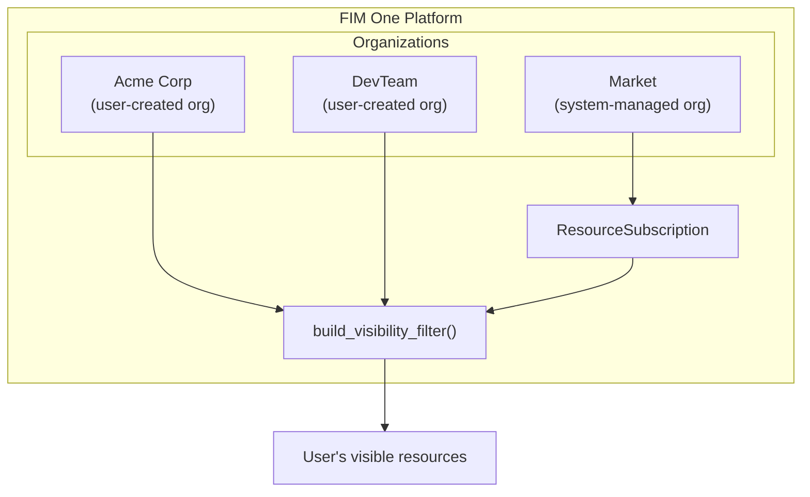
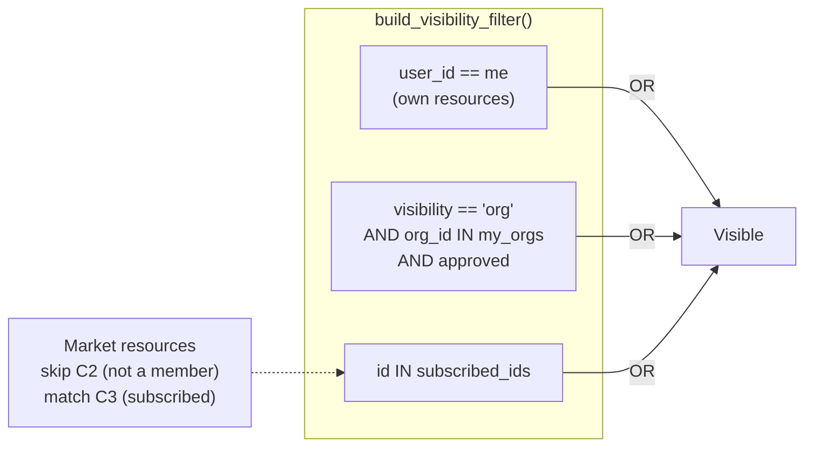
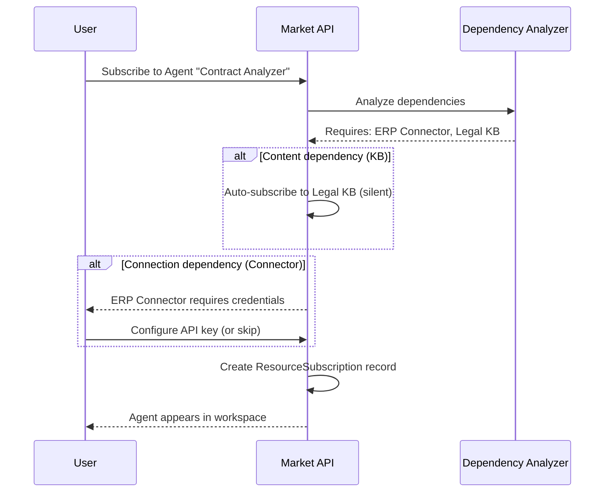
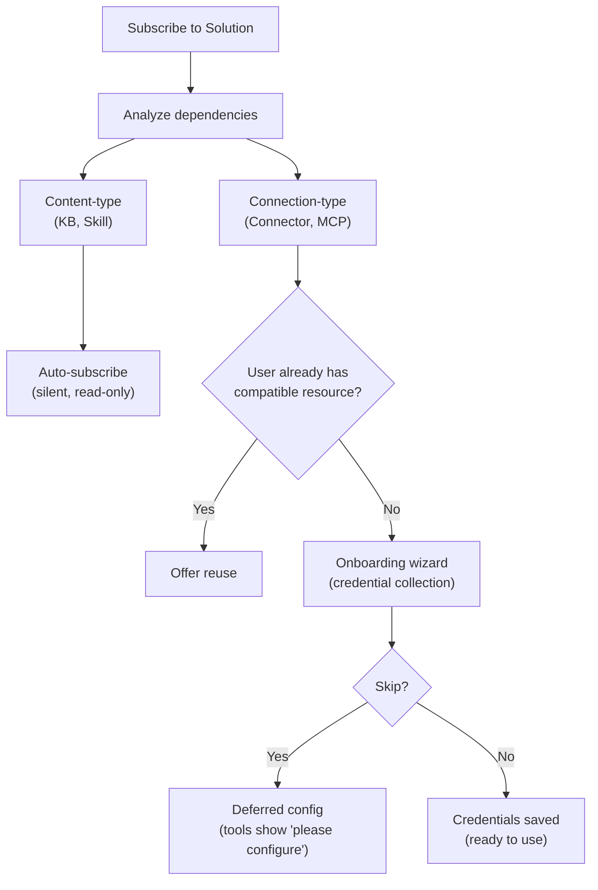

## Übersicht

Der Market ist FIM Ones Ressourcen-Marktplatz. Benutzer veröffentlichen Ressourcen, die sie erstellt haben, andere entdecken und abonnieren diese, und abonnierte Ressourcen erscheinen im Arbeitsbereich des Abonnenten, als wären sie ihre eigenen. Das gesamte System basiert auf einer einzigen architektonischen Erkenntnis: **Der Market ist eine Organisation** — eine vom System verwaltete Shadow-Org mit speziellen Vertrauensregeln.

Diese Seite erläutert die interne Architektur des Market. Eine benutzerorientierte Übersicht über Veröffentlichung und Abonnement finden Sie unter [Market (Features)](/concepts/market). Informationen darüber, wie abonnierte Ressourcen in Tool-Sets geladen werden, finden Sie unter [Agent & Resource Discovery](/architecture/agent-discovery).

## Zwei-Ebenen-Klassifizierung

Der Marketplace organisiert Ressourcen in zwei Kategorien basierend auf dem, was die Ressource tut, nicht auf ihrer Implementierung.

### Lösungen

Lösungen sind Dinge, die **für Sie funktionieren**. Ein Benutzer abonniert eine Lösung und erhält eine einsatzbereite Funktionalität.

| Ressourcentyp | Funktion |
|---|---|
| **Agent** | Ein konversationeller KI-Assistent mit gebundenen Tools, Wissen und Anweisungen |
| **Skill** | Ein globales SOP (Standard Operating Procedure), das mehrere Agenten über `call_agent` orchestrieren kann |
| **Workflow** | Ein DAG-basierter Automatisierungsfluss mit visueller Bearbeitung und deterministischer Ausführung |

Lösungen können von anderen Ressourcen abhängen. Ein Agent könnte einen spezifischen Connector für seine API-Aufrufe und eine Knowledge Base für seine Abruf-Pipeline benötigen. Der Market verwaltet diese Abhängigkeiten während des Abonnements automatisch (siehe [Dependency resolution](#dependency-resolution) unten).

### Komponenten

Komponenten sind **wiederverwendbare Bausteine** für Entwickler. Sie stellen Funktionen bereit, die Lösungen nutzen.

| Ressourcentyp | Funktion |
|---|---|
| **Connector** | Eine API- oder Datenbankintegrations-Adapter-Definition |
| **MCP Server** | Eine Tool-Service-Konfiguration mit dem Model Context Protocol |

Komponenten sind einfacher zu abonnieren – sie haben keine internen Abhängigkeiten, nur Anforderungen an Anmeldedaten.

### Warum Wissensdatenbanken nicht unabhängig aufgelistet werden

Wissensdatenbanken werden nicht als eigenständige Marktressourcen veröffentlicht. Sie sind interne Abhängigkeiten von Lösungen — eine Agenten-Abruf-Pipeline oder Referenzmaterial einer Fähigkeit. Wenn ein Benutzer eine Lösung abonniert, die von einer Wissensdatenbank abhängt, wird die KB automatisch als schreibgeschützte Referenz eingebunden. Der Abonnent muss Wissensdatenbanken nie separat suchen, bewerten oder verwalten.

<Info>
Die zweistufige Klassifizierung (Lösungen vs. Komponenten) ist ein **Anzeigeschicht-Konzept**. Sie wird zur Abfragezeit aus `resource_type` abgeleitet, nicht als separates Feld gespeichert. Der zugrunde liegende Abonnementmechanismus, der Sichtbarkeitsfilter und der Überprüfungsprozess sind für alle Ressourcentypen identisch.
</Info>

## Einheitliche Architektur

### Markt als Schattenorganisation

Die wichtigste architektonische Entscheidung des Markts ist, dass er kein separates Subsystem ist. Er ist eine **Organisation** — eine vom System verwaltete Org mit einer festen ID (`MARKET_ORG_ID`), die automatisch während der Plattforminitialisierung erstellt wird.

Das bedeutet:

- **Der gleiche Sichtbarkeitsfilter** (`build_visibility_filter()`) verarbeitet persönliche, Organisations- und Marktressourcen in einer einzigen Abfrage. Kein spezieller Code für Markt-Lookups.
- **Der gleiche Abonnementmechanismus** (`ResourceSubscription`) gilt für Organisations- und Marktressourcen. Das Abonnieren einer Organisationsressource und das Abonnieren einer Marktressource erstellen denselben Datensatz.
- **Die gleiche Anmeldedatenverwaltung** (Fallback, Außerkraftsetzung pro Benutzer) funktioniert in beiden Kontexten. Das Flag `allow_fallback` auf Konnektoren und MCP-Servern verhält sich identisch, unabhängig von der Quelle.
- **Der gleiche Überprüfungsprozess** (`apply_publish_status()`) verarbeitet sowohl Organisations- als auch Marktebenen-Überprüfung. Der einzige Unterschied besteht darin, dass die Marktorganisation alle Überprüfungsflags auf `true` gesperrt hat.

Die Schlüsseldifferenzierung zwischen einer regulären Organisation und der Marktorganisation:

| Aspekt | Organisation | Markt |
|---|---|---|
| **Vertrauensmodell** | Hohes Vertrauen (Teammitgliedschaft) | Kein Vertrauen angenommen (globale Gemeinschaft) |
| **Überprüfung** | Optional pro Ressourcentyp | Immer obligatorisch für alle Typen |
| **Zugriff** | Automatisch für alle Mitglieder | Erfordert explizites Abonnement |
| **Umfang** | Team oder Unternehmen | Global |

<Tip>
Da der Markt nur eine Organisation mit speziellen Regeln ist, funktioniert jede für Organisationen entwickelte Funktion — Überprüfungs-Workflows, Anmeldedatenverwaltung, Ressourcen-Lebenszyklus — automatisch für den Markt ohne zusätzliche Implementierung.
</Tip>

### Wie der Sichtbarkeitfilter damit umgeht

Niemand hat eine Mitgliedschaft in der Market-Organisation. Benutzer "treten" nicht dem Market bei — sie abonnieren einzelne Ressourcen. Das bedeutet, dass `MARKET_ORG_ID` niemals in der `user_org_ids`-Liste eines Benutzers vorhanden ist, und die Bedingung für die Sichtbarkeit der Organisationsmitgliedschaft wird für Market-Ressourcen natürlicherweise übersprungen.

Stattdessen fließen abonnierte Market-Ressourcen durch den `subscribed_ids`-Pfad in `build_visibility_filter()`:

Diese dreiteilige OR-Klausel ist das gesamte Sichtbarkeitsmodell. Persönliche Ressourcen, organisationsübergreifend freigegebene Ressourcen und Market-abonnierte Ressourcen werden in einer Abfrage aufgelöst, ohne dass eine Verzweigungslogik für verschiedene Ressourcenursprünge erforderlich ist.

### Bereichsbasiertes Durchsuchen

Die Market-Seite bietet einen **Bereichswähler**, der zwischen zwei Browsing-Kontexten wechselt:

| Bereich | Was wird angezeigt | Wer überprüft |
|---|---|---|
| **Global Market** | Ressourcen, die von jedem in der Market-Organisation veröffentlicht werden | Plattformadministratoren |
| **Organization: [name]** | Ressourcen, die von Mitgliedern einer bestimmten Organisation veröffentlicht werden | Organisationsadministratoren |

Die gleiche Benutzeroberfläche, die gleichen Registerkarten (Solutions / Components) und der gleiche Abonnementfluss gelten in beiden Bereichen. Ein Bereichswechsel ändert nur den `org_id`-Filter in der Browse-Abfrage. Aus Benutzersicht ist die Erfahrung identisch – sie durchsuchen einen Katalog und wählen aus, was installiert werden soll.

## Abonnement-Ablauf

### Durchsuchen und Entdeckung

Benutzer durchsuchen den Marktplatz über einen paginierten Katalog. Jede Ressource zeigt ihren Namen, eine Beschreibung, ein Symbol, den Benutzernamen des Herausgebers und eine Abonnieren-Schaltfläche an. Ressourcen, die der Benutzer bereits abonniert hat, werden entsprechend gekennzeichnet. Die Browse-API (`GET /api/market`) schließt die eigenen Ressourcen des Benutzers aus — Sie können sich nicht für etwas anmelden, das Sie veröffentlicht haben.

### Eine Lösung abonnieren

Das Abonnieren einer Lösung (Agent, Skill oder Workflow) beinhaltet eine Abhängigkeitsanalyse:

1. Das System analysiert die Abhängigkeiten der Lösung — welche Konnektoren, Wissensdatenbanken, MCP-Server und Skills sie benötigt.
2. **Inhaltstyp-Abhängigkeiten** (KB, Skill) werden automatisch und stillschweigend abonniert. Der Benutzer sieht oder verwaltet diese nicht.
3. **Verbindungstyp-Abhängigkeiten** (Konnektor, MCP-Server) werden als Anforderungen aufgelistet. Ein Onboarding-Assistent erfasst Anmeldedaten.
4. Der `ResourceSubscription`-Datensatz wird erstellt, und die Ressource erscheint im Sichtbarkeitsfilter des Benutzers.

### Abonnement für eine Komponente

Komponenten (Konnektoren und MCP-Server) haben einen einfacheren Ablauf — keine Abhängigkeitsanalyse ist erforderlich. Der Benutzer abonniert, konfiguriert optional Anmeldedaten, und die Komponente ist einsatzbereit.

### Anmeldedatenkonfiguration

Anmeldedaten folgen einem **Hybridmodell**, das Benutzerfreundlichkeit mit Flexibilität verbindet:

- **Während des Abonnements angeboten.** Wenn eine Verbindungstyp-Abhängigkeit Anmeldedaten erfordert, präsentiert der Onboarding-Assistent das Anmeldedatenformular sofort.
- **Überspringbar.** Der Benutzer kann "Überspringen, später konfigurieren" wählen. Die Ressource wird abonniert, aber Tools, die diese Anmeldedaten benötigen, geben eine Meldung "Bitte konfigurieren Sie Ihre Anmeldedaten" zurück, wenn sie aufgerufen werden.
- **Aufgeschobene Konfiguration.** Benutzer können Anmeldedaten jederzeit von ihrer Einstellungsseite aus konfigurieren oder aktualisieren.

Dies ist derselbe `allow_fallback`-Mechanismus, der in Organisationen verwendet wird. Wenn der Herausgeber das Fallback aktiviert hat und eine Standardanmeldedaten festgelegt hat, können Abonnenten die Ressource sofort nutzen, ohne ihren eigenen Schlüssel bereitzustellen. Wenn das Fallback deaktiviert ist, muss jeder Abonnent seinen eigenen Schlüssel bereitstellen.

<Warning>
Wenn Sie eine Market-Ressource mit aktiviertem Anmeldedaten-Fallback verwenden, fließen Ihre API-Anfragen durch die Anmeldedaten des Herausgebers. Erwägen Sie für sensible Operationen, Ihre eigenen Anmeldedaten bereitzustellen oder die Vertrauenswürdigkeit des Herausgebers zu überprüfen.
</Warning>

### Abmelden

Das Abmelden entfernt den `ResourceSubscription`-Datensatz. Die Ressource verschwindet aus dem Sichtbarkeitsfilter des Benutzers und wird nicht mehr in Tool-Sets geladen. Bei Lösungen mit automatisch abonnierten Abhängigkeiten werden die abhängigen Ressourcen (KBs, Skills) ebenfalls bereinigt. Benutzerkonfigurierte Anmeldedaten für die Ressource werden entfernt.

## Abhängigkeitsauflösung

Wenn eine Lösung veröffentlicht oder abonniert wird, analysiert das System ihren Abhängigkeitsbaum. Abhängigkeiten fallen in zwei Kategorien mit unterschiedlichen Behandlungsstrategien.

### Content-type-Abhängigkeiten

**Wissensdatenbanken** und **Fähigkeiten**, auf die eine Lösung verweist, sind Content-type-Abhängigkeiten. Sie stellen schreibgeschützte Daten bereit — Abrufdokumente, SOP-Verfahren — die die Lösung nutzt.

- **Bei Abonnement:** automatisch stillschweigend abonniert. Der Benutzer sieht keinen separaten Abonnementschritt für jede KB oder Fähigkeit.
- **Zugriffsmodell:** schreibgeschützter Verweis auf die Ressource des ursprünglichen Autors. Der Abonnent kann den Inhalt nicht ändern.
- **Bei Kündigung:** automatisch bereinigt, wenn die übergeordnete Lösung gekündigt wird.

### Verbindungstyp-Abhängigkeiten

**Konnektoren** und **MCP-Server**, auf die eine Lösung verweist, sind Verbindungstyp-Abhängigkeiten. Sie benötigen Anmeldedaten zum Funktionieren.

- **Bei Abonnement:** aufgelistet als Anforderungen im Onboarding-Assistent. Der Benutzer wird aufgefordert, Anmeldedaten zu konfigurieren (oder zu überspringen).
- **Intelligente Zuordnung:** Wenn der Benutzer bereits über einen kompatiblen Konnektor verfügt (gleicher Typ, gleiche Basis-URL), bietet das System an, diesen wiederzuverwenden, anstatt ein neues Abonnement zu erstellen.
- **Bei Abmeldung:** Das Abonnement wird entfernt, aber von Benutzern erstellte Anmeldedaten werden beibehalten (der Benutzer kann denselben Konnektor an anderer Stelle verwenden).

## Veröffentlichung

### Eine Lösung veröffentlichen

Wenn ein Autor einen Agenten, eine Fähigkeit oder einen Workflow auf dem Marktplatz veröffentlicht:

1. Das System setzt `visibility: "org"` und `org_id: MARKET_ORG_ID` auf die Ressource.
2. Das System analysiert die Abhängigkeiten der Lösung und erstellt ein Manifest — das erforderliche Konnektoren, Wissensdatenbanken und MCP-Server auflistet.
3. Das Manifest wird dem Autor zur Bestätigung angezeigt.
4. `apply_publish_status()` setzt die Ressource auf `pending_review` (die Marktplatz-Organisation hat alle Review-Flags auf `true` gesperrt).
5. Ein Systemadministrator überprüft und genehmigt oder lehnt die Ressource ab.

### Veröffentlichung einer Komponente

Die Veröffentlichung eines Konnektors oder MCP-Servers ist einfacher:

1. Das System legt Sichtbarkeit und org_id wie oben fest.
2. Das Credential-Schema wird extrahiert (welche Felder Abonnenten ausfüllen müssen).
3. Die Ressource wechselt in den Status `pending_review` und wartet auf die Genehmigung durch einen Administrator.

### Überprüfungsprozess

Der Überprüfungsprozess ist derselbe Mechanismus, der von Organisationen verwendet wird, mit einem kritischen Unterschied:

| Kontext | Überprüfung erforderlich? | Wer überprüft |
|---|---|---|
| **Organisation** | Konfigurierbar pro Ressourcentyp (`review_agents`, `review_connectors`, usw.) | Org-Administratoren |
| **Marktplatz** | Immer erforderlich für alle Ressourcentypen | Plattform-Administratoren (Marktplatz-Org-Eigentümer) |

Die Marktplatz-Org wird mit allen sechs Überprüfungs-Flags auf `true` initialisiert, und diese Konfiguration kann nicht geändert werden. Jede Ressource, die auf dem Marktplatz veröffentlicht wird, muss die Admin-Überprüfung bestehen, bevor sie im Browse-Katalog sichtbar wird.

<Note>
Org-Eigentümer umgehen die Überprüfung automatisch — ihre veröffentlichten Ressourcen sind sofort verfügbar. Für den Marktplatz hat nur der Marktplatz-Org-Eigentümer (der Systemadministrator) dieses Bypass-Privileg.
</Note>

Wenn eine genehmigte Ressource von ihrem Autor bearbeitet wird, setzt `check_edit_revert()` automatisch den `publish_status` auf `pending_review` zurück. Dies stellt sicher, dass Änderungen an Live-Marktplatz-Ressourcen erneut überprüft werden, bevor sie für Abonnenten sichtbar werden.

## Implementierungshinweise

### Die Schattenorganisation

Die Market-Organisation hat eine bekannte feste ID (`00000000-0000-0000-0000-000000000001`) und einen Slug (`market`). Sie wird von `ensure_market_org()` während der Plattforminitialisierung erstellt — typischerweise beim ersten Login des Admin-Benutzers. Die Funktion ist idempotent; das mehrfache Aufrufen ist sicher.

### ResourceSubscription

Die `ResourceSubscription`-Tabelle ist die zentrale Datenstruktur für den Marketplace-Zugriff:

| Column | Purpose |
|---|---|
| `user_id` | Der Abonnent |
| `resource_type` | `agent`, `connector`, `knowledge_base`, `mcp_server`, `skill` oder `workflow` |
| `resource_id` | Die ID der abonnierten Ressource |
| `org_id` | Die Quellorganisation (Marketplace-Organisations-ID oder eine reguläre Organisations-ID) |

Eine eindeutige Einschränkung auf `(user_id, resource_type, resource_id)` verhindert doppelte Abonnements. Die `org_id`-Spalte verfolgt, woher das Abonnement stammt, und ermöglicht bereichsbewusstes Abmelden.

### Visibility-Filter-Integration

Die Funktion `resolve_visibility()` führt zwei Lookups in einem einzigen Aufruf durch:

1. Ruft die Organisationsmitgliedschaften des Benutzers ab (`user_org_ids`)
2. Ruft die Abonnements des Benutzers ab (`subscribed_ids`)

Diese werden an `build_visibility_filter()` übergeben, die eine einzelne SQL-WHERE-Klausel erzeugt, die alle drei Sichtbarkeitsstufen (eigen, org-freigegeben, abonniert) kombiniert. Diese Funktion wird überall dort verwendet, wo Ressourcen abgefragt werden — Agent-Listen, Connector-Dropdowns, Skill-Injection, Auto-Discovery-Modus — und gewährleistet so konsistente Sichtbarkeit auf der gesamten Plattform.

### Anmeldedaten-Verschlüsselung

Anmeldedaten, die während des Abonnements (oder später in den Einstellungen) konfiguriert werden, werden im Ruhezustand mit dem Verschlüsselungsschlüssel der Plattform verschlüsselt. Die Market API gibt niemals Anmeldedatenwerte in Browse-Antworten preis — nur Metadaten (Name, Beschreibung, Symbol, Typ) werden in den `_*_market_info()`-Hilfsfunktionen zurückgegeben.

## Siehe auch

- [Organization & Market](/architecture/organization) -- Freigabe- und Vertrauensmodell auf Organisationsebene
- [Agent & Resource Discovery](/architecture/agent-discovery) -- wie abonnierte Ressourcen in Tool-Sets geladen werden
- [Connector Architecture](/architecture/connector-architecture) -- Connector-Design, Auth-Injection und Audit
- [System Overview](/architecture/system-overview) -- die einheitliche Tool-Abstraktion, auf die alle Ressourcen konvergieren
