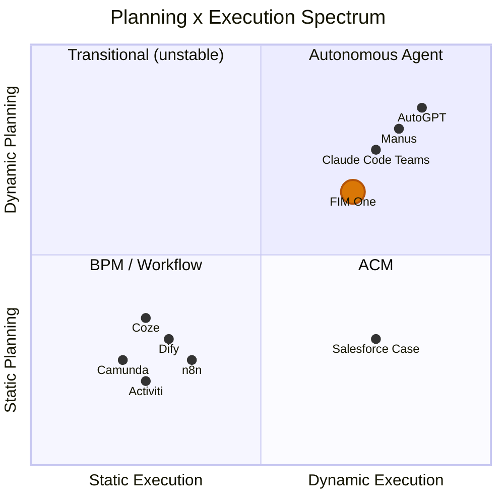
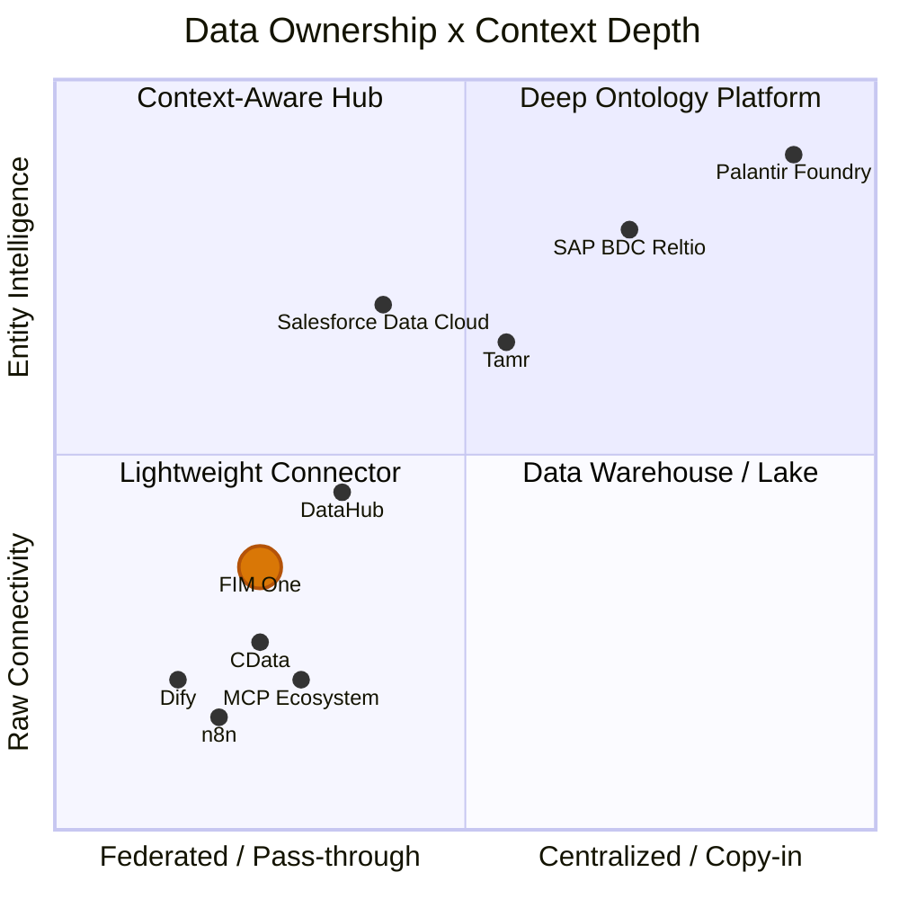

## Warum dynamische Planung der schwierige Mittelweg ist

Die Landschaft der KI-Agenten spaltete sich in zwei Lager auf, und beide wählten den einfachen Weg. Traditionelle Workflow-Engines -- Dify, n8n, Coze -- entschieden sich für statische Orchestrierung: visuelle Drag-and-Drop-Flussdiagramme mit festen Ausführungspfaden. Dies war keine Unwissenheit; Unternehmenskunden fordern Determinismus (gleiche Eingabe, stabile Ausgabe), und statische Graphen liefern das. Am anderen Extrem versprachen vollständig autonome Agenten (AutoGPT und seine Nachfolger) End-to-End-Autonomie, erwiesen sich aber als unpraktisch: unzuverlässige Aufgabenzerlegung, unkontrollierte Token-Kosten und Verhalten, das niemand vorhersagen oder debuggen konnte.

Der Sweet Spot ist eng, aber real. Einfache Aufgaben benötigen keinen Planer. Aufgaben, die komplex genug sind, um Dutzende voneinander abhängiger Schritte zu erfordern, überfordern aktuelle LLMs. Aber dazwischen liegt eine reichhaltige Klasse von Problemen -- Aufgaben mit klaren parallelen Teilaufgaben, die mühsam zu programmieren sind, aber für ein LLM praktikabel zu zerlegen. Dynamische DAG-Planung zielt genau auf diese Zone ab: Das Modell schlägt den Ausführungsgraphen zur Laufzeit vor, das Framework validiert die Struktur und führt sie mit maximaler Parallelität aus. Kein Drag-and-Drop, keine YOLO-Autonomie.

## Die Wette auf verbesserte Modelle

Alle paar Monate verschiebt sich die Grundlage -- GPT-4, Function Calling, Claude 3, das MCP-Protokoll. Eine starre Abstraktion auf wechselndem Untergrund zu bauen ist riskant; LangChains Über-Abstraktion ist die Vorsichtsgeschichte, die jeder in diesem Bereich verinnerlicht hat. FIM One verfolgt den gegenteiligen Ansatz: **minimale Abstraktion, maximale Erweiterbarkeit**. Das Framework übernimmt Orchestrierung, Parallelität und Observability. Die Intelligenz kommt vom Modell, und das Modell wird immer besser.

Heute liegt die Genauigkeit der LLM-Aufgabenzerlegung bei etwa 70-80% für nicht-triviale Ziele. Wenn das 90%+ erreicht, expandiert die „Sweet Spot" für dynamische Planung dramatisch -- Probleme, die gestern zu komplex waren, werden morgen lösbar. FIM Ones DAG-Framework ist so konzipiert, dass es diesen wachsenden Wert erfasst, ohne die Infrastruktur umzuschreiben.

## Werden ReAct und DAG-Planung obsolet?

ReAct wird nicht verschwinden -- es wird in das Modell einfließen. Betrachten Sie die Analogie: Sie schreiben TCP-Handshakes nicht von Hand, aber TCP ist nicht verschwunden; es wurde vom Betriebssystem absorbiert. Wenn Modelle stark genug sind, wird die Think-Act-Observe-Schleife zu implizitem Verhalten innerhalb des Modells, nicht zu explizitem Framework-Code. Dies geschieht bereits: Claude Code ist im Wesentlichen ein Agent, bei dem die Schleife vom Modell selbst angetrieben wird, nicht von einem externen Harness.

Der bleibende Wert der DAG-Planung liegt nicht darin, "dummen Modellen bei der Aufgabenzerlegung zu helfen" -- es ist **gleichzeitige Planung**. Selbst bei unendlich leistungsstarken Modellen erzwingt die Physik Latenz: eine serielle Kette von 10 LLM-Aufrufen dauert 10x länger als 3 parallele Wellen. DAG ist ein Engineeringproblem (wie man Dinge schnell und zuverlässig ausführt), kein Intelligenzproblem (wie man entscheidet, was ausgeführt werden soll). Wiederholungslogik, Kostenkontrolle, Timeout-Verwaltung, Observability -- diese verschwinden nicht, wenn Modelle intelligenter werden.

Das Endspiel: **Modelle besitzen das "Was" (Planungsintelligenz wird in das Modell internalisiert), Frameworks besitzen das "Wie" (Nebenläufigkeit, Wiederholung, Überwachung, Kostenverwaltung)**. Der bleibende Wert eines Frameworks ist nicht Intelligenz -- es ist Governance.

## Warum nicht Difys Workflow-Editor spiegeln

Eine natürliche Frage: Wenn DAG den flexiblen Fall abdeckt, sollten wir nicht auch einen statischen Workflow-Editor für den deterministischen Fall bauen?

Nein. Die Begründung:

1. **Die Workflows existieren bereits anderswo.** Die festen Prozesse von Regierungs- und Unternehmenskunden leben in ihren OA-, ERP- und Legacy-Systemen. Sie wollen diese Flows nicht noch einmal auf einer weiteren Plattform neu aufbauen -- sie wollen KI, die sich mit den Systemen verbinden kann, in denen diese Flows bereits laufen. Die Connector-Plattform (v0.6) löst dies direkt.

2. **Bestehende Funktionen setzen sich zu festen Pipelines zusammen.** Geplante Jobs (v1.0) triggern einen DAG-Agenten mit einem festen Prompt; der DAG plant die Schritte dynamisch; Connectors (v0.6) verbinden sich mit den Zielsystemen. Die Kombination entspricht einer statischen Pipeline -- ist aber flexibler, weil das LLM seinen Plan basierend auf den Daten, die es findet, anpassen kann. Keine separate Pipeline-DSL nötig.

3. **Investitionsmismatch.** Ein produktionsreifer visueller Workflow-Editor (Canvas, Node-Typen, Variablenweitergabe, Debug/Replay) erfordert Monate dedizierter Arbeit. Das Ergebnis wäre eine minderwertige Kopie dessen, was Difys 120K-Star-Community bereits pflegt. Diese Arbeit ist besser in der Connector-Architektur investiert -- einer Fähigkeit, die kein Konkurrent bietet.

Die strategische Wette: **konkurriere nicht bei der Workflow-Visualisierung; konkurriere darauf, der Hub zu sein, wo Systeme auf KI treffen**. Lass Dify "baue KI-Workflows visuell" besitzen. FIM One besitzt "der Hub, wo deine Systeme auf KI treffen."

## Wo FIM One steht

FIM One ist kein „AGI-Task-Scheduler" und keine statische Workflow-Engine. Es nimmt die Mittellösung ein: Planungsfähigkeit mit Einschränkungen, Parallelität mit Observability.

- Im Vergleich zu **Dify**: flexibler -- DAG-Generierung zur Laufzeit statt Flowcharts zur Designzeit. Sie müssen nicht jeden Ausführungspfad im Voraus antizipieren. Konkurriert nicht bei der visuellen Workflow-Bearbeitung; konkurriert bei der Integration von Legacy-Systemen.
- Im Vergleich zu **AutoGPT**: kontrollierter -- begrenzte Iterationen, Neuplanungslimits, mit Human-in-the-Loop auf der Roadmap. Autonomie innerhalb von Schutzvorrichtungen.

Die Strategie ist unkompliziert: Bauen Sie jetzt das Orchestrierungs-Framework auf, und lassen Sie verbesserte Modelle es im Laufe der Zeit mit Fähigkeiten füllen.

## Wo FIM One sich befindet: Planungs- x Ausführungsspektrum

Die KI-Ausführungslandschaft kann auf zwei Achsen abgebildet werden -- wie Pläne erstellt werden (statisch vs. dynamisch) und wie sie ausgeführt werden (starr vs. adaptiv):

**Warum Dify/n8n statische Planung + statische Ausführung sind**: Der DAG wird von einem Menschen zur Designzeit auf einer visuellen Leinwand gezeichnet. Jeder Knoten führt eine feste Operation aus (ein LLM-Aufruf mit einem festen Prompt, eine HTTP-Anfrage, ein Code-Block). Es gibt keine Neuplanung zur Laufzeit -- wenn ein Schritt fehlschlägt, schlägt der Workflow fehl oder folgt einem vorverkabelten Fehlerzweig. Dies ist strukturell dasselbe wie BPM, nur mit KI-Knoten im Graphen.

**FIM One's Position: Dynamische Planung + Dynamische Ausführung**

- **DAG-Topologie wird zur Laufzeit von LLM generiert** (dynamische Planung) -- kein Mensch entwirft den Graphen
- **Jeder DAG-Knoten führt eine vollständige ReAct-Schleife aus** (dynamische Ausführung) -- Knoten denken nach, verwenden Tools und passen sich an
- **Neuplanungsmechanismus** (ausführen → analysieren → neu planen, falls nicht zufrieden)
- Aber begrenzt: max. 3 Neuplanungsrunden, Token-Budgets, Bestätigungsgates für Menschen

Dies platziert FIM One im gleichen Quadranten wie AutoGPT, aber mit Engineering-Einschränkungen, die unkontrolliertes Verhalten verhindern. Flexibler als BPM/Dify, kontrollierter als AutoGPT.

## Konzept-Glossar

Für Leser, die mit der in diesem Dokument verwendeten Terminologie nicht vertraut sind:

| Begriff | Einzeilige Erklärung | Bezug zu FIM One |
|------|---------------------|----------------------|
| **BPM** (Business Process Management) | Prozesse vollständig zur Entwurfszeit festgelegt, starr ausgeführt. Camunda, Activiti. | FIM One ist **keine** BPM. Keine feste Process Engine. |
| **FSM** (Finite State Machine) | System befindet sich zu jedem Zeitpunkt in genau einem Zustand; Ereignisse lösen Übergänge aus. Unterstützt Schleifen (ablehnen → erneut einreichen). | Zielsysteme (ERP, Vertragssysteme) verwenden FSM intern. FIM One **benötigt keine** eigene FSM -- es ruft die API des Zielsystems auf. |
| **ACM** (Adaptive Case Management) | Skelett statisch, Verzweigungen dynamisch. Hauptfluss vordefiniert, jeder Knoten passt sich zur Laufzeit an. | FIM Ones DAG + ReAct fällt natürlicherweise in diesen Quadranten. |
| **HTN** (Hierarchical Task Network) | Rekursive Taskzerlegung: High-Level → Subtasks → atomare Operationen. | DAG-Neuplanung deckt die meisten Szenarien ab; vollständiges HTN noch nicht erforderlich. |
| **iPaaS** (Integration Platform as a Service) | Cloud-Integrationsplattform, die mehrere SaaS-/On-Prem-Systeme verbindet. MuleSoft, Zapier. | FIM Ones Hub Mode ist wie **KI-native iPaaS** -- natürliche Sprache treibt systemübergreifende Integration. |
| **MDM** (Master Data Management) | Dedupliziert und vereinheitlicht Entity-Datensätze systemübergreifend zu einem „Golden Record". Reltio, Informatica, Tamr. | FIM One **verbindet sich mit** MDM-Systemen; es repliziert nicht die Entity-Auflösung. |
| **Context Layer / System of Context** | Einheitlicher Entity- und Beziehungsgraph, der KI-Agenten vertrauenswürdigen Geschäftskontext bietet. Begriff popularisiert von Reltio (2026). | FIM One delegiert dies an vorgelagerte MDM-/Datenplattformen. Skills bieten leichte Aggregation für häufige Fälle. |

## Architektur-Grenze: FIM One repliziert keine Workflow-Logik

Komplexe Geschäftsprozesse (Genehmigungsketten, Transfers, Ablehnungen, Eskalationen, Mitzeichnung, Gegenzeichnung) sind die **Verantwortung des Zielsystems**. Diese Systeme haben Jahre damit verbracht, diese Logik zu entwickeln -- ERP-, OA- und Vertragsmanagementsysteme verfügen alle über ausgefeilte State Machines.

Aus der Perspektive des Konnektors:

| Operation | Was der Konnektor macht |
|-----------|------------------------|
| Transfer | Eine API aufrufen, Zielperson übergeben |
| Ablehnung | Eine API aufrufen, Ablehnungsgrund übergeben |
| Eskalation | Eine API aufrufen, Eskalationspersonenliste übergeben |
| Mitzeichnung | Eine API aufrufen, Mitzeichnerliste übergeben |

Jede komplexe Workflow-Operation wird zu einer HTTP-Anfrage mit Parametern. FIM One ruft die API auf; das Zielsystem verwaltet die State Machine.

Dies ist eine **bewusste architektonische Grenze**, keine Funktionslücke. Die Duplizierung von Workflow-Logik, die bereits in Zielsystemen vorhanden ist, würde:
1. Wartungsaufwand verursachen (zwei State Machines, die synchron gehalten werden müssen)
2. Fehlermöglichkeiten hinzufügen (was ist, wenn sie sich widersprechen?)
3. Keinen zusätzlichen Wert bieten (das Zielsystem macht dies bereits korrekt)

Das Konnektor-Muster ist absichtlich einfach gestaltet: **eine Operation = ein API-Aufruf**.

## Architecture Boundary: Connector Layer, Not Context Layer

Enterprise AI konvergiert auf eine geschichtete Architektur für Agenten-Kontext:

| Layer | Was es tut | Representative players |
|-------|-------------|----------------------|
| **Decision Traces** | Zeichnet auf, *warum* etwas passiert ist -- Audit Trails, Lineage | Palantir Decision Lineage, Arize |
| **Entity Context** | Einheitliche Golden Records + Beziehungsgraphen -- das "System of Context" | Reltio/SAP, Informatica/Salesforce, Tamr |
| **Data Connectivity** | Verbindet Agenten mit Quellsystemen über APIs und Protokolle | **FIM One**, CData, MCP ecosystem |
| **Source Systems** | CRM, ERP, Vertragsverwaltung, Datenbanken, SaaS-Apps | SAP, Salesforce, benutzerdefinierte Systeme |

FIM One operiert auf der **Datenkonnektivitätsschicht**. Es versucht nicht, die darüber liegende Entity-Context-Schicht zu erstellen. Dies ist eine bewusste Entscheidung, keine Lücke.

### Branchenkontext: Die Konsolidierung 2025-2026

Zwei wegweisende Akquisitionen haben die Enterprise-AI-Datenlösung neu gestaltet und die Kontextschicht zu einem strategischen Schlachtfeld gemacht:

- **Salesforce erwarb Informatica** (November 2025) -- fügte Enterprise MDM und Daten-Governance zu seinem Data Cloud + Agentforce Stack hinzu. Das Ziel: Agentforce-Agenten vertrauenswürdig machen, indem sie in Informaticas Golden Records verankert werden.
- **SAP kündigte die Übernahme von Reltio an** (März 2026) -- fügte AI-native Entity Resolution und Relationship Graphs zu seiner Business Data Cloud (BDC) hinzu. Das Ziel: ein „System of Context" schaffen, das sich über SAP- und Nicht-SAP-Umgebungen erstreckt und als vertrauenswürdige Grundlage für Joule-Agenten dient.

Diese Schritte signalisieren, dass die weltweit größten Enterprise-Plattformen einheitlichen Entity-Kontext nun als Voraussetzung für zuverlässige AI-Agenten betrachten -- nicht als Nice-to-have.

### Data ownership × Context depth spectrum

**Lesen des Diagramms:**

- **Unten links (Lightweight Connector)**: minimale Dateneigentümerschaft, rohe API-Konnektivität. Dify, n8n und grundlegende MCP-Server befinden sich hier -- sie verbinden sich mit Systemen, verstehen aber keine Entitäten. FIM One befindet sich in diesem Quadranten, aber höher auf der y-Achse aufgrund von Progressive-Disclosure-Meta-Tools, Skill-basierter Kontextaggregation und Domain-bewusster Eskalation.
- **Oben links (Context-Aware Hub)**: föderierter Zugriff mit Verständnis auf Entitätsebene. Salesforce Data Cloud ist ein Beispiel dafür -- Zero-Copy-Föderation mit On-Demand-Entitätsauflösung. DataHub bietet Kontext auf Metadaten-Ebene (Schema, Herkunft, Eigentümerschaft), ohne Geschäftsdaten zu besitzen.
- **Oben rechts (Deep Ontology Platform)**: vollständige Datenaufnahme mit tiefem Entitäts-Intelligence. SAP BDC + Reltio erstellt persistente Multi-Domain-Golden Records mit Beziehungsgraphen. Palantir geht am weitesten -- dreilagige Ontologie mit Decision Lineage.
- **Unten rechts (Data Warehouse / Lake)**: zentralisierte Datenspeicherung ohne Entitätssemantik. Traditionelle Datenplattformen, die alles aufnehmen, aber keine Entitätsauflösung oder Beziehungsmodellierung haben.

FIM Ones Position spiegelt eine bewusste Wahl wider: bleiben Sie föderiert und leichtgewichtig, investieren Sie aber darin, den Upstream-Entitätskontext (von jedem MDM) für Agenten leicht zugänglich zu machen.

### Drei Modelle für Entity-Kontext

**SAP: Multi-Domain Golden Record (Copy-in + Govern)**

SAP baut eine dreischichtige Enterprise-Architektur auf:

| Layer | System | Rolle |
|-------|--------|------|
| **Transaction** | S/4HANA | Geschäftsausführung -- Bestellungen, Rechnungen, Lieferungen |
| **Intelligence** | Business Data Cloud (BDC) + Reltio | Semantische Integration, Entity Resolution, Beziehungsgraphen |
| **Agent** | Joule + Joule Agents | Intent-Verständnis, Tool-Orchestrierung, autonome Ausführung |

Reltio sitzt im Zentrum der Intelligence-Schicht. Seine Aufgabe: Entity-Daten aus SAP- und Nicht-SAP-Systemen aufnehmen, Duplikate durch KI-basiertes Matching auflösen und **Multi-Domain Golden Records** (Kunde, Lieferant, Produkt, Patient, Asset) mit Beziehungsgraphen erzeugen. Reltios frühe Adoption des **MCP-Protokolls** ist strategisch bedeutsam -- es positioniert Golden Records als direkt aufrufbar durch jeden MCP-kompatiblen Agenten, nicht nur durch SAPs eigene Joule.

SAPs Wette: Agenten benötigen einen persistenten, gesteuerten, domänenübergreifenden "Single Source of Truth", um zuverlässig in hochriskanten Enterprise-Prozessen zu arbeiten.

**Salesforce: Zero-Copy-Föderierung (Federate + On-Demand-Auflösung)**

Salesforce verfolgt einen leichteren Ansatz. Data Cloud erfordert keine physische Datenbewegung; stattdessen nutzt es **Zero-Copy-Partnerschaften** (Databricks, Snowflake, BigQuery), um Daten an Ort und Stelle zu föderieren. Entity Resolution findet on-demand innerhalb von Data Cloud statt und erstellt einheitliche Kundenprofile ohne einen persistenten Golden-Record-Store.

Wichtige Zahlen (Q3 FY2026): Data Cloud nahm 32 Billionen Datensätze auf, davon 15 Billionen über Zero-Copy (341% YoY-Wachstum). Diese Skalierung validiert das Föderierungsmodell für CRM-zentrische Anwendungsfälle.

Agentforce-Agenten sind in diesem föderiertem Kontext verankert: Sie argumentieren über die verteilte Datenbasis, ohne dass alle Daten in einem System landen müssen. Für Front-Office-Szenarien (Vertrieb, Service, Marketing) ist dies flexibel und schnell bereitzustellen.

Salesforces Wette: Agenten benötigen keinen schwerfälligen Golden-Record-Store -- sie benötigen Echtzeitzugriff auf föderiertem, aufgelöstem Kontext dort, wo er bereits vorhanden ist.

**Palantir: Tiefe Ontologie (die gewichtige Referenz)**

Am extremen Ende nimmt Palantir Foundry alle Daten auf und baut eine dreischichtige Ontologie (semantische Objekte + kinetische Aktionen + dynamische Regeln) mit vollständiger Entscheidungslinienführung. Dies ist das vollständigste Kontextsystem in der Produktion, aber zu Verträgen von $10M+ und Bereitstellungen von 6-18 Monaten. Es dient als Referenzarchitektur, nicht als realistisches Modell für die meisten Organisationen.

### Wo FIM One passt

| Dimension | SAP + Reltio | Salesforce + Informatica | FIM One |
|-----------|-------------|-------------------------|---------|
| **Datenphilosophie** | Copy-in: in BDC aufnehmen, goldene Datensätze erstellen | Federate: Zero-Copy-Zugriff, On-Demand-Auflösung | Pass-through: mit Quelle verbinden, nicht speichern |
| **Entity Resolution** | Tiefgreifend -- AI-natives MDM mit Beziehungsgraphen | Mittel -- Data Cloud Entity Resolution | Keine -- delegiert an vorgelagertes MDM |
| **Agent-Integration** | Joule Agents + MCP | Agentforce + Data Cloud Grounding | Beliebiger Agent + beliebiger Connector |
| **Bereitstellungskosten** | Enterprise-Plattformpreisgestaltung | Enterprise-SaaS-Preisgestaltung | Leichtgewichtig, Stunden bis Tage |
| **Lock-in** | Hoch (BDC + S/4HANA-Ökosystem) | Mittel (Salesforce-Ökosystem) | Niedrig -- Connectoren sind austauschbar |
| **Beste Eignung** | Fertigung, Lieferkette, Life Sciences (komplexe Multi-Domain) | CRM-gesteuerte Unternehmen (Front-Office-Fokus) | Mittelmarkt, Multi-System, Provider-agnostisch |

FIM One entspricht am ehesten der **Salesforce-Philosophie** (Daten nicht besitzen, sondern sich damit verbinden), jedoch ohne die Abhängigkeit vom Salesforce-Ökosystem. Die strategische Position: Provider-agnostisch auf der Konnektivitätsebene sein und jedes MDM -- ob SAP/Reltio, Salesforce/Informatica, Tamr oder eine benutzerdefinierte Lösung -- als Entity-Context-Quelle dienen lassen.

### Warum FIM One auf der Connector-Ebene bleibt

Der Aufbau einer Entity-Context-Schicht erfordert persistente Datenspeicherung, ML-basierte Entity-Auflösung, Survivorship-Regeln, Relationship-Graph-Engines und Governance-Frameworks. Dies ist eine eigenständige Produktkategorie (MDM) mit jahrzehntelanger Konkurrenz (Reltio, Informatica, Tamr). Ein Versuch würde:

1. **FIM One von einem Connector zu einer Datenplattform transformieren** -- grundlegend anderes Produkt, Team und Go-to-Market
2. **Funktionen duplizieren, die vorgelagerte Systeme bereits bereitstellen** -- das gleiche Anti-Pattern, das wir bei Workflow-Logik vermeiden
3. **Lock-in erhöhen** -- sobald Benutzer Golden Records in FIM One speichern, steigen die Wechselkosten dramatisch

Die richtige Strategie: **der beste Eingangspunkt für jedes MDM-System sein**, nicht ein Ersatz dafür. FIM One sollte es trivial machen, dass Reltio, Informatica, Tamr oder ein benutzerdefiniertes MDM Entity-Context für Agenten bereitstellen -- über MCP Resources, Connector-APIs oder Knowledge-Base-Injection.

### Aktueller Ansatz: Fähigkeiten als leichte Kontextaggregation

Für Szenarien, die kontextübergreifende Konnektoren benötigen (z. B. Vertragsüberprüfung mit Lieferantendaten + Zahlungsverlauf + Risikoflaggen), bieten **Fähigkeiten** bereits eine pragmatische Lösung. Das SOP einer Fähigkeit kann mehrere Konnektoraktionen nacheinander orchestrieren, Ergebnisse aggregieren und strukturierten Kontext dem Agenten präsentieren -- ohne eine persistente Entity-Schicht zu erstellen.

Dies deckt den 80%-Fall ab. Sollte Nachfrage nach Echtzeit-Entity-Auflösung auf Konnektorebene entstehen, lässt die Architektur Raum für einen zukünftigen `ContextSource`-Konnektortyp, der sich mit externen MDM-Systemen integriert -- aber das ist eine zukünftige Überlegung, keine aktuelle Verpflichtung.

### Die Analogie

FIM One's Beziehung zur Kontextschicht ist wie SQLAlchemy's Beziehung zur Datenbank: Sie speichert oder verwaltet keine Daten, sondern macht jede Datenquelle für die Anwendungsschicht zugänglich. Lassen Sie MDM-Plattformen die Entitätsauflösung besitzen; lassen Sie FIM One die Verbindung besitzen.

## Wo FIM One im KI-Stack sitzt

### Das Schichtenmodell

Ein nützliches mentales Modell (Dank an [Phil Schmid](https://www.philschmid.de/)) ordnet KI-Systeme einem vierschichtigen Stack analog zur Computerhardware zu:

| Schicht | Analogie | FIM One Komponente |
|-------|---------|-------------------|
| **Modell** | CPU | ModelRegistry -- jedes OpenAI-kompatible LLM |
| **Kontext** | RAM | ContextGuard + Memory (Window / Summary / DB) |
| **Harness** | Betriebssystem | ReAct Agent + DAG Planner + Hooks + ToolRegistry |
| **Anwendung** | App | Portal, Copilot, Hub API |

FIM One operiert auf der **Harness-Schicht** -- es konkurriert nicht mit Modellen; es macht sie produktiv, indem es die richtigen Tools, Einschränkungen und Feedback-Schleifen bereitstellt. Das Modell liefert Intelligenz; der Harness liefert Governance, Concurrency und Zuverlässigkeit.

### Drei Ären der KI-Entwicklung

Die Disziplin hat sich durch unterschiedliche Phasen entwickelt: **Prompt Engineering** konzentrierte sich auf die Erstellung besserer Anweisungen, um korrektes Verhalten von einem festen Modell zu erreichen. **Context Engineering** verlagerte die Aufmerksamkeit auf die Zusammenstellung der richtigen Informationen – das Abrufen von Dokumenten, das Einfügen von Tool-Ergebnissen, die Verwaltung des Speichers – damit das Modell über das verfügt, was es zum guten Reasoning benötigt. **Harness Engineering** geht noch weiter: Es gestaltet die gesamte Ausführungsumgebung um das Modell, einschließlich deterministischer Schutzmaßnahmen, Tool-Orchestrierung, Feedback-Schleifen und Kostenkontrollen.

Die Architektur von FIM One verkörpert Harness-Engineering-Prinzipien. Das [Hook System](/architecture/hook-system) führt Plattformcode außerhalb der LLM-Schleife an klar definierten Lebenszykluspunkten aus – heute fängt `FeishuGateHook` sensible Tool-Aufrufe ab und leitet die Genehmigung über einen IM-Kanal weiter, und die gleiche Abstraktion ist die geplante Heimat für Audit-Logging, Read-Only-Mode-Durchsetzung, Rate Limits und Ergebnistrunkierung in v0.9. ContextGuard verwaltet, was in das Kontextfenster gelangt und wann. Dynamische Tool-Auswahl (Progressive-Disclosure-Meta-Tools) hält die Tool-Oberfläche handhabbar, wenn die Connector-Anzahl wächst. Der Self-Reflection-Mechanismus der ReAct-Schleife und der Re-Plan-Zyklus des DAG-Planers bieten strukturiertes Feedback, das die Ausführungsqualität verbessert, ohne ein leistungsfähigeres Modell zu benötigen.
