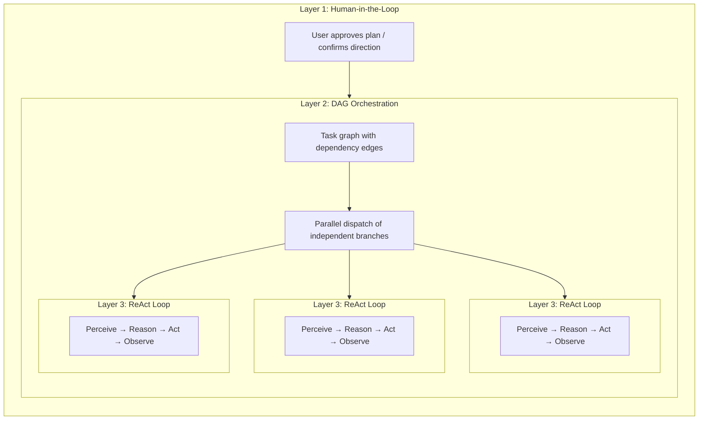

---
title: "Planungslandschaft"
description: "Fünf Arten der Planung in der AI-Tooling-Landschaft und wo FIM One passt."
---## Fünf Arten von "Planung" in der AI-Tooling-Landschaft

Das Wort "Planung" ist überbelastet. Heute existieren mindestens fünf unterschiedliche Ansätze, und sie lösen verschiedene Probleme:

| Ansatz | Planformat | Ausführung | Genehmigung | Kernwert |
|---|---|---|---|---|
| **Implizite Modellplanung** | Interne Chain-of-Thought | Einzelner Inferenzdurchlauf | Keine | Das Modell denkt die Schritte selbst durch |
| **Claude Code Plan-Modus** | Markdown-Dokument | Seriell | Mensch überprüft vor Ausführung | Abstimmung über Ansatz vor Code-Änderungen |
| **Claude Code Teams** | Aufgabenliste mit Abhängigkeitskanten | **Gleichzeitig** (Multi-Agent) | Mensch genehmigt Plan, dann autonom | Dynamischer Agent-Pool + parallele Ausführung |
| **Kiro spec-driven dev** | Strukturierte Spezifikation (Anforderungen + Design + Aufgaben) | Seriell | Mensch überprüft Spezifikation | Nachverfolgbare Anforderungen, Akzeptanzkriterien |
| **FIM One DAG** | JSON-Abhängigkeitsgraph | **Gleichzeitig** (einzelner Orchestrator) | Automatisch (PlanAnalyzer) | Parallele Ausführung + Runtime-Planung |

Die ersten beiden sind **Design-Zeit**-Planung — sie erzeugen einen Plan *bevor* die Arbeit beginnt, und ein Mensch (oder das Modell selbst) folgt ihm Schritt für Schritt. Die letzten drei führen **Runtime**-Planung ein — Ausführungsgraphen werden programmgesteuert generiert und geplant, wobei unabhängige Branches parallel laufen. Der Unterschied liegt darin, *wer* ausführt: Claude Code Teams startet autonome Agenten; FIM One DAG verteilt Schritte innerhalb eines einzelnen Orchestrators.

Diese Ansätze sind keine Konkurrenten; sie sind komplementäre Schichten. Eine Kiro-ähnliche Spezifikation kann definieren, *was* gebaut werden soll, während ein FIM One DAG die Subtasks *wie* gleichzeitig ausführen kann. Claude Code's Plan-Modus stellt sicher, dass ein Mensch dem Ansatz zustimmt; FIM One's PlanAnalyzer überprüft das Ergebnis automatisch.## Three-Layer Nesting: The Full-Power Architecture

Sowohl Claude Code Teams als auch FIM One DAG zeigen in voller Kapazität eine **dreischichtige verschachtelte Architektur**:

- **Layer 1 — Human gate**: Der Benutzer überprüft den Plan und genehmigt ihn vor Beginn der Ausführung.
- **Layer 2 — DAG-Orchestrierung**: Der genehmigte Plan wird in Aufgaben mit Abhängigkeitskanten zerlegt. Unabhängige Aufgaben laufen parallel; nachgelagerte Aufgaben warten darauf, dass ihre Blocker aufgelöst werden.
- **Layer 3 — ReAct-Innenschleife**: Jede Aufgabe wird von einem Agent ausgeführt, der einen vollständigen ReAct-Zyklus (Perceive → Reason → Act → Observe) durchläuft und mehrstufiges Reasoning, Tool-Nutzung und autonome Wiederholung ermöglicht.

Die Kernidee: **Claude Code Teams und FIM One DAG implementieren die gleichen drei Schichten, nur mit unterschiedlicher Layer-2-Mechanik** — Message-Passing vs. Abhängigkeitskanten-Auflösung.## Full-Power Runtime: FIM One vs Claude Code Teams

Beide sind echte Agents — die Kernschleife ist identisch: **Perceive → Reason → Act → Feedback**. Der Unterschied liegt darin, wie sie parallele Arbeit mit voller Kapazität orchestrieren.

| Dimension | Claude Code Teams | FIM One DAG |
|---|---|---|
| **Parallel model** | Leader spawnt SubAgents, weist Aufgaben via Nachrichten zu | Topologische Sortierung parallelisiert unabhängige Schritte automatisch |
| **Task graph** | TaskList mit `blockedBy` / `blocks` Kanten (dynamischer DAG) | Statischer JSON DAG mit `depends_on` Kanten |
| **Coordination** | Explizites Message Passing (SendMessage / Broadcast) | Implizite Abhängigkeitskanten — keine Nachrichten, nur Datenfluss |
| **Agent lifecycle** | Dynamischer Pool — Agents werden bei Bedarf erzeugt, beendet wenn fertig | Feste Step Executors — ein LLM Call pro Step |
| **Feedback & correction** | Jeder SubAgent versucht autonom erneut; Leader weist bei Fehler neu zu | PlanAnalyzer bewertet Ergebnisse → Re-Planning Loop (bis zu 3 Runden) |
| **Human involvement** | Plan Mode Genehmigung, dann autonome Ausführung | Vollautomatisch — PlanAnalyzer entscheidet Pass/Replan |
| **Context management** | Jeder SubAgent erhält isoliertes Context Window (keine Kreuzkontamination) | Gemeinsames DbMemory + LLM Compact über alle Steps |
| **Token economics** | `N agents × pro-Agent tokens` — Zeit↓ Tokens↑ (multiplikativer Kosten) | Sequenziell oder flache Parallelität — niedrigere Gesamttokens |
| **Scaling pattern** | Mehr SubAgents hinzufügen (horizontal, message-gekoppelt) | Mehr DAG Branches hinzufügen (horizontal, abhängigkeitsgekoppelt) |
| **Best suited for** | Diverse, lose verwandte Aufgaben (Research + Code + Test) | Strukturierte Workflows mit klaren Datenabhängigkeiten |### Real-World Benchmark: v0.5 RAG System

Claude Code Teams hat das gesamte v0.5 RAG-Subsystem von FIM One in einer einzigen Sitzung erstellt:

- **8 Phasen**: Embedding → Reranker → Loaders → Chunking → VectorStore → Retrieval → KB Backend → Frontend + Docs
- **46 Tests** bestanden, Frontend-Build sauber
- **Wall Time**: ~5 Minuten
- **Token-Kosten**: ~100k Token pro Agent-Task × 8+ Tasks ≈ 800k+ Token insgesamt
- **Abhängigkeitskanten**: Phase 5 hängt von Phase 4 + 1b ab; Phase 6 hängt von Phase 5 + 2 + 3 ab — ein echtes DAG

Dies demonstriert den Kern-Trade-off: **Zeitparallelismus auf Kosten der Token-Vervielfachung**. Claude Code Teams tauscht Compute-Dollar gegen Entwicklerstunden.### Konvergenz, nicht Konkurrenz

Die Grenze zwischen „Team-Zusammenarbeit" und „Pipeline-Planung" verschwimmt:

- **Claude Code Teams' `blockedBy`/`blocks` IST ein DAG** — Tasks haben explizite Abhängigkeitskanten, und der Leader verteilt neu freigegebene Tasks, wenn Vorgänger abgeschlossen sind. Dies ist topologische Planung mit zusätzlichen Schritten (Nachrichten).
- **FIM One's DAG könnte von Agent-Autonomie profitieren** — statt einzelner LLM-Aufrufe pro Schritt würde es einem vollständigen ReAct-Loop pro Schritt ermöglichen, komplexe Teilaufgaben besser zu bewältigen.

**Fazit:** Gleiche Agent-Essenz, konvergierende parallele Philosophien. Claude Code folgt einem **Team-Zusammenarbeits**-Modell — ein Leader delegiert an Worker, die sich über Nachrichten verständigen. FIM One folgt einem **Pipeline-Planungs**-Modell — ein DAG Executor verteilt Schritte basierend auf Abhängigkeitsauflösung. In der Praxis implementieren beide abhängigkeitsgesteuerte parallele Ausführung; der Unterschied liegt im Koordinations-Overhead (Nachrichten vs. Kanten) und der Token-Ökonomie (isolierte Kontexte vs. gemeinsamer Speicher). Die optimale Architektur kombiniert wahrscheinlich beide: DAG-Planung für strukturierte Pipelines, Agent-Pools für Tasks, die autonome mehrstufige Reasoning benötigen.## Strukturierte Ausgabedegradation

Alle strukturierten LLM-Aufrufe in der DAG-Pipeline (Planner, Analyzer, Tool Selection) verwenden ein einheitliches `structured_llm_call()`-Utility, das eine 3-stufige Degradationskette implementiert:

| Stufe | Bedingung | Funktionsweise |
|---|---|---|
| **Native FC** | `llm.abilities["tool_call"]` | Erzwingt einen virtuellen Tool-Aufruf; extrahiert aus `tool_calls[0].arguments` |
| **JSON Mode** | `llm.abilities["json_mode"]` | Setzt `response_format={"type":"json_object"}`; parst mit `extract_json()` |
| **Klartext** | immer verfügbar | Parst freiformatigen Inhalt mit `extract_json()`, dann optional `regex_fallback()` |

Jede textbasierte Stufe versucht einmal mit einem Umformatierungsprompt erneut, bevor zur nächsten Stufe übergegangen wird. Das Ergebnis ist ein `StructuredCallResult`, das den geparsten Wert, die erfolgreiche Extraktionsstufe und die akkumulierte Token-Nutzung enthält.

Dieses Design bedeutet, dass derselbe Prompt zuverlässig über GPT-4 (native FC), Claude (JSON Mode) und lokale Modelle (Klartext) funktioniert, mit konsistenter Fehlerbehandlung und Wiederholungslogik an einer Stelle statt verstreut über vier Aufruforte.