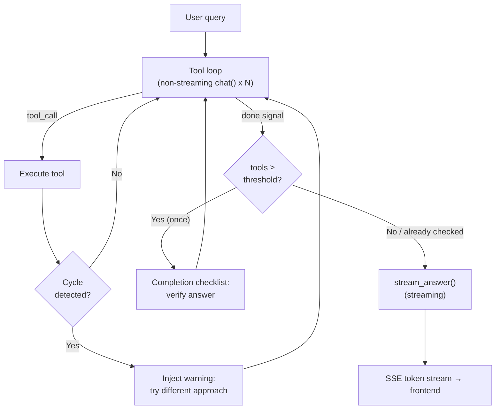
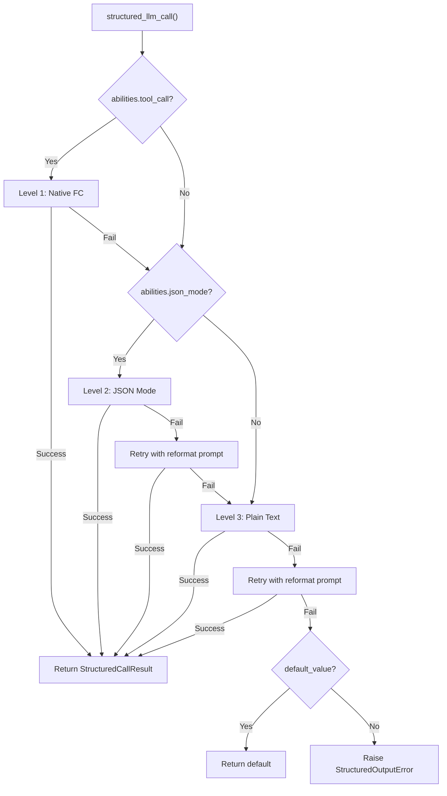
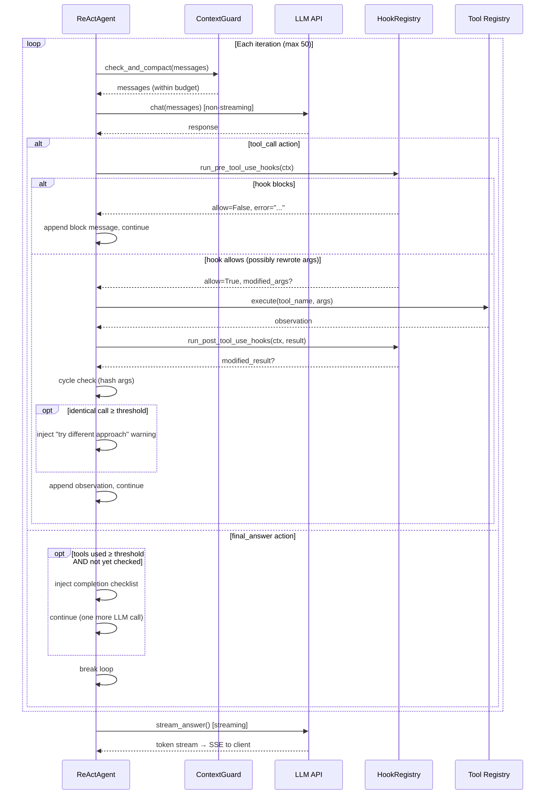
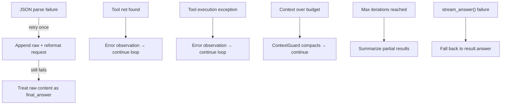
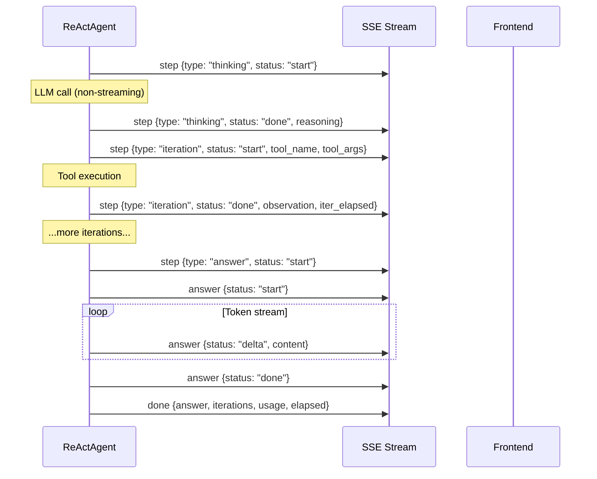

## Die Architektur

Die ReAct-Engine implementiert ein zweiphasiges Ausführungsmodell. Die erste Phase ist eine iterative Tool-Nutzungsschleife: der Agent fragt das LLM wiederholt nach einer Aktion, führt angeforderte Tools aus, fügt die Beobachtung hinzu und setzt fort, bis das LLM „fertig" signalisiert. Die zweite Phase ist die Antwortsynthesize: ein separater Streaming-LLM-Aufruf, der die vollständige Ausführungsspur liest und die benutzergerichtete Antwort erzeugt.

Diese Aufteilung ist absichtlich. Tool-Iterationen sind für Geschwindigkeit optimiert — jeder LLM-Aufruf in der Schleife verwendet nicht-streamendes `chat()`, da der Benutzer keine partiellen JSON-Aktionen oder zwischenzeitliche Reasoning-Token sehen muss. Die Antwortgenerierung ist für UX optimiert — sie verwendet `stream_chat()`, damit der Benutzer Token in Echtzeit erscheinen sieht. Das Ergebnis ist das Beste aus beiden Welten: schnelle Tool-Ausführung mit reaktiver Antwortbereitstellung.

Die Tool-Schleife erzeugt ein `AgentResult`, das die vollständige Konversationshistorie enthält — System-Prompt, Benutzerabfrage, jede Assistant-Nachricht, jedes Tool-Ergebnis. Die `stream_answer()`-Methode destilliert diese Spur zu einer prägnanten, kohärenten Antwort. Tool-Ergebnisse werden im Synthesekontext auf 2.000 Zeichen gekürzt, um den Prompt auch nach komplexen Multi-Tool-Workflows schlank zu halten.

**Modellbindung.** Das LLM wird in `ReActAgent.__init__()` injiziert und als `self._llm` gespeichert. Jeder Aufruf innerhalb einer einzelnen `run()`-Invokation — alle Tool-Schleifeniterationen und die endgültige Antwortsynthesize — verwendet diese gleiche Instanz. Das Modell ändert sich nicht zwischen Iterationen. Um ein anderes Modell zu verwenden, muss ein neuer `ReActAgent` konstruiert werden. Im DAG-Modus nutzt `DAGExecutor._resolve_agent()` dieses Muster: Es erstellt einen frischen Agent pro Schritt (wählt das Modell aus `ModelRegistry` basierend auf `step.model_hint`) unmittelbar bevor die ReAct-Schleife dieses Schritts beginnt. Siehe [DAG-Engine — Per-Step-Überschreibung](/architecture/dag-engine#two-llm-architecture) für Details.

## Dual-Mode-Ausführung

Die ReAct-Engine unterstützt zwei unterschiedliche Modi für die Interaktion mit dem LLM während der Tool-Schleife.

**JSON Mode** (`_run_json`) bettet Tool-Beschreibungen direkt in den System-Prompt ein und weist das LLM an, mit einem JSON-Objekt zu antworten — entweder eine `tool_call`-Aktion mit einem Tool-Namen und Argumenten oder ein `final_answer`-Signal. Der Agent analysiert das JSON aus dem Antwortinhalt, führt das Tool aus und fügt die Beobachtung als Benutzernachricht an.

**Native Function Calling** (`_run_native`) nutzt die integrierte Tool-Calling-API des LLM-Anbieters. Tool-Beschreibungen werden über den `tools`-Parameter übergeben, und das LLM gibt strukturierte `tool_calls` in der API-Antwort zurück, anstatt JSON in seinem Inhalt auszugeben. Dies ist der bevorzugte Modus für Modelle, die ihn unterstützen.

Die Modusauswahl erfolgt automatisch. Die Eigenschaft `_native_mode_active` gibt `True` nur zurück, wenn beide Bedingungen erfüllt sind: Der Agent wurde mit `use_native_tools=True` (Standard) erstellt und das LLM gibt `abilities["tool_call"] = True` an. Wenn eine der Bedingungen nicht erfüllt ist, fällt die Engine auf JSON Mode zurück.

| Aspekt | JSON Mode | Native Function Calling |
|--------|-----------|------------------------|
| LLM-Ausgabe | JSON-Objekt im Nachrichteninhalt | `tool_calls` in API-Antwort |
| System-Prompt | Bettet vollständige Tool-Beschreibungen in Text ein | Tools über `tools`-Parameter übergeben |
| Parallele Tool-Aufrufe | Ein Tool pro Iteration | Mehrere über `asyncio.gather` |
| Parse-Fehlerbehandlung | Wiederholung mit Reformatierungs-Prompt | N/A (strukturiert durch API) |
| Loop-LLM-Aufrufe | Nicht-Streaming `chat()` | Nicht-Streaming `chat()` |
| Optimal für | Modelle ohne Tool-Call-Unterstützung | GPT-4, Claude und ähnliche |

Beide Modi teilen sich die gleiche Antwort-Synthesephase — `stream_answer()` funktioniert identisch, unabhängig davon, wie die Tool-Schleife ausgeführt wurde.

## structured_llm_call — einheitliche Ausgabeextraktion

Jede Aufrufstelle, die benötigt, dass das LLM Daten zurückgibt, die einem JSON-Schema entsprechen, verwendet `structured_llm_call()`. Dies ist der einzelne Einstiegspunkt für strukturierte Ausgaben im gesamten Framework — der DAG-Planer, der Plan-Analyzer, die Werkzeugauswahl und jede zukünftige Komponente, die geparste JSON von einem LLM benötigt.

Die Funktion implementiert eine 3-stufige Degradationskette, die jede Stufe nacheinander versucht, basierend auf den beworbenen Fähigkeiten des LLM:

**Stufe 1: Native Function Calling.** Verwendet die `tool_call` / `tool_choice` API des LLM, um eine strukturierte Antwort zu erzwingen. Verfügbar, wenn `abilities["tool_call"] = True`. Wenn das LLM `tool_calls` zurückgibt, werden die Argumente direkt extrahiert. Wenn das Parsing fehlschlägt, wird zur nächsten Stufe übergegangen.

**Stufe 2: JSON Mode.** Setzt `response_format={"type": "json_object"}`, um das Ausgabeformat des LLM einzuschränken. Verfügbar, wenn `abilities["json_mode"] = True`. Wenn die Antwort nicht geparst werden kann, wird einmal mit einer Reformatierungseingabeaufforderung erneut versucht („Your previous response could not be parsed as valid JSON..."), dann wird zur nächsten Stufe übergegangen.

**Stufe 3: Klartext.** Ruft das LLM ohne Formateinschränkungen auf und extrahiert JSON aus Freitext mit `extract_json()`. Wenn die Extraktion fehlschlägt, wird eine optionale `regex_fallback` Funktion versucht. Wird einmal mit der Reformatierungseingabeaufforderung erneut versucht, bevor aufgegeben wird.

Die Degradationskette bedeutet, dass jedes Modell — von GPT-4 mit vollständiger Tool-Call-Unterstützung bis zu einem lokalen LLM, das nur Klartext produzieren kann — an strukturierten Ausgabeszenarien teilnehmen kann. Der schlimmste Fall sind 5 LLM-Aufrufe (1 native + 1 JSON + 1 JSON-Wiederholung + 1 Klartext + 1 Klartext-Wiederholung), aber in der Praxis werden die meisten Aufrufe auf Stufe 1 in einem einzigen Versuch gelöst.

| Modellkapazität | Pfad | Max. LLM-Aufrufe |
|-----------------|------|------------------|
| tool_call + json_mode | L1 → L2 → L3 | 5 |
| nur json_mode | L2 → L3 | 4 |
| nur Klartext | L3 | 2 |

Das Ergebnis ist ein `StructuredCallResult`, das den geparsten Wert, das rohe Dict, welche Stufe erfolgreich war, und die kumulative Token-Nutzung enthält. Aufrufstellen verwenden `parse_fn`, um das rohe Dict in ein Domänenobjekt (z. B. einen DAG-Plan) umzuwandeln, und `default_value`, um einen Fallback bereitzustellen, wenn totales Versagen akzeptabel ist.

`structured_llm_call` wird verwendet von: dem DAG-Planer (Plan-Schema), dem Plan-Analyzer (Analyse-Schema), der Werkzeugauswahl (Werkzeuglisten-Schema) und jeder Komponente, die zuverlässige strukturierte Ausgaben benötigt. Es wird auch in [Planning Landscape](/architecture/planning-landscape) diskutiert.

## Werkzeugauswahl

Wenn ein Agent Zugriff auf viele Werkzeuge hat — häufig im Hub-Modus, wo mehrere Konnektoren jeweils mehrere Aktionen bereitstellen — ist das Einfügen des vollständigen Schemas jedes Werkzeugs in den Gesprächskontext verschwenderisch. Ein Konnektoren-Hub mit 20 Werkzeugen verbraucht etwa 5K Token nur für Werkzeugbeschreibungen und verdrängt damit Platz für Gesprächsverlauf und Werkzeugergebnisse.

Die Engine adressiert dies mit einer leichtgewichtigen Auswahlphase. Wenn die Gesamtzahl der registrierten Werkzeuge `TOOL_SELECTION_THRESHOLD` (12) überschreitet, führt der Agent einen vorbereitenden LLM-Aufruf durch, bevor die Hauptschleife beginnt. Dieser Aufruf erhält einen kompakten Katalog — etwa 80 Zeichen pro Werkzeug, enthaltend nur den Namen und eine einzeilige Beschreibung, keine Parameterschemas — und wählt die relevantesten Werkzeuge für die aktuelle Anfrage aus, bis zu `_TOOL_SELECTION_MAX` (6).

Die Auswahl verwendet `structured_llm_call` mit einem einfachen Schema (`{"tools": ["tool_name_1", "tool_name_2"]}`), sodass sie von der gleichen 3-stufigen Degradation profitiert. Die ausgewählten Werkzeugnamen werden verwendet, um eine gefilterte `ToolRegistry` zu erstellen, die die Hauptschleife sowohl für die Konstruktion des Systemprompts als auch für die Werkzeugausführung verwendet.

Auswahlfehlschlag ist absichtlich nicht fatal. Wenn der LLM nicht analysierbare Ausgabe zurückgibt, wenn alle ausgewählten Namen ungültig sind, oder wenn eine Ausnahme auftritt, fällt der Agent auf den vollständigen Werkzeugsatz zurück. Dies stellt sicher, dass eine fehlerhafte Auswahl den Agent nie am Funktionieren hindert — er verwendet einfach mehr Kontext als optimal.

## Die Iterationsschleife

Die Kernschleife treibt sowohl den JSON-Modus als auch den nativen Modus an, mit geringen Unterschieden in der Nachrichtenbehandlung. Jede Iteration folgt dem gleichen übergeordneten Muster: Überprüfung des Kontext-Budgets, Aufruf des LLM, Verarbeitung der Antwort und entweder Ausführung eines Tools oder Abbruch.

**JSON-Modus-Schleife.** Die Antwort des LLM wird über `_parse_action()` analysiert, die `extract_json()` verwendet, um ein JSON-Objekt im Inhalt zu finden. Wenn die Analyse fehlschlägt, hängt der Agent die rohe Antwort und eine Umformatierungsanfrage an und setzt fort – dies wird auf `max_iterations` angerechnet und verhindert unendliche Wiederholungsschleifen. Bei Erfolg ist die Aktion entweder ein `tool_call` (das Tool ausführen, die Beobachtung als Benutzernachricht anhängen) oder eine `final_answer` (abbrechen und zur Synthese übergehen).

**Nativer Modus-Schleife.** Die Antwort des LLM kann einen oder mehrere `tool_calls` enthalten. Alle Tool-Aufrufe in einer einzelnen Antwort werden parallel über `asyncio.gather` ausgeführt, und alle Tool-Ergebnisnachrichten werden angehängt, bevor andere Nachrichten hinzugefügt werden. Diese Reihenfolgebeschränkung ist kritisch – die OpenAI API (und kompatible Provider) erfordert, dass `tool`-Nachrichten unmittelbar der `assistant`-Nachricht folgen, die die `tool_calls` erzeugt hat. Das Einfügen einer anderen Nachricht (wie z. B. einer Benutzerunterbrechung) zwischen ihnen würde das Protokoll unterbrechen. Wenn keine `tool_calls` vorhanden sind, wird die Antwort als endgültige Antwort behandelt.

**Max Iterationen.** Das Standardlimit beträgt 50 Iterationen. Wenn die Schleife dieses Limit erschöpft, ohne eine `final_answer` zu erzeugen, synthetisiert der Agent eine Fallback-Antwort aus den gesammelten Schritt-Ergebnissen – eine Zusammenfassung, welche Tools aufgerufen wurden und ob sie erfolgreich waren oder fehlschlugen. Dies ist ein Sicherheitsnetz, keine normale Ausstiegsmöglichkeit.

[Kontext-Management](/architecture/context-management) erklärt, wie ContextGuard das Token-Budget bei jeder Iteration durchsetzt, einschließlich des Hinweissystems, das dem Komprimierungs-LLM mitteilt, dass es kürzliche Reasoning-Ketten bewahren soll.

## Tool-Ausführungs-Hooks

Jeder Tool-Aufruf in der Iterationsschleife wird von zwei Hook-Punkten umschlossen:

- **`PreToolUse`** — wird ausgelöst, nachdem das LLM ein Tool auswählt, bevor das Tool ausgeführt wird. Ein Hook kann:
  - **Den Aufruf blockieren**, indem `allow=False` zurückgegeben wird (das LLM sieht eine Beobachtung, die erklärt, warum, z. B. „warte auf menschliche Genehmigung" oder „Organisation ist im Nur-Lese-Modus")
  - **Die Tool-Argumente vor der Ausführung umschreiben**
  - **Nebenwirkungen auslösen** (eine Feishu-Karte posten, eine Audit-Zeile erstellen, eine Metrik ausgeben)
- **`PostToolUse`** — wird ausgelöst, nachdem das Tool zurückgegeben wird, bevor die Beobachtung das LLM erreicht. Ein Hook kann:
  - **Die Beobachtung umschreiben** (z. B. ein 200-KB-SQL-Ergebnis auf eine 4-KB-Zusammenfassung kürzen)
  - **Nebenwirkungen auslösen** (in `ConnectorCallLog` schreiben, Nutzungszähler aktualisieren)

Hooks werden **außerhalb der LLM-Schleife** ausgeführt — nichts, was das LLM sagt oder tut, kann sie überspringen. Dies ist die deterministische Durchsetzungsebene für Richtlinien, die nicht einer Prompt-Anweisung vertraut werden können: Genehmigung durch Menschen in der Schleife (`FeishuGateHook`), Audit-Protokollierung, Ratenbegrenzung und Nur-Lese-Modus-Schutzvorrichtungen. Siehe [Hook-System](/architecture/hook-system) für das vollständige Design.

Die gleichen Hook-Punkte existieren in der [DAG-Engine](/architecture/dag-engine) — jeder DAG-Schritt führt seine eigene ReAct-Schleife aus, sodass Hooks einheitlich gelten, unabhängig davon, welche Ausführungs-Engine den Tool-Aufruf steuert.

## Mid-loop Selbstreflexion

Lange Reasoning-Ketten (10+ Tool-Aufrufe) bergen das Risiko der **Zielabweichung** — der Agent verschiebt allmählich den Fokus vom ursprünglichen Ziel zu einem lokalen Teilproblem, wiederholt ähnliche Aktionen oder gerät in zirkuläre Wiederholungsschleifen. Mid-loop Selbstreflexion ist eine leichtgewichtige Gegenmaßnahme.

Alle `_SELF_REFLECTION_INTERVAL` Tool-Aufruf-Iterationen (Standard: **6**) injiziert der Agent eine Benutzernachricht in die Konversation, die das LLM auffordert innezuhalten und zu reflektieren:

- Ist es noch auf dem richtigen Weg zum ursprünglichen Ziel?
- Hat es ähnliche Aktionen wiederholt oder läuft im Kreis?
- Was ist der direkteste nächste Schritt zum Abschluss?
- Sollte es jetzt eine endgültige Antwort liefern?

Der Zähler verfolgt **nur tatsächliche Tool-Aufrufe** — JSON-Parse-Wiederholungen, Thinking-Events und Interrupt-Injektionen zählen nicht. Im nativen Modus wird die Reflektionsnachricht streng nach allen `tool_result`-Nachrichten angehängt, um die tool_use/tool_result-Paarungsbeschränkung zu bewahren.

Dies kostet ~100 Token pro Injektion (kein zusätzlicher LLM-Aufruf) und hat keine Auswirkung auf kurze Läufe (`< 6` Tool-Aufrufe). Es ergänzt ContextGuard (das Token-Budgets verwaltet) und schrittweise Verifizierung (die einzelne Ergebnisse validiert), indem es einen anderen Fehlermodus adressiert: dass der Agent über viele Iterationen hinweg sein Ziel aus den Augen verliert.

## Zyklenerkennung

Selbstreflexion fragt das LLM, ob es sich im Kreis dreht — aber das LLM antwortet oft mit „nein" und schleift weiter. Zyklenerkennung ist eine deterministische Alternative, die nicht umgangen werden kann.

Nach jeder Werkzeugausführung erstellt der Agent einen Hash des Paares `(tool_name, arguments)`. Wenn derselbe Hash `_CYCLE_DETECTION_THRESHOLD` Mal erscheint (Standard: **3**, konfigurierbar über `REACT_CYCLE_DETECTION_THRESHOLD`), wird eine Warnmeldung in das Gespräch eingefügt:

> You have called `{tool}` with identical arguments N times and received the same result. Please try a different approach or tool.

Die Warnung ist eine reguläre Benutzermeldung im internen Verlauf des Agenten — sie wird dem Endbenutzer nicht als separates UI-Ereignis angezeigt. Der Agent sieht die Warnung bei seinem nächsten LLM-Aufruf und wird gezwungen, die Strategie zu ändern. Der Tracker wird bei jedem `run()`-Aufruf zurückgesetzt.

Da DAG-Schritte über ReActAgent ausgeführt werden, schützt die Zyklenerkennung auch einzelne DAG-Schritte vor Werkzeugaufrufen-Schleifen.

## Abschluss-Checkliste

Wenn der Agent mindestens `_COMPLETION_CHECK_MIN_TOOLS` Tools verwendet hat (Standard: **3**, konfigurierbar über `REACT_COMPLETION_CHECK_MIN_TOOLS`) und sich entscheidet, eine endgültige Antwort zu geben, wird vor der Annahme der Antwort eine einmalige Verifizierungsaufforderung eingefügt:

1. Beantwortet die Antwort die ursprüngliche Frage vollständig?
2. Wurden Schlüsselfakten aus Tool-Ergebnissen überprüft?
3. Gibt es Widersprüche in den gesammelten Informationen?

Wenn der Agent bestätigt, wird die endgültige Antwort gegeben. Wenn er entscheidet, dass etwas fehlt, wird die Tool-Call-Schleife fortgesetzt. Die Checkliste wird höchstens einmal pro Durchlauf ausgelöst und wird nicht für einfache Konversationsantworten aktiviert (keine Tools verwendet).

Der Schwellenwert verhindert unnötige Latenz bei einfachen Aufgaben – ein einzelner Tool-Aufruf (z. B. eine schnelle Berechnung) rechtfertigt keine Verifizierung, während eine Multi-Tool-Untersuchung von einer abschließenden Plausibilitätsprüfung profitiert. Setzen Sie `REACT_COMPLETION_CHECK_MIN_TOOLS=1` für immer aktivierte Verifizierung.

Die Funktion ist standardmäßig aktiviert (`completion_check=True` auf `ReActAgent`) und kann pro Agent-Instanz deaktiviert werden. DAG-Schritte erben den Standard – jeder Schritt erhält seine eigene einmalige Checkliste.

## Antwortsynthese (stream_answer)

Die Trennung zwischen der Werkzeugschleife und der Antwortsynthese ist eine grundlegende architektonische Entscheidung. Werkzeugiterationen erzeugen Rohdaten — JSON-Aktionen, Werkzeugbeobachtungen, Fehlermeldungen. Der Benutzer benötigt eine kohärente, gut formatierte Antwort, keine Ausgabe der internen Verfolgung des Agenten.

`stream_answer()` erstellt einen Syntheseprompt aus zwei Komponenten. Der Systemprompt weist das LLM an, als Synthesizer zu fungieren: Ergebnisse direkt präsentieren, Markdown-Formatierung verwenden, Meta-Kommentare vermeiden („basierend auf der Werkzeugausgabe...") und die Sprache der ursprünglichen Anfrage beachten. Die Benutzernachricht enthält die ursprüngliche Frage und eine formatierte Ausführungsverfolgung — jeden Werkzeugaufruf und sein Ergebnis, wobei Werkzeugergebnisse auf 2.000 Zeichen gekürzt werden.

Der Syntheseaufruf verwendet `stream_chat()` und liefert Token schrittweise. Die Web-Schicht umhüllt diese Token in SSE-`answer`-Events mit `delta`-Status, damit das Frontend sie bei Ankunft rendern kann.

Wenn `stream_answer()` fehlschlägt — Netzwerkfehler, LLM-Timeout, eine beliebige Ausnahme — fällt die Web-Schicht auf `result.answer` zurück, den kurzen Text aus der letzten Iteration der Werkzeugschleife. Dies ist eine beeinträchtigte Erfahrung (kein Streaming, möglicherweise weniger polierte Prosa), aber es stellt sicher, dass der Benutzer immer eine Antwort erhält.

## Unterbrechungsbehandlung

Benutzer können Folgefragen senden, während der Agent noch verarbeitet wird. Diese werden über eine `interrupt_queue` — eine `InterruptQueue`, die pro Konversation registriert ist — bereitgestellt und sammeln Nachrichten zwischen Iterationen an.

Der Zeitpunkt der Warteschlangen-Entleerung unterscheidet sich zwischen Modi aufgrund der Einschränkung der Tool-Call-Reihenfolge:

- **JSON-Modus**: Die Warteschlange wird unmittelbar nach jeder Assistenten-Nachricht geleert, bevor überprüft wird, ob die Aktion eine `final_answer` ist. Dies ist sicher, da der JSON-Modus einfache Benutzer-/Assistenten-Nachrichten ohne strukturelle Paarungsanforderungen verwendet.

- **Native FC-Modus**: Die Warteschlange wird nur geleert, nachdem Tool-Ergebnis-Nachrichten hinzugefügt wurden. Die `tool`-Nachrichten müssen unmittelbar der `assistant`-Nachricht folgen, die `tool_calls` enthält — das Einfügen einer Benutzernachricht dazwischen würde gegen das API-Protokoll verstoßen und Fehler verursachen.

Eingefügte Nachrichten werden als `pinned=True` gekennzeichnet, um sicherzustellen, dass sie alle nachfolgenden Komprimierungen durch ContextGuard überstehen. Siehe [Pinned Messages](/architecture/context-management#pinned-messages) für weitere Informationen darüber, wie der Pinning-Mechanismus verhindert, dass kritische Nachrichten durch Komprimierung verworfen werden.

Wenn eine `final_answer` ausstehend ist, aber eingefügte Nachrichten angekommen sind, unterdrückt der Agent die finale Antwort und setzt die Schleife fort, um auf die Folgefrage des Benutzers eingehen zu können. Mehrere Einfügungen aus derselben Entleerung werden zu einer einzigen `[USER INTERRUPT]`-Nachricht kombiniert — dies verhindert, dass das LLM eine fragmentierte Abfolge von kurzen Nachrichten sieht, und fördert, dass es alle Folgefragen ganzheitlich adressiert.

## Fehlerbehandlung und Fallbacks

Die Engine ist so konzipiert, dass sie bei LLM- oder Werkzeugfehlern nie abstürzt. Jeder Fehlerpfad führt entweder zu einer stillen Wiederherstellung oder zeigt dem Benutzer eine aussagekräftige Nachricht.

**JSON-Parse-Fehler.** Wenn das LLM im JSON-Modus Inhalte zurückgibt, die kein JSON sind, umhüllt `_parse_action()` diese als `final_answer` mit der Begründung `"(could not parse LLM output as JSON)"`. Die Schleife erkennt diesen Sentinel, hängt den Rohinhalt und eine Neuformatierungsanweisung an und setzt fort. Wenn der Wiederholungsversuch auch fehlschlägt, wird der Rohinhalt zur Antwort — nicht perfekt, aber kein Absturz.

**Werkzeugfehler.** Sowohl „Werkzeug nicht gefunden" als auch „Werkzeugausführungsausnahme" erzeugen Fehlerbeobachtungen, die zum Gespräch hinzugefügt werden. Das LLM sieht den Fehler in der nächsten Iteration und kann entscheiden, ob es mit anderen Argumenten erneut versuchen oder fortfahren soll. Dies macht den Agenten selbstheilend für vorübergehende Werkzeugfehler.

**Erweitertes Denken.** Modelle wie DeepSeek R1 geben Denkinhalte in einem separaten `reasoning_content`-Feld zurück, anstatt sie im JSON-Body zu platzieren. Die Engine prüft darauf und verwendet es als Fallback, wenn das JSON-Feld `reasoning` leer ist.

**Rich Content.** Wenn ein Werkzeug HTML- oder Markdown-Artefakte erzeugt, wird die an das LLM gesendete Beobachtung durch eine kurze Zusammenfassung ersetzt (`"[Artifact generated: filename] The content is rendered as a preview in the UI..."`). Dies verhindert, dass das LLM große HTML-Blöcke in seiner endgültigen Antwort wiederholt — ein häufiger Fehlermodus, bei dem das Modell hilfreich die gesamte Werkzeugausgabe zurückpastet.

## SSE-Ereignisprotokoll

Die Web-Schicht übersetzt die Iterations-Callbacks des Agenten in Server-Sent Events für das Frontend. Ereignisse werden auf zwei SSE-Kanälen ausgegeben: `step` für die Tool-Schleife und `answer` für die Synthesephase.

| Ereignis | Kanal | Payload | Wann |
|-------|---------|---------|------|
| Thinking start | `step` | `{type: "thinking", status: "start", iteration}` | Vor jedem LLM-Aufruf |
| Thinking done | `step` | `{type: "thinking", status: "done", iteration, reasoning}` | Nach LLM-Antwort, vor Tool-Ausführung |
| Iteration start | `step` | `{type: "iteration", status: "start", iteration, tool_name, tool_args}` | Tool-Ausführung beginnt |
| Iteration done | `step` | `{type: "iteration", status: "done", iteration, tool_name, observation, error, iter_elapsed}` | Tool-Ausführung abgeschlossen |
| Answer signal | `step` | `{type: "answer", status: "start"}` | Agent signalisiert final_answer |
| Answer start | `answer` | `{status: "start"}` | Synthesis-Streaming beginnt |
| Answer delta | `answer` | `{status: "delta", content}` | Jedes gestreamte Token |
| Answer done | `answer` | `{status: "done"}` | Synthesis-Streaming abgeschlossen |
| Compact | `compact` | `{original_messages, kept_messages}` | Kontext wurde beim Laden komprimiert |
| Phase | `phase` | `{phase: "selecting_tools", total_tools}` | Tool-Auswahlphase aktiv |
| Inject | `inject` | `{type: "inject", content}` | Benutzerunterbrechung empfangen |
| Done | `done` | `{answer, iterations, usage, elapsed}` | Finales Ergebnis-Payload |

Das Frontend nutzt `step`-Ereignisse, um die zusammenklappbaren Tool-Call-Karten zu rendern (zeigt, welches Tool läuft, seine Argumente und die Beobachtung), die `answer`-Deltas zum Streamen des Antworttexts und `compact` zur Anzeige des Kontext-Zusammenfassungs-Trennzeichens. Das `done`-Ereignis enthält die vollständigen Metadaten – Gesamtiterationen, Token-Nutzung und verstrichene Zeit – für die Antwort-Fußzeile.
