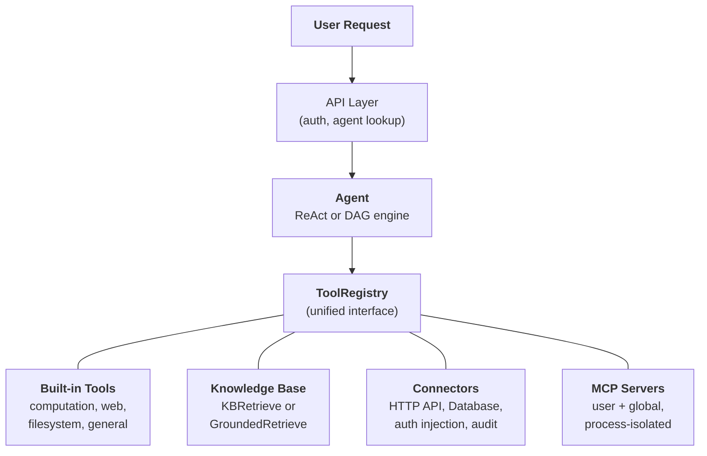
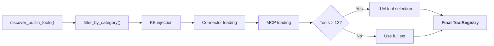

---
title: "Systemübersicht"
description: "Wie Agent, Knowledge Base, Connector, Built-in Tools und MCP sich zu einer einheitlichen Architektur zusammensetzen."
---## Die einheitliche Tool-Abstraktion

Die zentrale Designidee in FIM One ist, dass **alles, was der Agent tun kann, ein Tool ist**. Ein Taschenrechner, eine Wissensdatenbankabfrage, ein ERP-API-Aufruf und ein MCP-Server eines Drittanbieters implementieren alle das gleiche `Tool`-Protokoll: `name`, `description`, `parameters_schema`, `category` und `run()`. Der Agent weiß nicht und kümmert sich nicht darum, ob er eine lokale Python-Funktion aufruft, eine Vektordatenbank abfragt, in ein Legacy-System proxyt oder einen Community-MCP-Server aufruft. Er sieht eine flache Liste von aufrufbaren Tools in einer `ToolRegistry`.

Dies ist eine bewusste architektonische Entscheidung, keine zufällige Vereinfachung. Das bedeutet, dass das Hinzufügen einer neuen Funktionsquelle niemals eine Änderung des Agenten, der Ausführungs-Engines oder der Context-Management-Schicht erfordert. Sie registrieren Tools; der Agent nutzt sie.

Vier Funktionsquellen konvergieren in einer Registry. Der Agent schöpft gleichermaßen aus allen.## Vier Fähigkeitsquellen### Integrierte Tools

Werden beim Start automatisch über `discover_builtin_tools()` erkannt. Legen Sie eine `BaseTool`-Unterklasse in `core/tool/builtin/` ab, und sie registriert sich ohne Konfiguration. Kategorien umfassen Berechnung (`calculator`, `python_exec`), Web (`web_search`, `web_fetch`), Dateisystem (`file_ops`) und Allgemein (`email_send`, `json_transform`, `template_render`, `text_utils`). Dies sind die nativen Fähigkeiten des Agenten -- immer verfügbar, keine Einrichtung erforderlich.### Knowledge Base

Bedingt. Wenn ein Agent `kb_ids` gebunden hat, wird das generische `kb_retrieve` Tool durch ein spezialisiertes Abruf-Tool ersetzt. Im **einfachen Modus** führt `KBRetrieveTool` grundlegende RAG-Abruf durch. Im **Grounding-Modus** führt `GroundedRetrieveTool` eine 5-stufige Pipeline aus: Multi-KB-Abruf, Zitat-Extraktion, Alignment-Scoring, Konflikt-Erkennung und Konfidenz-Berechnung. Die Knowledge Base ist kein separates Subsystem neben dem Agent -- sie tritt in den Agent als spezialisiertes Tool ein, unterworfen dem gleichen `Tool` Protokoll wie alles andere.### Connector

`ConnectorToolAdapter` wraps enterprise system actions as tools. Each action becomes a tool named `{connector}__{action}`, categorized as `connector`. The adapter adds HTTP proxy with auth injection (bearer, API key, basic), operation-level access control (read/write/admin), response truncation, and audit logging. For direct database access, `DatabaseToolAdapter` provides schema-aware SQL execution with optional read-only enforcement. Connectors are the bridge between AI and legacy systems -- the core differentiator. See [Connector Architecture](/architecture/connector-architecture) for the full design.### MCP

Externe MCP-Server stellen Tools von Drittanbietern über das Standardprotokoll bereit. Jeder Server läuft in seinem eigenen Prozess (stdio oder HTTP-Transport) und ist vollständig von der Plattform isoliert. Tools werden in das `Tool`-Protokoll adaptiert und unter der Kategorie `mcp` registriert. Administratoren können **globale MCP-Server** bereitstellen, die automatisch für alle Benutzer geladen werden. MCP ist das Ökosystem-Angebot – jeder MCP-kompatible Server funktioniert ohne benutzerdefinierte Integration.## Per-Request-Tool-Assembly

Jede Chat-Anfrage assembliert einen frischen Tool-Satz durch eine Filterpipeline in `_resolve_tools()`. Dies ist keine statische Konfiguration -- sie wird pro Anfrage basierend auf den Agent-Einstellungen, der Benutzeridentität und den verfügbaren Connectoren und MCP-Servern berechnet.

Die sechs Schritte:

1. **Basis-Discovery.** `discover_builtin_tools()` lädt alle integrierten Tools, begrenzt auf die Sandbox des Gesprächs.
2. **Agent-Kategorie-Filter.** `filter_by_category(*agent.tool_categories)` beschränkt auf nur die Kategorien, die der Agent verwenden darf.
3. **KB-Injection.** Wenn der Agent `kb_ids` hat, wird das generische Abruf-Tool durch `KBRetrieveTool` oder `GroundedRetrieveTool` basierend auf dem Abruf-Modus ersetzt.
4. **Connector-Laden.** Die gebundenen Connectoren des Agents werden aus der Datenbank abgefragt. Die Aktionen jedes Connectors (oder Datenbankschemas) werden als Tool-Adapter instanziiert und registriert.
5. **MCP-Laden.** Die persönlichen MCP-Server des Benutzers plus von Administratoren bereitgestellte globale MCP-Server werden geladen, verbunden und ihre Tools registriert.
6. **Runtime-Auswahl.** Wenn die Gesamtzahl der Tools 12 überschreitet, wählt ein leichter LLM-Aufruf die relevanteste Teilmenge (bis zu 6) für diese spezifische Anfrage aus. Auswahlfehlschlag ist nicht fatal -- der Agent fällt auf den vollständigen Satz zurück.

Das Ergebnis: Der Agent sieht genau die Tools, die er braucht, nicht mehr. Ein einfacher Agent ohne Connectoren und ohne KB könnte 5 Tools sehen. Ein Hub-Agent, der mit 3 Unternehmenssystemen verbunden ist, mit einer fundierten Wissensdatenbank und 2 MCP-Servern könnte 30 sehen -- aber nach der Auswahl machen es nur die 6 relevantesten in den Kontext.## Wann man was verwendet

| Anforderung | Verwendung | Grund |
|------|-----|-----|
| Allgemeine Berechnungen, Code-Ausführung, Texttransformationen | Built-in Tool | Immer verfügbar, keine Konfiguration erforderlich |
| Enterprise-Systemintegration (ERP, CRM, OA) | Connector | Auth-Governance, Audit-Trail, Zugriffskontrolle auf Operationsebene |
| Wissensabruf mit Zitaten und Belegen | Knowledge Base | RAG-Pipeline, fundierte Generierung, Konflikterkennung |
| Ökosystem von Drittanbieter-Tools | MCP | Standardprotokoll, Prozessisolation, Community-Server |
| Direkter Datenbankzugriff | Database Connector | Schema-bewusste SQL, optionale Read-Only-Erzwingung |
| Benutzerdefinierte interne Tools | MCP oder Built-in | MCP für Prozessisolation; Built-in für enge Integration |

Die Kategorien schließen sich nicht gegenseitig aus. Ein einzelner Agent kann alle vier Funktionsquellen in einem Gespräch verwenden -- eine Knowledge Base nach Richtliniendokumenten abfragen, einen Connector aufrufen, um das ERP zu überprüfen, und ein Built-in Tool verwenden, um die Ergebnisse zu formatieren.## Ausführungs-Engines sind orthogonal

Das Tool-System und die Ausführungs-Engines sind unabhängige Concerns. Beide Engines verbrauchen Tools aus derselben `ToolRegistry`. Die Wahl der Engine beeinflusst, wie Tools orchestriert werden, nicht welche Tools verfügbar sind.

**ReAct** ist eine iterative Tool-Schleife. Der Agent argumentiert, wählt ein Tool, beobachtet das Ergebnis und wiederholt dies, bis er fertig ist. Es zeichnet sich bei explorativen, konversationalen Aufgaben aus, bei denen der nächste Schritt vom vorherigen Ergebnis abhängt. Die Schleife läuft bis zu 50 Iterationen mit Kontextverwaltung pro Iteration über ContextGuard. Siehe [ReAct Engine](/architecture/react-engine) für Implementierungsdetails.

**DAG** zerlegt ein Ziel in 2-6 parallele Schritte. Jeder Schritt führt einen unabhängigen ReAct-Agent aus. Ein PlanAnalyzer bewertet, ob das Ziel erreicht wurde; wenn nicht, plant die Pipeline autonom neu (bis zu 3 Runden). DAG zeichnet sich bei Aufgaben mit klaren Teilaufgaben aus, die gleichzeitig ausgeführt werden können -- „drei Quellen durchsuchen und Ergebnisse vergleichen" wird in der Zeit einer Suche abgeschlossen, nicht drei. Siehe [DAG Engine](/architecture/dag-engine) für die vollständige Pipeline.

Die beiden Engines teilen sich Infrastruktur: `structured_llm_call` für zuverlässige strukturierte Ausgabe, `ContextGuard` für Durchsetzung des Token-Budgets und die `ToolRegistry` für Tool-Auflösung. Das Hinzufügen eines neuen Tools erfordert keine Änderungen an einer der Engines. Das Hinzufügen einer neuen Engine (falls jemals nötig) erfordert keine Änderungen am Tool-System.## Lifecycle-Übersicht

**Startup.** `start.sh` führt Alembic-Migrationen aus, startet den FastAPI-Server, erkennt integrierte Tools und etabliert MCP-Serververbindungen für alle vorkonfigurierten globalen Server.

**Pro Anfrage.** JWT-Authentifizierung, Agent-Konfigurationssuche, Tool-Zusammenstellung (die 6-Schritte-Pipeline oben), Engine-Auswahl (ReAct oder DAG basierend auf Agent-Konfiguration), Ausführung mit SSE-Streaming und Ergebnispersistenz.

**Querschnittliche Belange.** [Context-Verwaltung](/architecture/context-management) (5-Schichten-Token-Budget) schützt jeden LLM-Aufruf vor Überlauf. Audit-Logging verfolgt jede Connector-Tool-Invokation. Sandbox-Isolation enthält Code-Ausführungs-Tools. Die Zwei-LLM-Architektur (smart + fast) optimiert Kosten über Planung, Ausführung und Synthese.

Die Architektur ist so gestaltet, dass jeder Belang – Tool-Registrierung, Ausführungsorchestration, Context-Verwaltung, Sicherheit – unabhängig weiterentwickelt werden kann. Ein neuer Connector-Typ, eine neue Ausführungs-Engine oder eine neue Context-Strategie können hinzugefügt werden, ohne kaskadierende Änderungen im gesamten System zu verursachen.