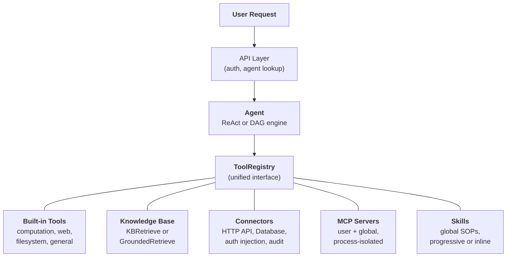
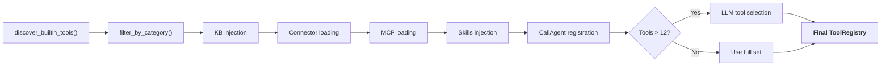

## Die einheitliche Werkzeug-Abstraktion

Die zentrale Designidee in FIM One ist, dass **alles, was der Agent tun kann, ein Werkzeug ist**. Ein Rechner, eine Wissensdatenbankabfrage, ein ERP-API-Aufruf und ein MCP-Server eines Drittanbieters implementieren alle das gleiche `Tool`-Protokoll: `name`, `description`, `parameters_schema`, `category` und `run()`. Der Agent weiß nicht und kümmert sich nicht darum, ob er eine lokale Python-Funktion aufruft, eine Vektordatenbank abfragt, in ein Legacy-System weitergeleitet wird oder einen Community-MCP-Server aufruft. Er sieht eine flache Liste von aufrufbaren Werkzeugen in einer `ToolRegistry`.

Dies ist eine bewusste architektonische Entscheidung, keine zufällige Vereinfachung. Das bedeutet, dass das Hinzufügen einer neuen Funktionsquelle niemals eine Änderung des Agenten, der Ausführungs-Engines oder der Kontextverwaltungsschicht erfordert. Sie registrieren Werkzeuge; der Agent nutzt sie.

Fünf Funktionsquellen konvergieren in einer Registrierung. Der Agent schöpft aus allen gleichermaßen.

## Fünf Fähigkeitsquellen

### Integrierte Werkzeuge

Werden beim Start automatisch über `discover_builtin_tools()` erkannt. Legen Sie eine `BaseTool`-Unterklasse in `core/tool/builtin/` ab, und sie registriert sich ohne Konfiguration. Kategorien umfassen Berechnung (`calculator`, `python_exec`), Web (`web_search`, `web_fetch`), Dateisystem (`file_ops`) und allgemein (`email_send`, `json_transform`, `template_render`, `text_utils`). Dies sind die nativen Fähigkeiten des Agenten -- immer verfügbar, keine Einrichtung erforderlich.

### Wissensdatenbank

Bedingt. Wenn ein Agent `kb_ids` gebunden hat, wird das generische `kb_retrieve`-Tool durch ein spezialisiertes Abruf-Tool ersetzt. Im **einfachen Modus** führt `KBRetrieveTool` grundlegende RAG-Abruf durch. Im **Grounding-Modus** führt `GroundedRetrieveTool` eine 5-stufige Pipeline aus: Multi-Wissensdatenbank-Abruf, Zitierextraktion, Alignment-Bewertung, Konflikt-Erkennung und Konfidenz-Berechnung. Die Wissensdatenbank ist kein separates Subsystem neben dem Agent – sie wird als spezialisiertes Tool in den Agent integriert und unterliegt demselben `Tool`-Protokoll wie alles andere.

### Connector

`ConnectorToolAdapter` umhüllt Unternehmensystemaktionen als Tools. Jede Aktion wird zu einem Tool mit dem Namen `{connector}__{action}`, kategorisiert als `connector`. Der Adapter fügt HTTP-Proxy mit Auth-Injection (Bearer, API-Schlüssel, Basic), Zugriffskontrolle auf Operationsebene (Lesen/Schreiben/Admin), Antworttrunkierung und Audit-Logging hinzu. Für direkten Datenbankzugriff bietet `DatabaseToolAdapter` schemaabhängige SQL-Ausführung mit optionaler Schreibschutz-Erzwingung. Konnektoren sind die Brücke zwischen KI und Legacy-Systemen -- der Kernunterscheidungsmerkmal. Siehe [Connector-Architektur](/architecture/connector-architecture) für das vollständige Design.

### MCP

Externe MCP-Server stellen Tools von Drittanbietern über das Standardprotokoll bereit. Jeder Server läuft in seinem eigenen Prozess (stdio oder HTTP-Transport) und ist vollständig von der Plattform isoliert. Tools werden in das `Tool`-Protokoll adaptiert und unter der Kategorie `mcp` registriert. Administratoren können **globale MCP-Server** bereitstellen, die automatisch für alle Benutzer geladen werden. MCP ist das Ökosystem-Angebot – jeder MCP-kompatible Server funktioniert ohne benutzerdefinierte Integration.

### Fähigkeiten

Fähigkeiten sind wiederverwendbare Standard Operating Procedures (SOPs) – Unternehmensrichtlinien, Handlungsverfahren, schrittweise Arbeitsabläufe – die global gelten, unabhängig davon, welcher Agent ausgewählt ist. Im Gegensatz zu Konnektoren und Wissensdatenbanken (die auf bestimmte Agenten beschränkt werden können) werden Fähigkeiten immer für jeden Benutzer basierend auf der Sichtbarkeit (persönlich, organisationsweit freigegeben oder Market-abonniert) geladen.

Fähigkeiten unterstützen zwei Injektionsmodi. Im **progressiven Modus** (Standard) enthält die Systemaufforderung kompakte Stubs (Name + Beschreibung), und das LLM ruft `read_skill(name)` bei Bedarf auf, um den vollständigen Inhalt zu laden – was Kontexttokens spart, wenn viele Fähigkeiten verfügbar sind. Im **Inline-Modus** wird der vollständige Inhalt der Fähigkeit direkt in die Systemaufforderung eingebettet – geeignet, wenn wenige, kleine Fähigkeiten verwendet werden.

Für einen tieferen Einblick, warum Fähigkeiten global sind (nicht an Agenten gebunden) und wie sie mit der dualen Ressourcenerkennung interagieren, siehe [Agent & Ressourcenerkennung](/architecture/agent-discovery).

## Werkzeugzusammensetzung pro Anfrage

Jede Chat-Anfrage stellt einen neuen Werkzeugsatz durch eine Filterpipeline in `_resolve_tools()` zusammen. Dies ist keine statische Konfiguration -- sie wird pro Anfrage basierend auf den Einstellungen des Agenten, der Identität des Benutzers und den verfügbaren Konnektoren und MCP-Servern berechnet.

Die acht Schritte:

1. **Basis-Erkennung.** `discover_builtin_tools()` lädt alle integrierten Werkzeuge, begrenzt auf die Sandbox der Konversation.
2. **Agenten-Kategoriefilter.** `filter_by_category(*agent.tool_categories)` beschränkt sich nur auf die Kategorien, die der Agent verwenden darf.
3. **KB-Injektion.** Wenn der Agent `kb_ids` hat, wird das generische Abrufwerkzeug durch `KBRetrieveTool` oder `GroundedRetrieveTool` basierend auf dem Abrufmodus ersetzt.
4. **Konnektoren-Laden.** Im agenten-beschränkten Modus werden nur die an den Agenten gebundenen Konnektoren geladen. Im Auto-Discovery-Modus (kein Agent ausgewählt) werden alle für den Benutzer sichtbaren Konnektoren geladen -- mit `ConnectorMetaTool` für API-Konnektoren (progressive Erkennung) und einzelnen Werkzeugen für Datenbank-Konnektoren.
5. **MCP-Laden.** Die persönlichen MCP-Server des Benutzers plus von Administratoren bereitgestellte globale MCP-Server werden geladen, verbunden und ihre Werkzeuge registriert.
6. **Skills-Injektion.** Alle aktiven Skills, die für den Benutzer sichtbar sind, werden geladen -- unabhängig von der Agenten-Auswahl. Im progressiven Modus wird `ReadSkillTool` mit kompakten Stubs in der Systemaufforderung registriert. Im Inline-Modus wird der vollständige Skill-Inhalt direkt eingebettet.
7. **CallAgent-Registrierung.** Alle aktiven, sichtbaren Agenten werden in einem Katalog zusammengefasst und über `CallAgentTool` verfügbar gemacht, was dem LLM ermöglicht, Aufgaben an spezialisierte Sub-Agenten zu delegieren. Sub-Agenten erhalten eine vollständige `ToolRegistry`, die aus ihrer eigenen Konfiguration erstellt wird, schließt aber `call_agent` aus, um unendliche Rekursion zu verhindern.
8. **Laufzeit-Auswahl.** Wenn die Gesamtzahl der Werkzeuge 12 überschreitet, wählt ein leichter LLM-Aufruf die relevanteste Teilmenge (bis zu 6) für diese spezifische Anfrage aus. Auswahlfehlschlag ist nicht fatal -- der Agent fällt auf den vollständigen Satz zurück.

Das Ergebnis: Der Agent sieht genau die Werkzeuge, die er benötigt, nicht mehr. Ein einfacher Agent ohne Konnektoren und ohne KB könnte 5 Werkzeuge sehen. Ein Hub-Agent, der mit 3 Unternehmenssystemen verbunden ist, eine fundierte Wissensdatenbank hat und 2 MCP-Server nutzt, könnte 30 sehen -- aber nach der Auswahl schaffen es nur die 6 relevantesten in den Kontext.

## Wann man was verwendet

| Anforderung | Verwendung | Grund |
|------|-----|-----|
| Allgemeine Berechnung, Code-Ausführung, Texttransformationen | Integriertes Tool | Immer verfügbar, keine Konfiguration erforderlich |
| Enterprise-Systemintegration (ERP, CRM, OA) | Konnektor | Auth-Governance, Audit-Trail, Zugriffskontrolle auf Operationsebene |
| Wissensabruf mit Zitaten und Belegen | Wissensdatenbank | RAG-Pipeline, fundierte Generierung, Konfidenzscoring |
| Ökosystem von Drittanbieter-Tools | MCP | Standardprotokoll, Prozessisolation, Community-Server |
| Organisationsrichtlinien, SOPs, Handlungsverfahren | Fähigkeit | Standardmäßig global, progressives Laden, Sichtbarkeitsbereich |
| Aufgaben an spezialisierte Agenten delegieren | Agent aufrufen | Semantisches Agent-Routing, vollständige Tool-Vererbung, parallele Ausführung |
| Direkter Datenbankzugriff | Datenbank-Konnektor | Schema-bewusstes SQL, optionale Nur-Lese-Erzwingung |
| Benutzerdefinierte interne Tools | MCP oder Integriert | MCP für Prozessisolation; integriert für enge Integration |

Die Kategorien schließen sich nicht gegenseitig aus. Ein einzelner Agent kann alle fünf Funktionsquellen in einem Gespräch verwenden – eine Fähigkeit für das SOP zur Beschwerdeverarbeitung laden, eine Wissensdatenbank nach Richtliniendokumenten abfragen, einen Konnektor aufrufen, um das ERP zu überprüfen, die Analyse an einen spezialisierten Sub-Agenten delegieren und ein integriertes Tool verwenden, um die Ergebnisse zu formatieren.

## Ausführungs-Engines sind orthogonal

Das Tool-System und die Ausführungs-Engines sind unabhängige Aspekte. Die LLM-gesteuerten Engines (ReAct und DAG) nutzen Tools aus derselben `ToolRegistry`. Die Wahl der Engine beeinflusst, wie Tools orchestriert werden, nicht welche Tools verfügbar sind.

**ReAct** ist eine iterative Tool-Schleife. Der Agent argumentiert, wählt ein Tool, beobachtet das Ergebnis und wiederholt dies, bis er fertig ist. Es eignet sich hervorragend für explorative, konversationelle Aufgaben, bei denen der nächste Schritt vom vorherigen Ergebnis abhängt. Die Schleife läuft bis zu 50 Iterationen mit Kontextverwaltung pro Iteration über ContextGuard. Siehe [ReAct Engine](/architecture/react-engine) für Implementierungsdetails.

**DAG** zerlegt ein Ziel in 2-6 parallele Schritte. Jeder Schritt führt einen unabhängigen ReAct-Agent aus. Ein PlanAnalyzer bewertet, ob das Ziel erreicht wurde; falls nicht, plant die Pipeline autonom neu (bis zu 3 Runden). DAG eignet sich hervorragend für Aufgaben mit klaren Teilaufgaben, die gleichzeitig ausgeführt werden können – „drei Quellen durchsuchen und Ergebnisse vergleichen" wird in der Zeit einer Suche abgeschlossen, nicht drei. Siehe [DAG Engine](/architecture/dag-engine) für die vollständige Pipeline.

Die beiden Engines nutzen gemeinsame Infrastruktur: `structured_llm_call` für zuverlässige strukturierte Ausgaben, `ContextGuard` für die Durchsetzung des Token-Budgets und die `ToolRegistry` für Tool-Auflösung. Das Hinzufügen eines neuen Tools erfordert keine Änderungen an einer der Engines. Das Hinzufügen einer neuen Engine (falls jemals nötig) erfordert keine Änderungen am Tool-System.

Beide Engines unterstützen auch **Multi-Agent-Delegation** über `CallAgentTool`. Im nativen Function-Calling-Modus kann das LLM mehrere `call_agent`-Aufrufe in einer einzigen Runde aufrufen, die gleichzeitig über `asyncio.gather` ausgeführt werden. Jeder Sub-Agent erhält seine eigene `ToolRegistry` und läuft als vollständige Ausführungseinheit. Für das detaillierte Design der Agent-Erkennung, Skills als globale SOPs und Multi-Agent-Orchestrierung siehe [Agent & Resource Discovery](/architecture/agent-discovery).

### Workflow Engine — das dritte Paradigma

Neben den LLM-gesteuerten ReAct- und DAG-Engines enthält FIM One einen **Workflow Engine** — einen visuellen DAG-Editor mit 26 Knotentypen für die Automatisierung fester Prozesse (Genehmigungsketten, geplante ETL, mehrstufige Pipelines). Workflows können Agenten, Konnektoren, Knowledge Bases, MCP Server, LLM-Aufrufe, HTTP-Anfragen, Python-Code und manuelle Genehmigungsgates aufrufen. Die Beziehung ist asymmetrisch: Workflows können Agenten orchestrieren (über den AGENT-Knoten), aber Agenten können Workflows nicht direkt aufrufen. Verwenden Sie Agenten für flexible, explorative Aufgaben; verwenden Sie Workflows für deterministische, wiederholbare Prozesse. Weitere Informationen finden Sie unter [Execution Modes](/concepts/execution-modes).

## Lifecycle-Übersicht

**Startup.** `start.sh` führt Alembic-Migrationen aus, startet den FastAPI-Server, erkennt integrierte Werkzeuge und stellt MCP-Serververbindungen für alle vorkonfigurierten globalen Server her.

**Pro Anfrage.** JWT-Authentifizierung, Agenten-Konfigurationssuche, Werkzeugzusammenbau (die 8-Schritte-Pipeline oben), Engine-Auswahl (ReAct oder DAG basierend auf Agenten-Konfiguration), Ausführung mit SSE-Streaming und Ergebnispersistenz.

**Übergreifende Belange.** [Kontextverwaltung](/architecture/context-management) (5-Schichten-Token-Budget) schützt jeden LLM-Aufruf vor Überlauf. Audit-Logging verfolgt jede Konnektor-Werkzeugaufrufe. Sandbox-Isolation enthält Code-Ausführungswerkzeuge. Die Zwei-LLM-Architektur (intelligent + schnell) optimiert Kosten über Planung, Ausführung und Synthese.

Die Architektur ist so konzipiert, dass jeder Belang – Werkzeugregistrierung, Ausführungsorchestration, Kontextverwaltung, Sicherheit – sich unabhängig entwickeln kann. Ein neuer Konnektor-Typ, eine neue Ausführungs-Engine oder eine neue Kontextstrategie können hinzugefügt werden, ohne kaskadierende Änderungen im gesamten System zu verursachen.
