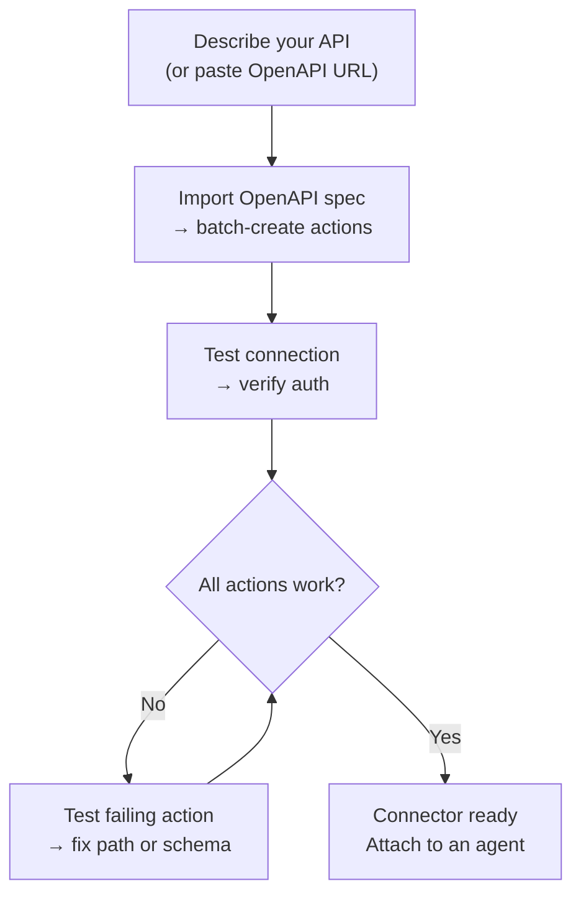
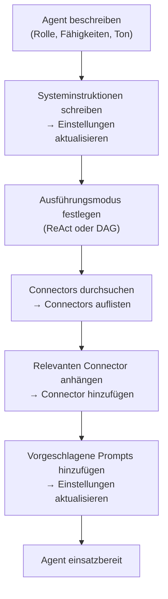

---
title: "AI Builder"
description: "Verwenden Sie KI, um Connectors und Agents zu erstellen — schnelle Vorschläge oder einen vollständigen ReAct Builder."
---## Übersicht

AI Builder ermöglicht es dir, deine Anforderungen in natürlicher Sprache zu beschreiben und lässt einen KI-Agent diese für dich konfigurieren. Es funktioniert in zwei Modi:

| Modus | Funktionsweise | Am besten geeignet für |
|------|-------------|---------|
| **Quick suggestions** | Ein einzelner LLM-Aufruf generiert die Konfiguration | Schneller erster Entwurf, einfache APIs |
| **Advanced builder** | Ein ReAct-Agent nutzt Tools in einer Schleife zum Erstellen, Testen und Verfeinern | Komplexe APIs, OpenAPI-Import, iterative Verfeinerung |

Du kannst jederzeit zwischen den Modi wechseln. Der Quick-Modus erstellt einen Ausgangspunkt; der Advanced Builder ermöglicht dir, zu iterieren.

---## Connector Builder

Ein **Connector** definiert, wie FIM One mit einem externen System kommuniziert — seine Basis-URL, Authentifizierung und die spezifischen API-Aktionen, die er bereitstellt. Der Connector Builder bietet einem KI-Agenten 9 Tools, um diese Konfiguration in Ihrem Namen zu erstellen und zu verwalten.### Tools

| Tool | Was es tut |
|------|-------------|
| **Get Settings** | Liest die aktuelle Connector-Konfiguration (URL, Authentifizierungstyp, Authentifizierungskonfiguration) |
| **Update Settings** | Ändert den Connector-Namen, die Basis-URL oder die Authentifizierungsdaten |
| **List Actions** | Zeigt alle vorhandenen API-Aktionen mit ihren Methoden und Pfaden an |
| **Create Action** | Fügt einen neuen API-Endpunkt hinzu — HTTP-Methode, Pfad, Parameter, Body-Template |
| **Update Action** | Ändert eine vorhandene Aktion (Beschreibung, Schema, Response-Extraktion) |
| **Delete Action** | Entfernt eine Aktion, die nicht mehr benötigt wird |
| **Test Action** | Sendet eine Live-HTTP-Anfrage für eine beliebige Aktion und untersucht die Antwort |
| **Test Connection** | Überprüft, ob die Basis-URL erreichbar ist und die Anmeldedaten akzeptiert werden |
| **Import OpenAPI** | Batch-Import von bis zu 50 Endpunkten aus einer Swagger 2.x- oder OpenAPI 3.x-Spezifikation |### Typischer Workflow

Das häufigste Muster: Fügen Sie eine OpenAPI-URL ein und lassen Sie den Builder den Rest erledigen.

**Beispiel-Prompt:**
> "Import the OpenAPI spec from `https://api.acme.com/openapi.json`, then test the `GET /orders` endpoint with `order_id=12345`."

Der Builder ruft die Spezifikation ab, erstellt automatisch alle Aktionen, sendet eine Test-Anfrage und meldet das Ergebnis – alles ohne dass Sie ein Formular anfassen müssen.

---## Agent Builder

Ein **Agent** ist eine benannte KI-Persona mit einer Reihe von Anweisungen, Tools und (optional) Connectoren. Der Agent Builder gibt einem KI-Agent 6 Tools zur Verfügung, um einen anderen Agent von Grund auf zu konfigurieren.### Tools

| Tool | What it does |
|------|-------------|
| **Get Settings** | Aktuelle Agent-Konfiguration lesen (Anweisungen, Ausführungsmodus, Tools, Modell) |
| **Update Settings** | Name, Beschreibung, Systemaufforderung, Ausführungsmodus oder vorgeschlagene Aufforderungen ändern |
| **List Connectors** | Alle verfügbaren Connectors durchsuchen (angebunden und nicht angebunden) |
| **Add Connector** | Einen Connector angebunden, damit der Agent seine Aktionen als Tools aufrufen kann |
| **Remove Connector** | Einen Connector trennen (der Connector selbst wird nicht gelöscht) |
| **Set Model** | Das zugrunde liegende LLM wechseln oder Temperatur und maximale Token anpassen |### Typischer Workflow

Beginnen Sie mit einer Beschreibung und lassen Sie den Builder den gesamten Agent konfigurieren:

**Beispiel-Prompt:**
> "Erstellen Sie einen Finance Copilot. Er sollte Fragen zu Bestellungen und Rechnungen mithilfe des Acme-Connectors beantworten. Verwenden Sie ReAct-Modus und fügen Sie 3 vorgeschlagene Prompts für häufige Fragen hinzu."

Der Builder liest die aktuellen Einstellungen, schreibt einen System-Prompt, hängt den Connector an, legt den Ausführungsmodus fest und fügt vorgeschlagene Prompts hinzu — alles in einer einzigen Gesprächsrunde.## Wie es funktioniert

Unter der Haube nutzen beide Builder die gleiche Infrastruktur wie reguläre Agents:

| Builder-Modus | Mechanismus |
|-------------|-----------|
| **Quick suggestions** | Ein einzelner LLM-Inferenzaufruf generiert die vollständige Konfiguration als strukturiertes JSON |
| **Advanced builder** | Eine ReAct-Agent-Schleife: Reason → Builder-Tool aufrufen → Ergebnis beobachten → nächsten Schritt entscheiden |

Der Advanced Builder ist ein vollständiger ReAct-Agent, der zufällig über einen eingeschränkten Toolset verfügt — nur die 9 Connector- oder 6 Agent-Builder-Tools, keine Web- oder Berechnungs-Tools. Er liest den aktuellen Zustand der Zielressource, plant, welche Änderungen erforderlich sind, ruft die entsprechenden Tools auf und überprüft das Ergebnis, bevor er es als abgeschlossen erklärt.

Dies bedeutet, dass der Advanced Builder mit Mehrdeutigkeit umgehen kann: Wenn der OpenAPI-Import 30 Aktionen erstellt, aber nur 5 relevant sind, können Sie ihm sagen „behalte nur die bestellungsbezogenen Endpunkte" und er löscht den Rest.