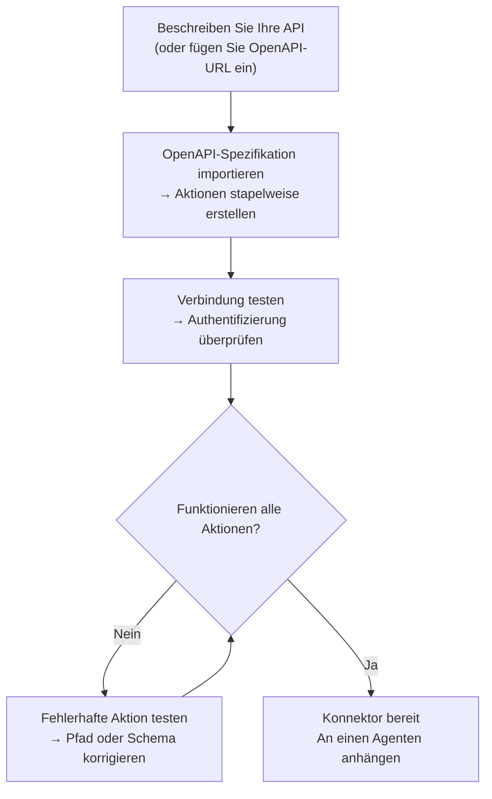
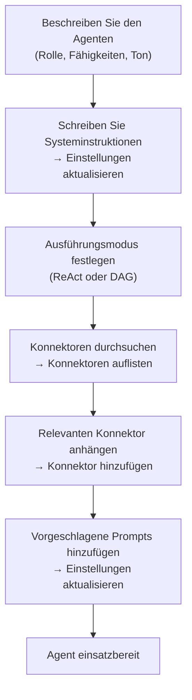

## Übersicht

AI Builder ermöglicht es dir, deine Anforderungen in natürlicher Sprache zu beschreiben und einen KI-Agent die Konfiguration für dich durchführen zu lassen. Es funktioniert in zwei Modi:

| Modus | Funktionsweise | Ideal für |
|------|-------------|---------|
| **Schnelle Vorschläge** | Ein einzelner LLM-Aufruf generiert die Konfiguration | Schneller erster Entwurf, einfache APIs |
| **Erweiterter Builder** | Ein ReAct-Agent verwendet Tools in einer Schleife zum Erstellen, Testen und Verfeinern | Komplexe APIs, OpenAPI-Import, iterative Verfeinerung |

Du kannst jederzeit zwischen den Modi wechseln. Der Schnellmodus erstellt einen Ausgangspunkt; der erweiterte Builder ermöglicht dir die Iteration.

---

## Connector-Builder

Ein **Connector** definiert, wie FIM One mit einem externen System kommuniziert — seine Basis-URL, Authentifizierung und die spezifischen API-Aktionen, die er bereitstellt. Der Connector-Builder gibt einem KI-Agenten 9 Tools zur Verfügung, um diese Konfiguration in Ihrem Namen zu erstellen und zu verwalten.

### Werkzeuge

| Werkzeug | Funktion |
|------|-------------|
| **Get Settings** | Aktuelle Connector-Konfiguration lesen (URL, Authentifizierungstyp, Authentifizierungskonfiguration) |
| **Update Settings** | Connector-Namen, Basis-URL oder Authentifizierungsdaten ändern |
| **List Actions** | Alle vorhandenen API-Aktionen mit ihren Methoden und Pfaden anzeigen |
| **Create Action** | Neuen API-Endpunkt hinzufügen — HTTP-Methode, Pfad, Parameter, Body-Vorlage |
| **Update Action** | Vorhandene Aktion ändern (Beschreibung, Schema, Response-Extraktion) |
| **Delete Action** | Aktion entfernen, die nicht mehr benötigt wird |
| **Test Action** | Live-HTTP-Anfrage für eine beliebige Aktion senden und Response inspizieren |
| **Test Connection** | Überprüfen, ob die Basis-URL erreichbar ist und die Anmeldedaten akzeptiert werden |
| **Import OpenAPI** | Bis zu 50 Endpunkte aus einer Swagger 2.x- oder OpenAPI 3.x-Spezifikation stapelweise importieren |

### Typischer Workflow

Das häufigste Muster: Fügen Sie eine OpenAPI-URL ein und lassen Sie den Builder den Rest erledigen.

**Beispiel-Eingabeaufforderung:**
> "Importieren Sie die OpenAPI-Spezifikation von `https://api.acme.com/openapi.json`, und testen Sie dann den `GET /orders`-Endpunkt mit `order_id=12345`."

Der Builder ruft die Spezifikation ab, erstellt automatisch alle Aktionen, sendet eine Testandfrage und meldet das Ergebnis – alles ohne dass Sie ein Formular anfassen müssen.

---

## Agent Builder

Ein **Agent** ist eine benannte KI-Persona mit einer Reihe von Anweisungen, Tools und (optional) Konnektoren. Der Agent Builder gibt einem KI-Agent 6 Tools zur Verfügung, um einen anderen Agent von Grund auf zu konfigurieren.

### Werkzeuge

| Werkzeug | Funktion |
|------|-------------|
| **Get Settings** | Aktuelle Agent-Konfiguration lesen (Anweisungen, Ausführungsmodus, Werkzeuge, Modell) |
| **Update Settings** | Name, Beschreibung, Systemaufforderung, Ausführungsmodus oder vorgeschlagene Aufforderungen ändern |
| **List Connectors** | Alle verfügbaren Konnektoren durchsuchen (angehängt und nicht angehängt) |
| **Add Connector** | Einen Konnektor anhängen, damit der Agent dessen Aktionen als Werkzeuge aufrufen kann |
| **Remove Connector** | Einen Konnektor abhängen (der Konnektor selbst wird nicht gelöscht) |
| **Set Model** | Das zugrunde liegende LLM wechseln oder Temperatur und maximale Token anpassen |

### Typischer Workflow

Beginnen Sie mit einer Beschreibung und lassen Sie den Builder den gesamten Agenten konfigurieren:

**Beispiel-Prompt:**
> "Erstellen Sie einen Finance Copilot. Er sollte Fragen zu Bestellungen und Rechnungen mithilfe des Acme-Konnektors beantworten. Verwenden Sie ReAct-Modus und fügen Sie 3 vorgeschlagene Prompts für häufige Fragen hinzu."

Der Builder liest die aktuellen Einstellungen, schreibt einen Systemprompt, hängt den Konnektor an, legt den Ausführungsmodus fest und fügt vorgeschlagene Prompts hinzu — alles in einer einzigen Gesprächsrunde.

---

## Funktionsweise

Unter der Haube nutzen beide Builder die gleiche Infrastruktur wie reguläre Agenten:

| Builder-Modus | Mechanismus |
|-------------|-----------|
| **Schnelle Vorschläge** | Ein einzelner LLM-Inferenzaufruf generiert die vollständige Konfiguration als strukturiertes JSON |
| **Erweiterter Builder** | Eine ReAct-Agentenschleife: Reasoning → Builder-Tool aufrufen → Ergebnis beobachten → nächsten Schritt entscheiden |

Der erweiterte Builder ist ein vollständiger ReAct-Agent, der über einen eingeschränkten Toolset verfügt – nur die 9 Connector- oder 6 Agent-Builder-Tools, keine Web- oder Berechnungstools. Er liest den aktuellen Zustand der Zielressource, plant welche Änderungen erforderlich sind, ruft die entsprechenden Tools auf und überprüft das Ergebnis, bevor er es als abgeschlossen erklärt.

Das bedeutet, der erweiterte Builder kann mit Mehrdeutigkeit umgehen: Wenn der OpenAPI-Import 30 Aktionen erstellt, aber nur 5 relevant sind, können Sie ihm sagen „behalte nur die bestellungsbezogenen Endpunkte" und er wird den Rest löschen.
