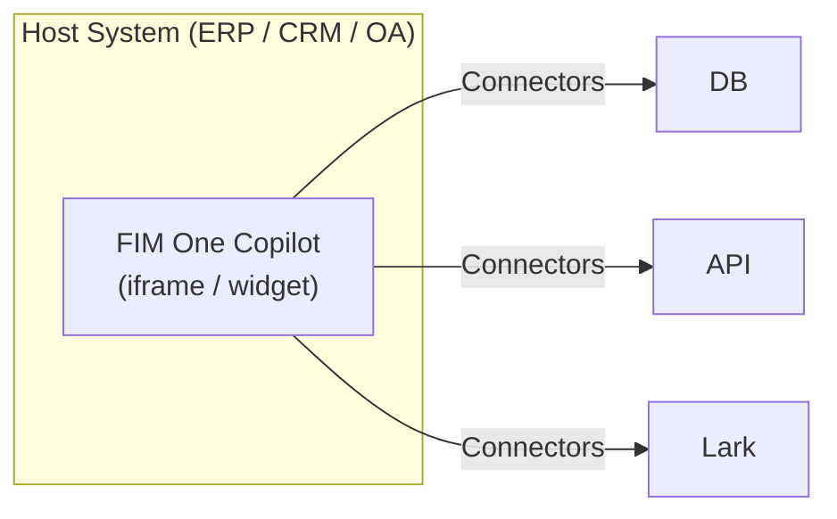
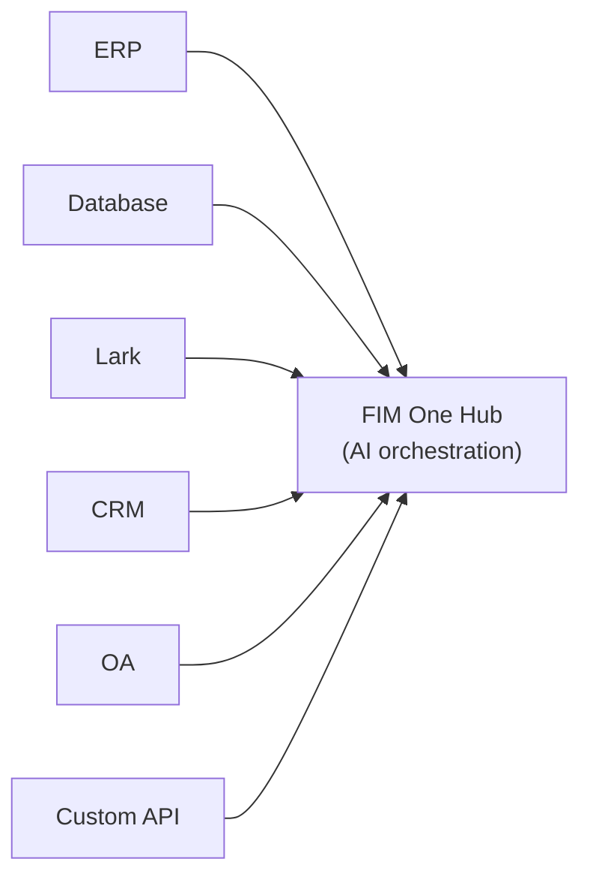
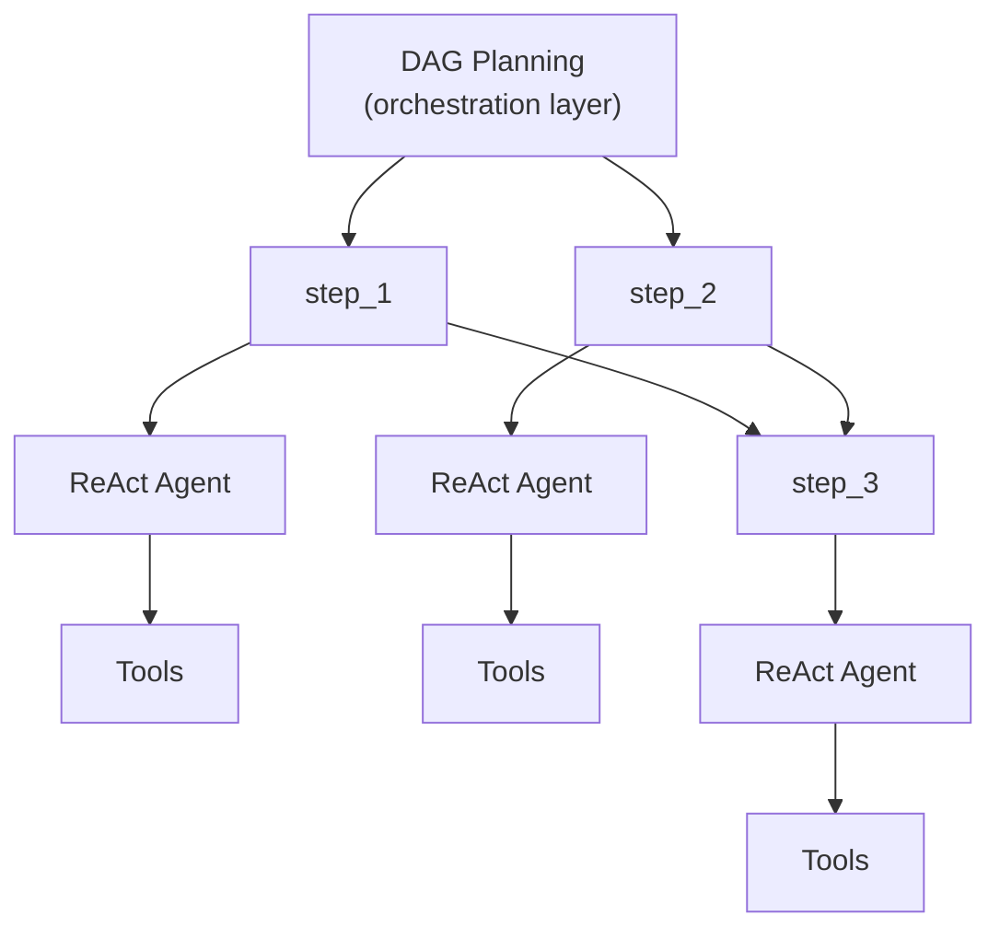

## Drei Modi

FIM One arbeitet in drei Modi, die davon bestimmt werden, wie der Agent bereitgestellt und verwendet wird:

| Modus | Was es ist | Bereitstellung | Beispiel |
|------|-----------|----------|---------|
| **Standalone** | Universeller KI-Assistent | Portal | Chat, Suche, Code-Ausführung, Wissensdatenbank-Q&A |
| **Copilot** | KI eingebettet in ein Host-System | iframe / Widget / Embed | „Finance Copilot" eingebettet in ERP-Web-UI |
| **Hub** | Zentrale systemübergreifende Orchestrierung | Portal / API | Agent fragt ERP ab, prüft OA-Genehmigungen, benachrichtigt über Lark |

Die Entwicklung ist natürlich: Beginnen Sie mit Standalone, betten Sie es als Copilot in ein Host-System ein, und richten Sie dann einen Hub für systemübergreifende Orchestrierung ein. Der Copilot läuft weiterhin eingebettet; der Hub fügt eine zentrale Orchestrierungsebene hinzu.

## Modusdetails

### Standalone (0 Konnektoren)

Der Standardmodus. FIM One funktioniert als vollwertiger KI-Assistent:

- Integrierte Tools: Websuche, Python-Ausführung, Rechner, Dateivorgänge, Shell-Befehle
- Wissensdatenbank mit RAG (PDF, DOCX, Markdown, HTML, CSV)
- Dynamische DAG-Planung für komplexe mehrstufige Aufgaben
- Echtzeit-Streaming mit DAG-Visualisierung

Kein externer Systemzugriff erforderlich. Nützlich für allgemeine Analysen, Recherchen und Code-Aufgaben.

### Copilot (eingebettet)

Betten Sie FIM One in die Web-UI eines Host-Systems ein. Der Agent arbeitet neben Benutzern in ihrer vertrauten Oberfläche – kein Kontextwechsel erforderlich. Der Copilot-Modus kann mehrere Konnektoren verwenden (z. B. die Datenbank des Host-Systems + einen Benachrichtigungsdienst).

Beispiele:
- **Finance Copilot**: Verbunden mit Kingdee (金蝶) über DB-Konnektor → Finanzberichte abfragen, Analysberichte generieren
- **Contract Copilot**: Verbunden mit Vertragsmanagementsystem über API-Konnektor → Verträge suchen, Klauseln extrahieren, Risiken bewerten
- **HR Copilot**: Verbunden mit HR-System über API-Konnektor → Mitarbeiterinformationen abfragen, Statistiken generieren

Der Agent nutzt die gleiche ReAct/DAG-Engine wie der Standalone-Modus, hat aber jetzt Zugriff auf echte Geschäftsdaten über den Konnektor.

### Hub (zentrale Orchestrierung)

Der Hub ist ein eigenständiges Portal (oder eine API), das als zentrale Intelligenzschicht dient. Er ist nicht in ein einzelnes System eingebettet – stattdessen verbindet er sich mit allen Systemen. Benutzer greifen über die Portal-UI oder API darauf zu.

Beispiele:
- "Überprüfe überfällige Verträge in CRM, kreuze mit ERP-Zahlungen ab, benachrichtige Finanzteam auf Lark"
- "Wenn OA-Genehmigung abgeschlossen ist, aktualisiere Vertragsstatus in CRM und protokolliere in Audit-Datenbank"
- "Abfrage von Verkaufsdaten aus Salesforce, Prognose mit Business-DB generieren, Zusammenfassung per E-Mail an Management senden"

Jeder Konnektor ist eine unabhängige Brücke. Das Hinzufügen oder Entfernen eines Konnektors beeinträchtigt die anderen nicht.

## Liefermethoden

| Liefermethode | Beschreibung | Typischer Modus |
|----------|-------------|-------------|
| **Portal (Web UI)** | Integrierte Next.js-Schnittstelle | Standalone, Hub |
| **API (headless)** | HTTP/SSE-Endpunkte (`/api/execute`, `/api/stream`) | Hub (programmgesteuerte Zugriffe) |
| **iframe / Embed** | In Host-System-Seiten injiziert | Copilot |

Liefermethode und Modus sind verwandt, aber nicht gekoppelt: Sie können auf einen Hub über die API zugreifen oder einen eigenständigen Agent über das Portal verwenden. Das typische Muster ist jedoch Portal für Hub und Embed für Copilot.

## Ausführungs-Engines (interne Implementierung)

Unter der Haube bietet FIM One zwei Ausführungs-Engines:

| Engine | Am besten für | Funktionsweise |
|--------|----------|-------------|
| **ReAct** | Einzelne komplexe Abfragen | Reason → Act → Observe Loop mit Tools |
| **DAG Planning** | Multi-Step parallele Aufgaben | LLM generiert Abhängigkeitsgraph, unabhängige Schritte laufen gleichzeitig |

ReAct ist die atomare Einheit; DAG ist die Orchestrierungsschicht. Beide Engines funktionieren in allen drei Modi (Standalone, Copilot, Hub). Im Hub-Modus kann ein einzelner DAG-Schritt Konnektoren zu verschiedenen Systemen aufrufen.

## Warum kein traditionelles Workflow-Engine

FIM One baut bewusst **keinen** Drag-and-Drop-Workflow-Editor. Dies ist eine strategische Entscheidung:

1. **Workflows existieren bereits anderswo.** Die festen Prozesse von Enterprise-Kunden (Genehmigungsketten, Audit-Flows) befinden sich in ihren OA-, ERP- und Legacy-Systemen. Sie benötigen AI, die sich mit diesen Systemen verbindet, nicht einen weiteren Workflow-Editor.

2. **Dynamischer DAG deckt den flexiblen Fall ab.** Für nicht vordefinierte Aufgaben passen LLM-generierte DAGs zur Laufzeit an — keine menschliche Vorplanung erforderlich.

3. **Vorhandene Funktionen setzen sich zu festen Pipelines zusammen.** Geplante Jobs (geplant) triggern einen DAG-Agenten mit einem festen Prompt; der DAG plant die Schritte; Konnektoren verbinden sich mit Zielsystemen. Die Kombination entspricht einer statischen Pipeline — aber flexibler, weil die LLM ihren Plan basierend auf den Daten anpasst, auf die sie trifft.

4. **Konnektor = API-Aufruf.** Komplexe Workflow-Operationen (Übertragung, Ablehnung, Eskalation) sind die Verantwortung des Zielsystems. Aus der Perspektive des Konnektors ist jede Operation nur eine HTTP-Anfrage mit Parametern. FIM One ruft die API auf; das Zielsystem verwaltet die Zustandsmaschine.
