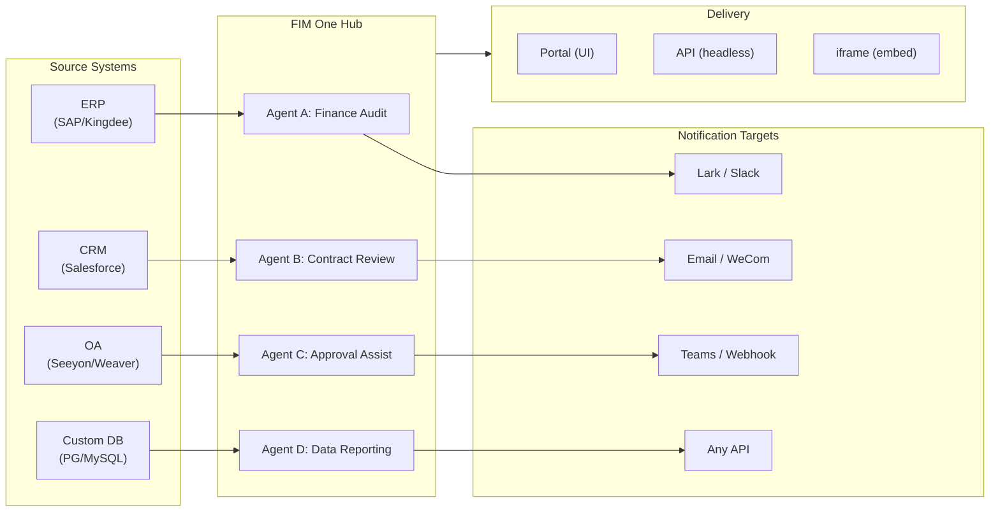

> Ziel: Aufbau eines **KI-gestützten Connector Hub** — Standalone (Portal-Assistent), Copilot (in Host-System integriert), Hub (zentrale systemübergreifende Orchestrierung).
>
> Prinzipien: **Provider-agnostisch** (keine Herstellerbindung), **minimale Abstraktion**, **protokollorientiert**, **connector-first** (Integration ist der Kernwert).## Produktvision

FIM One ist ein **AI Connector Hub**, der drei progressive Modi bietet:

```
Standalone   → Your own AI assistant (Portal)
Copilot      → AI embedded in a host system (iframe / widget / embed)
Hub          → Central cross-system orchestration (Portal / API)
```

**Hub Mode ist der Kernunterscheidungsfaktor.** Unternehmenskunden haben Legacy-Systeme — ERP, CRM, OA, Finance, HR — die über AI miteinander kommunizieren müssen:



**GTM-Pfad: Land and Expand**

| Schritt | Modus | Was passiert |
|------|------|-------------|
| Land | Copilot | In ein System einbetten, Wert in ihrer UI nachweisen |
| Expand | Copilot → Hub | Auf mehr Systeme ausrollen; Hub aggregiert sie |## Ausgelieferte Versionen### v0.1 (2026-02-22) — MVP: ReAct + DAG Planner
- ReActAgent mit Tools (calculator, python_exec, web_search)
- DAG Planner (LLM generiert Abhängigkeitsgraphen)
- Portal UI mit Streaming + KaTeX### v0.2 (2026-02-24) — Multi-Model + Memory
- Retry / rate limiting / usage tracking
- Native function calling (no JSON-only parsing)
- Multi-model support (fast + main LLM)
- Memory: WindowMemory, SummaryMemory
- FastAPI backend with SSE streaming### v0.3 (2026-02-25) — Web Tools + MCP
- Web tools (web_search, web_fetch) via Jina/Tavily/Brave
- File operations tool
- MCP client (standard tool integration)
- Tool auto-discovery + categories
- DAG visualization with click-to-scroll
- Code exec in Docker (`--network=none`)### v0.4 (2026-02-25) — Multi-Turn + Agents
- Multi-Turn-Gespräche (DbMemory)
- Tool-Step-Folding-UI
- HTTP-Request- und Shell-Exec-Tools
- Agent-Verwaltung (erstellen, konfigurieren, veröffentlichen)
- JWT-Authentifizierung
- Pro-Agent-Ausführungsmodus + Temperaturkontrolle### v0.5 (2026-02-28) — Full RAG + Grounded Gen
- Full RAG pipeline (embedding + vector store + FTS + RRF + reranker)
- Grounded Generation (citations, conflict detection, confidence scores)
- Knowledge base document management (CRUD, search, retry, schema migration)
- ContextGuard + pinned messages (token budget manager)
- DbMemory persistence + LLM Compact
- DAG Re-Planning (up to 3 rounds)### v0.6 (2026-03-01) — Connector Platform
- **Connector CRUD**: create, read, update, delete
- **ConnectorToolAdapter**: converts Connector → BaseTool
- **Per-user credentials**: AES-GCM encryption
- **Confirmation gate**: write operation approval
- **Audit logging**: all tool calls recorded
- **Circuit breaker**: graceful degradation on failures
- **Utility tools**: email_send, json_transform, template_render, text_utils
- **Embedding options**: Jina, OpenAI, custom providers### v0.7 (2026-03-06) — Admin Platform + Multi-Tenant
- **Admin Platform**: Benutzerverwaltung, Rollenwechsel, Passwort zurücksetzen, Konto aktivieren/deaktivieren
- **Nur auf Einladung Registrierung**: drei Modi (offen/Einladung/deaktiviert) + Einladungscode CRUD
- **Speicherverwaltung**: Festplattennutzung pro Benutzer, löschen, verwaiste Bereinigung
- **Gesprächsmoderation**: Admin-Liste/Löschen aller
- **Erzwungenes Logout pro Benutzer**: alle Token widerrufen
- **API-Gesundheits-Dashboard**: Systemstatistiken, Connector-Metriken
- **First-Run-Setup-Assistent**: geführte Admin-Kontoerstellung
- **Personal Center**: globale Anweisungen pro Benutzer, Spracheinstellung
- **JWT auth**: Token-basierte SSE-Authentifizierung, Gesprächseigentum
- **Global MCP servers**: von Admin bereitgestellt, in allen Sitzungen geladen
- **Rückwärtskompatibilität**: registration_enabled → registration_mode automatische Migration### v0.7.x (2026-03-07 bis 2026-03-12) — Stabilität + Polieren
- Verwaltung von Einladungscodes
- Pro-Benutzer-Kontingente (429-Durchsetzung)
- Strukturiertes Audit-Logging
- Filterung sensibler Wörter
- Admin-Login-Verlauf
- Admin-Dateibrowser
- Verbesserte Admin-Ansichten (Felder model_name, tools, kb_ids)
- Docker Compose-Bereitstellung (einzelnes Image, benannte Volumes)
- OAuth-Automatische Erkennung von window.location
- Erweitertes Denken / Reasoning-Unterstützung (`LLM_REASONING_EFFORT`, `LLM_REASONING_BUDGET_TOKENS`) für OpenAI o-Serie, Gemini 2.5+, Claude
- Admin pro Tool aktivieren/deaktivieren (deaktivierte Tools zur Laufzeit aus dem Chat ausgeschlossen)
- MCP-Server-Verwaltung zur Connectors-Seite verschoben
- Duale Datenbankunterstützung: SQLite (Null-Konfiguration Standard) + PostgreSQL (Produktion); Docker Compose stellt PostgreSQL automatisch bereit
- Dokumentationsseite zur Modellkonfiguration mit Extended-Thinking-Setup pro Anbieter
- SSE Protocol v2: Echtzeit-Antwort-Streaming mit `delta_reasoning`, `usage`-Feldern und aufgeteilten `done`/`suggestions`/`title`/`end`-Events; SQLite-Pool-Größe 5 -> 20
- AI Builder-Erweiterung: 7 neue Builder-Tools (GetSettings, TestConnection, ImportOpenAPI für Connectors; ListConnectors, AddConnector, RemoveConnector, SetModel für Agents), `is_builder`-Flag auf Agents, automatische Builder-Prompt-Aktualisierung, SSRF-Schutz
- SSE v2 Frontend: Streaming-Punkt-Puls-Cursor, DAG-Neuplan-Runden-Snapshots als zusammenklappbare Karten, DAG-Layout entkoppelt von Schrittständen
- Konzeptdokumentationsseite für AI Builder mit Connector- und Agent-Builder-Leitfäden
- Organisationssystem: vollständige CRUD-Operationen mit rollenbasierter Mitgliedschaft (Eigentümer/Admin/Mitglied), Admin-Verwaltungs-UI
- Dreiebenen-Ressourcensichtbarkeit (persönlich/org/global) für Agents, Connectors, Knowledge Bases, MCP-Server
- Veröffentlichungs-/Unveröffentlichungs-API für alle Ressourcentypen; Delegierung des Eigentümers für veröffentlichte Agents
- Admin-Set-Visibility-Endpoint (ersetzt Clone-to-Global); einheitlicher `build_visibility_filter()`-Abfrage-Helper
- Database Connectors (Phase 1-3): direkter SQL-Zugriff auf PG/MySQL/Oracle/SQL Server + chinesische Legacy-DBs; Schema-Introspection, KI-Annotation, schreibgeschützte Abfrageausführung, verschlüsselte Anmeldedaten, 3 Tools pro Connector (`list_tables`, `describe_table`, `query`)
- **Evaluation Center**: quantitatives Agent-Qualitäts-Benchmarking — Test-Dataset CRUD (Prompt + erwartetes Verhalten + Assertions), Eval-Läufe (parallele Ausführung + LLM-Grader + Pro-Fall Pass/Fail/Latenz/Token-Ergebnisse), Ergebnis-Viewer mit Auto-Polling; Migration `r8t0v2x4z567`
- Drei Modellrollen (General/Fast/Reasoning) mit Pro-Tier-Umgebungskonfiguration-Isolation; Fast-Modell erbt nicht länger die Hauptmodell-Einstellungen
- `StepOutput`-Dataclass ersetzt einfache String-Schrittergebnisse für strukturierte Daten und Artefakt-Übergabe
- Tool-Cache für DAG-Ausführung — identische Tool-Aufrufe pro Lauf zwischengespeichert mit asynchronem Lock-Stampede-Schutz (`DAG_TOOL_CACHE`)
- Pro-Schritt-LLM-Verifizierung mit 1 Wiederholung bei Fehler (`DAG_STEP_VERIFICATION`)
- Auto-Routing: schnelles LLM klassifiziert Abfragen als ReAct oder DAG; `/api/auto`-Endpoint; Frontend 3-Wege-Modus-Umschalter (`AUTO_ROUTING`)
- [x] ~~**Platform Organization + Resource Subscriptions**~~: Integrierte Platform-Org mit automatischem Beitritt aller Benutzer; Market API zum Abonnieren gemeinsamer Ressourcen; Ressourcen-Abonnements-Tabelle; org-basierte Ressourcenfreigabe ersetzt globale Sichtbarkeit
- [x] ~~**Agent Auto-discovery and Sub-agent Binding**~~: `discoverable`-Flag auf Agents; `sub_agent_ids`-Whitelist; CallAgentTool zum Delegieren von Aufgaben an spezialisierte Agents
- [x] ~~**MCP Server Credentials + Per-User Override**~~: `mcp_server_credentials`-Tabelle; `PUT /api/mcp-servers/{id}/my-credentials`-Endpoint; `allow_fallback`-Flag für Anmeldedaten-Fallback-Verhalten
- [x] ~~**Connector/KB Toggle**~~: `POST /api/connectors/{id}/toggle` und `POST /api/knowledge-bases/{id}/toggle` zum Aussetzen/Fortsetzen von Ressourcen
- [x] ~~**Standalone KB Conversations**~~: `kb_ids`-Feld auf Conversations für direkten KB-Chat ohne Agent-Bindung## Geplante Versionen### v0.8 — Connector Declarative Config + Progressive Disclosure

**Ziel**: Vereinfachung der Connector-Definition ohne Python-Code und Optimierung der Darstellung von Tools und Anweisungen für das LLM.

- [x] ~~**Datenbank-Connectors**: direkter SQL-Zugriff (PostgreSQL, MySQL, Oracle)~~ *(in v0.7.x ausgeliefert — Phase 1-3)*
- [x] ~~**RBAC**: Connector-Zugriffskontrolle pro Benutzer/Rolle~~ *(in v0.7.x ausgeliefert — Org-System + dreistufige Sichtbarkeit)*
- [x] **Connector-Anmeldedaten-Verschlüsselung + Benutzer-Override**: `connector_credentials`-Tabelle, Fernet-Verschlüsselung über `CREDENTIAL_ENCRYPTION_KEY`, `allow_fallback`-Flag, `GET/PUT/DELETE /my-credentials`-Endpunkte, Anmeldedaten-Auflösung pro Benutzer beim Laden von Chat-Tools
- [x] **Publish Review UI**: Org-übergreifendes Publish-Review-System — Review-Toggle pro Org, ReviewsSheet mit Genehmigung/Ablehnung-Workflow, Status-Badges auf Ressourcen-Karten, Review-Hinweis im Publish-Dialog, erneute Einreichung für abgelehnte Ressourcen
- [ ] **Connector Progressive Disclosure (Phase 1-2)**: einzelnes `ConnectorMetaTool` ersetzt Pro-Action-Tools; System-Prompt erhält nur leichte **Stubs** (Name + 1-Zeilen-Beschreibung, ~30 Token/Connector vs ~250 Token/Action); Agent ruft `discover(connector)` auf, um vollständiges Action-Schema bei Bedarf zu laden — Schema wird nur geladen, wenn das Modell einen Connector auswählt, wodurch das Prompt-Präfix für Caching stabil bleibt. Spiegelt Clauds Code-internes Muster `defer_loading: true`. `execute`-Subcommand; Feature-Flag für Rückwärtskompatibilität.
- [ ] **Agent Skill System + Compact Instructions**: On-Demand-Skill-Laden für Agent-Anweisungen — `Skill`-Modell (Name, Inhalt/SOP, optionale Scripts) an Agents angehängt; im System-Prompt nur nach Name referenziert (~10 Token/Skill); Agent ruft `read_skill(name)` auf, um vollständigen Inhalt bei Bedarf zu laden. Reduziert Pro-Konversations-Anweisungs-Token-Kosten um ~80%, während umfangreichere SOP-Bibliotheken ermöglicht werden. Gegenstück zu ConnectorMetaTool's Progressive Disclosure auf Anweisungsebene. Ermöglicht die Differenzierung der Geschichte "指令 + 工具 + 技能". Fügt auch `compact_instructions`-Feld zum Agent-Modell hinzu — Pro-Agent-Komprimierungspriorität-Liste in `ContextGuard` bei Komprimierung eingefügt (z. B. "Bestellnummern und Beträge beibehalten, rohe API-Antworten verwerfen"), ersetzt die aktuelle statische generische Eingabeaufforderung. Inspiriert von Clauds Code Compact Instructions-Muster.
- [ ] **YAML/JSON Connector-Konfiguration**: Plattform generiert automatisch MCP-Server
- [ ] **Connector Import/Export**: Connector-Vorlagen teilen
- [ ] **Connector Fork**: Klonen + Anpassung vorhandener Connectors
- [ ] **Datenbank-Connectors Phase 4**: Enterprise-Treiber — Oracle (`oracledb`), SQL Server (`aioodbc`), 达梦 DM8 (`aioodbc` + DM ODBC), 南大通用 GBase (`aioodbc` + GBase ODBC)
- [ ] **Message Push**: Lark, WeCom, Slack, Email-Benachrichtigungsaktionen
- [x] **Operation Audit**: detaillierte Protokollierung von Benutzeraktionen — Admin-Review-Log-Audit-Tab hinzugefügt (Publish-Review-Trail pro Org/Ressource)
- [ ] **Semantic Schema Annotations**: Erweitern Sie Connector-Schema-Felder mit `semantic_tag`, `description` und `pii`-Flags; Annotationen in LLM-Tool-Beschreibungen angezeigt, damit der Agent die Feldabsicht versteht, ohne von Spaltennamen zu raten

**Auswirkung**: Implementierungsingenieure (kein Python erforderlich) können Connectors in 1–2 Stunden hinzufügen. Token-Kosten für Tool-Definitionen und Agent-Anweisungen sinken um ~80–93% im großen Maßstab.### v0.9 — Observability + Production Hardening

**Ziel**: Produktionsreife Operationen, Debugging und Monitoring. Führt das **Hook System** ein — eine deterministische Durchsetzungsebene, die unterhalb von Agent-Anweisungen liegt und vom LLM nicht überschrieben werden kann.

- [ ] **Connector Progressive Disclosure (Phase 3-4)**: einheitliche `ConnectorExecutor`-Schnittstelle (API/DB/MCP hinter einer Abstraktion); Validierung von Aktionsparametern mit `jsonschema`; protokollagnostisches Discover/Execute
- [ ] **Agent Trace Layer (Observability++)**: Anwendungsebenen-Run/Trace/Thread-Hierarchie für Agent-Debugging — jede Konversation → `Trace`, jeder LLM-Aufruf / Tool-Aufruf / DAG-Schritt → `Span` mit Input/Output/Tokens/Timing. Frontend-Trace-Viewer mit Timeline und erweiterbaren LLM-Call-Payloads. Dies geht über OTel (Infrastrukturebene) hinaus, um umsetzbares Agent-Loop-Debugging für Entwickler und Enterprise-Kunden bereitzustellen. OpenTelemetry-Export als Datensink-Option. Modelliert nach LangSmiths Run/Trace/Thread-Konzepten — das branchenbewährte Muster für Agent-Observability.
- [ ] **Metrics Dashboard**: Latenz, Erfolgsquote, Token-Nutzung, Connector-Call-Analytik — pro Agent, pro Benutzer, pro Org-Aufschlüsselung
- [ ] **Circuit Breaker**: exponentielles Backoff, Fehler-Erkennung
- [ ] **Agent Hook System**: Eine deterministische Durchsetzungsebene, die **außerhalb der LLM-Schleife** läuft — Hooks werden automatisch bei Tool-Events ausgeführt und können durch Agent-Anweisungen nicht umgangen werden. Drei Hook-Punkte: `PreToolUse` (validieren / blockieren vor Ausführung), `PostToolUse` (Nebenwirkungen nach Ausführung), `SessionStart` (dynamischen Kontext injizieren). Integrierte Hooks: automatisches Schreiben von `ConnectorCallLog` bei jedem Connector-Aufruf (derzeit manuell); Blockieren von Schreibvorgängen, wenn die Org im Read-Only-Modus ist; automatisches Kürzen übergroßer DB-Abfrageergebnisse, bevor sie den Agent erreichen; Rate-Limiting pro Connector-Call-Häufigkeit. Benutzerdefinierte Hooks: Pro-Agent-YAML-Konfiguration (`hooks:`-Feld) mit Shell-Befehlen oder Python-Callables, die bei übereinstimmenden Tool-Events ausgelöst werden — gleiches Muster wie Claude Code's Hooks. Schlüssel-Designprinzip: **Hooks sind für "muss immer passieren"-Logik, die niemals davon abhängen sollte, dass das LLM sich daran erinnert**. Anweisungen sagen "alle Aufrufe aufzeichnen"; Hooks zeichnen sie tatsächlich auf. Anweisungen sagen "nicht im Read-Only-Modus schreiben"; Hooks blockieren es tatsächlich.
- [ ] **Agent Workspace (Tool Output Offloading + Handoff)**: Wenn MCP / Connector / DB Tool-Antworten einen Schwellenwert überschreiten (Standard: 8K Zeichen), speichern Sie die vollständige Ausgabe automatisch in einer Pro-Konversations-Workspace-Datei (`workspace://tool_result_xxx.txt`) und geben Sie eine gekürzte Vorschau + Datei-URI an den Agent zurück. Drei neue integrierte Tools: `read_workspace_file(path, start_line, end_line)` für selektiven Zugriff, `list_workspace_files()` für Erkennung und `write_handoff(summary)` für Kontextwechsel — Agent schreibt eine strukturierte HANDOFF-Notiz (Fortschritt, was funktioniert hat, was fehlgeschlagen ist, nächster Schritt), bevor Kontextkomprimierung oder Sitzungswechsel stattfindet; die nächste Agent-Instanz liest sie, anstatt sich auf die Zusammenfassungsqualität des Komprimierungsalgorithmus zu verlassen. Spiegelt Claude Code's Workspace + Handoff-Muster. Verhindert Aufmerksamkeitsverlust bei großen Ergebnismengen und eliminiert stille Datenverluste durch Kürzung. Minimale Änderung: Erweitern Sie `truncate_tool_output()` in `MCPToolAdapter` und `ConnectorToolAdapter`, um in Workspace-Speicher zu schreiben.
- [ ] **Sandbox Hardening**: v2-Verbesserungen zur Code-Ausführungs-Isolation
- [ ] **Performance Testing**: Concurrent-Load-Benchmarks
- [ ] **MCP Connection Pooling**: Pro-Request STDIO-Subprocess-Spawning skaliert nicht — 100 gleichzeitige Benutzer = 100 Subprozesse pro MCP-Server. Pool STDIO-Verbindungen mit Pro-Benutzer-Env-Isolation (gekennzeichnet durch `(server_id, env_hash)`); SSE/HTTP-Transporte teilen `httpx.AsyncClient`-Sitzungen. Ziel: Sub-100ms Warm-Start für gepoolte STDIO, O(1) HTTP-Verbindungen pro MCP-Server unabhängig von der Benutzeranzahl
- [ ] **Scheduled Jobs + Event-triggered Agents (Loop)**: Cron-ähnliche Background-Task-Trigger; `scheduled_jobs` + `job_runs` DB-Tabellen; APScheduler-Integration; Job-CRUD-API + Job-History-UI; Ergebnis-Benachrichtigung über Message-Push-Connectoren. Der Umfang deckt sowohl zeitgesteuerte (Cron) als auch ereignisgesteuerte (Webhook-Eingang) Muster ab — ein Agent, der asynchron im Hintergrund läuft, IST der Async-Sub-Agent-Use-Case für Hub-Modus.
- [ ] **DB Schema Advanced Builder**: KI-gesteuerte Schema-Management-Agent für große Datenbanken — strategische Tabellenannotation (musterbasiert, SQL-Ausführungs-informiert), Bulk-Sichtbarkeitsverwaltung nach Domain-Präfix, iterative Multi-Round-Annotation für 1K–7K+ Tabellenbereitstellungen; ergänzt bestehenden Batch-Annotation-Job mit Selektivität und geschäftlichem Kontext-Reasoning

**Impact**: Führen Sie FIM One im großen Maßstab mit Vertrauen aus. Drei Architektur-Ebenen sind nun vollständig: **Trace Layer** (sehen Sie, was passiert ist), **Hook System** (erzwingen Sie, was passieren muss), **Agent Workspace** (Agent verwaltet seinen eigenen Datenzugriff). Zusammen schließen sie die Lücke zwischen "Anweisungen, denen der Agent möglicherweise folgt" und "Garantien, die das System erzwingt" — der Unterschied zwischen einer Demo und einem produktiven Enterprise-Tool.### v1.0 — Hot-Plug + Embeddable

**Ziel**: Connector-Hinzufügung ohne Neustart und eingebettete Bereitstellung.

- [ ] **Connector Progressive Disclosure (Phase 5)**: **Semantic-Guided Tool Selection** (Entitätsextraktion aus Abfrage → Ontology Registry-Lookup → Connector-Set-Reduktion; 90%+ Token-Reduktion für 50+ Connector-Bereitstellungen); Scale-Modus für Batch-/ETL-Connectors; CLI-ähnliche universelle `connector <name> <action> <params>` Schnittstelle
- [ ] **Cross-Connector Entity Alignment (Ontology Registry)**: Definieren Sie gemeinsame Entitätstypen (Customer, Order, Asset) mit Feldmappings über Connectors hinweg; DAGPlanner löst Cross-System JOIN-Schlüssel automatisch auf; ermöglicht Cross-Connector-Abfragen (z. B. „Kunden in Salesforce, die in Shopify bestellt haben") ohne hartcodierte Feldnamen
- [ ] **Hot-plug connectors**: OpenAPI-Spezifikation hochladen, KI generiert Konfiguration, live in 5 Minuten (kein Neustart)
- [ ] **Connector Marketplace**: Von der Community geteilte Vorlagen
- [ ] **Embeddable Widget**: `<script src="fim-one.js">` in Host-Seite injiziert
- [ ] **Page Context Injection**: Widget liest Host-Seiten-Kontext (aktuelle ID, URL, DOM-Selektoren)
- [ ] **Advanced Triggers**: Webhook-Eingangsevents; Verbesserungen bei geplanten Jobs (Multi-Timezone, kalendergesteuert)
- [ ] **Batch Execution**: Verarbeitung von 1000+ Elementen über DAG
- [ ] **Enterprise Security**: IP-Whitelisting, Verschlüsselung im Ruhezustand, SSO
- [ ] **KB Advanced Editor**: Builder-Mode-Agent für Power-User, die große Knowledge Bases verwalten — Massen-URL-Erfassung, Duplikaterkennung, Gap-Analyse, Dokumenten-Lifecycle-Management; erweitert vorhandenen KB AI Chat mit ReAct-Tool-Loop

**Impact**: Unternehmen stellen FIM One von Null bis Multi-System-Orchestrierung in Tagen bereit.## Eingefrorene Funktionen (Ausgeliefert, Nur Wartung)

Gemäß der [Orthogonality Strategy](/strategy/orthogonality-strategy) sind diese Funktionen ausgeliefert und funktionieren, erhalten aber keine neuen Funktionen (nur Fehlerbehebungen):

| Funktion | Version | Grund für Einfrieren |
|---------|---------|-----------|
| ReAct Agent | v0.1 | Modelle haben jetzt natives Tool Calling |
| DAG Planning / Re-Planning | v0.1, v0.5, v0.7.5 | Modell-Reasoning-Fähigkeiten verbessern sich; Zerlegung wird Single-Shot. Per-Step-Verifikation in v0.7.5 ausgeliefert (`DAG_STEP_VERIFICATION`) — keine weiteren Planning-Primitiven geplant |
| Memory (Window, Summary, Compact) | v0.2, v0.5 | Context Windows wachsen (200K+); weniger Bedarf für externe Memory-Verwaltung |
| RAG pipeline | v0.5 | Provider bauen Retrieval nativ ein (OpenAI file_search, Gemini Search Grounding) |
| Grounded Generation | v0.5 | Modelle verbessern sich bei Zitaten; 5-stufige Pipeline bietet abnehmenden Mehrwert |
| ContextGuard / Pinned Messages | v0.5 | Wird wie vorhanden ausgeliefert; keine neuen Funktionen |## Überlegung (Auf unbestimmte Zeit verschoben)

Gemäß der Orthogonality Strategy würden diese hohen Aufwand erfordern und Absorptionsrisiko bergen:

| Feature | Grund für Verschiebung |
|---------|------------|
| Multi-Agent Orchestration (tiefe Hierarchien) | Anbieter bauen nativ (OpenAI Swarm, Claude Code Teams, Google A2A). FIM One's CallAgentTool deckt den Delegationsfall auf einer Ebene ab; ereignisgesteuerte Hintergrund-Agenten werden durch Scheduled Jobs in v0.9 abgedeckt |
| Agent Self-modifying Skills (Procedural Memory) | Agenten aktualisieren ihre eigene `skill.md` während der Ausführung — hohe Komplexität, Sicherheits-/Audit-Oberfläche. Abhängig davon, dass Agent Skill System (v0.8) zuerst ausgeliefert wird. Neu bewerten, wenn Enterprise-Kunden selbstverbessernde Agenten explizit anfordern |
| ~~Agent Workspace (Tool Output File Offloading)~~ | Zu v0.9 befördert. Der Wert ist **selektives Lesen**, nicht Kontextkapazität — Claude Code Validierung bestätigt. Ursprüngliche Verschiebungsbegründung („200K+ Fenster reduzieren Dringlichkeit") war falsch. |
| Cross-Session Long-Term Memory | Kontextfenster wachsen schnell (200K–2M); Anbieter fügen eingebautes Memory hinzu (OpenAI memory, Gemini context caching); hohe Implementierungskosten vs. sinkender Differenzierungswert. Neu bewerten, wenn Enterprise-Kunden es explizit anfordern |
| Memory Lifecycle (TTL, Kontingente) | Abhängig von Cross-Session Memory; zusammen verschoben |
| Active Context Compression Tool (agenten-ausgelöst) | Explizit eingefroren mit ContextGuard (v0.5). Kontextfenster bei 200K+ reduzieren den Wert. Wird nicht erneut überprüft, es sei denn, Kontextkosten werden zu einer großen Enterprise-Beschwerde |## Wie Versionen mit Modi übereinstimmen

| Version | Standalone | Copilot | Hub | Notizen |
|---------|-----------|---------|-----|-------|
| **v0.1–v0.3** | Funktioniert | Noch nicht | Noch nicht | Nur Portal, Einzelbenutzer |
| **v0.4** | Funktioniert | Noch nicht | Noch nicht | Multi-Konversation, Agent-Verwaltung |
| **v0.5** | Funktioniert | Noch nicht | Noch nicht | Knowledge Base + RAG |
| **v0.6** | Funktioniert | Möglich | Möglich | Connectors verfügbar; Copilot/Hub möglich mit manueller Verkabelung |
| **v0.7** | Funktioniert | Bereit | Bereit | Admin-Plattform; Multi-Tenant-Authentifizierung; produktionsreif |
| **v0.8** | Funktioniert | Bereit | Optimiert | RBAC + Audit-Log pro System; einfacheres Onboarding |
| **v0.9** | Funktioniert | Bereit | Produktion | Observability, Performance, Härtung |
| **v1.0** | Funktioniert | Optimiert | Enterprise | Hot-Plug, Marketplace, geplante Jobs, Webhooks, Batch |## Ressourcenallokation (v0.8–v1.0)

Die Orthogonalitätsstrategie bestimmt, wohin die Anstrengungen fließen:

| Kategorie | Allokation | Versionen | Grund |
|----------|-----------|----------|-----|
| **Connector Platform** (v0.6+) | 50% | Laufend | Kernunterscheidungsmerkmal; kein Absorptionsrisiko |
| **Enterprise Features** (RBAC, Audit, Sicherheit, Observability) | 30% | v0.8–v1.0 | Langweilig aber dauerhaft; Produktionsanforderung. Agent Trace Layer ist kommerzieller Anker |
| **Agent Intelligence** (Skill System, geplante Agenten) | 15% | v0.8–v0.9 | 指令+工具+技能 Differenzierungsgeschichte; niedriges Absorptionsrisiko — Frameworks validieren Muster, aber Enterprise-SOPs sind kundenspezifisch |
| **v0.1–v0.5 Wartung** | 5% | Laufend | Nur Fehlerbehebungen; keine neuen Funktionen |## Metrik-gesteuerte Meilensteine

Der Erfolg wird gemessen durch:

| Metrik | v0.7 Ziel | v0.8 Ziel | v1.0 Ziel |
|--------|------------|------------|------------|
| Bereitgestellte Connectors | 5 | 20+ | 100+ |
| Enterprise-Kunden | 1–2 | 5–10 | 20+ |
| Durchschnittliche Connector-Einrichtungszeit | 2 Wochen | 2 Tage | 5 Minuten (Hot-Plug) |
| Token-Effizienz (DAG vs ReAct-only) | 30% Reduktion | 40% Reduktion | 50% Reduktion |
| Uptime SLA | 99,5% | 99,9% | 99,95% |
| Support-Ticket-Themen | Integration, Setup | Connector-benutzerdefinierte Logik | Hot-Plug, Skalierung |## Offene Fragen / TBD

- **Marketplace-Moderation**: Wie können Community-Connectors validiert werden? (v1.0)
- **Token-Ökonomie**: Wie können Multi-User-, Multi-Agent-Szenarien bepreist werden? (v1.0)
- **Telemetrie-Opt-out**: Wie können Datenschutzpräferenzen berücksichtigt werden? (v0.8)
- **Connector-Versionierung**: Wie können Breaking Changes in Connector-APIs verwaltet werden? (v0.8)
- **Rate Limiting**: Pro Connector, pro Benutzer oder global? (v0.8)