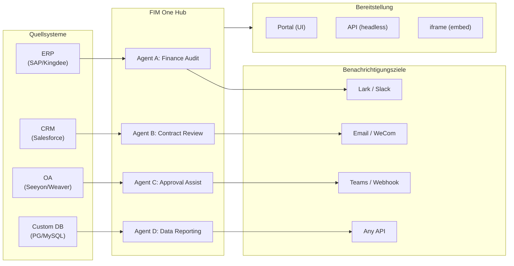

> Ziel: Aufbau eines **KI-gestützten Connector-Hubs** — Standalone (Portal-Assistent), Copilot (in Host-System eingebettet), Hub (zentrale systemübergreifende Orchestrierung).
>
> Prinzipien: **Anbieterunabhängig** (keine Herstellerbindung), **minimale Abstraktion**, **protokollorientiert**, **connector-first** (Integration ist der Kernwert).

## Produktvision

FIM One ist ein **AI-Connector-Hub**, der drei progressive Modi bedient:

```
Standalone   → Dein eigener KI-Assistent (Portal)
Copilot      → KI eingebettet in ein Host-System (iframe / Widget / Embed)
Hub          → Zentrale systemübergreifende Orchestrierung (Portal / API)
```

**Hub-Modus ist der Kernunterscheidungsfaktor.** Unternehmenskunden haben Legacy-Systeme — ERP, CRM, OA, Finanzen, HR — die über KI miteinander kommunizieren müssen:



**GTM-Pfad: Land and Expand**

| Schritt | Modus | Was passiert |
|---------|-------|-------------|
| Land | Copilot | In ein System einbetten, Wert in ihrer UI nachweisen |
| Expand | Copilot → Hub | Auf mehr Systeme ausrollen; Hub aggregiert sie |

## Ausgelieferte Versionen

### v0.1 (2026-02-22) — MVP: ReAct + DAG Planner
- ReActAgent mit Tools (calculator, python_exec, web_search)
- DAG Planner (LLM generiert Abhängigkeitsgraphen)
- Portal UI mit Streaming + KaTeX

### v0.2 (2026-02-24) — Multi-Modell + Speicher
- Wiederholung / Ratenbegrenzung / Nutzungsverfolgung
- Native Funktionsaufrufe (kein reines JSON-Parsing)
- Multi-Modell-Unterstützung (schnelles + Haupt-LLM)
- Speicher: WindowMemory, SummaryMemory
- FastAPI-Backend mit SSE-Streaming

### v0.3 (2026-02-25) — Web Tools + MCP
- Web tools (web_search, web_fetch) via Jina/Tavily/Brave
- File operations tool
- MCP client (standard tool integration)
- Tool auto-discovery + categories
- DAG visualization with click-to-scroll
- Code exec in Docker (`--network=none`)

### v0.4 (2026-02-25) — Multi-Turn + Agenten
- Multi-Turn-Konversationen (DbMemory)
- Tool-Schritt-Faltungs-UI
- HTTP-Anfrage + Shell-Exec-Tools
- Agenten-Management (erstellen, konfigurieren, veröffentlichen)
- JWT-Authentifizierung
- Pro-Agenten-Ausführungsmodus + Temperaturkontrolle

### v0.5 (2026-02-28) — Full RAG + Grounded Gen
- Full RAG pipeline (embedding + vector store + FTS + RRF + reranker)
- Grounded Generation (citations, conflict detection, confidence scores)
- Knowledge base document management (CRUD, search, retry, schema migration)
- ContextGuard + pinned messages (token budget manager)
- DbMemory persistence + LLM Compact
- DAG Re-Planning (up to 3 rounds)

### v0.6 (2026-03-01) — Connector-Plattform
- **Connector CRUD**: erstellen, lesen, aktualisieren, löschen
- **ConnectorToolAdapter**: konvertiert Connector → BaseTool
- **Benutzer-spezifische Anmeldedaten**: AES-GCM-Verschlüsselung
- **Bestätigungsgate**: Genehmigung von Schreibvorgängen
- **Audit-Protokollierung**: alle Tool-Aufrufe werden aufgezeichnet
- **Circuit Breaker**: elegante Verschlechterung bei Ausfällen
- **Utility-Tools**: email_send, json_transform, template_render, text_utils
- **Embedding-Optionen**: Jina, OpenAI, benutzerdefinierte Anbieter

### v0.7 (2026-03-06) — Admin-Plattform + Multi-Mandant
- **Admin-Plattform**: Benutzerverwaltung, Rollenwechsel, Passwort-Zurücksetzen, Konto aktivieren/deaktivieren
- **Nur-auf-Einladung-Registrierung**: drei Modi (offen/Einladung/deaktiviert) + Einladungscode CRUD
- **Speicherverwaltung**: Festplattennutzung pro Benutzer, Löschen, verwaiste Bereinigung
- **Gesprächsmoderation**: Admin-Liste/Löschen aller
- **Erzwungenes Logout pro Benutzer**: alle Token widerrufen
- **API-Gesundheits-Dashboard**: Systemstatistiken, Connector-Metriken
- **Assistent für die erste Einrichtung**: geführte Admin-Kontoerstellung
- **Persönliches Zentrum**: globale Anweisungen pro Benutzer, Spracheinstellung
- **JWT-Authentifizierung**: Token-basierte SSE-Authentifizierung, Gesprächseigentum
- **Globale MCP-Server**: von Admin bereitgestellt, in allen Sitzungen geladen
- **Rückwärtskompatibilität**: registration_enabled → registration_mode automatische Migration

### v0.7.x (2026-03-07 bis 2026-03-12) — Stabilität + Verbesserungen
- Einladungscode-Verwaltung
- Pro-Benutzer-Kontingente (429-Durchsetzung)
- Strukturiertes Audit-Logging
- Filterung sensibler Wörter
- Admin-Anmeldungsverlauf
- Admin-Dateibrowser
- Erweiterte Admin-Ansichten (Felder model_name, tools, kb_ids)
- Docker Compose-Bereitstellung (einzelnes Image, benannte Volumes)
- OAuth-Autoekennung aus window.location
- Unterstützung für erweitertes Denken / Reasoning (`LLM_REASONING_EFFORT`, `LLM_REASONING_BUDGET_TOKENS`) für OpenAI o-Serie, Gemini 2.5+, Claude
- Admin pro Werkzeug aktivieren/deaktivieren (deaktivierte Werkzeuge zur Laufzeit aus Chat ausgeschlossen)
- MCP-Server-Verwaltung auf Connectors-Seite verschoben
- Duale Datenbankunterstützung: SQLite (Null-Konfiguration Standard) + PostgreSQL (Produktion); Docker Compose stellt PostgreSQL automatisch bereit
- Dokumentationsseite zur Modellkonfiguration mit erweitertem Thinking-Setup pro Anbieter
- SSE-Protokoll v2: Echtzeit-Antwort-Streaming mit `delta_reasoning`-, `usage`-Feldern und aufgeteilten `done`-/`suggestions`-/`title`-/`end`-Ereignissen; SQLite-Pool-Größe 5 -> 20
- AI Builder-Erweiterung: 7 neue Builder-Werkzeuge (GetSettings, TestConnection, ImportOpenAPI für Connectors; ListConnectors, AddConnector, RemoveConnector, SetModel für Agenten), `is_builder`-Flag auf Agenten, automatische Builder-Prompt-Aktualisierung, SSRF-Schutz
- SSE v2 Frontend: Streaming-Punkt-Puls-Cursor, DAG-Neuplan-Runden-Snapshots als einklappbare Karten, DAG-Layout entkoppelt von Schrittständen
- Konzeptdokumentationsseite für AI Builder mit Connector- und Agent-Builder-Leitfäden
- Organisationssystem: vollständige CRUD mit rollenbasierter Mitgliedschaft (Besitzer/Admin/Mitglied), Admin-Verwaltungs-UI
- Dreiebenen-Ressourcensichtbarkeit (persönlich/Org/global) für Agenten, Connectors, Wissensdatenbanken, MCP-Server
- Veröffentlichungs-/Unveröffentlichungs-API für alle Ressourcentypen; Besitzerdelegation für veröffentlichte Agenten
- Admin-Set-Visibility-Endpunkt (ersetzt Clone-to-Global); einheitlicher `build_visibility_filter()`-Abfrage-Helfer
- Datenbank-Connectors (Phase 1-3): direkter SQL-Zugriff auf PG/MySQL/Oracle/SQL Server + chinesische Legacy-DBs; Schema-Introspection, KI-Anmerkung, schreibgeschützte Abfrageausführung, verschlüsselte Anmeldedaten, 3 Werkzeuge pro Connector (`list_tables`, `describe_table`, `query`)
- **Evaluation Center**: quantitative Agenten-Qualitätsbenchmarking — Test-Dataset CRUD (Prompt + erwartetes Verhalten + Assertions), Eval-Läufe (parallele Ausführung + LLM-Bewerter + Pro-Fall-Bestanden/Fehlgeschlagen/Latenz/Token-Ergebnisse), Ergebnis-Viewer mit automatischem Polling; Migration `r8t0v2x4z567`
- Drei Modellrollen (General/Fast/Reasoning) mit Pro-Tier-Umgebungskonfigurationsisolation; Fast-Modell erbt nicht mehr die Hauptmodell-Einstellungen
- `StepOutput`-Datenklasse ersetzt einfache String-Schrittergebnisse für strukturierte Daten und Artefakt-Übergabe
- Werkzeug-Cache für DAG-Ausführung — identische Werkzeugaufrufe pro Lauf gecacht mit asynchronem Lock-Stampede-Schutz (`DAG_TOOL_CACHE`)
- Pro-Schritt-LLM-Verifizierung mit 1 Wiederholung bei Fehler (`DAG_STEP_VERIFICATION`)
- Auto-Routing: schnelles LLM klassifiziert Abfragen als ReAct oder DAG; `/api/auto`-Endpunkt; Frontend 3-Wege-Modusumschalter (`AUTO_ROUTING`)
- [x] ~~**Plattform-Organisation + Ressourcen-Abonnements**~~: Integrierte Plattform-Org tritt automatisch allen Benutzern bei; Market-API zum Abonnieren gemeinsamer Ressourcen; Ressourcen-Abonnementtabelle; Org-basierte Ressourcenfreigabe ersetzt globale Sichtbarkeit
- [x] ~~**Agent-Autoekennung und Sub-Agent-Bindung**~~: `discoverable`-Flag auf Agenten; `sub_agent_ids`-Whitelist; CallAgentTool zum Delegieren von Aufgaben an Spezialisten-Agenten
- [x] ~~**MCP-Server-Anmeldedaten + Pro-Benutzer-Überschreibung**~~: `mcp_server_credentials`-Tabelle; `PUT /api/mcp-servers/{id}/my-credentials`-Endpunkt; `allow_fallback`-Flag für Anmeldedaten-Fallback-Verhalten
- [x] ~~**Connector/KB-Umschalter**~~: `POST /api/connectors/{id}/toggle` und `POST /api/knowledge-bases/{id}/toggle` zum Unterbrechen/Fortsetzen von Ressourcen
- [x] ~~**Eigenständige KB-Gespräche**~~: `kb_ids`-Feld auf Gesprächen für direkten KB-Chat ohne Agent-Bindung

## Geplante Versionen

### v0.8 — Deklarative Konnektorkonfiguration + Progressive Offenlegung

**Ziel**: Vereinfachung der Konnektordefinition ohne Python-Code und Optimierung der Exposition von Tools und Anweisungen gegenüber dem LLM.

- [x] ~~**Datenbankverbindungen**: direkter SQL-Zugriff (PostgreSQL, MySQL, Oracle)~~ *(in v0.7.x ausgeliefert — Phase 1-3)*
- [x] ~~**RBAC**: Zugriffskontrolle pro Benutzer/Rolle für Konnektoren~~ *(in v0.7.x ausgeliefert — Org-System + dreistufige Sichtbarkeit)*
- [x] **Konnektorcredential-Verschlüsselung + benutzerspezifische Überschreibung**: `connector_credentials`-Tabelle, Fernet-Verschlüsselung über `CREDENTIAL_ENCRYPTION_KEY`, `allow_fallback`-Flag, `GET/PUT/DELETE /my-credentials`-Endpunkte, benutzerspezifische Credential-Auflösung beim Laden von Chat-Tools
- [x] **Publish-Review-UI**: Org-weites Publish-Review-System — Review-Toggle pro Org, ReviewsSheet mit Genehmigung/Ablehnung-Workflow, Status-Badges auf Ressourcenkarten, Review-Hinweis im Publish-Dialog, Neueinreichung für abgelehnte Ressourcen
- [ ] **Connector Progressive Disclosure (Phase 1-2)**: einzelnes `ConnectorMetaTool` ersetzt Pro-Aktion-Tools; System-Prompt erhält nur leichte **Stubs** (Name + 1-Zeilen-Beschreibung, ~30 Token/Konnektor vs ~250 Token/Aktion); Agent ruft `discover(connector)` auf, um vollständiges Action-Schema bei Bedarf zu laden — Schema wird nur geladen, wenn das Modell einen Konnektor auswählt, wodurch das Prompt-Präfix für Caching stabil bleibt. Spiegelt Clauds Code-internes Muster `defer_loading: true`. `execute`-Unterbefehl; Feature-Flag für Rückwärtskompatibilität.
- [x] ~~**Agent-Skill-System + Kompakte Anweisungen**: On-Demand-Skill-Laden für Agent-Anweisungen — `Skill`-Modell (Name, Inhalt/SOP, optionale Scripts) an Agenten angehängt; im System-Prompt nur nach Name referenziert (~10 Token/Skill); Agent ruft `read_skill(name)` auf, um vollständigen Inhalt bei Bedarf zu laden. Reduziert Pro-Konversations-Anweisungs-Token-Kosten um ~80%, während umfangreichere SOP-Bibliotheken ermöglicht werden. Gegenstück zur Progressive Disclosure von ConnectorMetaTool auf Anweisungsebene. Ermöglicht die Differenzierungsgeschichte "指令 + 工具 + 技能". Fügt auch `compact_instructions`-Feld zum Agent-Modell hinzu — Pro-Agent-Kompressionspriorität-Liste in `ContextGuard` beim Komprimieren eingefügt (z. B. "Bestellnummern und Beträge beibehalten, rohe API-Antworten verwerfen"), ersetzt die aktuelle statische generische Eingabeaufforderung. Inspiriert von Clauds Code Compact Instructions-Muster.~~
- [ ] **YAML/JSON-Konnektorkonfiguration**: Plattform generiert automatisch MCP-Server
- [ ] **Konnektor-Import/Export**: Konnektortemplates teilen
- [ ] **Konnektor-Fork**: Klonen und Anpassen vorhandener Konnektoren
- [ ] **Datenbankverbindungen Phase 4**: Enterprise-Treiber — Oracle (`oracledb`), SQL Server (`aioodbc`), 达梦 DM8 (`aioodbc` + DM ODBC), 南大通用 GBase (`aioodbc` + GBase ODBC)
- [ ] **Message Push**: Lark, WeCom, Slack, Email-Benachrichtigungsaktionen
- [x] **Workflow Phase 2 Nodes**: Iterator, Loop, VariableAggregator, ParameterExtractor, ListOperation, Transform, DocumentExtractor, QuestionUnderstanding, HumanIntervention — 9 erweiterte Node-Typen mit vollständigem Frontend + Backend + 150 neue Tests (275 gesamt). Node-Wiederholung mit exponentiellem Backoff, sichere Expression-Evaluierung. Stats-Panel mit Success-Rate-Balken. 12 integrierte Templates. Pane-Kontextmenü (Einfügen, Alles auswählen, Ansicht anpassen, Auto-Layout).
- [x] **Workflow Phase 3 Nodes: SubWorkflow + ENV** — 2 neue Node-Typen (25 Nodes gesamt), 14 neue Tests (306 gesamt), 14 integrierte Templates. SubWorkflow: vollständiger DB-gestützter verschachtelter Workflow-Executor mit Ziel-Workflow-Auswahl, Variablenmapping und konfigurierbarem Tiefenlimit zur Verhinderung unendlicher Rekursion. ENV: liest verschlüsselte Umgebungsvariablen mit Key-Picker und Fallback-Defaults. Vollständiges Frontend (Node-Komponenten, Config-Panels, Palette-Einträge, Minimap-Farben). Pro-Node-Ausführungsstatistik-Panel (Success-Raten, Dauern, Fehleranzahl sortiert nach Worst-First). `getNodeStats` API-Client + `NodeStatEntry`-Typ. Tastaturkürzel-Dialog (`?`-Taste).
- [x] **Workflow Scheduled Triggers**: Pro-Workflow-Cron-Konfiguration mit Zeitzone, Standard-Eingaben und Next-Run-At-Berechnung. Voreingestellte Cron-Buttons, 30 Trigger-Tests.
- [x] **Workflow API Triggers**: Öffentliche Pro-Workflow-API-Schlüssel (`wf_`-Präfix) für externe Ausführung ohne Benutzer-Auth, mit Rate Limiting. API-Schlüssel-Management-Dialog mit Generieren/Regenerieren/Widerrufen, Trigger-URL und cURL/JS-Beispiele.
- [x] **Workflow Batch Execution**: `POST /batch-run` mit bis zu 100 Input-Sets, konfigurierbare Parallelität (1-10), einklappbare Pro-Item-Ergebnisse, JSON-Export. 14 Batch-Ausführungs-Tests.
- [x] **Workflow Execution Log Viewer**: Echtzeit-chronologischer SSE-Event-Stream im Run-Panel mit Zeitstempeln, farbcodierten Badges und Event-Typ-Filter-Toggles.
- [x] **Workflow Run Stats**: Backend batch-fetcht Run-Anzahl und Success-Raten über GROUP BY-Subquery; Frontend zeigt Stats auf Workflow-Karten mit farbcodierten Success-Rate-Indikatoren.
- [x] **Workflow Scheduler Daemon**: Background-Async-Service, der alle 60 Sekunden nach fälligen Cron-basierten Workflows abfragt. Croniter-Zeitzone-Unterstützung, Semaphore-Concurrency, `last_scheduled_at`-Tracking, Webhook-Zustellung. 14 Tests.
- [x] **Workflow Import Conflict Resolver**: Erkennt ungelöste Agent/Konnektor/KB/MCP-Referenzen während des Imports. Batch-DB-Abfragen mit Sichtbarkeitsfilterung, Frontend-Toast-Warnungen. 17 Tests.
- [x] **Workflow Test-Node Execution**: Isolierte Single-Node-Tests mit Mock-Variablen, in Editor integriert (Config-Panel Test-Button + Kontextmenü). 23 Tests.
- [x] **Workflow Version Diff**: Nebeneinander-Blueprint-Vergleich mit Node/Edge-Änderungserkennung, farbcodierte Indikatoren (hinzugefügt/entfernt/geändert).
- [x] **Workflow Run Management**: Löschen einzelner Runs (`DELETE /runs/{run_id}`) und Löschen aller abgeschlossenen Runs (`DELETE /runs`), mit Frontend-Bestätigungsdialogen.
- [x] **Workflow Run Replay Overlay**: "View on Canvas"-Button in Run-Verlauf zum Überlagern vergangener Ausführungsergebnisse auf der Canvas, zeigt Pro-Node-Status und Ausgabe ohne Neuausführung.
- [x] **Workflow Favorites/Pinning**: Star/Pin-Workflows an die Spitze der Liste mit localStorage-Persistierung.
- [x] **Workflow Run History Export**: Exportieren Sie Run-Verlauf als JSON-Datei-Download mit vollständigen Run-Metadaten und Pro-Node-Ergebnissen.
- [x] **Admin Workflows Management**: Admin-Panel-Tab zum Verwalten aller Workflows über Benutzer — Liste, Toggle aktiv/inaktiv, Löschen mit Bestätigung.
- [x] **Workflow Blueprint System**: Visueller Workflow-Editor zum Entwerfen und Ausführen mehrstufiger Automatisierungs-Blueprints — `Workflow` / `WorkflowRun` ORM-Modelle, vollständige CRUD + SSE-Ausführungs-API, Import/Export, Duplizieren, Blueprint-Validierungs-Endpunkt, `WorkflowEngine` mit topologischer Sortierung + Semaphore-basierter Concurrency + Bedingungsverzweigung und 12 Node-Typen (Start, End, LLM, ConditionBranch, QuestionClassifier, Agent, KnowledgeRetrieval, Connector, HTTPRequest, VariableAssign, TemplateTransform, CodeExecution), `VariableStore` mit `{{node_id.output}}`-Interpolation und `env.*`-Namespace, Error-Strategien pro Node (STOP_WORKFLOW / CONTINUE / FAIL_BRANCH) mit Pro-Node-Timeout und erweiterter Config-UI, React Flow v12 visueller Editor mit Drag-and-Drop-Palette + Node-Config-Panel + Variable-Picker-Combobox + Add-Node-on-Edge + Auto-Layout (ELK.js) + Run-History-Sheet, Dify-ähnliches kompaktes Node-Design mit Ring-basiertem Run-Status-Styling und animierten Edge-Übergängen, 4 integrierte Starter-Templates (Simple LLM Chain, Conditional Router, Knowledge-Augmented QA, HTTP API Pipeline) mit Template-Picker-Dialog und `GET /templates` + `POST /from-template` API, Stats-Endpunkt, `?run=true` URL-Parameter Auto-Open, Subprocess-basierte Code-Ausführungs-Sicherheit, 105-Test-Suite (Templates, Eval-Namespace-Flattening, Blueprint-Validierungs-Warnungen, Node/Edge-Löschung, Import/Export/Duplizieren, Deadlock-Erkennung, Multi-Condition-Verzweigung)
- [x] **Operation audit**: detaillierte Protokollierung wer was tat — Admin-Review-Log-Audit-Tab hinzugefügt (Publish-Review-Trail pro Org/Ressource)
- [ ] **Semantic Schema Annotations**: Erweitern Sie Konnektor-Schema-Felder mit `semantic_tag`, `description` und `pii`-Flags; Annotationen in LLM-Tool-Beschreibungen angezeigt, damit der Agent die Feldabsicht versteht, ohne von Spaltennamen zu raten

**Auswirkung**: Implementierungsingenieure (kein Python erforderlich) können Konnektoren in 1-2 Stunden hinzufügen. Token-Kosten für Tool-Definitionen und Agent-Anweisungen sinken um ~80–93% im großen Maßstab.

### v0.9 — Observability + Production Hardening

**Ziel**: Produktionsreife Operationen, Debugging und Monitoring. Führt das **Hook-System** ein — eine deterministische Durchsetzungsebene, die unterhalb von Agent-Anweisungen liegt und vom LLM nicht überschrieben werden kann.

- [ ] **Connector Progressive Disclosure (Phase 3-4)**: einheitliche `ConnectorExecutor`-Schnittstelle (API/DB/MCP hinter einer Abstraktion); Validierung von Aktionsparametern mit `jsonschema`; protokollagnostisches Discover/Execute
- [ ] **Agent Trace Layer (Observability++)**: Anwendungsebenen-Run/Trace/Thread-Hierarchie für Agent-Debugging — jede Konversation → `Trace`, jeder LLM-Aufruf / Tool-Aufruf / DAG-Schritt → `Span` mit Input/Output/Tokens/Timing. Frontend-Trace-Viewer mit Timeline und erweiterbaren LLM-Call-Payloads. Dies geht über OTel (Infrastrukturebene) hinaus, um umsetzbares Agent-Loop-Debugging für Entwickler und Enterprise-Kunden bereitzustellen. OpenTelemetry-Export als optionale Datensenke. Modelliert nach LangSmiths Run/Trace/Thread-Konzepten — das branchenbewährte Muster für Agent-Observability.
- [ ] **Metrics-Dashboard**: Latenz, Erfolgsquote, Token-Nutzung, Connector-Call-Analytik — pro Agent, pro Benutzer, pro Organisation
- [ ] **Circuit Breaker**: exponentielles Backoff, Fehlererkennung
- [ ] **Agent Hook System**: Eine deterministische Durchsetzungsebene, die **außerhalb der LLM-Schleife** läuft — Hooks werden automatisch bei Tool-Events ausgeführt und können durch Agent-Anweisungen nicht umgangen werden. Drei Hook-Punkte: `PreToolUse` (validieren / blockieren vor Ausführung), `PostToolUse` (Nebenwirkungen nach Ausführung), `SessionStart` (dynamischen Kontext injizieren). Integrierte Hooks: automatisches Schreiben von `ConnectorCallLog` bei jedem Connector-Aufruf (derzeit manuell); Blockieren von Schreiboperationen, wenn die Organisation im Read-Only-Modus ist; automatisches Kürzen übergroßer DB-Abfrageergebnisse, bevor sie den Agent erreichen; Rate-Limiting pro Connector-Call-Häufigkeit. Benutzerdefinierte Hooks: pro-Agent YAML-Konfiguration (`hooks:`-Feld) mit Shell-Befehlen oder Python-Callables, die bei übereinstimmenden Tool-Events ausgelöst werden — gleiches Muster wie Claudes Code-Hooks. Wichtiges Designprinzip: **Hooks sind für „muss immer passieren"-Logik, die niemals davon abhängen sollte, dass das LLM sich daran erinnert**. Anweisungen sagen „alle Aufrufe aufzeichnen"; Hooks zeichnen sie tatsächlich auf. Anweisungen sagen „nicht im Read-Only-Modus schreiben"; Hooks blockieren es tatsächlich.
- [ ] **Agent Workspace (Tool Output Offloading + Handoff)**: Wenn MCP / Connector / DB Tool-Antworten einen Schwellenwert überschreiten (Standard: 8K Zeichen), speichern Sie die vollständige Ausgabe automatisch in einer pro-Konversations-Workspace-Datei (`workspace://tool_result_xxx.txt`) und geben Sie eine gekürzte Vorschau + Datei-URI an den Agent zurück. Drei neue integrierte Tools: `read_workspace_file(path, start_line, end_line)` für selektiven Zugriff, `list_workspace_files()` für Entdeckung und `write_handoff(summary)` für Kontextwechsel — Agent schreibt eine strukturierte HANDOFF-Notiz (Fortschritt, was funktioniert hat, was fehlgeschlagen ist, nächster Schritt), bevor Kontextkompression oder Sitzungswechsel stattfindet; die nächste Agent-Instanz liest sie, anstatt sich auf die Zusammenfassungsqualität des Kompressionsalgorithmus zu verlassen. Spiegelt Claudes Code-Workspace- und Handoff-Muster. Verhindert Aufmerksamkeitsverlust bei großen Ergebnismengen und eliminiert stille Datenverluste durch Kürzung. Minimale Änderung: `truncate_tool_output()` in `MCPToolAdapter` und `ConnectorToolAdapter` erweitern, um in Workspace-Speicher zu schreiben.
- [ ] **Sandbox Hardening**: v2-Verbesserungen der Code-Ausführungsisolation
- [ ] **Performance Testing**: Concurrent-Load-Benchmarks
- [ ] **MCP Connection Pooling**: Pro-Request STDIO-Subprocess-Spawning skaliert nicht — 100 gleichzeitige Benutzer = 100 Subprozesse pro MCP-Server. Pool STDIO-Verbindungen mit pro-Benutzer-Env-Isolation (gekennzeichnet durch `(server_id, env_hash)`); SSE/HTTP-Transporte teilen `httpx.AsyncClient`-Sitzungen. Ziel: Sub-100ms Warm-Start für gepoolte STDIO, O(1) HTTP-Verbindungen pro MCP-Server unabhängig von der Benutzeranzahl
- [ ] **Geplante Jobs + Event-getriggerte Agenten (Loop)**: Cron-ähnliche Background-Task-Trigger; `scheduled_jobs` + `job_runs` DB-Tabellen; APScheduler-Integration; Job CRUD API + Job-Verlauf UI; Ergebnisbenachrichtigung über Message-Push-Connectoren. Der Umfang umfasst sowohl zeitgesteuerte (Cron) als auch ereignisgesteuerte (Webhook-Eingang) Muster — ein Agent, der asynchron im Hintergrund läuft, IST der Async-Sub-Agent-Anwendungsfall für Hub-Modus.
- [ ] **DB Schema Advanced Builder**: KI-gesteuerte Schema-Management-Agent für großskalige Datenbanken — strategische Tabellenannotation (musterbasiert, SQL-Ausführungs-informiert), Bulk-Sichtbarkeitsverwaltung nach Domain-Präfix, iterative Multi-Round-Annotation für 1K–7K+ Tabellenbereitstellungen; ergänzt bestehenden Batch-Annotation-Job mit Selektivität und Business-Context-Reasoning

**Auswirkung**: Führen Sie FIM One im großen Maßstab mit Zuversicht aus. Drei Architekturschichten sind nun vollständig: **Trace Layer** (sehen Sie, was passiert ist), **Hook System** (erzwingen Sie, was passieren muss), **Agent Workspace** (Agent verwaltet seinen eigenen Datenzugriff). Zusammen schließen sie die Lücke zwischen „Anweisungen, denen der Agent möglicherweise folgt" und „Garantien, die das System erzwingt" — der Unterschied zwischen einer Demo und einem produktiven Enterprise-Tool.

### v1.0 — Hot-Plug + Embeddable

**Ziel**: Connector-Addition ohne Neustart und eingebettete Bereitstellung.

- [ ] **Connector Progressive Disclosure (Phase 5)**: **Semantic-Guided Tool Selection** (Entity-Extraktion aus Abfrage → Ontology Registry-Lookup → Connector-Set-Reduktion; 90%+ Token-Reduktion für 50+ Connector-Bereitstellungen); Scale-Modus für Batch-/ETL-Connectoren; CLI-ähnliche universelle `connector <name> <action> <params>` Schnittstelle
- [ ] **Cross-Connector Entity Alignment (Ontology Registry)**: Definieren Sie gemeinsame Entity-Typen (Customer, Order, Asset) mit Feld-Mappings über Connectoren hinweg; DAGPlanner löst Cross-System JOIN-Schlüssel automatisch auf; ermöglicht Cross-Connector-Abfragen (z. B. „Kunden in Salesforce, die in Shopify bestellt haben") ohne hartcodierte Feldnamen
- [ ] **Hot-plug Connectoren**: OpenAPI-Spec hochladen, KI generiert Konfiguration, live in 5 Minuten (kein Neustart)
- [ ] **Connector-Marketplace**: Von der Community geteilte Vorlagen
- [ ] **Eingebettetes Widget**: `<script src="fim-one.js">` in Host-Seite injiziert
- [ ] **Page Context Injection**: Widget liest Host-Seiten-Kontext (aktuelle ID, URL, DOM-Selektoren)
- [ ] **Erweiterte Trigger**: Webhook-Inbound-Events; Verbesserungen bei geplanten Jobs (Multi-Timezone, Kalender-bewusst)
- [ ] **Batch-Ausführung**: Verarbeitung von 1000+ Elementen über DAG
- [ ] **Enterprise-Sicherheit**: IP-Whitelisting, Verschlüsselung im Ruhezustand, SSO
- [ ] **KB Advanced Editor**: Builder-Mode-Agent für Power-User, die große Knowledge Bases verwalten — Massen-URL-Aufnahme, Duplikat-Erkennung, Gap-Analyse, Document-Lifecycle-Management; erweitert vorhandenen KB-KI-Chat mit ReAct-Tool-Loop

**Auswirkung**: Unternehmen stellen FIM One von Null bis Multi-System-Orchestrierung in Tagen bereit.

## Gefrorene Funktionen (Ausgeliefert, nur Wartung)

Gemäß der [Orthogonalitätsstrategie](/strategy/orthogonality-strategy) sind diese Funktionen ausgeliefert und funktionsfähig, erhalten aber keine neuen Funktionen (nur Fehlerbehebungen):

| Funktion | Version | Grund für Einfrieren |
|---------|---------|-----------|
| ReAct-Agent | v0.1 | Modelle haben jetzt natives Tool-Calling |
| DAG-Planung / Neuplanung | v0.1, v0.5, v0.7.5 | Modell-Reasoning-Fähigkeiten verbessern sich; Zerlegung wird Single-Shot. Schritt-für-Schritt-Verifizierung in v0.7.5 ausgeliefert (`DAG_STEP_VERIFICATION`) — keine weiteren Planungs-Primitive geplant |
| Speicher (Fenster, Zusammenfassung, Kompakt) | v0.2, v0.5 | Kontextfenster wachsen (200K+); weniger Bedarf für externe Speicherverwaltung |
| RAG-Pipeline | v0.5 | Anbieter bauen Retrieval nativ ein (OpenAI file_search, Gemini Search Grounding) |
| Grounded Generation | v0.5 | Modelle verbessern sich bei Zitaten; 5-stufige Pipeline hat abnehmenden Nutzen |
| ContextGuard / Angeheftete Nachrichten | v0.5 | Wird wie vorhanden ausgeliefert; keine neuen Funktionen |

## Überlegungen (Auf unbestimmte Zeit verschoben)

Gemäß der Orthogonalitätsstrategie würden diese einen hohen Aufwand erfordern und Absorptionsrisiken bergen:

| Feature | Grund für Verschiebung |
|---------|------------|
| Multi-Agent-Orchestrierung (tiefe Hierarchien) | Anbieter bauen nativ (OpenAI Swarm, Claude Code Teams, Google A2A). FIM One's CallAgentTool deckt den Fall der einstufigen Delegation ab; ereignisgesteuerte Hintergrund-Agenten werden durch Scheduled Jobs in v0.9 abgedeckt |
| Agent-Selbstmodifizierende Skills (Procedural Memory) | Agenten aktualisieren ihre eigene `skill.md` während der Ausführung — hohe Komplexität, Sicherheits-/Audit-Oberfläche. Abhängig davon, dass das Agent Skill System (v0.8) zuerst ausgeliefert wird. Neu bewerten, wenn Unternehmenskunden selbstverbessernde Agenten explizit anfordern |
| ~~Agent Workspace (Tool Output File Offloading)~~ | Befördert zu v0.9. Der Wert liegt beim **selektiven Lesen**, nicht bei der Kontextkapazität — Claude Code-Validierung bestätigt. Ursprüngliche Verschiebungsbegründung („200K+ Fenster reduzieren Dringlichkeit") war falsch. |
| Sitzungsübergreifendes Langzeitgedächtnis | Kontextfenster wachsen schnell (200K–2M); Anbieter fügen integriertes Gedächtnis hinzu (OpenAI memory, Gemini context caching); hohe Implementierungskosten vs. sinkender Differenzierungswert. Neu bewerten, wenn Unternehmenskunden es explizit anfordern |
| Memory Lifecycle (TTL, Kontingente) | Abhängig von sitzungsübergreifendem Gedächtnis; zusammen verschoben |
| Active Context Compression Tool (agent-ausgelöst) | Explizit eingefroren mit ContextGuard (v0.5). Kontextfenster bei 200K+ reduzieren den Wert. Wird nicht erneut überprüft, es sei denn, Kontextkosten werden zu einer großen Unternehmensbeschwerde |

## Wie Versionen mit Modi übereinstimmen

| Version | Standalone | Copilot | Hub | Notizen |
|---------|-----------|---------|-----|-------|
| **v0.1–v0.3** | Funktioniert | Noch nicht | Noch nicht | Nur Portal, einzelner Benutzer |
| **v0.4** | Funktioniert | Noch nicht | Noch nicht | Multi-Konversation, Agent-Verwaltung |
| **v0.5** | Funktioniert | Noch nicht | Noch nicht | Wissensdatenbank + RAG |
| **v0.6** | Funktioniert | Möglich | Möglich | Konnektoren verfügbar; Copilot/Hub möglich mit manueller Verdrahtung |
| **v0.7** | Funktioniert | Bereit | Bereit | Admin-Plattform; Multi-Tenant-Authentifizierung; produktionsreif |
| **v0.8** | Funktioniert | Bereit | Optimiert | RBAC + Audit-Log pro System; einfacheres Onboarding |
| **v0.9** | Funktioniert | Bereit | Produktion | Observability, Performance, Härtung |
| **v1.0** | Funktioniert | Optimiert | Enterprise | Hot-Plug, Marketplace, geplante Jobs, Webhooks, Batch |

## Ressourcenallokation (v0.8–v1.0)

Die Orthogonalitätsstrategie bestimmt, wohin die Anstrengungen fließen:

| Kategorie | Allokation | Versionen | Grund |
|----------|-----------|----------|-----|
| **Connector-Plattform** (v0.6+) | 50% | Laufend | Kernunterscheidungsmerkmal; kein Absorptionsrisiko |
| **Enterprise-Funktionen** (RBAC, Audit, Sicherheit, Observability) | 30% | v0.8–v1.0 | Langweilig, aber dauerhaft; Produktionsanforderung. Agent Trace Layer ist kommerzieller Anker |
| **Agent-Intelligenz** (Skill-System, geplante Agenten) | 15% | v0.8–v0.9 | 指令+工具+技能 Differenzierungsgeschichte; niedriges Absorptionsrisiko — Frameworks validieren Muster, aber Enterprise-SOPs sind kundenspezifisch |
| **v0.1–v0.5 Wartung** | 5% | Laufend | Nur Fehlerbehebungen; keine neuen Funktionen |

## Metrik-gesteuerte Meilensteine

Der Erfolg wird gemessen durch:

| Metrik | v0.7 Ziel | v0.8 Ziel | v1.0 Ziel |
|--------|------------|------------|------------|
| Bereitgestellte Konnektoren | 5 | 20+ | 100+ |
| Enterprise-Kunden | 1–2 | 5–10 | 20+ |
| Durchschnittliche Konnektor-Einrichtungszeit | 2 Wochen | 2 Tage | 5 Minuten (Hot-Plug) |
| Token-Effizienz (DAG vs ReAct-only) | 30% Reduktion | 40% Reduktion | 50% Reduktion |
| Uptime SLA | 99,5% | 99,9% | 99,95% |
| Support-Ticket-Themen | Integration, Einrichtung | Benutzerdefinierte Konnektor-Logik | Hot-Plug, Skalierung |

## Offene Fragen / TBD

- **Marketplace-Moderation**: Wie können Community-Konnektoren validiert werden? (v1.0)
- **Token-Ökonomie**: Wie können Multi-User-, Multi-Agent-Szenarien bepreist werden? (v1.0)
- **Telemetrie-Opt-out**: Wie können Datenschutzpräferenzen berücksichtigt werden? (v0.8)
- **Konnektor-Versionierung**: Wie können Breaking Changes in Konnektor-APIs verwaltet werden? (v0.8)
- **Rate Limiting**: Pro Konnektor, pro Benutzer oder global? (v0.8)

