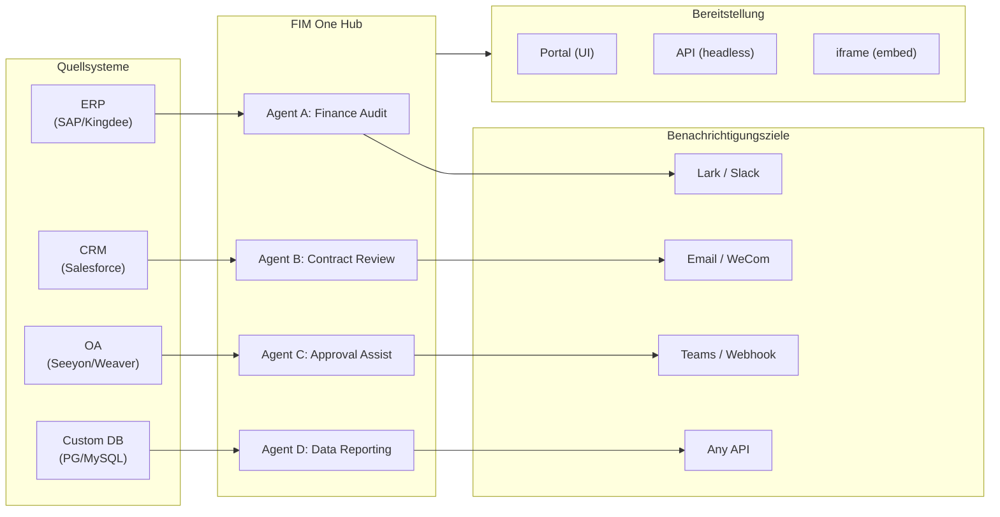

> Goal: Build an **AI-powered Connector Hub** — Standalone (portal assistant), Copilot (embedded in host system), Hub (central cross-system orchestration).
>
> Principles: **Provider-agnostic** (no vendor lock-in), **minimal-abstraction**, **protocol-first**, **connector-first** (integration is the core value).

## Produktvision

FIM One ist ein **AI-Connector-Hub**, der drei progressive Modi bedient:

```
Standalone   → Dein eigener KI-Assistent (Portal)
Copilot      → KI eingebettet in ein Host-System (iframe / Widget / Embed)
Hub          → Zentrale systemübergreifende Orchestrierung (Portal / API)
```

**Hub-Modus ist der Kernunterscheidungsfaktor.** Unternehmenskunden haben Legacy-Systeme — ERP, CRM, OA, Finanzen, HR — die über KI miteinander kommunizieren müssen:



**GTM-Pfad: Land and Expand**

| Schritt | Modus | Was passiert |
|---------|-------|-------------|
| Land | Copilot | In ein System einbetten, Wert in ihrer UI nachweisen |
| Expand | Copilot → Hub | Auf mehr Systeme ausrollen; Hub aggregiert sie |

## Ausgelieferte Versionen

### v0.1 (2026-02-22) — MVP: ReAct + DAG Planner
- ReActAgent mit Tools (calculator, python_exec, web_search)
- DAG Planner (LLM generiert Abhängigkeitsgraphen)
- Portal UI mit Streaming + KaTeX

### v0.2 (2026-02-24) — Multi-Modell + Speicher
- Wiederholung / Ratenbegrenzung / Nutzungsverfolgung
- Native Funktionsaufrufe (kein reines JSON-Parsing)
- Multi-Modell-Unterstützung (schnelles + Haupt-LLM)
- Speicher: WindowMemory, SummaryMemory
- FastAPI-Backend mit SSE-Streaming

### v0.3 (2026-02-25) — Web Tools + MCP
- Web tools (web_search, web_fetch) via Jina/Tavily/Brave
- File operations tool
- MCP client (standard tool integration)
- Tool auto-discovery + categories
- DAG visualization with click-to-scroll
- Code exec in Docker (`--network=none`)

### v0.4 (2026-02-25) — Multi-Turn + Agenten
- Multi-Turn-Konversationen (DbMemory)
- Tool-Schritt-Faltungs-UI
- HTTP-Anfrage + Shell-Exec-Tools
- Agenten-Management (erstellen, konfigurieren, veröffentlichen)
- JWT-Authentifizierung
- Pro-Agenten-Ausführungsmodus + Temperaturkontrolle

### v0.5 (2026-02-28) — Full RAG + Grounded Gen
- Vollständige RAG-Pipeline (Embedding + Vektorspeicher + FTS + RRF + Reranker)
- Grounded Generation (Zitationen, Konfidenzwerte)
- Wissensdatenbank-Dokumentverwaltung (CRUD, Suche, Wiederholung, Schema-Migration)
- ContextGuard + angeheftete Nachrichten (Token-Budget-Manager)
- DbMemory-Persistenz + LLM Compact
- DAG-Neuplanung (bis zu 3 Runden)

### v0.6 (2026-03-01) — Connector-Plattform
- **Connector CRUD**: erstellen, lesen, aktualisieren, löschen
- **ConnectorToolAdapter**: konvertiert Connector → BaseTool
- **Benutzer-spezifische Anmeldedaten**: AES-GCM-Verschlüsselung
- **Bestätigungsgate**: Genehmigung von Schreibvorgängen
- **Audit-Protokollierung**: alle Tool-Aufrufe werden aufgezeichnet
- **Circuit Breaker**: elegante Verschlechterung bei Ausfällen
- **Utility-Tools**: email_send, json_transform, template_render, text_utils
- **Embedding-Optionen**: Jina, OpenAI, benutzerdefinierte Anbieter

### v0.7 (2026-03-06) — Admin-Plattform + Multi-Mandant
- **Admin-Plattform**: Benutzerverwaltung, Rollenwechsel, Passwort-Zurücksetzen, Konto aktivieren/deaktivieren
- **Nur-auf-Einladung-Registrierung**: drei Modi (offen/Einladung/deaktiviert) + Einladungscode CRUD
- **Speicherverwaltung**: Festplattennutzung pro Benutzer, Löschen, verwaiste Bereinigung
- **Gesprächsmoderation**: Admin-Liste/Löschen aller
- **Erzwungenes Logout pro Benutzer**: alle Token widerrufen
- **API-Gesundheits-Dashboard**: Systemstatistiken, Connector-Metriken
- **Assistent für die erste Einrichtung**: geführte Admin-Kontoerstellung
- **Persönliches Zentrum**: globale Anweisungen pro Benutzer, Spracheinstellung
- **JWT-Authentifizierung**: Token-basierte SSE-Authentifizierung, Gesprächseigentum
- **Globale MCP-Server**: von Admin bereitgestellt, in allen Sitzungen geladen
- **Rückwärtskompatibilität**: registration_enabled → registration_mode automatische Migration

### v0.7.x (2026-03-07 bis 2026-03-12) — Stabilität + Verbesserungen
- Einladungscode-Verwaltung
- Benutzer-spezifische Kontingente (429-Durchsetzung)
- Strukturiertes Audit-Logging
- Filterung sensibler Wörter
- Admin-Anmeldungsverlauf
- Admin-Dateibrowser
- Erweiterte Admin-Ansichten (Felder model_name, tools, kb_ids)
- Docker Compose-Bereitstellung (einzelnes Image, benannte Volumes)
- OAuth-Automatische Erkennung von window.location
- Erweitertes Denken / Reasoning-Unterstützung (`LLM_REASONING_EFFORT`, `LLM_REASONING_BUDGET_TOKENS`) für OpenAI o-Serie, Gemini 2.5+, Claude
- Admin pro-Tool Aktivieren/Deaktivieren (deaktivierte Tools werden zur Laufzeit aus dem Chat ausgeschlossen)
- MCP-Server-Verwaltung auf die Seite „Konnektoren" verschoben
- Duale Datenbankunterstützung: SQLite (Null-Konfiguration Standard) + PostgreSQL (Produktion); Docker Compose stellt PostgreSQL automatisch bereit
- Dokumentationsseite zur Modellkonfiguration mit Extended-Thinking-Setup pro Anbieter
- SSE Protocol v2: Echtzeit-Antwort-Streaming mit `delta_reasoning`, `usage`-Feldern und geteilten `done`/`suggestions`/`title`/`end`-Events; SQLite-Pool-Größe 5 -> 20
- AI Builder-Erweiterung: 7 neue Builder-Tools (GetSettings, TestConnection, ImportOpenAPI für Konnektoren; ListConnectors, AddConnector, RemoveConnector, SetModel für Agenten), `is_builder`-Flag auf Agenten, automatische Builder-Prompt-Aktualisierung, SSRF-Schutz
- SSE v2 Frontend: Streaming-Punkt-Puls-Cursor, DAG-Neuplan-Runden-Snapshots als einklappbare Karten, DAG-Layout entkoppelt von Schrittzuständen
- Konzeptdokumentationsseite für AI Builder mit Konnektoren- und Agenten-Builder-Leitfäden
- Organisationssystem: vollständige CRUD-Operationen mit rollenbasierter Mitgliedschaft (Eigentümer/Admin/Mitglied), Admin-Verwaltungs-UI
- Dreiebenen-Ressourcensichtbarkeit (persönlich/Org/global) für Agenten, Konnektoren, Wissensdatenbanken, MCP-Server
- Veröffentlichungs-/Unveröffentlichungs-API für alle Ressourcentypen; Eigentümerdelegation für veröffentlichte Agenten
- Admin-Set-Visibility-Endpoint (ersetzt Clone-to-Global); einheitlicher `build_visibility_filter()`-Abfrage-Helper
- Datenbank-Konnektoren (Phase 1-3): direkter SQL-Zugriff auf PG/MySQL/Oracle/SQL Server + chinesische Legacy-DBs; Schema-Introspection, KI-Annotation, schreibgeschützte Abfrageausführung, verschlüsselte Anmeldedaten, 3 Tools pro Konnektor (`list_tables`, `describe_table`, `query`)
- **Evaluierungszentrum**: quantitatives Benchmarking der Agentenqualität — Test-Dataset CRUD (Prompt + erwartetes Verhalten + Assertions), Eval-Läufe (parallele Ausführung + LLM-Bewerter + Pro-Fall Pass/Fail/Latenz/Token-Ergebnisse), Ergebnis-Viewer mit automatischem Polling; Migration `r8t0v2x4z567`
- Drei Modellrollen (Allgemein/Schnell/Reasoning) mit isolierter Umgebungskonfiguration pro Tier; Schnellmodell erbt keine Hauptmodell-Einstellungen mehr
- `StepOutput`-Dataclass ersetzt einfache String-Schrittergebnisse für strukturierte Daten und Artefakt-Übergabe
- Tool-Cache für DAG-Ausführung — identische Tool-Aufrufe pro Lauf gecacht mit asynchronem Lock-Stampede-Schutz (`DAG_TOOL_CACHE`)
- Pro-Schritt-LLM-Verifizierung mit 1 Wiederholung bei Fehler (`DAG_STEP_VERIFICATION`)
- Auto-Routing: schnelles LLM klassifiziert Abfragen als ReAct oder DAG; `/api/auto`-Endpoint; Frontend 3-Wege-Modusumschalter (`AUTO_ROUTING`)
- [x] ~~**Shadow Market Organization + Resource Subscriptions**~~: Integrierte Market-Org (Shadow, kein automatischer Beitritt) ersetzt Platform-Org; Ressourcen werden durch Marketplace-Browsing entdeckt und explizit abonniert (Pull-Modell); Market-API zum Abonnieren gemeinsamer Ressourcen; Veröffentlichung auf Market erfordert immer Überprüfung; Ressourcen-Abonnements-Tabelle; Org-basierte Ressourcenfreigabe ersetzt globale Sichtbarkeit
- [x] ~~**Agent Auto-discovery and Sub-agent Binding**~~: `discoverable`-Flag auf Agenten; `sub_agent_ids`-Whitelist; CallAgentTool zum Delegieren von Aufgaben an spezialisierte Agenten
- [x] ~~**MCP Server Credentials + Per-User Override**~~: `mcp_server_credentials`-Tabelle; `PUT /api/mcp-servers/{id}/my-credentials`-Endpoint; `allow_fallback`-Flag für Fallback-Verhalten bei Anmeldedaten
- [x] ~~**Connector/KB Toggle**~~: `POST /api/connectors/{id}/toggle` und `POST /api/knowledge-bases/{id}/toggle` zum Aussetzen/Fortsetzen von Ressourcen
- [x] ~~**Standalone KB Conversations**~~: `kb_ids`-Feld auf Konversationen für direkten KB-Chat ohne Agent-Bindung

### v0.8 (2026-03-20) — Connector Deklarative Konfiguration + Progressive Offenlegung
- [x] **Datenbank-Konnektoren**: direkter SQL-Zugriff (PostgreSQL, MySQL, Oracle) *(in v0.7.x ausgeliefert — Phase 1-3)*
- [x] **RBAC**: Konnektor-Zugriffskontrolle pro Benutzer/Rolle *(in v0.7.x ausgeliefert — Org-System + dreistufige Sichtbarkeit)*
- [x] **Konnektor-Anmeldedaten-Verschlüsselung + Benutzer-Override**: `connector_credentials`-Tabelle, Fernet-Verschlüsselung über `CREDENTIAL_ENCRYPTION_KEY`, `allow_fallback`-Flag, `GET/PUT/DELETE /my-credentials`-Endpunkte, Auflösung von Benutzer-Anmeldedaten beim Laden von Chat-Tools
- [x] **Veröffentlichungs-Review-UI**: Org-übergreifendes Veröffentlichungs-Review-System — Review-Toggle pro Org, ReviewsSheet mit Genehmigung/Ablehnung-Workflow, Status-Badges auf Ressourcen-Karten, Review-Hinweis im Veröffentlichungs-Dialog, erneute Einreichung für abgelehnte Ressourcen
- [x] **Konnektor Progressive Offenlegung (Phase 1-2)**: einzelnes `ConnectorMetaTool` ersetzt Pro-Action-Tools; System-Prompt erhält nur leichte **Stubs** (Name + 1-Zeilen-Beschreibung, ~30 Token/Konnektor vs ~250 Token/Action); Agent ruft `discover(connector)` auf, um vollständiges Action-Schema bei Bedarf zu laden — Schema wird nur geladen, wenn das Modell einen Konnektor auswählt, wodurch das Prompt-Präfix für Caching stabil bleibt. Folgt dem verzögerten Tool-Loading-Muster, das in modernen Agent-Frameworks üblich ist. `execute`-Unterbefehl; Feature-Flag für Rückwärtskompatibilität.
- [x] **Agent-Skill-System + Kompakte Anweisungen**: On-Demand-Skill-Loading für Agent-Anweisungen — `Skill`-Modell (Name, Inhalt/SOP, optionale Skripte) an Agenten angehängt; im System-Prompt nur nach Name referenziert (~10 Token/Skill); Agent ruft `read_skill(name)` auf, um vollständigen Inhalt bei Bedarf zu laden. Reduziert Pro-Konversations-Anweisungs-Token-Kosten um ~80%, während umfangreichere SOP-Bibliotheken ermöglicht werden. Gegenstück zur Progressive Offenlegung von ConnectorMetaTool auf Anweisungsebene angewendet. Ermöglicht die Differenzierungsgeschichte "指令 + 工具 + 技能". Fügt auch `compact_instructions`-Feld zum Agent-Modell hinzu — Pro-Agent-Komprimierungs-Prioritätsliste in `ContextGuard` bei Komprimierung eingefügt (z. B. "Bestellungs-IDs und Beträge bewahren, rohe API-Antworten verwerfen"), ersetzt die aktuelle statische generische Eingabeaufforderung. Folgt der Compact Instructions-Konvention, die in modernen Agent-Frameworks weit verbreitet ist.
- [x] **Konnektor Import/Export**: Konnektor-Vorlagen teilen
- [x] **Konnektor Fork**: Klonen + Anpassung vorhandener Konnektoren
- [x] **Workflow Phase 2 Knoten**: Iterator, Loop, VariableAggregator, ParameterExtractor, ListOperation, Transform, DocumentExtractor, QuestionUnderstanding, HumanIntervention — 9 erweiterte Knotentypen mit vollständigem Frontend + Backend + 150 neue Tests (275 insgesamt). Knoten-Wiederholung mit exponentiellem Backoff, sichere Ausdrucksevaluierung. Stats-Panel mit Erfolgsquoten-Balken. 12 integrierte Vorlagen. Bereichs-Kontextmenü (Einfügen, Alles auswählen, Ansicht anpassen, Auto-Layout).
- [x] **Workflow Phase 3 Knoten: SubWorkflow + ENV** — 2 neue Knotentypen (25 Knoten insgesamt), 14 neue Tests (306 insgesamt), 14 integrierte Vorlagen. SubWorkflow: vollständig DB-gestützter verschachtelter Workflow-Executor mit Ziel-Workflow-Auswahl, Variablenmapping und konfigurierbarem Tiefenlimit zur Vermeidung unendlicher Rekursion. ENV: liest verschlüsselte Umgebungsvariablen mit Schlüssel-Picker und Fallback-Standardwerte. Vollständiges Frontend (Knotenkomponenten, Konfigurationspanels, Palette-Einträge, Minimap-Farben). Pro-Knoten-Ausführungsstatistik-Panel (Erfolgsquoten, Dauern, Fehleranzahl sortiert nach Schlimmsten zuerst). `getNodeStats`-API-Client + `NodeStatEntry`-Typ. Tastaturkürzel-Dialog (`?`-Taste).
- [x] **Workflow Geplante Trigger**: Pro-Workflow-Cron-Konfiguration mit Zeitzone, Standard-Eingaben und Berechnung des nächsten Laufs. Voreingestellte Cron-Schaltflächen, 30 Trigger-Tests.
- [x] **Workflow API Trigger**: Öffentliche Pro-Workflow-API-Schlüssel (`wf_`-Präfix) für externe Ausführung ohne Benutzer-Authentifizierung, mit Rate Limiting. API-Schlüssel-Verwaltungs-Dialog mit Generieren/Neugenerieren/Widerrufen, Trigger-URL und cURL/JS-Beispiele.
- [x] **Workflow Batch-Ausführung**: `POST /batch-run` mit bis zu 100 Eingabesätzen, konfigurierbare Parallelität (1-10), zusammenklappbare Pro-Element-Ergebnisse, JSON-Export. 14 Batch-Ausführungs-Tests.
- [x] **Workflow Ausführungsprotokoll-Viewer**: Echtzeit-chronologischer SSE-Ereignisstrom im Run-Panel mit Zeitstempeln, farbcodierten Badges und Ereignistyp-Filter-Umschaltern.
- [x] **Workflow Run Stats**: Backend batch-abruft Run-Anzahl und Erfolgsquoten über GROUP BY-Unterabfrage; Frontend zeigt Stats auf Workflow-Karten mit farbcodierten Erfolgsquoten-Indikatoren an.
- [x] **Workflow Scheduler Daemon**: Hintergrund-Async-Service, der alle 60 Sekunden auf fällige Cron-basierte Workflows abfragt. Croniter-Zeitzone-Unterstützung, Semaphore-Parallelität, `last_scheduled_at`-Verfolgung, Webhook-Zustellung. 14 Tests.
- [x] **Workflow Import Konflikt-Resolver**: Erkennt ungelöste Agent/Konnektor/KB/MCP-Referenzen während des Imports. Batch-DB-Abfragen mit Sichtbarkeitsfilterung, Frontend-Toast-Warnungen. 17 Tests.
- [x] **Workflow Test-Knoten-Ausführung**: Isolierte Einzelknoten-Tests mit Mock-Variablen, in Editor integriert (Konfigurationspanel Test-Schaltfläche + Kontextmenü). 23 Tests.
- [x] **Workflow Version Diff**: Nebeneinander-Blueprint-Vergleich mit Knoten/Kanten-Änderungserkennung, farbcodierte Indikatoren (hinzugefügt/entfernt/geändert).
- [x] **Workflow Run Management**: Löschen einzelner Runs (`DELETE /runs/{run_id}`) und Löschen aller abgeschlossenen Runs (`DELETE /runs`), mit Frontend-Bestätigungsdialogen.
- [x] **Workflow Run Replay Overlay**: "Auf Canvas anzeigen"-Schaltfläche in Run-Verlauf zur Überlagerung vergangener Ausführungsergebnisse auf dem Canvas, Anzeige von Pro-Knoten-Status und Ausgabe ohne Neuausführung.
- [x] **Workflow Favoriten/Anheften**: Workflows mit Stern markieren/an die Spitze der Liste anheften mit localStorage-Persistierung.
- [x] **Workflow Run History Export**: Export-Run-Verlauf als JSON-Datei-Download mit vollständigen Run-Metadaten und Pro-Knoten-Ergebnissen.
- [x] **Admin Workflows Management**: Admin-Panel-Tab zur Verwaltung aller Workflows über Benutzer hinweg — Auflisten, Aktivieren/Deaktivieren umschalten, Löschen mit Bestätigung. Batch-Endpunkte zum Löschen, Umschalten und Veröffentlichen mit Audit-Protokollierung.
- [x] **Workflow Templates System**: `WorkflowTemplate`-ORM-Modell mit Admin-CRUD, öffentliche Auflistungs-/Clone-API und 5 Seed-Vorlagen, die beim ersten Start automatisch eingefügt werden.
- [x] **Workflow Inline Validation Badges**: Echtzeit-Pro-Knoten `ValidationBadge` auf Canvas mit Fehler-/Warnungs-Tooltips für sofortiges visuelles Feedback während der Bearbeitung.
- [x] **Workflow Execution Trace Viewer**: Timeline-basierter Trace-Viewer Sheet mit Engine `trace_level`-Parameter und Pro-Knoten-Variablen-Snapshots für Step-Through-Debugging.
- [x] **Workflow Rate Limiting und Timeout**: Pro-Benutzer `WorkflowRateLimiter` (Sliding Window 10 Runs/Min, 3 gleichzeitig) und Standard 10-Minuten-Global-Run-Timeout.
- [x] **Workflow Blueprint System**: Visueller Workflow-Editor zum Entwerfen und Ausführen mehrstufiger Automatisierungs-Blueprints — `Workflow` / `WorkflowRun`-ORM-Modelle, vollständig CRUD + SSE-Ausführungs-API, Import/Export, Duplikat, Blueprint-Validierungs-Endpunkt, `WorkflowEngine` mit topologischer Sortierung + Semaphore-basierter Parallelität + Bedingungsverzweigung und 12 Knotentypen (Start, End, LLM, ConditionBranch, QuestionClassifier, Agent, KnowledgeRetrieval, Connector, HTTPRequest, VariableAssign, TemplateTransform, CodeExecution), `VariableStore` mit `{{node_id.output}}`-Interpolation und `env.*`-Namespace, Fehlerstrategien pro Knoten (STOP_WORKFLOW / CONTINUE / FAIL_BRANCH) mit Pro-Knoten-Timeout und erweiterter Konfigurations-UI, React Flow v12 visueller Editor mit Drag-and-Drop-Palette + Knoten-Konfigurationspanel + Variablen-Picker-Combobox + Add-Node-on-Edge + Auto-Layout (ELK.js) + Run-Verlauf Sheet, Dify-ähnliches kompaktes Knoten-Design mit Ring-basiertem Run-Status-Styling und animierten Kanten-Übergängen, 4 integrierte Starter-Vorlagen (Simple LLM Chain, Conditional Router, Knowledge-Augmented QA, HTTP API Pipeline) mit Template-Picker-Dialog und `GET /templates` + `POST /from-template`-API, Stats-Endpunkt, `?run=true`-URL-Parameter Auto-Open, Subprocess-basierte Code-Ausführungs-Sicherheit, 105-Test-Suite (Vorlagen, Eval-Namespace-Flattening, Blueprint-Validierungs-Warnungen, Knoten/Kanten-Löschung, Import/Export/Duplikat, Deadlock-Erkennung, Multi-Bedingungsverzweigung)
- [x] **Operation Audit**: detaillierte Protokollierung wer was getan hat — Admin-Review-Log-Audit-Tab hinzugefügt (Veröffentlichungs-Review-Trail pro Org/Ressource)
- [x] **Semantic Schema Annotations**: Konnektor-Schema-Felder mit `semantic_tag`, `description` und `pii`-Flags erweitern; Annotationen in LLM-Tool-Beschreibungen angezeigt, damit der Agent die Feldabsicht versteht, ohne von Spaltennamen zu raten

### v0.8.1 (2026-03-29) — Progressive Disclosure Maturity + ReAct Hardening
- Progressive Disclosure für DB-Konnektoren (`DatabaseMetaTool`), MCP-Server (`MCPServerMetaTool`) und bedarfsgesteuerte Tool-Laden (`request_tools` Meta-Tool)
- DAG-Qualitätsüberholung (5 Verbesserungen: Modell-Upgrade, Skill-Autodiscovery, Citation Verifier, strukturierte Inhaltsbewahrung, Domain-bewusste Weiterleitung)
- Domain-Modell-Eskalation in ReAct (spezialisierte Domains eskalieren automatisch zum Reasoning-Modell)
- Pro-Modell Native Function Calling Toggle (`tool_choice_enabled`)
- ReAct-Zyklenerkennung (deterministische Vermeidung doppelter Tool-Aufrufe)
- ReAct-Abschlusscheckliste (Vor-Antwort-Verifikation bei Verwendung von Tools)
- Resource Fork Phase 1 (MCP Server + Skill Fork Endpoints mit Lineage Tracking)
- Workflow Connection Dep Auto-Subscribe (rekursive Sub-Workflow-Abhängigkeitsauflösung)
- Vordefinierte Lösungsvorlagen (8 vertikale Lösungen beim ersten Registrieren auf dem Markt bereitgestellt)
- Verbesserungen der Admin-Benachrichtigungen (Zeitzone-bewusst, Master-Schalter, SMTP Reply-To)
- Pro-Turn Token Budget Circuit Breaker (`REACT_MAX_TURN_TOKENS`)
- Zentralisierte Tool-Kürzung, dynamische System-Prompt-Budgetierung
- Dateianhang-Download, Behebung doppelter Nachrichteneinreichung

### v0.8.2 (2026-04-10) — Agent Core Hardening + Vision Documents
- **Agent Core Phase 0** — Compact prompt upgraded to 9-section structured format; empty tool result protection (descriptive message instead of `(no output)`); anti-loop prompt + cycle detection threshold lowered to 2; domain classifier + pre-flight DB config resolution parallelized (400–1100 ms saved per request); SSE `end` event sent immediately after answer, with title/suggestions moved to background tasks
- **Agent Core Phase 1 (Context Anti-Bloat)** — `MicroCompact` rule-based old tool result cleanup (keep last 6); `REACT_TOOL_RESULT_BUDGET=40000` aggregate cap; reactive compact on context overflow (auto-compact to 50% budget and retry instead of crashing)
- **Agent Core Phase 2 (Speed)** — Keyword-based tool pre-selection (skips LLM call on obvious matches, 200–500 ms saved); `SharedHttpClient` LLM connection pooling; completion check skipped for answers >200 tokens; `FallbackLLM` wraps primary+fast with automatic failover on 429/503/529/connection errors
- **Intelligent Document Processing (Vision-Aware)** — Adaptive document handling: PDF pages rendered as images via PyMuPDF for vision-capable models (GPT-4o, Claude 3/4, Gemini), text-only fallback via pdfplumber. Per-model `supports_vision` flag. Modes via `DOCUMENT_PROCESSING_MODE`, `DOCUMENT_VISION_DPI`, `DOCUMENT_VISION_MAX_PAGES`. DOCX/PPTX embedded image extraction. Multi-turn vision persistence across conversation turns. Smart PDF processing (text-rich pages extract text + images; scanned pages render as full-page PNG). Pre-built sandbox image (`Dockerfile.sandbox`) with common data-science packages for `--network=none` code execution
- **Resource Fork completion** — Intelligenter Agent / Connector / Workflow fork endpoints added, completing the five-type lineage tracking (KB fork removed — inherently user-local)
- **File integrity guardrail** — System prompt rule prevents the agent from substituting unrelated file contents when a target file is unreadable; uploaded files now include `file_id` in message context for direct `read_uploaded_file` access

### v0.8.3 (2026-04-16) — Universal Document Conversion + Agent Core Phase 3
- **Universal Document Conversion (`convert_to_markdown` + OCR)** — Built-in Agent tool wrapping Microsoft MarkItDown; converts PDF, Word, Excel, PowerPoint, HTML, JSON, CSV, XML, ZIP, EPUB, Outlook .msg, images, audio, YouTube URLs to Markdown. `LiteLLMOpenAIShim` enables OCR via any vision-capable LLM (Claude, Gemini, Bedrock, Azure). Vision-aware RAG ingestion with zero-regression text-only fallback. `LLM_SUPPORTS_VISION` env var for opt-out
- **Agent Core Phase 3 (Runtime Invariant Hardening)** — Conversation recovery (dangling `tool_use` auto-repair); structured compact work card (`WorkCard` typed merge across compaction rounds); turn-level profiler (`REACT_TURN_PROFILE_ENABLED`); per-user rate limiting (`LLM_RATE_LIMIT_PER_USER`); empty-content assistant message with `tool_calls` no longer dropped

### v0.8.4 (2026-04-17) — Prompt Cache + Reasoning Correctness
- **System prompt section registry with cache breakpoints** — Memoized `PromptRegistry` splits system prompts into stable prefix + dynamic suffix; cache-capable providers (Claude, Bedrock Anthropic, Vertex Claude) receive `cache_control: {"type": "ephemeral"}` on the prefix for ~60-80% per-turn input token savings. Non-cache providers get a single concatenated message (zero behavior change)
- **Prompt cache observability** — `cache_read_input_tokens` and `cache_creation_input_tokens` tracked through `UsageSummary` → `TurnProfiler` → `done_payload.cache` field. Structured `turn_cache` log line per turn. Doubles as relay cache-honesty probe
- **Conversation recovery MVP** — Synthetic `tool_result` rows persist after interrupted turns; `POST /chat/resume` replays cached SSE events from a monotonic cursor; frontend `useSseResume` hook auto-reconnects with exponential backoff (300ms → 1s → 3s, max 3 attempts) and "Reconnecting…" indicator
- **Thinking-block persistence with signature** — `reasoning_content` + Anthropic `signature` persisted in `metadata_["thinking"]` and replayed on subsequent turns; fixes HTTP 400 signature mismatch on Claude 4 multi-turn conversations
- **Provider-aware reasoning replay policy** — Centralized `reasoning_replay_policy()` in `core/prompt/reasoning.py` gates serialization per provider family: Claude replays thinking blocks with signature; DeepSeek-R1/Qwen-QwQ/Gemini-thinking/o-series drop `reasoning_content` on outbound (previously leaked, breaking provider KV caches and violating API docs)

## Geplante Versionen

### v0.9 — Observability + Production Hardening

**Ziel**: Produktionsreife Operationen, Debugging und Monitoring. Führt das **Hook System** ein — eine deterministische Durchsetzungsschicht, die unter Agent-Anweisungen liegt und vom LLM nicht überschrieben werden kann.

- [ ] **Connector Progressive Disclosure (Phase 3-4)**: einheitliche `ConnectorExecutor`-Schnittstelle (API/DB/MCP hinter einer Abstraktion); Validierung von Aktionsparametern mit `jsonschema`; protokollagnostisches Discover/Execute
- [ ] **YAML/JSON Connector-Konfiguration**: Plattform generiert MCP-Server automatisch
- [ ] **Database Connectors Phase 4**: Enterprise-Treiber — Oracle (`oracledb`), SQL Server (`aioodbc`), [x] 达梦 DM8 (native `dmPython`), [x] 人大金仓 KingbaseES + 瀚高 HighGo (PG-compatible, reuse `asyncpg`), 南大通用 GBase (`aioodbc` + GBase ODBC)
- [ ] **IM Channel Integration (Bidirektional)**: **Phase 1 — Outbound Push**: Lark, WeCom, Slack, Email, Teams Benachrichtigungsaktionen aus Agent/Workflow-Ergebnissen. **Phase 2 — Inbound Trigger**: Benutzer @erwähnen Agent in IM-Gruppenchats, um Aufgaben auszulösen, ohne Portal zu öffnen; Webhook-Empfänger pro Kanal; jeder IM-Kanal modelliert als Connector mit bidirektionalen Aktionen (senden + empfangen). Hub-Modus-Killer-Feature

#### Öffentliche API (Phase 2)

Phase 1 (ausgeliefert): API-Schlüssel-Authentifizierungsmiddleware, Scope-Unterstützung, kuratierte OpenAPI-Spezifikation, Mintlify API Reference mit interaktivem Playground.

- [ ] **Pro-Schlüssel-Ratenbegrenzung** — Konfigurierbare Anfragen/Minute und Anfragen/Tag-Limits pro API-Schlüssel; `429 Too Many Requests` Antworten mit `X-RateLimit-*` Headern
- [ ] **Pro-Schlüssel-Nutzungskontingent** — Monatliche Token/Request-Budgets mit Admin-Dashboard und Schwellenwert-Benachrichtigungen
- [ ] **Scope-Durchsetzung pro Endpunkt** — `require_scope("chat")` Abhängigkeit auf allen geschützten Endpunkten; Schlüssel mit `scopes=chat` können nur auf Chat-bezogene APIs zugreifen
- [ ] **API-Versionierung** (`/v1/...`) — Stabiler versionierter API-Vertrag; Deprecation-Header für Sunset-Endpunkte
- [ ] **Webhook-Callbacks** — Webhook-URLs pro API-Schlüssel registrieren; POST-Benachrichtigungen für Gesprächsvervollständigung, Agent-Fehler und asynchrone Task-Ergebnisse erhalten
- [ ] **SDK-Generierung** — Automatisch generierte Python und TypeScript Client-SDKs aus OpenAPI-Spezifikation; veröffentlicht auf PyPI und npm
- [ ] **Developer Portal** — Interaktive "Try it" Panels in Mintlify Docs; Nutzungsanalysen für Schlüsseleigentümer sichtbar
- [ ] **API-Schlüssel-Rotation** — One-Click-Schlüssel-Rotation mit Übergangsfrist (alter Schlüssel 24h nach Rotation gültig)
- [ ] **Batch-/Async-API** — `POST /api/batch` akzeptiert bis zu 100 Abfragen; gibt eine `batch_id` zum Abrufen von Ergebnissen zurück; nützlich für Bulk-KB-Abfragen oder Multi-Agent-Orchestrierung
- [ ] **Circuit Breaker pro externe Abhängigkeit** — Verhinderung von kaskadierenden Ausfällen, wenn nachgelagerte LLM-Anbieter oder Konnektoren nicht verfügbar sind; automatisches Fallback und Recovery

#### Observability & Agent Runtime

- [ ] **Agent Trace Layer (Observability++)**: Anwendungsebenen-Run/Trace/Thread-Hierarchie zum Debuggen von Agenten — jede Konversation → `Trace`, jeder LLM-Aufruf / Tool-Aufruf / DAG-Schritt → `Span` mit Input/Output/Tokens/Timing. Frontend-Trace-Viewer mit Timeline und erweiterbaren LLM-Aufruf-Payloads. Dies geht über OTel (Infrastrukturebene) hinaus und bietet umsetzbares Agent-Loop-Debugging für Entwickler und Enterprise-Kunden. OpenTelemetry-Export als Daten-Sink-Option. Modelliert nach LangSmith's Run/Trace/Thread-Konzepten — das branchenbewährte Muster für Agent-Observability.
- [ ] **Metrics-Dashboard**: Latenz, Erfolgsquote, Token-Nutzung, Connector-Call-Analytik — pro Agent, pro Benutzer, pro Org-Aufschlüsselung
- [x] ~~**Circuit Breaker**: Drei-Zustands-Maschine (closed/open/half-open) mit Pro-Connector-Fehler-Tracking, 5xx-Erkennung und Monitoring-Endpunkten~~ *(früh ausgeliefert — implementiert in v0.8)*
- [x] ~~**Workflow-Run-Aufbewahrung bereinigen**: Hintergrund-Bereinigungsaufgabe mit konfigurierbarem maximalen Alter und maximaler Anzahl pro Workflow; Pro-Workflow-Overrides; Admin-Endpunkt für manuelles Auslösen~~ *(ausgeliefert in v0.8.1)*
- [x] ~~**Workflow-Versionsänderungs-Zusammenfassungen**: `compute_blueprint_diff()` generiert automatisch menschenlesbare Zusammenfassungen aus Blueprint-Diffs beim Speichern der Version~~ *(ausgeliefert in v0.8.1)*
- [x] ~~**DAG-Qualitäts-Überholung**: Standard-Modell-Upgrade für Nicht-Fast-Schritte; Skill-Auto-Discovery in der Planung; Citation-Verifier für Legal/Medical/Financial-Domänen; strukturierte Content-Context-Beibehaltung; Domain-Klassifizierung im Router mit Domain-bewusster Modellauswahl~~ *(ausgeliefert in v0.8.1)*
- [x] ~~**Domain-Modell-Eskalation in ReAct**: Spezialist-Domänen eskalieren automatisch zu Reasoning-Modell mit obligatorischer Web-Suche und Citation-Verifikation~~ *(ausgeliefert in v0.8.1)*
- [x] ~~**Pro-Modell Native Function Calling Toggle**: `tool_choice_enabled` Einstellung ermöglicht Modellen, erzwungene Tool-Auswahl zu überspringen und direkt zu JSON Mode zu gehen~~ *(ausgeliefert in v0.8.1)*
- [x] ~~**DatabaseMetaTool (Progressive Disclosure für DB Connectors)**: einzelnes `database` Meta-Tool mit `list_tables`/`discover`/`query` Unterbefehlen ersetzt 3N einzelne Tools pro Database Connector; konfigurierbar über `DATABASE_TOOL_MODE` Umgebungsvariable (`progressive` Standard, `legacy` Fallback)~~ *(ausgeliefert in v0.8.1)*
- [x] ~~**On-Demand Tool Loading über `request_tools` Meta-Tool**: wenn >12 Tools nach intelligenter Auswahl verfügbar sind, kann LLM dynamisch zusätzliche Tools mid-Konversation laden; funktioniert in beiden JSON und nativen Function-Calling-Modi~~ *(ausgeliefert in v0.8.1)*
- [x] ~~**MCPServerMetaTool (Progressive Disclosure für MCP)**: einzelnes `mcp` Meta-Tool mit `discover`/`call` Unterbefehlen ersetzt N*M einzelne MCP Tools; konfigurierbar über `MCP_TOOL_MODE` Umgebungsvariable (`progressive` Standard, `legacy` Fallback)~~ *(ausgeliefert in v0.8.1)*
- [x] ~~**Workflow Connection Dep Auto-Subscribe**: Erweitern Sie Market-Abonnement-Kaskade, um Workflow's Connection-Abhängigkeiten automatisch zu abonnieren (API Connectors, MCP Servers). Workflow-Knoten können Connectors, MCP Servers, Agenten (die rekursiv mehr Deps referenzieren) und Sub-Workflows referenzieren — alle Connection Deps im vollständigen Baum müssen beim Abonnieren automatisch abonniert und beim Abmelden kaskadierend bereinigt werden. Komplexer als Skill/Agent aufgrund rekursiver Sub-Workflow-Auflösung mit Zyklenerkennung. Gegenstück zu Solution (Skill/Agent) Connection Dep Auto-Subscribe~~ *(ausgeliefert in v0.8.1)*
- [x] ~~**Workflow echte Executors**: ersetzte MCP und BuiltinTool Node Executor Stubs durch vollständige Implementierungen (MCP Server Discovery + Tool Calling; ToolRegistry Integration)~~ *(ausgeliefert in v0.8.1)*
- [ ] **Agent Hook System**: Eine deterministische Durchsetzungsebene, die **außerhalb der LLM-Schleife** läuft — Hooks führen sich automatisch bei Tool-Events aus und können nicht durch Agent-Anweisungen umgangen werden. Drei Hook-Punkte: `PreToolUse` (validieren / blockieren vor Ausführung), `PostToolUse` (Nebenwirkungen nach Ausführung), `SessionStart` (dynamischen Context injizieren). Built-in Hooks: automatisches Schreiben von `ConnectorCallLog` bei jedem Connector-Aufruf (derzeit manuell); Schreibvorgänge blockieren, wenn Org im Read-Only-Modus ist; automatisches Kürzen übergroßer DB-Abfrageergebnisse, bevor sie den Agent erreichen; Rate-Limit pro Connector-Aufruf-Häufigkeit. Benutzerdefinierte Hooks: Pro-Agent YAML-Konfiguration (`hooks:` Feld) mit Shell-Befehlen oder Python-Callables, die bei passenden Tool-Events ausgelöst werden — ein Hook-basiertes Durchsetzungsmuster, das über moderne Agent-Frameworks geteilt wird. Schlüssel-Designprinzip: **Hooks sind für "muss immer passieren"-Logik, die niemals davon abhängen sollte, dass der LLM sich daran erinnert**. Anweisungen sagen "alle Aufrufe aufzeichnen"; Hooks zeichnen sie tatsächlich auf. Anweisungen sagen "nicht im Read-Only-Modus schreiben"; Hooks blockieren es tatsächlich.
- [ ] **Agent Workspace (Persistent Agent Desktop)**: Drei Ebenen: (1) **Tool Output Offloading** — automatisches Speichern übergroßer Tool-Responses (>8K Zeichen) in `workspace://` Dateien, Rückgabe verkürzter Vorschau + URI; Built-in Tools `read_workspace_file`, `list_workspace_files`, `write_workspace_file` für selektiven Zugriff und Agent-generierte Artefakte. (2) **Handoff Notes** — `write_handoff(summary)` für Context-Übergänge über Kompression/Session-Wechsel. (3) **Workspace UI** — Frontend-Dateibrowser-Panel pro Konversation (Vorschau Text/JSON/CSV, Download, Löschen/Umbenennen); Cross-Session-Dateiaufbewahrung; Pro-Benutzer-Speicherquota-Integration. Erweitert `truncate_tool_output()` in Adaptern + `GET /api/conversations/{id}/workspace` Endpunkt
- [x] **Smart File Content Injection + `read_uploaded_file` Tool**: Kleine hochgeladene Dateien (`<32K` Zeichen) werden automatisch in LLM-Context eingefügt; große Dateien erhalten Metadaten + Tool-Hinweis. Dual-Mode `read_uploaded_file` Tool (paginiertes Lesen + Regex-Suche). `GET /api/files/{file_id}/content` Endpunkt, `.content` Sidecar-Speicher, `content_length` in Datei-API-Responses
- [x] ~~**Intelligent Document Processing (Vision-Aware)**: Adaptive Dokumentbehandlung — PDF-Seiten werden als Bilder über PyMuPDF für Vision-fähige Modelle (GPT-4o, Claude 3/4, Gemini) gerendert; Text-Only-Fallback über pdfplumber. Pro-Modell `supports_vision` Flag im Admin. Zwei Modi (Vision/Text) konfigurierbar über `DOCUMENT_PROCESSING_MODE` Umgebungsvariable. Smart PDF Processing: Text-reiche Seiten extrahieren Text + eingebettete Bilder (Token-effizient), gescannte Seiten rendern als vollseitige PNG. DOCX/PPTX eingebettete Bildextraktion. Multi-Turn Vision Persistenz. Vorgefertigtes Sandbox-Image (`Dockerfile.sandbox`). Gecachtes Seiten-Rendering mit `.pages/` Sidecar.~~ *(ausgeliefert in v0.8.2)*
- [x] ~~**Universal Document Conversion (`convert_to_markdown` + OCR)** — Built-in Agent Tool, das Microsoft MarkItDown umhüllt, verfügbar für jeden Agent standardmäßig. Konvertiert PDF, Word, Excel, PowerPoint, HTML, JSON, CSV, XML, ZIP, EPUB, Outlook .msg, Bilder, Audio, YouTube URLs und Data URIs in sauberes Markdown in-Konversation. Eingebettete Bilder in Office-Dateien und gescannten PDF-Seiten werden automatisch über das offizielle `markitdown-ocr` Plugin mittels des Vision-fähigen LLM des Workspace (DB-First, ENV-Fallback) OCR'd. Der gleiche Konversions-Kernel wird von der RAG-Ingestion-Pipeline geteilt, daher produzieren Chat-Zeit-Konversion und Knowledge-Base-Ingestion byte-identisches Markdown. Nicht-OpenAI-Provider (Claude, Gemini, Bedrock, Azure) werden transparent über einen `LiteLLMOpenAIShim` unterstützt, der jeden FIM One LLM als openai-SDK-förmigen Client präsentiert, dann über LiteLLM routet. Zero-Regression-Fallback: wenn kein Vision-Modell verfügbar ist, setzt Text-Only-Extraktion genau wie zuvor fort.~~ *(ausgeliefert in v0.8.3)*
- [ ] **Cross-Session Dateiverwaltung**: Dateibrowser UI, Speicherquoten, automatische Ablauf-Bereinigung
- [ ] **Session-Level Datei-Assoziationen**: Nachverfolgung, welche Dateien in welchen Konversationen verwendet wurden
- [ ] **Cross-Session Konversations-Abruf**: Agent-Tools zum Auflisten, Suchen und Lesen von Konversationsverlauf — `list_conversations`, `search_conversations` (Keyword/Regex über Verlauf), `read_conversation` (vollständigen Thread abrufen). Ermöglicht "was haben wir letztes Mal besprochen" und "finde die API-Änderung, die ich letzte Woche gefragt habe" Workflows. Gepaart mit Cross-Session-Dateiverwaltung, um eine vollständige langfristige Agent-Memory-Ebene zu bilden
- [ ] **Sandbox Hardening**: v2 Verbesserungen zur Code-Ausführungs-Isolation
- [ ] **Performance Testing**: Concurrent Load Benchmarks
- [ ] **MCP Connection Pooling**: Pro-Request STDIO Subprocess Spawning skaliert nicht — 100 gleichzeitige Benutzer = 100 Subprozesse pro MCP Server. Pool STDIO Verbindungen mit Pro-Benutzer Env Isolation (gekennzeichnet durch `(server_id, env_hash)`); SSE/HTTP Transporte teilen `httpx.AsyncClient` Sessions. Ziel: `≤100 ms` Warm-Start für gepoolte STDIO, O(1) HTTP Verbindungen pro MCP Server unabhängig von Benutzeranzahl
- [ ] **Internal Harness Benchmark** — Built-in Test Suite zur Quantifizierung von Harness-Parameter-Änderungen (System Prompt, Self-Reflection Häufigkeit, Tool-Auswahl-Schwellenwert) mit EVAL CENTER Infrastruktur
- [x] ~~**ReAct Cycle Detection** — Deterministische doppelte Tool-Call-Erkennung mit konfigurierbarem Schwellenwert; verhindert Agent-Schleifen ohne auf LLM Self-Awareness zu verlassen~~ *(ausgeliefert in v0.8.1)*
- [x] ~~**ReAct Completion Checklist** — Einmalige Pre-Answer Verifikations-Prompt, wenn Tools verwendet wurden; reduziert vorzeitige Schlussfolgerungen~~ *(ausgeliefert in v0.8.1)*
- [x] ~~**Agent Core Phase 3 — Runtime Invariant Hardening**: vier Bug-Fixes / Observability-Upgrades zur Adressierung von CC's Runtime-Invarianten — (I.14) Conversation Recovery: Erkennung und Reparatur von hängenden `tool_use` Blöcken aus unterbrochenen Turns in `DbMemory.get_messages()` zur Verhinderung von HTTP 400 Trajektorie-Fehlern; (I.15) Structured Compact Work Card: Parse 9-Abschnitt Compact-Output in typisierte `WorkCard` und Merge über aufeinanderfolgende Kompaktionen, damit Fehler/ausstehende Tasks mehrere Runden überleben; (I.16) Turn Profiler: Pro-Turn Phase-Level Timing Logs (`memory_load`/`compact`/`tool_schema_build`/`llm_first_token`/`llm_total`/`tool_exec`) gated durch `REACT_TURN_PROFILE_ENABLED`; (I.17) Per-User Rate Limiting: Prozess-globalen Rate Limiter zu Pro-User gekennzeichneten Buckets über `ContextVar` Plumbing reparieren, gated durch `LLM_RATE_LIMIT_PER_USER`. Voraussetzungs-Grundlage für Agent Trace Layer.~~ *(ausgeliefert in v0.8.3)*
- [x] ~~**Conversation Recovery (partiell — MVP)**: synthetische `tool_result` Zeilen persistiert als dauerhafte `role="tool"` DB Zeilen; `POST /chat/resume` spielt gecachte SSE Events nach einem monotonen Cursor ab; Frontend Playground Auto-Reconnect über `useSseResume` Hook mit exponentieller Backoff~~ *(ausgeliefert in v0.8.4)*
- [x] ~~**System Prompt Section Registry — memoized Sections + Cache Breakpoints (MVP: ReAct only)**: `fim_one.core.prompt` Modul mit `PromptRegistry`, `PromptSection`, `DYNAMIC_BOUNDARY`; ReAct JSON / native / Synthesis Pfade aufgeteilt in statisches Präfix + dynamisches Suffix; Cache-fähige Provider erhalten `cache_
#### Prompt Cache + Reasoning Follow-ups (aus Batch A MVPs)

Diese Elemente vervollständigen teilweise in Batch A ausgelieferte Arbeiten (Conversation Recovery, System Prompt Registry, Thinking Blocks) und erweitern die Cache-Abdeckung auf die verbleibenden Provider-Familien.

- [ ] **Gemini Context Cache Adapter**: Google Gemini verwendet eine separate REST API (`POST /v1beta/cachedContents` → gibt `cacheName` zurück → referenziert via `cachedContent: "<cacheName>"` in nachfolgenden `generateContent` Aufrufen) anstelle des Inline-`cache_control` Markers, den Anthropic verwendet. Erfordert einen `GeminiCacheAdapter` mit Lifecycle-Management (Präfix vorregistrieren → cacheName referenzieren → TTL-bewusste Invalidierung), integriert in den Gemini-Pfad von `OpenAICompatibleLLM` oder LiteLLMs Gemini-Provider. Read-Rabatt ~0,25×, minimales Präfix 32.768 Token (Gemini Pro) / 4.096 (Flash) — primäre Nutznießer sind Long-Context KB/RAG-Agenten und dokumentenintensive Workflows.
- [ ] **Prompt Registry-Erweiterung auf Planner / Verifier / Domain Classifier**: erweitern Sie das `PromptRegistry` + `DYNAMIC_BOUNDARY` Muster von ReAct auf die verbleibenden LLM-Aufruforte: `DAGPlanner`, `PlanAnalyzer`, `StepVerifier`, `CitationVerifier`, `DomainClassifier`, `ExecutionModeRouter`, `CompactUtils`. Derzeit werden diese Prompts bei jedem Aufruf von Grund auf neu erstellt. Niedrigere Häufigkeit als ReAct, daher niedrigerer ROI, aber vervollständigt die Cache-Story.
- [ ] **Pro-Agent `cache_ttl` Konfiguration**: Ermöglichen Sie Agent-Besitzern, zwischen `ephemeral` (5 Min., Standard, günstiger Schreibzugriff) und `extended` (1 Stunde, 2× Schreibkosten, aber besser für Batch- / geplante Workflows) zu wählen. Oberflächlich als Feld auf dem Agent-Modell und übergeben via `cache_control: {"type": "...", "ttl": "..."}` wo unterstützt.
- [ ] **DAG-Schritt-Level Checkpoint-Tabelle**: Das aktuelle A1 Conversation Recovery MVP persistiert synthetische tool_results und gecachte SSE-Events, aber der DAG-Zwischenschritt-Status lebt nur im Speicher. Neue `dag_execution_step` Tabelle erstellt Snapshots von jedem Schritt's tool_calls, Ergebnissen und Artifact-Referenzen, damit eine Mid-DAG-Unterbrechung ohne Neuausführung abgeschlossener Schritte fortgesetzt werden kann. Gekoppelt mit dem Frontend `useSseResume` Hook für End-to-End-Kontinuität.
- [ ] **Dedizierte `tool_call_id` Spalte auf Message**: Heute lebt `tool_call_id` in `metadata_` JSON, was `json_extract(...)` / `::json->>` Lookups für Orphan-Tool-Use-Abfragen erfordert. Für High-Traffic-Deployments würde eine First-Class-indizierte Spalte der Recovery-Pass O(log n) statt O(n) Scans ermöglichen. Niedrige Priorität bis die Skalierung es verlangt.
- [ ] **Mid-Stream Thinking Token Rekonstruktion**: Die aktuelle Resume-Granularität ist „nächstes vollständiges SSE-Event" — wenn der Drop innerhalb eines Thinking-Delta auftritt, startet der Client vom folgenden Event neu. Token-Level-Resume würde eine Neuemission der gepufferten Token des laufenden Thinking-Blocks erfordern. Nischeverbesserung; nur verfolgungswert, wenn Benutzer Thinking-UX-Jitter bei instabilen Verbindungen melden.
- [ ] **API Relay Cache-Honesty Probe**: Background-Tool (Admin-ausgelöst oder geplant), das zwei identische Claude-Anfragen durch jeden konfigurierten Relay sendet, vergleicht tatsächlich abgerechnete Input vs `cache_read_input_tokens`, und kennzeichnet Relays, die den `cache_control` Marker entfernen oder den 0,10× Rabatt nicht weitergeben. Oberflächlich als Workspace-Level „Relay Health" Signal — nützliches Operationstool für Unternehmen, die durch chinesische API-Proxies routen.

#### Zuverlässigkeits-Nachverfolgungen (Agent Core Priority Matrix)

Der Großteil der Agent Core-Integrations-Roadmap (Phase 0–3, I.1–I.16) wurde in v0.8.2 und v0.8.3 ausgeliefert. Die folgenden Elemente stammen aus der parallelen Priority Matrix, die noch Aufmerksamkeit benötigen.

- [ ] **Content replacement state persistence** (streaming invariant #2): "once seen, fate frozen" — Nachrichteninhalte, die bereits an den Client gesendet wurden, dürfen nicht rückwirkend über resume / reload mutiert werden. Erfordert ein Replacement Ledger, das mit dem SSE cursor von A1 abgestimmt ist. Blockiert durch das Verständnis tatsächlicher benutzer-sichtbarer Glitches; keine aktiven Beschwerden.
- [ ] **Attachment context router**: intelligentere Attachment-Injection mit `alreadySurfaced` + `readFileState` Deduplizierung, aggregiertes Attachment-Budget und Liveness-Checks. Verhindert das erneute Versenden desselben 50KB PDF-Extrakts bei jedem Turn. Koppelt mit Workspace-Datei-Offloading (bereits im v0.9-Plan).
- [ ] **Side query workers (prompt worker pool)**: dedizierte leichtgewichtige Pools für Recall / Classification / Summary / Session-Memory-Abfragen, damit sie nicht mit dem Haupt-Agent LLM-Aufruf um das Rate-Limit-Budget konkurrieren. Voraussetzung: Prompt Registry-Erweiterung (oben).

#### Ökosystem & Skalierung

- [ ] **Geplante Jobs + Event-gesteuerte Agenten (Loop)**: cron-ähnliche Hintergrund-Task-Trigger; `scheduled_jobs` + `job_runs` DB-Tabellen; APScheduler-Integration; Job-CRUD-API + Job-Verlauf UI; Ergebnis-Benachrichtigung über Message-Push-Konnektoren. Der Umfang deckt sowohl zeitgesteuerte (cron) als auch ereignisgesteuerte (webhook-eingehend) Muster ab — ein Agent, der asynchron im Hintergrund läuft, IST der Anwendungsfall für asynchrone Sub-Agenten im Hub-Modus.
- [x] ~~**Vorgefertigte Lösungsvorlagen (Market Seed Content)**: 8 einsatzbereite vertikale Lösungen, die bei der ersten Benutzerregistrierung auf dem Markt veröffentlicht werden — Financial Audit, Contract Review, Data Reporting, IT Helpdesk, HR Onboarding, Sales Assistant, Content Writer, Meeting Summary. Jede bündelt einen Agenten + Skill mit chinesischen SOPs; idempotent über `ensure_solution_templates()` bootstrapped, veröffentlicht in der Market-Organisation für sofortige Marketplace-Verfügbarkeit~~ *(ausgeliefert in v0.8.1)*
- [ ] **Erweiterter DB-Schema-Builder**: KI-gesteuerte Schema-Management-Agent für großflächige Datenbanken — strategische Tabellenannotation (musterbasiert, SQL-Ausführungs-informiert), Bulk-Sichtbarkeitsverwaltung nach Domain-Präfix, iterative mehrrundige Annotation für 1K–7K+ Tabellenbereitstellungen; ergänzt bestehenden Batch-Annotationsjob mit Selektivität und geschäftlichem Kontext-Reasoning
- [x] ~~**Resource Fork (Package Phase 1 — Voraussetzung für v1.0 Package System)**: Alle Pro-Ressourcen-Fork-Endpunkte implementiert — MCP Server, Skill, Agent, Konnector, Workflow. KB Fork entfernt (inhärent benutzerlokal). Jeder `POST /api/{type}/{id}/fork` erstellt eine benutzergesteuerte tiefe Kopie mit `forked_from` Abstammungsverfolgung.~~ *(abgeschlossen in v0.8.1)*

**Auswirkung**: Führen Sie FIM One mit Zuversicht in großem Maßstab aus. Vier Säulen: **Trace Layer** (sehen Sie, was passiert ist), **Hook System** (erzwingen Sie, was passieren muss), **Agent Workspace** (persistente Dateiverwaltung + Handoff), **IM Channel** (Agenten leben dort, wo Benutzer arbeiten). Vorgefertigte Lösungsvorlagen eliminieren Kaltstart; Dashboard Enhancement zeigt operative Gesundheit. Die Lücke zwischen „Anweisungen, denen der Agent möglicherweise folgt" und „Garantien, die das System erzwingt" ist geschlossen — der Unterschied zwischen einer Demo und einem produktiven Enterprise-Tool.

### v1.0 — Hot-Plug + Embeddable

**Ziel**: Connector-Hinzufügung ohne Neustart, Paket-Ökosystem und eingebettete Bereitstellung.

- [ ] **Connector Progressive Disclosure (Phase 5)**: **Semantic-Guided Tool Selection** (Entity-Extraktion aus Abfrage → Ontology Registry-Lookup → Connector-Set-Reduktion; 90%+ Token-Reduktion für 50+ Connector-Bereitstellungen); Scale-Modus für Batch-/ETL-Connectors; CLI-ähnliche universelle `connector <name> <action> <params>` Schnittstelle
- [ ] **Cross-Connector Entity Alignment (Ontology Registry)**: Definieren Sie gemeinsame Entity-Typen (Customer, Order, Asset) mit Feldmappings über Connectors hinweg; DAGPlanner löst Cross-System JOIN-Schlüssel automatisch auf; ermöglicht Cross-Connector-Abfragen (z. B. „Kunden in Salesforce, die in Shopify bestellt haben") ohne hartcodierte Feldnamen
- [ ] **Hot-plug Connectors**: OpenAPI-Spezifikation hochladen, KI generiert Konfiguration, live in 5 Minuten (kein Neustart)
- [x] ~~**Marketplace Redesign Phase 1 — Solutions + Components**~~: Zwei-Ebenen-Marktmodell (Solutions: Agent/Skill/Workflow; Components: Connector/MCP Server); Scope-Selector (Global Market / org); einheitliches Abonnementmodell (org auto-appear entfernt); KB aus Market-Scope entfernt; Datenmigration füllt Abonnements für bestehende Org-Mitglieder auf
- [ ] **Market Package System**: Verteilbare Ressourcen-Bundles für den Marketplace — ersetzt pro-Typ „Marketplace" durch eine einheitliche Packaging-Schicht. `fim-package.yaml` Manifest deklariert: Metadaten (Name, Version, Beschreibung, Autor, Lizenz, Tags, `min_fim_version`), Entry Point (primäre Skill oder Agent), Ressourcenliste (Agents, Skills, Connectors, KBs, MCP Server, Workflows) mit Konfigurationsreferenzen, Inter-Package-Abhängigkeiten (Semver-Bereiche), erforderliche Anmeldedaten (auf Connector-Refs abgebildet für Installation-Zeit-Erfassung) und benutzerkonfigurierbare Variablen mit Standardwerten. **Zwei Konsummodi**: (1) **install** — Batch-Erstellung aller Ressourcen + automatisches Verdrahten interner Referenzen über ID-Substitution; Installation mit Quelle verknüpft für Versionsaktualisierungsbenachrichtigungen; `POST /api/market/packages/{id}/install`; (2) **fork** — Klonen als benutzergesteuerte bearbeitbare Kopien ohne Update-Link (dies IST der Template-Modus); `POST /api/market/packages/{id}/fork`. Zusätzliche Endpunkte: Veröffentlichung (`POST /api/market/packages` mit Review-Workflow), Deinstallation (`DELETE /packages/{id}/uninstall` mit Abhängigkeitsprüfung + Bestätigung geänderter Ressourcen), Versionsverlauf (`GET /packages/{id}/versions`), Upgrade (`POST /packages/{id}/upgrade` mit Diff-Vorschau pro Ressource). Abhängigkeitsresolver für verschachtelte Paketanforderungen mit Konflikt-Erkennung. `PackageInstallation` Tabelle verfolgt installierte Pakete pro Benutzer mit Ressourcen-ID-Mapping für Deinstallation/Upgrade. **Koexistiert mit individueller Ressourcenveröffentlichung** — Package ist eine Kompositionsschicht, kein Ersatz; ein einzelner Connector ist weiterhin eigenständig veröffentlichbar. Beispiel-Abhängigkeitsbaum: `Package: contract-review` → `Skill: contract-review` (Entry Point) → `Agent: contract-analyst` + `Agent: risk-scorer` → `KB: legal-clauses` + `Connector: docusign-api` + `MCP: pdf-extractor` + `Workflow: contract-approval-flow`
- [ ] **Creator Program**: Marketplace-Monetarisierungsschicht — Creator-Profile mit Portfolio-Seiten, Pro-Package-Analysen (Installationen, Forks, aktive Benutzer, Bewertungen/Rezensionen), Affiliate-Provisionserfassung, wenn Pakete neue Abonnements fördern. Bezahlte Package-Stufe mit Preisgestaltung, Kaufablauf und Genehmigungsworkflow. Creator-Dashboard mit Installationstrends, Umsatzberichterstattung und Benutzer-Feedback. Öffentliche Creator-API für programmgesteuerte Package-Veröffentlichung (CI/CD für Package-Autoren). Community-Funktionen: Package-Kommentare, Q&A, Changelogs pro Version
- [ ] **Embeddable Widget**: `<script src="fim-one.js">` in Host-Seite injiziert
- [ ] **Page Context Injection**: Widget liest Host-Seiten-Kontext (aktuelle ID, URL, DOM-Selektoren)
- [ ] **Advanced Triggers**: Webhook-Inbound-Events; erweiterte Zeitplan-Verbesserungen (Multi-Timezone, Kalender-bewusst)
- [ ] **Batch-Ausführung**: Verarbeitung von 1000+ Elementen über DAG
- [ ] **Enterprise Security**: IP-Whitelisting, Verschlüsselung im Ruhezustand, SSO
- [ ] **KB Advanced Editor**: Builder-Modus-Agent für Power-User, die große Wissensdatenbanken verwalten — Massen-URL-Aufnahme, Duplikat-Erkennung, Gap-Analyse, Dokument-Lifecycle-Management; erweitert vorhandenen KB-KI-Chat mit ReAct-Tool-Loop

**Auswirkungen**: Unternehmen stellen FIM One von Null bis Multi-System-Orchestrierung in Tagen bereit. Das Package-System schafft ein Creator-Ökosystem — Lösungsautoren veröffentlichen zusammengesetzte Bundles (Skill + Agents + Connectors + KBs + Workflows), Unternehmen installieren mit einem Klick, Creator verdienen durch Adoption. Install/Fork-Dualität deckt sowohl „As-is verwenden" als auch „Von Template anpassen" Anwendungsfälle in einem einzigen Mechanismus ab.

## Gefrorene Funktionen (Ausgeliefert, nur Wartung)

Gemäß der [Orthogonality Strategy](/strategy/orthogonality-strategy) sind diese Funktionen ausgeliefert und funktionsfähig, erhalten aber keine neuen Funktionen (nur Fehlerbehebungen):

| Funktion | Version | Grund für Einfrieren |
|---------|---------|-----------|
| ReAct Agent | v0.1, v0.9 | Modelle haben jetzt natives Tool Calling. Mid-Loop Self-Reflection (v0.9) verhindert Zieldrift in langen Ketten. Qualität der Tool-Observation-Synthese verbessert (8K Zeichen, konfigurierbar über `REACT_TOOL_OBS_TRUNCATION`) |
| DAG Planning / Re-Planning | v0.1, v0.5, v0.7.5 | Modell-Reasoning-Fähigkeiten verbessern sich; Dekomposition wird Single-Shot. Per-Step-Verifikation in v0.7.5 ausgeliefert (`DAG_STEP_VERIFICATION`). Gehärtet: Cascade-Fehlerausbreitung, Verifier-Status-Fix, Planner-Tool-Beschreibungen, vollständiger Replan-Verlauf, Whitelist-basierter Tool-Cache. 14 Engine-Konstanten als ENV-Variablen verfügbar — keine weiteren Planning-Primitive geplant |
| Memory (Window, Summary, Compact) | v0.2, v0.5 | Context Windows wachsen (200K+); weniger Bedarf für externe Memory-Verwaltung |
| RAG Pipeline | v0.5 | Provider bauen Retrieval nativ ein (OpenAI file_search, Gemini Search Grounding) |
| Grounded Generation | v0.5 | Modelle verbessern sich bei Zitaten; 5-stufige Pipeline bietet abnehmenden Mehrwert |
| ContextGuard / Pinned Messages | v0.5 | Wird wie vorhanden ausgeliefert; keine neuen Funktionen |

## Überlegung (auf unbestimmte Zeit aufgeschoben)

Gemäß der Orthogonality Strategy würden diese hohen Aufwand erfordern und Absorptionsrisiken bergen:

| Feature | Grund für Aufschub |
|---------|------------|
| Multi-Agent Orchestration (tiefe Hierarchien) | Provider bauen nativ (OpenAI Swarm, Google A2A und ähnliche Multi-Agent-Angebote). FIM One's CallAgentTool deckt den Fall der einstufigen Delegation ab; ereignisgesteuerte Hintergrund-Agenten werden durch Scheduled Jobs in v0.9 abgedeckt |
| Agent Self-modifying Skills (Procedural Memory) | Agenten aktualisieren ihre eigene `skill.md` während der Ausführung — hohe Komplexität, Sicherheits-/Audit-Oberfläche. Abhängig davon, dass Agent Skill System (v0.8) zuerst ausgeliefert wird. Neu bewerten, wenn Enterprise-Kunden selbstverbessernde Agenten explizit anfordern |
| ~~Agent Workspace (Tool Output File Offloading)~~ | Befördert zu v0.9. Der Wert liegt in **selektivem Lesen**, nicht in Kontextkapazität — frameworkübergreifende Validierung bestätigt. Ursprüngliche Aufschublogik („200K+ Fenster reduzieren Dringlichkeit") war falsch. |
| Cross-Session Long-Term Memory | Kontextfenster wachsen schnell (200K–2M); Provider fügen eingebautes Memory hinzu (OpenAI memory, Gemini context caching); hohe Implementierungskosten vs. sinkender Differenzierungswert. Neu bewerten, wenn Enterprise-Kunden es explizit anfordern |
| Memory Lifecycle (TTL, quotas) | Abhängig von Cross-Session Memory; zusammen aufgeschoben |
| Active Context Compression Tool (agent-triggered) | Explizit eingefroren mit ContextGuard (v0.5). Kontextfenster bei 200K+ reduzieren den Wert. Wird nicht überprüft, es sei denn, Kontextkosten werden zu einer großen Enterprise-Beschwerde |
| Browser Automation / Computer Use | Hohe Wartungskosten (DOM-Änderungen, Anti-Bot, Sandboxing). Industrie konvergiert auf Computer Use mode (Anthropic, OpenAI Operator, Google Mariner) und MCP Browser-Tools (Puppeteer/Playwright MCP). Über MCP-Integration konsumieren, nicht selbst bauen. Neu bewerten, wenn stabiler Computer Use MCP Standard entsteht |
| Web Push Notifications | Browser-natives Push über Service Worker + VAPID. Überlappt mit IM Channel Integration (v0.8), die Enterprise-bevorzugte Kanäle abdeckt (Lark/Slack/WeCom/Email). IM Push hat höheren Enterprise-Wert; Web Push ist ein Nice-to-Have für Portal-only-Benutzer. Neu bewerten nach IM Channel-Auslieferung — wenn Benutzer Browser-Benachrichtigungen über IM-Abdeckung hinaus anfordern |

## Wie Versionen mit Modi ausgerichtet sind

| Version | Standalone | Copilot | Hub | Notizen |
|---------|-----------|---------|-----|-------|
| **v0.1–v0.3** | Funktioniert | Noch nicht | Noch nicht | Nur Portal, einzelner Benutzer |
| **v0.4** | Funktioniert | Noch nicht | Noch nicht | Multi-Konversation, Agent-Verwaltung |
| **v0.5** | Funktioniert | Noch nicht | Noch nicht | Wissensdatenbank + RAG |
| **v0.6** | Funktioniert | Möglich | Möglich | Konnektoren verfügbar; Copilot/Hub möglich mit manueller Verdrahtung |
| **v0.7** | Funktioniert | Bereit | Bereit | Admin-Plattform; Multi-Tenant-Authentifizierung; produktionsbereit |
| **v0.8** | Funktioniert | Bereit | Optimiert | RBAC + Audit-Log pro System; einfacheres Onboarding |
| **v0.9** | Funktioniert | Bereit | Produktion | Observability, Performance, Härtung |
| **v1.0** | Funktioniert | Optimiert | Enterprise | Paketsystem, Creator-Programm, Hot-Plug, einbettbares Widget, Webhooks, Batch |

## Ressourcenallokation (v0.8–v1.0)

Die Orthogonalitätsstrategie bestimmt, wohin die Anstrengungen fließen:

| Kategorie | Allokation | Versionen | Grund |
|----------|-----------|----------|-----|
| **Connector-Plattform** (v0.6+) | 50% | Laufend | Kernunterscheidungsmerkmal; kein Absorptionsrisiko |
| **Enterprise-Funktionen** (RBAC, Audit, Sicherheit, Observability) | 30% | v0.8–v1.0 | Langweilig, aber dauerhaft; Produktionsanforderung. Agent Trace Layer ist kommerzieller Anker |
| **Agent-Intelligenz** (Skill-System, geplante Agenten) | 15% | v0.8–v0.9 | 指令+工具+技能 Differenzierungsgeschichte; niedriges Absorptionsrisiko — Frameworks validieren Muster, aber Enterprise-SOPs sind kundenspezifisch |
| **v0.1–v0.5 Wartung** | 5% | Laufend | Nur Fehlerbehebungen; keine neuen Funktionen |

## Metrik-gesteuerte Meilensteine

Der Erfolg wird gemessen durch:

| Metrik | v0.7 Ziel | v0.8 Ziel | v1.0 Ziel |
|--------|------------|------------|------------|
| Bereitgestellte Konnektoren | 5 | 20+ | 100+ |
| Enterprise-Kunden | 1–2 | 5–10 | 20+ |
| Durchschnittliche Konnektor-Einrichtungszeit | 2 Wochen | 2 Tage | 5 Minuten (Hot-Plug) |
| Token-Effizienz (DAG vs ReAct-only) | 30% Reduktion | 40% Reduktion | 50% Reduktion |
| Uptime SLA | 99,5% | 99,9% | 99,95% |
| Support-Ticket-Themen | Integration, Einrichtung | Benutzerdefinierte Konnektor-Logik | Hot-Plug, Skalierung |

## Offene Fragen / TBD

- **Marketplace-Moderation**: Wie können Community-Pakete und einzelne Ressourcen validiert werden? Automatisierte Überprüfung auf Credential-Lecks in Paket-Konfigurationen? (v1.0)
- **Token-Ökonomie**: Wie können Multi-Benutzer-, Multi-Agent-Szenarien bepreist werden? (v1.0)
- **Paketversionierung**: Breaking Changes in installierten Paketen — automatisches Upgrade mit Migrationsskripten oder manuelle Genehmigung pro Update? Auflösung des Dependency-Diamond-Problems? (v1.0)
- **Paketpreisgestaltung**: Kostenlose vs. kostenpflichtige Stufen, Provisionsätze für Creator Program, Integration von Zahlungsanbietern? (v1.0)
- **Paket-Credential-UX**: Credential-Erfassung bei der Installation — Wizard-ähnlich Schritt für Schritt oder aufgeschobenes Setup? Credential-Freigabe über Pakete, die denselben Connector-Typ verwenden? (v1.0)
- **Telemetrie-Opt-out**: Wie können Datenschutzpräferenzen berücksichtigt werden? (v0.8)
- **Connector-Versionierung**: Wie können Breaking Changes in Connector-APIs verwaltet werden? (v0.8)
- **Rate Limiting**: Pro-Benutzer-Workflow-Rate-Limiting implementiert (Sliding Window 10 Läufe/Min, 3 gleichzeitig). Pro-Connector und Pro-Agent-Rate-Limiting TBD (v0.9)

