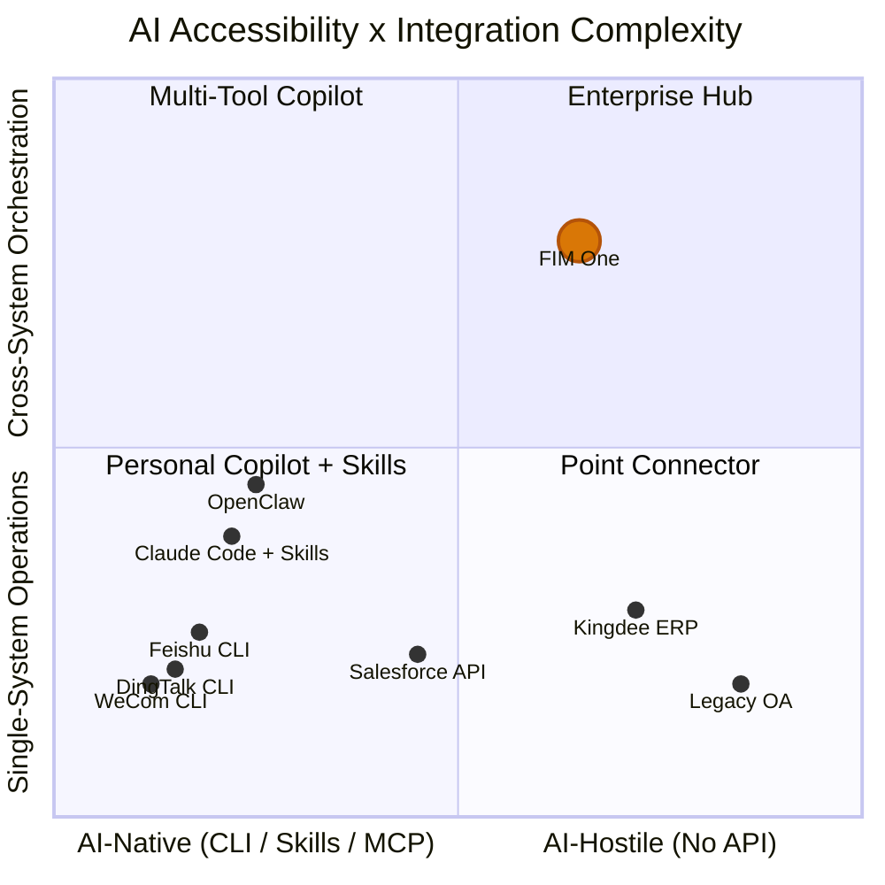

## Das Signal vom März 2026

Im März 2026 öffneten drei große chinesische Workplace-Plattformen innerhalb derselben Woche CLI-Tools:

- **DingTalk** veröffentlichte `dws` — 104 Tools über 12 Geschäftsbereiche
- **Feishu/Lark** veröffentlichte `lark-cli` — 200+ Befehle über 11 Bereiche
- **WeCom** veröffentlichte `wecom-cli` — abdeckend 7 Geschäftsbereiche

Keine von ihnen wählte MCP. Alle drei lieferten reine CLI-Tools mit vorkonfigurierten AI Skills aus, die über `npx skills add` verteilt werden. Dies ist das erste Mal, dass die Branche kollektiv ihre Position zu Frage zeigte, wie AI-Agenten mit Unternehmenssystemen kommunizieren sollten — und die Antwort war nicht ein Protokoll, sondern ein Verpackungsformat.

Dieses Dokument analysiert, was dies für die AI-System-Integration im Allgemeinen bedeutet und für die Strategie von FIM One im Besonderen.

## Drei Paradigmen für die Integration von KI-Systemen

### 1. REST API (Traditionell)

Die Grundlage. Jede SaaS-Plattform stellt HTTP-Endpunkte bereit, die mit OpenAPI-Spezifikationen dokumentiert sind. Die KI-Integration erfordert eine Adapter-Schicht — etwas, das zwischen „diesen API-Endpunkt mit diesen Headern und diesem JSON-Body aufrufen" und „hier ist ein Tool, das der Agent aufrufen kann" übersetzt.

Das ist das, was FIM One's ConnectorToolAdapter heute macht. Es funktioniert, aber jede Integration erfordert benutzerdefinierte Arbeit: API-Dokumentation lesen, Authentifizierung handhaben, Antwortformate zuordnen, mit Paginierung umgehen.

- **Wer nutzt es**: Jede SaaS-Plattform, Legacy-Integrationen
- **KI-Integration**: Erfordert Adapter-Schicht (ConnectorToolAdapter, benutzerdefinierter Code)
- **Stärke**: Universell, gut verstanden, strukturierte JSON-Ein-/Ausgabe
- **Schwäche**: Jede Integration erfordert benutzerdefinierte Entwicklungsarbeit

### 2. CLI + Skills (Emerging)

Die Plattform bietet eine kompilierte CLI-Binärdatei. Die KI-Integration erfolgt über vorgefertigte Skill-Dateien – Markdown-Dokumente, die KI-IDEs lehren, wie sie CLI-Befehle über Subprozesse aufrufen. Die Verteilung erfolgt über npm: `npx skills add dingtalk/dws`.

Die KI liest die Skill-Datei, versteht, welche Befehle verfügbar sind und welche Argumente sie benötigen, und ruft dann die CLI als Subprozess auf. Die Ausgabe ist typischerweise freier Text (Tabellen, formatierte Strings), den die KI analysieren muss.

- **Wer nutzt es**: DingTalk, Feishu, WeCom (alle haben sich im März 2026 dafür entschieden)
- **KI-Integration**: `npx skills add platform/cli` — KI-IDE liest Skill-Markdown, ruft CLI-Befehle auf
- **Stärke**: Schnell zu implementieren, funktioniert mit jeder KI-IDE, die das Skills-Format unterstützt
- **Schwäche**: Unstrukturierte Textausgabe (KI muss analysieren), kein standardisiertes Discovery-Protokoll, Umfang auf eine einzelne Plattform beschränkt

### 3. MCP (Model Context Protocol)

JSON-RPC über stdio oder SSE. Strukturierte Tool-Erkennung (`tools/list`) und Aufrufe (`tools/call`). Der AI-Client verhandelt Fähigkeiten mit dem Server, erhält ein typisiertes Schema für jedes Tool und empfängt strukturierte `CallToolResult`-Antworten.

- **Wer nutzt es**: Anthropic-Ökosystem, wachsende Anzahl von Entwicklertools
- **AI-Integration**: Natives Protokoll — strukturierte Ein-/Ausgabe, schemabasierte Erkennung
- **Stärke**: Standardisiert, strukturiert, zusammensetzbar, für Multi-Tool-Orchestrierung konzipiert
- **Schwäche**: Höhere Implementierungskosten, noch nicht von großen Workplace-Plattformen übernommen

### Vergleich

| Dimension | REST API | CLI + Skills | MCP |
|-----------|----------|-------------|-----|
| Standardisierung | Mittel (OpenAPI) | Niedrig (herstellerspezifische Skills) | Hoch (JSON-RPC-Protokoll) |
| KI-Freundlichkeit | Niedrig (benötigt Adapter) | Mittel (Text-E/A, von KI geparst) | Hoch (strukturierte JSON-E/A) |
| Erkennungsmechanismus | OpenAPI-Spezifikation / Dokumentation | `--help` + Skill-Markdown | `tools/list` Protokoll-Endpunkt |
| Ausgabeformat | Strukturiertes JSON | Freitext (benötigt KI-Parsing) | Strukturiertes `CallToolResult` |
| Zeit bis zur Bereitstellung | Wochen (pro Integration) | Tage (vorhandene API umhüllen) | Wochen (Protokoll implementieren) |
| Plattformübergreifende Orchestrierung | Erfordert Hub | Nicht integriert | Nicht integriert |
| Enterprise-Governance | Erfordert Hub | Nicht integriert | Nicht integriert |

## Was die großen Plattformen tatsächlich gewählt haben

| | DingTalk `dws` | Feishu `lark-cli` | WeCom `wecom-cli` |
|---|---|---|---|
| Sprache | Go | Go + Python | Rust + TS |
| Tools | 104 / 12 Domänen | 200+ / 11 Domänen | 7 Domänen |
| MCP-Unterstützung | Nein | Nein | Nein |
| KI-Integration | Markdown Skills + Schema-Introspection | 19 npm Skills (`npx skills add`) | 12 npm Skills (`npx skills add`) |
| Ausgabeformate | JSON / Tabelle / Raw + `--jq` | JSON / Tabelle / csv / ndjson | JSON |
| Agent-freundliche Flags | `--yes`, `--dry-run`, intelligente Eingabekorrektur | `--no-wait`, `--as user/bot`, `--dry-run` | Direkte JSON-Parameter |
| Erkennung | `dws schema` (Selbst-Introspection) | `lark-cli schema` (Selbst-Introspection) | Nur über Skill-Dateien |

Wichtige Beobachtung: `npx skills add` wird zu einem De-facto-Verteilungskanal für KI-Tool-Integrationen und umgeht MCP vollständig. Diese Plattformen wählten Geschwindigkeit beim Versand über Protokollstandardisierung. Das KI-IDE-Ökosystem (Cursor, Claude Code, Windsurf) versteht bereits Skills-Dateien, sodass die Plattformen sofortige KI-Integration erhalten, ohne einen Protokoll-Server implementieren zu müssen.

## Das KI-Zugänglichkeitsspektrum

Nicht alle Systeme sind für KI gleich leicht erreichbar, und nicht alle Aufgaben sind gleich einfach. Diese beiden Dimensionen definieren, wo verschiedene Integrationsansätze Wert schaffen.

**So liest man das Diagramm:**

- **Unten links (Personal Copilot + Skills)**: KI-native Plattformen mit einfachen Operationen. DingTalk, Feishu und WeCom clustern hier — sie liefern ihre eigene CLI + Skills, was Single-Platform-KI-Integration zu Self-Service macht. Persönliche Copilots wie OpenClaw und Claude Code with Skills besetzen diese Zone. FIM One fügt hier wenig Wert hinzu — die Plattform hat die Arbeit bereits geleistet.
- **Oben links (Multi-Tool Copilot)**: KI-native Plattformen mit systemübergreifenden Anforderungen. Ein Benutzer, der mehrere Skills (`dingtalk` + `feishu` + `wechat`) in Claude Code installiert, kann versuchen, Multi-Platform-Koordination durchzuführen, hat aber keine Governance, Orchestrierungsplanung und einheitliche Credential-Verwaltung.
- **Unten rechts (Point Connector)**: Legacy-Systeme, die eine einfache Brücke benötigen. Ein einzelner Connector zu einem Kingdee ERP oder einem Legacy-OA-System — FIM One ist hier als Adapter nützlich, auch für Single-System-Operationen, da diese Systeme keine CLI und begrenzte oder gar keine API haben.
- **Oben rechts (Enterprise Hub)**: Legacy- oder API-limitierte Systeme mit systemübergreifenden Orchestrierungsanforderungen. Das ist FIM Ones Stärke. Verträge über ein Legacy-Management-System abfragen, mit ERP-Forderungen korrelieren und Mahnmitteilungen über DingTalk versenden — dies erfordert DAG-Planung, Multi-Connector-Koordination, Credential-Vaulting, Audit-Trails und menschliche Bestätigungsgates. Kein persönlicher Copilot, keine CLI, keine Skills-Datei wird jemals hier ankommen.

FIM Ones Wert nimmt zu, wenn Sie sich zur oberen rechten Ecke bewegen: schwer erreichbare Systeme kombiniert mit komplexeren Orchestrierungsanforderungen. Die Plattformen, die ihre eigene CLI + Skills liefern, besetzen die entgegengesetzte Ecke — leicht erreichbar, einfache Operationen — und stellen einen Markt dar, den FIM One nicht verfolgen sollte.

## Persönlicher Copilot vs. Enterprise Hub

Die Verbreitung persönlicher KI-Copilots (OpenClaw, Claude Code, Cursor, Windsurf) wirft eine Positionierungsfrage auf. Es gibt zwei grundlegend unterschiedliche Modelle:

### Persönlicher Copilot

- **Benutzer**: Einzelner Entwickler oder Wissensarbeiter
- **Datenschutzbereich**: Mein Kalender, meine E-Mails, meine Dokumente
- **Authentifizierung**: Mein persönliches Token, meine OAuth-Sitzung
- **Integrationsspektrum**: Einzelperson, wenige Plattformen, persönliche Produktivität
- **Governance**: Nicht erforderlich — es sind meine Daten, meine Aktionen

### Enterprise Connector Hub

- **Benutzer**: Organisation (Teams, Abteilungen, abteilungsübergreifende Workflows)
- **Datenbereiche**: Abteilungsübergreifend, systemübergreifend, einschließlich sensibler und regulierter Daten
- **Authentifizierung**: Von Administratoren zugewiesene Berechtigungen, Prinzip der geringsten Berechtigung, Credential Vaulting
- **Integrationsbereiche**: Multi-System-Orchestrierung, Geschätsautomatisierung
- **Governance**: Audit-Protokolle, RBAC, Bestätigungsgates, Compliance-Anforderungen

Diese sind komplementär, nicht konkurrierend. Mit der Verbreitung persönlicher Copiloten benötigen Unternehmen einen zentralen Hub, um zu steuern, auf welche Ressourcen diese Copiloten zugreifen können. Ein Benutzer, der Claude Code mit `npx skills add dingtalk/dws` nutzt, kann seine eigenen DingTalk-Nachrichten lesen. Aber wenn ein KI-Agent systemübergreifend DingTalk, das Unternehmens-ERP und das Finanzsystem orchestrieren muss – mit Audit-Trails, Berechtigungskontrollen und manueller Bestätigung für Schreibvorgänge – ist das ein völlig anderes Problem.

Persönliche Copiloten standardisieren einfache Single-Platform-Operationen. Das ist nicht der Markt von FIM One. Der Markt von FIM One ist die systemübergreifende, Governance-erforderliche, Legacy-inklusive Unternehmensintegration, die kein persönlicher Copilot bewältigen kann.

## Strategische Implikationen für FIM One

| Priorität | Maßnahme | Begründung |
|----------|---------|-----------|
| Kurs halten | Weiterhin in Connector-Architektur für Legacy-/API-Systeme investieren | Dies ist der Wettbewerbsvorteil — CLI + Skills werden Legacy-Systeme nie erreichen |
| MCP unterstützen | MCP Server-Unterstützung bereits integriert (MCPServerMetaTool) — weiterhin polieren | MCP ist die strukturierte Protokoll-Wette; einige Plattformen werden sie eventuell übernehmen |
| Skills überwachen | Das `npx skills add` Ökosystem verfolgen, aber nicht danach jagen | Skills lösen ein Verteilungsproblem, das FIM One nicht hat |
| Bei Governance differenzieren | Audit, RBAC, Bestätigungsgates, Credential-Management | Personal Copilots werden niemals Enterprise-Governance bieten |
| Klar positionieren | „Der Hub, wo Ihre Systeme auf AI treffen" — nicht „eine weitere Möglichkeit, DingTalk zu nutzen" | Vermeiden Sie den Wettbewerb bei einfachen Integrationen, die Plattformen kostenlos bereitstellen |

Der schlimmste strategische Schritt wäre, auf die CLI + Skills Welle zu reagieren, indem man Skills-Adapter für Plattformen entwickelt, die bereits ihre eigenen bereitstellen. Das ist ein Wettrennen nach unten gegen die Plattformhersteller selbst. Die richtige Antwort ist, sich auf die Systeme zu konzentrieren, die diese Hersteller nie erreichen werden.

## Die Beziehung zwischen CLI, Skills und MCP

Diese drei Konzepte operieren auf verschiedenen Ebenen und werden in Diskussionen oft vermischt. Eine präzise Unterscheidung:

- **CLI** ist eine Benutzeroberfläche — Shell-Befehle, Text-I/O, eine Interaktionsform für die Systemnutzung
- **Skills** ist ein Verteilungsmechanismus — Markdown-Dateien, die KI lehren, wie CLI-Befehle aufgerufen werden, ein Verpackungsformat für KI-Tool-Integrationen
- **MCP** ist ein Protokoll — JSON-RPC, strukturierte Erkennung und Aufrufe, ein Interoperabilitätsstandard für KI-Tool-Kommunikation

Sie sind langfristig keine Substitute füreinander. Eine CLI ist die Art, wie ein Mensch (oder ein KI-Unterprozess) mit einem Tool interagiert. Eine Skill-Datei ist die Art, wie diese CLI in KI-IDEs verteilt wird. MCP ist die Art, wie eine strukturierte, schema-typisierte, zusammensetzbare Integration auf Protokollebene funktioniert.

Kurzfristig (2026) gewinnt jedoch CLI + Skills bei der Adoptionsgeschwindigkeit, da die Implementierung billiger ist als MCP. Eine Plattform mit einer bestehenden CLI kann eine Skill-Datei in einem Tag ausliefern. Die Implementierung eines MCP-Servers dauert Wochen und erfordert das Verständnis der Protokollspezifikation, Transportschichten und Capability-Verhandlung.

Die wahrscheinliche Konvergenz: Plattformen, die heute CLIs ausliefern, könnten sie morgen als MCP-Server verpacken. MCPs stdio-Transport startet bereits CLI-Prozesse — die Lücke zwischen „CLI aufgerufen durch Skills" und „CLI verpackt als MCP-Server" ist klein. Diese Konvergenz ist jedoch nicht garantiert. Wenn das Skills-Ökosystem schnell genug wächst und KI-IDEs sich darauf standardisieren, könnte MCP ein Developer-Tools-Protokoll bleiben statt ein Enterprise-Tools-Standard.

Für FIM One ist die Schlussfolgerung klar: Investieren Sie in die Protokollebene (MCP) und die Governance-Ebene (Connector-Architektur), nicht in die Verteilungsebene (Skills). Verteilung ist für Plattformanbieter ein gelöstes Problem. Protokoll und Governance sind dort, wo ein Hub dauerhaften Wert schafft.
