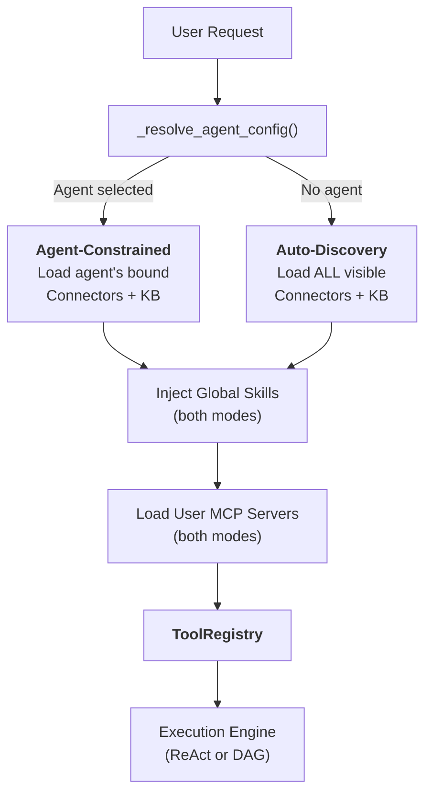
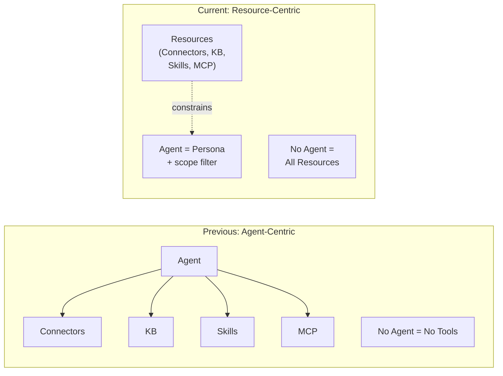
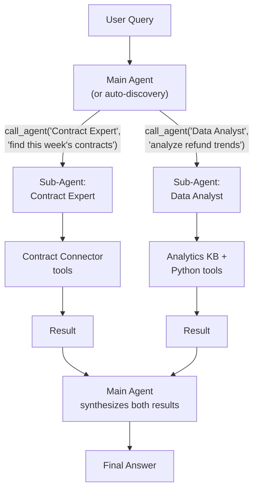
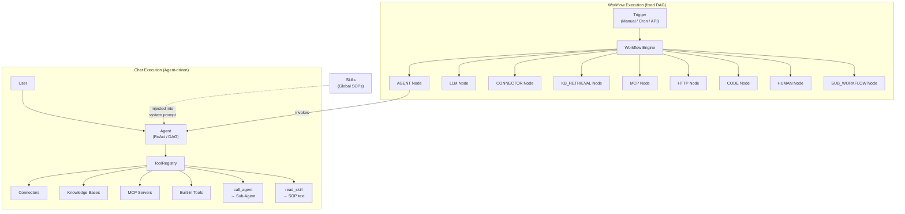

## Les deux modes

Chaque demande de chat dans FIM One commence par une question : **un Agent est-il sélectionné ?** La réponse détermine comment les ressources — Connecteurs, Bases de Connaissances, Compétences et serveurs MCP — sont découverts et assemblés dans l'ensemble d'outils que le LLM peut utiliser.

**Le Mode Contraint par Agent** s'active quand l'utilisateur choisit un Agent spécifique. Le système charge uniquement les ressources que cet Agent a été explicitement configuré pour utiliser :

- **Connecteurs** : seuls les `connector_ids` liés de l'Agent sont chargés comme outils.
- **Bases de Connaissances** : seuls les `kb_ids` liés de l'Agent sont injectés comme outils de récupération.
- **Compétences** : disponibles globalement — toutes les Compétences actives visibles par l'utilisateur sont injectées, car les Compétences sont des POS organisationnels, pas des connaissances spécifiques à l'Agent. (Voir [Compétences comme POS Globaux](#skills-as-global-sops) ci-dessous.)
- **Serveurs MCP** : toujours limités à l'utilisateur — tous les serveurs MCP actifs visibles par l'utilisateur sont chargés dans les deux modes.
- **Instructions** : le champ `instructions` de l'Agent définit la persona et les directives comportementales injectées dans l'invite système.

**Le Mode Auto-Découverte Globale** s'active quand aucun Agent n'est sélectionné (par exemple, un nouveau chat). Le système découvre automatiquement tout ce qui est accessible à l'utilisateur :

- **Connecteurs** : tous les Connecteurs visibles par l'utilisateur (propres + partagés par l'org + abonnements au Marché) sont chargés.
- **Bases de Connaissances** : toutes les BCs accessibles sont disponibles pour la récupération via `kb_retrieve`.
- **Compétences** : toutes les Compétences actives visibles par l'utilisateur sont injectées comme stubs de POS.
- **Serveurs MCP** : identiques au mode contraint — tous les serveurs actifs visibles par l'utilisateur.
- **Instructions** : une persona d'assistant générique est utilisée.

La bifurcation se produit à l'intérieur de `_resolve_tools()`, qui est appelée à chaque demande de chat :



L'effet pratique : les utilisateurs peuvent commencer à discuter immédiatement sans configurer un Agent. Le système découvre les ressources disponibles et les expose comme outils. Sélectionner un Agent réduit la portée — cela ne déverrouille pas de nouvelles capacités, cela concentre les capacités existantes.

### Ce que chaque mode découvre

Les deux modes diffèrent par leur **portée**, non par leur nature. Les deux produisent un `ToolRegistry` — ils le remplissent simplement différemment.

**Mode de découverte automatique (aucun Agent sélectionné) :**

| Ressource | Découverte | Forme d'outil |
|---|---|---|
| Connecteurs (API) | `resolve_visibility()` — tous visibles pour l'utilisateur | `ConnectorMetaTool` (progressive) |
| Connecteurs (BD) | `resolve_visibility()` — tous visibles pour l'utilisateur | Outils BD individuels par schéma |
| Bases de connaissances | Toutes les BCs accessibles | `kb_retrieve` |
| Compétences | `resolve_visibility()` — toutes actives | `read_skill` (stubs progressifs) |
| Serveurs MCP | `resolve_visibility()` — tous visibles par l'utilisateur | `{server}__{tool}` |
| Agents | `resolve_visibility()` — tous actifs, non-builder | `call_agent` (catalogue) |
| Outils intégrés | `discover_builtin_tools()` — ensemble complet | Aucun filtre de catégorie appliqué |

**Mode contraint par Agent (Agent sélectionné) :**

| Ressource | Découverte | Forme d'outil |
|---|---|---|
| Connecteurs | Uniquement `agent.connector_ids` | `ConnectorMetaTool` ou par action hérité |
| Bases de connaissances | Uniquement `agent.kb_ids` | `GroundedRetrieveTool` / `KBRetrieveTool` |
| Compétences | Global — **non contraint par l'Agent** | `read_skill` |
| Serveurs MCP | Scoped utilisateur — **non contraint par l'Agent** | `{server}__{tool}` |
| Agents | Global — `call_agent` toujours disponible | `call_agent` |
| Outils intégrés | Filtre `agent.tool_categories` | Sous-ensemble par catégorie |

L'asymétrie clé : les Connecteurs et les Bases de connaissances sont scoped par l'Agent, mais les Compétences, les Serveurs MCP et CallAgent sont toujours globaux. Cela reflète l'intention de conception — les Compétences sont des règles organisationnelles (tout le monde suit les mêmes procédures), tandis que les Connecteurs et les BCs sont des liaisons de capacité (différents agents se connectent à différents systèmes).

## Tout est un outil

Au niveau du LLM, tous les types de ressources convergent en une liste plate d'outils appelables. Le LLM n'a aucune conscience structurelle du fait qu'il appelle un Connecteur, un serveur MCP ou une Base de connaissances. Il voit un `ToolRegistry` — un ensemble de fonctions avec des noms, des descriptions et des schémas de paramètres.

| Type de ressource | Devient au niveau LLM | Modèle de nom d'outil |
|---|---|---|
| Connecteur (progressif) | Outil méta unique | `connector` |
| Connecteur (hérité) | N outils par action | `{connector}__{action}` |
| Serveur MCP | N outils par serveur | `{server}__{tool}` |
| Base de connaissances | Outil de récupération | `kb_retrieve` ou `grounded_retrieve` |
| Compétence (progressive) | Outil de lecture + stubs de prompt système | `read_skill` |
| Compétence (en ligne) | Texte de prompt système uniquement | _(pas d'outil)_ |
| Agent lui-même | Non visible comme un outil | _(instructions + assemblage d'outils)_ |

L'insight clé : **un Agent n'est pas un outil — c'est l'entité qui utilise les outils.** L'Agent contribue ses instructions au prompt système et détermine quels outils sont disponibles. Mais du point de vue du LLM, il n'existe aucun concept « d'agent » — seulement un prompt système et un ensemble de fonctions appelables.

Cette uniformité est ce qui rend le système extensible. Ajouter un nouveau type de ressource signifie implémenter le protocole `Tool` (`name`, `description`, `parameters_schema`, `run()`). Les moteurs d'exécution, la gestion du contexte et la couche d'interaction avec le LLM restent inchangés.

## Compétences en tant que procédures opérationnelles standard mondiales

Les compétences occupent une couche au-dessus des agents. Ce sont des politiques et des procédures organisationnelles que chaque agent doit suivre, quel que soit l'agent sélectionné.

### Pourquoi les compétences ne sont pas liées aux agents

Une compétence comme « Customer Complaint Handling SOP » s'applique à chaque agent qui interagit avec les clients. Lier les compétences aux agents crée un problème de propriété bidirectionnelle : si une compétence orchestre les agents, et les agents possèdent les compétences, qui contrôle qui ?

Les compétences sont globales par conception — ce sont des règles d'entreprise, pas des connaissances spécifiques aux agents. La fonction `_resolve_tools()` charge toutes les compétences actives visibles pour l'utilisateur indépendamment de la sélection d'agent, en utilisant le même filtre `resolve_visibility()` utilisé pour les autres ressources.

### Deux modes d'injection

Les compétences prennent en charge deux stratégies d'injection, contrôlées par `SKILL_TOOL_MODE` (environnement) ou la `model_config_json.skill_tool_mode` de l'Agent :

| Mode | Invite système | Outil | Quand l'utiliser |
|---|---|---|---|
| **Progressive** (par défaut) | Stubs nom + description uniquement | `read_skill(name)` charge le contenu complet à la demande | Nombreuses compétences, ou compétences avec contenu volumineux — économise les tokens de contexte |
| **Inline** | Contenu complet de la compétence intégré | Aucun | Peu de compétences petites — pas de surcharge d'appel d'outil |

En mode progressif, l'invite système contient des stubs compacts comme :

```
## Available Skills
Call read_skill(name) to load full content before executing any of these:
- **Customer Complaint SOP**: Handle escalations per company policy...
- **Refund Processing**: Step-by-step refund workflow...
```

L'LLM appelle `read_skill("Customer Complaint SOP")` uniquement quand il a besoin de la procédure complète, gardant le contexte allégé pendant les tours non liés.

## Agent en tant que persona, non conteneur

L'architecture de FIM One reflète un changement délibéré d'un modèle centré sur l'Agent à un modèle centré sur les Ressources.

**Modèle précédent :** l'Agent était un conteneur qui contrôlait l'accès à toutes les ressources. Aucun Agent sélectionné signifiait aucun Connecteur, aucune Compétence, aucune KB spécialisée. L'Agent était le point d'entrée obligatoire pour toute capacité.

**Modèle actuel :** l'Agent est une persona — un ensemble d'instructions et de directives comportementales — combiné avec une contrainte de ressource optionnelle. Les Ressources existent indépendamment des Agents. Sélectionner un Agent réduit la portée ; ne pas en sélectionner l'ouvre complètement.



Cela signifie :

- **Les utilisateurs peuvent commencer à discuter immédiatement** sans configurer un Agent.
- **Le système découvre automatiquement les ressources disponibles** et les expose en tant qu'outils.
- **Les Agents deviennent des personas légers** qui peuvent être créés rapidement — il suffit d'écrire des instructions et de lier optionnellement des Connecteurs et des KBs spécifiques.
- **La gestion des ressources est découplée** de la gestion des Agents. Publier un Connecteur dans une organisation le rend disponible partout — en mode découverte automatique, dans les listes déroulantes de liaison d'Agent, et dans la résolution d'outils des sous-agents.

## Orchestration multi-agent

FIM One prend en charge la délégation de tâches à des agents spécialisés via `CallAgentTool`. Cela permet à un agent parent (ou au mode de découverte automatique) d'invoquer des sous-agents pour des tâches ciblées.

### Catalogue d'agents

À l'exécution, tous les agents actifs et non-builder visibles par l'utilisateur sont assemblés dans un catalogue. Le nom et la description de chaque agent sont listés dans le schéma de paramètres de l'outil `call_agent`, permettant au LLM de choisir le bon spécialiste sémantiquement — sans routage codé en dur.

### Héritage complet des outils

Lorsqu'un sous-agent est invoqué via `call_agent(agent_id, task)`, il reçoit un `ToolRegistry` complet construit à partir de sa propre configuration — incluant ses Connecteurs liés, sa KB et ses outils intégrés. Les sous-agents sont des unités d'exécution complètes, pas seulement des conseillers textuels.

### Délégation à un seul niveau

Pour éviter la récursion infinie, les sous-agents ne reçoivent pas l'outil `call_agent`. La délégation est toujours à un seul niveau : le parent appelle l'enfant, l'enfant s'exécute et retourne un résultat. Le parent synthétise les résultats de plusieurs sous-agents.

### Exécution parallèle

En mode d'appel de fonction natif, le LLM peut invoquer plusieurs appels `call_agent` en un seul tour. Ceux-ci s'exécutent simultanément via `asyncio.gather`, permettant des modèles comme « rechercher trois sources simultanément ».



## Modèle de visibilité

Toute découverte de ressources — dans les deux modes — est régie par un modèle de visibilité unifié avec trois niveaux :

| Niveau | Description | Exemple |
|---|---|---|
| **Propre** | Créé par l'utilisateur. Toujours visible. | Un connecteur que vous avez créé pour l'API de votre équipe |
| **Partagé au niveau de l'organisation** | Ressources avec `visibility: "org"` de la ou des organisations de l'utilisateur. Visible pour tous les membres approuvés de l'organisation. | Un connecteur ERP à l'échelle de l'entreprise publié par l'informatique |
| **Abonné au marché** | Ressources installées depuis le marché FIM One. Visible pour l'abonné. | Un connecteur Slack créé par la communauté que vous avez installé |

La fonction `resolve_visibility()` dans `web/visibility.py` crée un filtre SQL qui inclut les trois niveaux dans une seule requête :

```python
conditions = [
    model.user_id == user_id,                    # own resources
    and_(model.visibility == "org",              # org-shared
         model.org_id.in_(user_org_ids),
         or_(model.publish_status == None,
             model.publish_status == "approved")),
    model.id.in_(subscribed_ids),                # Market-subscribed
]
```

Ce même filtre est utilisé partout :

- Découverte automatique de connecteurs en mode sans agent
- Construction du catalogue d'agents pour `CallAgentTool`
- Chargement des compétences visibles pour l'injection d'invite système
- Résolution du serveur MCP
- Recherche de configuration d'agent (garantissant qu'un utilisateur ne peut sélectionner que les agents qui lui sont visibles)

L'uniformité signifie que **publier un connecteur à une organisation le rend automatiquement disponible** en mode découverte automatique, dans les listes déroulantes de liaison d'agent et dans la résolution d'outils de sous-agent — aucun câblage spécial requis. Le modèle de visibilité est la source unique de vérité pour « ce que cet utilisateur peut accéder ».

## Carte des relations

FIM One dispose de deux paradigmes d'exécution parallèles — **Chat (piloté par agent)** et **Workflow (piloté par DAG)** — qui partagent les mêmes ressources sous-jacentes mais les orchestrent différemment.



Points clés du diagramme :

- **Agent et Workflow sont des paradigmes parallèles.** Les deux peuvent utiliser des connecteurs, des bases de connaissances et des serveurs MCP — mais selon des mécanismes différents. Les agents les utilisent comme outils dans un `ToolRegistry` ; les Workflows les utilisent comme nœuds DAG typés.
- **Workflow peut orchestrer des Agents** via le nœud `AGENT` — une étape de Workflow peut invoquer un Agent complet avec sa propre boucle ReAct/DAG. L'inverse n'est pas vrai : les Agents ne peuvent pas invoquer directement les Workflows (seulement indirectement via des déclencheurs API/webhook).
- **Les Skills sont injectés uniquement dans les Agents.** Les Skills sont du texte d'invite système — ils guident le comportement de l'Agent. Les Workflows ne consomment pas de Skills car les nœuds de Workflow exécutent une logique déterministe, pas un raisonnement guidé par LLM.
- **Ressources partagées, modèles d'accès différents.** Un connecteur peut être appelé par un Agent (via `ConnectorToolAdapter`), par un Workflow (via le nœud `CONNECTOR`), ou par les deux dans le même processus métier — par exemple, un Workflow déclenche un Agent qui interroge le même connecteur que celui utilisé par le Workflow dans une étape ultérieure.

## Moteur de flux de travail — l'autre paradigme d'exécution

Bien que ce document se concentre sur l'exécution de chat pilotée par agent, FIM One inclut un **Moteur de flux de travail** complet — un éditeur DAG visuel avec 26 types de nœuds pour l'automatisation de processus fixes.

| Aspect | Agent (Chat) | Flux de travail |
|---|---|---|
| Orchestration | L'LLM décide de l'étape suivante de manière dynamique | DAG fixe défini au moment de la conception |
| Idéal pour | Tâches exploratoires, conversations, raisonnement flexible | Chaînes d'approbation, ETL planifiée, automatisations multi-étapes |
| Peut appeler | Connecteurs, KB, MCP, Outils intégrés, Sous-agents, Compétences | Agents, Connecteurs, KB, MCP, LLM, HTTP, Code, Approbation humaine, Sous-flux de travail |
| Déclencheur | Message utilisateur dans le chat | Manuel, planification cron ou API/webhook |
| Imbrication | Délégation à un niveau (agent parent → agent enfant) | Profondeur DAG arbitraire via nœuds SUB_WORKFLOW |

Les deux paradigmes sont complémentaires. Utilisez les Agents quand la tâche est ouverte (« analyser les données de ventes de ce trimestre et recommander des actions »). Utilisez les Flux de travail quand le processus est connu (« chaque lundi, extraire les nouvelles factures de l'ERP, exécuter les vérifications de conformité et acheminer les exceptions vers un examinateur humain »). Un Flux de travail peut invoquer un Agent pour toute étape qui nécessite un raisonnement flexible au sein d'un pipeline autrement fixe.

Pour plus de détails sur les modes d'exécution des Agents et les types de nœuds du Flux de travail, consultez [Modes d'exécution](/concepts/execution-modes).
