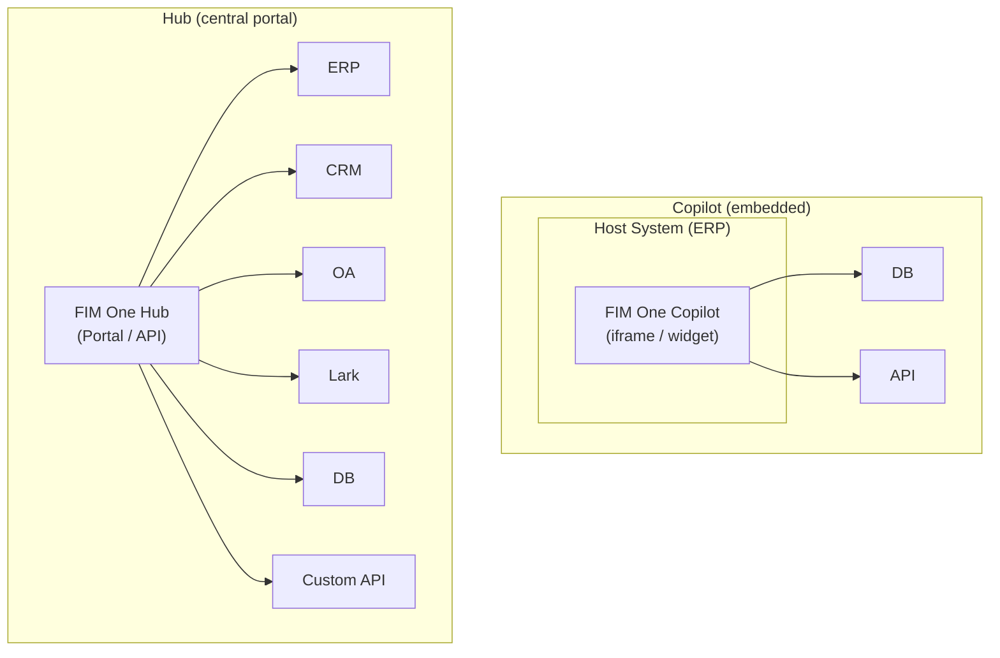
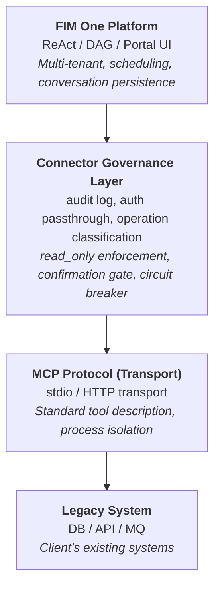
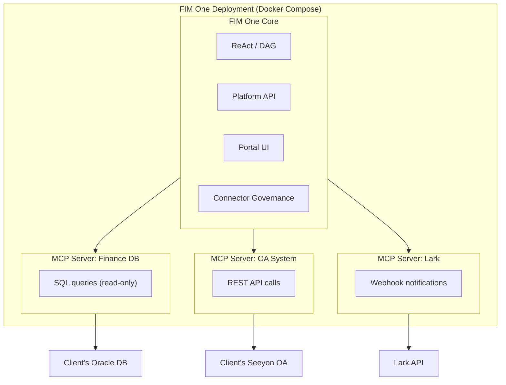
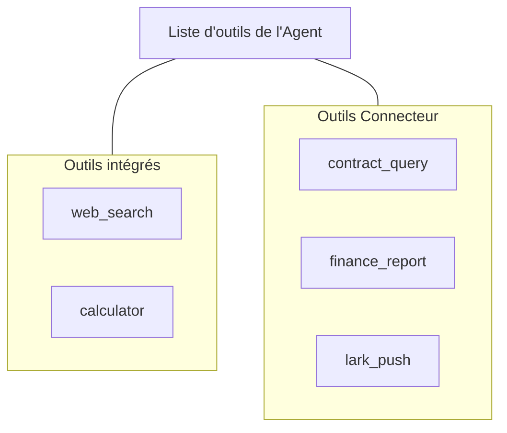
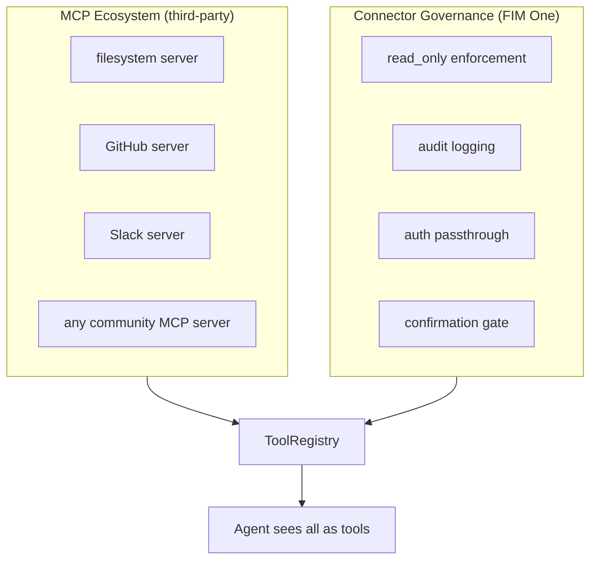

## Copilot vs Hub

L'architecture prend en charge deux échelles d'intégration :



**Copilot** s'intègre dans l'interface utilisateur d'un système hôte. Les utilisateurs interagissent avec l'IA sans quitter leur interface familière. Il peut utiliser plusieurs connecteurs (DB hôte + service de notification, etc.).

**Hub** est un portail autonome qui connecte tous les systèmes. Il n'est intégré dans aucun système unique -- c'est la couche d'intelligence centrale où les systèmes rencontrent l'IA.

Même architecture de connecteur, livraison différente. Un Copilot utilise le même `ConnectorToolAdapter` qu'un Hub.

## Principe fondamental

**Le client ne change aucun code.** FIM One s'intègre proactivement dans leurs systèmes -- en lisant leurs bases de données, en appelant leurs API, en poussant vers leur bus de messages. Le client fournit uniquement les identifiants et l'accès réseau.

## Architecture à trois couches



Chaque couche a une responsabilité distincte :

| Couche | Responsable de | Change quand... |
|---|---|---|
| **Plateforme** | Orchestration, multi-tenant, UI | De nouvelles fonctionnalités de plateforme sont déployées |
| **Couche de gouvernance des connecteurs** | Politiques de gouvernance d'entreprise | Les exigences de sécurité/conformité changent |
| **Protocole MCP** | Transport, standard d'interface d'outils | Jamais (norme ouverte) |
| **Système hérité** | Données métier et logique | Jamais (c'est tout l'intérêt) |

## Pourquoi MCP comme couche de transport

Les adaptateurs sont implémentés en tant que **Serveurs MCP**. Il s'agit d'un choix architectural délibéré :

- **Réutilisabilité** : FIM One est déjà livré avec un Client MCP (v0.3). L'ajout d'un adaptateur de système hérité réutilise la même infrastructure que l'ajout de n'importe quel outil MCP.
- **Protocole standard** : MCP est une norme ouverte. Aucun protocole propriétaire à inventer ou maintenir.
- **Écosystème** : Les serveurs MCP tiers (bases de données, API, outils SaaS) fonctionnent immédiatement.
- **Isolation des processus** : Chaque serveur MCP s'exécute en tant que processus distinct. Un adaptateur défaillant ne peut pas faire planter la plateforme.

### Ce que MCP seul ne fournit pas

La **Couche de gouvernance des connecteurs** ajoute la gouvernance d'entreprise que MCP brut ne possède pas :

| Préoccupation | MCP | Couche de gouvernance des connecteurs |
|---|---|---|
| Application de la lecture seule | Non | Drapeau `read_only` sur les opérations ; écriture bloquée par défaut |
| Journalisation d'audit | Non | Chaque appel d'outil enregistré (horodatage, utilisateur, outil, paramètres, résultat) |
| Authentification directe | Non | Authentification du système hôte proxy ; l'agent agit au nom de l'utilisateur connecté |
| Porte de confirmation | Non | Les opérations d'écriture nécessitent une approbation humaine (SSE `confirmation_required`) |
| Disjoncteur | Non | L'échec de la connexion déclenche une dégradation progressive |
| Classification des opérations | Non | Opérations étiquetées comme lecture/écriture/administration avec des politiques par niveau |

### Pourquoi ne pas inventer un protocole personnalisé

Le protocole est une commodité. La valeur technique réside dans les adaptateurs eux-mêmes (connaissance du domaine, mappage de schéma, gestion des cas limites) et la couche de gouvernance (audit, authentification, sécurité). Inventer un protocole de transport ajouterait un coût de maintenance sans ajouter de capacité. Stripe utilise HTTPS ; Docker utilise cgroups ; FIM One utilise MCP.

## Modèle de déploiement

Tout s'exécute dans un seul déploiement Docker Compose. Le client n'installe rien.



<Note>
Tous fournis par FIM One. Le client fournit uniquement :
- Les identifiants de base de données (compte en lecture seule recommandé)
- Les points de terminaison API et les clés (si disponibles)
- L'accès à la liste blanche du réseau
</Note>

**Hiérarchie d'accès** : FIM One s'adapte à l'accès que le client peut fournir :

| Ce que le client a | Comment FIM One se connecte |
|---|---|
| API avec documentation | Adaptateur HTTP API (meilleur cas) |
| API sans documentation | Adaptateur HTTP API + mappage de schéma manuel |
| Accès à la base de données uniquement | Adaptateur de base de données (SQL direct, lecture seule par défaut) |
| Base de données + bus de messages | Adaptateur de base de données + adaptateur de push de messages |

## Découplage Agent-Connecteur

L'agent voit les connecteurs comme des outils ordinaires. Il ne sait pas et ne se soucie pas de savoir si un outil est intégré, un serveur MCP tiers ou un connecteur de système hérité.



Cela signifie :

- **Ajouter** un nouveau système = ajouter une configuration de connecteur. Le code de l'agent ne change pas.
- **Supprimer** un connecteur = supprimer la configuration. Aucune modification de code.
- Le même agent peut utiliser des outils intégrés et des connecteurs dans une seule tâche.

## Évolution du Hot-Plug

| Version | Comment ajouter un nouveau connecteur | Redémarrage requis ? |
|---|---|---|
| **v0.6** | Écrire un serveur MCP Python avec couche de gouvernance des connecteurs, ajouter à docker-compose | Redéploiement |
| **v0.8** | Écrire une config YAML/JSON, la plateforme génère le serveur MCP | Redémarrage |
| **v1.0** | Télécharger une spécification OpenAPI, l'IA génère la config automatiquement | **Pas de redémarrage (hot-plug)** |

Les déploiements d'entreprise sont « implémenter une fois, exécuter pendant des mois » -- le hot-plug est une commodité de v1.0, pas une exigence de v0.6.

## Exemple de flux de données

Utilisateur : « Vérifier tous les contrats en retard du système financier et envoyer un résumé à Lark. »

```
1. User sends message via Portal / API

2. FIM One (ReAct mode):
   Think: I need to query the finance DB for overdue contracts, then push to Lark.

3. Act: contract_query(status="overdue", days_past_due=">30")
   → Connector Governance: audit log, read_only check (pass)
   → MCP Server: translates to SQL
   → Client DB: SELECT * FROM contracts WHERE status='overdue' AND ...
   ← Returns 7 overdue contracts

4. Think: Found 7 overdue contracts. I'll summarize and push.

5. Act: lark_push(message="7 overdue contracts found: ...")
   → Connector Governance: audit log, write operation → confirmation gate
   → User approves via Portal
   → MCP Server: POST to Lark webhook
   ← Push successful

6. Answer: "Found 7 overdue contracts. Summary pushed to Lark group."
```

## Niveaux de standardisation des connecteurs

| Niveau | Version | Approche | Qui le construit |
|---|---|---|---|
| **Niveau 1** | v0.6 | Serveur MCP Python avec gouvernance des connecteurs | Développeur FIM One |
| **Niveau 2** | v0.8 | Configuration YAML/JSON, génération automatique du serveur MCP par la plateforme | Ingénieur d'implémentation (aucune connaissance Python requise) |
| **Niveau 3** | v1.0 | Télécharger la spécification OpenAPI/Swagger, l'IA génère la configuration | IA (avec révision humaine) |

## Relation avec l'écosystème MCP existant

Le Client MCP de FIM One (livré en v0.3) supporte déjà les serveurs MCP tiers. Les adaptateurs de systèmes hérités sont simplement des **serveurs MCP spécifiques au domaine** construits avec la couche de gouvernance des connecteurs pour la gouvernance d'entreprise.



La couche de gouvernance des connecteurs ne remplace pas MCP -- elle étend MCP avec la couche de gouvernance que l'intégration des systèmes hérités d'entreprise nécessite.
