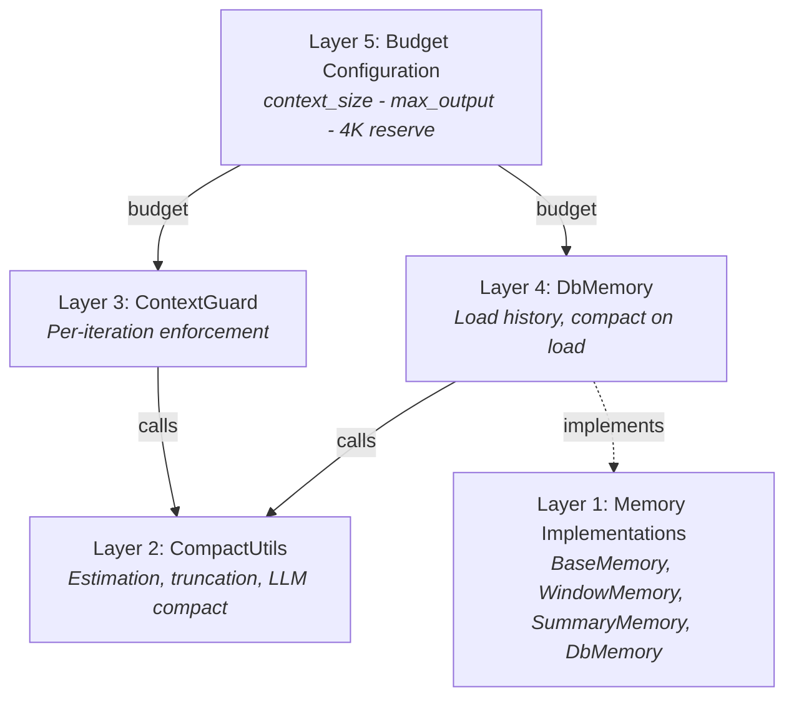
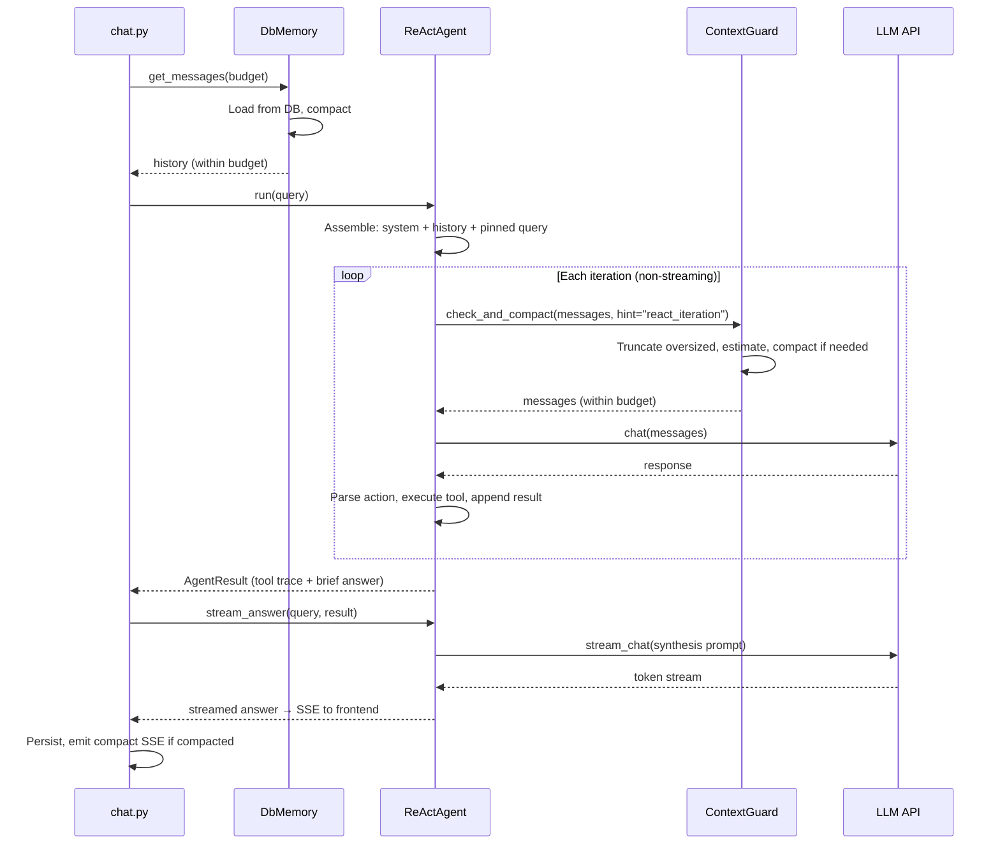
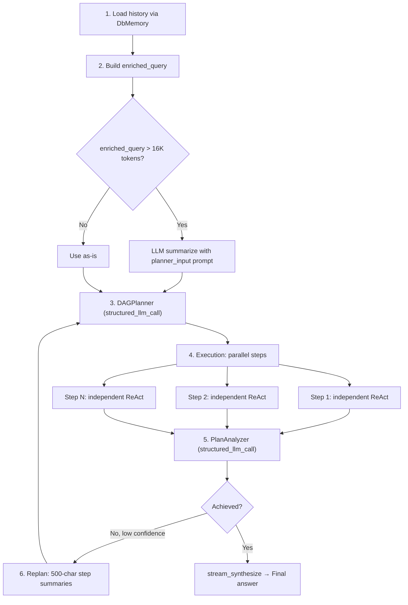

## Le problème

Les LLMs ont des fenêtres de contexte limitées. Un modèle de 128K tokens semble généreux jusqu'à ce que vous soustrayiez le budget de sortie, l'invite système, les descriptions d'outils et l'historique accumulé d'une conversation multi-tours. Les longues conversations, les résultats d'outils volumineux et les boucles d'agents multi-étapes poussent tous contre cette limite — souvent au cours d'une seule session.

La solution naïve est la troncature : supprimer les anciens messages lorsque la fenêtre se remplit. C'est rapide et prévisible, mais cela détruit le contexte indiscriminément. L'intention originale de l'utilisateur, les décisions clés des tours précédents et les points de données critiques disparaissent tous lorsqu'une coupure de caractères brutale les atteint. L'extrême opposé — la synthèse alimentée par LLM à chaque tour — préserve le contenu sémantique mais est coûteux, lent et introduit ses propres modes de défaillance (résumés hallucés, perte de précision numérique).

Le vrai défi n'est pas « tenir dans la fenêtre ». C'est : **se dégrader gracieusement sans perdre les informations critiques, sans brûler de tokens sur une compaction inutile et sans ajouter de latence que l'utilisateur peut ressentir.**

FIM One résout ce problème avec une architecture de défense en profondeur à cinq couches. Chaque couche aborde une échelle différente du problème, et elles se composent proprement — aucune couche unique n'a besoin d'être parfaite car la suivante rattrape ce qu'elle manque.

## Cinq couches de défense

La gestion du contexte n'est pas un mécanisme unique. C'est une pile, où chaque couche gère une préoccupation spécifique à une granularité spécifique :

| Couche | Composant | Fonction | Moment d'action |
|--------|-----------|----------|-----------------|
| **5** | Budget Configuration | Calcule le budget de jetons d'entrée utilisable à partir des spécifications du modèle | Au démarrage / par requête |
| **4** | DbMemory | Charge l'historique persisté, compacte au chargement | Une fois par requête |
| **3** | ContextGuard | Application du budget par itération | À chaque itération ReAct |
| **2** | CompactUtils | Estimation des jetons, troncature intelligente, compaction LLM | Appelé par les couches 3 et 4 |
| **1** | Memory Implementations | Interface abstraite + stratégies concrètes | Niveau framework |

Les couches sont numérotées de bas en haut car les couches supérieures dépendent des couches inférieures. La couche 5 définit le budget. La couche 4 effectue la compaction initiale au moment du chargement. La couche 3 applique le budget à chaque itération. Les couches 2 et 1 fournissent les primitives que les couches 3 et 4 utilisent.



### Couche 5 — Configuration du budget

Le budget est calculé à partir de trois valeurs :

```
usable_input_tokens = context_size - max_output_tokens - system_prompt_reserve
```

Avec les valeurs par défaut : `128 000 - 64 000 - 4 000 = 60 000 tokens`.

La réserve de 4 000 tokens pour le système prompt couvre le système prompt de l'agent, les descriptions d'outils et les frais généraux de formatage. C'est une constante fixe — suffisamment généreuse pour éviter de tronquer les système prompts en pratique, assez petite pour ne pas gaspiller le budget.

Les valeurs de budget peuvent provenir de trois sources, résolues par ordre de priorité :

1. **ModelConfig de la base de données** — `context_size` et `max_output_tokens` par modèle définis par l'administrateur.
2. **Variables d'environnement** — `LLM_CONTEXT_SIZE` et `LLM_MAX_OUTPUT_TOKENS`.
3. **Valeurs par défaut codées en dur** — contexte 128K, sortie 64K.

Le LLM principal et le LLM rapide ont des budgets indépendants. L'exécution des étapes DAG utilise le budget du LLM rapide ; le mode ReAct utilise le budget du LLM principal. Cela a de l'importance car les opérateurs associent souvent un modèle à grand contexte pour ReAct (où l'historique s'accumule) avec un modèle plus petit et plus rapide pour les étapes DAG (où chaque étape recommence de zéro).

Un plancher de 4 000 tokens est appliqué — si les valeurs mal configurées produisaient un budget plus petit, le système le limite à 4K plutôt que d'échouer silencieusement.

### Couche 4 — DbMemory

`DbMemory` est l'implémentation de mémoire en production. Elle charge l'historique de conversation persisté depuis la base de données et le compacte pour tenir dans le budget de tokens avant que l'agent ne le voie.

La conception est **intentionnellement en lecture seule**. La persistance est gérée par `chat.py` — la couche API qui possède le cycle de vie complet des messages (y compris les métadonnées, le suivi d'utilisation et les pièces jointes d'images). `DbMemory` ne fait que lire. Ses méthodes `add_message()` et `clear()` sont des no-ops. Cette séparation prévient les écritures doubles et garde la logique de persistance au même endroit.

Au chargement, `DbMemory` :

1. Interroge tous les messages `user` et `assistant` pour la conversation, ordonnés par heure de création.
2. Supprime le dernier message utilisateur (la requête actuelle, que l'agent réajoutera).
3. Reconstruit les pièces jointes d'images — les messages utilisateur qui incluaient des images stockent les métadonnées (`file_id`, `mime_type`) dans la base de données, et `DbMemory` reconstruit les data-URLs en base64 à partir du disque pour que le LLM puisse « voir » les images des tours précédents.
4. Compacte : si un `compact_llm` a été fourni, utilise `CompactUtils.llm_compact()`. Sinon, revient à `CompactUtils.smart_truncate()`.

Après compaction, `DbMemory` définit les drapeaux de suivi (`was_compacted`, `_original_count`, `_compacted_count`) que la couche SSE utilise pour émettre un événement `compact` au frontend.

### Couche 3 — ContextGuard

`ContextGuard` est l'applicateur de budget par itération. Il est appelé au début de chaque itération ReAct — à la fois en mode ReAct autonome et à l'intérieur du sous-agent de chaque étape du DAG. C'est la dernière ligne de défense avant que les messages ne frappent l'API LLM.

L'application suit un processus en trois étapes :

1. **Tronquer les messages de taille excessive.** Tout message unique dépassant 50 000 caractères est tronqué brutalement avec un suffixe `[Truncated]`. Cela capture les sorties d'outils qui s'échappent — un web scrape qui retourne une page entière, une lecture de fichier qui déverse un grand ensemble de données.

2. **Estimer le total des tokens.** Si le total s'inscrit dans le budget, retourner immédiatement. La plupart des itérations passent ici — la compaction est l'exception, pas la norme.

3. **Compacter si dépassement du budget.** Si un `compact_llm` est disponible, utiliser la compaction alimentée par LLM avec un prompt spécifique à l'indice. Sinon, revenir à `smart_truncate`.

Le **système d'indices** est ce qui rend ContextGuard conscient du contexte plutôt que générique. Différentes situations nécessitent différentes stratégies de compaction :

| Indice | Utilisé par | Préserve | Supprime |
|--------|-------------|----------|----------|
| `react_iteration` | Boucle d'agent ReAct | Chaîne de raisonnement récente, objectif actuel, données critiques | Anciennes étapes redondantes, tentatives échouées, sorties d'outils verbeux |
| `planner_input` | Requête enrichie du DAG | Évolution de l'intention utilisateur, décisions clés, contraintes | Détails du dialogue, salutations, mécaniques d'appel d'outils |
| `step_dependency` | Contexte d'étape du DAG | Données clés, nombres, conclusions | Processus de raisonnement, tentatives échouées, formatage verbeux |
| `general` | Secours par défaut | Faits clés, décisions, résultats d'outils | Salutations, remplissage, allers-retours redondants |

Chaque indice correspond à un prompt système soigneusement formulé qui indique au LLM de compaction ce qu'il faut conserver et ce qu'il faut rejeter. Les prompts se terminent par « Écrivez dans la même langue que la conversation » — un détail qui compte pour les utilisateurs CJK dont les résumés seraient autrement par défaut en anglais.

Si la compaction LLM échoue (erreur réseau, réponse vide, toute exception), ContextGuard revient silencieusement à `smart_truncate`. L'agent ne voit jamais l'échec. C'est un choix de fiabilité délibéré : il est préférable de perdre un peu de contexte via une troncature heuristique que de faire planter l'itération.

### Couche 2 — CompactUtils

`CompactUtils` est une classe utilitaire sans état — pas d'instances, pas d'état, juste des fonctions pures. Elle fournit trois capacités sur lesquelles les couches 3 et 4 s'appuient.

**L'estimation de jetons** convertit le texte en un nombre de jetons approximatif sans importer de bibliothèque de tokeniseur. L'heuristique :

- Caractères ASCII : ~4 caractères par jeton
- Caractères CJK / non-ASCII : ~1,5 caractères par jeton
- Images : 765 jetons par image (coût fixe)
- Surcharge par message : 4 jetons (marqueur de rôle, délimiteurs)

**`smart_truncate`** est le recours heuristique. Il conserve les messages épinglés sans condition, puis parcourt les messages non épinglés en arrière, en accumulant jusqu'à épuisement du budget. Le résultat est un suffixe de la conversation qui s'adapte. Il garantit également que le résultat ne commence jamais par un message d'assistant — un tour d'assistant orphelin sans message utilisateur précédent confond les LLM.

**`llm_compact`** est le chemin alimenté par LLM. Il divise les messages en trois groupes — messages système (toujours conservés), messages épinglés (toujours conservés) et messages compactables. Les messages compactables les plus anciens sont résumés en un seul message système `[Conversation summary]` ; les 4 messages les plus récents sont conservés textuellement. Si le résultat compacté est toujours trop long, il revient à `smart_truncate` sur la sortie compactée — double sécurité.

### Couche 1 — Implémentations de mémoire

La couche de mémoire définit l'interface `BaseMemory` : `add_message()`, `get_messages()`, `clear()`. Trois implémentations existent :

- **WindowMemory** — une fenêtre glissante basée sur le nombre. Conserve les N derniers messages non-système. Simple, prévisible, aucun appel LLM. Non utilisée en production ; utile pour les tests et les scénarios sans état.

- **SummaryMemory** — déclenche une résumé LLM quand le nombre de messages dépasse un seuil. Compresse les anciens messages en un message système `[Conversation summary]`. Non utilisée en production ; antérieure à l'approche ContextGuard plus sophistiquée.

- **DbMemory** — l'implémentation de production (décrite à la couche 4). Sauvegardée en base de données, en lecture seule, avec compaction LLM ou heuristique au chargement.

WindowMemory et SummaryMemory restent dans la base de code car elles servent de primitives utiles pour les tests et pour les utilisateurs qui intègrent la bibliothèque principale de FIM One sans la couche web. Ce ne sont pas du code mort — ce sont les cas simples dont l'architecture est issue.

## Comment le contexte circule dans ReAct

L'agent ReAct utilise la gestion du contexte à deux phases distinctes : le temps de chargement et le temps d'itération.



Les itérations d'outils utilisent `chat()` sans streaming pour la rapidité ; la synthèse de réponse utilise `stream_chat()` avec streaming via `stream_answer()`. Cette division en deux phases — boucle d'outils rapide suivie d'une synthèse en streaming — optimise à la fois la latence et l'expérience utilisateur. Pour l'architecture complète du moteur ReAct incluant l'exécution en mode dual et la sélection d'outils, voir [Moteur ReAct](/architecture/react-engine).

L'insight clé : **DbMemory gère le problème du contexte historique (tours des requêtes précédentes), tandis que ContextGuard gère le problème de croissance intra-requête (résultats d'outils s'accumulant pendant une boucle d'agent).** Ils opèrent à des échelles de temps différentes et détectent des modes de défaillance différents.

La requête actuelle de l'utilisateur est toujours marquée comme `pinned=True`. Cela garantit qu'elle survit à toute compaction — à la fois `smart_truncate` et `llm_compact` préservent les messages épinglés sans condition. Peu importe à quel point l'historique est compressé, la question réelle de l'utilisateur n'est jamais perdue.

## Comment le contexte circule dans le DAG

Le mode DAG a une forme de contexte fondamentalement différente de ReAct. Au lieu d'un long fil de conversation unique, il a une arborescence : une phase de planification, plusieurs étapes d'exécution parallèles et une phase d'analyse. Chaque phase a sa propre stratégie de gestion du contexte.



**Phase 1 — Chargement de l'historique.** DbMemory charge et compacte l'historique de conversation, comme dans ReAct. L'historique compacté est formaté en bloc de texte préfixé par `"Previous conversation:"`.

**Phase 2 — Construction de la requête enrichie.** Le texte d'historique et la requête actuelle sont combinés dans une `enriched_query`. Si cela dépasse 16K tokens, il est résumé par LLM en utilisant le hint prompt `planner_input`. Le seuil de 16K est choisi parce que le planificateur doit lire l'intégralité de la requête en une seule passe — contrairement à ReAct, il n'y a pas de compaction itérative pendant la planification.

**Phase 3 — Planification.** Le planificateur reçoit un prompt de 2 messages : prompt système plus requête enrichie. Pas de ContextGuard ici — la requête enrichie est déjà contrôlée en taille par la vérification des 16K.

**Phase 4 — Exécution des étapes.** Chaque étape DAG s'exécute comme un agent ReAct indépendant avec son propre ContextGuard. De manière critique, ces sous-agents n'ont **pas de mémoire** — ils commencent à zéro avec seulement leur description de tâche et le contexte de dépendance. C'est intentionnel : les étapes DAG doivent être des unités de travail autonomes. Les résultats de dépendance sont injectés via `_build_step_context`, qui tronque les caractères à 50K (la limite `max_message_chars` du ContextGuard).

**Phase 5 — Analyse.** Les résultats des étapes sont formatés pour l'LLM analyseur avec troncature par étape à 10K caractères. Cela empêche la sortie détaillée d'une seule étape de dominer le contexte d'analyse.

**Phase 6 — Replanification.** Quand l'analyseur détermine que l'objectif n'a pas été atteint et que la confiance est en dessous du seuil, les résultats des étapes sont tronqués à seulement 500 caractères chacun pour le contexte de replanification. La replanification doit savoir *ce qui s'est passé* et *ce qui s'est mal passé*, pas le détail complet de la sortie de chaque étape. Cette troncature agressive garde le prompt de replan suffisamment compact pour que le planificateur le traite efficacement.

Pour l'architecture complète du pipeline DAG incluant la LLM Call Map et la logique de replanification, voir [DAG Engine](/architecture/dag-engine).

## Messages épinglées

Le mécanisme d'épinglage empêche la compaction de détruire les messages qui doivent persister. Deux catégories de messages sont épinglées :

1. **La requête utilisateur actuelle** — toujours épinglée. Si l'utilisateur pose une question et l'historique est trop long, le système compresse l'historique, pas la question.

2. **Messages injectés en cours de flux** — quand un utilisateur envoie un suivi pendant que l'agent est encore en cours d'exécution, le message injecté est marqué comme épinglé pour que l'agent le voie à l'itération suivante.

Le risque avec l'épinglage est l'accumulation. Dans une longue session avec de nombreux messages injectés, le contenu épinglé peut croître et consommer la majorité du budget, ne laissant aucune place pour l'historique de conversation réel. ContextGuard résout ce problème avec un plafond strict : **quand les jetons épinglés dépassent 50% du budget, les messages injectés les plus anciens sont désépinglés et déplacés vers le pool compactable.** Seul le message épinglé le plus récent (la requête actuelle) est préservé.

C'est un compromis. Désépingler les anciens messages injectés signifie qu'ils pourraient être résumés ou tronqués. Mais l'alternative — laisser les messages épinglés évincer tout autre contexte — est pire. Le système privilégie la préservation du contexte le plus récent, qui est presque toujours plus pertinent que les injections plus anciennes.

## Estimation des jetons

FIM One utilise une estimation heuristique des jetons plutôt qu'un vrai tokeniseur. C'est un choix délibéré avec des compromis clairs.

**Pourquoi pas un vrai tokeniseur ?** Trois raisons :

1. **Coût de dépendance.** `tiktoken` (le tokeniseur d'OpenAI) pèse 15 Mo de liaisons Rust compilées. `sentencepiece` (utilisé par certains modèles open-source) a ses propres exigences de compilation. Pour un framework qui cible plusieurs fournisseurs de LLM, il n'existe pas de tokeniseur unique correct — chaque famille de modèles en utilise un différent.

2. **Vitesse.** L'estimation heuristique est un seul passage sur la chaîne. La vrai tokenisation implique une recherche dans le vocabulaire, des opérations de fusion BPE et la gestion des jetons spéciaux. ContextGuard appelle l'estimation à chaque itération, parfois plusieurs fois — la différence de vitesse compte.

3. **Suffisamment bon.** L'heuristique est ajustée pour le texte multilingue (la division ASCII/CJK couvre les deux cas majeurs). Elle peut être 1,5 à 2 fois décalée pour les cas limites (code fortement ponctué, Unicode inhabituel), mais la gestion du contexte est intrinsèquement approximative. Être décalé de 30 % sur un budget de 60 K laisse toujours une marge confortable.

Les heuristiques concrètes :

| Type de contenu | Ratio | Justification |
|-------------|-------|-----------|
| Texte ASCII | ~4 caractères/jeton | La prose anglaise et le code font en moyenne 3,5-4,5 caractères/jeton sur les tokeniseurs GPT/Claude |
| CJK / non-ASCII | ~1,5 caractères/jeton | Chaque caractère CJK représente généralement 1-2 jetons ; 1,5 est la moyenne géométrique |
| Images | 765 jetons/image | Coût approximatif d'une image codée en base64 dans l'API de vision |
| Surcharge par message | 4 jetons | Marqueur de rôle, délimiteurs, formatage |

L'estimation retourne toujours au moins 1 jeton pour un contenu non vide. Cela prévient les cas limites de division par zéro dans l'arithmétique du budget.

## Ce que l'utilisateur voit

La gestion du contexte est conçue pour être invisible dans les cas courants et minimalement intrusive lorsqu'elle s'active. Les signaux visibles pour l'utilisateur sont :

**CompactDivider.** Quand `DbMemory` compacte l'historique au chargement, l'interface affiche un séparateur pointillé avec le texte « Earlier context (N messages) was summarized by AI. » Cela apparaît entre le résumé et les messages récents conservés, donnant à l'utilisateur un indice visuel que le contexte ancien a été compressé sans interrompre le flux de la conversation.

**Affichage de l'utilisation des tokens.** La carte `done` à la fin de chaque réponse affiche « X.Xk in / X.Xk out » — le total des tokens d'entrée et de sortie consommés. Cela inclut les tokens dépensés pour la compaction (les appels LLM rapides pour la résumé). Les utilisateurs qui surveillent la consommation de tokens peuvent voir quand la compaction ajoute une surcharge.

**Gestion gracieuse des erreurs.** Si la gestion du contexte échoue complètement — un scénario qui ne devrait pas se produire compte tenu de la chaîne de secours, mais pourrait théoriquement — l'erreur s'affiche sous forme de texte d'erreur d'agent dans la réponse, et non comme un plantage système. La conversation continue ; l'utilisateur peut réessayer ou reformuler.

L'objectif est que la plupart des utilisateurs ne pensent jamais à la gestion du contexte. Ils ont de longues conversations, le système gère le budget de manière transparente, et le seul artefact visible est un séparateur de compaction occasionnel. Pour les utilisateurs avancés et les opérateurs qui se soucient de l'efficacité des tokens, l'affichage de l'utilisation et les paramètres de budget configurables leur fournissent le contrôle dont ils ont besoin.
