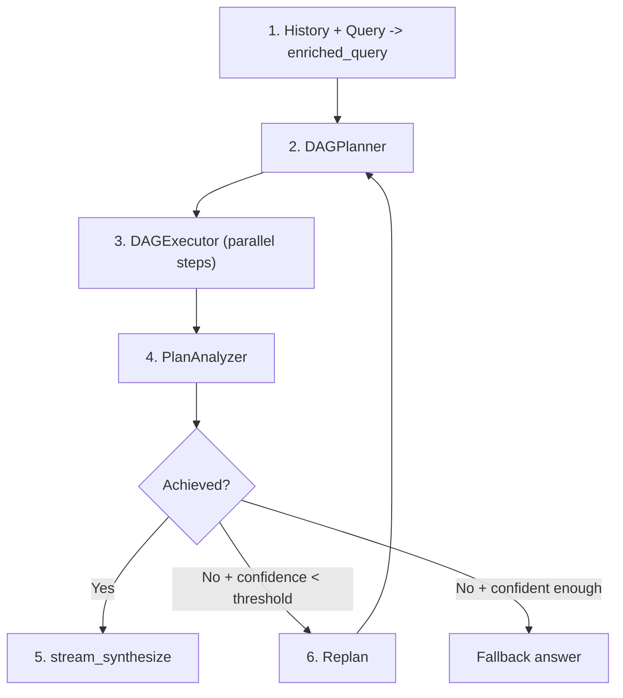
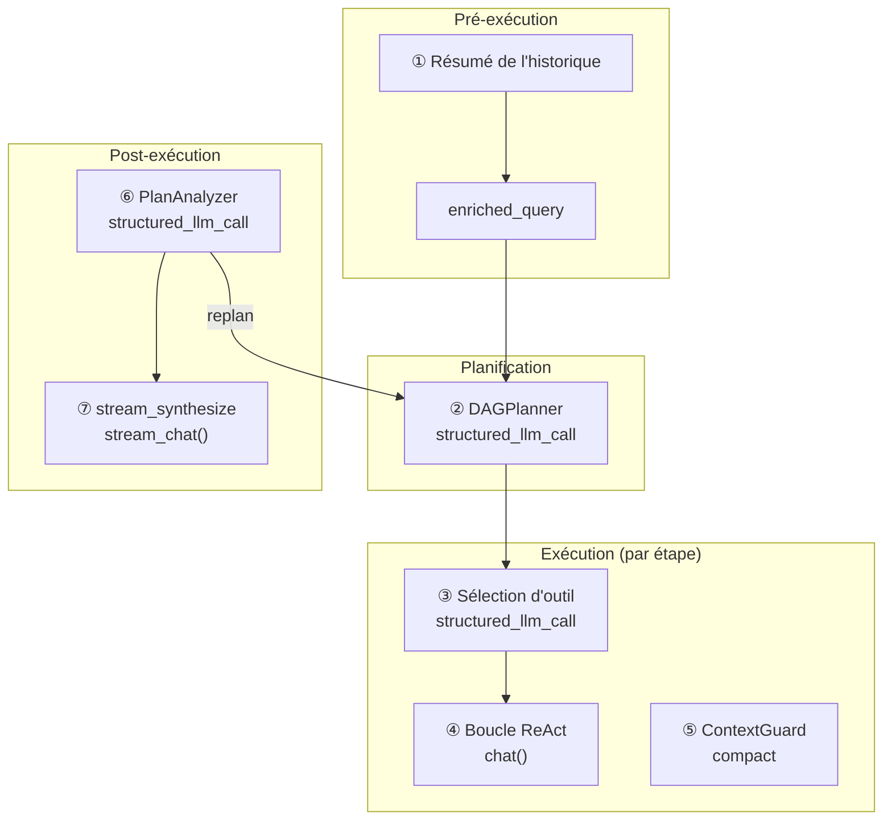
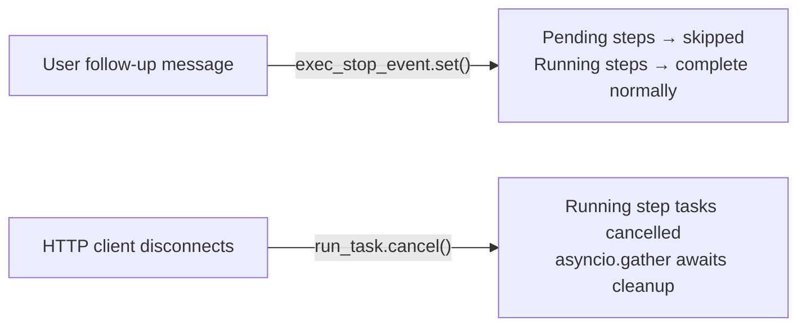

## Le pipeline

Le mode DAG décompose un objectif complexe en un graphe acyclique dirigé d'étapes, les exécute avec un parallélisme maximal, puis réfléchit à savoir si l'objectif a réellement été atteint. Si ce n'est pas le cas, il replanifie et réessaie — de manière autonome, jusqu'à un budget configurable.

Le pipeline comporte quatre phases qui forment une boucle :

**Planification.** Le LLM intelligent décompose la requête enrichie en 2-6 étapes avec des arêtes de dépendance explicites. Chaque étape reçoit une description de tâche, un indice d'outil optionnel et un indice de modèle qui contrôle si elle s'exécute sur le LLM rapide ou intelligent.

**Exécution.** Le DAGExecutor lance les étapes indépendantes en parallèle (jusqu'à 5 concurrentes), en respectant le graphe de dépendance. Chaque étape s'exécute en tant qu'agent ReAct autonome sans mémoire — elle reçoit uniquement sa description de tâche et les résultats de ses dépendances complétées.

**Analyse.** Le PlanAnalyzer évalue si le plan exécuté a atteint l'objectif initial, produisant un verdict structuré : `achieved` (booléen), `confidence` (0.0-1.0), `reasoning` et un `final_answer` optionnel.

**Replanification.** Si l'objectif n'a pas été atteint et que la confiance est inférieure au seuil d'arrêt, le pipeline revient à la planification avec un contexte de replanification qui résume ce qui s'est passé et ce qui n'a pas fonctionné. Cette boucle s'exécute jusqu'à `DAG_MAX_REPLAN_ROUNDS` fois de manière autonome.

Deux LLMs collaborent tout au long du processus : un **LLM intelligent** gère la planification, l'analyse et la synthèse des réponses (tâches nécessitant une capacité de raisonnement élevée), tandis qu'un **LLM rapide** gère l'exécution des étapes et la compaction du contexte (tâches où le coût et la latence importent plus que le raisonnement maximal). Chaque appel de sortie structuré utilise `structured_llm_call`, qui fournit une chaîne de dégradation à 3 niveaux (Native FC, JSON Mode, texte brut avec secours regex) pour gérer les particularités de sortie spécifiques au modèle.

## Carte des appels LLM

Le pipeline DAG complet effectue sept catégories distinctes d'appels LLM. Comprendre où chaque appel se produit, quel modèle le gère et ce qui se passe en cas d'échec est essentiel pour le débogage et l'optimisation des coûts.

| # | Site d'appel | Module | Rôle LLM | Format | Secours |
|---|-----------|--------|----------|--------|----------|
| 1 | Résumé de l'historique | chat.py | LLM rapide | texte brut | tronquer les 20K derniers caractères |
| 2 | DAGPlanner | planner.py | LLM intelligent | structured\_llm\_call | dégradation 3 niveaux |
| 3 | Sélection d'outil | react.py | LLM étape | structured\_llm\_call | retourner tous les outils |
| 4 | Boucle ReAct (par étape) | react.py | LLM rapide/intelligent | chat() | réessai/secours |
| 5 | ContextGuard compact | context\_guard.py | LLM rapide | texte brut | smart\_truncate |
| 6 | PlanAnalyzer | analyzer.py | LLM intelligent | structured\_llm\_call | regex + défaut |
| 7 | stream\_synthesize | analyzer.py | LLM intelligent | stream\_chat() | analysis.final\_answer |

Les appels 1 et 5 sont **invisibles pour l'utilisateur** — ce sont des appels d'infrastructure qui gèrent la taille du contexte. Les appels 2, 6 et 7 utilisent le **LLM intelligent** car ils nécessitent une capacité de raisonnement élevée (décomposition des objectifs, jugement de réussite, synthèse de réponses cohérentes). Les appels 3 et 4 utilisent le **LLM rapide** par défaut car chaque étape DAG doit être une tâche ciblée et délimitée — bien qu'une étape avec `model_hint: null` puisse être promue au LLM intelligent via le registre de modèles.

## DAGPlanner

Le travail du planificateur est de transformer un objectif de haut niveau en un DAG valide d'étapes concrètes et exploitables. Il le fait avec un seul appel `structured_llm_call` au LLM intelligent.

**Conception du prompt.** Le prompt de planification injecte la date et l'année actuelles (pour que le LLM puisse planifier des recherches conscientes du temps), applique la correspondance des langues (les descriptions de tâches doivent utiliser la même langue que l'objectif) et limite le nombre d'étapes à 2-6. Chaque étape a cinq champs : `id`, `task`, `dependencies`, `tool_hint` et `model_hint`. Le prompt décourage explicitement de diviser les sous-tâches trivialement liées — « si plusieurs vérifications peuvent être effectuées dans un seul script, combinez-les en UNE étape. »

**Extraction structurée.** Le planificateur utilise `structured_llm_call` avec un `_PLAN_SCHEMA` qui définit le schéma du tableau `steps` et une `parse_fn` qui convertit les dicts bruts en objets `PlanStep`. Si le LLM retourne un objet d'étape unique au lieu d'un wrapper `{"steps": [...]}`, l'analyseur se récupère automatiquement. La chaîne de dégradation à 3 niveaux documentée dans [ReAct Engine — structured\_llm\_call](/architecture/react-engine#structured_llm_call--unified-output-extraction) gère les particularités de sortie du modèle entre les fournisseurs.

**Validation du DAG.** Après l'extraction, le planificateur valide la structure du graphe en utilisant l'algorithme de Kahn pour le tri topologique. Deux invariants sont vérifiés :

1. **Pas de références en suspens.** Si une étape référence un ID de dépendance qui n'existe pas dans le plan, la référence est silencieusement supprimée avec un journal d'avertissement. C'est un mécanisme de récupération — les LLMs omettent parfois les étapes qu'ils ont référencées, et un arrêt brutal gaspillerait l'appel de planification entier.

2. **Pas de cycles.** Si l'algorithme de Kahn ne peut pas visiter tous les nœuds (ce qui signifie qu'au moins un cycle existe), le planificateur lève une `ValueError`. Les cycles sont irrécupérables — un plan cyclique ne peut pas être exécuté.

**model\_hint.** Le planificateur assigne `"fast"` aux étapes qu'il considère comme simples et déterministes (recherche de données, conversion de format, récupération directe) et `null` aux étapes nécessitant un raisonnement plus profond. L'exécuteur utilise cet indice pour sélectionner le LLM approprié par étape. En cas de doute, le prompt demande au LLM d'utiliser `null` — il est toujours plus sûr d'utiliser le modèle plus capable.

**Construction de l'entrée.** La requête enrichie combine l'historique de conversation avec la demande actuelle. Si la conversation est longue, l'historique est chargé via `DbMemory` et formaté comme `"Previous conversation: ..."`. Lorsque la requête enrichie résultante dépasse 16K tokens (estimée via `CompactUtils.estimate_tokens`), elle est résumée par le LLM en utilisant le prompt d'indice `planner_input` de ContextGuard avant d'être transmise au planificateur. Le repli lorsqu'aucun LLM rapide n'est disponible : tronquer en dur aux 20K derniers caractères.

## DAGExecutor

L'exécuteur prend un `ExecutionPlan` validé et exécute ses étapes de manière concurrente, en respectant les dépendances et en appliquant les limites de ressources.

**Modèle de concurrence.** Un `asyncio.Semaphore` limite l'exécution parallèle des étapes à `max_concurrency` (5 par défaut, configurable via la variable d'environnement `MAX_CONCURRENCY`). La boucle de dispatch identifie toutes les étapes dont les dépendances sont terminées, les lance en tant qu'instances `asyncio.Task`, et attend qu'au moins une se termine avant de vérifier à nouveau. Les étapes sont lancées dans l'ordre des ID triés pour un comportement déterministe.

**Agent ReAct par étape.** Chaque étape s'exécute en tant qu'agent ReAct indépendant créé par `_resolve_agent()`. Si l'étape a un `model_hint` qui correspond à un rôle dans le `ModelRegistry`, un agent temporaire est créé avec le LLM correspondant. Sinon, l'agent LLM rapide par défaut est utilisé. Ces agents par étape n'ont **pas de mémoire** — ils commencent à zéro avec uniquement la description de leur tâche, l'objectif initial, les indices d'outils, et les résultats des dépendances terminées. Cet isolement est intentionnel : les étapes du DAG doivent être des unités de travail autonomes qui ne fuient pas d'état à travers le graphe.

**Injection du contexte de dépendance.** `_build_step_context()` formate les résultats de toutes les étapes de dépendance terminées dans un bloc de texte : l'ID de chaque dépendance, le statut, la description de la tâche, et le résultat. Si un `ContextGuard` est configuré et que le contexte combiné dépasse `max_message_chars`, il est tronqué brutalement avec un suffixe `[Dependency context truncated]`. Cela empêche une étape qui dépend de plusieurs prédécesseurs verbeux de dépasser sa propre fenêtre de contexte.

**Délai d'expiration de l'étape.** Chaque étape est enveloppée dans `asyncio.wait_for` avec un délai d'expiration par défaut de 600 secondes (10 minutes). Si une étape dépasse ce délai, elle est annulée et marquée comme `"failed"` avec un message de délai d'expiration. Le délai d'expiration est par étape, pas par plan — un plan de 5 étapes peut théoriquement s'exécuter pendant 50 minutes si les étapes s'exécutent séquentiellement.

**Interruption et annulation.** L'exécuteur a deux chemins d'annulation distincts, chacun déclenché par un événement différent :

*Saut gracieux — événement d'arrêt.* Quand un utilisateur envoie un message de suivi pendant l'exécution, l'orchestrateur dans `chat.py` définit `exec_stop_event`. L'exécuteur vérifie ce drapeau au début de chaque cycle de dispatch : s'il est défini, toutes les étapes `pending` restantes sont immédiatement marquées `"skipped"` avec la raison `"Skipped — user changed requirements"`, et la boucle se termine. Les étapes déjà en cours d'exécution sont autorisées à se terminer — seules les étapes non démarrées sont abandonnées. Cette sortie rapide permet au pipeline de se replanner autour de l'intention mise à jour de l'utilisateur sans attendre que le plan original complet se termine.

*Abandon immédiat — annulation asyncio.* Quand le client HTTP se déconnecte, `chat.py` annule la tâche de niveau supérieur `run_task` via `asyncio.Task.cancel()`. L'exécuteur capture `asyncio.CancelledError`, annule toutes les tâches d'étape actuellement en cours d'exécution, attend qu'elles reconnaissent via `asyncio.gather(..., return_exceptions=True)`, puis relève l'exception. La déconnexion du client est détectée en interrogeant `await request.is_disconnected()` toutes les 0,5 secondes à l'intérieur de la boucle d'événements SSE.

La différence sémantique est importante : **événement d'arrêt** signifie « ignorer ce qui n'a pas commencé, mais préserver ce qui est déjà en cours » — les résultats des étapes terminées restent disponibles pour informer la replanification. **CancelledError** signifie « abandonner tout immédiatement » — tout le travail en vol est supprimé sans récupération de résultat.

**Détection de blocage.** Si la boucle de dispatch ne trouve aucune tâche en cours d'exécution et aucune étape prête à être lancée (parce que leurs dépendances ont échoué), toutes les étapes `pending` restantes sont marquées `"failed"` avec un message expliquant que leurs dépendances ne se sont jamais terminées. Cela empêche l'exécuteur de rester bloqué indéfiniment.

**Rappels de progression.** L'exécuteur déclenche des rappels `(step_id, event, data)` pour trois types d'événements : `"started"` (étape lancée), `"iteration"` (appel d'outil dans une étape), et `"completed"` (étape terminée). La couche SSE dans `chat.py` relie ces rappels aux événements `step_progress` que le frontend utilise pour rendre la visualisation du DAG en temps réel.

## PlanAnalyzer

L'analyseur évalue si le plan exécuté a atteint l'objectif initial. Il produit un `AnalysisResult` structuré avec quatre champs :

- **`achieved`** (booléen) — `true` uniquement si l'objectif a été pleinement réalisé.
- **`confidence`** (float, 0.0-1.0) — le degré de certitude de l'analyseur dans son évaluation. Les sources qui se contredisent réduisent ce score.
- **`final_answer`** (chaîne ou null) — une réponse synthétisée lorsque l'objectif est atteint, `null` sinon.
- **`reasoning`** (chaîne) — la justification de la chaîne de pensée du LLM.

**Extraction structurée.** L'analyseur utilise `structured_llm_call` avec `_ANALYSIS_SCHEMA`, une `parse_fn` qui gère la coercition de type et le clamping de confiance, et une `regex_fallback` pour le JSON malformé. La regex fallback (`_regex_extract_analysis`) extrait les champs `achieved`, `confidence`, `final_answer` et `reasoning` du JSON partiellement valide en utilisant la correspondance de motifs. Cela importe car les réponses d'analyse ont tendance à être plus longues et complexes que les réponses de planification, rendant les erreurs de formatage JSON plus probables.

**Valeur par défaut sûre.** Si tous les niveaux d'extraction échouent (FC natif, mode JSON, texte brut, regex), l'analyseur retourne `AnalysisResult(achieved=False, confidence=0.0, reasoning="Could not parse analysis response")`. Cela garantit que le pipeline obtient toujours un résultat utilisable — une défaillance d'analyse devient un verdict « non atteint », qui déclenche une nouvelle planification plutôt que de causer un crash.

**Formatage du résultat d'étape.** Le résultat de chaque étape est tronqué à 10K caractères dans l'invite d'analyse. Cela empêche la sortie détaillée d'une seule étape (par exemple, un grand web scrape ou un dump de fichier) de dominer la fenêtre de contexte de l'analyseur et d'éclipser les résultats des autres étapes.

**Comparaison multi-sources.** L'invite d'analyse inclut une directive pour comparer explicitement les résultats de différentes sources. Lorsque les résultats de recherche web, la récupération de la base de connaissances et les opérations de fichiers contribuent tous des données, l'analyseur doit signaler les contradictions (nombres, dates, affirmations différents) et indiquer quelle source est probablement plus fiable. Les contradictions réduisent le score de confiance, ce qui à son tour influence la décision de nouvelle planification.

## Re-planification

La boucle de re-planification est la caractéristique la plus distinctive du moteur DAG : elle peut se rétablir de manière autonome des défaillances partielles en réfléchissant à ce qui s'est mal passé et en essayant une approche différente.

**Logique de décision.** Après chaque cycle plan-exécution-analyse, l'orchestrateur dans `chat.py` évalue le résultat de l'analyse :

1. **`achieved == True`** — quitter la boucle, procéder à la synthèse en streaming.
2. **Injection utilisateur survenue pendant ce cycle** — toujours re-planifier, indépendamment de la confiance ou du budget. Les messages de suivi de l'utilisateur sont traités comme des changements de spécifications qui exigent une nouvelle tentative. Cela ne consomme pas le budget de re-planification autonome.
3. **Budget de re-planification autonome épuisé** — quitter la boucle. Le budget est `max_replan_rounds - 1` re-planifications autonomes (par défaut : 2 re-planifications autonomes à partir d'un budget de 3 cycles au total).
4. **`confidence >= replan_stop_confidence`** — quitter la boucle. Même si l'objectif n'a pas été entièrement atteint, un score de confiance élevé (seuil par défaut : 0.8, configurable via `DAG_REPLAN_STOP_CONFIDENCE`) indique que l'analyseur est assez certain de ce qui s'est passé — la re-planification est peu susceptible d'aider.
5. **Sinon** — re-planifier. L'objectif n'a pas été atteint, la confiance est faible et le budget reste disponible.

**Contexte de re-planification.** Lors de la re-planification, l'orchestrateur appelle `_format_replan_context()` pour construire un résumé du cycle précédent. Cela inclut le raisonnement de l'analyseur et un aperçu tronqué du résultat de chaque étape (500 caractères maximum par étape). La troncature agressive est délibérée : le planificateur doit savoir *ce qui s'est passé* et *ce qui s'est mal passé*, pas les détails complets de la sortie de chaque étape. Ce contexte est transmis à `DAGPlanner.plan()` en tant que paramètre `context`, aux côtés de la requête enrichie originale.

**Cycles maximum.** La variable d'environnement `DAG_MAX_REPLAN_ROUNDS` (par défaut 3) contrôle le nombre total de cycles de planification. Avec les paramètres par défaut, le premier cycle est le plan initial, laissant jusqu'à 2 re-planifications autonomes. Les re-planifications déclenchées par l'utilisateur (via injection de message) ne comptent pas contre ce budget — un utilisateur peut diriger le pipeline indéfiniment.

**Événement SSE.** Lorsque le pipeline décide de re-planifier, il émet un événement de phase `replanning` contenant le raisonnement de l'analyseur. Le frontend l'utilise pour montrer à l'utilisateur pourquoi le pipeline réessaie.

**Accumulation d'enriched\_query.** Les messages de suivi de l'utilisateur sont ajoutés à la requête enrichie entre les cycles : `enriched_query += "\n\n[User follow-up]: {content}"`. Cela signifie que le planificateur voit l'évolution complète de l'intention de l'utilisateur — la demande originale plus toutes les clarifications ultérieures — lors de la construction d'un plan révisé.

## Synthèse en continu

Lorsque l'analyseur confirme que l'objectif a été atteint (`analysis.achieved == True`), le pipeline diffuse une réponse finale synthétisée à l'utilisateur via `PlanAnalyzer.stream_synthesize()`.

**Entrée.** L'appel de synthèse reçoit trois entrées : l'objectif original, les résultats des étapes formatés (10 000 caractères max par étape) et le raisonnement de l'analyseur provenant de l'appel d'analyse non-continu. Le raisonnement fournit une « feuille de route » pour ce que la synthèse doit couvrir.

**Invite système.** L'invite de synthèse demande au LLM de répondre directement sans méta-commentaires (« ne PAS inclure de phrases comme 'selon les résultats' »), de correspondre à la langue de l'objectif original et de comparer les résultats de différentes sources le cas échéant. Une directive de langue provenant des préférences utilisateur est ajoutée si disponible.

**Continu.** La méthode utilise `stream_chat()` pour produire les jetons de manière progressive. La couche SSE encapsule chaque bloc dans un événement `answer` avec `status: "delta"`, permettant au frontend un rendu en temps réel de la réponse finale.

**Chaîne de secours.** Deux chemins de secours gèrent les défaillances :

1. **stream\_synthesize lève une exception** — revenir à `analysis.final_answer` de l'appel `analyze()` non-continu. Cette réponse a déjà été générée lors de l'analyse, elle est donc disponible même si l'appel en continu échoue.

2. **Objectif non atteint (pas de synthèse tentée)** — concaténer tous les résultats des étapes complétées, séparés par des traits horizontaux. Chaque résultat est préfixé par son ID d'étape. Si aucune étape n'est complétée du tout, retourner `"(goal not achieved)"`.

La conception de secours garantit que l'utilisateur reçoit toujours une réponse — dégradée mais jamais vide.

## Architecture à deux LLM

Le profil de coût et de latence du moteur DAG est façonné par sa conception à double modèle. La division du travail est :

| Rôle | Utilisé pour | Optimisé pour |
|------|----------|---------------|
| **LLM intelligent** | Planification, analyse, synthèse de réponses | Capacité de raisonnement |
| **LLM rapide** | Exécution d'étapes, compaction de contexte, résumé d'historique | Coût et latence |

Le LLM intelligent gère les trois appels qui nécessitent le raisonnement le plus profond : décomposer un objectif en un plan cohérent, juger si le plan a atteint l'objectif, et synthétiser une réponse finale qui intègre de manière cohérente les résultats de plusieurs étapes. Ces appels se produisent une fois par tour (ou une fois au total pour la synthèse), donc leur coût par token plus élevé est amorti.

Le LLM rapide gère les appels à haut volume : la boucle ReAct de chaque étape DAG (qui peut impliquer plusieurs appels d'outils et itérations), la compaction de contexte lorsque les contextes d'étapes deviennent trop volumineux, et la résumé d'historique pour les conversations multi-tours. Un plan à 5 étapes avec 3 itérations par étape signifie 15+ appels au LLM rapide — utiliser le LLM intelligent ici serait prohibitivement coûteux.

**Remplacement par étape.** Le champ `model_hint` sur chaque `PlanStep` permet au planificateur de promouvoir des étapes individuelles au LLM intelligent. Lorsque `model_hint` est `null`, l'exécuteur utilise l'agent par défaut (LLM rapide). Lorsqu'il est `"fast"`, l'exécuteur utilise explicitement le LLM rapide via le registre de modèles. Le planificateur est invité à définir `"fast"` pour les tâches déterministes et `null` pour le raisonnement complexe, mais il peut également être défini sur n'importe quel rôle personnalisé enregistré dans le `ModelRegistry`. La résolution du modèle se produit **une fois par étape** via `_resolve_agent()` immédiatement avant le début de la boucle ReAct de cette étape — toutes les itérations au sein de l'étape (sélection d'outils, boucle ReAct, compaction ContextGuard) utilisent le même LLM résolu. Le modèle ne change jamais en cours d'étape.

**Indépendance du budget.** Les LLM intelligent et rapide ont des budgets de contexte indépendants, calculés à partir de leurs configurations de modèle respectives. L'exécution des étapes DAG utilise le budget du LLM rapide ; les appels de planification et d'analyse utilisent le budget du LLM intelligent. C'est important car les opérateurs associent souvent un modèle à grand contexte (128K+) pour la planification avec un modèle plus petit et plus rapide (32K) pour l'exécution d'étapes. Pour plus de détails sur le calcul des budgets, consultez [Gestion du contexte — Configuration du budget](/architecture/context-management#layer-5--budget-configuration).
