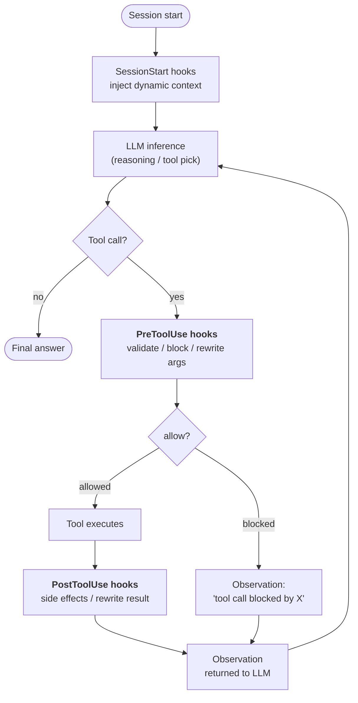
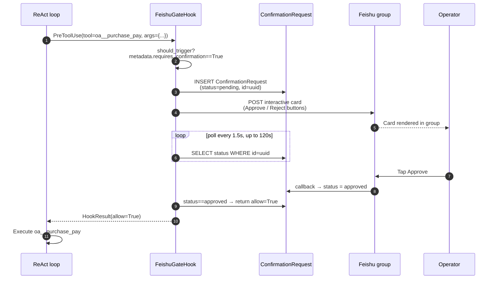

## Pourquoi les hooks existent

Les instructions dans une invite système sont des **suggestions**. Un LLM suffisamment têtu ou confus peut les ignorer. Pour la plupart des comportements d'agent, c'est exactement ce que vous voulez — les instructions donnent au modèle la possibilité de s'adapter.

Mais certaines exigences ne sont pas des suggestions. « Chaque appel d'outil sensible doit être enregistré. » « Les opérations d'écriture sont bloquées quand l'organisation est en mode lecture seule. » « Les paiements supérieurs à ¥50k nécessitent une validation humaine avant exécution. » Ce sont des **invariants** — des faits sur le système qui doivent tenir indépendamment de ce que le modèle décide à chaque tour.

Un hook est du code qui s'exécute **en dehors de la boucle LLM** à un point bien défini du cycle de vie d'exécution de l'agent. Le LLM ne peut pas voir le hook. Le LLM ne peut pas contester le hook. Le LLM ne peut pas convaincre le hook de sauter une étape. Si un hook `PreToolUse` retourne `allow=False`, l'appel d'outil ne se produit pas — peu importe la persistance de la trace de raisonnement.

Voici la distinction architecturale critique :

| Mécanisme | Où il s'exécute | Qui le contrôle | Garantie |
|---|---|---|---|
| **Instruction d'invite système** | À l'intérieur de l'inférence LLM | Modèle | « Probablement la suit » |
| **Description / schéma d'outil** | À l'intérieur de l'inférence LLM | Modèle | « Probablement la suit » |
| **Hook** | Autour de l'inférence LLM | Code de plateforme | **S'exécute toujours** |

Les hooks sont comment FIM One transforme « l'agent est supposé... » en « l'agent ne peut pas contourner... ».

## Où les hooks se connectent

Trois points de hook sont définis aujourd'hui. Chacun marque une limite que l'agent franchit lors d'une itération de boucle :



| Point de hook | S'active quand | Peut-il bloquer ? | Peut-il muter les données ? |
|---|---|---|---|
| `SessionStart` | Avant le premier appel LLM d'une session | Non | Oui — injecte du contexte dans la prompt initiale |
| `PreToolUse` | Après que le LLM choisisse un outil, avant que l'outil s'exécute | **Oui** (via `allow=False`) | Oui — peut réécrire `tool_args` avant l'exécution |
| `PostToolUse` | Après que l'outil retourne, avant que l'observation ne soit envoyée au LLM | Non | Oui — peut réécrire l'observation |

Plusieurs hooks au même point s'exécutent dans l'ordre de priorité. Les args réécrits d'un hook `PreToolUse` antérieur sont transmis aux hooks ultérieurs, de sorte que les middleware se composent.

## Quand utiliser un hook plutôt qu'une instruction

Décider s'il faut résoudre une exigence avec une instruction de prompt ou un hook revient au même calcul que « assertion à l'exécution vs. commentaire de code » :

| Symptôme | Solution |
|---|---|
| « L'agent devrait préférer X quand Y » | Instruction — guidance souple, le modèle a de la latitude |
| « L'agent doit enregistrer chaque appel au connecteur Z » | **Hook PostToolUse** — on ne peut pas compter sur la mémoire du modèle |
| « Les paiements supérieurs à ¥50k nécessitent une approbation humaine » | **Hook PreToolUse** — on ne peut pas compter sur le modèle pour demander |
| « L'agent devrait se présenter en chinois » | Instruction — stylistique, coût faible en cas d'oubli |
| « L'agent ne peut pas écrire dans la base de données de production en mode lecture seule » | **Hook PreToolUse** — invariant de sécurité, tolérance zéro |
| « L'agent devrait résumer les résultats de longues requêtes DB » | Peut être l'un ou l'autre, mais un hook est plus robuste — voir PostToolUse truncate |

Règle empirique : **si le mauvais comportement est un incident, utilisez un hook. Si le mauvais comportement est une légère gêne, une instruction suffit.**

## Le contrat du hook

Un hook est une sous-classe de `PreToolUseHook`, `PostToolUseHook`, ou `SessionStartHook` avec une méthode requise :

```python
class ReadOnlyGuard(PreToolUseHook):
    name = "readonly_guard"
    priority = 5                          # lower runs earlier

    def should_trigger(self, ctx: HookContext) -> bool:
        return ctx.tool_name.startswith("sql_")

    async def execute(self, ctx: HookContext) -> HookResult:
        if org_is_readonly(ctx.metadata["org_id"]):
            return HookResult(
                allow=False,
                error="Org is in read-only mode — write blocked.",
                side_effects=["readonly_guard: blocked sql write"],
            )
        return HookResult()               # default: allow=True, no mutation
```

Le `HookContext` transmis contient `tool_name`, `tool_args`, `agent_id`, `user_id`, et un dictionnaire `metadata` flexible que le moteur remplit avec des faits par requête (identifiant org, identifiant conversation, le drapeau `requires_confirmation` de l'action du connecteur, …).

Le `HookResult` retourné contrôle le résultat :

- `allow: bool = True` — si l'appel d'outil procède (ignoré pour `PostToolUse` / `SessionStart`)
- `error: str | None` — raison lisible par l'homme, présentée au LLM comme l'observation en cas de blocage
- `modified_args: dict | None` — si défini, remplace les arguments de l'outil avant l'exécution
- `modified_result: Any | None` — si défini (PostToolUse), remplace l'observation avant qu'elle ne revienne au LLM
- `side_effects: list[str]` — piste d'audit de ce que le hook a fait, fusionnée dans la trace de l'agent

## Étude de cas : `FeishuGateHook`

Le premier hook déployé sur ce système est `FeishuGateHook` — un hook `PreToolUse` qui transforme tout outil marqué `requires_confirmation=True` en une carte d'approbation interactive affichée dans le groupe Feishu de l'organisation.

Ce hook exerce le cycle de vie complet :



Ce design apporte :

- **L'appel d'outil est véritablement suspendu.** Le flux SSE de l'agent s'interrompt entre « Je vais appeler `oa__purchase_pay` » et l'observation. L'utilisateur voit l'agent en attente, ce qui correspond à ce qui se passe en arrière-plan.
- **L'approbation survit à un redémarrage du processus.** La ligne en attente est dans la base de données, pas en mémoire. Si le backend redémarre pendant qu'une carte est en attente, le prochain sondage reprend là où il s'était arrêté.
- **La décision est auditée.** `ConfirmationRequest` conserve `payload`, `responded_at`, `responded_by_open_id` et le statut final — un enregistrement auditable de qui a approuvé quoi et quand.
- **Pas de LLM dans la boucle de décision.** Le modèle produit l'appel d'outil. Les humains produisent le verdict. Le hook est le pont déterministe.

`FeishuGateHook` dépend d'un [Canal Feishu](/configuration/channels/feishu) configuré — le hook envoie la carte via la méthode `send_interactive_card()` du canal et écoute les événements de rappel que le canal a analysés. La séparation est intentionnelle : le hook gère la « machine d'état d'approbation », le canal gère la « mécanique de la plateforme IM ». Le même hook pourrait cibler Slack ou WeCom demain sans changer sa logique — seule l'implémentation du canal changerait.

## Crochets planifiés (v0.9)

Quatre modèles de crochets sont sur la feuille de route v0.9, tous réutilisant le même cycle de vie :

| Crochet | Point | Objectif |
|---|---|---|
| `AuditLogHook` | PostToolUse | Écrire automatiquement `ConnectorCallLog` à chaque appel de connecteur. Aujourd'hui, c'est manuel ; en faire un crochet garantit la couverture. |
| `ReadOnlyGuard` | PreToolUse | Bloquer les écritures lorsque l'organisation est en mode lecture seule. |
| `ResultTruncateHook` | PostToolUse | Tronquer les observations d'outils surdimensionnées (>8k caractères) avant qu'elles n'atteignent le contexte du LLM. |
| `ConnectorRateLimitHook` | PreToolUse | Limite de fréquence d'appel par connecteur par utilisateur, indépendante des limites de débit du LLM. |

Une couche de crochet définie par l'utilisateur est également planifiée : configuration YAML par agent (`hooks: [...]`) déclarant des commandes shell ou des callables Python à exécuter sur les événements d'outils correspondants. Cela suit le même modèle que les frameworks d'agents modernes (Claude Code, OpenDevin) ont convergé — l'application basée sur les crochets maintient la logique « doit toujours se produire » en dehors des prompts.

## Hooks vs. Channels

Les deux abstractions résolvent des problèmes orthogonaux :

| Concept | Ce qu'il modélise | Durée de vie | Exemple |
|---|---|---|---|
| **Hook** | Un point dans l'exécution de l'agent où le code de la plateforme s'exécute | Par appel d'outil | `FeishuGateHook`, `AuditLogHook` |
| **Channel** | Un adaptateur enfichable vers une plateforme de messagerie externe | Long terme par organisation | `FeishuChannel`, `SlackChannel` prévu |

Les Hooks consomment les Channels — un hook qui doit communiquer avec le monde extérieur (envoyer une carte, publier une alerte, escalader vers un groupe) appelle le Channel de l'organisation. Un channel sans aucun hook l'utilisant est toujours utile (par exemple, les agents peuvent envoyer proactivement des notifications via un outil), mais le modèle d'approbation spécifiquement nécessite que les deux parties soient en place.

Autrement dit : **Les Channels sont la « plomberie » pour « où parler aux humains », les Hooks sont la « politique » pour « quand dois-je parler aux humains »**. Les workflows de production avec humain dans la boucle nécessitent les deux.

## État actuel (v0.8.4)

Snapshot de ce qui a été livré et ce qui est encore à venir :

- ✅ Primitives `HookRegistry`, `HookContext`, `HookResult` intégrées dans ReAct et DAG
- ✅ Bases abstraites `PreToolUseHook` / `PostToolUseHook` / `SessionStartHook`
- ✅ `FeishuGateHook` — complet, incluant la table `ConfirmationRequest`, la boucle de polling, le timeout/expiration et les changements d'état pilotés par callback
- ✅ Point de terminaison de callback du canal Feishu qui décode `card.action.trigger` et met à jour la ligne en attente
- ✅ Déclarations de hook au niveau de l'agent : `agent.model_config_json.hooks.class_hooks` se résout en une `HookRegistry` instanciée à chaque session ReAct/DAG
- 🟡 **Héritage des hooks entre les surfaces d'exécution** (v0.8.5) : le chemin de chat principal (Portal, API, DAG) déclenche les hooks. Eval Center contourne intentionnellement les hooks (l'évaluation automatisée ne doit pas être bloquée par une approbation humaine). Les sous-agents délégués (`CallAgentTool`) et les nœuds Workflow `AGENT` n'héritent actuellement pas des hooks parents — la politique d'héritage est un point de décision pour v0.8.5.
- ❌ `AuditLogHook`, `ReadOnlyGuard`, `ResultTruncateHook`, `ConnectorRateLimitHook` (v0.9)
- ❌ Déclarations de hook YAML définies par l'utilisateur (v0.9)

Le Hook System est une **fondation porteuse** pour le durcissement de production v0.9. Son premier utilisateur (`FeishuGateHook`) est également une fonctionnalité de production à part entière, c'est pourquoi le squelette a été livré tôt pour la démonstration du 2026-04-24 plutôt que d'attendre le catalogue complet des hooks.
