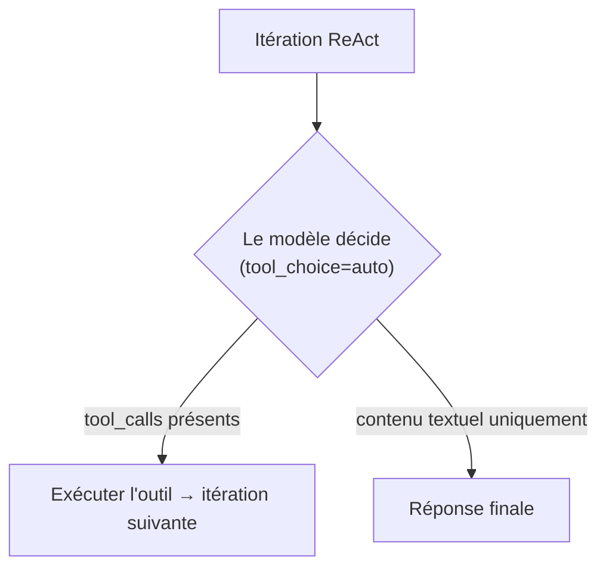
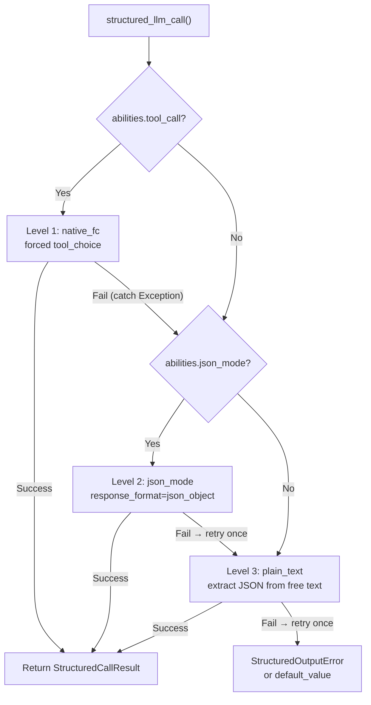
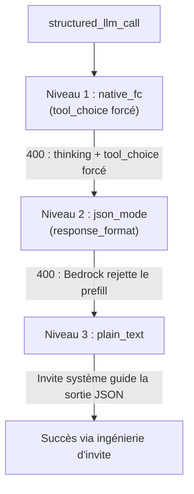

## Détection du fournisseur

FIM One utilise LiteLLM comme adaptateur universel. La fonction `_resolve_litellm_model()` dans `core/model/openai_compatible.py` mappe l'`LLM_BASE_URL` + `LLM_MODEL` de l'utilisateur à un identifiant de modèle LiteLLM avec un préfixe de fournisseur. Le préfixe détermine comment LiteLLM achemine la requête — protocole API natif (Anthropic Messages API, Gemini, etc.) ou générique OpenAI-compatible `/v1/chat/completions`.

Ordre de résolution :

1. **Fournisseur explicite** (champ DB `ModelConfig.provider`) — priorité la plus élevée. Si le fournisseur correspond à un domaine connu dans l'URL, aucun `api_base` n'est renvoyé (LiteLLM achemine nativement). Sinon, `api_base` est défini sur l'URL de relais.
2. **Correspondance de domaine** par rapport à `KNOWN_DOMAINS` — les points de terminaison API officiels sont reconnus par nom d'hôte.
3. **Indice de chemin d'URL** par rapport à `PATH_PROVIDER_HINTS` — courant sur les plateformes de relais comme UniAPI où `/claude` ou `/anthropic` dans le chemin indique le protocole en amont.
4. **Secours** — préfixe `openai/` (générique OpenAI-compatible).

| Domaine / Chemin | Préfixe du fournisseur | Protocole |
|---|---|---|
| `api.openai.com` | `openai/` | OpenAI Chat Completions |
| `anthropic.com` | `anthropic/` | Anthropic Messages API |
| `generativelanguage.googleapis.com` | `gemini/` | Google Gemini |
| `api.deepseek.com` | `deepseek/` | DeepSeek (OpenAI-compatible) |
| `api.mistral.ai` | `mistral/` | Mistral |
| Le chemin contient `/claude` ou `/anthropic` | `anthropic/` | Anthropic Messages API (via relais) |
| Le chemin contient `/gemini` | `gemini/` | Google Gemini (via relais) |
| Tout le reste | `openai/` | Générique OpenAI-compatible |

Lorsque le préfixe du fournisseur est un protocole natif (anthropic, gemini, etc.) et que l'URL n'est pas le point de terminaison officiel, LiteLLM utilise le protocole natif mais envoie les requêtes à l'`api_base` du relais. Cela signifie que les comportements spécifiques au fournisseur — y compris le problème de prefill Bedrock décrit ci-dessous — s'appliquent indépendamment du fait que la requête aille à l'API officielle ou via un relais.

<Warning>
Si votre URL de relais contient `/claude` dans le chemin, FIM One achemine automatiquement via le protocole natif d'Anthropic. C'est généralement correct (meilleur streaming, support de la réflexion), mais cela signifie que les comportements spécifiques au fournisseur s'appliquent — y compris le problème de prefill Bedrock décrit ci-dessous.
</Warning>

## tool_choice — les quatre modes

Le paramètre `tool_choice` est standardisé via le format OpenAI. LiteLLM le traduit vers le protocole natif de chaque fournisseur avant d'envoyer la requête.

| Mode | Signification | Support des fournisseurs |
|---|---|---|
| `"auto"` | Le modèle décide s'il faut appeler un outil ou répondre avec du texte | Tous les fournisseurs |
| `"required"` | Doit appeler un outil, mais le modèle choisit lequel | La plupart des fournisseurs |
| `{"type":"function","function":{"name":"X"}}` | Doit appeler la fonction X spécifiquement | La plupart des fournisseurs — **incompatible avec la réflexion Anthropic** |
| `"none"` | Impossible d'utiliser les outils, texte uniquement | Tous les fournisseurs |

La distinction entre `"auto"` et forcé (`{"type":"function",...}`) est au cœur de chaque problème de compatibilité dans FIM One. Ces deux modes sont utilisés par des sous-systèmes complètement différents avec des exigences différentes.

## Où tool_choice est utilisé

Deux sous-systèmes utilisent `tool_choice`, et ils l'utilisent de manières fondamentalement différentes.

### Moteur ReAct — tool_choice="auto"

La boucle ReAct nécessite que le modèle décide à chaque itération : appeler un outil ou donner une réponse finale. Seul `"auto"` a du sens ici — le modèle choisit librement entre produire des `tool_calls` ou du contenu textuel. Ceci est compatible avec tous les fournisseurs, tous les modèles et tous les modes, y compris la réflexion étendue.



Le moteur ReAct utilise l'appel de fonction natif (`_run_native`) quand `abilities["tool_call"] = True`, en se repliant sur le mode JSON-dans-le-contenu (`_run_json`) sinon. Les deux modes utilisent `"auto"` — la différence est que les outils sont passés via le paramètre `tools` ou décrits dans l'invite système. Voir [Moteur ReAct — Exécution en mode dual](/architecture/react-engine#dual-mode-execution) pour plus de détails.

### structured_llm_call — tool_choice=forced

Extraction structurée en une seule tentative (annotation de schéma, planification DAG, analyse de plan). Force le modèle à appeler une fonction virtuelle spécifique, garantissant une sortie JSON structurée. C'est le site d'appel qui déclenche les erreurs spécifiques au fournisseur.

`structured_llm_call` implémente une chaîne de dégradation à 3 niveaux :



La différence de conception critique : le fallback de `structured_llm_call` est **à l'exécution** — il essaie dynamiquement chaque niveau et capture les exceptions pour passer au suivant. La sélection de mode du moteur ReAct est **au moment de la compilation** — elle vérifie `_native_mode_active` une seule fois au démarrage et s'engage sur un mode pour l'ensemble de la boucle. Cela signifie que `structured_llm_call` peut récupérer de manière transparente les erreurs 400 spécifiques au fournisseur, tandis que ReAct s'appuie sur le fait que le mode soit correctement choisi dès le départ.

## Le piège du prefill Bedrock

Quand `response_format={"type":"json_object"}` est passé pour un modèle résolu avec le préfixe `anthropic/`, LiteLLM injecte en interne un message de prefill assistant pour simuler le mode JSON. L'API Messages d'Anthropic n'a pas de paramètre natif `response_format`, donc LiteLLM l'approxime en ajoutant une accolade ouvrante comme contenu assistant :

```json
{"role": "assistant", "content": "{"}
```

Cela fonctionne sur l'API directe d'Anthropic. Cependant, les versions plus récentes des modèles AWS Bedrock rejettent toute conversation dont le dernier message a `role: "assistant"` — ils appellent cela « assistant message prefill » et lèvent :

```
ValidationException: This model does not support assistant message prefill.
The conversation must end with a user message.
```

Cette erreur se produit uniquement quand **les trois conditions** sont remplies simultanément :

1. Le modèle est résolu avec le préfixe `anthropic/` (via correspondance de domaine ou indice de chemin URL).
2. `response_format={"type":"json_object"}` est passé (le chemin de code json_mode dans `structured_llm_call`).
3. Le backend réel est AWS Bedrock (qui rejette le prefill).

<Warning>
Cela n'affecte PAS l'appel d'outil natif (`tool_choice="auto"` avec le paramètre `tools=`). L'injection de prefill se produit uniquement pour `response_format`. L'exécution de l'agent ReAct n'est complètement pas affectée.
</Warning>

Le chemin d'échec en pratique ressemble à ceci :



Quand le Niveau 1 (conflit thinking) et le Niveau 2 (prefill Bedrock) échouent tous les deux, le système récupère toujours au Niveau 3 — mais au coût de deux appels LLM gaspillés par extraction structurée. La correction ci-dessous élimine l'appel json_mode gaspillé.

### Le correctif : json_mode_enabled

Un drapeau `json_mode_enabled` par modèle contrôle si le Niveau 2 (json_mode) est jamais tenté :

- **Modèles configurés par BD** : basculer dans Admin → Models → Advanced settings. Le drapeau est stocké sur `ModelConfig.json_mode_enabled` (par défaut `TRUE`).
- **Modèles configurés par ENV** : définissez `LLM_JSON_MODE_ENABLED=false` dans votre environnement.
- **Effet** : lorsqu'il est désactivé, `abilities["json_mode"]` retourne `False` → `response_format` n'est jamais passé → pas de prefill → Bedrock fonctionne. La chaîne de dégradation devient `native_fc → plain_text`, en contournant entièrement l'appel json_mode condamné.
- **Aucune perte de qualité** : le modèle retourne toujours du JSON valide car le système prompt l'impose. Le niveau plain_text utilise `extract_json()` pour analyser le JSON à partir de contenu en forme libre, ce qui fonctionne de manière fiable avec les modèles modernes.

## Anthropic thinking + forced tool_choice

L'API d'Anthropic rejette `tool_choice={"type":"function","function":{"name":"X"}}` quand la réflexion étendue est activée. L'erreur :

```
Thinking may not be enabled when tool_choice forces tool use
```

Il s'agit d'un conflit sémantique au niveau du protocole : forcer un appel d'outil spécifique contredit la liberté du modèle de raisonner sur l'outil à appeler (ou s'il faut en appeler un). Anthropic applique cette contrainte ; les autres fournisseurs ne le font pas.

Le conflit **affecte uniquement** le niveau 1 de `structured_llm_call` (native_fc), qui utilise `tool_choice` forcé pour garantir une sortie structurée. Le `try/except` existant dans `_call_llm` capture la réponse 400 et bascule vers json_mode ou plain_text. Aucune gestion spéciale n'est nécessaire dans le dictionnaire `abilities`.

De manière cruciale, `tool_choice="auto"` fonctionne parfaitement avec la réflexion Anthropic activée. Le moteur ReAct utilise `"auto"` exclusivement, il n'est donc jamais affecté.

<Warning>
NE définissez PAS `abilities["tool_call"] = False` pour contourner le conflit thinking + forced tool_choice. Cela désactiverait le mode `_run_native` de ReAct (qui utilise `tool_choice="auto"` et fonctionne bien avec la réflexion), le forçant dans le mode `_run_json`. En mode `_run_json`, le modèle doit produire du JSON valide dans son contenu — ce qui est moins fiable et, sur Bedrock, pourrait déclencher le problème de prefill si json_mode est activé. La correction correcte est de laisser la chaîne de secours `structured_llm_call` la gérer.
</Warning>

## Référence rapide : ce qui fonctionne où

| Scénario | Mode ReAct | chemin structured_llm_call | Notes |
|---|---|---|---|
| OpenAI (n'importe quel modèle) | `_run_native` | native_fc | Support complet, sans restrictions |
| Anthropic (sans thinking) | `_run_native` | native_fc | Support complet |
| Anthropic + thinking | `_run_native` | native_fc → 400 → json_mode | Repli automatique, un appel gaspillé |
| Relais Bedrock (sans thinking) | `_run_native` | native_fc | Support complet |
| Relais Bedrock + thinking | `_run_native` | native_fc → 400 → json_mode → 400 → plain_text | Deux appels gaspillés ; définir `json_mode_enabled=false` |
| Relais Bedrock + `json_mode_enabled=false` | `_run_native` | native_fc → 400 → plain_text | Configuration recommandée pour Bedrock avec thinking |
| Relais Bedrock (sans thinking) + `json_mode_enabled=false` | `_run_native` | native_fc | Pas d'impact — native_fc réussit au premier essai |
| Gemini | `_run_native` | native_fc | Support complet |
| DeepSeek | `_run_native` | native_fc | Support complet |
| Compatible OpenAI générique | `_run_native` | native_fc | Support complet |
| N'importe quel modèle avec `tool_call=false` | `_run_json` | json_mode ou plain_text | Repli pour les modèles sans support d'appel d'outil |

**Configuration recommandée pour les relais AWS Bedrock :**

```bash
# Dans .env ou environnement
LLM_JSON_MODE_ENABLED=false
```

Ou par modèle dans l'interface d'administration : Admin → Models → sélectionnez le modèle Bedrock → Advanced → désactivez « JSON Mode ».

Cela élimine tous les appels inutiles. Le chemin de dégradation devient `native_fc → plain_text` (sans réflexion) ou `native_fc → 400 → plain_text` (avec réflexion). Les deux chemins sont rapides et fiables.

## Effort de raisonnement et configuration de la réflexion

FIM One expose deux variables d'environnement pour contrôler la réflexion étendue / le raisonnement :

| Variable | Valeurs | Effet |
|---|---|---|
| `LLM_REASONING_EFFORT` | `low`, `medium`, `high` | Passé en tant que `reasoning_effort` à LiteLLM. Anthropic : mappé au paramètre `thinking`. OpenAI o-series : passé directement. Autres : silencieusement supprimé (`drop_params=True`). |
| `LLM_REASONING_BUDGET_TOKENS` | entier (ex. `10000`) | Anthropic uniquement : définit un plafond explicite `thinking.budget_tokens`, contournant le mappage automatique de LiteLLM. Utile pour contrôler les coûts sur les modèles Claude. |

Lorsque `reasoning_effort` est défini et que le modèle est résolu en tant que `anthropic/`, deux comportements supplémentaires s'appliquent :

1. **La température est forcée à 1.0.** Bedrock rejette `temperature != 1.0` lorsque la réflexion est activée. FIM One gère cela automatiquement — aucune action utilisateur nécessaire.
2. **GPT-5.x avec outils** : `reasoning_effort` est silencieusement supprimé lorsque des `tools` sont présents, car le point de terminaison GPT-5 `/v1/chat/completions` rejette la combinaison. Cela n'affecte que la boucle d'outil ReAct ; les appels `structured_llm_call` qui manquent d'un paramètre `tools` ne sont pas affectés.

## Dépannage

**« This model does not support assistant message prefill »**
Bedrock + json_mode. Définissez `LLM_JSON_MODE_ENABLED=false` ou désactivez JSON Mode dans les paramètres du modèle d'administration.

**« Thinking may not be enabled when tool_choice forces tool use »**
Anthropic thinking + appel de fonction forcé dans `structured_llm_call`. C'est un **comportement attendu, pas une erreur**. La chaîne de secours capture l'erreur 400, ignore native_fc et réussit avec json_mode ou plain_text. Le journal est au niveau DEBUG — vous ne le verrez que si `LOG_LEVEL=DEBUG`. Coût : ~300 ms d'aller-retour réseau, zéro token (le modèle ne s'exécute jamais sur une erreur 400). Aucune action requise.

**ReAct bascule vers JSON mode de manière inattendue**
Vérifiez que `abilities["tool_call"]` du modèle est `True`. C'est toujours `True` pour `OpenAICompatibleLLM`, mais une sous-classe `BaseLLM` personnalisée pourrait le remplacer. Vérifiez avec le point de terminaison de détail du modèle dans l'API d'administration.

**structured_llm_call épuise tous les niveaux et lève StructuredOutputError**
Le modèle n'a pas pu produire de JSON analysable à aucun niveau. C'est rare avec les modèles modernes. Vérifiez : (1) le schéma est un JSON Schema valide, (2) le modèle a suffisamment de `max_tokens` pour produire la réponse complète, (3) l'invite système ne contredit pas les instructions du schéma. Le planificateur DAG et l'analyseur fournissent tous deux des secours `default_value`, donc cette erreur ne se propage que depuis les sites d'appel qui omettent explicitement les valeurs par défaut.
